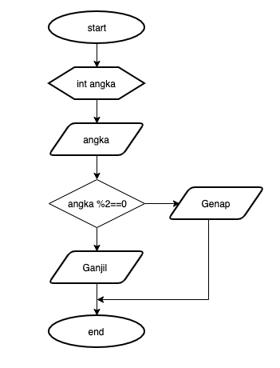
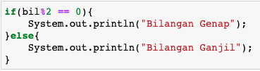
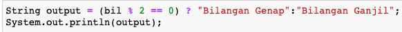
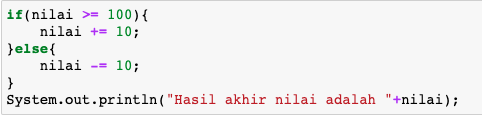
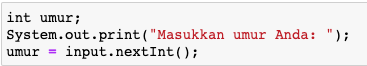
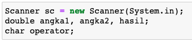
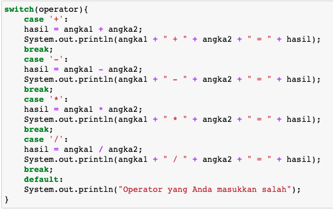
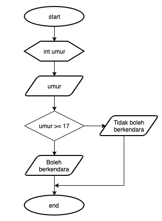

## JOBSHEET 5

## PEMILIHAN 1

### Tujuan

Mahasiswa mampu menyelesaikan permasalahan/studi kasus menggunakan sintaks pemilihan 1 dan mengimplemantasikannya dalam bahasa pemrogaman java.

### Alat dan Bahan
+ PC/laptop
+ Browser(chrome, firefox, safari)
+ Koneksi internet

### Praktikum

#### Percobaan 1 : Penggunaan if

#### Waktu percobaan : 40 menit

1. Perhatikan flowchart dibawah ini!

    <p align="left">
    
    </p>
    

> Flowchart diatas digunakan untuk menentukan bilangan ganjil/genap, selanjutnya kita akan membuat programnya berdasarkan
> flowchart di atas!

2. Tambahkan library Scanner, deklarasi Scanner, dan buat variabel bil untuk menampung data yang diinput melalui keyboard

    


```Java
import java.util.Scanner;
Scanner input = new Scanner (System.in);
int bil;
System.out.print("Masukkan sebuah bilangan: "); 
bil = input.nextInt();
```

    Masukkan sebuah bilangan: 15


Perintah import memiliki fungsi dalam menambahkan library scanner. kemudian dilakukan deklarasi scanner dan membuat variabel bil untuk menampung data. Kode diatas digunakan untuk mengambil data yang telah ditampung berupa bilangan bulat, yang kemudian akan dimasukkan ke dalam kondisi dibawah ini dan di cek.

3. Buatlah struktur kondisi untuk mengecek apakah bilangan tersebut merupakan bilangan genap atau ganjil

    


```Java
if(bil % 2 == 0){
    System.out.println("Bilangan Genap"); 
}else{
    System.out.println("Bilangan Ganjil"); 
}
```

    Bilangan Ganjil


Setelah kondisi diatas dibuat, kita dapat mengecek secara langsung setelah dijalankan. Apakah bilangan yang kita masukkan pada kode diatas merupakan bilangan genap atau ganjil. Secara otomatis, setelah program dijalankan maka akan muncul keterangan bahwa angka yang dimasukkan yaitu 10, merupakan bilangan genap.

##### Pertanyaan
1. Modifikasi program diatas dibagian struktur pemilihannya sehingga menjadi sebagai berikut:

    


```Java
String output = (bil % 2 == 0) ? "Bilangan Genap" : "Bilangan Ganjil"; 
System.out.print(output); 
```

    Bilangan Ganjil

Output program yang dimodifikasi sama dengan output sebelum dimodifikasi karena, kode yang dimasukkan sama yaitu (bil % 2 == 0). kode tersebut ada di kedua program. Yang membedakan adalah cara penulisannya, yang dimodifikasi menggunakan ternary operator.

2. Jalankan dan amatilah hasilnya!
3. Jelaskan mengapa output program yang dimodifikasi sama dengan output program sebelum dimodifikasi!

#### Percobaan 2 : Penggunaan if else

#### Waktu percobaan : 40 menit

+ Buatlah sebuah variabel nilai untuk menyimpan inputan dari keyboard

    


```Java
import java.util.Scanner;
Scanner input = new Scanner (System.in);
int nilai; 
System.out.print("Masukkan sebuah bilangan: "); 
nilai = input.nextInt();
 
```

    Masukkan sebuah bilangan: 15


Menggunakan scanner untuk menginput bilangan

+ Tambahkan sebuah kondisi untuk mengecek input pada variabel nilai

    


```Java
if(nilai >=100){
    nilai += 10;
}else{
    nilai -= 10;
}
System.out.println("Hasil akhir nilai adalah "+nilai);


```

    Hasil akhir nilai adalah 5


Dengan memasukkan bilangan 15, maka hasil akhir nilai adalah 5. Karena, if nilai >100, yaitu 15 maka nilai akhir adalah 5, karena 15 dikurangi 10. 

Jawaban pertanyaan: 
1. nilai +10 artinya bilangan yang kita masukkan akan ditambah 10, dan sebaliknya


+ Jalankan program. Amati apa yang terjadi!

##### Pertanyaan
1. Jelaskan fungsi kode program berikut:
    
    ```
    nilai+=10;
    nilai-=10;
    ```

2. Modifikasilah program diatas dimana inputannya yang awalnya hanya satu kemudian diganti 2 inputan (misal : nilai1 dan nilai2), lakukan perhitungan rata-rata kedua nilai tersebut jika nilainya lebih dari sama dengan 100 maka dikurangi 5, sedangkan jika nilai rata-rata tersebut kurang dari 100 maka akan langsung dicetak!

#### Percobaan 3 : Penggunaan if else-if else

#### Waktu percobaan : 40 menit

+ Tambahakan library `Scanner`
+ Buatlah deklarasi `Scanner`
+ Buat variabel umur bertipe `int`

    


```Java
import java.util.Scanner;
Scanner input = new Scanner (System.in);
int umur; 
System.out.print("Masukkan umur Anda: "); 
umur = input.nextInt();
```

    Masukkan umur Anda: 18


Menambahkan library scanner, kemudian membuat deklarasi scanner, kemudian menginput umur. Pada program diatas, saya menginput umur 18

+ Kode untuk melakukan pengecekan variabel `umur`

    


```Java
if(umur > 60)
    System.out.println("Lansia"); 
else if (umur > 45)
    System.out.println("Tua");
else if (umur > 17)
    System.out.println("Dewasa"); 
else if (umur > 5)
    System.out.println("Anak-anak"); 
else
    System.out.println("Balita");
```

    Dewasa


Dalam program tersebut tertulis bahwa jika umur lebih dari 60 tahun disebut lansia, jika input <60, maka sistem akan mengecek ke else if (berikutnya) 
jika umur lebih dari 45 tahun disebut tua, jika input  <45, maka sistem akan mengecek ke else if (berikutnya) 
jika umur lebih dari 17 tahun maka disebut dewasa, jika input <17, maka mengecek ke else if (berikutnya) 
jika umur lebih dari 5 tahun maka disebut anak-anak,jika input umur <5 artinya sistem langsung mengatakan bahwa umur tersebut adalah balita. Sebabagai contoh diatas, saya memasukkan umur 18, maka muncul dewasa karena >17 tahun. 

+ Jalankan program dan amati apa yang terjadi!

##### Percobaan 4 : Penggunaan switch-case

#### Waktu percobaan : 40 menit

1. Deklarasikan Scanner
1. Buatlah variabel-variabel berikut

    


```Java
import java.util.Scanner;
Scanner sc = new Scanner(System.in); 
double angka1, angka2, hasil;
char operator;  
```

Menggunakan scanner untuk menginput angka 1, angka 2, dan operator untuk menghasilkan hasil yang diinginkan setelah ditambahkan operator di kedua angka. 

3. Kode program untuk meminta inputan dari keyboard

    


```Java
System.out.print("Masukkan angka pertama: "); 
angka1 = sc.nextDouble();
System.out.print("Masukkan angka kedua: "); 
angka2 = sc.nextDouble();
System.out.print("Masukkan operator (+ - */): "); 
operator = sc.next().charAt(0);
```

    Masukkan angka pertama: 10
    Masukkan angka kedua: 5
    Masukkan operator (+ - */): /


Menginput angka pertama, angka kedua, dan operator. 

4. Kode di bawah ini untuk melakukan pengecekan operator yang digunakan sebelum dilakukan operasi aritmatika

    


```Java
switch(operator){
    case '+':
    hasil = angka1 + angka2; 
    System.out.println(angka1 + " + " + angka2 + " = " + hasil); 
    break; 
    case '-':
    hasil = angka1 - angka2; 
    System.out.println(angka1 + " - " + angka2 + " = " + hasil); 
    break; 
    case '*':
    hasil = angka1 * angka2; 
    System.out.println(angka1 + " * " + angka2 + " = " + hasil); 
    case '/':
    hasil = angka1 / angka2; 
    System.out.println(angka1 + " / " + angka2 + " = " + hasil); 
    break; 
    default: 
    System.out.println("Operator yang Anda masukkan salah"); 
}
```

    10.0 / 5.0 = 2.0


Program diatas berguna untuk memunculkan hasil setelah menginput angka pertama, angka kedua, dan operator. Sebagai contoh saya memasukkan angka pertama 10 dan angka kedua 5, dengan operator bagi (/), sehingga menghasilkan angka 2 dari operasi bilangan diatas.  

5. Jalankan program. Amati apa yang terjadi!

##### Pertanyaan
1. Jelaskan fungsi dari break dan default pada percobaan 4 diatas!
2. Jelaskan fungsi perintah kode program dibawah ini pada percobaan 4!

    ```
    operator = sc.next().chartAt(0);
    ```

### Tugas

#### Waktu pengerjaan Tugas: 140 menit

1. Buatlah program untuk menginputkan dua buah bilangan bulat, kemudian mencetak salah satu bilangan yang nilainya terbesar.
2. Perhatikan flowchart berikut ini:



> Buatlah program sesuai dengan flowchart diatas!

3. Pada akhir semester seorang dosen menghitung nilai akhir dari mahasiswa yang terdiri dari nilai uas, uts, kuis, dan tugas. Nilai akhir didapatkan dari 40% nilai uas, 30% nilai uts, 10% nilai kuis, dan 20% nilai tugas. Jika nilai akhir dari mahasiswa dibawah 65 maka mahasiswa tersebut akan mendapatkan remidi. Buatlah program untuk membantu mengetahui mahasiswa yang mendapatkan remidi berdasarkan nilai akhir yang didapatkannya!

4. Sebuah toko memberikan diskon kepada pelanggannya dengan ketentuan sebagai berikut:

| Total Belanja     | Potongan |
|-------------------|----------|
| >Rp. 200.000,00   | 2%       |
| >Rp. 500.000,00   | 5%       |
| >Rp. 1.000.000,00 | 10%      |

> Total belanja diperoleh dari pembelian tiga barang yaitu barang A, barang B, dan barang C. Ketika menginputkan harga barang juga menginputkan jumlah barang yang dibeli.

Contoh outputnya
```
Masukkan harga barang A   :100000
Masukkan jumlah barang A  :10
Masukkan harga barang B   :250000
Masukkan jumlah barang B  :5
Masukkan harga barang C   :150000
Masukkan jumlah barang C  :1
---------------------------------------------
                Struk total
---------------------------------------------
Nama Barang 	| 	Harga 	| 	Jumlah 	| 	Total
Barang A            100000         10        1000000   
Barang B            250000         5         1250000   
Barang C            150000         1         150000    
Total       :2400000
Diskon      :240000.0
Total Bayar :2160000.0
```


```Java
import java.util.Scanner;
Scanner sc = new Scanner(System.in);

System.out.print("A: ");
int a = sc.nextInt();

System.out.print("B: ");
int b = sc.nextInt();

if(a > b) {
    System.out.println(a);
}else{
    System.out.println(b);
}
```

    A: 7
    B: 18
    18


1. Menggunakan scanner untuk menginput dua bilangan bulat yang ingin dibandingkan, untuk menentukan mana yang lebih besar. jika kondisi (a>b) maka yang di munculkan adalah a. sedangkan jika (b>a) maka  yang dimunculkan b


```Java
import java.util.Scanner;
Scanner sc = new Scanner(System.in);

System.out.print("Umur: ");
int umur = sc.nextInt();

if(umur >= 17) {
System.out.println("Boleh berkendara");
}else{
System.out.println("Tidak boleh berkendara");
}
```

    Umur: 15
    Tidak boleh berkendara


2. Menggunakan scanner untuk menginputkan umur kemudian ditentukan apakah umur tersebut termasuk umur yang boleh berkendara atau tidak. Dengan keterangan jika umur > 17 maka boleh berkendara (if) sedangkan jika umur sebaliknya atau <17 maka tidak boleh berkendara (else). Ketika saya menginput umur 15, sistem memunculkan bahwa umur 15 tidak boleh berkendara karena <17

3. Pada akhir semester seorang dosen menghitung nilai akhir dari mahasiswa yang terdiri dari nilai uas, uts, kuis, dan tugas. Nilai akhir didapatkan dari 40% nilai uas, 30% nilai uts, 10% nilai kuis, dan 20% nilai tugas. Jika nilai akhir dari mahasiswa dibawah 65 maka mahasiswa tersebut akan mendapatkan remidi. Buatlah program untuk membantu mengetahui mahasiswa yang mendapatkan remidi berdasarkan nilai akhir yang didapatkannya!


```Java
import java.util.Scanner;
Scanner sc = new Scanner(System.in);

int uas, uts, kuis, tugas, nilaiAkhir;

System.out.print("Masukkan nilai uas\t\t: ");
uas = sc.nextInt();
System.out.print("Masukkan nilai uts\t\t: ");
uts = sc.nextInt();
System.out.print("Masukkan nilai kuis\t\t: ");
kuis = sc.nextInt();
System.out.print("Masukkan nilai tugas\t\t: ");
tugas = sc.nextInt();

nilaiAkhir = (uas * 40/100 + uts * 30/100 + kuis * 10/100 + tugas * 20/100); 
System.out.println("Nilai akhir: " + nilaiAkhir);

if(nilaiAkhir < 65) {
    System.out.println("Remidi");
}else{
    System.out.println("Tidak remidi");
}
```

    Masukkan nilai uas		: 90
    Masukkan nilai uts		: 96
    Masukkan nilai kuis		: 87
    Masukkan nilai tugas		: 93
    Nilai akhir: 90
    Tidak remidi


Menggunakan scanner untuk menginput data nilai seorang siswa agar mendapat nilai akhir, dengan keterangan remidi atau tidak remidi. Nilai akhir, didapatkan dari nilai uas dikali 40% + uts dikali 30% + kuis dikali 10% + tugas 20%. Ditulis pada program, seperti 40% ditulis 40/100 karena menggunakan tipe data Int, agar dapat ke detect dengan sistem. Telah dicoba menggunakan 0.4 tertulis terjadi kesalahan dalam merubah data double menjadi Int. Sehingga diperoleh nilai akhir dari keempat nilai yang didapat selama 1 semester. Nilai akhir tersebut memiliki keterangan selanjutnya (dengan menggunakan if else), jika nilai akhir <65 maka siswa tersebut remidi. Setelah diinput, berdasar data yang saya masukkan, didapatkan hasil akhir bahwa siswa tersebut tidak remidi, karena nilai akhirnya diatas 65. 


```Java
import java.util.Scanner;
Scanner sc = new Scanner(System.in);

int jumlahA, hargaA, jumlahB,  hargaB, jumlahC, hargaC;

System.out.print("Masukkan harga barang A\t\t: ");
hargaA = sc.nextInt();
System.out.print("Masukkan jumlah barang A\t: ");
jumlahA = sc.nextInt();
System.out.print("Masukkan harga barang B\t\t: ");
hargaB = sc.nextInt();
System.out.print("Masukkan jumlah barang B\t: ");
jumlahB = sc.nextInt();
System.out.print("Masukkan harga barang C\t\t: ");
hargaC = sc.nextInt();
System.out.print("Masukkan jumlah barang C\t: ");
jumlahC = sc.nextInt();

int totalA = hargaA * jumlahA;
int totalB = hargaB * jumlahB;
int totalC = hargaC * jumlahC;

int total = totalA + totalB + totalC;

double diskon = 0;

if (total >= 1000000) {
    diskon = total * 10 / 100;
} else if (total >= 500000) {
    diskon = total * 5 / 100;
} else if (total >= 200000) {
    diskon = total * 2 / 100;
}

System.out.println("----------------------------------------");
System.out.println("              Struk Total");
System.out.println("----------------------------------------");
System.out.println("Nama Barang\t\t\t\tHarga\t\t\t\tJumlah\t\t\t\tTotal\t\t\t\t");
System.out.println("Barang A\t\t\t\t"+hargaA+"\t\t\t\t"+jumlahA+"\t\t\t\t" + totalA);
System.out.println("Barang B\t\t\t\t"+hargaB+"\t\t\t\t"+jumlahB+"\t\t\t\t" + totalB);
System.out.println("Barang C\t\t\t\t"+hargaC+"\t\t\t\t"+jumlahC+"\t\t\t\t" + totalC);
System.out.println("Total\t\t\t: " + total);
System.out.println("Diskon\t\t\t: " + diskon);
System.out.println("Total Bayar\t\t: " + (total - diskon));
```

    Masukkan harga barang A		: 15000
    Masukkan jumlah barang A	: 6
    Masukkan harga barang B		: 30000
    Masukkan jumlah barang B	: 3
    Masukkan harga barang C		: 25000
    Masukkan jumlah barang C	: 4
    ----------------------------------------
                  Struk Total
    ----------------------------------------
    Nama Barang				Harga				Jumlah				Total				
    Barang A				15000				6				90000
    Barang B				30000				3				90000
    Barang C				25000				4				100000
    Total			: 280000
    Diskon			: 5600.0
    Total Bayar		: 274400.0


```Java
Menggunakan scanner untuk menginput harga barang A,B,C ; menginput jumlah barang A,B,C; Dengan adanya keterangan jika total belanja >1000000 maka mendapat diskon 10%, jika total belanja >500000 maka mendapat diskon 5%, total belanja >2000000 maka mendapat diskon 2% sehingga diperoleh hasil akhir berupa struk total pembelanjaan. 
```
