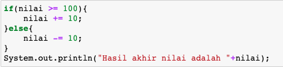
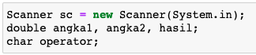

## JOBSHEET 5

## PEMILIHAN 1

### Tujuan

Mahasiswa mampu menyelesaikan permasalahan/studi kasus menggunakan sintaks pemilihan 1 dan mengimplemantasikannya dalam bahasa pemrogaman java.

### Alat dan Bahan
+ PC/laptop
+ Browser(chrome, firefox, safari)
+ Koneksi internet

### Praktikum

#### Percobaan 1 : Penggunaan if

#### Waktu percobaan : 40 menit

1. Perhatikan flowchart dibawah ini!

    <p align="left">
    
    </p>
    

> Flowchart diatas digunakan untuk menentukan bilangan ganjil/genap, selanjutnya kita akan membuat programnya berdasarkan
> flowchart di atas!

2. Tambahkan library Scanner, deklarasi Scanner, dan buat variabel bil untuk menampung data yang diinput melalui keyboard

    


```Java
// Ketik kode program di atas di bawah sini
import java.util.Scanner;
Scanner input = new Scanner(System.in);
int bil;
System.out.print("Masukkan sebuah bilangan: ");
bil = input.nextInt();
```

    Masukkan sebuah bilangan: 11


> untuk baris pertama kode "import java.util.Scanner" digunakan untuk memanggil library default java yaitu Scanner yang fungsinya untuk mengambil input-an user.
pada baris selanjutnya digunakan untuk mendefinisikan variabel input dengan tipe data Scanner dan variabel bil dengan tipe data integer.
untuk sintaks "System.out.print" digunakan untuk menampilkan output ke layar.
untuk baris terakhir digunakan untuk mengambil input-an user, dengan tipe data integer, dan disimpan kedalam variabel bil.
___

3. Buatlah struktur kondisi untuk mengecek apakah bilangan tersebut merupakan bilangan genap atau ganjil

    


```Java
// Ketik kode program di atas di bawah sini
if (bil % 2 == 0) {
  System.out.println("Bilangan Genap");
}else{
  System.out.println("Bilangan Ganjil");
}
```

    Bilangan Ganjil


> kode program di atas digunakan untuk mencari jenis bilangan apa variabel `bil` tersebut, dengan menggunakan kondisi jika modulo `bil` sama dengan 0, maka akan menghasilkan output 'Bilangan Genap', jika tidak maka akan menghasilkan output 'Bilangan Ganjil'
___

##### Pertanyaan
1. Modifikasi program diatas dibagian struktur pemilihannya sehingga menjadi sebagai berikut:

    


```Java
// Ketik kode program di atas di bawah sini
String output = (bil % 2 == 0) ? "Bilangan Genap" : "Bilangan Ganjil";
System.out.println(output);
```

    Bilangan Ganjil


> dalam variabel `output` menggunakan Aturan Penulisan Ternary Operator, ini untuk mempersingkat penulisan if-else menjadi 1 baris kode, dengan output yang sama.
___

2. Jalankan dan amatilah hasilnya!
3. Jelaskan mengapa output program yang dimodifikasi sama dengan output program sebelum dimodifikasi!

#### Percobaan 2 : Penggunaan if else

#### Waktu percobaan : 40 menit

+ Buatlah sebuah variabel nilai untuk menyimpan inputan dari keyboard

    


```Java
// Ketik kode program di atas di bawah sini
int nilai;
System.out.println("Masukkan sebuah bilangan: ");
nilai = input.nextInt();
```

    Masukkan sebuah bilangan: 100


> sintaks diatas digunakan untuk menerima input-an user berupa bilangan desimal bertipe data integer, dan disimpan kedalam variabel `nilai`.
___

+ Tambahkan sebuah kondisi untuk mengecek input pada variabel nilai

    


```Java
// Ketik kode program di atas di bawah sini
if (nilai >= 100){
  nilai += 10;
}else{
  nilai -= 10;
}
```

+ Jalankan program. Amati apa yang terjadi!

> melakukan pengecekan terhadap variabel `nilai`, jika bernilai lebih dari sama dengan 100 maka variabel `nilai` akan ditambah 10, jika tidak maka dikurangi 10.
___

##### Pertanyaan
1. Jelaskan fungsi kode program berikut:
    
    ```
    nilai+=10;
    nilai-=10;
    ```

2. Modifikasilah program diatas dimana inputannya yang awalnya hanya satu kemudian diganti 2 inputan (misal : nilai1 dan nilai2), lakukan perhitungan rata-rata kedua nilai tersebut jika nilainya lebih dari sama dengan 100 maka dikurangi 5, sedangkan jika nilai rata-rata tersebut kurang dari 100 maka akan langsung dicetak!

> Jawaban Pertanyaan 1 =>
`nilai+=10;` berarti variabel `nilai` akan ditambahkan secara langsung dengan angka 10 itu sama artinya dengan `nilai = nilai + 10;`, begitu juga dengan pengurangan.
___


```Java
// Jawaban No.2
int nilai1, nilai2;
double total;

System.out.println("Masukkan sebuah bilangan 1: ");
nilai1 = input.nextInt();
System.out.println("Masukkan sebuah bilangan 2: ");
nilai2 = input.nextInt();

total = (nilai1 + nilai2) / 2;

if (total >= 100){
  nilai -= 5;
}
System.out.println(String.format("Nilai rata-rata: %.2f", total));
```

    Masukkan sebuah bilangan 1: 95
    Masukkan sebuah bilangan 2: 90


    Nilai rata-rata: 92.00


#### Percobaan 3 : Penggunaan if else-if else

#### Waktu percobaan : 40 menit

+ Tambahakan library `Scanner`
+ Buatlah deklarasi `Scanner`
+ Buat variabel umur bertipe `int`

    


```Java
// Ketik kode program di atas di bawah sini
int umur;
System.out.println("Masukkan umur Anda: ");
umur = input.nextInt();
```

    Masukkan umur Anda: 19


> membuat variabel `umur` bertipe data integer, dan membuat input-an user kemudian disimpan kedalam variabel tersebut.
___

+ Kode untuk melakukan pengecekan variabel `umur`

    


```Java
// Ketik kode program di atas di bawah sini
if(umur > 60)
  System.out.println("Lansia");
else if (umur > 45)
  System.out.println("Tua");
else if (umur > 17)
  System.out.println("Dewasa");
else if (umur > 5)
  System.out.println("Anak-Anak");
else
  System.out.println("Balita");
```

    Dewasa


> melakukan pengecekan pada variabel `umur`, jika umur lebih besar dari 60, maka output-nya 'Lansia', jika lebih dari 45 'Tua', jika lebih dari 17 'Dewasa', jika lebih dari 5 'Anak-Anak', selain itu maka 'Balita'.
___

+ Jalankan program dan amati apa yang terjadi!

##### Percobaan 4 : Penggunaan switch-case

#### Waktu percobaan : 40 menit

1. Deklarasikan Scanner
1. Buatlah variabel-variabel berikut

    


```Java
// Ketik kode program di atas di bawah sini
Scanner sc = new Scanner(System.in);
double angka1, angka2, hasil;
char operator;
```

> mendefinisikan variabel `sc` dengan tipe data `Scanner`, `angka1`, `angka2`, `hasil` bertipe data double, `operator` bertipe data char
___

3. Kode program untuk meminta inputan dari keyboard

    


```Java
// Ketik kode program di atas di bawah sini
System.out.print("Masukkan angka pertama: ");
angka1 = sc.nextDouble();
System.out.print("Masukkan angka kedua: ");
angka2 = sc.nextDouble();
System.out.print("Masukkan operator (+ - * /): ");
operator = sc.next().charAt(0);
```

    Masukkan angka pertama: 95
    Masukkan angka kedua: 85
    Masukkan operator (+ - * /): -


> membuat 3 input-an user, dengan 2 tipe data double dan 1 char, `sc.next()` kode ini digunakan untuk menerima inputan berupa String/char dan `.charAt(0)` artinya mengambil huruf pada index ke-0.
___

4. Kode di bawah ini untuk melakukan pengecekan operator yang digunakan sebelum dilakukan operasi aritmatika

    


```Java
// Ketik kode program di atas di bawah sini
switch (operator){
  case '+':
    hasil = angka1 + angka2;
    System.out.println(angka1 + " + " + angka2 + " = " + hasil);
    break;
  case '-':
    hasil = angka1 - angka2;
    System.out.println(angka1 + " - " + angka2 + " = " + hasil);
    break;
  case '*':
    hasil = angka1 * angka2;
    System.out.println(angka1 + " * " + angka2 + " = " + hasil);
    break;
  case '/':
    hasil = angka1 / angka2;
    System.out.println(angka1 + " / " + angka2 + " = " + hasil);
    break;
  default:
    System.out.println("Operator yang Anda masukkan salah");
}
```

    95.0 - 85.0 = 10.0


> membuat pengecekan pada variabel `operator` untuk digunakan sebagai operator untuk variabel `angka1` dan `angka2` untuk mendapatkan hasil perhitungan yang akan disimpan pada variabel `hasil`.
___

5. Jalankan program. Amati apa yang terjadi!

##### Pertanyaan
1. Jelaskan fungsi dari break dan default pada percobaan 4 diatas!
2. Jelaskan fungsi perintah kode program dibawah ini pada percobaan 4!

    ```
    operator = sc.next().chartAt(0);
    ```

> jawaban No 1 => fungsi dari `break` adalah untuk menghentikan switch dari pengecekan agar tidak melanjutkan baris selanjutnya. `default` digunakan untuk membuat kondisi akhir jika tidak memenuhi semua kondisi yang ada pada case.
<br>
> No 2 => `sc.next()` kode ini digunakan untuk menerima inputan berupa String/char dan `.charAt(0)` artinya mengambil huruf pada index ke-0.
___

### Tugas

#### Waktu pengerjaan Tugas: 140 menit

1. Buatlah program untuk menginputkan dua buah bilangan bulat, kemudian mencetak salah satu bilangan yang nilainya terbesar.
2. Perhatikan flowchart berikut ini:


> Buatlah program sesuai dengan flowchart diatas!

3. Pada akhir semester seorang dosen menghitung nilai akhir dari mahasiswa yang terdiri dari nilai uas, uts, kuis, dan tugas. Nilai akhir didapatkan dari 40% nilai uas, 30% nilai uts, 10% nilai kuis, dan 20% nilai tugas. Jika nilai akhir dari mahasiswa dibawah 65 maka mahasiswa tersebut akan mendapatkan remidi. Buatlah program untuk membantu mengetahui mahasiswa yang mendapatkan remidi berdasarkan nilai akhir yang didapatkannya!

4. Sebuah toko memberikan diskon kepada pelanggannya dengan ketentuan sebagai berikut:

| Total Belanja     | Potongan |
|-------------------|----------|
| >Rp. 200.000,00   | 2%       |
| >Rp. 500.000,00   | 5%       |
| >Rp. 1.000.000,00 | 10%      |

> Total belanja diperoleh dari pembelian tiga barang yaitu barang A, barang B, dan barang C. Ketika menginputkan harga barang juga menginputkan jumlah barang yang dibeli.

Contoh outputnya
```
Masukkan harga barang A   :100000
Masukkan jumlah barang A  :10
Masukkan harga barang B   :250000
Masukkan jumlah barang B  :5
Masukkan harga barang C   :150000
Masukkan jumlah barang C  :1
---------------------------------------------
                Struk total
---------------------------------------------
Nama Barang 	| 	Harga 	| 	Jumlah 	| 	Total
Barang A            100000         10        1000000   
Barang B            250000         5         1250000   
Barang C            150000         1         150000    
Total       :2400000
Diskon      :240000.0
Total Bayar :2160000.0
```


```Java
// Tugas 1
int bil1, bil2, bilBesar;
Scanner input = new Scanner(System.in);

System.out.print("Masukkan bilangan pertama: ");
bil1 = input.nextInt();

System.out.print("Masukkan bilangan kedua: ");
bil2 = input.nextInt();

if (bil1 < bil2) {
  System.out.println("Bilangan " + bil1 + " lebih kecil dari " + bil2);
}else{
  System.out.println("Bilangan " + bil1 + " lebih besar dari " + bil2);
}
bilBesar = bil1 < bil2 ? bil2 : bil1;
System.out.println("Bilangan Terbesar: " + bilBesar);
```

    Masukkan bilangan pertama: 87
    Masukkan bilangan kedua: 78
    Bilangan 87 lebih besar dari 78
    Bilangan Terbesar: 87


> Penjelasan => mendefinisikan variabel `bil1`, `bil2`, `bilBesar` dengan tipe data integer, `input` dengan tipe data `Scanner`, kemudian membuat 2 inputan user dan disimpan pada variabel `bil1` dan `bil2`, lalu melakukan pengecekan terhadap 2 variabel tadi, untuk mencari bilangan yang terbesar dan disimpan kedalam variabel `bilBesar` dan ditampilkan kelayar.
___


```Java
// Tugas 2
int umur;
Scanner input = new Scanner(System.in);

System.out.print("Masukkan umur kamu : ");
umur = input.nextInt();

if(umur>=17){
  System.out.println("Boleh berkendara");
}else {
  System.out.println("Tidak boleh berkendara");
}
```

    Masukkan umur kamu : 19
    Boleh berkendara


> Penjelasan => mendefinisikan variabel `umur` dengan tipe data integer dan `input` dengan tipe data Scanner, membuat inputan integer umur, kemudian mengecek jika `umur` lebih besar sama dengan 17 maka 'Boleh berkendara', selain itu maka 'Tidak boleh berkendara'.
___


```Java
// Tugas 3
byte uas, uts, kuis, tugas;
double nilai;
Scanner input  = new Scanner(System.in);

System.out.print("Masukkan nilai uas (0-100): ");
uas = input.nextByte();
System.out.print("Masukkan Nilai uts (0-100): ");
uts = input.nextByte();
System.out.print("Masukkan nilai kuis (0-100): ");
kuis = input.nextByte();
System.out.print("Masukkan nilai tugas (0-100): ");
tugas = input.nextByte();

nilai += uas * 40/100;
nilai += uts * 30/100;
nilai += kuis * 10/100;
nilai += tugas * 20/100;

System.out.println(String.format("Nilai Anda: %.2f", nilai));
if(nilai < 65){
  System.out.println("Anda harus melakukan remidi.");
}
```

    Masukkan nilai uas (0-100): 98
    Masukkan Nilai uts (0-100): 90
    Masukkan nilai kuis (0-100): 95
    Masukkan nilai tugas (0-100): 92
    Nilai Anda: 93.00


> Penjelasan => mendefinisikan variabel `uas, uts, kuis, tugas` dengan tipe data byte, `nilai` dengan tipe data double, `input` dengan tipe data Scanner, kemudian membuat 4 inpuatan user dengan bertipe data byte, lalu semua inputan dibagi sesuai dengan persentase dari nilai tersebut dan menjumlahkan semuanya kedalam variabel `nilai`.
___


```Java
// Tugas 4
Scanner input = new Scanner(System.in);
int hargaA, jumlahA, hargaB, jumlahB, hargaC, jumlahC; 
double diskon, tagihan, total;

System.out.print("Masukan harga barang A : ");
hargaA = input.nextInt();
System.out.print("Masukan jumlah barang A : ");
jumlahA = input.nextInt();

double totalA = hargaA*jumlahA;

System.out.print("Masukan harga barang B : ");
hargaB = input.nextInt();

System.out.print("Masukan jumlah barang B : ");
jumlahB = input.nextInt();

double totalB = hargaB*jumlahB;

System.out.print("Masukan harga barang C : ");
hargaC = input.nextInt();

System.out.print("Masukan jumlah barang C : ");
jumlahC = input.nextInt();

double totalC = hargaC*jumlahC;
total = (int) totalA + (int) totalB + (int) totalC;

if( total > 1000000)
    diskon =10.0/100.0;
else if( total > 500000)
    diskon = .05;
else if( total > 200000)
    diskon = .02;
else 
    diskon = 0.0;

double potongan = total *  diskon;
tagihan = total - potongan;


System.out.println("----------------------------------------------------------------------------");
System.out.println("\t\t\t\tSTRUK TOTAL");
System.out.println("----------------------------------------------------------------------------");
System.out.println("Nama Barang \t|\t Harga \t|\t Jumlah \t|\t Total");
System.out.println("Barang A\t\t" +hargaA + "\t\t" + jumlahA + "\t\t\t" + (int) totalA);
System.out.println("Barang B\t\t" +hargaB + "\t\t" + jumlahB + "\t\t\t" + (int) totalB);
System.out.println("Barang C\t\t" +hargaC + "\t\t" + jumlahC + "\t\t\t" + (int) totalC);
System.out.println("Total\t\t: " + (int) total);
System.out.println("Diskon\t\t: " + potongan);
System.out.println("Total Bayar\t: " + tagihan);
```

    Masukan harga barang A : 100000
    Masukan jumlah barang A : 10
    Masukan harga barang B : 250000
    Masukan jumlah barang B : 5
    Masukan harga barang C : 150000
    Masukan jumlah barang C : 1


    ----------------------------------------------------------------------------
    				STRUK TOTAL
    ----------------------------------------------------------------------------
    Nama Barang 	|	 Harga 	|	 Jumlah 	|	 Total
    Barang A		100000		10			1000000
    Barang B		250000		5			1250000
    Barang C		150000		1			150000
    Total		: 2400000
    Diskon		: 240000.0
    Total Bayar	: 2160000.0


> Penjelasan => mendefinisikan semua variabel yang dibutuhkan, termasuk `Scanner`, membuat 6 inputan user berupa harga dan jumlah beli bertipe data integer, kemudian mengkalikan antara harga dengan jumlah beli dan menjumlahkan semua kedalam variabel `total`, kemudian mengecek untuk mendapatkan diskon sesuai sial, jika memenuhi kondisi maka akan masuk mendapatkan diskon dengan `total` dikurangi dengan `diskon`, kemudian mencetak Struk total.
___
