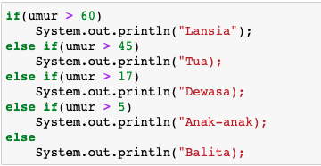

3. Buatlah struktur kondisi untuk mengecek apakah bilangan tersebut merupakan bilangan genap atau ganjil

    

## JOBSHEET 5

## PEMILIHAN 1

### Tujuan

Mahasiswa mampu menyelesaikan permasalahan/studi kasus menggunakan sintaks pemilihan 1 dan mengimplemantasikannya dalam bahasa pemrogaman java.

### Alat dan Bahan
+ PC/laptop
+ Browser(chrome, firefox, safari)
+ Koneksi internet

### Praktikum

#### Percobaan 1 : Penggunaan if

#### Waktu percobaan : 40 menit

1. Perhatikan flowchart dibawah ini!

    <p align="left">
    
    </p>
    

> Flowchart diatas digunakan untuk menentukan bilangan ganjil/genap, selanjutnya kita akan membuat programnya berdasarkan
> flowchart di atas!

2. Tambahkan library Scanner, deklarasi Scanner, dan buat variabel bil untuk menampung data yang diinput melalui keyboard

    


```Java
import java.util.Scanner;
Scanner input = new Scanner(System.in);
int bil;
System.out.print("Masukkan sebuah bilangan: ");
bil = input.nextInt();
```

    Masukkan sebuah bilangan: 9

program diatas digunakan untuk mengimport Scanner, yang nantinya kita dapat menaambahkan inputnya saat dijalankan

```Java
// Ketik kode program di atas di bawah sini
int bil = 8;
if(bil%2 == 0){
    System.out.println("Bilangan Genap");
}else{
    System.out.println("Bilangan Ganjil");
}
```

    Bilangan Genap


untuk menentukan sebuah bilangan ganjil atau genap, jika bilangan yang dimasukkan habis di bagi 2 maka bilangan itu adalah bialangan genap dan jika bilangan yang diinputkan tidak habis dibagi dua maka akan dicek lagi dan hasilnya akan ganjil.

if dan else di atas untuk menentukan ganjil atau genap bilangan yang di inputkanan

##### Pertanyaan
1. Modifikasi program diatas dibagian struktur pemilihannya sehingga menjadi sebagai berikut:

    


```Java
// Ketik kode program di atas di bawah sini
String output = (bil % 2 == 0) ? "Bilangan Genap":"Bilangan Ganjil";
System.out.println(output);

```

    Bilangan Genap

 

2. Jalankan dan amatilah hasilnya!
hasilnya sama karna memiliki tujuan yang sama dan bilangan yang dibagi 2 habis maka bilangan genap
3. Jelaskan mengapa output program yang dimodifikasi sama dengan output program sebelum dimodifikasi!
ya karna keduanya memiliki tujuan yang sama namun menggunakan cara yang berbeda, program yang sudah di modifikasi menggunakan ternary operator

#### Percobaan 2 : Penggunaan if else

#### Waktu percobaan : 40 menit

+ Buatlah sebuah variabel nilai untuk menyimpan inputan dari keyboard

    


```Java
// Ketik kode program di atas di bawah sini
import java.util.Scanner;
Scanner input = new Scanner(System.in);
int nilai;
System.out.print("Masukkan sebuah bilangan :");
nilai = input.nextInt();
```

    Masukkan sebuah bilangan :9
Kode diatas membuat sebuah variable nilai untuk menyimpan inputan dari user

+ Tambahkan sebuah kondisi untuk mengecek input pada variabel nilai

    


```Java
// Ketik kode program di atas di bawah sini
import java.util.Scanner;
Scanner input = new Scanner(System.in);
int nilai;
System.out.print("Masukkan sebuah bilangan :");
nilai = input.nextInt();
if (nilai >= 100){
    nilai+= 10;
}else{
    nilai -= 10;
}
System.out.println("Hasil akhir nilai adalah"+nilai);

```

    Masukkan sebuah bilangan :9
    Hasil akhir nilai adalah-1

kenpa hasilnya adalah -1  karena nilai yang diinputkan kurang dari 100 maka nilai yang di inputkan dikurangi 10.

+ Jalankan program. Amati apa yang terjadi!

##### Pertanyaan
1. Jelaskan fungsi kode program berikut:
    
    ```
    nilai+=10;
    nilai-=10;
    ```
    Fungsi dari nilai+= jika nilai lebih dari 100 maka ditambah 10 dan nilai-=10 jika nilai kurang dari 100 maka dikurangi 10

2. Modifikasilah program diatas dimana inputannya yang awalnya hanya satu kemudian diganti 2 inputan (misal : nilai1 dan nilai2), lakukan perhitungan rata-rata kedua nilai tersebut jika nilainya lebih dari sama dengan 100 maka dikurangi 5, sedangkan jika nilai rata-rata tersebut kurang dari 100 maka akan langsung dicetak!

p

#### Percobaan 3 : Penggunaan if else-if else

#### Waktu percobaan : 40 menit

+ Tambahakan library `Scanner`
+ Buatlah deklarasi `Scanner`
+ Buat variabel umur bertipe `int`

    


```Java
// Ketik kode program di atas di bawah sini
int umur;
System.out.println("Masukkan umur anda :");
umur = input.nextInt();


```

    Masukkan umur anda :
    18

+ Kode untuk melakukan pengecekan variabel `umur`

    


```Java
// Ketik kode program di atas di bawah sini
int umur;
System.out.println("Masukkan umur anda :");
umur = input.nextInt();
if(umur > 60)
   System.out.println("Lansia");
else if (umur > 45)
    System.out.println("Tua");
else if (umur > 17)
    System.out.println("Dewasa");
else if (umur > 5)
    System.out.println("Anak-Anak");
else 
    System.out.println("Balita");

```

    Masukkan umur anda :
    19
    Dewasa


jika kita menggukan if else if else maka kita akan menjalankan progam yang memiliki banyak kondisi dan hasil program di atas adalah jika kita menginputkan 19 maka outputnya adalah dewasa karna input yang kita masukkan lebih dari 17 dan jika inputannya 45 maka outputnya adalah tua

+ Jalankan program dan amati apa yang terjadi!

##### Percobaan 4 : Penggunaan switch-case

#### Waktu percobaan : 40 menit

1. Deklarasikan Scanner
1. Buatlah variabel-variabel berikut

    


```Java
// Ketik kode program di atas di bawah sini
import java.util.Scanner;
Scanner sc = new Scanner(System.in);
double angka1, angka2, hasil;
char operator;

```


3. Kode program untuk meminta inputan dari keyboard

    


```Java
// Ketik kode program di atas di bawah sini
System.out.println("Masukkan angka pertama: ");
angka1 = sc.nextDouble();
System.out.println("Masukkan angka kedua: ");
angka2 = sc.nextDouble();
System.out.println("Masukkan operator (+ - * /): ");
operator = sc.next().charAt(0);
```

    Masukkan angka pertama: 
    9
    Masukkan angka kedua: 
    7
    Masukkan operator (+ - * /): 
    *


4. Kode di bawah ini untuk melakukan pengecekan operator yang digunakan sebelum dilakukan operasi aritmatika

    


```Java
// Ketik kode program di atas di bawah sini
switch(operator){
    case '+':
    hasil = angka1 + angka2;
    System.out.println(angka1 + " + " + angka2 + " = " + hasil);
    break;
    case '-':
    hasil = angka1 - angka2;
    System.out.println(angka1 + " - " + angka2 + " = " + hasil);
    break;
    case '*':
    hasil = angka1 * angka2;
    System.out.println(angka1 + " * " + angka2 + " = " + hasil);
    break;
    case '/':
    hasil = angka1 / angka2;
    System.out.println(angka1 + " / " + angka2 + " = " + hasil);
    break;
    default:
    System.out.println("Operator yang Anda masukkan salah");
}
```

    9.0 * 7.0 = 63.0


jika program diatas dijalankan maka kita akan disuruh memasukkan angka pertama, angka kedua, dan operator. jika yang kita masukkan adalah 9*7 makan outputnya adalah 63. kenapa ada koma 0 karena di dalam program kita menggukan tipe data double 

5. Jalankan program. Amati apa yang terjadi!

##### Pertanyaan
1. Jelaskan fungsi dari break dan default pada percobaan 4 diatas!
2. Jelaskan fungsi perintah kode program dibawah ini pada percobaan 4!

    ```
    operator = sc.next().chartAt(0);
    ```

p

### Tugas

#### Waktu pengerjaan Tugas: 140 menit

1. Buatlah program untuk menginputkan dua buah bilangan bulat, kemudian mencetak salah satu bilangan yang nilainya terbesar.
2. Perhatikan flowchart berikut ini:


> Buatlah program sesuai dengan flowchart diatas!

3. Pada akhir semester seorang dosen menghitung nilai akhir dari mahasiswa yang terdiri dari nilai uas, uts, kuis, dan tugas. Nilai akhir didapatkan dari 40% nilai uas, 30% nilai uts, 10% nilai kuis, dan 20% nilai tugas. Jika nilai akhir dari mahasiswa dibawah 65 maka mahasiswa tersebut akan mendapatkan remidi. Buatlah program untuk membantu mengetahui mahasiswa yang mendapatkan remidi berdasarkan nilai akhir yang didapatkannya!

4. Sebuah toko memberikan diskon kepada pelanggannya dengan ketentuan sebagai berikut:

| Total Belanja     | Potongan |
|-------------------|----------|
| >Rp. 200.000,00   | 2%       |
| >Rp. 500.000,00   | 5%       |
| >Rp. 1.000.000,00 | 10%      |

> Total belanja diperoleh dari pembelian tiga barang yaitu barang A, barang B, dan barang C. Ketika menginputkan harga barang juga menginputkan jumlah barang yang dibeli.

Contoh outputnya
```
Masukkan harga barang A   :100000
Masukkan jumlah barang A  :10
Masukkan harga barang B   :250000
Masukkan jumlah barang B  :5
Masukkan harga barang C   :150000
Masukkan jumlah barang C  :1
---------------------------------------------
                Struk total
---------------------------------------------
Nama Barang 	| 	Harga 	| 	Jumlah 	| 	Total
Barang A            100000         10        1000000   
Barang B            250000         5         1250000   
Barang C            150000         1         150000    
Total       :2400000
Diskon      :240000.0
Total Bayar :2160000.0
```

```Java
// Nomor 1
Scanner sc =  new Scanner(System.in);
int bilangan1, bilangan2;

System.out.print("Bilangan 1: ");
int bilangan1 = sc.nextInt();

System.out.print("Bilangan 2: ");
int bilangan2 = sc.nextInt();

if(bilangan1 > bilangan2) {
    System.out.println(bilangan1);
} else {
    System.out.println(bilangan2);
}
```

    Bilangan 1: 9
    Bilangan 2: 3
    9


```Java
// Nomor 2
Scanner sc =  new Scanner(System.in);
int umur;

System.out.print("Masukkan Ummur: ");
int umur = sc.nextInt();

if(umur >= 17) {
    System.out.println("Boleh berkendara");
} else {
    System.out.println("Tidak boleh berkendara");
}
```

    Masukkan Ummur: 19
    Boleh berkendara

jika berumur lebih dari sama dengan 17 maka sesorang boleh berkendara

```Java
// Nomor 3
import java.util.Scanner;
Scanner input = new Scanner(System.in);
int uas, uts, kuis, tugas, total;

System.out.print("Masukkan Nilai UAS: ");
uas = input.nextInt();
System.out.print("Masukkan Nilai UTS: ");
uts = input.nextInt();
System.out.print("Masukkan Nilai Kuis: ");
kuis = input.nextInt();
System.out.print("Masukkan Nilai Tugas: ");
tugas = input.nextInt();
total = (uas * 4/10) + (uts * 3/10) + (kuis * 1/10) + (tugas * 2/10);
System.out.print("Nilai Akhir: "+total);

if(total <= 65){
    System.out.println(": Remidi");
}else{
    System.out.println(": Tidak Remidi");
}
```

    Masukkan Nilai UAS: 80
    Masukkan Nilai UTS: 80
    Masukkan Nilai Kuis: 90
    Masukkan Nilai Tugas: 70
    Nilai Akhir: 79: Tidak Remidi


nilai akhir adalah gabungan dari nilai uas 40%,uts 30%, kuis 10%, dan tugas 20% dan jika nilai kurang dari sama dengan 65 maka akan remidi dan jika lebih dari 65 tidak akan remidi


```Java
// Nomer 4
import java.util.Scanner;

Scanner sc = new Scanner(System.in);

    int jumlahA, hargaA, jumlahB,  hargaB, jumlahC, hargaC;

    System.out.print("Masukkan harga barang A: ");
    hargaA = sc.nextInt();
    System.out.print("Masukkan jumlah barang A: ");
    jumlahA = sc.nextInt();
    System.out.print("Masukkan harga barang B ");
    hargaB = sc.nextInt();
    System.out.print("Masukkan jumlah barang B: ");
    jumlahB = sc.nextInt();
    System.out.print("Masukkan harga barang C: ");
    hargaC = sc.nextInt();
    System.out.print("Masukkan jumlah barang C: ");
    jumlahC = sc.nextInt();

    int totalA = hargaA * jumlahA;
    int totalB = hargaB * jumlahB;
    int totalC = hargaC * jumlahC;

    int total = totalA + totalB + totalC;

    double diskon = 0;

    if (total >=200000) {
      diskon = total * 2 / 100;
    } else if (total >= 500000) {
      diskon = total * 5 / 100;
    } else if (total >=  1000000) {
      diskon = total * 10 / 100;
    }

    System.out.println("----------------------------------------");
    System.out.println("              Struk Total");
    System.out.println("----------------------------------------");
    System.out.println("Nama Barang\t|\tHarga\t|\tJumlah\t|\tTotal\t");
    System.out.println("Barang A\t|\t"+hargaA+"\t|\t"+jumlahA+"\t|\t" + totalA);
    System.out.println("Barang B\t|\t"+hargaB+"\t|\t"+jumlahB+"\t|\t" + totalB);
    System.out.println("Barang C\t|\t"+hargaC+"\t|\t"+jumlahC+"\t|\t" + totalC);
    System.out.println("Total\t\t: " + total);
    System.out.println("Diskon\t\t: " + diskon);
    System.out.println("Total Bayar\t: " + (total - diskon));
```

    Masukkan harga barang A: 8000
    Masukkan jumlah barang A: 8
    Masukkan harga barang B 7000
    Masukkan jumlah barang B: 7
    Masukkan harga barang C: 6000
    Masukkan jumlah barang C: 6
    ----------------------------------------
                  Struk Total
    ----------------------------------------
    Nama Barang	|	Harga	|	Jumlah	|	Total	
    Barang A	|	8000	|	8	|	64000
    Barang B	|	7000	|	7	|	49000
    Barang C	|	6000	|	6	|	36000
    Total		: 149000
    Diskon		: 0.0
    Total Bayar	: 149000.0

total bayar tidak memiliki diskon karena total bayar kurang dari 200000 dan jika lebih 200000 maka akan mendapat diskon 2% jika lebih dari 500000 maka akan mendapat diskon 5% jika lebih dari 1000000 maka akan mendapat diskon 10%

```Java

```

