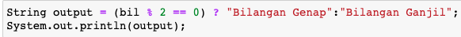

## JOBSHEET 5

## PEMILIHAN 1

### Tujuan

Mahasiswa mampu menyelesaikan permasalahan/studi kasus menggunakan sintaks pemilihan 1 dan mengimplemantasikannya dalam bahasa pemrogaman java.

### Alat dan Bahan
+ PC/laptop
+ Browser(chrome, firefox, safari)
+ Koneksi internet

### Praktikum

#### Percobaan 1 : Penggunaan if

#### Waktu percobaan : 40 menit

1. Perhatikan flowchart dibawah ini!

    <p align="left">
    
    </p>
    

> Flowchart diatas digunakan untuk menentukan bilangan ganjil/genap, selanjutnya kita akan membuat programnya berdasarkan
> flowchart di atas!

2. Tambahkan library Scanner, deklarasi Scanner, dan buat variabel bil untuk menampung data yang diinput melalui keyboard

    


```Java
// Ketik kode program di atas di bawah sini
import java.util.Scanner;
Scanner input = new Scanner(System.in);
int bil;
System.out.print("Masukkan sebuah bilangan: ");
bil = input.nextInt();
```

    Masukkan sebuah bilangan: 10


Program ini digunakan untuk memasukkan sebuah paket scanner yang merupakkan class yang menyediakan fungsi-fungsi untuk mengambil input dari keyboard. dalam porgram tersebut tipe data yang digunakan adalah integer dengan variable bil. dan juga dalam program tersebut juga terdapat sebuah codingan yang berfungsi untuk meng inputkan data.


3. Buatlah struktur kondisi untuk mengecek apakah bilangan tersebut merupakan bilangan genap atau ganjil

    


```Java
// Ketik kode program di atas di bawah sini
if(bil % 2 == 0){
    System.out.println("Bilangan Genap");
}else{
    System.out.println("Bilangan Ganjil");
}
```

    Bilangan Genap


Program diatas merupakan sistem pemilihan dengan menggunakan "if else" yang berfungsi untuk sebuah kondisi yang mengaharuskan kita untuk memilih.

##### Pertanyaan
1. Modifikasi program diatas dibagian struktur pemilihannya sehingga menjadi sebagai berikut:

    


```Java
// Ketik kode program di atas di bawah sini
String output = (bil % 2 == 0) ? "Bilangan Genap":"Bilangan Ganjil";
System.out.println(output);
```

    Bilangan Genap


Mengapa output programnya sama dengan program yang sebelumnya yaitu karena dalam program ini if dan else diganti dengan tanda tanya dan titik dua. tanda tanya sebagai if dan titik dua sebagai else.

2. Jalankan dan amatilah hasilnya!
3. Jelaskan mengapa output program yang dimodifikasi sama dengan output program sebelum dimodifikasi!

#### Percobaan 2 : Penggunaan if else

#### Waktu percobaan : 40 menit

+ Buatlah sebuah variabel nilai untuk menyimpan inputan dari keyboard

    


```Java
// Ketik kode program di atas di bawah sini
int nilai;
System.out.print("Masukkan sebuah bilangan: ");
nilai = input.nextInt();
```

    Masukkan sebuah bilangan: 30


Program ini digunakan untuk menginputkan sebuah bilangan. tipe data yang digunakan dalam program ini adalah integer dengan variabel nilai.

+ Tambahkan sebuah kondisi untuk mengecek input pada variabel nilai

    


```Java
// Ketik kode program di atas di bawah sini
if(nilai >= 100){
    nilai += 10;
}else{
    nilai -= 10;
}
System.out.println("Hasil akhir nilai adalah "+nilai);
```

    Hasil akhir nilai adalah 20


program ini akan mengeksekusi nilai yang diinputkan apabila nilai yang diinputkan melebihi 100 akan ditambah dengan 10, tetapi jika nilai yang diinputkan kurang dari 100 maka akan dikurangi 10.

+ Jalankan program. Amati apa yang terjadi!

##### Pertanyaan
1. Jelaskan fungsi kode program berikut:
    
    ```
    nilai+=10;
    nilai-=10;
    ```

2. Modifikasilah program diatas dimana inputannya yang awalnya hanya satu kemudian diganti 2 inputan (misal : nilai1 dan nilai2), lakukan perhitungan rata-rata kedua nilai tersebut jika nilainya lebih dari sama dengan 100 maka dikurangi 5, sedangkan jika nilai rata-rata tersebut kurang dari 100 maka akan langsung dicetak!

#### Percobaan 3 : Penggunaan if else-if else

#### Waktu percobaan : 40 menit

+ Tambahakan library `Scanner`
+ Buatlah deklarasi `Scanner`
+ Buat variabel umur bertipe `int`

    


```Java
// Ketik kode program di atas di bawah sini
int umur;
System.out.print("Masukkan umur Anda: ");
umur = input.nextInt()
```

    Masukkan umur Anda: 70


dalam program ini tipe data yang digunakan adalah integer dan variabel yang digunakan adalah umur

+ Kode untuk melakukan pengecekan variabel `umur`

    


```Java
// Ketik kode program di atas di bawah sini
if(umur > 60)
    System.out.println("Lansia");
else if(umur > 45)
    System.out.println("Tua");
else if(umur > 17)
    System.out.println("Dewasa");
else if(umur > 5)
    System.out.println("Anak-anak");
else
    System.out.println("Balita");
```

    Lansia


Program ini biasanya digunakan ketika kita dihadapkan dengan kondisi yang memiliki lebih dari dua pilihan. dalam kasus ini program dijalankan untuk mengelompokkan ketika umur yang diinputkan lebih dari 60 maka dapat dikelompokkan sebagai Lansia lalu ketika umur yang diinputkan lebih dari 45 dapat dikelompokkan sebagai Tua dan seterusnya hingga umur yang diinputkan dibawah 5 tahun yang dikelompokkan sebagai Balita.

+ Jalankan program dan amati apa yang terjadi!

##### Percobaan 4 : Penggunaan switch-case

#### Waktu percobaan : 40 menit

1. Deklarasikan Scanner
1. Buatlah variabel-variabel berikut

    


```Java
// Ketik kode program di atas di bawah sini
Scanner sc = new Scanner(System.in);
double angka1, angka2, hasil;
char operator;
```

Scanner merupakan class yang menyediakan fungsi-fungsi untuk mengambil input dari keyboard.

3. Kode program untuk meminta inputan dari keyboard

    


```Java
// Ketik kode program di atas di bawah sini
System.out.print("Masukkan angka pertama: ");
angka1 = sc.nextDouble();
System.out.print("Masukkan angka kedua: ");
angka2 = sc.nextDouble();
System.out.print("Masukkan operator (+ - * /): ");
operator = sc.next().charAt(0);
```

    Masukkan angka pertama: 12
    Masukkan angka kedua: 10
    Masukkan operator (+ - * /): *


program ini digunakan untuk menginputkan sebuah angka dan juga operator.

4. Kode di bawah ini untuk melakukan pengecekan operator yang digunakan sebelum dilakukan operasi aritmatika

    


```Java
// Ketik kode program di atas di bawah sini
switch(operator){
    case '+':
    hasil = angka1 + angka2;
    System.out.println(angka1 + " + " + angka2 + " = " + hasil);
    break;
    case '-':
    hasil = angka1 - angka2;
    System.out.println(angka1 + " - " + angka2 + " = " + hasil);
    break;
    case '*':
    hasil = angka1 * angka2;
    System.out.println(angka1 + " * " + angka2 + " = " + hasil);
    break;
    case '/':
    hasil = angka1 / angka2;
    System.out.println(angka1 + " / " + angka2 + " = " + hasil);
    break;
    default:
    System.out.println("Operator yang anda masukkan salah");
}
```

    12.0 * 10.0 = 120.0


switch case digunakan untuk mengecek sebuah nilai. nilai yang dicek bisa lebih dari satu.

5. Jalankan program. Amati apa yang terjadi!

##### Pertanyaan
1. Jelaskan fungsi dari break dan default pada percobaan 4 diatas!
2. Jelaskan fungsi perintah kode program dibawah ini pada percobaan 4!

    ```
    operator = sc.next().chartAt(0);
    ```

### Tugas

#### Waktu pengerjaan Tugas: 140 menit

1. Buatlah program untuk menginputkan dua buah bilangan bulat, kemudian mencetak salah satu bilangan yang nilainya terbesar.
2. Perhatikan flowchart berikut ini:


> Buatlah program sesuai dengan flowchart diatas!

3. Pada akhir semester seorang dosen menghitung nilai akhir dari mahasiswa yang terdiri dari nilai uas, uts, kuis, dan tugas. Nilai akhir didapatkan dari 40% nilai uas, 30% nilai uts, 10% nilai kuis, dan 20% nilai tugas. Jika nilai akhir dari mahasiswa dibawah 65 maka mahasiswa tersebut akan mendapatkan remidi. Buatlah program untuk membantu mengetahui mahasiswa yang mendapatkan remidi berdasarkan nilai akhir yang didapatkannya!

4. Sebuah toko memberikan diskon kepada pelanggannya dengan ketentuan sebagai berikut:

| Total Belanja     | Potongan |
|-------------------|----------|
| >Rp. 200.000,00   | 2%       |
| >Rp. 500.000,00   | 5%       |
| >Rp. 1.000.000,00 | 10%      |

> Total belanja diperoleh dari pembelian tiga barang yaitu barang A, barang B, dan barang C. Ketika menginputkan harga barang juga menginputkan jumlah barang yang dibeli.

Contoh outputnya
```
Masukkan harga barang A   :100000
Masukkan jumlah barang A  :10
Masukkan harga barang B   :250000
Masukkan jumlah barang B  :5
Masukkan harga barang C   :150000
Masukkan jumlah barang C  :1
---------------------------------------------
                Struk total
---------------------------------------------
Nama Barang 	| 	Harga 	| 	Jumlah 	| 	Total
Barang A            100000         10        1000000   
Barang B            250000         5         1250000   
Barang C            150000         1         150000    
Total       :2400000
Diskon      :240000.0
Total Bayar :2160000.0
```


```Java
// Tugas Nomer 1
import java.util.Scanner;
Scanner input = new Scanner(System.in);
int bilangan1, bilangan2;
System.out.print("Masukkan Bilangan 1: ");
bilangan1 = input.nextInt();
System.out.print("Masukkan Bilangan 2: ");
bilangan2 = input.nextInt();

if(bilangan1 > bilangan2){
    System.out.println("Bilangan Terbesar adalah : "+bilangan1);
}else{
    System.out.println("Bilangan Terbesar adalah : "+bilangan2);
}
```

    Masukkan Bilangan 1: 7
    Masukkan Bilangan 2: 10
    Bilangan Terbesar adalah : 10


```Java
// Tugas Nomer 2
import java.util.Scanner;
Scanner input = new Scanner(System.in);
int umur;
System.out.print("Masuukkan Umur: ");
umur = input.nextInt();

if(umur >= 17){
    System.out.println("Boleh Berkendara");
}else{
    System.out.println("Tidak Boleh Berkendara");
}
```

    Masuukkan Umur: 17
    Boleh Berkendara


```Java
// Tugas Nomer 3
Scanner hasil = new Scanner(System.in);
double uas, uts, kuis, tugas;
double nilai;
System.out.print("Masukkan Nilai UAS: ");
uas = hasil.nextDouble();
System.out.print("Masukkan Nilai UTS: ");
uts = hasil.nextDouble();
System.out.print("Masukkan Nilai Kuis: ");
kuis = hasil.nextDouble();
System.out.print("Masukkan Nilai Tugas: ");
tugas = hasil.nextDouble();

nilai = uas * 40 / 100 + uts * 30 / 100 + kuis * 10 / 100 + tugas * 20 / 100;
System.out.println("Hasil Akhir: " + nilai);

if(nilai < 65){
    System.out.println("Mahasiswa Wajib Remidi");
}else{
    System.out.println("Mahasiswa Tidak Wajib Remidi");
}
```

    Masukkan Nilai UAS: 80
    Masukkan Nilai UTS: 90
    Masukkan Nilai Kuis: 70
    Masukkan Nilai Tugas: 60
    Hasil Akhir: 78.0
    Mahasiswa Tidak Wajib Remidi


```Java
// Tugas Nomer 4
import java.util.Scanner;
Scanner sc = new Scanner(System.in);
double totalbayar, totalhargaB, totalhargaC;
int  hargaA, hargaB, hargaC, jumlahA, jumlahB, jumlahC, total, totalhargaA, totalhargaB, totalhargaC;
System.out.print("Masukkan Harga Barang  A: ");
hargaA = sc.nextInt();
System.out.print("Masukkan Jumlah Barang A: ");
jumlahA = sc.nextInt();
totalhargaA = hargaA * jumlahA;

System.out.print("Masukkan Harga Barang  B: ");
hargaB = sc.nextInt();
System.out.print("Masukkan Jumlah Barang B: ");
jumlahB = sc.nextInt();
totalhargaB = hargaB * jumlahB;

System.out.print("Masukkan Harga Barang  C: ");
hargaC = sc.nextInt();
System.out.print("Masukkan Jumlah Barang C: ");
jumlahC = sc.nextInt();
totalhargaC = hargaC * jumlahC;

System.out.println("-----------------------------------");
System.out.println("             Struk Total           ");
System.out.println("-----------------------------------");
System.out.println("Nama Barang   |  Harga   |   Jumlah   |   Total ");
System.out.println("Barang   A      "  + hargaA +   "\t" + jumlahA +   "\t" + totalhargaA);
System.out.println("Barang   B      "  + hargaB +   "\t" + jumlahB +   "\t" + totalhargaB);
System.out.println("Barang   C      "  + hargaC +   "\t" + jumlahC +   "\t" + totalhargaC);

total = (hargaA * jumlahA) + (hargaB * jumlahB) + (hargaC * jumlahC);
System.out.println("Total         : "+total);

double diskon2, diskon5, diskon10;
if(total >= 200000){
    diskon2 =total * 2/100;
    totalbayar = total - diskon2;
    System.out.println("Diskon        : "+diskon2);
    System.out.println("Total Belanja : "+totalbayar);
    
}else if(total >= 500000){
    diskon5 = total * 5/100;
    totalbayar = total - diskon5;
    System.out.println("Diskon        : "+diskon5);
    System.out.println("Total Belanja : "+totalbayar);
    
}else if(total >= 1000000){
    diskon10 = total * 10/100;
    totalbayar = total - diskon10;
    System.out.println("Diskon        : "+diskon10);
    System.out.println("Total Belanja : "+totalbayar);
    
}else{
    totalbayar = total;
    System.out.println("Tidak mendapatkan diskon");
    System.out.println("Total Bayar : "+totalbayar);
}
```

    Masukkan Harga Barang  A: 100000
    Masukkan Jumlah Barang A: 10
    Masukkan Harga Barang  B: 250000
    Masukkan Jumlah Barang B: 5
    Masukkan Harga Barang  C: 150000
    Masukkan Jumlah Barang C: 1
    -----------------------------------
                 Struk Total           
    -----------------------------------
    Nama Barang   |  Harga   |   Jumlah   |   Total 
    Barang   A      100000	10	1000000
    Barang   B      250000	5	1250000
    Barang   C      150000	1	150000
    Total         : 2400000
    Diskon        : 48000.0
    Total Belanja : 2352000.0


```Java

```


```Java

```
