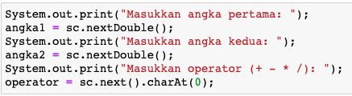
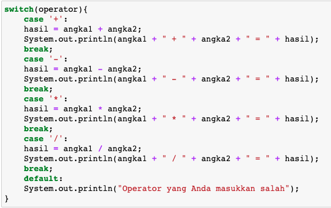

## JOBSHEET 5

## PEMILIHAN 1

### Tujuan

Mahasiswa mampu menyelesaikan permasalahan/studi kasus menggunakan sintaks pemilihan 1 dan mengimplemantasikannya dalam bahasa pemrogaman java.

### Alat dan Bahan
+ PC/laptop
+ Browser(chrome, firefox, safari)
+ Koneksi internet

### Praktikum

#### Percobaan 1 : Penggunaan if

#### Waktu percobaan : 40 menit

1. Perhatikan flowchart dibawah ini!

    <p align="left">
    
    </p>
    

> Flowchart diatas digunakan untuk menentukan bilangan ganjil/genap, selanjutnya kita akan membuat programnya berdasarkan
> flowchart di atas!

2. Tambahkan library Scanner, deklarasi Scanner, dan buat variabel bil untuk menampung data yang diinput melalui keyboard

    


```Java
import java.util.Scanner;
Scanner input = new Scanner(System.in);
int bil;
System.out.print("Masukkan sebuah bilangan: ");
bil = input.nextInt();
```

    Masukkan sebuah bilangan: 19


1) Perintah import berfungsi untuk memanggil sebuah perintah agar perintah tersebut dapat berfungsi atau digunakan.
2) Scanner input adalah sebuah deklarasi class Scanner ke dalam variabel input.
3) int adalah sebuah tipe data yaitu integer, sedangkan bil adalah sebuah variabel.
4) System.out.print adalah sebuah fungsi untuk menampilkan output, sedangkan "Masukkan sebuah bilangan" adalah output yang akan ditampilkan.
5) input.nextInt berfungi memerintahkan program untuk menerima input dari console dan mengubahnya ke dalam tipe data yang sesuai, yaitu integer.

3. Buatlah struktur kondisi untuk mengecek apakah bilangan tersebut merupakan bilangan genap atau ganjil

    


```Java
if(bil%2 == 0){
    System.out.println("Bilangan Genap");
}else{
    System.out.println("Bilangan Ganjil");
}
```

    Bilangan Ganjil


Terdapat sintaks pemilihan if...else, artinya jika variabel bil dibagi 2 hasilnya sama dengan 0 atau tidak bersisa maka bilangan tersebut adalah bilangan genap. Namun, jika variabel bil dibagi 2 hasilnya tidak sama dengan 0 atau bersisa maka bilangan tersebut adalah bilangan ganil. Pada contoh di atas outputnya adalah bilangan ganjil, karena variabel bil (yaitu 19) jika dibagi 2 hasilnya tidak sama dengan 0 atau bersisa.

##### Pertanyaan
1. Modifikasi program diatas dibagian struktur pemilihannya sehingga menjadi sebagai berikut:

    


```Java
String output = (bil % 2 == 0) ? "Bilangan Genap":"Bilangan Ganjil";
System.out.println(output);
```

    Bilangan Ganjil


Kode di atas adalah contoh dari ternary operator, artinya kode di atas isinya sama dengan kode di atasnya. Maka dari itu, outputnya sama yaitu bilangan ganjil.

2. Jalankan dan amatilah hasilnya!
3. Jelaskan mengapa output program yang dimodifikasi sama dengan output program sebelum dimodifikasi!

#### JAWABAN
2. Outputnya sama dengan output program sebelum dimodifikasi.
3. Karena program yang dimodifikasi isinya sama seperti program sebelum dimodifikasi hanya saja dalam bentuk ternary operator.

#### Percobaan 2 : Penggunaan if else

#### Waktu percobaan : 40 menit

+ Buatlah sebuah variabel nilai untuk menyimpan inputan dari keyboard

    


```Java
int nilai;
System.out.print("Masukkan sebuah bilangan: ");
nilai = input.nextInt();
```

    Masukkan sebuah bilangan: 21


Program tersebut membuat sebuah variabel nilai dengan tipe data integer, lalu dengan input.nextInt kita dapat menyimpan sebuah input ke dalam variabel nilai. Dalam input.next... kata di titik-titik adalah tipe data yang digunakan. Dalam program di atas kita menggunakan tipe data integer (int), maka penulisannya input.nextInt.

+ Tambahkan sebuah kondisi untuk mengecek input pada variabel nilai

    


```Java
if(nilai >= 100){
    nilai += 10;
}else{
    nilai -= 10;
}
System.out.println("Hasil akhir nilai adalah "+nilai);
```

    Hasil akhir nilai adalah 11


Terdapat sintaks pemilihan if...else, artinya jika variabel nilai bernilai lebih dari sama dengan 100 maka nilai dari variabel tersebut akan dijumlah 10. Namun, jika variabel nilai bernilai kurang dari 100 maka nilai dari variabel tersebut akan dikurangi 10. Pada contoh di atas outputnya adalah 11. Hal ini karena nilai variabel nilai adalah 21 artinya kurang dari 100 maka nilainya dikurangi 10, hasilnya adalah 11.

+ Jalankan program. Amati apa yang terjadi!

##### Pertanyaan
1. Jelaskan fungsi kode program berikut:
    
    ```
    nilai+=10;
    nilai-=10;
    ```

2. Modifikasilah program diatas dimana inputannya yang awalnya hanya satu kemudian diganti 2 inputan (misal : nilai1 dan nilai2), lakukan perhitungan rata-rata kedua nilai tersebut jika nilainya lebih dari sama dengan 100 maka dikurangi 5, sedangkan jika nilai rata-rata tersebut kurang dari 100 maka akan langsung dicetak!

#### JAWABAN
1. Kode program nilai+=10 artinya sebuah variabel yang bernama nilai dijumlahkan dengan 10. Sedangkan kode program nilai-=10 artinya sebuah variabel yang bernama nilai dikurangi dengan 10.
2. 
```Java
import java.util.Scanner;
Scanner input = new Scanner(System.in);
int nilai1, nilai2, hasil;
System.out.print("Masukkan nilai1: ");
nilai1 = input.nextInt();
System.out.print("Masukkan nilai2: ");
nilai2 = input.nextInt();
hasil = (nilai1 + nilai2)/2;

if(hasil >= 100){
    hasil -= 5;
}
System.out.println("Hasil akhir nilai adalah " + hasil);
```

#### Percobaan 3 : Penggunaan if else-if else

#### Waktu percobaan : 40 menit

+ Tambahakan library `Scanner`
+ Buatlah deklarasi `Scanner`
+ Buat variabel umur bertipe `int`

    


```Java
int umur;
System.out.print("Masukkan umur Anda: ");
umur = input.nextInt();
```

    Masukkan umur Anda: 19


Program tersebut membuat sebuah variabel umur dengan tipe data integer, lalu dengan input.nextInt kita dapat menyimpan sebuah input ke dalam variabel umur. Dalam input.next... kata di titik-titik adalah tipe data yang digunakan. Dalam program di atas kita menggunakan tipe data integer (int), maka penulisannya input.nextInt.

+ Kode untuk melakukan pengecekan variabel `umur`

    


```Java
if(umur > 60)
    System.out.println("Lansia");
else if(umur > 45)
    System.out.println("Tua");
else if(umur > 17)
    System.out.println("Dewasa");
else if(umur > 5)
    System.out.println("Anak-anak");
else
    System.out.println("Balita");
```

    Dewasa


Terdapat sintaks pemilihan if...else if...else, artinya jika variabel umur bernilai lebih dari 60 maka tergolong Lansia. Apabila variabel umur bernilai lebih dari 45 dan kurang dari 60 maka tergolong Tua. Apabila variabel umur bernilai lebih dari 17 dan kurang dari 45 maka tergolong Dewasa. Apabila variabel umur bernilai lebih dari 5 dan kurang dari 17 maka tergolong Anak-anak. Dan apabila variabel umur bernilai kurang dari 5 maka tergolong Balita.

+ Jalankan program dan amati apa yang terjadi!

##### Percobaan 4 : Penggunaan switch-case

#### Waktu percobaan : 40 menit

1. Deklarasikan Scanner
1. Buatlah variabel-variabel berikut

    


```Java
Scanner sc = new Scanner(System.in);
double angka1, angka2, hasil;
char operator;
```

Kode program di atas terdapat scanner yang berfungsi untuk memasukkan data library, terdapat variabel bernama angka1, angka2, dan hasil yang memiliki tipe data double. Selain itu, terdapat variabel operator dengan tipe data char.

3. Kode program untuk meminta inputan dari keyboard

    


```Java
System.out.print("Masukkan angka pertama: ");
angka1 = sc.nextDouble();
System.out.print("Masukkan angka kedua: ");
angka2 = sc.nextDouble();
System.out.print("Masukkan operator (+ - * /): ");
operator = sc.next().charAt(0);
```

    Masukkan angka pertama: 18
    Masukkan angka kedua: 7
    Masukkan operator (+ - * /): +


Kode program tersebut berisi perintah untuk menginputkan bilangan bulat dengan nama variabel angka1 dan angka2 bertipe data double dan menginput operator dengan nama variabel operator bertipe data char. Pada varibel angka1 nilainya 18, angka2 bernilai 7, dan operatornya adalah +.

4. Kode di bawah ini untuk melakukan pengecekan operator yang digunakan sebelum dilakukan operasi aritmatika

    


```Java
switch(operator){
    case '+':
    hasil = angka1 + angka2;
    System.out.println(angka1 + " + " + angka2 + " = " + hasil);
    break;
    case '-':
    hasil = angka1 - angka2;
    System.out.println(angka1 + " - " + angka2 + " = " + hasil);
    break;
    case '*':
    hasil = angka1 * angka2;
    System.out.println(angka1 + " * " + angka2 + " = " + hasil);
    break;
    case '/':
    hasil = angka1 / angka2;
    System.out.println(angka1 + " / " + angka2 + " = " + hasil);
    break;
    default:
    System.out.println("Operator yang Anda masukkan salah");
}
```

    18.0 + 7.0 = 25.0


Output dari kode program tersebut menampilkan hasil penjumlahan dari variabel angka1 dan variabel angka2. Terjadi penjumlahan karena pada operator diinputkan +. Apabila menginputkan - maka terjadi operasi pengurangan. Apabila menginputkan * maka terjadi operasi perkalian. Apabila menginputkan / maka terjadi operasi pembagian.

5. Jalankan program. Amati apa yang terjadi!

##### Pertanyaan
1. Jelaskan fungsi dari break dan default pada percobaan 4 diatas!
2. Jelaskan fungsi perintah kode program dibawah ini pada percobaan 4!

    ```
    operator = sc.next().chartAt(0);
    ```

#### JAWABAN
1. Break berfungsi sebagai pembatas program agar program yang dijalankan dapat berhenti apabila kondisi telah terpenuhi. Sedangkan default berfungsi untuk menjalankan program apabila dalam case tidak ada kondisi yang terpenuhi.
2. Perintah kode program tersebut merupakan variabel yang memiliki value berupa string, tetapi karena diberi method charAt(0) maka value dari operator tersebut hanyalah sebuah character pada index ke 0 string yang diinputkan.

### Tugas

#### Waktu pengerjaan Tugas: 140 menit

1. Buatlah program untuk menginputkan dua buah bilangan bulat, kemudian mencetak salah satu bilangan yang nilainya terbesar.

#### JAWABAN
```Java
import java.util.Scanner;
Scanner sc = new Scanner(System.in);

System.out.print("A: ");
int a = sc.nextInt();

System.out.print("B: ");
int b = sc.nextInt();

if(a > b) {
    System.out.println(a);
}else{
    System.out.println(b);
}
```

    A: 5
    B: 2
    5

2. Perhatikan flowchart berikut ini:


> Buatlah program sesuai dengan flowchart diatas!

#### JAWABAN
```Java
import java.util.Scanner;
Scanner sc = new Scanner(System.in);

System.out.print("Umur: ");
int umur = sc.nextInt();

if(umur >= 17) {
System.out.println("Boleh berkendara");
}else{
System.out.println("Tidak boleh berkendara");
}
```

    Umur: 17
    Boleh berkendara

3. Pada akhir semester seorang dosen menghitung nilai akhir dari mahasiswa yang terdiri dari nilai uas, uts, kuis, dan tugas. Nilai akhir didapatkan dari 40% nilai uas, 30% nilai uts, 10% nilai kuis, dan 20% nilai tugas. Jika nilai akhir dari mahasiswa dibawah 65 maka mahasiswa tersebut akan mendapatkan remidi. Buatlah program untuk membantu mengetahui mahasiswa yang mendapatkan remidi berdasarkan nilai akhir yang didapatkannya!

#### JAWABAN
```Java
import java.util.Scanner;
Scanner sc = new Scanner(System.in);

System.out.print("Nilai akhir: ");
int nilaiAkhir = sc.nextInt();

if(nilaiAkhir < 65) {
    System.out.println("Remidi");
}else{
    System.out.println("Tidak remidi");
}
```

    Nilai akhir: 65
    Tidak remidi

4. Sebuah toko memberikan diskon kepada pelanggannya dengan ketentuan sebagai berikut:

| Total Belanja     | Potongan |
|-------------------|----------|
| >Rp. 200.000,00   | 2%       |
| >Rp. 500.000,00   | 5%       |
| >Rp. 1.000.000,00 | 10%      |

> Total belanja diperoleh dari pembelian tiga barang yaitu barang A, barang B, dan barang C. Ketika menginputkan harga barang juga menginputkan jumlah barang yang dibeli.

Contoh outputnya
```
Masukkan harga barang A   :100000
Masukkan jumlah barang A  :10
Masukkan harga barang B   :250000
Masukkan jumlah barang B  :5
Masukkan harga barang C   :150000
Masukkan jumlah barang C  :1
---------------------------------------------
                Struk total
---------------------------------------------
Nama Barang 	| 	Harga 	| 	Jumlah 	| 	Total
Barang A            100000         10        1000000   
Barang B            250000         5         1250000   
Barang C            150000         1         150000    
Total       :2400000
Diskon      :240000.0
Total Bayar :2160000.0
```

#### JAWABAN
```Java
import java.util.Scanner;
Scanner sc = new Scanner(System.in);

int jumlahA, hargaA, jumlahB,  hargaB, jumlahC, hargaC;

System.out.print("Masukkan harga barang A\t\t: ");
hargaA = sc.nextInt();
System.out.print("Masukkan jumlah barang A\t: ");
jumlahA = sc.nextInt();
System.out.print("Masukkan harga barang B\t\t: ");
hargaB = sc.nextInt();
System.out.print("Masukkan jumlah barang B\t: ");
jumlahB = sc.nextInt();
System.out.print("Masukkan harga barang C\t\t: ");
hargaC = sc.nextInt();
System.out.print("Masukkan jumlah barang C\t: ");
jumlahC = sc.nextInt();

int totalA = hargaA * jumlahA;
int totalB = hargaB * jumlahB;
int totalC = hargaC * jumlahC;

int total = totalA + totalB + totalC;

double diskon = 0;

if (total >= 1000000) {
    diskon = total * 10 / 100;
} else if (total >= 500000) {
    diskon = total * 5 / 100;
} else if (total >= 200000) {
    diskon = total * 2 / 100;
}

System.out.println("----------------------------------------");
System.out.println("              Struk Total");
System.out.println("----------------------------------------");
System.out.println("Nama Barang\t|\tHarga\t|\tJumlah\t|\tTotal\t");
System.out.println("Barang A\t\t|\t\t"+hargaA+"\t\t|\t\t"+jumlahA+"\t\t|\t\t" + totalA);
System.out.println("Barang B\t\t|\t\t"+hargaB+"\t\t|\t\t"+jumlahB+"\t\t|\t\t" + totalB);
System.out.println("Barang C\t\t|\t\t"+hargaC+"\t\t|\t\t"+jumlahC+"\t\t|\t\t" + totalC);
System.out.println("Total\t\t\t: " + total);
System.out.println("Diskon\t\t\t: " + diskon);
System.out.println("Total Bayar\t\t: " + (total - diskon));
```