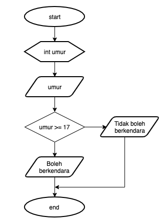

## JOBSHEET 5

## PEMILIHAN 1

### Tujuan

Mahasiswa mampu menyelesaikan permasalahan/studi kasus menggunakan sintaks pemilihan 1 dan mengimplemantasikannya dalam bahasa pemrogaman java.

### Alat dan Bahan
+ PC/laptop
+ Browser(chrome, firefox, safari)
+ Koneksi internet

### Praktikum

#### Percobaan 1 : Penggunaan if

#### Waktu percobaan : 40 menit

1. Perhatikan flowchart dibawah ini!

    <p align="left">
    
    </p>
    

> Flowchart diatas digunakan untuk menentukan bilangan ganjil/genap, selanjutnya kita akan membuat programnya berdasarkan
> flowchart di atas!

2. Tambahkan library Scanner, deklarasi Scanner, dan buat variabel bil untuk menampung data yang diinput melalui keyboard

    


```Java
// Ketik kode program di atas di bawah sini
import java.util.Scanner;
Scanner input = new Scanner(System.in);
int bil;
System.out.print("Masukkan sebuah bilangan: ");
bil = input.nextInt();
```

    Masukkan sebuah bilangan: 3


kode tersebut bertujuan untuk memberikan nilai input berupa angka bertipe data integer

3. Buatlah struktur kondisi untuk mengecek apakah bilangan tersebut merupakan bilangan genap atau ganjil

    


```Java
// Ketik kode program di atas di bawah sini
if(bil %2 == 0){
    System.out.println("Bilangan Genap");
} else {
    System.out.println("Bilangan Ganjil");
}
```

    Bilangan Ganjil


Kode tersebut merupakan kondisi jadi value yang diinputkan di kode sebelumnya akan diseleksi kondisi jika angka tersebut dapat habis dibagi 2 maka angka tersebut tergolong genap dan "Bilangan Genap" akan tercetak, sebaliknya, makayang tercetak adalah "Bilangan Ganjil"

##### Pertanyaan
1. Modifikasi program diatas dibagian struktur pemilihannya sehingga menjadi sebagai berikut:

    


```Java
// Ketik kode program di atas di bawah sini
String output = (bil % 2 == 0) ? "Bilangan Genap" : "Bilangan Ganjil";
System.out.println(output);
```

    Bilangan Ganjil


2. Jalankan dan amatilah hasilnya!
3. Jelaskan mengapa output program yang dimodifikasi sama dengan output program sebelum dimodifikasi!

2. kode tersebut merupakan ternary operation yang mana akan menyeleksi kondisi value dari variabel bilangan
3. karena ternary operation tersebut memiliki fungsi yang sama dengan kode sebelumnya yang menggunakan (if...else) dan value yang diseleksi juga bernilai sama jadi menghasilkan output yang sama
#### Percobaan 2 : Penggunaan if else

#### Waktu percobaan : 40 menit


+ Buatlah sebuah variabel nilai untuk menyimpan inputan dari keyboard

    


```Java
// Ketik kode program di atas di bawah sini
 int nilai;
System.out.print("Masukkan sebuah bilangan: ");
nilai = input.nextInt();
```

    Masukkan sebuah bilangan: 4


kode tersebut digunakan untuk menginput value

+ Tambahkan sebuah kondisi untuk mengecek input pada variabel nilai

    


```Java
// Ketik kode program di atas di bawah sini
if(nilai >= 100){
    nilai += 10;
}else{
    nilai -= 10;
}
System.out.println("Hasil akhir nilai adalah " + nilai)
```

    Hasil akhir nilai adalah -6


+ Jalankan program. Amati apa yang terjadi!

kode tersebut digunakan sebagai kondisi untuk memeriksa apakah value dari variable nilai adalah lebih dari samadengan seratus atau tidak jika iya maka value akan bertamabah 10 jika tidak maka value akan berkurang 10. Lalu akan menghasilkan output berupa Hasil akhir nilai adalah nilai(value nilai yang telah melalui koindisi)

##### Pertanyaan
1. Jelaskan fungsi kode program berikut:
    
    ```
    nilai+=10;
    nilai-=10;
    ```

2. Modifikasilah program diatas dimana inputannya yang awalnya hanya satu kemudian diganti 2 inputan (misal : nilai1 dan nilai2), lakukan perhitungan rata-rata kedua nilai tersebut jika nilainya lebih dari sama dengan 100 maka dikurangi 5, sedangkan jika nilai rata-rata tersebut kurang dari 100 maka akan langsung dicetak!

1. program nilai += 10 atau bisa ditulis nilai = nilai + 10 berarti merubah value dari variabel nilai dengan valuenya sendiri ditambah 10. Jadi value dari variable nilai akan berganti. Begitujuga dengan nilai -= 10
2. 
```java
int nilai1;
int nilai2;
int hasil;
System.out.print("Masukkan sebuah bilangan: ");
nilai1 = input.nextInt();
nilai2 = input.nextInt();
hasil = (nilai1 + nilai2)/2

if(hasil >= 100){
    hasil -= 5;
}
System.out.println("Hasil akhir nilai adalah " + nilai)

```
#### Percobaan 3 : Penggunaan if else-if else

#### Waktu percobaan : 40 menit

+ Tambahakan library `Scanner`
+ Buatlah deklarasi `Scanner`
+ Buat variabel umur bertipe `int`

    


```Java
// Ketik kode program di atas di bawah sini
int umur;
System.out.print("Masukkan umur Anda: ");
umur = input.nextInt();

```

    Masukkan umur Anda: 17


Kode tersebut digunakan untuk menginput value pada variable umur

+ Kode untuk melakukan pengecekan variabel `umur`

    


```Java
// Ketik kode program di atas di bawah sini
if(umur > 60)
    System.out.println("Lansia");
else if (umur >45)
    System.out.println("Tua");
else if (umur >17)
    System.out.println("Dewasa");
else if (umur >5)
    System.out.println("Anak-anak");
else
    System.out.println("Balita");

```

    Anak-anak


+ Jalankan program dan amati apa yang terjadi!

dari value yang telah dimasukkan ke variable umur, kemudian value diseleksi kondisi, jika value umur lebih dari 60 tahun maka akan mencetak output Lansia lalu program selesai,program akan lanjut menyeleksi jika umur tidak lebih dari 60 tapi lebih dari 45 maka outputnya Tua,program akan lanjut menyeleksi jika umur tidak lebih dari 60 tapi lebih dari 17 maka outputnya Dewasa,program akan lanjut menyeleksi jika umur tidak lebih dari 17 tapi lebih dari 5 maka outputnya Anak-anak,selain dari angka - angka di interval tersebut, maka outputnya balita.

##### Percobaan 4 : Penggunaan switch-case

#### Waktu percobaan : 40 menit

1. Deklarasikan Scanner
1. Buatlah variabel-variabel berikut

    


```Java
// Ketik kode program di atas di bawah sini
Scanner sc = new Scanner (System.in);
double angka1, angka2, hasil;
char operator;
```

program tersebut digunakan untuk membuat variable variable sekaligus membuat object scanner

3. Kode program untuk meminta inputan dari keyboard

    


```Java
// Ketik kode program di atas di bawah sini
System.out.println("Masukkan angka pertama: ");
angka1 = sc.nextDouble();
System.out.println("Masukkan angka kedua: ");
angka2 = sc.nextDouble();
System.out.println("Masukkan operator (+ - * /): ");
operator = sc.next().charAt(0);
```

    Masukkan angka pertama: 
    5
    Masukkan angka kedua: 
    2
    Masukkan operator (+ - * /): 
    *


program tersebut digunakan untuk menginput data ke setiap variable yang diisi ke variable angka1,angka2,dan operator. Namun pada operator terdapat method .charAt() dengan parameter 0 yang berarti variable operator hanya akan memuat sebuah character pada indeks ke 0 dari string yang akan di inputkan

4. Kode di bawah ini untuk melakukan pengecekan operator yang digunakan sebelum dilakukan operasi aritmatika

    


```Java
// Ketik kode program di atas di bawah sini
switch(operator){
    case '+':
    hasil = angka1 + angka2;
    System.out.println(angka1 + " + " + angka2 + " = " + hasil);
    break;
    case '-':
    hasil = angka1 - angka2;
    System.out.println(angka1 + " - " + angka2 + " = " + hasil);
    break;
    case '*':
    hasil = angka1 * angka2;
    System.out.println(angka1 + " * " + angka2 + " = " + hasil);
    break;
    case '/':
    hasil = angka1 / angka2;
    System.out.println(angka1 + " / " + angka2 + " = " + hasil);
    break;
    default:
    System.out.println("Operator yang Anda masukkan salah");
}
```

    5.0 * 2.0 = 10.0


5. Jalankan program. Amati apa yang terjadi!

ketika dijalankan dengan menginputkan data ke semua variable sesuai formatnya masing-masing, maka akan dilakukan operasi sesuai data yang dimaksudkan. Contoh, jika angka1 diisi dengan 5,angka2 diisi dengan 2, dan operator diisi dengan *, maka operasi yang akan terjadi adalah
5.0 * 2.0, hasil dari operasi tersebut yaitu 10 akan diinput ke dalam variable hasil lalu akan menciptakan output berupa (5.0 * 2.0 = 10.0).Namun ketika kita mengisikan variable operator selain yang ada dipetunjuk format (+ - * /), maka akan langsung menghasilkan output berupa "Operator yang Anda masukkan salah" karena jika value operator tidak memenuhi semua case yang tersedia maka program akan menjalankan default

##### Pertanyaan
1. Jelaskan fungsi dari break dan default pada percobaan 4 diatas!
2. Jelaskan fungsi perintah kode program dibawah ini pada percobaan 4!

    ```
    operator = sc.next().chartAt(0);
    ```

1. break digunakan agar program yang dijalankan berhenti pada saat kondisi telah terpenuhi, default berfungsi untuk menjalankan program jika dalam setiap case tidak ada kondisi yang terpenuhi.
2. kode tersebut merupakan variable yang memiliki value berupa string, namun karena diberi method charAt(0) maka value dari operator tersebut hanyalah sebuah character pada index ke 0 string yang diinputkan


### Tugas

#### Waktu pengerjaan Tugas: 140 menit

1. Buatlah program untuk menginputkan dua buah bilangan bulat, kemudian mencetak salah satu bilangan yang nilainya terbesar.
2. Perhatikan flowchart berikut ini:



> Buatlah program sesuai dengan flowchart diatas!

3. Pada akhir semester seorang dosen menghitung nilai akhir dari mahasiswa yang terdiri dari nilai uas, uts, kuis, dan tugas. Nilai akhir didapatkan dari 40% nilai uas, 30% nilai uts, 10% nilai kuis, dan 20% nilai tugas. Jika nilai akhir dari mahasiswa dibawah 65 maka mahasiswa tersebut akan mendapatkan remidi. Buatlah program untuk membantu mengetahui mahasiswa yang mendapatkan remidi berdasarkan nilai akhir yang didapatkannya!

4. Sebuah toko memberikan diskon kepada pelanggannya dengan ketentuan sebagai berikut:

| Total Belanja     | Potongan |
|-------------------|----------|
| >Rp. 200.000,00   | 2%       |
| >Rp. 500.000,00   | 5%       |
| >Rp. 1.000.000,00 | 10%      |

> Total belanja diperoleh dari pembelian tiga barang yaitu barang A, barang B, dan barang C. Ketika menginputkan harga barang juga menginputkan jumlah barang yang dibeli.

Contoh outputnya
```
Masukkan harga barang A   :100000
Masukkan jumlah barang A  :10
Masukkan harga barang B   :250000
Masukkan jumlah barang B  :5
Masukkan harga barang C   :150000
Masukkan jumlah barang C  :1
---------------------------------------------
                Struk total
---------------------------------------------
Nama Barang 	| 	Harga 	| 	Jumlah 	| 	Total
Barang A            100000         10        1000000   
Barang B            250000         5         1250000   
Barang C            150000         1         150000    
Total       :2400000
Diskon      :240000.0
Total Bayar :2160000.0
```

Jawaban no 1 
```Java
import java.util.Scanner;
Scanner in = new Scanner(System.in);
int angka1 = in.nextInt();
int angka2 = in.nextInt();
if(angka1 > angka2){
    System.out.println(angka1);
}else if(angka2 > angka1){
    System.out.println(angka2);
}
```
Penjelasan
untuk menciptakan dua buah bilangan bulat, maka diperlukan untuk membuat 2 variable yang memiliki tipe data Integer dengan value scanner agar value bisa diinput waktu menjalankan program. Setelah itu diberilah kondisi agar program bisa mengetahui mana variable yang memiliki bilangan bulat terbesar, lalu program akan memberi output berupa bilangan bulat terbesar.

Jawaban no 2 
```java
import java.util.Scanner;
Scanner in = new Scanner(System.in);
int umur;
umur = in.nextInt();
if(umur >= 17){
    System.out.println("Boleh berkendara");
}else{
    System.out.println("Tidak boleh berkendara");
}
```
penjelasan
flowchart tersebut menyuruh kita untuk membuat program yang dapat menyeleksi kondisi value dari variable umur bertipe data integer. Untuk membuat program tersebut, kita harus membuat variable umur bertipe data integer dengan value scanner. Selanjutnya membuat kondisi, kondisi dapat dibuat dengan menggunakan if...else . ketika umur diinputkan lebih dari sama dengan 17 seperti 17,18,19,... maka outputnya adalah boleh berkendara, selain itu, maka outputnya adalah tidak boleh berkendara

Jawaban no 3
```java
import java.util.Scanner;
Scanner in = new Scanner(System.in);
double uas,uts,kuis,tugas,akhir;
uas = in.nextDouble();
uts = in.nextDouble();
kuis = in.nextDouble();
tugas = in.nextDouble();
akhir = (uas*40/100)+(uts*30/100)+(kuis*10/100)+(tugas*20/100);
System.out.println("nilai akhir anda: " + akhir);
if(akhir < 65){
    System.out.println("Remidi");
}else{
    System.out.println("Tidak Remidi");
}
```
penjelasan
untuk membuat program yang bisa menampilkan nilai akhir yang dimaksud serta menentukan apakah mahasiswa tersebut remidi atau tidak, maka kita harus membuat scanner terlebih dahulu agar user dapat menginputkan value, kemudian kita membuat variable uas,uts,kuis,tugas,akhir dengan tipe data double untuk mengantisipasi jika nilai akhir yang didapatkan adalah bilangan desimal. Selanjutnya kita membuat kode untuk mencetak nilai akhir agar mahasiswa mengetahui berapa nilai akhirnya. Terakhir, membuat kondisi yang menyeleksi nilai akhir mahasiswa, jika nilai akhirnya kurang dari 65 maka mahasiswa tersebut mendapat remidi, selain kurang dari 65, mahasiswa itu tidak mendapat remidi.

Jawaban no 4
```java
        Scanner in = new Scanner(System.in);
        int hargaA,hargaB,hargaC,jumlahA,jumlahB,jumlahC,totalHarga,totalA,totalB,totalC;
        double diskon=0,total =0;
        System.out.print("Masukkan harga barang A\t\t:");
        hargaA = in.nextInt();
        System.out.print("Masukkan jumlah barang A\t:");
        jumlahA = in.nextInt();
        System.out.print("Masukkan harga barang B\t\t:");
        hargaB = in.nextInt();
        System.out.print("Masukkan jumlah barang B\t:");
        jumlahB = in.nextInt();
        System.out.print("Masukkan harga barang C\t\t:");
        hargaC = in.nextInt();
        System.out.print("Masukkan jumlah barang C\t:");
        jumlahC = in.nextInt();
        System.out.println("-----------------------------");
        System.out.println("\t\tStruk Total\t\t");
        System.out.println("-----------------------------");

        totalA = hargaA * jumlahA;
        totalB = hargaB * jumlahB;
        totalC = hargaC * jumlahC;
        totalHarga = totalA + totalB + totalC;

        if(totalHarga >1000000){
            diskon = totalHarga*10/100;
        } else if(totalHarga > 500000){
            diskon = totalHarga*5/100;
        } else if(totalHarga > 200000){
            diskon = totalHarga*2/100;
        }
        total = totalHarga - diskon;

        System.out.println("Nama Barang\t|\tHarga\t|\tJumlah\t|Total");
        System.out.println("Barang A\t\t"+hargaA+"\t\t"+jumlahA+"\t\t"+totalA);
        System.out.println("Barang A\t\t"+hargaB+"\t\t"+jumlahB+"\t\t"+totalB);
        System.out.println("Barang A\t\t"+hargaC+"\t\t"+jumlahC+"\t\t"+totalC);
        System.out.println("Total\t\t: " + totalHarga);
        System.out.println("Diskon\t\t: "+ diskon);
        System.out.println("Total Bayar\t: "+total);
```
penjelasan
Untuk menentukan Total Harga sebelum didiskon, diskon yang didapat, dan harga setelah didiskon, kita perlu untuk membuat variable untuk setiap barang yang dibeli dan jumlah yang dibeli, dalam kasus ini, seseorang membeli barang A sejumlah A seharga A,barang B sejumlah B seharga B,barang C sejumlah C seharga C,serta total harga barang sebelum didiskon. setiap variable ditulis menggunakan tipe data integer lalu diberi scanner agar bisa diinput ketika program dijalankan.Kita juga perlu membuat variable diskon dan total harga setelah didiskon dengan menggunakan variable double agar nilai desimal bisa terinput. Setelah itu kita membuat template Struk total agar Nama barang, harga barang, jumlah barang,total harga barang bisa ditampilkan dengan baik. Setelah itu kita beri kondisi berupa if..else if. kondisi dengan interval nilai tertinggi harus ditulis terlebih dahulu karena harga barang keseluruhan dimulai dari 0 jadi jika kita menulis interval yang terkecil terlebih dahulu maka setiap kali mendapatkan diskon harga akan mendapat diskon harga terrendah. jika total harga barang lebih dari 200.000 maka mendapat diskon sebsear total harga dikali 2%,jika total harga barang lebih dari 500.000 maka mendapat diskon sebsear total harga dikali 5%,jika total harga barang lebih dari 1.000.000 maka mendapat diskon sebsear total harga dikali 10%. Untuk mengetahui total harga setelah didiskon, kita perlu menulis kembali variable total dengan value total harga sebelum didiskon dikurangi diskon yang didapat. Terakhir, kita perlu membuat kode kode yang akan menampilkan nama barang,harga barang, jumlah barang, total harga barang sebelum didiskon. Lalu kita membuat print yang menghasilkan output total harga sebeluum didiskon secara keseluruhan, diskon yang didapat, dan total harga setelah didiskon.