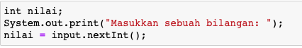

## JOBSHEET 5

## PEMILIHAN 1

### Tujuan

Mahasiswa mampu menyelesaikan permasalahan/studi kasus menggunakan sintaks pemilihan 1 dan mengimplemantasikannya dalam bahasa pemrogaman java.

### Alat dan Bahan
+ PC/laptop
+ Browser(chrome, firefox, safari)
+ Koneksi internet

### Praktikum

#### Percobaan 1 : Penggunaan if

#### Waktu percobaan : 40 menit

1. Perhatikan flowchart dibawah ini!

    <p align="left">
    
    </p>
    

> Flowchart diatas digunakan untuk menentukan bilangan ganjil/genap, selanjutnya kita akan membuat programnya berdasarkan
> flowchart di atas!

2. Tambahkan library Scanner, deklarasi Scanner, dan buat variabel bil untuk menampung data yang diinput melalui keyboard

    


```Java
// Ketik kode program di atas di bawah sini
import java.util.Scanner;
Scanner input = new Scanner(System.in);
int bil;
System.out.print("Masukkan sebuah bilangan: ");
bil = input.nextInt();
```

    Masukkan sebuah bilangan: 20


Kode program diatas berfungsi untuk memasukkan paket scanner untuk mempersingkat pengetikan dan juga mempermudah kita untuk memasukkan angka tanpa harus mengubah kode program. Selanjutnya fungsi bil = input.nextInt(); adalah printah untuk memasukkan nilai .nextInt() digunakan untuk type integer. Saat di run, maka kita diperintahkan untuk memasukkan bilangan yang berupa bilangan bulat(karena type datanya integer) sesuai yang diinginkan.

3. Buatlah struktur kondisi untuk mengecek apakah bilangan tersebut merupakan bilangan genap atau ganjil

    


```Java
// Ketik kode program di atas di bawah sini
if(bil%2 == 0){
    System.out.println("Bilangan Genap");
}else{
    System.out.println("Bilangan Ganjil");
}
```

    Bilangan Genap


Kode program diatas merupakan struktur pemilihan IF-ELSE dimana mempunyai 2 penyataan yaitu Bilangan Genap dan Bilangan Ganjil. ketika di run, jika kondisi true maka pernyataan1 akan dijalankan. tetapi jika kondisi false maka yang akan dijalankan adalah pernyataan2. Kode program diatas menjalankan pernyataan1 yakni Bilangan Genap karena pada kode program sebelumnya yang saya masukkan adalah angka 20 dimana angka 20 merupakan Bilangan Genap atau kelipatan dari 2.

##### Pertanyaan
1. Modifikasi program diatas dibagian struktur pemilihannya sehingga menjadi sebagai berikut:

    


```Java
// Ketik kode program di atas di bawah sini
String output = (bil % 2 == 0) ? "Bilangan Genap":"Bilangan Ganjil";
System.out.println(output);
```

    Bilangan Genap


Kode program di atas merupakan bentuk dari sintaks pemilihan Operator Ternary. Operator Ternary hampir sama dengan IF-ELSE, yakni memiliki 2 pernyataan kondisi jika true atau kondisi jika false.

2. Jalankan dan amatilah hasilnya!
3. Jelaskan mengapa output program yang dimodifikasi sama dengan output program sebelum dimodifikasi!

#### Percobaan 2 : Penggunaan if else

#### Waktu percobaan : 40 menit

+ Buatlah sebuah variabel nilai untuk menyimpan inputan dari keyboard

    


```Java
// Ketik kode program di atas di bawah sini
int nilai;
System.out.print("Masukkan sebuah bilangan: ");
nilai = input.nextInt();
```

    Masukkan sebuah bilangan: 20


penjelasan  nilai = input.nextInt(); adalah printah untuk memasukkan nilai .nextInt() digunakan untuk type integer. Saat di run, maka kita diperintahkan untuk memasukkan bilangan yang berupa bilangan bulat(karena type datanya integer) sesuai yang diinginkan.

+ Tambahkan sebuah kondisi untuk mengecek input pada variabel nilai

    


```Java
// Ketik kode program di atas di bawah sini
if(nilai >= 100){
    nilai += 10;
}else{
    nilai -= 10;
}
System.out.println("Hasil akhir nilai adalah "+nilai);
```

    Hasil akhir nilai adalah 10


Merupakan pemilihan IF-ELSE dimana jika true atau nilai lebih dari sama dengan 100 maka akan ditambah dengan 10 atau nilai += 10;, jika nilai false maka akan dikurangi 10 atau nilai -= 10;.

+ Jalankan program. Amati apa yang terjadi!

##### Pertanyaan
1. Jelaskan fungsi kode program berikut:
    
    ```
    nilai+=10;
    nilai-=10;
    ```

2. Modifikasilah program diatas dimana inputannya yang awalnya hanya satu kemudian diganti 2 inputan (misal : nilai1 dan nilai2), lakukan perhitungan rata-rata kedua nilai tersebut jika nilainya lebih dari sama dengan 100 maka dikurangi 5, sedangkan jika nilai rata-rata tersebut kurang dari 100 maka akan langsung dicetak!

#### Percobaan 3 : Penggunaan if else-if else

#### Waktu percobaan : 40 menit

+ Tambahakan library `Scanner`
+ Buatlah deklarasi `Scanner`
+ Buat variabel umur bertipe `int`

    


```Java
// Ketik kode program di atas di bawah sini
int umur;
System.out.print("Masukkan umur Anda: ");
umur = input.nextInt();
```

    Masukkan umur Anda: 19


penjelasan  umur = input.nextInt(); adalah printah untuk memasukkan nilai .nextInt() digunakan untuk type integer. Saat di run, maka kita diperintahkan untuk memasukkan bilangan yang berupa bilangan bulat(karena type datanya integer) sesuai yang diinginkan.

+ Kode untuk melakukan pengecekan variabel `umur`

    


```Java
// Ketik kode program di atas di bawah sini
if(umur > 60)
    System.out.println("Lansia");
else if(umur > 45)
    System.out.println("Tua");
else if(umur > 17)
    System.out.println("Dewasa");
else if(umur > 5)
    System.out.println("Anak-anak");
else
    System.out.println("Balita");
```

    Dewasa


penjelasan kode program di atas merupakan bentuk if...else if...else pernyataan1 Lansia akan dijalankan apabila kondisi1 atau umur lebih dari 60. jika kondisi1 bernilai salah, maka akan dicek kondisi2 atau umurlebih dari 45. jika kondisi2 benar maka akan dijalankan statement2 yakni Tua. jika kondisi2 bernilai salah, maka akan dicek kondisi3 atau umurlebih dari 17. jika kondisi3 benar maka akan dijalankan statement3 yakni Dewasa. jika kondisi3 bernilai salah, maka akan dicek kondisi4 atau umurlebih dari 5. jika kondisi4 benar maka akan dijalankan statement4 yakni Anak-anak. dan apabila tidak ada satupun syarat yang terpenuhi, maka akan dijalankan statment X yakni Balita. dalam kode program di atas saya menginputka umur 19 dimana yang akan berjalan adalah statment3 yakni Dewasa.

+ Jalankan program dan amati apa yang terjadi!

##### Percobaan 4 : Penggunaan switch-case

#### Waktu percobaan : 40 menit

1. Deklarasikan Scanner
1. Buatlah variabel-variabel berikut

    


```Java
// Ketik kode program di atas di bawah sini
Scanner sc = new Scanner(System.in);
double angka1, angka2, hasil;
char operator;
```

3. Kode program untuk meminta inputan dari keyboard

    


```Java
// Ketik kode program di atas di bawah sini
System.out.print("Masukkan angka pertama: ");
angka1 = sc.nextDouble();
System.out.print("Masukkan angka kedua: ");
angka2 = sc.nextDouble();
System.out.print("Masukkan operator (+ - * /): ");
operator = sc.next().charAt(0);
```

    Masukkan angka pertama: 4
    Masukkan angka kedua: 2
    Masukkan operator (+ - * /): +


4. Kode di bawah ini untuk melakukan pengecekan operator yang digunakan sebelum dilakukan operasi aritmatika

    


```Java
// Ketik kode program di atas di bawah sini
switch(operator){
    case '+':
    hasil = angka1 + angka2;
    System.out.println(angka1 + " + " + angka2 + " = " + hasil);
    break;
    case '-':
    hasil = angka1 - angka2;
    System.out.println(angka1 + " - " + angka2 + " = " + hasil);
    break;
    case '*':
    hasil = angka1 * angka2;
    System.out.println(angka1 + " * " + angka2 + " = " + hasil);
    break;
    case '/':
    hasil = angka1 / angka2;
    System.out.println(angka1 + " / " + angka2 + " = " + hasil);
    break;
    default:
    System.out.println("Operator yang Anda masukkan salah");
}
```

    4.0 + 2.0 = 6.0


penjelasan setelah memasukkan inputan misal angka pertama : 4, angka kedua : 2, dan memasukan salah satu operatornya dari + - * / maka dalam operator pemilihan switch case akan menjalan salah satu dari pernyataan case sesuai dengan nilai kondisi yang ada pada switch. kemudian proses akan dilanjutkan sampai ditemukan pernyataan break. tapi jika tidak ada nilai case yang sesuai maka proses dilanjutkan ke pernyataan default yakni Operator yang anda masukkan salah. pada program di atas saya memasukkan operator + sehingga case '+' yang akan dijalankan.

5. Jalankan program. Amati apa yang terjadi!

##### Pertanyaan
1. Jelaskan fungsi dari break dan default pada percobaan 4 diatas!
2. Jelaskan fungsi perintah kode program dibawah ini pada percobaan 4!

    ```
    operator = sc.next().chartAt(0);
    ```

### Tugas

#### Waktu pengerjaan Tugas: 140 menit

1. Buatlah program untuk menginputkan dua buah bilangan bulat, kemudian mencetak salah satu bilangan yang nilainya terbesar.
2. Perhatikan flowchart berikut ini:


> Buatlah program sesuai dengan flowchart diatas!

3. Pada akhir semester seorang dosen menghitung nilai akhir dari mahasiswa yang terdiri dari nilai uas, uts, kuis, dan tugas. Nilai akhir didapatkan dari 40% nilai uas, 30% nilai uts, 10% nilai kuis, dan 20% nilai tugas. Jika nilai akhir dari mahasiswa dibawah 65 maka mahasiswa tersebut akan mendapatkan remidi. Buatlah program untuk membantu mengetahui mahasiswa yang mendapatkan remidi berdasarkan nilai akhir yang didapatkannya!

4. Sebuah toko memberikan diskon kepada pelanggannya dengan ketentuan sebagai berikut:

| Total Belanja     | Potongan |
|-------------------|----------|
| >Rp. 200.000,00   | 2%       |
| >Rp. 500.000,00   | 5%       |
| >Rp. 1.000.000,00 | 10%      |

> Total belanja diperoleh dari pembelian tiga barang yaitu barang A, barang B, dan barang C. Ketika menginputkan harga barang juga menginputkan jumlah barang yang dibeli.

Contoh outputnya
```
Masukkan harga barang A   :100000
Masukkan jumlah barang A  :10
Masukkan harga barang B   :250000
Masukkan jumlah barang B  :5
Masukkan harga barang C   :150000
Masukkan jumlah barang C  :1
---------------------------------------------
                Struk total
---------------------------------------------
Nama Barang 	| 	Harga 	| 	Jumlah 	| 	Total
Barang A            100000         10        1000000   
Barang B            250000         5         1250000   
Barang C            150000         1         150000    
Total       :2400000
Diskon      :240000.0
Total Bayar :2160000.0
```


```Java
//No 1
import java.util.Scanner;
    Scanner sc = new Scanner(System.in);
    int a, b;
    System.out.println("Masukkan angka a: ");
    a = sc.nextInt();
    System.out.println("Masukkan angka b: ");
    b = sc.nextInt();

    if (a>=b){
    System.out.println("a merupakan yang terbesar dengan nilai :" +a);
    }else {
    System.out.println("b merupakan yang terbesar dengan nilai :" +b);
}
```

    Masukkan angka a: 
    12
    Masukkan angka b: 
    10
    a merupakan yang terbesar dengan nilai :12


```Java
//No 2
import java.util.Scanner;
    Scanner input = new Scanner(System.in);
    int umur;

    System.out.println("Masukkan umur anda: ");
    umur = input.nextInt();

    if (umur>=17){
        System.out.println("Boleh berkendara");
    }else {
        System.out.println("Tidak Bisa Berkendara");
}
```

    Masukkan umur anda: 
    19
    Boleh berkendara


```Java
//No 3
import java.util.Scanner;
Scanner sc = new Scanner(System.in);
double uas, uts, kuis, tugas, nilaiAkhir;

    System.out.println("Nilai Uas: ");
    uas = sc.nextDouble();
    System.out.println("Nilai Uts: ");
    uts = sc.nextDouble();
    System.out.println("Nilai Kuis: ");
    kuis = sc.nextDouble();
    System.out.println("Nilai Tugas: ");
    tugas = sc.nextDouble();
    nilaiAkhir = (uas * 4/10) + (uts * 3/10) + (kuis * 1/10) + (tugas * 2/10);

    if (nilaiAkhir<=65){
    System.out.println("Maaf silahkan mengikuti Remidi: "+nilaiAkhir);
    }else{
    System.out.println("Selamat Anda Lulus");
}
```

    Nilai Uas: 
    70
    Nilai Uts: 
    65
    Nilai Kuis: 
    55
    Nilai Tugas: 
    80
    Selamat Anda Lulus


```Java
import java.util.Scanner;
    Scanner sc = new Scanner(System.in);
    double hargaBarangA, jumlahBarangA, hargaBarangB, jumlahBarangB, hargaBarangC, jumlahBarangC, totalBarangA;
    double totalbarangB, totalBarangC, diskon , totalBayar, totalAkhir;

    System.out.println("Masukan Harga Barang A");
    hargaBarangA = sc.nextDouble();
    System.out.println("Masukkan Jumlah Barang A ");
    jumlahBarangA = sc.nextDouble();
    System.out.println("Masukan Harga Barang B");
    hargaBarangB = sc.nextDouble();
    System.out.println("Masukan Jumlah Barang B");
    jumlahBarangB = sc.nextInt();
    System.out.println("Masukan Harga Barang c");
    hargaBarangC = sc.nextInt();
    System.out.println("Masukan Jumlah Barang c");
    jumlahBarangC = sc.nextInt();

    System.out.println("-------------------------");
    System.out.println("       Struk Kuota       ");
    System.out.println("-------------------------");

    totalBarangA = hargaBarangA * jumlahBarangA;
    totalbarangB = hargaBarangB * jumlahBarangB;
    totalBarangC = hargaBarangC * jumlahBarangC;
    totalBayar   = totalBarangA + totalbarangB + totalBarangC;

    System.out.println("Nama Barang\t | \tHarga\t   | \tJumlah\t   | \tTotal ");
    System.out.println("Barang A\t "+hargaBarangA+ "\t\t" +jumlahBarangA+ "\t\t"+totalBarangA+"");
    System.out.println("Barang B\t "+hargaBarangB+ "\t\t" +jumlahBarangB+ "\t\t"+totalbarangB+"");
    System.out.println("Barang c\t "+hargaBarangC+ "\t\t" +jumlahBarangC+ "\t\t"+totalBarangC+"");

    if (totalBayar>1000000){
        diskon = totalBayar * 0.1;
        System.out.println("Diskon\t\t: "+diskon);
    }
    else if (totalBayar>500000){
        diskon = totalBayar * 0.05;
        System.out.println("Diskon\t\t: "+diskon);
    }
    else if (totalBayar>200000){
        diskon = totalBayar * 0.02;
        System.out.println("Diskon\t\t: "+diskon);
    }
    else {
        diskon = 0;
        System.out.println("Diskon\t\t: "+diskon);
    }
    totalAkhir = totalBayar - diskon;
    System.out.println("Total Bayar\t: "+totalAkhir);
}
```

    Masukan Harga Barang A
    100000
    Masukkan Jumlah Barang A 
    10
    Masukan Harga Barang B
    250000
    Masukan Jumlah Barang B
    5
    Masukan Harga Barang c
    150000
    Masukan Jumlah Barang c
    1
    -------------------------
           Struk Kuota       
    -------------------------
    Nama Barang	 | 	Harga	   | 	Jumlah	   | 	Total 
    Barang A	 100000.0		10.0		1000000.0
    Barang B	 250000.0		5.0		1250000.0
    Barang c	 150000.0		1.0		150000.0
    Diskon		: 240000.0
    Total Bayar	: 2160000.0


    |   }

    illegal start of statement

    


