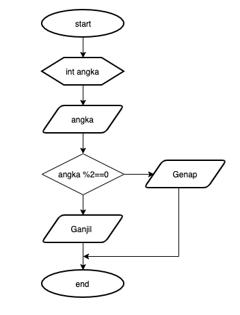

## JOBSHEET 5

## PEMILIHAN 1

### Tujuan

Mahasiswa mampu menyelesaikan permasalahan/studi kasus menggunakan sintaks pemilihan 1 dan mengimplemantasikannya dalam bahasa pemrogaman java.

### Alat dan Bahan
+ PC/laptop
+ Browser(chrome, firefox, safari)
+ Koneksi internet

### Praktikum

#### Percobaan 1 : Penggunaan if

#### Waktu percobaan : 40 menit

1. Perhatikan flowchart dibawah ini!

    <p align="left">
    
    </p>
    

> Flowchart diatas digunakan untuk menentukan bilangan ganjil/genap, selanjutnya kita akan membuat programnya berdasarkan
> flowchart di atas!

2. Tambahkan library Scanner, deklarasi Scanner, dan buat variabel bil untuk menampung data yang diinput melalui keyboard

    


```Java
// Ketik kode program di atas di bawah 
import java.util.Scanner;
Scanner input = new Scanner(System.in);
int bil;
System.out.print("Masukkan sebuah bilangan: ");
bil = input.nextInt();
```

Penjelasan:
Kode program tersebut berfungsi untuk menginput data agar bisa diseleksi di kode program selanjutnya.

3. Buatlah struktur kondisi untuk mengecek apakah bilangan tersebut merupakan bilangan genap atau ganjil

    


```Java
// Ketik kode program di atas di bawah sini
if(bil%2 == 0){
    System.out.println("Bilangan Genap");
}else{
    System.out.println("Bilangan Ganjil");
}
```

    Bilangan Ganjil


Penjelasan:
Kode program berikut berfungsi untuk menyeleksi bilangan agar menjadi salah satu dari dua output, yaitu Bilangan Genap/Bilangan Ganjil. Jika Bilangan Tersebut dibagi 2 akan bernilai sisa 0, maka bilangan tersebut mengeluarkan output "Bilangan Genap", namun jika bilangan tersebut jika dibagi 2 menyisakan 1, maka bilangan tersebut akan mengeluarkan output "Bilangan Ganjil".

##### Pertanyaan
1. Modifikasi program diatas dibagian struktur pemilihannya sehingga menjadi sebagai berikut:

    


```Java
// Ketik kode program di atas di bawah sini
String output = (bil % 2 == 0) ? "Bilangan Genap":"Bilangan Ganjil";
System.out.println(output);
```

    Bilangan Ganjil


Karena kode program tersebut hanya memiliki sintaks yang berbeda, namun memiliki konsep sama, yaitu "Jika bilangan dibagi dengan 2 bersisa 0, maka akan menghasilkan output Bilangan Genap, namun jika bilangan dibagi dengan 2 bersisa 1, maka akan menghasilkan output Bilangan Ganjil".

2. Jalankan dan amatilah hasilnya!
3. Jelaskan mengapa output program yang dimodifikasi sama dengan output program sebelum dimodifikasi!

#### Percobaan 2 : Penggunaan if else

#### Waktu percobaan : 40 menit

+ Buatlah sebuah variabel nilai untuk menyimpan inputan dari keyboard

    


```Java
// Ketik kode program di atas di bawah sini
 int nilai;
System.out.print("Masukkan sebuah bilangan: ");
nilai = input.nextInt();
```

    Masukkan sebuah bilangan: 2


Penjelasan:
Sama seperti sebelumnya, kode program tersebut berfungsi untuk menginput data agar bisa diseleksi di kode program selanjutnya.

+ Tambahkan sebuah kondisi untuk mengecek input pada variabel nilai

    


```Java
// Ketik kode program di atas di bawah sini
if(nilai >= 100){
    nilai += 10;
}else{
    nilai -= 10;
}
System.out.println("Hasil akhir nilai adalah " + nilai);
```

Penjelasan: Program tersebut berfungsi untuk menghitung bilangan. Jika bilangan tersebut bernilai diatas 100, maka nilai bilangan akan ditambah dengan 10. Tapi jika sebaliknya, maka nilai bilangan akan dikurangi dengan 10.

+ Jalankan program. Amati apa yang terjadi!

##### Pertanyaan
1. Jelaskan fungsi kode program berikut:
    
    ```
    nilai+=10;
    nilai-=10;
    ```

2. Modifikasilah program diatas dimana inputannya yang awalnya hanya satu kemudian diganti 2 inputan (misal : nilai1 dan nilai2), lakukan perhitungan rata-rata kedua nilai tersebut jika nilainya lebih dari sama dengan 100 maka dikurangi 5, sedangkan jika nilai rata-rata tersebut kurang dari 100 maka akan langsung dicetak!

 Penjelasan Nomor 1:
fungsi kode berikut ada untuk menambah/mengurangi bilangan awal dengan angka 10.


```Java
// Ketik kode program di atas di bawah sini
import java.util.Scanner;
Scanner input = new Scanner(System.in);
 int nilai1, nilai2, ratarata, ratarata2;
System.out.print("Masukkan bilangan pertama: ");
nilai1 = input.nextInt();
System.out.print("Masukkan bilangan kedua: ");
nilai2 = input.nextInt();
ratarata = (nilai1 + nilai2) / 2;
ratarata2 = ratarata - 5;
if(ratarata >= 100){
    System.out.println(ratarata2);
}else{
    System.out.println(ratarata);
}

```

    Masukkan bilangan pertama: 100
    Masukkan bilangan kedua: 100
    95


#### Percobaan 3 : Penggunaan if else-if else

#### Waktu percobaan : 40 menit

+ Tambahakan library `Scanner`
+ Buatlah deklarasi `Scanner`
+ Buat variabel umur bertipe `int`

    


```Java
// Ketik kode program di atas di bawah sini
int umur;
System.out.print("Masukkan umur Anda: ");
umur = input.nextInt();
```

    Masukkan umur Anda: 15


Penjelasan: Program berikut digunakan untuk menginput umur.

+ Kode untuk melakukan pengecekan variabel `umur`

    


```Java
// Ketik kode program di atas di bawah sini
if(umur > 60)
    System.out.println("Lansia");
else if(umur > 45)
    System.out.println("Tua");
else if(umur > 17)
    System.out.println("Dewasa");
else if(umur > 5)
    System.out.println("Anak-anak");
else
    System.out.println("Balita");
```

    Anak-anak


Penjelasan: Program berikut digunakan untuk menyeleksi umur antara lansia, tua, dewasa, anak-anak, atau balita.

+ Jalankan program dan amati apa yang terjadi!

##### Percobaan 4 : Penggunaan switch-case

#### Waktu percobaan : 40 menit

1. Deklarasikan Scanner
1. Buatlah variabel-variabel berikut

    


```Java
// Ketik kode program di atas di bawah sini
Scanner sc = new Scanner(System.in);
double angka1, angka2, hasil;
char operator;
```

Penjelasan: Program tersebut digunakan untuk membuat variabel.

3. Kode program untuk meminta inputan dari keyboard

    


```Java
// Ketik kode program di atas di bawah sini
System.out.print("Masukkan angka pertama: ");
angka1 = sc.nextDouble();
System.out.print("Masukkan angka kedua: ");
angka2 = sc.nextDouble();
System.out.print("Masukkan operator (+ - * /): ");
operator = sc.next().charAt(0);
```

    Masukkan angka pertama: 12
    Masukkan angka kedua: 34
    Masukkan operator (+ - * /): +


Penjelasan: Kode berikut digunakan untuk memasukkan 2 bilangan, dan menghitungnya (menambah, mengurangi, mengkali, membagi).

4. Kode di bawah ini untuk melakukan pengecekan operator yang digunakan sebelum dilakukan operasi aritmatika

    


```Java
// Ketik kode program di atas di bawah sini
switch(operator){
        case '+':
        hasil = angka1 + angka2;
        System.out.println(angka1 + " + " + angka2 + " = " + hasil);
        break;
         case '-':
        hasil = angka1 - angka2;
        System.out.println(angka1 + " - " + angka2 + " = " + hasil);
        break;
         case '*':
        hasil = angka1 * angka2;
        System.out.println(angka1 + " * " + angka2 + " = " + hasil);
        break;
         case '/':
        hasil = angka1 / angka2;
        System.out.println(angka1 + " / " + angka2 + " = " + hasil);
        break;
        default:
        System.out.println("Operator yang Anda masukkan salah");
        
}
```

    12.0 + 34.0 = 46.0


Penjelasan: Kode berikut digunakan untuk mengetahui hasil dari perhitungan bilangan di atas.

5. Jalankan program. Amati apa yang terjadi!

##### Pertanyaan
1. Jelaskan fungsi dari break dan default pada percobaan 4 diatas!
2. Jelaskan fungsi perintah kode program dibawah ini pada percobaan 4!

    ```
    operator = sc.next().chartAt(0);
    ```

Jawaban:
1. digunakan jika input tidak sesuai program
2. Digunakan untuk mengambil karakter

### Tugas

#### Waktu pengerjaan Tugas: 140 menit

1. Buatlah program untuk menginputkan dua buah bilangan bulat, kemudian mencetak salah satu bilangan yang nilainya terbesar.
2. Perhatikan flowchart berikut ini:


> Buatlah program sesuai dengan flowchart diatas!

3. Pada akhir semester seorang dosen menghitung nilai akhir dari mahasiswa yang terdiri dari nilai uas, uts, kuis, dan tugas. Nilai akhir didapatkan dari 40% nilai uas, 30% nilai uts, 10% nilai kuis, dan 20% nilai tugas. Jika nilai akhir dari mahasiswa dibawah 65 maka mahasiswa tersebut akan mendapatkan remidi. Buatlah program untuk membantu mengetahui mahasiswa yang mendapatkan remidi berdasarkan nilai akhir yang didapatkannya!

4. Sebuah toko memberikan diskon kepada pelanggannya dengan ketentuan sebagai berikut:

| Total Belanja     | Potongan |
|-------------------|----------|
| >Rp. 200.000,00   | 2%       |
| >Rp. 500.000,00   | 5%       |
| >Rp. 1.000.000,00 | 10%      |

> Total belanja diperoleh dari pembelian tiga barang yaitu barang A, barang B, dan barang C. Ketika menginputkan harga barang juga menginputkan jumlah barang yang dibeli.

Contoh outputnya
```
Masukkan harga barang A   :100000
Masukkan jumlah barang A  :10
Masukkan harga barang B   :250000
Masukkan jumlah barang B  :5
Masukkan harga barang C   :150000
Masukkan jumlah barang C  :1
---------------------------------------------
                Struk total
---------------------------------------------
Nama Barang 	| 	Harga 	| 	Jumlah 	| 	Total
Barang A            100000         10        1000000   
Barang B            250000         5         1250000   
Barang C            150000         1         150000    
Total       :2400000
Diskon      :240000.0
Total Bayar :2160000.0
```


```Java
//Nomor 1
import java.util.Scanner;
Scanner input = new Scanner(System.in);
int bilangan1, bilangan2;
System.out.print("Masukkan bilangan pertama: ");
bilangan1 = input.nextInt();
System.out.print("Masukkan bilangan kedua: ");
bilangan2 = input.nextInt();
if(bilangan1 > bilangan2){
System.out.println(bilangan1);
}else{
System.out.println(bilangan2);
} 

```

    Masukkan bilangan pertama: 12
    Masukkan bilangan kedua: 1
    12


Penjelasan: kode program tersebut digunakan untuk membandingkan 2 bilangan. Cara kerjanya yaitu menginputkan kedua bilangan, lalu menyeleksi, dan mengeluarkan output bilangan yang jumlahnya paling besar.


```Java
//Nomor 2
import java.util.Scanner;
Scanner input = new Scanner(System.in);
int umur;
System.out.print("Masukkan umur: ");
umur = input.nextInt();
if(umur >= 17){
    System.out.println("Boleh berkendara");
}else{
    System.out.println("Tidak boleh berkendara");
}
```

    Masukkan umur: 18
    Boleh berkendara


Penjelasan: 
Kode program tersebut berfungsi untuk menentukan umur berapa warga negara boleh berkendara. Cara kerjanya yaitu menginputkan umur, lalu menyeleksinya, jika umur kurang dari 17 akan mengeluarkan output tidak boleh berkendara. Jika umur 17 keatas maka akan mengeluarkan output boleh berkendara.


```Java
//Nomor 3
import java.util.Scanner;
Scanner input = new Scanner(System.in);
int uas, uts, kuis, tugas, total;
System.out.print("Masukkan Nilai UAS: ");
uas = input.nextInt();
System.out.print("Masukkan Nilai UTS: ");
uts = input.nextInt();
System.out.print("Masukkan Nilai Kuis: ");
kuis = input.nextInt();
System.out.print("Masukkan Nilai Tugas: ");
tugas = input.nextInt();
total = (uas * 4/10) + (uts * 3/10) + (kuis * 1/10) + (tugas * 2/10);
if(total <= 65){
    System.out.println("Remidi");
}else{
    System.out.println("Tidak Remidi");
}
```

    Masukkan Nilai UAS: 0
    Masukkan Nilai UTS: 0
    Masukkan Nilai Kuis: 100
    Masukkan Nilai Tugas: 100
    Remidi


Penjelasan: Kode program tersebut berfungsi untuk menentukan remidi atau tidaknya siswa. Cara kerjanya yaitu menginput 4 nilai, yaitu uas, uts, kuis, dan tugas. Lalu membaginya di setiap bagian, misal uas hanya mengambil 40% nilainya, uts hanya mengambil 30%, kuis hanya diambil 10%, serta tugas diambil 20%. Setelah itu nilai akan diseleksi, jika nilai 65 keatas, maka akan memunculkan output tidak remidi, namun jika nilai dibawah 65, maka akan memunculkan output remidi.


```Java
//Nomor 4
import java.util.Scanner;
Scanner input = new Scanner(System.in);
long barang1, barang2, barang3, jmlbarang1, jmlbarang2, jmlbarang3, totalbarang1, totalbarang2, totalbarang3, totalbarang, totalbayar, diskon, totaldiskon1, totaldiskon2, totaldiskon3;
System.out.print("Masukkan Harga Barang A: ");
barang1 = input.nextLong();
System.out.print("Masukkan Jumlah Barang A: ");
jmlbarang1 = input.nextLong();
System.out.print("Masukkan Harga Barang B: ");
barang2 = input.nextLong();
System.out.print("Masukkan Jumlah Barang B: ");
jmlbarang2 = input.nextLong();
System.out.print("Masukkan Harga Barang C: ");
barang3 = input.nextLong();
System.out.print("Masukkan Jumlah Barang C: ");
jmlbarang3 = input.nextLong();
System.out.println("----------------------------------------------------------------");
System.out.println("                           Struk Total                          ");
System.out.println("----------------------------------------------------------------");
totalbarang1 = barang1 * jmlbarang1;
totalbarang2 = barang2 * jmlbarang2;
totalbarang3 = barang3 * jmlbarang3;
totalbarang = totalbarang1 + totalbarang2 + totalbarang3;
totalbayar = totalbarang - diskon;
System.out.println("Nama Barang               |     Harga     |      Jumlah     |  Total"); 
System.out.println("Barang A                     " + barang1 + "              " + jmlbarang1 + "            " + totalbarang1); 
System.out.println("Barang B                     " + barang2 + "              " + jmlbarang2 + "            " + totalbarang2); 
System.out.println("Barang C                     " + barang3 + "              " + jmlbarang3 + "            " + totalbarang3);
System.out.println("Total      :" + totalbarang);
if(totalbarang > 1000000)
System.out.println("Diskon     :" + totalbarang * 10 / 100);
else if(totalbarang > 500000)
System.out.println("Diskon     :" + totalbarang * 5 / 100);
else if(totalbarang > 200000)
System.out.println("Diskon     :" + totalbarang * 2 / 100);
else
System.out.println("Diskon     : 0");
if(totalbarang > 1000000)
System.out.println("Total Bayar:" + (totalbarang - totalbarang * 10 / 100));
else if(totalbarang > 500000)
System.out.println("Total Bayar:" + (totalbarang - totalbarang * 5 / 100));
else if(totalbarang > 200000)
System.out.println("Total Bayar:" + (totalbarang - totalbarang * 2 / 100));
else
System.out.println("Total Bayar:" + totalbarang);
```

    Masukkan Harga Barang A: 100000
    Masukkan Jumlah Barang A: 10
    Masukkan Harga Barang B: 250000
    Masukkan Jumlah Barang B: 5
    Masukkan Harga Barang C: 150000
    Masukkan Jumlah Barang C: 1
    ----------------------------------------------------------------
                               Struk Total                          
    ----------------------------------------------------------------
    Nama Barang               |     Harga     |      Jumlah     |  Total
    Barang A                     100000              10            1000000
    Barang B                     250000              5            1250000
    Barang C                     150000              1            150000
    Total      :2400000
    Diskon     :240000
    Total Bayar:2160000


Penjelasan: Kode program tersebut digunakan untuk menghitung diskon pada belanjaan. Cara kerjanya yaitu memasukkan input Barang A, Barang B, dan Barang C, baik jumlah barang maupun harga barang. Selanjutnya akan menghasilkan total harga pada setiap barang berdasarkan harga barang dan jumlah yang dibeli. Selanjutnya semua harga barang akan ditotal. Diskon akan muncul berdasarkan harga barang. Jika harga barang diatas 1000000, maka akan memunculkan diskon 10%, jika harga barang diatas 500000, maka akan memunculkan diskon 5%, jika harga barang diatas 200000, maka akan memunculkan diskon 2%, namun jika barang dibawah angka-angka tersebut, maka tidak ada diskon. Setelah menentukan diskon maka harga total pada barang akan dikurangkan dengan harga total barang * diskon. lalu akan memunculkan output berapa harga total final yang harus dibayar pelanggan.
