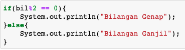

## JOBSHEET 5

## PEMILIHAN 1

### Tujuan

Mahasiswa mampu menyelesaikan permasalahan/studi kasus menggunakan sintaks pemilihan 1 dan mengimplemantasikannya dalam bahasa pemrogaman java.

### Alat dan Bahan
+ PC/laptop
+ Browser(chrome, firefox, safari)
+ Koneksi internet

### Praktikum

#### Percobaan 1 : Penggunaan if

#### Waktu percobaan : 40 menit

1. Perhatikan flowchart dibawah ini!

    <p align="left">
    
    </p>
    

> Flowchart diatas digunakan untuk menentukan bilangan ganjil/genap, selanjutnya kita akan membuat programnya berdasarkan
> flowchart di atas!

2. Tambahkan library Scanner, deklarasi Scanner, dan buat variabel bil untuk menampung data yang diinput melalui keyboard

    


```Java
import java.util.Scanner;
Scanner input = new Scanner (System.in);
int bil;
System.out.print("Masukan sebuah Bilangan: ");
bil = input.nextInt();
```

    Masukan sebuah Bilangan: 26


Penjelasan: Dengan java util scanner kita bisa memasukkan bilangan yang kita mau.

3. Buatlah struktur kondisi untuk mengecek apakah bilangan tersebut merupakan bilangan genap atau ganjil

    


```Java
if(bil%2 == 0){
    System.out.println("Bilangan Genap");
}else{
    System.out.println("Bilangan Ganjil");
}

```

    Bilangan Genap


Penjelasan: Syntax ini menunjukkan atau mengoutputkan, jika (if) bil bisa dibagi 2 maka outputnya "Bilangan Genap" jika tidak (else) maka outputnya "Bilangan Ganjil"

##### Pertanyaan
1. Modifikasi program diatas dibagian struktur pemilihannya sehingga menjadi sebagai berikut:

    


```Java
String output = (bil%2 == 0) ? "Bilangan Genap" : "Bilangan Ganjil";
System.out.println(output);

```

    Bilangan Genap


Penjelasan: Hasilnya atau outputnnya sama, hanya saja syntaxnya atau penulisannya lebih simple. Jadi (? artinya if ) sedangkan 
(: artinya else)

2. Jalankan dan amatilah hasilnya!
3. Jelaskan mengapa output program yang dimodifikasi sama dengan output program sebelum dimodifikasi!

#### Percobaan 2 : Penggunaan if else

#### Waktu percobaan : 40 menit

+ Buatlah sebuah variabel nilai untuk menyimpan inputan dari keyboard

    


```Java

int nilai;
System.out.print("Masukan sebuah bilangan: ");
nilai = input.nextInt();
 
```

    Masukan sebuah bilangan: 28


Penjelasan: Penginputan bilangan yg integer,

+ Tambahkan sebuah kondisi untuk mengecek input pada variabel nilai

    


```Java
if(nilai >= 100){
    nilai += 10;
}else {
    nilai -= 10;
}
System.out.println("Hasil akhir nilai adalah " +nilai);
```

    Hasil akhir nilai adalah 18


+ Jalankan program. Amati apa yang terjadi!

##### Pertanyaan
1. Jelaskan fungsi kode program berikut:
    
    ```
    nilai+=10;
    nilai-=10;
    ```

2. Modifikasilah program diatas dimana inputannya yang awalnya hanya satu kemudian diganti 2 inputan (misal : nilai1 dan nilai2), lakukan perhitungan rata-rata kedua nilai tersebut jika nilainya lebih dari sama dengan 100 maka dikurangi 5, sedangkan jika nilai rata-rata tersebut kurang dari 100 maka akan langsung dicetak!

Penjelasan: if bilangan lebih besar dari 100 maka +10 . Namun jika bilangan lebih kecil dari 100 maka -10.
nilai+=10 --> ditambah 10
nilai-=10 --> dikurang 10


```Java
import java.util.Scanner;
Scanner scan = new Scanner(System.in);
double rata, angka1, angka2;
System.out.println("Masukkan nilai 1 : ");
angka1 = scan.nextDouble();
System.out.println("Masukkan nilai 2 : ");
angka2 = scan.nextDouble();

rata = (angka1 + angka2) / 2;
if(rata >= 100){
    rata -= 5;
    System.out.print("Rata-rata = " + rata);
} else {
    System.out.print("Rata-rata = " +rata);
}
```

    Masukkan nilai 1 : 
    500
    Masukkan nilai 2 : 
    200
    Rata-rata = 345.0

## rata = (angka1+angka2) / 2 ;
if( rata >= 100){
    rata -= 5;
    System.out.println("Hasilnya" + rata);
}

else {

System.out.println("Hasil akhir nilai adalah " +rata);
}


#### Percobaan 3 : Penggunaan if else-if else

#### Waktu percobaan : 40 menit

+ Tambahakan library `Scanner`
+ Buatlah deklarasi `Scanner`
+ Buat variabel umur bertipe `int`

    


```Java
import java.util.Scanner;
Scanner input = new Scanner (System.in);
int umur;
System.out.print("Masukkan umur Anda: ");
umur =input.nextInt();

```

    Masukkan umur Anda: 85


Penjelasan: syntax ini mendeklarasikan bahwa umur harus bil int.

+ Kode untuk melakukan pengecekan variabel `umur`

    


```Java
if(umur> 60)
    System.out.println("Lansia");
else if (umur > 45)
    System.out.println("Tua");
else if (umur > 17)
    System.out.println ("Dewasa");
else if (umur > 5)
    System.out.println("Anak-anak");
else
    System.out.println("Balita");

```

    Lansia


Penjelasan: Jika umur lebih dari 60 tahun maka outputnya Lansia, jika tidak maka akan dicek lagi di else if 45 ,jika umur lebih dari 45 maka outputnya Tua, jika masih bukan maka akan dicek lagi di else if 17, apabila umur lebih dari 17 maka akan mengeluarkan output Dewasa, jika tidak lagi maka akan dicek lagi apabila umur lebih dari 5 maka akan mengeluarkan output Anak-Anak, namun jika tidak lagi maka akan mengeluarkan output balita.

+ Jalankan program dan amati apa yang terjadi!

##### Percobaan 4 : Penggunaan switch-case

#### Waktu percobaan : 40 menit

1. Deklarasikan Scanner
1. Buatlah variabel-variabel berikut

    


```Java
import java.util.Scanner;
Scanner sc = new Scanner(System.in);
double angka1, angka2, hasil;
char operator;

```

3. Kode program untuk meminta inputan dari keyboard

    


```Java
System.out.println("Masukkan angka pertama : ");
angka1 = sc.nextDouble();
System.out.println("Masukkan angka kedua : ");
angka2 = sc.nextDouble();
System.out.println("Masukkan operator (+ - * /)");
operator = sc.next().charAt(0);
```

    Masukkan angka pertama : 
    30
    Masukkan angka kedua : 
    20
    Masukkan operator (+ - * /)
    +


Penjelasan: Ini kita memasukkan bilangan , nah Operator disini adalah + atau - atau *

4. Kode di bawah ini untuk melakukan pengecekan operator yang digunakan sebelum dilakukan operasi aritmatika

    


```Java
switch(operator){
    case '+':
        hasil = angka1 + angka2;
        System.out.println(angka1 + "+" + angka2 + "=" + hasil);
    break;
    case '-':
        hasil = angka1 - angka2;
        System.out.println(angka1 + "-" + angka2 + "=" + hasil);
    break;
    case '*':
        hasil = angka1 * angka2;
        System.out.println(angka1 + "*" + angka2 + "=" + hasil);
    break;
    case '/':
        hasil = angka1 / angka2;
        System.out.println(angka1 + "/" + angka2 + "=" + hasil);
    break;
    default:
        System.out.println("Operator yang anda masukkan salah");
}
```

    30.0+20.0=50.0


5. Jalankan program. Amati apa yang terjadi!

##### Pertanyaan
1. Jelaskan fungsi dari break dan default pada percobaan 4 diatas!
2. Jelaskan fungsi perintah kode program dibawah ini pada percobaan 4!

    ```
    operator = sc.next().chartAt(0);
    ```

Penjelasan : 
Break disini untuk memberi jarak (pemisah) antar case
Default disini seperti else.
Operator ini masuk ke peritah memasukkan operator yg kita mau.

### Tugas

#### Waktu pengerjaan Tugas: 140 menit

1. Buatlah program untuk menginputkan dua buah bilangan bulat, kemudian mencetak salah satu bilangan yang nilainya terbesar.
2. Perhatikan flowchart berikut ini:


> Buatlah program sesuai dengan flowchart diatas!

3. Pada akhir semester seorang dosen menghitung nilai akhir dari mahasiswa yang terdiri dari nilai uas, uts, kuis, dan tugas. Nilai akhir didapatkan dari 40% nilai uas, 30% nilai uts, 10% nilai kuis, dan 20% nilai tugas. Jika nilai akhir dari mahasiswa dibawah 65 maka mahasiswa tersebut akan mendapatkan remidi. Buatlah program untuk membantu mengetahui mahasiswa yang mendapatkan remidi berdasarkan nilai akhir yang didapatkannya!

4. Sebuah toko memberikan diskon kepada pelanggannya dengan ketentuan sebagai berikut:

| Total Belanja     | Potongan |
|-------------------|----------|
| >Rp. 200.000,00   | 2%       |
| >Rp. 500.000,00   | 5%       |
| >Rp. 1.000.000,00 | 10%      |

> Total belanja diperoleh dari pembelian tiga barang yaitu barang A, barang B, dan barang C. Ketika menginputkan harga barang juga menginputkan jumlah barang yang dibeli.

Contoh outputnya
```
Masukkan harga barang A   :100000
Masukkan jumlah barang A  :10
Masukkan harga barang B   :250000
Masukkan jumlah barang B  :5
Masukkan harga barang C   :150000
Masukkan jumlah barang C  :1
---------------------------------------------
                Struk total
---------------------------------------------
Nama Barang 	| 	Harga 	| 	Jumlah 	| 	Total
Barang A            100000         10        1000000   
Barang B            250000         5         1250000   
Barang C            150000         1         150000    
Total       :2400000
Diskon      :240000.0
Total Bayar :2160000.0
```


```Java
import java.util.Scanner;
Scanner scan = new Scanner(System.in);
int bilA, bilB ;
System.out.println ("Masukkan bil A: ");
bilA = scan.nextInt();
System.out.println ("Masukkan bil B: ");
bilB =scan.nextInt();

if(bilA > bilB) {
System.out.println ("Hasilnya : " + bilA);
} else {
System.out.println ("Hasilnya: " + bilB);
}

```

    Masukkan bil A: 
    20
    Masukkan bil B: 
    30
    Hasilnya: 30


Penjelasan: Masukan bilangan lalu yang paling besar adalah hasilnya.


```Java
import java.util.Scanner;
Scanner age = new Scanner(System.in);
int Umur ;
System.out.println ("Berapa Umurmu: ");
Umur = age.nextInt();

if(Umur >=17 ) {
System.out.println ("Anda Boleh Berkendara, Karena umur Anda : " +Umur);
} else{
System.out.println ("Anda Tidak Boleh Berkendara, Karena Umur Anda masih : " + Umur);
}
```

    Berapa Umurmu: 
    45
    Anda Boleh Berkendara, Karena umur Anda : 45


Karena if nya lebih dari 17, maka dia bole berkendara, sebaliknya dengan else kurang dari 17 maka outputnya tidak bole berkendara


```Java
import java.util.Scanner;
Scanner nilai = new Scanner(System.in);
double uas, uts, kuis, tugas, nilaiakhir ;
System.out.println ("Nilai UAS : ");
uas = nilai.nextDouble ();
System.out.println ("Nilai UTS : ");
uts = nilai.nextDouble ();
System.out.println ("Nilai Kuis : ");
kuis = nilai.nextDouble ();
System.out.println ("Nilai Tugas :");
tugas = nilai.nextDouble ();

nilaiakhir = (0.4*uas) + (0.3*uts) + (0.1*kuis) + (0.2*tugas);
System.out.println("Hasil Akhir mu : "+ nilaiakhir);

if(nilaiakhir <= 65) {
System.out.println ("Sayang sekali,Kamu REMIDI");
} else {
System.out.println ("Selamat ga remidi yey");
}


```

    Nilai UAS : 
    67
    Nilai UTS : 
    78
    Nilai Kuis : 
    88
    Nilai Tugas :
    90
    Hasil Akhir mu : 77.0
    Selamat ga remidi yey


Penjelasan: pertamanya angka dimasukkan lalu melewati proses nilai akhir yaitu diambil berpa persennya, lalu dijumlahkan. jika dibawah 65 maka outputnya REMIDI.


```Java
import java.util.Scanner;
Scanner price = new Scanner (System.in);
double hargaA,hargaB,hargaC,jumlahA,jumlahB,jumlahC,total,Diskon,Bayar;
System.out.println ("Harga A : ");
hargaA = price.nextDouble();
System.out.println ("Jumlah A: ");
jumlahA = price.nextDouble();
System.out.println ("Harga B : ");
hargaB = price.nextDouble();
System.out.println ("Jumlah B : ");
jumlahB = price.nextDouble();
System.out.println ("Harga C : ");
hargaC = price.nextDouble();
System.out.println("Jumlah C: ");
jumlahC = price.nextDouble();

total = (hargaA*jumlahA)+ (hargaB*jumlahB) + (hargaC*jumlahC);
System.out.println ("Total harga : " + total);


if(total > 200000 && total < 500000 ){
Diskon = total * 0.02;
Bayar = total-Diskon;
System.out.println ("Diskonnya : "+ Diskon);
System.out.println ("Total Akhir Anda : " + Bayar);
} else if (total > 5000000 && total < 1000000){
Diskon = total* 0.05;
Bayar = total-Diskon;
System.out.println ("Diskonnya : "+ Diskon);
System.out.println ("Total Akhir Anda : " + Bayar);
} else if (total> 1000000){
Diskon = total*0.1;
Bayar = total-Diskon;
System.out.println ("Diskonnya : "+ Diskon);
System.out.println ("Total Akhir Anda : " + Bayar);
} else {
System.out.println ("Total Akhir Anda : " + total);

}


```

    Harga A : 
    100000
    Jumlah A: 
    10
    Harga B : 
    250000
    Jumlah B : 
    5
    Harga C : 
    150000
    Jumlah C: 
    1
    Total harga : 2400000.0
    Diskonnya : 240000.0
    Total Akhir Anda : 2160000.0


Penjelasan: Menginputkan harga dan jumlahnya, lalu melewati proses pentotalan beserta pengurangan diskon,dan jadilah hasil akhir, dan jangan lupa diberi limitnya.
