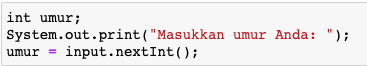

## JOBSHEET 5

## PEMILIHAN 1

### Tujuan

Mahasiswa mampu menyelesaikan permasalahan/studi kasus menggunakan sintaks pemilihan 1 dan mengimplemantasikannya dalam bahasa pemrogaman java.

### Alat dan Bahan
+ PC/laptop
+ Browser(chrome, firefox, safari)
+ Koneksi internet

### Praktikum

#### Percobaan 1 : Penggunaan if

#### Waktu percobaan : 40 menit

1. Perhatikan flowchart dibawah ini!

    <p align="left">
    
    </p>
    

> Flowchart diatas digunakan untuk menentukan bilangan ganjil/genap, selanjutnya kita akan membuat programnya berdasarkan
> flowchart di atas!

2. Tambahkan library Scanner, deklarasi Scanner, dan buat variabel bil untuk menampung data yang diinput melalui keyboard

    


```Java
import java.util.Scanner;
Scanner input = new Scanner(System.in);
int bil;
System.out.print("Masukkan sebuah bilangan: ");
bil = input.nextInt();
```

    Masukkan sebuah bilangan: 10


Penjelasan :
1. Perintah **Scanner** berfungsi agar user bisa memasukkan nilai variabel melalui keyboard
2. Perintah **input.nextInt();** adalah perintah agar nilai dari variabel "bil" bisa di input kan oleh user dengan cara memasukkan nilai melalui keyboard

3. Buatlah struktur kondisi untuk mengecek apakah bilangan tersebut merupakan bilangan genap atau ganjil

    


```Java
if(bil % 2 == 0){
    System.out.println("Bilangan Genap");
}else{
    System.out.println("Bilangan Ganjil");
}

```

    Bilangan Genap


Penjelasan :

1. Dalam baris program di atas itu memakai metode pemilihan "if else"
2. **(bil % 2 == 0)** merupakan sebuah kondisi
3. **System.out.println("Bilangan Genap");** merupakan pernyataan untuk kondisi yang sudah di deklarasikan di atas
4. kemudian **"else"** merupakan perintah dimana jika kondisi pertama tidak terpenuhi, maka akan dieksekusi ke kondisi berikutnya. Dalam program di atas **System.out.println("Bilangan Ganjil");** merupakan pernyataan jika kondisi pertama tidak terpenuhi.

##### Pertanyaan
1. Modifikasi program diatas dibagian struktur pemilihannya sehingga menjadi sebagai berikut:

    


```Java
String output = (bil % 2 == 0) ? "Bilangan Genap":"Bilangan Ganjil";
System.out.println(output);

```

    Bilangan Genap


Penjelasan :

- Pada program ini kita memodifikasi menjadi cara yang lebih sederhana.

- Dengan cara susunan program seperti berikut : Tipe data variabel = Kondisi ? pernyataan1 : pernyataan2

- kemudian dibawahnya ditambahkan print untuk output nya.

- cara ini sebenarnya bentuk sederhana dari model pemilihan if else yang dimana sudah di jalankan sebelumnya, dimana salah satu syaratnya adalah minimal memiliki 2 pernyataan. Oleh karena itu hasil outputnya pun sama seperti program sebelumnya.
- program di atas disebut dengan Operator Ternary.

2. Jalankan dan amatilah hasilnya!
3. Jelaskan mengapa output program yang dimodifikasi sama dengan output program sebelum dimodifikasi!

#### Percobaan 2 : Penggunaan if else

#### Waktu percobaan : 40 menit

+ Buatlah sebuah variabel nilai untuk menyimpan inputan dari keyboard

    


```Java
int nilai;
System.out.print("Masukkan sebuah bilangan: ");
nilai = input.nextInt();
 
```

    Masukkan sebuah bilangan: 100


Penjelasan :

Disini kita membuat variabel "nilai" dengan tipe data "int".
Sama seperti program-program sebelumnya, pada program ini juga menggunakan perintah "Scanner". Dimana pada variabel nya diberikan perintah **input.nextInt();** agar user dapat menginput nilai variabel tersebut.

+ Tambahkan sebuah kondisi untuk mengecek input pada variabel nilai

    


```Java
if(nilai >= 100){
    nilai += 10;
}else{
    nilai -= 10;
}
System.out.println("Hasil akhir nilai adalah "+nilai);

```

    Hasil akhir nilai adalah 110


Penjelasan :

- Program ini menggunakan pemilihan "if else".
- Kondisi nya adalah **(nilai >= 100)** yang berarti nilai lebih besar sama dengan 100.
- fungsi kode **nilai += 10;** adalah Jika nilai variabel lebih besar atau sama dengan 100, maka nilai dari variabel "nilai" di tambahkan 10.
- fungsi kode **nilai -= 10;** adalah jika pada kondisi pertama nilai variabel yang di input kan tidak memenuhi / dibawah 100, maka secara otomatis nilai variabel nya di kurangi 10.


+ Jalankan program. Amati apa yang terjadi!

##### Pertanyaan
1. Jelaskan fungsi kode program berikut:
    
    ```
    nilai+=10;
    nilai-=10;
    ```

2. Modifikasilah program diatas dimana inputannya yang awalnya hanya satu kemudian diganti 2 inputan (misal : nilai1 dan nilai2), lakukan perhitungan rata-rata kedua nilai tersebut jika nilainya lebih dari sama dengan 100 maka dikurangi 5, sedangkan jika nilai rata-rata tersebut kurang dari 100 maka akan langsung dicetak!


```Java
//Modifikasi
import java.util.Scanner;
Scanner sc = new Scanner(System.in);
double nilai1, nilai2, mean;

System.out.print("Masukkan sebuah bilangan: ");
nilai1 = sc.nextDouble();
System.out.print("Masukkan sebuah bilangan: ");
nilai2 = sc.nextDouble();

mean = (nilai1 + nilai2) / 2;
        
if(mean >= 100){
        mean -= 5;
        System.out.println("Hasil nilai akhir adalah " + mean);
    }else{
         System.out.println("Hasil nilai akhir adalah " + mean);
    }
```

    Masukkan sebuah bilangan: 100
    Masukkan sebuah bilangan: 90
    Hasil nilai akhir adalah 95.0


Penjelasan :

- Dalam kode program di atas yang sudah dimodifikasi. terdapat tipe data double. kemudian terdapat variabel "nilai1, nilai2, mean".
- jika program di jalankan maka jika kondisi pertama terpenuhi, yaitu rata-rata lebih besar daripada 100. maka ouput yang di hasilkan yaitu nilai "mean" dikurangi 5 seperti dalam perintah **mean -= 5;**.
- Tanda **-=** merupakan operator Assigment

#### Percobaan 3 : Penggunaan if else-if else

#### Waktu percobaan : 40 menit

+ Tambahakan library `Scanner`
+ Buatlah deklarasi `Scanner`
+ Buat variabel umur bertipe `int`

    


```Java
int umur;
System.out.print("Masukkan umur Anda: ");
umur = input.nextInt();

```

    Masukkan umur Anda: 18


Penjelasan :
- tipe data "int"
- variabel "umur"
- Untuk variabel **umur** menggunakan input **Scanner**. Yang nantinya user dapat memasukkan nilai variabel melalui keyboard.

+ Kode untuk melakukan pengecekan variabel `umur`

    


```Java
if(umur > 60)
    System.out.println("Lansia");
else if(umur > 45)
    System.out.println("Tua");
else if(umur > 17)
    System.out.println("Dewasa");
else if(umur > 5)
    System.out.println("Anak-anak");
else
    System.out.println("Balita");

```

    Dewasa


Penjelasan :

Pada kode program pengecekan umur di atas dapat dijelaskan bahwa program tersebut menggunakan model pemilihan "if else if else"

Pada program tersebut terdapat 4 kondisi.
- Cara berjalannya program seperi berikut :
1. Pada kondisi Pertama yaitu **(umur > 60)**. jika nilai variabel yang di input kan lebih dari 60 maka output nya "Lansia"
2. Jika input nilai variabel lebih dari 45 maka outputnya "Tua", dan seterusnya seperti itu sesuai dengan kondisi.
3. Jika nilai variabel kurang dari 5, yang berarti tidak masuk ke dalam kondisi yang sudah di deklarasikan, maka output nya masuk ke "else" yang akan menampilkan output "Balita".

+ Jalankan program dan amati apa yang terjadi!

##### Percobaan 4 : Penggunaan switch-case

#### Waktu percobaan : 40 menit

1. Deklarasikan Scanner
1. Buatlah variabel-variabel berikut

    


```Java
Scanner sc = new Scanner(System.in);
double angka1, angka2, hasil;
char operator;

```

Penjelasan :

- diatas merupakan deklarasi dari Scanner, yang digunakan untuk input nilai dari variabel.
- Terdapat 4 variabel yaitu angka1, angka2, hasil, operator.
- Tipe data yang digunakan ada dua yaitu double dan char.
- Tipe data double digunakan untuk nilai variabel (bilangan riil)
- tipe data char digunakan untuk karakter dan hanya dapat menampung satu karakter saja.
- Setiap deklarasi harus diakhiri dengan titiK koma (;)

3. Kode program untuk meminta inputan dari keyboard

    


```Java
System.out.print("Masukkan angka pertama: ");
angka1 = sc.nextDouble();
System.out.print("Masukkan angka kedua: ");
angka2 = sc.nextDouble();
System.out.print("Masukkan operator (+ - * /): ");
operator = sc.next().charAt(0);

```

    Masukkan angka pertama: 6
    Masukkan angka kedua: 10
    Masukkan operator (+ - * /): +


Penjelasan :

- Dalam kode program di atas itu membuat inputan untuk nilai variabel yang sudah kita deklarasikan sebelumnya. Karena tipe data dari variabel angak1, angka2, hasil adaalh "double". Maka harus menggunakan **sc.nextDouble();** pada variabel nya.
- Untuk variabel "operator, karena tipe data nya "char" maka menggunakan **sc.next().charAt(0);**, Kode program ini memang di gunakan untuk menginput nilai dari sebuah tipe data karakter.
- "sc" dalam perintah **sc.nextDouble();** merupakan nama variabel scanner. Itu bisa di ubah tidak harus "sc".
- Dalam kode program di atas digunakan untuk perhitungan, jadi ketika kita memasukkan nilai variabel melalui keyboard maka variabel "angka1" dan variabel "angka2" akan di operasikan menggunakan "operator" yang kita input kan juga melalui keyboard.

4. Kode di bawah ini untuk melakukan pengecekan operator yang digunakan sebelum dilakukan operasi aritmatika

    


```Java
switch(operator){
    case '+':
        hasil = angka1 + angka2;
        System.out.println(angka1 + "+" + angka2 + "=" + hasil);
        break;
    case '-':
        hasil = angka1 - angka2;
        System.out.println(angka1 + " - " + angka2 + " = " + hasil);
        break;
    case '*':
        hasil = angka1 * angka2;
        System.out.println(angka1 + " * " + angka2 + " = " + hasil);
        break;
    case '/':
        hasil = angka1 / angka2;
        System.out.println(angka1 + " / " + angka2 + " = " + hasil);
        break;
    default:
        System.out.println("Operator yang Anda masukkan salah");  
         
}

```

    6.0+10.0=16.0


penjelasan :

- Pada kode program diatas menggunakan pemilihan "Switch case". Yang digunakan jika memiliki banyak kemungkinan yang harus dilakukan pada berbagai kondisi.
- Fungsi "break" daalm program tersebut adalah agar jika sebuah kondisi sudah terpenuhi dan akan menjalankan pernyataan yang sesuai dengan kondisi nya, setelah itu harus di "break" agar program berhenti, tidak lanjut memproses perintah yang ada di bawahnya. Jadi intinya perintah "break" itu sama dengan stop(berhenti).
- Kemudian terdapat perintah "default" yang berfungsi jika kondisi tidak terpenuhi sama sekali, maka dapat mengeluarkan output lainnya, yaitu melalui "default" dan tuliskan pernyataannya.

5. Jalankan program. Amati apa yang terjadi!

##### Pertanyaan
1. Jelaskan fungsi dari break dan default pada percobaan 4 diatas!
2. Jelaskan fungsi perintah kode program dibawah ini pada percobaan 4!

    ```
    operator = sc.next().chartAt(0);
    ```

### Tugas

#### Waktu pengerjaan Tugas: 140 menit

1. Buatlah program untuk menginputkan dua buah bilangan bulat, kemudian mencetak salah satu bilangan yang nilainya terbesar.
2. Perhatikan flowchart berikut ini:


> Buatlah program sesuai dengan flowchart diatas!

3. Pada akhir semester seorang dosen menghitung nilai akhir dari mahasiswa yang terdiri dari nilai uas, uts, kuis, dan tugas. Nilai akhir didapatkan dari 40% nilai uas, 30% nilai uts, 10% nilai kuis, dan 20% nilai tugas. Jika nilai akhir dari mahasiswa dibawah 65 maka mahasiswa tersebut akan mendapatkan remidi. Buatlah program untuk membantu mengetahui mahasiswa yang mendapatkan remidi berdasarkan nilai akhir yang didapatkannya!

4. Sebuah toko memberikan diskon kepada pelanggannya dengan ketentuan sebagai berikut:

| Total Belanja     | Potongan |
|-------------------|----------|
| >Rp. 200.000,00   | 2%       |
| >Rp. 500.000,00   | 5%       |
| >Rp. 1.000.000,00 | 10%      |

> Total belanja diperoleh dari pembelian tiga barang yaitu barang A, barang B, dan barang C. Ketika menginputkan harga barang juga menginputkan jumlah barang yang dibeli.

Contoh outputnya
```
Masukkan harga barang A   :100000
Masukkan jumlah barang A  :10
Masukkan harga barang B   :250000
Masukkan jumlah barang B  :5
Masukkan harga barang C   :150000
Masukkan jumlah barang C  :1
---------------------------------------------
                Struk total
---------------------------------------------
Nama Barang 	| 	Harga 	| 	Jumlah 	| 	Total
Barang A            100000         10        1000000   
Barang B            250000         5         1250000   
Barang C            150000         1         150000    
Total       :2400000
Diskon      :240000.0
Total Bayar :2160000.0
```


```Java
//Jawaban no 1
import java.util.Scanner;
Scanner sc = new Scanner(System.in);
int bilangan1, bilangan2;

System.out.print("Masukkan bilangan pertama: ");
bilangan1 = sc.nextInt();
System.out.print("Masukkan bilangan kedua: ");
bilangan2 = sc.nextInt();

if(bilangan1 > bilangan2){
    System.out.println("Nilai bilangan terbesar adalah " + bilangan1);
}else{
    System.out.println("Nilai bilangan terbesar adalah " + bilangan2);
}
```

    Masukkan bilangan pertama: 100
    Masukkan bilangan kedua: 90
    Nilai bilangan terbesar adalah 100


Penjelasan :

- Pada kode program di atas, menggunakan input "Scanner" yang dimana user dapat input nilai variabel melalui keyboard.
- Kemudian mendeklarasikan Scanner dan variabel.
- Disini saya memakai tipe data integer karena input yang akan saya masukkan yaitu bilangan bulat
- Menggunakan model pemilihan "if else", dengan kondisi **(bilangan1 > bilangan2)** yang berati jika kondisi pertama terpenuhi maka output yang di hasilkan adalah memunculkan bilangan1 (yang paling besar), begitupun sebaliknya.


```Java
//Jawaban no 2
import java.util.Scanner;
Scanner sc = new Scanner(System.in);
int umur;

System.out.print("Masukkan Umur Anda: ");
umur = sc.nextInt();

if (umur >= 17){
    System.out.print("Boleh Berkendara");
}else{
    System.out.print("todak boleh berkendara");
}
```

    Masukkan Umur Anda: 18
    Boleh Berkendara

Penjelasan :

- Pada kode program di atas saya menggunakan input Scanner untuk memasukkan nilai variabel nya.
- Mendeklarasikan Scanner dan variabel.
- Kemudian menggunakan moel pemilihan "if else" karena terdapat 2 pernyataan dan 1 kondisi
- Pada deklarasi kondisi **(umur >= 17)**, saya menggunakan operator relasi **>=**
- Jika kondisi pertama terpenuhi yaitu lebih dari sama dengan 17 maka output nya "Boleh Berkendara"


```Java
//Jawaban no 3
import java.util.Scanner;
Scanner sc = new Scanner(System.in);
int uas, uts, kuis, tugas, nilaiAkhir;

System.out.print("Masukkan Nilai UAS: ");
uas = sc.nextInt();
System.out.print("Masukkan Nilai UTS: ");
uts = sc.nextInt();
System.out.print("Masukkan Nilai Kuis: ");
kuis = sc.nextInt();
System.out.print("Masukkan Nilai Tugas: ");
tugas = sc.nextInt();

nilaiAkhir =(uas * 40/100) + (uts * 30/100) + (kuis * 10/100) + (tugas * 20/100);
System.out.println("Nilai Akhir Mahasiswa : " + nilaiAkhir);

if(nilaiAkhir <= 65){
    System.out.println("Remidi");
}else{
     System.out.println("Tidak Remidi");
}
```

    Masukkan Nilai UAS: 80
    Masukkan Nilai UTS: 95
    Masukkan Nilai Kuis: 100
    Masukkan Nilai Tugas: 75
    Nilai Akhir Mahasiswa : 85
    Tidak Remidi


Penjelasan :

- Disini saa menggunakan perintah scanner untuk inputnya
- Kemudian deklarasi variabel
- yang pertama membuat wadah untuk input nilai variabel, karena saya menggunakan tipe data integer, maka untuk input Scnner memakai **sc.nextInt();**. Disini "sc" merupakan variabel.
- Kemudian melakukan perhitungan untuk mencari nilai akhir mahasiswa.
- Saya menggunakan model "if else" untuk proses nya.
- Jika nilaiAkhir <= 65, maka output nya "Remidi", begitupun sebaliknya.


```Java
//Jawaban no 4
import java.util.Scanner;
Scanner sc = new Scanner(System.in);
int hargaA, hargaB, hargaC, jumlahA, jumlahB,jumlahC;
double diskon, totalBayar, totalBelanja;

System.out.print("Masukan harga barang A : ");
hargaA = sc.nextInt();
System.out.print("Masukan jumlah barang A : ");
jumlahA = sc.nextInt();
double totalA = hargaA * jumlahA;

System.out.print("Masukan harga barang B : ");
hargaB = sc.nextInt();
System.out.print("Masukan jumlah barang B : ");
jumlahB = sc.nextInt();
double totalB = hargaB * jumlahB;

System.out.print("Masukan harga barang C : ");
hargaC = sc.nextInt();
System.out.print("Masukan jumlah barang C : ");
jumlahC = sc.nextInt();
double totalC = hargaC * jumlahC;

totalBelanja = (int) totalA + (int) totalB + (int) totalC;

        if( totalBelanja > 1000000.0)
            diskon = 10.0/100.0;
        else if( totalBelanja > 500000.0)
            diskon = 5.0/100.0;
        else if( totalBelanja > 200000.0)
            diskon = 2.0/100.0;
        else
            diskon = 0;

double potongan = totalBelanja *  diskon;
totalBayar = totalBelanja - potongan;


System.out.println("----------------------------------------");
System.out.println("\t\tStruk Total ");
System.out.println("----------------------------------------");

System.out.println("Nama Barang\t | \tHarga\t | \tJumlah\t | \tTotal\t |");
System.out.println("Total");
System.out.printf("Barang A\t\t %d\t\t %d\t\t %d", hargaA, jumlahA,(int) totalA);
System.out.printf("\nBarang B\t\t %d\t\t %d\t\t %d", hargaB, jumlahB,(int) totalB);
System.out.printf("\nBarang C\t\t %d\t\t %d\t\t %d", hargaC, jumlahC,(int) totalC);

System.out.println("\nTotal\t\t: " + totalBelanja);
System.out.println("Diskon\t\t: " + potongan);
System.out.println("Total Bayar : " + totalBayar);
```

    Masukan harga barang A : 100000
    Masukan jumlah barang A : 10
    Masukan harga barang B : 250000
    Masukan jumlah barang B : 5
    Masukan harga barang C : 150000
    Masukan jumlah barang C : 1
    ----------------------------------------
    		Struk Total 
    ----------------------------------------
    Nama Barang	 | 	Harga	 | 	Jumlah	 | 	Total	 |
    Total
    Barang A		 100000		 10		 1000000
    Barang B		 250000		 5		 1250000
    Barang C		 150000		 1		 150000
    Total		: 2400000.0
    Diskon		: 240000.0
    Total Bayar : 2160000.0


Penjelasan :

- Pada kode pemograman di atas pada awal nya menggunakan Scanner untuk input nilai variabel.
- Deklarasi variabel, disini saya menggunakan tipe data double dan integer.
- Membuat tempat untuk input nilai variabel. karena tipe data yang di gunakan untuk variabel "hargaA, hargaB, hargaC, jumlahA, jumlahB,jumlahC" integer, jadi harus menggunakan **sc.nextInt();** (sc disini adalah variabel).
- Kemudian mencari total dari harga belanja, dengan menjumlahkan semua total barang yang dibeli
- Kemudian menggunakan metode pemilihan "if else if else", untuk menyaring total belanja masuk dalam kondisi yang mana, nanti akan di proses dan menghasilkan output berdasarkan kondisi yang terpenuhi.
