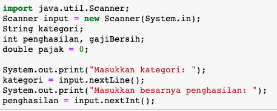

## JOBSHEET 6

## PEMILIHAN 2

### Tujuan

Mahasiswa memahami tentang operator logika; Mahasiswa mampu menyelesaikan permasalahan dengan menggunakan sintaks pemilihan bersarang; Mahasiswa mampu membuat sebuah program Java yang memanfaatkan sintaks pemilihan bersarang


### Alat dan Bahan
+ PC/laptop
+ Browser(chrome, firefox, safari)
+ Koneksi internet

### Praktikum

#### Percobaan 1

#### Waktu percobaan : 40 menit

1. Tambahkan library Scanner, deklarasi Scanner

2. Buatlah variabel nilai yang memiliki tipe data int untuk menampung data yang diinput melalui keyboard

    


```Java
// Ketik kode di sini
import java.util.Scanner;
Scanner input = new Scanner(System.in);
int nilai;
System.out.print("Masukan nilai ujian (0-100): ");
nilai = input.nextInt();
```

    Masukan nilai ujian (0-100): 105


3. Buatlah struktur pengecekan kondisi bersarang. Pengecekan pertama digunakan untuk memastikan bahwa nilai yang dimasukkan berada pada rentang 0 – 100. Jika nilai berada pada rentang 0 – 100, maka akan dilakukan pengecekan status kelulusan mahasiswa, yaitu jika nilai di antara 90 – 100 maka nilainya A, jika nilai di antara 80 – 89 maka nilainya B, jika nilai di antara 60 – 79 maka nilainya C, jika nilai di antara 50 – 59 maka nilainya D, dan jika nilai di antara 0 – 49 maka nilainya E. Sedangkan jika nilai berada di luar rentang 0 – 100, maka ditampilkan informasi bahwa nilai yang dimasukkan tidak valid.

    


```Java
// Ketik kode di sini
if(nilai >= 0 && nilai <= 100){
    if(nilai >= 90 && nilai <= 100){
        System.out.println("Nilai A, EXELLENT!");
    } else if (nilai >= 80 && nilai <=89){
        System.out.println("Nilai B, Pertahankan prestasi anda!");
    } else if (nilai >= 60 && nilai <= 79){
        System.out.println("Nilai C, Tingkatkan prestasi anda!");
    } else if (nilai >= 50 && nilai <= 69){
        System.out.println("Nilai D, Tingkatkan belajar anda!");
    } else {
        System.out.println("Nilai E, Anda tidak lulus!");
    }
} else {
    System.out.println("Nilai yang Anda masukan tidak valid!");
}
```

    Nilai yang Anda masukan tidak valid!


> Penjelasan kode program percobaan 1
import java.util.Scanner digunakan untuk mengimport scanner ke dalam program
Scanner input = new Scanner(System.in) digunakan untuk mendeklarasikan scanner.
kode program diatas bertujuan untuk membuat output berbeda pada setiap kodisi. kondisi yang dipakai menggunakan operator logika dan (&&), jadi jika satu kondisi tidak terpenuhi kondisi bernilai false.

##### Pertanyaan

1. Modifikasi kode program pada Percobaan 1 sehingga jika nilai yang dimasukkan kurang dari 0 akan ditampilkan output “Nilai yang Anda masukkan kurang dari 0” dan jika nilai yang dimasukkan lebih dari 100 akan ditampilkan output “Nilai yang Anda masukkan lebih dari 100”!

2. Jelaskan fungsi sintaks if (nilai >= 0 && nilai <= 100)!

3. Ubah operator && menjadi || pada sintaks if (nilai >= 0 && nilai <= 100). Jalankan program dengan memasukkan nilai = 105. Amati apa yang terjadi! Mengapa hasilnya demikian?


```Java
// Jawaban pertanyaan 1
if(nilai >= 0 && nilai <= 100){
    if(nilai >= 90 && nilai <= 100){
        System.out.println("Nilai A, EXELLENT!");
    } else if (nilai >= 80 && nilai <=89){
        System.out.println("Nilai B, Pertahankan prestasi anda!");
    } else if (nilai >= 60 && nilai <= 79){
        System.out.println("Nilai C, Tingkatkan prestasi anda!");
    } else if (nilai >= 50 && nilai <= 69){
        System.out.println("Nilai D, Tingkatkan belajar anda!");
    } else {
        System.out.println("Nilai E, Anda tidak lulus!");
    }
} else if (nilai > 100) {
    System.out.println("Nilai yang Anda masukan lebih dari 100!");
} else {
    System.out.println("Nilai yang Anda masukan kurang dari 100!");
}
```

    Nilai yang Anda masukan lebih dari 100!


2. fungsi dari sintaks if(nilai >=0 && nilai <= 100) adalah untuk membuat syarat kondisi dimana variabel nilai harus lebih besar samadengan 0 dan kurangdari samadengan 100. kondisi tidak terpenuhi jika salah satu syarat tersebut tidak terpenuhi


```Java
// Jawaban pertanyaan 3
if(nilai >= 0 || nilai <= 100){
    if(nilai >= 90 && nilai <= 100){
        System.out.println("Nilai A, EXELLENT!");
    } else if (nilai >= 80 && nilai <=89){
        System.out.println("Nilai B, Pertahankan prestasi anda!");
    } else if (nilai >= 60 && nilai <= 79){
        System.out.println("Nilai C, Tingkatkan prestasi anda!");
    } else if (nilai >= 50 && nilai <= 69){
        System.out.println("Nilai D, Tingkatkan belajar anda!");
    } else {
        System.out.println("Nilai E, Anda tidak lulus!");
    }
} else if (nilai > 100) {
    System.out.println("Nilai yang Anda masukan lebih dari 100!");
} else {
    System.out.println("Nilai yang Anda masukan kurang dari 100!");
}
```

    Nilai E, Anda tidak lulus!


karena operasi logika dan diganti menjadi operasi logika atau. ketika input nilai lebih dari 100 akanmemenuhi satu syarat yakni nilai>=0. sehingga meskiput tidak memenuhi ersyaratan satunya bahwa nilai lebih besar dari samadengan 100. kondisi tetap bernilai true karena operasi or dan salah satu syarat terpenuhi.

#### Percobaan 2

#### Waktu percobaan : 40 menit

1. Perhatikan flowchart dibawah ini!


> Flowchart tersebut digunakan untuk menghitung gaji bersih seseorang setelah dipotong pajak sesuai dengan kategorinya (pekerja dan pebisnis) dan besarnya penghasilan. 

2. Tambahkan library Scanner dan deklarasi Scanner

3. Deklarasikan variabel kategori, penghasilan, gajiBersih, dan pajak

    


```Java
// Ketik kode di sini
import java.util.Scanner;
Scanner input = new Scanner(System.in);
String kategori;
int penghasilan, gajiBersih;
double pajak = 0;

System.out.print("Masukan kategori: ");
kategori = input.nextLine();
System.out.print("Masukan besarnya penghasilan: ");
penghasilan = input.nextInt();
```

    Masukan kategori: pekerja
    Masukan besarnya penghasilan: 2048485


4. Buatlah struktur pengecekan kondisi bersarang. Pengecekan pertama digunakan untuk mengecek kategori (pekerja atau pebisnis). Selanjutnya dilakukan pengecekan kedua untuk menentukan besarnya pajak berdasarkan penghasilan yang telah dimasukkan.Kemudian tambahkan kode program untuk menghitung gaji bersih yang diterima setelah dipotong pajak!

    


```Java
// Ketik kode di sini
import java.util.Scanner;
Scanner input = new Scanner(System.in);
String kategori;
int penghasilan, gajiBersih;
double pajak = 0;

System.out.print("Masukan kategori: ");
kategori = input.nextLine();
System.out.print("Masukan besarnya penghasilan: ");
penghasilan = input.nextInt();

if(kategori.equalsIgnoreCase ("pekerja")){
    if(penghasilan <= 2000000){
        pajak = 0.1;
    } else if (penghasilan <= 3500000){
        pajak = 0.15;
    } else {
        pajak = 0.2;
    }
    gajiBersih = (int) (penghasilan - (penghasilan * pajak));
    System.out.println("Gaji bersih yang anda terima: " + gajiBersih);
}else if (kategori.equals ("pebisnis")){
    if(penghasilan <= 2500000){
        pajak = 0.15;
    } else if (penghasilan <= 3000000){
        pajak = 0.2;
    } else {
        pajak = 0.25;
    }
    gajiBersih = (int) (penghasilan - (penghasilan * pajak));
    System.out.println("Gaji bersih yang anda terima: " + gajiBersih);
} else {
    System.out.println("Kategori yang anda masukan salah!");
}
```

    Masukan kategori: Pebisnin
    Masukan besarnya penghasilan: 2700000
    Kategori yang anda masukan salah!


5. Jalankan program di atas. Amati apa yang terjadi!

> Penjelasan kode program percobaan 2
pertama mengimport scanner dan mendeklarasikanya. membuat variabel yang dibutuhkan lalu menginput dengan menggunkan scanner.lalu menggunakan siktaks pemilihan bersarang. pemilihan pertama ditentukan oleh variabel kategori. pada tahap berikutnya pemilihan menentukan besarnya pajak. setiap kategori memiliki pemilihan tahap 2 yang berbeda.

##### Pertanyaan

1. Jalankan program dengan memasukkan kategori = pekerja dan penghasilan = 2048485. Amati apa yang terjadi! Mengapa angka di belakang koma tidak ditampilkan?

2. Jelaskan fungsi dari (int) pada sintaks:
```
gajiBersih = (int) (penghasilan - (penghasilan * pajak));
```

3.	Jalankan program dengan memasukkan kategori = pebisnis dan penghasilan = 2000000. Amati apa yang terjadi! Apa kegunaan dari equalsIgnoreCase?

4.	Ubah equalsIgnoreCase menjadi equals, kemudian jalankan program dengan memasukkan kategori = pebisnis dan penghasilan = 2000000. Amati apa yang terjadi! Mengapa hasilnya demikian? Apa kegunaan dari equals?

// Jawaban pertanyaan
1. angka dibelakang koma tidak ditampilkan karena dalam sintaks ini 
    gajiBersih = (int) (penghasilan - (penghasilan * pajak)) 
    tipe datanya diubah kedalam bentuk integer
2. fungsi (int) dalam sintaks tersebut adalah mengubah tipe data variabel
    penghasilan dan pajak, yang semula double menjadi integer.
3. equalsIgnoreCase berfungsi untuk mengecek kesamaan. akan bernilai true jika
    terdapat kesamaan keseluruhan karakter atau kata tanpa memperhatikan huruf 
    kapital.
4. jika menggunakan equals semua karakter harus sama persis, termasuk huruf 
    kapital. jika tidak sesuai pada satu huruf kapital saja akan bernilai false
    


### Tugas

#### Waktu pengerjaan Tugas: 140 menit

1. Buatlah program kalkulator sederhana menggunakan bahasa pemrograman Java. User akan menginputkan dua buah bilangan riil dan satu buah operator aritmatika (+, -, *, atau /), kemudian program akan mengoperasikan dua bilangan tersebut dengan operator yang sesuai. Petunjuk: gunakan pernyataan switch-case.
Contoh tampilan program:

```
Masukkan bilangan pertama: 2.5
Masukkan operator (+, -, *, /): *
Masukkan bilangan kedua: 4
2.5 * 4.0 = 10.0

```


```Java
//ketik kode program dan lampirkan hasilnya disini
import java.util.Scanner;
Scanner input = new Scanner(System.in);
double bilanganPertama, bilanganKedua, hasil;
char operasi;

System.out.print("Masukan bilangan pertama: ");
bilanganPertama = input.nextDouble();
System.out.print("Masukan bilangan kedua: ");
bilanganKedua = input.nextDouble();
System.out.print("Masukan operasi (/,+,-,*): ");
operasi = input.next().charAt(0);

switch(operasi){
    case '+':
        hasil = bilanganPertama + bilanganKedua;
        System.out.println(bilanganPertama + " + " + bilanganKedua + " = " + hasil);
    break;
    case '-':
        hasil =bilanganPertama - bilanganKedua;
        System.out.println(bilanganPertama + " - " + bilanganKedua + " = " + hasil);
    break;
    case '*':
        hasil = bilanganPertama * bilanganKedua;
        System.out.println(bilanganPertama +  " x " + bilanganKedua + " = " + hasil);
    break;
    case '/':
        hasil = bilanganPertama / bilanganKedua;
        System.out.println(bilanganPertama + " / " + bilanganKedua + " = " + hasil);
    break;
    default:
        System.out.println("Operator yang Anda masukan salah");
}
```

    Masukan bilangan pertama: 5.5
    Masukan bilangan kedua: 2
    Masukan operasi (/,+,-,*): *
    5.5 x 2.0 = 11.0


> Penjelasan kode program Tugas 1
pertama-tama mengimport scanner dan mendeklarasikanya. lalu membuat variabel yang diperlukan. menggunakan scanner untuk menginput nilai pada variabel. menggunakan switch case dengan konstanta operasi yang diinputkan agar bisa dijalankan operasi aritmatika sesuai input yang diberikan.

2. Dengan menggunakan tiga nilai yang mewakili panjang tiga sisi sebuah segitiga, tentukan apakah segitiga tersebut sama sisi (ketiga sisinya bernilai sama), sama kaki (kedua sisinya bernilai sama), atau sembarang (tidak ada sisi yang bernilai sama)! 


```Java
//ketik kode program dan lampirkan hasilnya disini
import java.util.Scanner;
Scanner input = new Scanner(System.in);
double sisiPertama, sisiKedua, sisiKetiga;

System.out.print("Masukan sisi pertama: ");
sisiPertama = input.nextDouble();
System.out.print("Masukan sisi kedua: ");
sisiKedua = input.nextDouble();
System.out.print("Masukan sisi ketiga: ");
sisiKetiga = input.nextDouble();

if(sisiPertama == sisiKedua && sisiPertama == sisiKetiga && sisiKedua == sisiKetiga){
    System.out.print("Segitiga tersebut adalah segitiga sama sisi");
} else if (sisiPertama == sisiKedua || sisiPertama == sisiKetiga || sisiKedua == sisiKetiga){
    System.out.print("Segitiga tersebut adalah segitiga sama kaki");
} else {
    System.out.print("Segitiga tersebut adalah segitiga sembarang");
}
```

    Masukan sisi pertama: 2
    Masukan sisi kedua: 3
    Masukan sisi ketiga: 3
    Segitiga tersebut adalah segitiga sama kaki

> Penjelasan kode program percobaan 1
pertama-tama mengimport scanner dan mendeklarasikanya. lalu membuat variabel yang diperlukan. menggunakan scanner untuk menginput nilai pada variabel.lalu menggunakan if else if untuk memberikan output yang sesuai. kondisi menggunakan operator logika agar memudahkan dan mempersingkat. kodisi pertama dalah ketika semua sisi sama, jadi menggunakan operator logika dan (&&).kondisi kedua adalah ketika 2 sisi memiliki panjang yang sama. disini menggunakan operator or (||) agar bernilai benar ketika salah satu terpenuhi. kondisi disini tidak akan mengalami kesalahan hingga semuanya bernilai benar, karena jika semua sisi yang dimasukan sama maka akan bernilai benar di kondisi sebelumnya dan tidak akan turun ke kondisi kedua ini. keadaan berikutnya adalah ketika todak memenuhi kedua kondisi tersebut.

3. Warung Padang Gembira meminta Anda membuat sebuah program untuk menerima pesanan dari internet. Program yang Anda buat meminta user untuk memasukkan nama makanan dan harga. Setelah itu, user ditawarkan untuk menggunakan pengiriman ekspres. Jika pengguna menolak, maka jenis pengiriman yang digunakan adalah pengiriman reguler. Biaya pengiriman reguler untuk harga makanan kurang dari Rp 100.000 adalah Rp 20.000, sedangkan untuk harga makanan sama dengan atau lebih dari Rp 100.000 biaya pengirimannya adalah Rp 30.000. Untuk jenis pengiriman ekspres, tambahkan biaya tambahan sebesar Rp 25.000 dari standar biaya pengiriman reguler. Tampilkan struk yang berisi nama makanan yang dibeli + harga, biaya pengiriman, dan total yang harus dibayar!
Contoh hasil output program:

```
Masukkan nama makanan: Tuna salad
Masukkan harga makanan: Rp 115000
Apakah Anda ingin pengiriman ekspres (0 = tidak, 1 = ya)? 0

STRUK PEMBELIAN
Tuna salad        Rp 115000
Biaya pengiriman  Rp 30000
TOTAL             Rp 145000

```

```
Masukkan nama makanan: Beef bulgogi
Masukkan harga makanan: Rp 78000
Apakah Anda ingin pengiriman ekspres (0 = tidak, 1 = ya)? 1

STRUK PEMBELIAN
Beef bulgogi      Rp 115000
Biaya pengiriman  Rp 45000
TOTAL             Rp 123000

```


```Java
//ketik kode program dan lampirkan hasilnya disini
import java.util.Scanner;
Scanner input = new Scanner(System.in);
int express, harga, ongkosKirim, total;
String makanan;

System.out.print("Masukan nama makanan  : ");
makanan = input.nextLine();
System.out.print("Masukan harga makanan : ");
harga = input.nextInt();
System.out.print("Apakah Anda ingin pengiriman ekspres (0 = tidak, 1 = ya)");
express = input.nextInt();

if(express == 1){
        if(harga >100000){
            ongkosKirim = 55000;
        }else {
            ongkosKirim = 45000;
        }
        total = harga + ongkosKirim;
} else if( express == 0){
        if(harga >100000){
            ongkosKirim = 30000;
        }else {
            ongkosKirim = 20000;
        }
        total = harga + ongkosKirim;
}else {
        System.out.println("Mohon maaf input salah, mohon cek dan ulangi kembali");
}
System.out.println("STRUK PEMBELIAN");
System.out.println(makanan + " : " + harga);
System.out.println("Biaya pengiriman \t : " + ongkosKirim);
System.out.println("TOTAL \t\t\t : " + total);
```

    Masukan nama makanan  : bulgogi saos tiram
    Masukan harga makanan : 120000
    Apakah Anda ingin pengiriman ekspres (0 = tidak, 1 = ya)1
    STRUK PEMBELIAN
    bulgogi saos tiram : 120000
    Biaya pengiriman 	 : 55000
    TOTAL 			 : 175000


> Penjelasan kode program percobaan 1
pertama-tama mengimport scanner dan mendeklarasikanya. lalu membuat variabel yang diperlukan. menggunakan scanner untuk menginput nilai pada variabel.lalu menggunakan if else if untuk memberikan output yang sesuai. menggunakan if else if dengan kondisi input pemilihan pengirim yang diberikan. jika terpenuhi adan diteruskan ke pemilihan berikutnya yang didasarkan input harga. jika kondisi 1 tidak terpenuhi di kondisi 2 akan dilanjutkan ke pemilihan berikutnya yang nominalnya berbeda dengan pemilihan tahap 2 di kondisi 1. jika kondisi 1 dan 2 tidak terpenuhi saya memberikan output pesan untuk mengulang agar tidak terjadi eror

4. Perhatikan flowchart berikut ini!


> Buatlah program sesuai dengan flowchart diatas!


```Java
//ketik kode program dan lampirkan hasilnya disini
import java.util.Scanner;
Scanner input = new Scanner(System.in);
int umur, gaji, tanggungan, biayaHidup;
String kerja, sekolah;

System.out.print("Masukan Umur anda  : ");
umur = input.nextInt();
input.nextLine();
if(umur >= 18){
    System.out.print("Apakah anda bekerja  : (ya/tidak) ");
    kerja = input.nextLine();
    if (kerja.equalsIgnoreCase ("ya")){
            System.out.print("Masukan penghasilan perbulan :");
            gaji = input.nextInt();
            System.out.print("Masukan jumlah tanggungan :");
            tanggungan = input.nextInt();
        biayaHidup = gaji / tanggungan;
        if(biayaHidup < 300000){
            System.out.print("Penduduk miskin");
        }else{
            System.out.print("Bukan penduduk miskin");
        }
    }else if (kerja.equalsIgnoreCase ("tidak")){
            System.out.print("Penduduk miskin");
    }else {
            System.out.println("Input yang anda maskan salah");
    }
        
}else{
    System.out.print("Apakah anda bersekolah  : (ya/tidak) ");
    sekolah  = input.nextLine();
    
        if (sekolah.equalsIgnoreCase ("ya")){
        System.out.print("Bukan penduduk miskin");
        }else if (sekolah.equalsIgnoreCase ("tidak")){
        System.out.print("Penduduk miskin");
        }else{
        System.out.println("Input yang anda maskan salah");
        }
    
}
```

    Masukan Umur anda  : 21
    Apakah anda bekerja  : (ya/tidak) ya
    Masukan penghasilan perbulan :2000000
    Masukan jumlah tanggungan :5
    Bukan penduduk miskin

> Penjelasan kode program percobaan 1
pertama-tama mengimport scanner dan mendeklarasikanya. lalu membuat variabel yang diperlukan. menggunakan scanner untuk menginput nilai pada variabel. menggunakan if else pada pemilihan pertama. pada kondisi pertama jika jika umur lebih dari samadengan 18, adak diminta untuk menginputkan status pekerjaan. jika status tidak bekerja langsung menuju output "miskin" jika ststus bekerja lanjut menginput data penghasilan dan tanggungan yang kemudian dihitung untuk menentukan status "miskin" atau tidak. pada konsisi 2 jika usia dibawah 18 tahun, diminta memberikan input status sekolah. jika tidak sekolah output "miskin" jika status sekolah output "tidak miskin.


```Java

```
