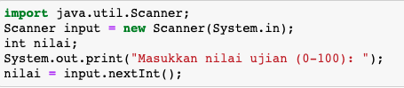

## JOBSHEET 6

## PEMILIHAN 2

### Tujuan

Mahasiswa memahami tentang operator logika; Mahasiswa mampu menyelesaikan permasalahan dengan menggunakan sintaks pemilihan bersarang; Mahasiswa mampu membuat sebuah program Java yang memanfaatkan sintaks pemilihan bersarang


### Alat dan Bahan
+ PC/laptop
+ Browser(chrome, firefox, safari)
+ Koneksi internet

### Praktikum

#### Percobaan 1

#### Waktu percobaan : 40 menit

1. Tambahkan library Scanner, deklarasi Scanner

2. Buatlah variabel nilai yang memiliki tipe data int untuk menampung data yang diinput melalui keyboard

    


```Java
// Ketik kode di sini
import java.util.Scanner;
Scanner input = new Scanner(System.in);
int nilai;
System.out.print("Masukkan nilai ujian (0-100): ");
nilai = input.nextInt();
```

    Masukkan nilai ujian (0-100): 95


3. Buatlah struktur pengecekan kondisi bersarang. Pengecekan pertama digunakan untuk memastikan bahwa nilai yang dimasukkan berada pada rentang 0 – 100. Jika nilai berada pada rentang 0 – 100, maka akan dilakukan pengecekan status kelulusan mahasiswa, yaitu jika nilai di antara 90 – 100 maka nilainya A, jika nilai di antara 80 – 89 maka nilainya B, jika nilai di antara 60 – 79 maka nilainya C, jika nilai di antara 50 – 59 maka nilainya D, dan jika nilai di antara 0 – 49 maka nilainya E. Sedangkan jika nilai berada di luar rentang 0 – 100, maka ditampilkan informasi bahwa nilai yang dimasukkan tidak valid.

    


```Java
// Ketik kode di sini
if(nilai >= 0 && nilai <= 100){
    if(nilai >= 90 && nilai <= 100){
        System.out.println("Nilai A, EXCELLENT!");
   }else if(nilai >= 80 && nilai <= 89){
        System.out.println("Nilai B, Pertahankan prestasi Anda!");
   }else if(nilai >= 60 && nilai <= 79){
        System.out.println("Nilai C, Tingkatkan prestasi Anda!");
   }else if(nilai >= 50 && nilai <= 59){
        System.out.println("Nilai D, Tingkatkan belajar Anda!");
   }else {
        System.out.println("Nilai E, Anda tidak lulus!");
    }
} else {
        System.out.println("Nilai yang Anda masukkan tidak valid!");
}
```

    Nilai A, EXCELLENT!


> Penjelasan kode program percobaan 1
Maksud dari kode diatas adalah jika nilai 0-100 maka proses : 
nilai 90-100 = Nilai A, EXCELLENT!
nilai 80-89 = Nilai B, Pertahankan prestasi Anda!
nilai 60-79 = Nilai C, Tingkatkan prestasi Anda!
nilai 50-59 = Nilai D, Tingkatkan belajar Anda!
Selain nilai diatas (0-49) = Nilai E, Anda tidak lulus!
Jika nilai yang dimasukkan bukan bilangan 0-100 maka akan muncul pernyataan "Nilai yang Anda masukkan tidak valid"

##### Pertanyaan

1. Modifikasi kode program pada Percobaan 1 sehingga jika nilai yang dimasukkan kurang dari 0 akan ditampilkan output “Nilai yang Anda masukkan kurang dari 0” dan jika nilai yang dimasukkan lebih dari 100 akan ditampilkan output “Nilai yang Anda masukkan lebih dari 100”!

2. Jelaskan fungsi sintaks if (nilai >= 0 && nilai <= 100)!

3. Ubah operator && menjadi || pada sintaks if (nilai >= 0 && nilai <= 100). Jalankan program dengan memasukkan nilai = 105. Amati apa yang terjadi! Mengapa hasilnya demikian?


```Java
// Jawaban pertanyaan no.1 :
Scanner input = new Scanner(System.in);
int nilai;
System.out.print("Masukkan nilai ujian (0-100): ");
nilai = input.nextInt();
if(nilai >= 0 && nilai <= 100){
    if(nilai >= 90 && nilai <= 100){
        System.out.println("Nilai A, EXCELLENT!");
   }else if(nilai >= 80 && nilai <= 89){
        System.out.println("Nilai B, Pertahankan prestasi Anda!");
   }else if(nilai >= 60 && nilai <= 79){
        System.out.println("Nilai C, Tingkatkan prestasi Anda!");
   }else if(nilai >= 50 && nilai <= 59){
        System.out.println("Nilai D, Tingkatkan belajar Anda!");
   }else {
        System.out.println("Nilai E, Anda tidak lulus!");
    }
} else if(nilai < 0){
        System.out.println("Nilai yang Anda masukkan kurang dari 0");
} else if(nilai > 100){
        System.out.println("Nilai yang Anda masukkan lebih dari 100");
}
```

    Masukkan nilai ujian (0-100): 112
    Nilai yang Anda masukkan lebih dari 100


Jawaban no.2 : Jika nilai yang diinput bilangan 0 <= x <= 100, maka proses perintah berikutnya.


```Java
// Jawaban pertanyaan no.3 : 
import java.util.Scanner;
Scanner input = new Scanner(System.in);
int nilai;
System.out.print("Masukkan nilai ujian (0-100): ");
nilai = input.nextInt();
if(nilai >= 0 || nilai <= 100){
    if(nilai >= 90 && nilai <= 100){
        System.out.println("Nilai A, EXCELLENT!");
   }else if(nilai >= 80 && nilai <= 89){
        System.out.println("Nilai B, Pertahankan prestasi Anda!");
   }else if(nilai >= 60 && nilai <= 79){
        System.out.println("Nilai C, Tingkatkan prestasi Anda!");
   }else if(nilai >= 50 && nilai <= 59){
        System.out.println("Nilai D, Tingkatkan belajar Anda!");
   }else {
        System.out.println("Nilai E, Anda tidak lulus!");
    }
} else {
        System.out.println("Nilai yang Anda masukkan tidak valid!");
}
```

    Masukkan nilai ujian (0-100): 105
    Nilai E, Anda tidak lulus!


Output yang keluar menjadi "Nilai E, Anda tidak lulus!"

Hal tersebut karena, apabila operatod diganti || (OR), apabila salah satu syaratnya terpenuhi maka akan dianggap true.

Sehingga 105 disini memenuhi syarat >=0, 105 akan diproses namun karena 105 tidak memenuhi kategori nilai A,B,C,D maka selain nilai itu outputnya adalah "Nilai E, Anda tidak lulus!".

#### Percobaan 2

#### Waktu percobaan : 40 menit

1. Perhatikan flowchart dibawah ini!


> Flowchart tersebut digunakan untuk menghitung gaji bersih seseorang setelah dipotong pajak sesuai dengan kategorinya (pekerja dan pebisnis) dan besarnya penghasilan. 

2. Tambahkan library Scanner dan deklarasi Scanner

3. Deklarasikan variabel kategori, penghasilan, gajiBersih, dan pajak

    


```Java
// Ketik kode di sini
import java.util.Scanner;
Scanner input = new Scanner(System.in);
String kategori;
int penghasilan, gajiBersih;
double pajak = 0;
System.out.print("Masukkan kategori: ");
kategori = input.nextLine();
System.out.print("Masukkan besarnya penghasilan: ");
penghasilan = input.nextInt();
```

    Masukkan kategori: pebisnis
    Masukkan besarnya penghasilan: 20000000


4. Buatlah struktur pengecekan kondisi bersarang. Pengecekan pertama digunakan untuk mengecek kategori (pekerja atau pebisnis). Selanjutnya dilakukan pengecekan kedua untuk menentukan besarnya pajak berdasarkan penghasilan yang telah dimasukkan.Kemudian tambahkan kode program untuk menghitung gaji bersih yang diterima setelah dipotong pajak!

    


```Java
// Ketik kode di sini
if(kategori.equalsIgnoreCase ("pekerja")){
    if (penghasilan <= 2000000){
        pajak = 0.1;
    } else if (penghasilan <= 3000000){
        pajak = 0.15;
    } else {
        pajak = 0.2;
    }
    gajiBersih = (int) (penghasilan - (penghasilan * pajak));
    System.out.println("Gaji bersih yang Anda terima: " + gajiBersih);
} else if (kategori.equalsIgnoreCase ("pebisnis")){
    if (penghasilan <= 2500000){
        pajak = 0.15;
    } else if (penghasilan <= 3500000){
        pajak = 0.2;
    } else {
        pajak = 0.25;
    }
    gajiBersih = (int) (penghasilan - (penghasilan * pajak));
    System.out.println("Gaji bersih yang Anda terima: " + gajiBersih);
} else {
    System.out.println("Kategori yang Anda masukkan salah!");
}
```

    Gaji bersih yang Anda terima: 15000000


5. Jalankan program di atas. Amati apa yang terjadi!

> Penjelasan kode program percobaan 2

jika katergori yang diinputkan "pekerja" (tanpa memperhatikan besar kecilnya huruf), maka : 

jika penghasilan pekerja <= 2.000.000, dikenakan pajak sebesar 10% dari penghasilan.

apabila tidak <= 2.000.000 dicek apakah gajinya <= 3.000.000 ? Jika iya maka dikenakan pajak sebesar 15% dari penghasilan.

apabila tidak <= 3.000.000 atau >3.000.000, maka dikenakan pajak sebesar 20% dari penghasilan.

Setelah ditentukan banyak pajaknya, maka kita dapat mencari gaji bersihnya dengan rumus :

gaji bersih = penghasilan - (penghasilan x pajak), dimana hasil gaji bersih disimpan dalam bentuk integer.

jika katergori yang diinputkan "pebisnis" (tanpa memperhatikan besar kecilnya huruf), maka :

jika penghasilan pekerja <= 2.500.000, dikenakan pajak sebesar 15% dari penghasilan.

apabila tidak <= 2.500.000 dicek apakah gajinya <= 3.500.000 ? Jika iya maka dikenakan pajak sebesar 20% dari penghasilan.

apabila tidak <= 3.500.000 atau >3.500.000, maka dikenakan pajak sebesar 25% dari penghasilan

gaji bersih = penghasilan - (penghasilan x pajak), dimana hasil gaji bersih disimpan dalam bentuk integer.

Jika kategori yang dimasukkan bukan "pekerja", dan bukan "pebisnis", maka akan keluar pernyataan "Kategori yang Anda masukkan salah!".

##### Pertanyaan

1. Jalankan program dengan memasukkan kategori = pekerja dan penghasilan = 2048485. Amati apa yang terjadi! Mengapa angka di belakang koma tidak ditampilkan?

2. Jelaskan fungsi dari (int) pada sintaks:
```
gajiBersih = (int) (penghasilan - (penghasilan * pajak));
```

3.	Jalankan program dengan memasukkan kategori = pebisnis dan penghasilan = 2000000. Amati apa yang terjadi! Apa kegunaan dari equalsIgnoreCase?

4.	Ubah equalsIgnoreCase menjadi equals, kemudian jalankan program dengan memasukkan kategori = pebisnis dan penghasilan = 2000000. Amati apa yang terjadi! Mengapa hasilnya demikian? Apa kegunaan dari equals?

// Jawaban pertanyaan

1.Karena pada perhitungan gaji bersih ada perintah : 

gajiBersih = (int) (penghasilan - (penghasilan * pajak));

Karena ada (int), maka hasil rumusnya akan dibulatkan menjadi integer

2.Fungsi dari (int) pada sintaks tersebut adalah supaya hasil rumus di sebelah kanan tulisan (int) diubah atau dibulatkan menjadi bilangan integer, sehingga apabila hasilnya 1741212.25 maka akan disimpan di variabel gajiBersih = 1741212

3.Kegunaan dari equalsIgnoreCase adalah untuk membandingkan dua string tanpa memperhatikan besar kecilnya huruf.

4.Yang terjadi tetap muncul hasil gaji bersihnya, karena inputan "pebisnis" sama persis dengan kode program diatas yaitu :

else if (kategori.equalsIgnoreCase ("pebisnis")){

Namun apabila inputan yang dimasukkan "pEbIsnis", maka hasil outputnya adalah "Kategori yang Anda masukkan salah!". Hal tersebut karena, kegunaan dari equals adalah untuk membandingkan dua string dengan memperhatikan besar kecilnya huruf.

### Tugas

#### Waktu pengerjaan Tugas: 140 menit

1. Buatlah program kalkulator sederhana menggunakan bahasa pemrograman Java. User akan menginputkan dua buah bilangan riil dan satu buah operator aritmatika (+, -, *, atau /), kemudian program akan mengoperasikan dua bilangan tersebut dengan operator yang sesuai. Petunjuk: gunakan pernyataan switch-case.
Contoh tampilan program:

```
Masukkan bilangan pertama: 2.5
Masukkan operator (+, -, *, /): *
Masukkan bilangan kedua: 4
2.5 * 4.0 = 10.0

```


```Java
//ketik kode program dan lampirkan hasilnya disini
Scanner sc = new Scanner(System.in);
double bil1, bil2, hasil;
char operator;
System.out.print("Masukkan bilangan pertama : ");
bil1 = sc.nextDouble();
System.out.print("Masukkan operator (+, -, *, /) : ");
operator = sc.next().charAt(0);
System.out.print("Masukkan bilangan kedua : ");
bil2 = sc.nextDouble();
switch(operator){
    case '+' :
    hasil = bil1 + bil2;
    System.out.println (bil1 + " + " + bil2 + " = " + hasil);
    break;
    case '-' :
    hasil = bil1 - bil2;
    System.out.println (bil1 + " - " + bil2 + " = " + hasil);
    break;
    case '*' :
    hasil = bil1 * bil2;
    System.out.println (bil1 + " * " + bil2 + " = " + hasil);
    break;
    case '/' :
    hasil = bil1 / bil2;
    System.out.println (bil1 + " / " + bil2 + " = " + hasil);
    break;
    default:
    System.out.println ("operator yang dimasukkan salah");
}
```

    Masukkan bilangan pertama : 2.5
    Masukkan operator (+, -, *, /) : *
    Masukkan bilangan kedua : 4
    2.5 * 4.0 = 10.0


2. Dengan menggunakan tiga nilai yang mewakili panjang tiga sisi sebuah segitiga, tentukan apakah segitiga tersebut sama sisi (ketiga sisinya bernilai sama), sama kaki (kedua sisinya bernilai sama), atau sembarang (tidak ada sisi yang bernilai sama)! 


```Java
//ketik kode program dan lampirkan hasilnya disini
Scanner input = new Scanner(System.in);
double sisi1, sisi2, sisi3;
System.out.print("Masukkan sisi pertama: ");
sisi1 = input.nextDouble();
System.out.print("Masukkan sisi kedua: ");
sisi2 = input.nextDouble();
System.out.print("Masukkan sisi ketiga: ");
sisi3 = input.nextDouble();
if (sisi1 == sisi2 && sisi2 == sisi3 && sisi1 == sisi3){
    System.out.println ("segitiga sama sisi");
}else if (sisi1 == sisi2 || sisi2 == sisi3 || sisi1 == sisi3){
    System.out.println ("segitiga sama kaki");
}else {
    System.out.println ("segitiga sembarang");
}
```

    Masukkan sisi pertama: 5.6
    Masukkan sisi kedua: 5.6
    Masukkan sisi ketiga: 4.1
    segitiga sama kaki


3. Warung Padang Gembira meminta Anda membuat sebuah program untuk menerima pesanan dari internet. Program yang Anda buat meminta user untuk memasukkan nama makanan dan harga. Setelah itu, user ditawarkan untuk menggunakan pengiriman ekspres. Jika pengguna menolak, maka jenis pengiriman yang digunakan adalah pengiriman reguler. Biaya pengiriman reguler untuk harga makanan kurang dari Rp 100.000 adalah Rp 20.000, sedangkan untuk harga makanan sama dengan atau lebih dari Rp 100.000 biaya pengirimannya adalah Rp 30.000. Untuk jenis pengiriman ekspres, tambahkan biaya tambahan sebesar Rp 25.000 dari standar biaya pengiriman reguler. Tampilkan struk yang berisi nama makanan yang dibeli + harga, biaya pengiriman, dan total yang harus dibayar!
Contoh hasil output program:

```
Masukkan nama makanan: Tuna salad
Masukkan harga makanan: Rp 115000
Apakah Anda ingin pengiriman ekspres (0 = tidak, 1 = ya)? 0

STRUK PEMBELIAN
Tuna salad        Rp 115000
Biaya pengiriman  Rp 30000
TOTAL             Rp 145000

```

```
Masukkan nama makanan: Beef bulgogi
Masukkan harga makanan: Rp 78000
Apakah Anda ingin pengiriman ekspres (0 = tidak, 1 = ya)? 1

STRUK PEMBELIAN
Beef bulgogi      Rp 115000
Biaya pengiriman  Rp 45000
TOTAL             Rp 123000

```


```Java
//ketik kode program dan lampirkan hasilnya disini
Scanner input = new Scanner(System.in);
int hargaMakanan, biayaPengiriman, total;
String namaMakanan;
int kode;
System.out.print("Masukkan nama makanan: ");
namaMakanan = input.nextLine();
System.out.print("Masukkan harga makanan: ");
hargaMakanan = input.nextInt();
System.out.print("Apakah Anda ingin pengiriman ekspres (0 = tidak, 1 = ya)?: ");
kode = input.nextInt();
if(kode == 0){
    if(hargaMakanan < 100000){
        biayaPengiriman = 20000;
    }else if(hargaMakanan >= 100000){
        biayaPengiriman = 30000;
    }
}else if(kode == 1){
    if(hargaMakanan < 100000){
        biayaPengiriman = 45000;
    }else if(hargaMakanan >= 100000){
        biayaPengiriman = 55000;
    }
}
total = hargaMakanan + biayaPengiriman;
System.out.println("STRUK PEMBELIAN");
System.out.println(namaMakanan + "     Rp " + hargaMakanan);
System.out.println("Biaya pengiriman Rp " + biayaPengiriman);
System.out.println("Total            Rp " + total);


```

    Masukkan nama makanan: nasi goreng
    Masukkan harga makanan: 12000
    Apakah Anda ingin pengiriman ekspres (0 = tidak, 1 = ya)?: 1
    STRUK PEMBELIAN
    nasi goreng     Rp 12000
    Biaya pengiriman Rp 45000
    Total            Rp 57000


4. Perhatikan flowchart berikut ini!


> Buatlah program sesuai dengan flowchart diatas!


```Java
//ketik kode program dan lampirkan hasilnya disini
Scanner input = new Scanner(System.in);
int umur, statusBekerja, pendapatanBulanan, jumlahTanggungan, biayaHidup, statusSekolah;
System.out.print("Masukkan umur Anda: ");
umur = input.nextInt();
if (umur >= 18){
    System.out.print("Masukkan status bekerja (0 = belum bekerja, 1 = sudah bekerja)?: ");
    statusBekerja = input.nextInt();
    if(statusBekerja == 1){
        System.out.print("Masukkan pendapatan perbulan : ");
        pendapatanBulanan = input.nextInt();
        System.out.print("Masukkan jumlah tanggungan : ");
        jumlahTanggungan = input.nextInt();
        biayaHidup = pendapatanBulanan / jumlahTanggungan;
        if(biayaHidup < 300000){
        System.out.println("Penduduk miskin ");
        }else{
        System.out.println("Bukan penduduk miskin ");
        }
    }else if(statusBekerja == 0){
    System.out.println("Penduduk miskin ");
    }
}else{
    System.out.print("Masukkan status sekolah (0 = belum sekolah, 1 = sudah sekolah)?: ");
    statusSekolah = input.nextInt();
    if(statusSekolah == 1){
    System.out.println("Bukan penduduk miskin ");
    }else if(statusSekolah == 0){
    System.out.println("Penduduk miskin ");
    }
}
```

    Masukkan umur Anda: 18
    Masukkan status bekerja (0 = belum bekerja, 1 = sudah bekerja)?: 1
    Masukkan pendapatan perbulan : 20000000
    Masukkan jumlah tanggungan : 1
    Bukan penduduk miskin 

