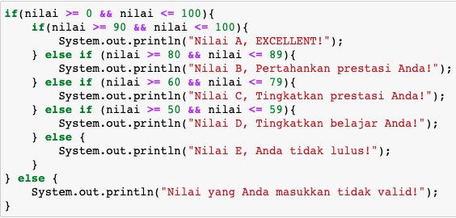
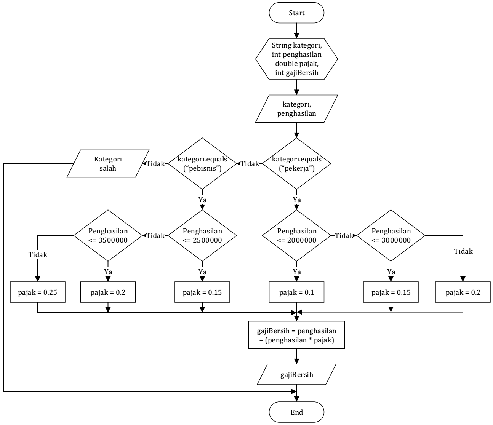
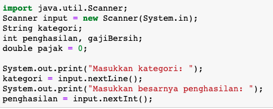
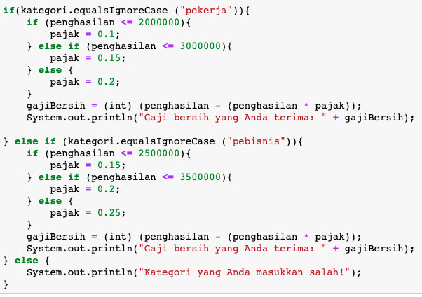

## JOBSHEET 6

## PEMILIHAN 2

### Tujuan

Mahasiswa memahami tentang operator logika; Mahasiswa mampu menyelesaikan permasalahan dengan menggunakan sintaks pemilihan bersarang; Mahasiswa mampu membuat sebuah program Java yang memanfaatkan sintaks pemilihan bersarang


### Alat dan Bahan
+ PC/laptop
+ Browser(chrome, firefox, safari)
+ Koneksi internet

### Praktikum

#### Percobaan 1

#### Waktu percobaan : 40 menit

1. Tambahkan library Scanner, deklarasi Scanner

2. Buatlah variabel nilai yang memiliki tipe data int untuk menampung data yang diinput melalui keyboard

    


```Java
// Ketik kode di sini
import java.util.Scanner;
Scanner input = new Scanner(System.in);
int nilai;
System.out.print("Masukkan nilai ujian (0-100): ");
nilai = input.nextInt();
```
```
Masukkan nilai ujian (0-100): 70
```

3. Buatlah struktur pengecekan kondisi bersarang. Pengecekan pertama digunakan untuk memastikan bahwa nilai yang dimasukkan berada pada rentang 0 – 100. Jika nilai berada pada rentang 0 – 100, maka akan dilakukan pengecekan status kelulusan mahasiswa, yaitu jika nilai di antara 90 – 100 maka nilainya A, jika nilai di antara 80 – 89 maka nilainya B, jika nilai di antara 60 – 79 maka nilainya C, jika nilai di antara 50 – 59 maka nilainya D, dan jika nilai di antara 0 – 49 maka nilainya E. Sedangkan jika nilai berada di luar rentang 0 – 100, maka ditampilkan informasi bahwa nilai yang dimasukkan tidak valid.

    


```Java
// Ketik kode di sini
if (nilai >= 0 && nilai <= 100){
   if (nilai >=90 && nilai <=100){
    System.out.println("Nilai A, EXCELLENT!");
}else if (nilai >= 80 && nilai <=89){
    System.out.println("Nilai B, Pertahankan prestasi Anda!");
}else if (nilai >=60 && nilai <=79){
    System.out.println("Nilai C, Tingkatkan prestasi Anda!");
}else if (nilai >=50 && nilai <=59){
    System.out.println("Nilai D, Tingkatkan Belajar Anda!");
}else{
    System.out.println("Nilai E, Anda tidak lulus!");
}
}else {
    System.out.println("Nilai yang anda masukkan tidak valid!");
}
```
```
Nilai C, Tingkatkan prestasi Anda!
```

> Penjelasan kode program percobaan 1
Pada program tersebut yang pertama kita harus lakukan adalah memanggil fungsi scanner yang bertujuan agar user dapat menginputkan sebuah nilai dari keyboard. Kemudian kita inisiasi scanner menggunakan variabel input. Setelah itu kita mendeklarasikan sebuah tipe data yaitu integer menggunakan variabel nilai yang nantinya akan dimasukkan jumlah nilai yang diperoleh. Kemudian ada pengecekan nilai menggunakan pemilihan bersarang, pertama kita memberikan range terlebih dahulu yang pasti bernilai benar,kemudian dan seterusnya diberi range yang kita mau sesuai output yang ingin dikeluarkan. Jika dalam if tersebut bernilai salah maka akan langsung menampilkan nilai yang berada pada kondisi else

##### Pertanyaan

1. Modifikasi kode program pada Percobaan 1 sehingga jika nilai yang dimasukkan kurang dari 0 akan ditampilkan output “Nilai yang Anda masukkan kurang dari 0” dan jika nilai yang dimasukkan lebih dari 100 akan ditampilkan output “Nilai yang Anda masukkan lebih dari 100”!

2. Jelaskan fungsi sintaks if (nilai >= 0 && nilai <= 100)!

3. Ubah operator && menjadi || pada sintaks if (nilai >= 0 && nilai <= 100). Jalankan program dengan memasukkan nilai = 105. Amati apa yang terjadi! Mengapa hasilnya demikian?


```Java
// Jawaban pertanyaan
    import java.util.Scanner;
    Scannner input = new Scanner(System.in);
    int nilai;
    System.out.print("Masukkan nilai ujian (0-100): ");
    nilai = input.nextInt();   
        
     
    if (nilai >=0 && nilai <=100){    
            if (nilai >=90 && nilai <=100){
                 System.out.println("Nilai A, EXCELLENT!");
            }else if (nilai >= 80 && nilai <=89){
                System.out.println("Nilai B, Pertahankan prestasi Anda!");
            }else if (nilai >=60 && nilai <=79){
                 System.out.println("Nilai C, Tingkatkan prestasi Anda!");
            }else if (nilai >=50 && nilai <=59){
                 System.out.println("Nilai D, Tingkatkan Belajar Anda!");
            }else{
                 System.out.println("Nilai E, Anda tidak lulus!");
            }
    }else if (nilai < 0){
        System.out.println("Nilai yang Anda masukkan kurang dari 0");
    }else
        System.out.println("Nilai yang Anda masukkan lebih dari 100");
    }
```
```
Masukkan nilai ujian (0-100): -70
Nilai yang Anda masukkan kurang dari 0
```
```
Masukkan nilai ujian (0-100): 101
Nilai yang Anda masukkan lebih dari 100
```
```
2. fungsi dari sintaks tersebut adalah digunakan untuk memberikan range atau jangkauan pada nilai yang akan dicek nantinya, jika menggunakan operator && maka keduanya harus bernilai true jika yang pertama bernilai true dan yang selanjutnya bernilai false maka pengecekan akan dihentikan
```
```Java
if (nilai >=0 || nilai <=100){    
            if (nilai >=90 && nilai <=100){
                 System.out.println("Nilai A, EXCELLENT!");
            }else if (nilai >= 80 && nilai <=89){
                System.out.println("Nilai B, Pertahankan prestasi Anda!");
            }else if (nilai >=60 && nilai <=79){
                 System.out.println("Nilai C, Tingkatkan prestasi Anda!");
            }else if (nilai >=50 && nilai <=59){
                 System.out.println("Nilai D, Tingkatkan Belajar Anda!");
            }else{
                 System.out.println("Nilai E, Anda tidak lulus!");
            }
    }else if (nilai < 0){
        System.out.println("Nilai yang Anda masukkan kurang dari 0");
    }else{
        System.out.println("Nilai yang Anda masukkan lebih dari 100");
    }   

```
```
Karena jika dirubah menjadi operator || yang semula operator && jika dijalankan akan mengeluarkan output

Masukkan nilai ujian (0-100): 105
Nilai E, Anda tidak lulus!

bilangan 105 jika di inputkan dia lolos penyeleksian pertama sehingga tidak terjadi eror karena dengan operator || akan diteruskan penyeleksian jika salah satunya bernilai true yaitu lebih dari 0 maka pada penyeleksian berikutnya tidak ada yang tepat sehingga output dari bilangan 105 masuk ke dalam else

```
#### Percobaan 2

#### Waktu percobaan : 40 menit

1. Perhatikan flowchart dibawah ini!



> Flowchart tersebut digunakan untuk menghitung gaji bersih seseorang setelah dipotong pajak sesuai dengan kategorinya (pekerja dan pebisnis) dan besarnya penghasilan. 

2. Tambahkan library Scanner dan deklarasi Scanner

3. Deklarasikan variabel kategori, penghasilan, gajiBersih, dan pajak

    


```Java
// Ketik kode di sini
import java.util.Scanner;
Scanner input = new Scanner(System.in);
String kategori;
int penghasilan, gajiBersih;
double pajak = 0;

System.out.print("Masukkan kategori: ");
kategori = input.nextLine();
System.out.print("Masukkan besarnya penghasilan: ");
penghasilan = input.nextInt();
```
```
Masukkan kategori: pebisnis
Masukkan besarnya penghasilan: 1000000
```
4. Buatlah struktur pengecekan kondisi bersarang. Pengecekan pertama digunakan untuk mengecek kategori (pekerja atau pebisnis). Selanjutnya dilakukan pengecekan kedua untuk menentukan besarnya pajak berdasarkan penghasilan yang telah dimasukkan.Kemudian tambahkan kode program untuk menghitung gaji bersih yang diterima setelah dipotong pajak!

    


```Java
// Ketik kode di sini
if (kategori.equalsIgnoreCase("pekerja")){
    if (penghasilan <=2000000){
        pajak = 0.1;

    }else if (penghasilan <=3000000){
        pajak = 0.15;
    }else {
        pajak = 0.2;
    }
    gajiBersih = (int) (penghasilan - (penghasilan*pajak));
    System.out.println("Gaji bersih yang Anda terima: "+ gajiBersih);
}else if (kategori.equalsIgnoreCase ("pebisnis")){
    if (penghasilan <=2500000){
        pajak = 0.15;
    }else if (penghasilan <= 3500000){
        pajak = 0.2;
    }else {
        pajak = 0.25;
    }
    gajiBersih = (int) (penghasilan - (penghasilan * pajak));
    System.out.println("Gaji bersih yang Anda terima: "+ gajiBersih);
}else {
    System.out.println("Kategori yang Anda masukkan salah!");
}

```
```
Gaji bersih yang Anda terima: 850000
```

5. Jalankan program di atas. Amati apa yang terjadi!

> Penjelasan kode program percobaan 2
Pertama kita harus menimport sebuah scanner agar user dapat menginputkan sebuah nilai dari keyboard, kemudian mendeklarasikan tipe data string dengan variabel kategori dan tipe data integer dengan variabel penghasilan,gajiBersih, serta tipe data double untuk variabel pajak. Langkah yang selanjutnya adalah menginputkan kategori dan penghasilan. Setelah itu akan dicek termasuk ke dalam kategori apa serta range penghasilan yang mana, kemudian jika berada pada range yang telah di deklarasikan akan mendapat pajak sekian persen. Agar nominal angka tidak ada komanya maka dari itu setiap di keluarkan akan di casting terlebih dahulu ke dalam tipe data integer.

##### Pertanyaan

1. Jalankan program dengan memasukkan kategori = pekerja dan penghasilan = 2048485. Amati apa yang terjadi! Mengapa angka di belakang koma tidak ditampilkan?

2. Jelaskan fungsi dari (int) pada sintaks:
```
gajiBersih = (int) (penghasilan - (penghasilan * pajak));
```

3.	Jalankan program dengan memasukkan kategori = pebisnis dan penghasilan = 2000000. Amati apa yang terjadi! Apa kegunaan dari equalsIgnoreCase?

4.	Ubah equalsIgnoreCase menjadi equals, kemudian jalankan program dengan memasukkan kategori = pebisnis dan penghasilan = 2000000. Amati apa yang terjadi! Mengapa hasilnya demikian? Apa kegunaan dari equals?


```Java
// Jawaban pertanyaan
        import java.util.Scanner;
        Scanner input = new Scanner (System.in);
        String kategori;
        int penghasilan, gajiBersih;
        double pajak = 0;

        System.out.print("Masukkan kategori: ");
        kategori = input.nextLine();
        System.out.print("Masukkan besarnya penghasilan: ");
        penghasilan = input.nextInt();

        if (kategori.equals("Pekerja")){
            if (penghasilan <=2000000){
                pajak = 0.1;
        
            }else if (penghasilan <=3000000){
                pajak = 0.15;
            }else {
                pajak = 0.2;
            }
            gajiBersih = (int) (penghasilan - (penghasilan*pajak));
            System.out.println("Gaji bersih yang Anda terima: "+ gajiBersih);
        }else if (kategori.equals("Pebisnis")){
            if (penghasilan <=2500000){
                pajak = 0.15;
            }else if (penghasilan <= 3500000){
                pajak = 0.2;
            }else {
                pajak = 0.25;
            }
            gajiBersih = (int) (penghasilan - (penghasilan * pajak));
            System.out.println("Gaji bersih yang Anda terima: "+ gajiBersih);
        }else {
            System.out.println("Kategori yang Anda masukkan salah!");
        }
```
```
1. karena pada saat menuliskan rumus gajiBersih di situ tipe datanya diubah menjadi integer sehingga yang awalnya bilangan desimal berubah menjadi bilangan bulat
2. fungsi dari (int) pada kode tersebut merubah tipe data yang awalnya double menjadi integer ini bisa disebut narrowing casting yaitu mengcasting dari yg besar ke kecil hal ini menyebabkan angka dibelakang (,) menghilang. Karena tipe data integer adalah bilangan bulat sedangkan double bilangan desimal atau pecahan
3. kegunaan dari equalsIgnoreCase adalah menghilangkan fungsi case yaitu besar kecilnya tidak diperhatikan oleh komputer maka tidak akan terjadi eror
4. Yang terjadi adalah program langsung memunculkan else yang terluar karena fungsi equals sangat sensitif pada string jadi jika ada huruf misal "Pebisnis" tidak ditambahkan IgnoreCase maka akan langsung memunculkan else yang terluar
```

### Tugas

#### Waktu pengerjaan Tugas: 140 menit

1. Buatlah program kalkulator sederhana menggunakan bahasa pemrograman Java. User akan menginputkan dua buah bilangan riil dan satu buah operator aritmatika (+, -, *, atau /), kemudian program akan mengoperasikan dua bilangan tersebut dengan operator yang sesuai. Petunjuk: gunakan pernyataan switch-case.
Contoh tampilan program:

```
Masukkan bilangan pertama: 2.5
Masukkan operator (+, -, *, /): *
Masukkan bilangan kedua: 4
2.5 * 4.0 = 10.0

```


```Java
//ketik kode program dan lampirkan hasilnya disini
        import java.util.Scanner;
        Scanner sc = new Scanner (System.in);
        double angka1, angka2, hasil;
        char operator;

        System.out.println("Masukkan bilangan pertama: ");
        angka1 = sc.nextDouble();
        System.out.println("Masukkan operator (+, -, *, /): ");
        operator = sc.next().charAt(0);
        System.out.println("Masukkan bilangan kedua: ");
        angka2 = sc.nextDouble();
        
        switch(operator){
    
            case '+':
            hasil = angka1 + angka2;
            System.out.println(angka1 + " + " + angka2 + " = " + hasil);
            break;
            case '-':
            hasil = angka1 - angka2;
            System.out.println(angka1 + " - " + angka2 + " = " + hasil);
            break;
            case '*':
            hasil = angka1 * angka2;
            System.out.println(angka1 + " * " + angka2 + " = " + hasil);
            break;
            case '/':
            hasil = angka1 / angka2;
            System.out.println(angka1 + " / " + angka2 + " = " + hasil);
            break;
            
            default:
            System.out.println("Operator yang Anda masukkan salah");
        }


```
```
Masukkan bilangan pertama: 
18
Masukkan operator (+, -, *, /): 
/
Masukkan bilangan kedua: 
3
18.0 / 3.0 = 6.0
```
```
1.mengimport scanner agar user dapat memasukkan nilai
2.mendklarasikan tipe data double dan char
3.memasukkan nilai sesuai yang diminta
4.mengecek dengan metode switch case dimana jika case 1 benar maka tidak akan dicek case berikutnya, jika case 1 salah maka akan dicek case berikutnya dan jika bernilai salah akan dicek berikutnya begitu seterusnya dan bilamana dalam case tidak ada maka yang keluar adalah nilai pada default
```

2. Dengan menggunakan tiga nilai yang mewakili panjang tiga sisi sebuah segitiga, tentukan apakah segitiga tersebut sama sisi (ketiga sisinya bernilai sama), sama kaki (kedua sisinya bernilai sama), atau sembarang (tidak ada sisi yang bernilai sama)! 


```Java
//ketik kode program dan lampirkan hasilnya disini
        import java.util.Scanner;
        Scanner sc = new Scanner (System.in);
        int sisi1,sisi2,sisi3;

        System.out.println("Masukkan sisi 1");
        sisi1 = sc.nextInt();
        System.out.println("Masukkan sisi 2");
        sisi2 = sc.nextInt();
        System.out.println("Masukkan sisi 3");
        sisi3 = sc.nextInt();

        if (sisi1==sisi2 || sisi1==sisi3 || sisi2==sisi3){
            System.out.println("segitiga sama sisi");
        }else if (sisi1==sisi2 && sisi2!=sisi3 && sisi1!=sisi3 || sisi2==sisi3 && sisi2!=sisi1 && sisi1!=sisi3 || sisi1==sisi3 && sisi2!=sisi1 && sisi2!=sisi3){
            System.out.println("Segitiga sama kaki");
        }else {
            System.out.println("segitiga sembarang");
        }
        

```
```
Masukkan sisi 1
12
Masukkan sisi 2
12
Masukkan sisi 3
12
segitiga sama sisi
```
```
1. Memanggil library scanner agar user dapat menginput nilai dari keyboard
2. Mendaklarasikan tipe data integer yang memiliki nilai bilangan bulat
3. Memasukkan sisi yang diminta
4. Kemudian di cek jika ketiga sisi sama panjang akan termasuk ke dalam segitiga sama sisi, kemudian jika salah satu sisi berbeda akan masuk ke dalam segitiga sama kaki dan jika ketiga sisinya tidak ada yang sama maka masuk ke dalam segitiga sembarang
```

3. Warung Padang Gembira meminta Anda membuat sebuah program untuk menerima pesanan dari internet. Program yang Anda buat meminta user untuk memasukkan nama makanan dan harga. Setelah itu, user ditawarkan untuk menggunakan pengiriman ekspres. Jika pengguna menolak, maka jenis pengiriman yang digunakan adalah pengiriman reguler. Biaya pengiriman reguler untuk harga makanan kurang dari Rp 100.000 adalah Rp 20.000, sedangkan untuk harga makanan sama dengan atau lebih dari Rp 100.000 biaya pengirimannya adalah Rp 30.000. Untuk jenis pengiriman ekspres, tambahkan biaya tambahan sebesar Rp 25.000 dari standar biaya pengiriman reguler. Tampilkan struk yang berisi nama makanan yang dibeli + harga, biaya pengiriman, dan total yang harus dibayar!
Contoh hasil output program:

```
Masukkan nama makanan: Tuna salad
Masukkan harga makanan: Rp 115000
Apakah Anda ingin pengiriman ekspres (0 = tidak, 1 = ya)? 0

STRUK PEMBELIAN
Tuna salad        Rp 115000
Biaya pengiriman  Rp 30000
TOTAL             Rp 145000

```

```
Masukkan nama makanan: Beef bulgogi
Masukkan harga makanan: Rp 78000
Apakah Anda ingin pengiriman ekspres (0 = tidak, 1 = ya)? 1

STRUK PEMBELIAN
Beef bulgogi      Rp 115000
Biaya pengiriman  Rp 45000
TOTAL             Rp 123000

```


```Java
//ketik kode program dan lampirkan hasilnya disini
        import java.util.Scanner;
        Scanner sc = new Scanner(System.in);
        int hargaMakan, biayaBiasa1, biayaEkspress1,biayaBiasa2,biayaEkspress2,total,tanyaJasa;
        String namaMakanan;
        biayaBiasa1 = 20000;
        biayaBiasa2 = 30000;
        biayaEkspress1= 45000;
        biayaEkspress2 = 55000;

        System.out.print("Masukkan nama makanan:");
        namaMakanan = sc.nextLine();
        System.out.print("Masukkan harga makanan: Rp ");
        hargaMakan = sc.nextInt();
        System.out.print("Apakah anda ingin pengiriman ekspress (0 = tidak, 1 = ya)?");
        tanyaJasa = sc.nextInt();
        System.out.println("STRUK PEMBELIAN");
        System.out.printf("%-24s",namaMakanan);
        System.out.printf("%s %s\n","Rp",hargaMakan);

        
        if(tanyaJasa == 0){
            if(hargaMakan<100000){
              System.out.println("Biaya Pengiriman\tRp "+ biayaBiasa1 );
              total = hargaMakan + biayaBiasa1; 
              System.out.println("TOTAL\t\t\tRp "+ total); 
            }else{
                System.out.println("Biaya pengiriman\tRp " + biayaBiasa2);
                total = hargaMakan + biayaBiasa2;
                System.out.println("TOTAL\t\t\tRp "+ total);
            }
        }else if(tanyaJasa==1){
            
            if(hargaMakan<100000){
                System.out.println("Biaya pengiriman\tRp "+ biayaEkspress1);
                total = hargaMakan + biayaEkspress1;
                System.out.println("TOTAL\t\t\tRp "+total);
            }else{
                System.out.println("Biaya pengiriman\tRp "+ biayaEkspress2);
                total = hargaMakan+biayaEkspress2;
                System.out.println("TOTAL\t\t\tRp "+total);
            }
        }else{
            System.out.println("Maaf pilihan jasa anda tidak tersedia!");
        }
```
```
1. Memanggil fungsi Scanner agar user dapat menginputkan nilai ke dalam keyboard
2. Kemudian mendeklarasikan tipe data integer dan string
3. Mendeklarasikan biaya dari masing-masing ekspedisi
4. Memasukkan nama makanan dan harga makanan serta memilih ekspedisi apakah reguler atau ekspress
5. Kemudian sistem akan melakukan pengecekan jika kita memilih 0 maka jika harga makanan bernilai kurang dari 100000 maka akan memilih biaya pengiriman 20000 jika lebih dari 100000 maka akan memilih biaya pengiriman 30000. Kemudian jika memilih 1 maka kita akan memilih ekspedisi menggunakan ekspress jika bernilai kurang dari 100000 maka biaya pengirimannya adalah 45000 dan jika lebih dari 100000 biaya pengirimannya adalah 55000. kemudian jika kita memasukkan nilai yg dipilih tidak 1 atau o maka akan keluar nilai pada else terluar
```

4. Perhatikan flowchart berikut ini!


> Buatlah program sesuai dengan flowchart diatas!


```Java
//ketik kode program dan lampirkan hasilnya disini
        import java.util.Scanner;
        Scanner sc = new Scanner(System.in);
        int umur, tanggungan, pendapatBulan,biayaHidup;
        String statusKerja, statusSekolah;

System.out.print("Masukkan Umur: ");
umur = sc.nextInt();

if (umur >=18){
    System.out.println("Apakah Anda sudah bekerja?");
    sc.nextLine();
    statusKerja = sc.nextLine();
    if(statusKerja.equalsIgnoreCase("Sudah")){ 
        System.out.println("Berapa pendapatan Anda per bulan?");
        pendapatBulan = sc.nextInt();
        System.out.println("Berapakah jumlah tanggungan Anda?");
        tanggungan = sc.nextInt();
        biayaHidup = pendapatBulan/tanggungan;
        if(biayaHidup<300000){
            System.out.print("Penduduk Miskin");
        }else{
            System.out.println("Bukan Penduduk Miskin");
        }

    }else{
        System.out.println("Penduduk Miskin");
    }
}else{
    System.out.println("Apakah Anda masih bersekolah?");
    sc.nextLine();
    statusSekolah = sc.nextLine();
    if(statusSekolah.equalsIgnoreCase("Masih")){
        System.out.println("Bukan penduduk miskin");
    }else{
        System.out.println("Penduduk miskin");
    }
}   

```
```
1. Memanggil fungsi library scanner
2. Mendeklarasikan tipe data integer dan string
3. Memasukkan umur kita
4. Kemudian dicek oleh komputer apabila usia kita lebih dari sama dengan 18 maka akan dicek kembali apakah kita sudah bekerja atau belum,jika bernilai benar kita akan diberi pertanyaan berapa penghasilan dan tanggungan kita jika kurang dari 300000 maka termasuk golongan miskin dan jika tidak maka termasuk golongan bukan orang miskin
5. JIka kita memasukkan usia kurang dari 18 tahun maka akan diberi pertanyaan apakah masih sekolah atau tidak, jika masih maka dimasukkan ke dalam bukan penduduk miskin, jika tidak maka akan termasuk ke dalam penduduk miskin 
```
