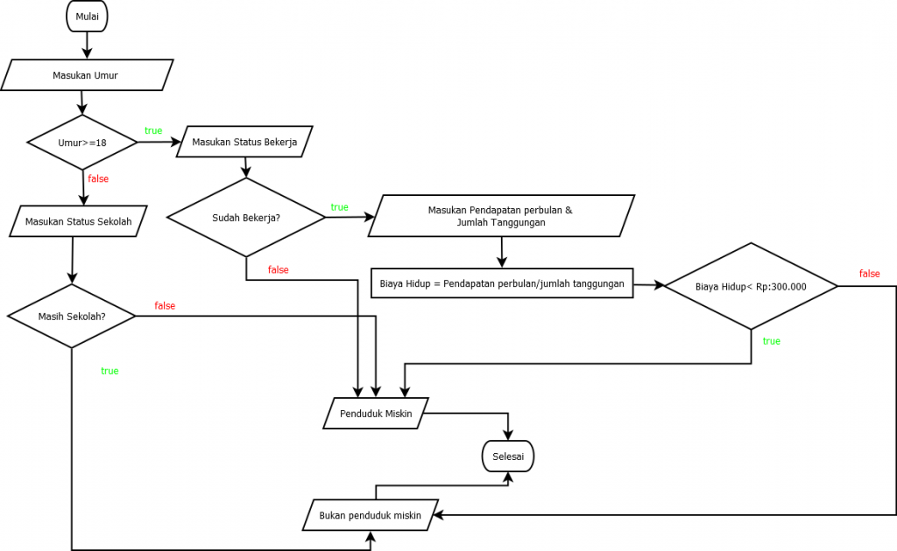

## JOBSHEET 6

## PEMILIHAN 2

### Tujuan

Mahasiswa memahami tentang operator logika; Mahasiswa mampu menyelesaikan permasalahan dengan menggunakan sintaks pemilihan bersarang; Mahasiswa mampu membuat sebuah program Java yang memanfaatkan sintaks pemilihan bersarang


### Alat dan Bahan
+ PC/laptop
+ Browser(chrome, firefox, safari)
+ Koneksi internet

### Praktikum

#### Percobaan 1

#### Waktu percobaan : 40 menit

1. Tambahkan library Scanner, deklarasi Scanner

2. Buatlah variabel nilai yang memiliki tipe data int untuk menampung data yang diinput melalui keyboard

    


```Java
// Ketik kode di sini
import java.util.Scanner;
Scanner input = new Scanner(System.in);
int nilai;
System.out.print("Masukkan nilai ujian (0 - 100): ");
nilai = input.nextInt();
```

    Masukkan nilai ujian (0 - 100)102


Perintah diatas digunakan untuk menginputkan nilai ujian dari 0 - 100 dengan menggunakan tipe data integer dan variabel nilai.

3. Buatlah struktur pengecekan kondisi bersarang. Pengecekan pertama digunakan untuk memastikan bahwa nilai yang dimasukkan berada pada rentang 0 – 100. Jika nilai berada pada rentang 0 – 100, maka akan dilakukan pengecekan status kelulusan mahasiswa, yaitu jika nilai di antara 90 – 100 maka nilainya A, jika nilai di antara 80 – 89 maka nilainya B, jika nilai di antara 60 – 79 maka nilainya C, jika nilai di antara 50 – 59 maka nilainya D, dan jika nilai di antara 0 – 49 maka nilainya E. Sedangkan jika nilai berada di luar rentang 0 – 100, maka ditampilkan informasi bahwa nilai yang dimasukkan tidak valid.

    


```Java
// Ketik kode di sini
if(nilai >= 0 && nilai <= 100){
    if(nilai >= 90 && nilai <= 100){
        System.out.println("Nilai A, EXCELLENT!");
    }else if(nilai >= 80 && nilai <= 89){
        System.out.println("Nilai B, Pertahankan prestasi Anda!");
    }else if(nilai >= 60 && nilai <= 79){
        System.out.println("Nilai C, Tingkatkan prestasi Anda!");
    }else if(nilai >= 50 && nilai <= 59){
        System.out.println("Nilai D, Tingkatkan belajar Anda!");
    }else if(nilai < 0){
        System.out.println("Nilai Yang Anda Masukkan Kurang Dari 0");
    }else if(nilai > 100){
        System.out.println("Nilai Yang Anda Masukkan Lebih Dari 100");
    }else{
        System.out.println("Nilai E, Anda Tidak Lulus");
    }
}else{
    System.out.println("Nilai yang Anda masukkan tidak valid");
}
```

    Nilai yang Anda masukkan tidak valid


perintah di atas digunakan untuk mengeksekusi nilai yang sudah diinputkan user untuk menglategorikan nilai yang telah diinputkan masuk dalam kategori A atau B sampai E

> Penjelasan kode program percobaan 1

##### Pertanyaan

1. Modifikasi kode program pada Percobaan 1 sehingga jika nilai yang dimasukkan kurang dari 0 akan ditampilkan output “Nilai yang Anda masukkan kurang dari 0” dan jika nilai yang dimasukkan lebih dari 100 akan ditampilkan output “Nilai yang Anda masukkan lebih dari 100”!

2. Jelaskan fungsi sintaks if (nilai >= 0 && nilai <= 100)!

3. Ubah operator && menjadi || pada sintaks if (nilai >= 0 && nilai <= 100). Jalankan program dengan memasukkan nilai = 105. Amati apa yang terjadi! Mengapa hasilnya demikian?

Nomer 2. Sintaks tersebut digunakan untuk menyeleksi nilai yang diinputkan user jika nilai kurang dari 0 maka outputnya adalah nilai yang anda masukkan tidak valid dan juga jika yang diinputkan lebih dari 100 maka outputnya akan sama.


```Java
// Jawaban pertanyaan
import java.util.Scanner;
Scanner input = new Scanner(System.in);
int nilai;
System.out.print("Masukkan nilai ujian (0 - 100): ");
nilai = input.nextInt();

if(nilai >= 0 || nilai <= 100){
    if(nilai >= 90 && nilai <= 100){
        System.out.println("Nilai A, EXCELLENT!");
    }else if(nilai >= 80 && nilai <= 89){
        System.out.println("Nilai B, Pertahankan prestasi Anda!");
    }else if(nilai >= 60 && nilai <= 79){
        System.out.println("Nilai C, Tingkatkan prestasi Anda!");
    }else if(nilai >= 50 && nilai <= 59){
        System.out.println("Nilai D, Tingkatkan belajar Anda!");
    }else if(nilai < 0){
        System.out.println("Nilai Yang Anda Masukkan Kurang Dari 0");
    }else if(nilai > 100){
        System.out.println("Nilai Yang Anda Masukkan Lebih Dari 100");
    }else{
        System.out.println("Nilai E, Anda Tidak Lulus");
    }
}else{
    System.out.println("Nilai yang Anda masukkan tidak valid");
}
```

    Masukkan nilai ujian (0 - 100): 105
    Nilai Yang Anda Masukkan Lebih Dari 100


nomer 3. Operator && digunakan untuk perbandingan kondisi AND. akan menghasilkan true jika kedua kondisi true. operator || digunakan untuk perbandingan kondisi OR. akan menghasilkan true jika salah satu kondisi true jadi jika salah satu sudah benar maka kondisi selanjutnya tidak dijalankan.

#### Percobaan 2

#### Waktu percobaan : 40 menit

1. Perhatikan flowchart dibawah ini!


> Flowchart tersebut digunakan untuk menghitung gaji bersih seseorang setelah dipotong pajak sesuai dengan kategorinya (pekerja dan pebisnis) dan besarnya penghasilan. 

2. Tambahkan library Scanner dan deklarasi Scanner

3. Deklarasikan variabel kategori, penghasilan, gajiBersih, dan pajak

    


```Java
// Ketik kode di sini
import java.util.Scanner;
Scanner input = new Scanner(System.in);
String kategori;
int penghasilan, gajiBersih;
double pajak = 0;

System.out.print("Masukkan Kategori: ");
kategori = input.nextLine();
System.out.print("Masukkan besarnnya penghasilan: ");
penghasilan = input.nextInt();
```

    Masukkan Kategori: pekerja
    Masukkan besarnnya penghasilan: 2048485


Program diatas digunakan untuk menginputkan data kategori dan penghasilan dengan menggunakan tipe data String int dan double.

4. Buatlah struktur pengecekan kondisi bersarang. Pengecekan pertama digunakan untuk mengecek kategori (pekerja atau pebisnis). Selanjutnya dilakukan pengecekan kedua untuk menentukan besarnya pajak berdasarkan penghasilan yang telah dimasukkan.Kemudian tambahkan kode program untuk menghitung gaji bersih yang diterima setelah dipotong pajak!

    


```Java
// Ketik kode di sini
if(kategori.equalsIgnoreCase ("pekerja")){
    if(penghasilan <= 2000000){
        pajak = 0.1;
    }else if(penghasilan <= 3000000){
        pajak = 0.15;
    }else{
        pajak = 0.2;
    }
    gajiBersih = (int) (penghasilan - (penghasilan * pajak));
    System.out.println("Gaji bersih yang Anda terima: " + gajiBersih);
}else if (kategori.equalsIgnoreCase ("pebisnis")){
    if(penghasilan <= 2500000){
        pajak = 0.15;
    }else if(penghasilan <= 3500000){
        pajak = 0.2;
    }else{
        pajak = 0.25;
    }
    gajiBersih = (int) (penghasilan - (penghasilan * pajak));
    System.out.println("Gaji bersih yang Anda terima: " + gajiBersih);
}else{
    System.out.println("Kategori yang Anda masukkan salah!");
}

```

    Gaji bersih yang Anda terima: 1741212


5. Jalankan program di atas. Amati apa yang terjadi!

> Penjelasan kode program percobaan 2
program ini untuk menghitung penghasilan pekerja daan pebisnis dengan mengalikan jumlah penghasilan dengan pajak namun pekerja dan pebisnis memiliki pajak yang berbeda dengan menggunakan if elsedigu yang bersarang.

##### Pertanyaan

1. Jalankan program dengan memasukkan kategori = pekerja dan penghasilan = 2048485. Amati apa yang terjadi! Mengapa angka di belakang koma tidak ditampilkan?

2. Jelaskan fungsi dari (int) pada sintaks:
```
gajiBersih = (int) (penghasilan - (penghasilan * pajak));
```

3.	Jalankan program dengan memasukkan kategori = pebisnis dan penghasilan = 2000000. Amati apa yang terjadi! Apa kegunaan dari equalsIgnoreCase?

4.	Ubah equalsIgnoreCase menjadi equals, kemudian jalankan program dengan memasukkan kategori = pebisnis dan penghasilan = 2000000. Amati apa yang terjadi! Mengapa hasilnya demikian? Apa kegunaan dari equals?

nomer 1. Karena pada variabel gajibersih menggunakan tipe data integer yang hanya digunakan untuk bilangan bulat 

nomer 2. Agar output dari gajibersih menjadi bilangan bulat jadi hasilnya tidak bisa ada koma

nomer 3. fungsi equalsIgnoreCase tidak akan melihat perbandingan huruf menggunakan huruf besar ataupun kecil yang penting ketika menginputkan data harus sama dengan nilai yang digunakan pada sintaks semisal "pebisnis" dengan "PEBISNIS" program tetap bisa berjalan.

nomer 4. jika menggunakan equals ketika kita menginputkan data harus sama seperti contoh "pebisnis" maka yang kita inputkan harus "pebisnis".


```Java
// Jawaban pertanyaan
import java.util.Scanner;
Scanner input = new Scanner(System.in);
String kategori;
int penghasilan, gajiBersih;
double pajak = 0;

System.out.print("Masukkan Kategori: ");
kategori = input.nextLine();
System.out.print("Masukkan besarnnya penghasilan: ");
penghasilan = input.nextInt();

if(kategori.equals ("pekerja")){
    if(penghasilan <= 2000000){
        pajak = 0.1;
    }else if(penghasilan <= 3000000){
        pajak = 0.15;
    }else{
        pajak = 0.2;
    }
    gajiBersih = (int) (penghasilan - (penghasilan * pajak));
    System.out.println("Gaji bersih yang Anda terima: " + gajiBersih);
}else if (kategori.equals ("pebisnis")){
    if(penghasilan <= 2500000){
        pajak = 0.15;
    }else if(penghasilan <= 3500000){
        pajak = 0.2;
    }else{
        pajak = 0.25;
    }
    gajiBersih = (int) (penghasilan - (penghasilan * pajak));
    System.out.println("Gaji bersih yang Anda terima: " + gajiBersih);
}else{
    System.out.println("Kategori yang Anda masukkan salah!");
}
```

    Masukkan Kategori: pebisnis
    Masukkan besarnnya penghasilan: 2000000


    |       gajiBersih = (double) (penghasilan - (penghasilan * pajak));

    incompatible types: possible lossy conversion from double to int

    


### Tugas

#### Waktu pengerjaan Tugas: 140 menit

1. Buatlah program kalkulator sederhana menggunakan bahasa pemrograman Java. User akan menginputkan dua buah bilangan riil dan satu buah operator aritmatika (+, -, *, atau /), kemudian program akan mengoperasikan dua bilangan tersebut dengan operator yang sesuai. Petunjuk: gunakan pernyataan switch-case.
Contoh tampilan program:

```
Masukkan bilangan pertama: 2.5
Masukkan operator (+, -, *, /): *
Masukkan bilangan kedua: 4
2.5 * 4.0 = 10.0

```


```Java
//ketik kode program dan lampirkan hasilnya disini
Scanner sc = new Scanner(System.in);
double bilangan1, bilangan2, hasil;
int operator;
System.out.print("Masukkan Bilangan Pertama: ");
bilangan1 = sc.nextDouble();
System.out.print("Masukkan operator (+ - * /): ");
operator = sc.next().charAt(0);
System.out.print("Masukkan Bilangan Kedua: ");
bilangan2 = sc.nextDouble();

switch(operator){
    case '+':
    hasil = bilangan1 + bilangan2;
    System.out.println(bilangan1 + " + " + bilangan2 + " = " + hasil);
    break;
    case '-':
    hasil = bilangan1 - bilangan2;
    System.out.println(bilangan1 + " - " + bilangan2 + " = " + hasil);
    break;
    case '*':
    hasil = bilangan1 * bilangan2; 
    System.out.println(bilangan1 + " * " + bilangan2 + " = " + hasil);
    break;
    case '/':
    hasil = bilangan1 / bilangan2;
    System.out.println(bilangan1 + " / " + bilangan2 + " = " + hasil);
    break;
}
```

    Masukkan Bilangan Pertama: 2.5
    Masukkan operator (+ - * /): *
    Masukkan Bilangan Kedua: 4
    2.5 * 4.0 = 10.0


2. Dengan menggunakan tiga nilai yang mewakili panjang tiga sisi sebuah segitiga, tentukan apakah segitiga tersebut sama sisi (ketiga sisinya bernilai sama), sama kaki (kedua sisinya bernilai sama), atau sembarang (tidak ada sisi yang bernilai sama)! 


```Java
//ketik kode program dan lampirkan hasilnya disini
import java.util.Scanner;
Scanner input = new Scanner(System.in);
double sisi1, sisi2, sisi3;
System.out.print("Masukkan Sisi 1: ");
sisi1 = input.nextDouble();
System.out.print("Masukkan Sisi 2: ");
sisi2 = input.nextDouble();
System.out.print("Masukkan Sisi 3: ");
sisi3 = input.nextDouble();

if(sisi1 == sisi2 && sisi1 == sisi3){
    System.out.println("Segitiga Sama Sisi");
}else if(sisi1 == sisi2){
    System.out.println("Segitiga Sama Kaki");
}else if(sisi1 == sisi3){
    System.out.println("Segitiga Sama Kaki");
}else if(sisi2 == sisi3){
    System.out.println("Segitiga Sama Kaki");
}else{
    System.out.println("Segitiga Sembarang");
}
```

    Masukkan Sisi 1: 1
    Masukkan Sisi 2: 
    2
    Masukkan Sisi 3: 3
    Segitiga Sembarang


## 3. Warung Padang Gembira meminta Anda membuat sebuah program untuk menerima pesanan dari internet. Program yang Anda buat meminta user untuk memasukkan nama makanan dan harga. Setelah itu, user ditawarkan untuk menggunakan pengiriman ekspres. Jika pengguna menolak, maka jenis pengiriman yang digunakan adalah pengiriman reguler. Biaya pengiriman reguler untuk harga makanan kurang dari Rp 100.000 adalah Rp 20.000, sedangkan untuk harga makanan sama dengan atau lebih dari Rp 100.000 biaya pengirimannya adalah Rp 30.000. Untuk jenis pengiriman ekspres, tambahkan biaya tambahan sebesar Rp 25.000 dari standar biaya pengiriman reguler. Tampilkan struk yang berisi nama makanan yang dibeli + harga, biaya pengiriman, dan total yang harus dibayar!
Contoh hasil output program:

```
Masukkan nama makanan: Tuna salad
Masukkan harga makanan: Rp 115000
Apakah Anda ingin pengiriman ekspres (0 = tidak, 1 = ya)? 0

STRUK PEMBELIAN
Tuna salad        Rp 115000
Biaya pengiriman  Rp 30000
TOTAL             Rp 145000

```

```
Masukkan nama makanan: Beef bulgogi
Masukkan harga makanan: Rp 78000
Apakah Anda ingin pengiriman ekspres (0 = tidak, 1 = ya)? 1

STRUK PEMBELIAN
Beef bulgogi      Rp 115000
Biaya pengiriman  Rp 45000
TOTAL             Rp 123000

```


```Java
//ketik kode program dan lampirkan hasilnya disini
import java.util.Scanner;
Scanner input = new Scanner(System.in);
String makanan, pengiriman;
int harga, total, biayapengiriman;
System.out.print("Masukkan Nama Makanan: ");
makanan = input.nextLine();
System.out.print("Masukkan Harga Makanan: ");
harga = input.nextInt();
input.nextLine();
System.out.print("Apakah Anda Ingin Pengiriman Ekspres: ");
pengiriman = input.nextLine();

System.out.println("STRUK PEMBELIAN");
System.out.println(makanan + "\t" + "\t" +  "RP" + harga);

if(pengiriman.equalsIgnoreCase ("ya")){
    if(harga < 100000){
        biayapengiriman = 45000;
    }else{
        biayapengiriman = 55000;
    }
    total = (int) (harga + biayapengiriman);
    System.out.println("Biaya Pengiriman"  + "\t" + "RP" + biayapengiriman);
    System.out.println("Total" + "\t" +  "\t" + "\t" + "RP" + total);
    
}else if(pengiriman.equalsIgnoreCase ("tidak")){
    if(harga < 100000){
        biayapengiriman = 20000;
    }else{
        biayapengiriman = 30000;
    }
    total = (int) (harga + biayapengiriman);
    System.out.println("Biaya Pengiriman"  + "\t" + "RP" + biayapengiriman);
    System.out.println("Total" + "\t" +  "\t" + "\t" + "RP" + total);
}
```

    Masukkan Nama Makanan: Beef Bulgogi
    Masukkan Harga Makanan: 78000
    Apakah Anda Ingin Pengiriman Ekspres: ya
    STRUK PEMBELIAN
    Beef Bulgogi		RP78000
    Biaya Pengiriman	RP45000
    Total			RP123000


4. Perhatikan flowchart berikut ini!



> Buatlah program sesuai dengan flowchart diatas!


```Java
//ketik kode program dan lampirkan hasilnya disini
import java.util.Scanner;
Scanner input = new Scanner(System.in);
String sekolah, bekerja, penduduk;
int biayahidup, umur, pendapatan, tanggungan;
System.out.print("Masukkan Umur: " + "\t");
umur = input.nextInt();

if(umur >= 18){
    input.nextLine();
    System.out.print("Masukkan Status Bekerja: " + "\t");
    bekerja = input.nextLine();
    
    if(bekerja.equalsIgnoreCase ("Bekerja")){
        System.out.print("Masukkan Pendapatan Perbulan: ");
        pendapatan = input.nextInt();
        System.out.print("Masukkan Jumlah Tanggungan: " + "\t");
        tanggungan = input.nextInt();
        biayahidup = pendapatan/tanggungan;
        
        if(biayahidup < 300.000){
            System.out.println("Penduduk Miskin");
        }else{
            System.out.println("Bukan Penduduk Miskin");
        }
        
    }else if(bekerja.equalsIgnoreCase ("Tidak Bekerja")){
        System.out.print("Penduduk Miskin");
    }
    
}else{
    input.nextLine();
    System.out.print("Masukkan Status Sekolah: ");
    sekolah = input.nextLine();
    
    if(sekolah.equalsIgnoreCase ("Sekolah")){
        System.out.println("Bukan Penduduk Miskin");
        
    }else if(sekolah.equalsIgnoreCase ("Tidak Sekolah")){
        System.out.println("Penduduk Miskin");
    }
    
}
```

    Masukkan Umur: 	15
    Masukkan Status Sekolah: Tidak Sekolah
    Penduduk Miskin


```Java

```
