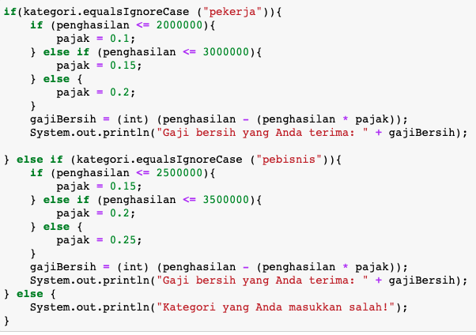

## JOBSHEET 6

## PEMILIHAN 2

### Tujuan

Mahasiswa memahami tentang operator logika; Mahasiswa mampu menyelesaikan permasalahan dengan menggunakan sintaks pemilihan bersarang; Mahasiswa mampu membuat sebuah program Java yang memanfaatkan sintaks pemilihan bersarang


### Alat dan Bahan
+ PC/laptop
+ Browser(chrome, firefox, safari)
+ Koneksi internet

### Praktikum

#### Percobaan 1

#### Waktu percobaan : 40 menit

1. Tambahkan library Scanner, deklarasi Scanner

2. Buatlah variabel nilai yang memiliki tipe data int untuk menampung data yang diinput melalui keyboard

    


```Java
// Ketik kode di sini
import java.util.Scanner;
Scanner input = new Scanner(System.in);
int nilai;
System.out.print("Masukkan nilai ujian (0-100): ");
nilai = input.nextInt();
```

    Masukkan nilai ujian (0-100): 20


3. Buatlah struktur pengecekan kondisi bersarang. Pengecekan pertama digunakan untuk memastikan bahwa nilai yang dimasukkan berada pada rentang 0 – 100. Jika nilai berada pada rentang 0 – 100, maka akan dilakukan pengecekan status kelulusan mahasiswa, yaitu jika nilai di antara 90 – 100 maka nilainya A, jika nilai di antara 80 – 89 maka nilainya B, jika nilai di antara 60 – 79 maka nilainya C, jika nilai di antara 50 – 59 maka nilainya D, dan jika nilai di antara 0 – 49 maka nilainya E. Sedangkan jika nilai berada di luar rentang 0 – 100, maka ditampilkan informasi bahwa nilai yang dimasukkan tidak valid.

    


```Java
if(nilai >= 0 && nilai <= 100){
    if(nilai >= 90 && nilai <= 100){
        System.out.println("Nilai A, EXCELLENT!");
    } else if (nilai >= 80 && nilai <= 89){
        System.out.println("Nilai B, Pertahankan Prestasi Anda!");
    } else if (nilai >= 60 && nilai <= 79){
        System.out.println("Nilai C, Tingkatkan Prestasi Anda!");
    } else if (nilai >= 50 && nilai <= 59){
        System.out.println("Nilai D, Tingkatkan Belajar Anda!");
    } else {
        System.out.println("Nilai E, Anda Tidak Lulus!");
    }
}  else if (nilai > 100){
        System.out.println("Nilai Lebih Dari 100!");
} else if (nilai < 0){
        System.out.println("Nilai Kurang Dari 0!");
} else {
        System.out.println("Nilai Tidak Valid!");
}
```

    Nilai E, Anda Tidak Lulus!


> Penjelasan kode program percobaan 1: 
Pada Kode Program tersebut berfungsi untuk menyatakan nilai kelulusan sesuai nilai yang diatas. Pertama kita diminta untuk memasukkan 1 nilai untuk diseleksi, jika nilai diatas 100 atau dibawah 0, maka akan mengeluarkan output "Nilai Tidak Valid!", namun jika tidak, akan diproses ke proses selanjutnya. Kemudian sistem akan menyeleksi sesuai dengan nilai yang diinputkan, lalu selanjutkan sistem akan mengeluarkan output sesuai dengan seleksi dan nilai yang diinput.

##### Pertanyaan

1. Modifikasi kode program pada Percobaan 1 sehingga jika nilai yang dimasukkan kurang dari 0 akan ditampilkan output “Nilai yang Anda masukkan kurang dari 0” dan jika nilai yang dimasukkan lebih dari 100 akan ditampilkan output “Nilai yang Anda masukkan lebih dari 100”!

2. Jelaskan fungsi sintaks if (nilai >= 0 && nilai <= 100)!

3. Ubah operator && menjadi || pada sintaks if (nilai >= 0 && nilai <= 100). Jalankan program dengan memasukkan nilai = 105. Amati apa yang terjadi! Mengapa hasilnya demikian?


```Java
// Jawaban pertanyaan
1. Sudah
2. Fungsinya yaitu untuk menyeleksi kedua pernyataan tersebut, jika salah satu pernyataan tersebut salah, maka hasilnya adalah false
3. Hasilnya yaitu jika kita memasukkan bilangan yang lebih dari 100 atau kurang dari 0, maka hasilnya adalah "Nilai E, Anda Tidak Lulus!", karena pada bagian tersebut menggunakan else yang berarti tidak ada pernyataan yang spesifik. Jadi semua angka selain yang ada di pernyataan "else if", maka akan meghasilkan output "Nilai E, Anda Tidak Lulus!".
```

#### Percobaan 2

#### Waktu percobaan : 40 menit

1. Perhatikan flowchart dibawah ini!


> Flowchart tersebut digunakan untuk menghitung gaji bersih seseorang setelah dipotong pajak sesuai dengan kategorinya (pekerja dan pebisnis) dan besarnya penghasilan. 

2. Tambahkan library Scanner dan deklarasi Scanner

3. Deklarasikan variabel kategori, penghasilan, gajiBersih, dan pajak

    


```Java
// Ketik kode di sini
import java.util.Scanner;
Scanner input = new Scanner(System.in);
String kategori;
int penghasilan, gajiBersih;
double pajak = 0;

System.out.print("Masukkan kategori: ");
kategori = input.nextLine();
System.out.print("Masukkan besarnya penghasilan: ");
penghasilan = input.nextInt();
```

    Masukkan kategori: PEBISNIS
    Masukkan besarnya penghasilan: 2000000


4. Buatlah struktur pengecekan kondisi bersarang. Pengecekan pertama digunakan untuk mengecek kategori (pekerja atau pebisnis). Selanjutnya dilakukan pengecekan kedua untuk menentukan besarnya pajak berdasarkan penghasilan yang telah dimasukkan.Kemudian tambahkan kode program untuk menghitung gaji bersih yang diterima setelah dipotong pajak!

    


```Java
// Ketik kode di sini
if(kategori.equalsIgnoreCase ("pekerja")){
    if(penghasilan <= 2000000){
        pajak = 0.1;
    } else if (penghasilan <= 3000000){
        pajak = 0.15;
    } else {
        pajak = 0.2;
    }
    gajiBersih = (int) (penghasilan - (penghasilan * pajak));
    System.out.println("Gaji bersih yang Anda terima: " + gajiBersih);
} else if (kategori.equalsIgnoreCase ("pebisnis")){
    if (penghasilan <= 2500000){
        pajak = 0.15;
    } else if (penghasilan <= 3500000){
        pajak = 0.2;
    } else {
        pajak = 0.25;
    }
    gajiBersih = (int) (penghasilan - (penghasilan * pajak));
    System.out.println("Gaji bersih yang Anda terima: " + gajiBersih);
} else {
    System.out.println("Kategori yang Anda masukkan salah!");
}
```

    Gaji bersih yang Anda terima: 1700000


5. Jalankan program di atas. Amati apa yang terjadi!

> Penjelasan kode program percobaan 2: 
Kode program tersebut pertama tama akan menginputkan berupa tulisan "pekerja" atau "pebisnis", setelah itu antara 2 string tersebut diseleksi, jika pada input lolos dalam seleksi string pertama, maka akan lanjut pemrosesan kedua. Pada pemrosesan kedua akan diproses mengenai gaji bersih, gaji bersih pekerja tersebut akan dihitung pajaknya sesuai jumlah gaji kotor yang diterima. begitu juga dengan gaji pebisnis, gaji bersih yang diterima akan dipotong oleh pajak yang sudah ditentukan sesuai jumlah gaji kotor yang diterima.

##### Pertanyaan

1. Jalankan program dengan memasukkan kategori = pekerja dan penghasilan = 2048485. Amati apa yang terjadi! Mengapa angka di belakang koma tidak ditampilkan?

2. Jelaskan fungsi dari (int) pada sintaks:
```
gajiBersih = (int) (penghasilan - (penghasilan * pajak));
```

3.	Jalankan program dengan memasukkan kategori = pebisnis dan penghasilan = 2000000. Amati apa yang terjadi! Apa kegunaan dari equalsIgnoreCase?

4.	Ubah equalsIgnoreCase menjadi equals, kemudian jalankan program dengan memasukkan kategori = pebisnis dan penghasilan = 2000000. Amati apa yang terjadi! Mengapa hasilnya demikian? Apa kegunaan dari equals?


```Java
// Jawaban pertanyaan
1. Karena menggunakan variabel integer dimana integer hanya menampung bilangan bulat
2. fungsinya yaitu agar angka yang dihasilkan menjadi bentuk integer (bilangan bulat serta memiliki range angka tertentu)
3. yang terjadi yaitu menghitung gaji bersih pebisnis, fungsi dari equalsIgnoreCase adalah menyeleksi string yang akan disajikan sehingga menghasilkan hasil yang akurat
4. fungsi dari equals hampir sama dengan equalsIgnoreCase, bedanya yaitu equals akan menmperhatikan format penulisan hurufnya dimana huruf kapital dan huruf kecil dibedakan
```

### Tugas

#### Waktu pengerjaan Tugas: 140 menit

1. Buatlah program kalkulator sederhana menggunakan bahasa pemrograman Java. User akan menginputkan dua buah bilangan riil dan satu buah operator aritmatika (+, -, *, atau /), kemudian program akan mengoperasikan dua bilangan tersebut dengan operator yang sesuai. Petunjuk: gunakan pernyataan switch-case.
Contoh tampilan program:

```
Masukkan bilangan pertama: 2.5
Masukkan operator (+, -, *, /): *
Masukkan bilangan kedua: 4
2.5 * 4.0 = 10.0

```


```Java
//ketik kode program dan lampirkan hasilnya disini
Scanner sc = new Scanner(System.in);
long angka1, angka2, hasil;
char operator;
System.out.print("Masukkan angka pertama: ");
angka1 = sc.nextLong();
System.out.print("Masukkan angka kedua: ");
angka2 = sc.nextLong();
System.out.print("Masukkan Operator: ");
operator = sc.next().charAt(0);
switch(operator){
        case '+':
        hasil = angka1 + angka2;
        System.out.println(angka1 + " + " + angka2 + " = " + hasil);
        break;
         case '-':
        hasil = angka1 - angka2;
        System.out.println(angka1 + " - " + angka2 + " = " + hasil);
        break;
         case '*':
        hasil = angka1 * angka2;
        System.out.println(angka1 + " * " + angka2 + " = " + hasil);
        break;
         case '/':
        hasil = angka1 / angka2;
        System.out.println(angka1 + " / " + angka2 + " = " + hasil);
        break;
        default:
        System.out.println("Operator yang Anda masukkan salah");
        
}
```

    Masukkan angka pertama: 20
    Masukkan angka kedua: 12
    Masukkan Operator: +
    20 + 12 = 32


Penjelasan:
Program tersebut mula mula untuk menginputkan 2 bilangan, setelah itu menginputkan operator untuk menghitung 2 bilangan tersebut, jika operator tidak ada di daftar maka akan ada output "Operator yang Anda masukkan salah", namun jika benar akan lanjut ke proses selanjutnya. Proses selanjutnya yaitu menghitung 2 bilangan tersebut menggunakan operator yang telah dipilih (* berarti mengkali, + berarti menambah, - berarti mengurangi, dan / berarti membagi).


2. Dengan menggunakan tiga nilai yang mewakili panjang tiga sisi sebuah segitiga, tentukan apakah segitiga tersebut sama sisi (ketiga sisinya bernilai sama), sama kaki (kedua sisinya bernilai sama), atau sembarang (tidak ada sisi yang bernilai sama)! 


```Java
//ketik kode program dan lampirkan hasilnya disini
import java.util.Scanner;
Scanner input = new Scanner(System.in);
int sisi1, sisi2, sisi3;

System.out.print("Masukkan Sisi Pertama: ");
sisi1 = input.nextInt();
System.out.print("Masukkan Sisi Kedua:   ");
sisi2 = input.nextInt();
System.out.print("Masukkan Sisi Ketiga:  ");
sisi3 = input.nextInt();

if (sisi1 > 0 && sisi2 > 0 && sisi3 > 0){
    if (sisi1 == sisi2 && sisi1 == sisi3){
        System.out.println("Segitiga Sama Sisi");
    } else if (sisi1 == sisi2 && sisi1 != sisi3){
        System.out.println("Segitiga Sama Kaki");
    } else if (sisi1 == sisi3 && sisi1 != sisi2){
        System.out.println("Segitiga Sama Kaki");
    } else if (sisi2 == sisi3 && sisi1 != sisi2){
        System.out.println("Segitiga Sama Kaki");
    } else {
        System.out.println("Segitiga Sembarang");
    }
}  else {
        System.out.print("Bukan Bangun Datar!");
}
```

    Masukkan Sisi Pertama: 20
    Masukkan Sisi Kedua:   30
    Masukkan Sisi Ketiga:  40
    Segitiga Sembarang


Penjelasan:
Kode program tersebut digunakan untuk menyatakan bentuk segitiga. Pertama, kita harus memasukkan ketiga sisi dari segitiga tersebut, lalu akan diseleksi, jika sisi terdeteksi kurang dari 0, maka akan muncul output "Bukan Bangun Datar!", namun jika lolos seleksi, maka akan lanjut ke proses berikutnya. pada proses berikutnya yaitu menyeleksi sesama sisi dan menyatakan bentuk segitiganya (jika 2 sisi sama dan 1 sisi tidak sama, maka segitiga sama kaki, jika semua sisi sama, maka segitiga sama sisi, jika tidak ada yang sama, maka segitiga sembarang).

# 3. Warung Padang Gembira meminta Anda membuat sebuah program untuk menerima pesanan dari internet. Program yang Anda buat meminta user untuk memasukkan nama makanan dan harga. Setelah itu, user ditawarkan untuk menggunakan pengiriman ekspres. Jika pengguna menolak, maka jenis pengiriman yang digunakan adalah pengiriman reguler. Biaya pengiriman reguler untuk harga makanan kurang dari Rp 100.000 adalah Rp 20.000, sedangkan untuk harga makanan sama dengan atau lebih dari Rp 100.000 biaya pengirimannya adalah Rp 30.000. Untuk jenis pengiriman ekspres, tambahkan biaya tambahan sebesar Rp 25.000 dari standar biaya pengiriman reguler. Tampilkan struk yang berisi nama makanan yang dibeli + harga, biaya pengiriman, dan total yang harus dibayar!
Contoh hasil output program:

```
Masukkan nama makanan: Tuna salad
Masukkan harga makanan: Rp 115000
Apakah Anda ingin pengiriman ekspres (0 = tidak, 1 = ya)? 0

STRUK PEMBELIAN
Tuna salad        Rp 115000
Biaya pengiriman  Rp 30000
TOTAL             Rp 145000

```

```
Masukkan nama makanan: Beef bulgogi
Masukkan harga makanan: Rp 78000
Apakah Anda ingin pengiriman ekspres (0 = tidak, 1 = ya)? 1

STRUK PEMBELIAN
Beef bulgogi      Rp 115000
Biaya pengiriman  Rp 45000
TOTAL             Rp 123000

```


```Java
//ketik kode program dan lampirkan hasilnya disini
import java.util.Scanner;
Scanner input = new Scanner(System.in);
int hargaMakanan, pengiriman;
String namaMakanan;
System.out.print("Masukkan Nama  Makanan: ");
namaMakanan = input.nextLine();
System.out.print("Masukkan Harga Makanan: Rp ");
hargaMakanan = input.nextInt();
System.out.print("Apakah Anda ingin pengiriman ekspres (0 = tidak, 1 = ya)? ");
pengiriman = input.nextInt();
if(pengiriman == 0 || pengiriman == 1){
    if(pengiriman == 0){
    
    if (hargaMakanan < 100000){
        pengiriman = 20000;
    } else {
        pengiriman = 30000;
    }
    }
    if(pengiriman == 1){
        
    if (hargaMakanan < 100000){
        pengiriman = 20000 + 25000;
    } else {
        pengiriman = 30000 + 25000;
         }
    }   
    System.out.println(" ");
System.out.println("STRUK PEMBELIAN");
System.out.println(namaMakanan + "      :Rp " + hargaMakanan);
System.out.println("Biaya Pengiriman    :Rp " + pengiriman);
System.out.println("TOTAL               :Rp " + (hargaMakanan + pengiriman) );

} else {
   System.out.println("Pengiriman Salah!");
        
}
```

    Masukkan Nama  Makanan: faasd
    Masukkan Harga Makanan: Rp 100000
    Apakah Anda ingin pengiriman ekspres (0 = tidak, 1 = ya)? 2
    Pengiriman Salah!


Penjelasan: 
Kode program tersebut berfungsi untuk menghitung harga makanan dan harga kirim. pertama kita harus menginputkan nama makanan, harga makanan yang akan dibeli, serta jenis pengiriman (express atau reguler). Lalu harga makanan tersebut akan diseleksi, jika pada pengiriman reguler harga makanan kurang dari 100000, maka pengiriman akan menjadi 20000 dan akan ditotal dengan harga makanan, jika harga makanan lebih dari 100000, maka harga pengiriman akan menjadi 30000 dan akan ditotal dengan harga makanan. Jika pada pengiriman ekspres harga makanan kurang dari 100000, maka pengiriman akan menjadi 45000 dan akan ditotal dengan harga makanan, jika harga makanan lebih dari 100000, maka harga pengiriman akan menjadi 30000 dan akan ditotal dengan harga makanan.

# 4. Perhatikan flowchart berikut ini!


> Buatlah program sesuai dengan flowchart diatas!


```Java
//ketik kode program dan lampirkan hasilnya disini
import java.util.Scanner;
Scanner input = new Scanner(System.in);
int umur, statusKerja, statusSekolah, pendapatan, tanggungan;

System.out.println("Masukkan Umur: ");
umur = input.nextInt();
if (umur < 18){
    System.out.println("Sekolah Atau Tidak (0 = Tidak, 1 = Ya): ");
statusSekolah = input.nextInt(); 

{if (statusSekolah == 0){
    System.out.println("Hasil: Penduduk Miskin");
} else if (statusSekolah == 1){
    System.out.println("Hasil: Bukan Penduduk Miskin");
} else {
    System.out.println("Tidak Valid!");
}
}
} else {
    System.out.println("Bekerja Atau Tidak (0 = Tidak, 1 = Ya): ");
    statusKerja = input.nextInt(); 
    if (statusKerja == 0){
        System.out.println("Hasil: Penduduk Miskin!");
    } else if (statusKerja == 1){
        System.out.println("Pendapatan: Rp ");
        pendapatan = input.nextInt(); 
        System.out.println("Tanggungan: Rp ");
        tanggungan = input.nextInt(); 
        {if ((pendapatan/tanggungan) < 300000){
            System.out.println("Hasil: Penduduk Miskin");
        } else {
            System.out.println("Hasil: Bukan Penduduk Miskin");
        }
         }
    } else {
        System.out.println("Tidak Valid!");
    }
}

```

    Masukkan Umur: 
    18
    Bekerja Atau Tidak (0 = Tidak, 1 = Ya): 
    1
    Pendapatan: Rp 
    1000000000
    Tanggungan: Rp 
    3
    Hasil: Bukan Penduduk Miskin


Penjelasan:
Pada kode program diatas pertama tama akan menyeleksi umur, jika umur dibawah 18, maka akan melanjutkan status ke status sekolah, jika umur 18 keatas, maka akan melanjutkan ke status kerja. Di status sekolah kita harus menginputkan "sekolah atau tidak", dimana jika kita menginputkan "1(Iya)", maka akan muncul output "Bukan penduduk miskin", namun jika kita menginputkan "0(Tidak)", maka akan muncul output "Penduduk miskin", namun jika kita menginputkan angka lain, maka akan muncul output "Tidak Valid!". Pada status kerja kita diminta mengisi status "Bekerja atau tidak", jika kita mengisi "0(tidak)", maka akan muncul output "Penduduk Miskin", namun jika kita memilih "1(Iya)", maka akan ke proses berikutnya, namun jika kita menginputkan angka lain, maka akan muncul output "Tidak Valid!". Pada proses berikutnya kita diminta untuk mengisis pendapatan perbulan dan jumlah tanggungan. selanjutnya akan dihitung, jika pendapatan perbulan dibagi dengan jumlah tanggungan (biaya hidup) kurang dari 300.000, maka akan muncul output "Penduduk Miskin", namun jika pendapatan perbulan dibagi dengan jumlah tanggungan (biaya hidup) lebih dari 300.000, maka akan muncul output "Bukan Penduduk Miskin".
