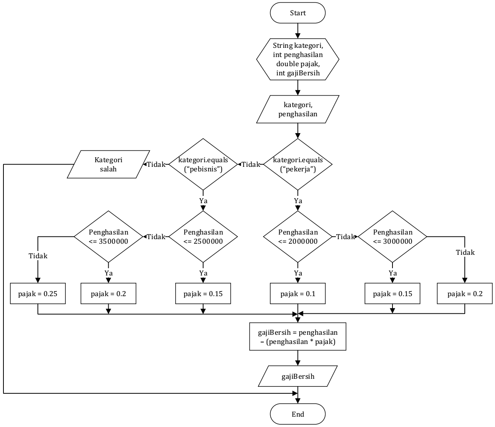

## JOBSHEET 6

## PEMILIHAN 2

### Tujuan

Mahasiswa memahami tentang operator logika; Mahasiswa mampu menyelesaikan permasalahan dengan menggunakan sintaks pemilihan bersarang; Mahasiswa mampu membuat sebuah program Java yang memanfaatkan sintaks pemilihan bersarang


### Alat dan Bahan
+ PC/laptop
+ Browser(chrome, firefox, safari)
+ Koneksi internet

### Praktikum

#### Percobaan 1

#### Waktu percobaan : 40 menit

1. Tambahkan library Scanner, deklarasi Scanner

2. Buatlah variabel nilai yang memiliki tipe data int untuk menampung data yang diinput melalui keyboard

    


```Java
// Ketik kode di sini
import java.util.Scanner;
Scanner input = new Scanner(System.in);
int nilai;
System.out.print("Masukkan nilai ujian (0-100): ");
nilai = input.nextInt();
```

    Masukkan nilai ujian (0-100): 105


3. Buatlah struktur pengecekan kondisi bersarang. Pengecekan pertama digunakan untuk memastikan bahwa nilai yang dimasukkan berada pada rentang 0 – 100. Jika nilai berada pada rentang 0 – 100, maka akan dilakukan pengecekan status kelulusan mahasiswa, yaitu jika nilai di antara 90 – 100 maka nilainya A, jika nilai di antara 80 – 89 maka nilainya B, jika nilai di antara 60 – 79 maka nilainya C, jika nilai di antara 50 – 59 maka nilainya D, dan jika nilai di antara 0 – 49 maka nilainya E. Sedangkan jika nilai berada di luar rentang 0 – 100, maka ditampilkan informasi bahwa nilai yang dimasukkan tidak valid.

    


```Java
// Ketik kode di sini
if(nilai >= 0 && nilai <= 100){
    if(nilai >= 90 && nilai <= 100){
        System.out.println("Nilai A, EXCELLENT!");
    } else if(nilai >= 80 && nilai <= 89){
        System.out.println("Nilai B, Pertahankan Prestasi Anda!");
    } else if(nilai >= 60 && nilai <= 79){
        System.out.println("Nilai C, Tingkatkan Prestasi Anda!");
    } else if(nilai >= 50 && nilai <= 59){
        System.out.println("Nilai D, Tingkatkan Belajar Anda!");
    } else {
        System.out.println("Nilai E, Anda TIDAK LULUS!");
    }
} else {
    System.out.println("Nilai yang dimasukkan tidak valid!");
}
```

    Nilai yang dimasukkan tidak valid!


> Penjelasan kode program percobaan 1
Pertama import scanner dan mendeklarasikanya.kemudian membuat variabel yang dibutuhkan lalu input dengan menggunkan scanner. jadi pertama melakukan pemilihan bahwa nilai 0-100 jika ya maka akan dilanjutkan untuk mencari nilai A,B,C,D,dan E.

##### Pertanyaan

1. Modifikasi kode program pada Percobaan 1 sehingga jika nilai yang dimasukkan kurang dari 0 akan ditampilkan output “Nilai yang Anda masukkan kurang dari 0” dan jika nilai yang dimasukkan lebih dari 100 akan ditampilkan output “Nilai yang Anda masukkan lebih dari 100”!

2. Jelaskan fungsi sintaks if (nilai >= 0 && nilai <= 100)!

3. Ubah operator && menjadi || pada sintaks if (nilai >= 0 && nilai <= 100). Jalankan program dengan memasukkan nilai = 105. Amati apa yang terjadi! Mengapa hasilnya demikian?


```Java
// Jawaban pertanyaan
// 1.
if(nilai >= 0 || nilai <= 100){
    if(nilai >= 90 && nilai <= 100){
        System.out.println("Nilai A, EXCELLENT!");
    } else if(nilai >= 80 && nilai <= 89){
        System.out.println("Nilai B, Pertahankan Prestasi Anda!");
    } else if(nilai >= 60 && nilai <= 79){
        System.out.println("Nilai C, Tingkatkan Prestasi Anda!");
    } else if(nilai >= 50 && nilai <= 59){
        System.out.println("Nilai D, Tingkatkan Belajar Anda!");
    } else {
        System.out.println("Nilai E, Anda TIDAK LULUS!");
    }
} else if(nilai < 0) {
    System.out.println("Nilai yang dimasukkan kurang dari 0");
} else {
    System.out.println("Nilai yang dimasukkan lebih dari 100");
}
```

    Nilai E, Anda TIDAK LULUS!

```
// Jawaban pertanyaan

2. fungsinya adalah syarat dari 2 kondisi yang kedua kondisi tersebut harus benar agar bisa masuk ke pemilihan yang didalamnya.

3. Yang terjadi adalah mengeluarkan nilai E, karena operator || akan true jika salah 1 kondisi true disini nilai >= 0 adalah true jadi akan masuk ke pemilihan selanjutnya yang akhirnya mengeluarkan nilai E.
```
#### Percobaan 2

#### Waktu percobaan : 40 menit

1. Perhatikan flowchart dibawah ini!



> Flowchart tersebut digunakan untuk menghitung gaji bersih seseorang setelah dipotong pajak sesuai dengan kategorinya (pekerja dan pebisnis) dan besarnya penghasilan. 

2. Tambahkan library Scanner dan deklarasi Scanner

3. Deklarasikan variabel kategori, penghasilan, gajiBersih, dan pajak

    


```Java
// Ketik kode di sini
import java.util.Scanner;
Scanner input = new Scanner(System.in);
String kategori;
int penghasilan, gajiBersih;
double pajak = 0;

System.out.print("Masukkan Kategori : ");
kategori = input.nextLine();
System.out.print("Masukkan Besar Penghasilan : ");
penghasilan = input.nextInt();
```

    Masukkan Kategori : pebisnis
    Masukkan Besar Penghasilan : 2000000


4. Buatlah struktur pengecekan kondisi bersarang. Pengecekan pertama digunakan untuk mengecek kategori (pekerja atau pebisnis). Selanjutnya dilakukan pengecekan kedua untuk menentukan besarnya pajak berdasarkan penghasilan yang telah dimasukkan.Kemudian tambahkan kode program untuk menghitung gaji bersih yang diterima setelah dipotong pajak!

    


```Java
// Ketik kode di sini
if(kategori.equalsIgnoreCase ("pekerja")){
    if (penghasilan <= 2000000){
        pajak = 0.1;
    } else if (penghasilan <= 3000000){
        pajak = 0.15;
    }else {
        pajak = 0.2;
    }
    gajiBersih = (int) (penghasilan - (penghasilan * pajak));
    System.out.println("Gaji bersih yang diterima : " + gajiBersih);
} else if (kategori.equalsIgnoreCase ("pebisnis")){
    if (penghasilan <= 2500000){
        pajak = 0.15;
    } else if (penghasilan <= 3500000){
        pajak = 0.2;
    }else {
        pajak = 0.25;
    }
    gajiBersih = (int) (penghasilan - (penghasilan * pajak));
    System.out.println("Gaji bersih yang diterima : " + gajiBersih);
} else {
    System.out.println("Kategori yang anda masukkan salah!");
}
```

    Gaji bersih yang diterima : 1700000


5. Jalankan program di atas. Amati apa yang terjadi!

> Penjelasan kode program percobaan 2
 Pertama import scanner dan mendeklarasikanya.kemudian membuat variabel yang dibutuhkan lalu input dengan menggunkan scanner.lalu menggunakan pemilihan nesting. kemudian dilakukan pemilihan kategori. didalamnya terdapat pemilihan besarnya pajak.

##### Pertanyaan

1. Jalankan program dengan memasukkan kategori = pekerja dan penghasilan = 2048485. Amati apa yang terjadi! Mengapa angka di belakang koma tidak ditampilkan?

2. Jelaskan fungsi dari (int) pada sintaks:
```
gajiBersih = (int) (penghasilan - (penghasilan * pajak));
```

3.	Jalankan program dengan memasukkan kategori = pebisnis dan penghasilan = 2000000. Amati apa yang terjadi! Apa kegunaan dari equalsIgnoreCase? 

4.	Ubah equalsIgnoreCase menjadi equals, kemudian jalankan program dengan memasukkan kategori = pebisnis dan penghasilan = 2000000. Amati apa yang terjadi! Mengapa hasilnya demikian? Apa kegunaan dari equals? 


```
// Jawaban pertanyaan
1. Angka belakang koma tidak ditampilkan karena variabel gajiBersih menggunakan tipe data integer

2. fungsinya adalah mengubah tipe data pajak yang semula double menjadi integer

3. Hasilnya benar, kegunaan equalsIgnoreCase adalah membandingkan karakter yang telah ditentukan.

4. Hasilnya tetap, kegunaan dari equals sama dengan equalsIgnoreCase bedanya adalah equals mementingkan penggunaan huruf besar dan kecil sedangkan equalsIgnoreCase tidak selama nilainya sama.
```

### Tugas

#### Waktu pengerjaan Tugas: 140 menit

1. Buatlah program kalkulator sederhana menggunakan bahasa pemrograman Java. User akan menginputkan dua buah bilangan riil dan satu buah operator aritmatika (+, -, *, atau /), kemudian program akan mengoperasikan dua bilangan tersebut dengan operator yang sesuai. Petunjuk: gunakan pernyataan switch-case.
Contoh tampilan program:

```
Masukkan bilangan pertama: 2.5
Masukkan operator (+, -, *, /): *
Masukkan bilangan kedua: 4
2.5 * 4.0 = 10.0

```


```Java
//ketik kode program dan lampirkan hasilnya disini
import java.util.Scanner;
Scanner input = new Scanner(System.in);
double bil1, bil2, hasil;
char operator;

System.out.print("Masukkan bilangan pertama : ");
bil1 = input.nextDouble();
System.out.print("Masukkan operator (+, -, *, /): ");
operator = input.next().charAt(0);
System.out.print("Masukkan bilangan kedua : ");
bil2 = input.nextDouble();

switch(operator){
    case '+':
    hasil = bil1 + bil2;
    System.out.println(bil1 + " + " + bil2 + " = " + hasil);
    break;
    case '-':
    hasil = bil1 - bil2;
    System.out.println(bil1 + " - " + bil2 + " = " + hasil);
    break;
    case '*':
    hasil = bil1 * bil2;
    System.out.println(bil1 + " * " + bil2 + " = " + hasil);
    break;
    case '/':
    hasil = bil1 / bil2;
    System.out.println(bil1 + " / " + bil2 + " = " + hasil);
    break;
    default:
    System.out.println("Operator yang Anda masukkan salah");
}
```
```
 Pertama import scanner dan mendeklarasikanya.kemudian membuat variabel yang dibutuhkan lalu input dengan menggunakan scanner.lalu menggunakan switch case untuk menjalankan perhitungan.
```
2. Dengan menggunakan tiga nilai yang mewakili panjang tiga sisi sebuah segitiga, tentukan apakah segitiga tersebut sama sisi (ketiga sisinya bernilai sama), sama kaki (kedua sisinya bernilai sama), atau sembarang (tidak ada sisi yang bernilai sama)! 


```Java
//ketik kode program dan lampirkan hasilnya disini
import java.util.Scanner;
Scanner input = new Scanner(System.in);
int nilai1, nilai2, nilai3;
System.out.print("Masukkan nilai 1 : ");
nilai1 = input.nextInt();
System.out.print("Masukkan nilai 2 : ");
nilai2 = input.nextInt();
System.out.print("Masukkan nilai 3 : ");
nilai3 = input.nextInt();

if(nilai1 == nilai2 && nilai1 == nilai3){
    System.out.print("Segitiga sama sisi");
} else if(nilai1 == nilai2 || nilai1 == nilai3 || nilai2 == nilai3) {
    System.out.println("Segitiga sama kaki");
} else {
    System.out.println("Segitiga sembarang");
}
```
```
 Pertama import scanner dan mendeklarasikanya.kemudian membuat variabel yang dibutuhkan lalu input dengan menggunakan scanner.lalu menggunakan pemilihan agar jika ke3 nilai sama maka mengeluarkan segitiga sama sisi, jika hanya 2 nilai yang sama maka akan mengeluarkan segitiga sama kaki, dan jika tidak maka mengeluarkan segitiga sembarang.
```
3. Warung Padang Gembira meminta Anda membuat sebuah program untuk menerima pesanan dari internet. Program yang Anda buat meminta user untuk memasukkan nama makanan dan harga. Setelah itu, user ditawarkan untuk menggunakan pengiriman ekspres. Jika pengguna menolak, maka jenis pengiriman yang digunakan adalah pengiriman reguler. Biaya pengiriman reguler untuk harga makanan kurang dari Rp 100.000 adalah Rp 20.000, sedangkan untuk harga makanan sama dengan atau lebih dari Rp 100.000 biaya pengirimannya adalah Rp 30.000. Untuk jenis pengiriman ekspres, tambahkan biaya tambahan sebesar Rp 25.000 dari standar biaya pengiriman reguler. Tampilkan struk yang berisi nama makanan yang dibeli + harga, biaya pengiriman, dan total yang harus dibayar!
Contoh hasil output program:

```
Masukkan nama makanan: Tuna salad
Masukkan harga makanan: Rp 115000
Apakah Anda ingin pengiriman ekspres (0 = tidak, 1 = ya)? 0

STRUK PEMBELIAN
Tuna salad        Rp 115000
Biaya pengiriman  Rp 30000
TOTAL             Rp 145000

```

```
Masukkan nama makanan: Beef bulgogi
Masukkan harga makanan: Rp 78000
Apakah Anda ingin pengiriman ekspres (0 = tidak, 1 = ya)? 1

STRUK PEMBELIAN
Beef bulgogi      Rp 115000
Biaya pengiriman  Rp 45000
TOTAL             Rp 123000

```


```Java
//ketik kode program dan lampirkan hasilnya disini
import java.util.Scanner;
Scanner input = new Scanner(System.in);
String namaMakan, pengiriman;
int hargaMakan, biayaKirim = 0, totalKirim = 0, totalBayar;

System.out.print("Masukkan nama makanan : ");
namaMakan = input.nextLine();
System.out.print("Masukkan harga makanan : ");
hargaMakan = input.nextInt();
input.nextLine();
System.out.print("Apakah anda ingin pengiriman ekspres? (y/n) : ");
pengiriman = input.nextLine();
        
if(hargaMakan < 100000 && pengiriman.equalsIgnoreCase ("y")){
    biayaKirim = 20000;
    totalKirim = biayaKirim + 25000;
    totalBayar = hargaMakan + totalKirim;
    System.out.println("STRUK PEMBELIAN");
    System.out.println(namaMakan + "  \t\t Rp. " + hargaMakan);
    System.out.println("Biaya Pengiriman Rp. " + totalKirim);
    System.out.println("Total  \t\t Rp. " + totalBayar);
} else if(hargaMakan < 100000 && pengiriman.equalsIgnoreCase ("n")){
    biayaKirim = 20000;
    totalBayar = hargaMakan + totalKirim;
    System.out.println("STRUK PEMBELIAN");
    System.out.println(namaMakan + "  \t\t Rp. " + hargaMakan);
    System.out.println("Biaya Pengiriman Rp. " + totalKirim);
    System.out.println("Total  \t\t Rp. " + totalBayar);
} else if(hargaMakan >= 100000 && pengiriman.equalsIgnoreCase ("y")){
    biayaKirim = 30000;
    totalKirim = biayaKirim + 25000;
    totalBayar = hargaMakan + totalKirim;
    System.out.println("STRUK PEMBELIAN");
    System.out.println(namaMakan + "  \t\t Rp. " + hargaMakan);
    System.out.println("Biaya Pengiriman Rp. " + totalKirim);
    System.out.println("Total  \t\t Rp. " + totalBayar);
} else if(hargaMakan >= 100000 && pengiriman.equalsIgnoreCase ("n")){
    biayaKirim = 30000;
    totalBayar = hargaMakan + totalKirim;
    System.out.println("STRUK PEMBELIAN");
    System.out.println(namaMakan + "  \t\t Rp. " + hargaMakan);
    System.out.println("Biaya Pengiriman Rp. " + totalKirim);
    System.out.println("Total  \t\t Rp. " + totalBayar);
} else {
    System.out.println("Huruf yang anda masukkan salah!");
}
```
```
 Pertama import scanner dan mendeklarasikanya.kemudian membuat variabel yang dibutuhkan lalu input dengan menggunakan scanner.lalu melakukan pemilihan jika harga kurang dari 100000 && pengiriman exstra y maka biaya pengiriman 20000 + 25000 = 45000.Jika n maka biaya pengiriman 20000.Sedangkan jika harga makanan >= 100000 dan y maka biaya pengiriman adalah 30000 + 25000 = 55000. Jika n maka hanya 30000. Jika salah memasukkan huruf(y/n) maka akan mengeluarkan "Huruf yang anda masukkan salah!" dan tidak melanjutkan perhitungan.
```
4. Perhatikan flowchart berikut ini!


> Buatlah program sesuai dengan flowchart diatas!


```Java
//ketik kode program dan lampirkan hasilnya disini
import java.util.Scanner;
Scanner input = new Scanner(System.in);
String sSekolah, sKerja;
int umur, pendapatan, tanggungan, biayaHidup;
System.out.print("Masukkan Umur : ");
umur = input.nextInt();

if(umur >= 18){
    System.out.print("Sudah Bekerja? (y/n) ");
    input.nextLine();
    sKerja = input.nextLine();
    if(sKerja.equalsIgnoreCase ("y")){
        System.out.print("Masukkan Pendapatan perbulan : ");
        pendapatan = input.nextInt();
        System.out.print("Masukkan jumlah tanggungan : ");
        tanggungan = input.nextInt();
        biayaHidup = pendapatan / tanggungan;
        if(biayaHidup < 300000){
            System.out.print("Penduduk Miskin");
        } else {
            System.out.print("Bukan Penduduk Miskin");
        }
    } else if(sKerja.equalsIgnoreCase ("n")){
        System.out.print("Penduduk Miskin");
    } else {
        System.out.print("Huruf yang anda masukkan salah!");
    }
} else {
    System.out.print("Masih Sekolah? (y/n) ");
    input.nextLine();
    sSekolah = input.nextLine();
    if(sSekolah.equalsIgnoreCase ("y")){
        System.out.print("Bukan Penduduk Miskin");
    } else if(sSekolah.equalsIgnoreCase ("n")){
        System.out.print("Penduduk Miskin");
    } else {
        System.out.print("Huruf yang anda masukkan salah!");
    }
}
```
```
 Pertama import scanner dan mendeklarasikanya.kemudian membuat variabel yang dibutuhkan lalu input dengan menggunakan scanner.lalu melakukan pemilihan jika umur >= 18 maka akan ditanya apakah sudah kerja jika kurang dari 18 maka akan ditanya apakah masih sekolah.Jika masih sekolah maka bukan penduduk miskin, sebaliknya maka penduduk miskin. Jika sudah kerja maka dilanjutkan dengan memasukkan pendapatan dan jumlah tanggungan kemudian dibagi. jika hasilnya kurang dari 300000 maka termasuk penduduk miskin jika tidak maka bukan miskin.
```