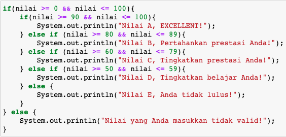

## JOBSHEET 6

## PEMILIHAN 2

### Tujuan

Mahasiswa memahami tentang operator logika; Mahasiswa mampu menyelesaikan permasalahan dengan menggunakan sintaks pemilihan bersarang; Mahasiswa mampu membuat sebuah program Java yang memanfaatkan sintaks pemilihan bersarang


### Alat dan Bahan
+ PC/laptop
+ Browser(chrome, firefox, safari)
+ Koneksi internet

### Praktikum

#### Percobaan 1

#### Waktu percobaan : 40 menit

1. Tambahkan library Scanner, deklarasi Scanner

2. Buatlah variabel nilai yang memiliki tipe data int untuk menampung data yang diinput melalui keyboard

    


```Java
import java.util.Scanner;

Scanner scn = new Scanner(System.in);

System.out.print("Masukan nilai (0-100): ");
int nilai = scn.nextInt();
```

    Masukan nilai (0-100): 

3. Buatlah struktur pengecekan kondisi bersarang. Pengecekan pertama digunakan untuk memastikan bahwa nilai yang dimasukkan berada pada rentang 0 – 100. Jika nilai berada pada rentang 0 – 100, maka akan dilakukan pengecekan status kelulusan mahasiswa, yaitu jika nilai di antara 90 – 100 maka nilainya A, jika nilai di antara 80 – 89 maka nilainya B, jika nilai di antara 60 – 79 maka nilainya C, jika nilai di antara 50 – 59 maka nilainya D, dan jika nilai di antara 0 – 49 maka nilainya E. Sedangkan jika nilai berada di luar rentang 0 – 100, maka ditampilkan informasi bahwa nilai yang dimasukkan tidak valid.

    


```Java
if (nilai >= 0 && nilai <= 100) {
    if (nilai >= 90 && nilai <= 100) {
        System.out.println("Nilai A, EXCELLENT!");
    } else if(nilai >= 80 && nilai <= 89) {
        System.out.println("Nilai B, Pertahankan prestasi Anda!");
    } else if(nilai >= 60 && nilai <= 79) {
        System.out.println("Nilai C, Tingkatkan prestasi Anda!");
    } else if(nilai >= 50 && nilai <= 59) {
        System.out.println("Nilai D, Tingkatkan belajar Anda!");
    } else {
        System.out.println("Nilai E, Anda tidak lulus!");
    } 
} else {
    System.out.println("Nilai yang Anda masukkan tidak valid!");
}
```

    Nilai yang Anda masukkan tidak valid!
    

Kode di atas berfungsi untuk mengecek variable nilai yang nilainya diinputkan oleh user.

Jika nilai yang dimasukkan tidak dalam rentang 0-100, maka akan menampilkan output tidak valid.

Jika nilainya dalam rentang 0-100, maka akan menampilkan pesan sesuai dengan nilai yang dimasukan

##### Pertanyaan

1. Modifikasi kode program pada Percobaan 1 sehingga jika nilai yang dimasukkan kurang dari 0 akan ditampilkan output “Nilai yang Anda masukkan kurang dari 0” dan jika nilai yang dimasukkan lebih dari 100 akan ditampilkan output “Nilai yang Anda masukkan lebih dari 100”!

2. Jelaskan fungsi sintaks if (nilai >= 0 && nilai <= 100)!

3. Ubah operator && menjadi || pada sintaks if (nilai >= 0 && nilai <= 100). Jalankan program dengan memasukkan nilai = 105. Amati apa yang terjadi! Mengapa hasilnya demikian?

1. Jawaban No 1


```Java
if(nilai >= 0 && nilai <= 100) {
    if(nilai >= 90 && nilai <= 100) {
        System.out.println("Nilai A, EXCELLENT!");
    } else if(nilai >= 80 && nilai <= 89) {
        System.out.println("Nilai B, Pertahankan prestasi Anda!");
    } else if(nilai >= 60 && nilai <= 79) {
        System.out.println("Nilai C, Tingkatkan prestasi Anda!");
    } else if(nilai >= 50 && nilai <= 59) {
        System.out.println("Nilai D, Tingkatkan belajar Anda!");
    } else {
        System.out.println("Nilai E, Anda tidak lulus!");
    } 
} else if(nilai < 0) {
    System.out.println("Nilai yang Anda masukkan kurang dari 0!");
} else {
    System.out.println("Nilai yang Anda masukkan lebih dari 100!");
}
```

    Nilai yang Anda masukkan kurang dari 0!


2. Sintaks tersebut mengecek jika variable nilai memiliki rentang 0-100

3. Jawaban No 3


```Java
if(nilai >= 0 || nilai <= 100) {
    if(nilai >= 90 && nilai <= 100) {
        System.out.println("Nilai A, EXCELLENT!");
    } else if(nilai >= 80 && nilai <= 89) {
        System.out.println("Nilai B, Pertahankan prestasi Anda!");
    } else if(nilai >= 60 && nilai <= 79) {
        System.out.println("Nilai C, Tingkatkan prestasi Anda!");
    } else if(nilai >= 50 && nilai <= 59) {
        System.out.println("Nilai D, Tingkatkan belajar Anda!");
    } else {
        System.out.println("Nilai E, Anda tidak lulus!");
    } 
} else {
    System.out.println("Nilai yang Anda masukkan tidak valid!");
}
```

    Nilai E, Anda tidak lulus!


##### Penjelasan
Meskipun variable nilai bernilai -6, kode dalam if pertama tetap dijalankan, karena sudah memenuhi salah satu kriteria, yaitu nilai <= 100. Ini terjadi karena operator || atau ATAU hanya membutuhkan 1 kebenaran.

#### Percobaan 2

#### Waktu percobaan : 40 menit

1. Perhatikan flowchart dibawah ini!


> Flowchart tersebut digunakan untuk menghitung gaji bersih seseorang setelah dipotong pajak sesuai dengan kategorinya (pekerja dan pebisnis) dan besarnya penghasilan. 

2. Tambahkan library Scanner dan deklarasi Scanner

3. Deklarasikan variabel kategori, penghasilan, gajiBersih, dan pajak

    


```Java
import java.util.Scanner;

Scanner input = new Scanner(System.in);

String kategori;
int penghasilan, gajiBersih;
double pajak = 0;

System.out.print("Masukkan kategori: ");
kategori = input.nextLine();
System.out.print("Masukkan besarnya penghasilan: ");
penghasilan = input.nextInt();
```

    Masukkan kategori: pekerja
    Masukkan besarnya penghasilan: 2500000
    

Kode di atas membuat sebuah scanner yang digunakan untuk input kategori dan besar penghasilan.

4. Buatlah struktur pengecekan kondisi bersarang. Pengecekan pertama digunakan untuk mengecek kategori (pekerja atau pebisnis). Selanjutnya dilakukan pengecekan kedua untuk menentukan besarnya pajak berdasarkan penghasilan yang telah dimasukkan.Kemudian tambahkan kode program untuk menghitung gaji bersih yang diterima setelah dipotong pajak!

    


```Java
if(kategori.equalsIgnoreCase("pekerja")) {
    if(penghasilan <= 2000000) {
        pajak = 0.1;
    } else if (penghasilan <= 3000000) {
        pajak = 0.15;
    } else {
        pajak = 0.2;
    }
    
    gajiBersih = (int) (penghasilan - (penghasilan * pajak));
    
    System.out.println("Gaji bersih yang Anda terima: " + gajiBersih);
} else if (kategori.equalsIgnoreCase("pebisnis")) {
    if (penghasilan <= 2500000) {
        pajak = 0.15;
    } else if (penghasilan <= 3500000) {
        pajak = 0.2;
    } else {
        pajak = 0.25;
    }

    gajiBersih = (int) (penghasilan - (penghasilan * pajak));
    System.out.println("gajih bersih yang Anda terima: " + gajiBersih);
} else {
    System.out.println("Kategori yang Anda masukkan salah!");
}
```

    Gaji bersih yang Anda terima: 2125000


5. Jalankan program di atas. Amati apa yang terjadi!

Karena pada waktu input saya memasukan kategori pekerja dan gai 250000, jadi pada kondisi di atas masuk ke bagian pekerja dan gaji dibawah 3000000, sehingga mendapat pajak 0.15 atau 15%. Gaji bersih yang ditampilkan adalah gaji yang dimasukan tadi dikurangi pajaknya.

##### Pertanyaan

1. Jalankan program dengan memasukkan kategori = pekerja dan penghasilan = 2048485. Amati apa yang terjadi! Mengapa angka di belakang koma tidak ditampilkan?

2. Jelaskan fungsi dari (int) pada sintaks:
```
gajiBersih = (int) (penghasilan - (penghasilan * pajak));
```

3.	Jalankan program dengan memasukkan kategori = pebisnis dan penghasilan = 2000000. Amati apa yang terjadi! Apa kegunaan dari equalsIgnoreCase?

4.	Ubah equalsIgnoreCase menjadi equals, kemudian jalankan program dengan memasukkan kategori = pebisnis dan penghasilan = 2000000. Amati apa yang terjadi! Mengapa hasilnya demikian? Apa kegunaan dari equals?


```Java
Jawaban
1. karena gajihBersi bertipe integer
2. intuk casting dari double ke int, karena terdapat operasi dengan nilai double yaitu pajak
3. equalsIgnoreCase berguna untuk membandingkan String dengan menghiraukan besar kecilnya huruf
4. Outputnya sama seperti sebelumnya, karena pebisnis dan pebisnis tetap sama, semua menggunakan huruf kecil
```

### Tugas

#### Waktu pengerjaan Tugas: 140 menit

1. Buatlah program kalkulator sederhana menggunakan bahasa pemrograman Java. User akan menginputkan dua buah bilangan riil dan satu buah operator aritmatika (+, -, *, atau /), kemudian program akan mengoperasikan dua bilangan tersebut dengan operator yang sesuai. Petunjuk: gunakan pernyataan switch-case.
Contoh tampilan program:

```
Masukkan bilangan pertama: 2.5
Masukkan operator (+, -, *, /): *
Masukkan bilangan kedua: 4
2.5 * 4.0 = 10.0

```


```Java
import java.util.Scanner;

Scanner scn = new Scanner(System.in);

double a, b, result;
char operator;
System.out.print("Masukkan bilangan pertama: ");
a = scn.nextDouble();
System.out.print("Masukkan operator (+, -, *, /): ");
operator = scn.next().charAt(0);
System.out.print("Masukkan bilangan kedua: ");
b = scn.nextDouble();

  
switch(operator) {
    case '+':
        result = a + b;
        break;
    case '-':
        result = a - b;
        break;
    case '*':
        result = a * b;
        break;
    case '/':
        result = a / b;
        break;
    default:
        System.out.println("Operator yang Anda masukkan salah!");
        break;
}


System.out.println(String.format("%.1f %c %.1f = %.1f", a, operator, b, result));

```

    Masukkan bilangan pertama: 89
    Masukkan operator (+, -, *, /): /
    Masukkan bilangan kedua: 332
    89.0 / 332.0 = 0.3
    

Kode di atas meminta user input kemudian melakukan operasi aritmatika berdasarkan operator yang dimasukkan, untuk pengecekan  jenis operator menggunakan switch case

2. Dengan menggunakan tiga nilai yang mewakili panjang tiga sisi sebuah segitiga, tentukan apakah segitiga tersebut sama sisi (ketiga sisinya bernilai sama), sama kaki (kedua sisinya bernilai sama), atau sembarang (tidak ada sisi yang bernilai sama)! 


```Java
import java.util.Scanner;

Scanner scn = new Scanner(System.in);

System.out.println("Sisi 1: ");
int s1 = scn.nextInt();
System.out.println("Sisi 2: ");
int s2 = scn.nextInt();
System.out.println("Sisi 3: ");
int s3 = scn.nextInt();

  
if(s1 == s2 && s2 == s3) {
    System.out.println("Segitiga sama sisi");
} else if(s1 == s2 || s2 == s3 || s1 == s3) {
    System.out.println("Segitiga sama kaki");
} else {
    System.out.println("Segitiga sembarang");
}
```

    Sisi 1: 
    Sisi 2: 
    Sisi 3: 
    Segitiga sembarang
    

Kode di atas berguna untuk melakukan pengecekan 3 sisi, jika sama semua maka akan menampilkan segitiga sama sisi, jika terdapat 2 sisi yang sama menampilkan segitiga sama kaki, dan jika tidak ada yang sama akan menampilkan segitiga sembarang

3. Warung Padang Gembira meminta Anda membuat sebuah program untuk menerima pesanan dari internet. Program yang Anda buat meminta user untuk memasukkan nama makanan dan harga. Setelah itu, user ditawarkan untuk menggunakan pengiriman ekspres. Jika pengguna menolak, maka jenis pengiriman yang digunakan adalah pengiriman reguler. Biaya pengiriman reguler untuk harga makanan kurang dari Rp 100.000 adalah Rp 20.000, sedangkan untuk harga makanan sama dengan atau lebih dari Rp 100.000 biaya pengirimannya adalah Rp 30.000. Untuk jenis pengiriman ekspres, tambahkan biaya tambahan sebesar Rp 25.000 dari standar biaya pengiriman reguler. Tampilkan struk yang berisi nama makanan yang dibeli + harga, biaya pengiriman, dan total yang harus dibayar!
Contoh hasil output program:

```
Masukkan nama makanan: Tuna salad
Masukkan harga makanan: Rp 115000
Apakah Anda ingin pengiriman ekspres (0 = tidak, 1 = ya)? 0

STRUK PEMBELIAN
Tuna salad        Rp 115000
Biaya pengiriman  Rp 30000
TOTAL             Rp 145000

```

```
Masukkan nama makanan: Beef bulgogi
Masukkan harga makanan: Rp 78000
Apakah Anda ingin pengiriman ekspres (0 = tidak, 1 = ya)? 1

STRUK PEMBELIAN
Beef bulgogi      Rp 115000
Biaya pengiriman  Rp 45000
TOTAL             Rp 123000

```


```Java
import java.util.Scanner;

Scanner scn = new Scanner(System.in);

String namaMakanan;
int hargaMakanan, isExpress, ongkir = 0;
  
System.out.print("Masukkan nama makanan: ");
namaMakanan = scn.nextLine();
System.out.print("Masukkan harga makanan: Rp ");
hargaMakanan = scn.nextInt();
System.out.print("Apakah Anda ingin pengiriman ekspres? (0 = tidak, 1 = ya) ? ");
isExpress = scn.nextInt();

if(hargaMakanan < 100000) {
    ongkir = 20000;
} else {
    ongkir = 30000;
}

if(isExpress == 1) {
  ongkir += 25000;
}

System.out.println("STRUK PEMBELIAN");
System.out.println(namaMakanan + "\t\t Rp " + hargaMakanan);
System.out.println("Biaya pengiriman\t Rp " + ongkir);
System.out.println("TOTAL\t\t\t Rp " + (hargaMakanan + ongkir));
```

    Masukkan nama makanan: Beef bulgogi
    Masukkan harga makanan: Rp 78000
    Apakah Anda ingin pengiriman ekspres? (0 = tidak, 1 = ya) ? 1
    STRUK PEMBELIAN
    Beef bulgogi		 Rp 78000
    Biaya pengiriman	 Rp 45000
    TOTAL			 Rp 123000
    

Kode di atas digunakan untuk menentukan biaya ongkir. Biaya ongkir reguler dan ekspress hanya dibedakan dengan adanya biaya tambahan untuk  ekspres sebesar 25000

4. Perhatikan flowchart berikut ini!


> Buatlah program sesuai dengan flowchart diatas!


```Java
import java.util.Scanner;

Scanner scn = new Scanner(System.in);

int umur;
boolean isBekerja, isSekolah;
int pendapatan, tanggungan;
double biayaHidup;

System.out.print("Masukkan umur: ");
umur = scn.nextInt();

if(umur >= 18) {
  System.out.print("Masukan status bekerja (y = ya, t = tidak): ");
  isBekerja = scn.next().charAt(0) == 'y';

  if(isBekerja) {
    System.out.print("Masukan pendapatan: ");
    pendapatan = scn.nextInt();
    System.out.print("Masukan jumlah tanggungan: ");
    tanggungan = scn.nextInt();

    if(tanggungan == 0) {
        biayaHidup = pendapatan;
    } else {
        biayaHidup = pendapatan / tanggungan;    
    }

    if(biayaHidup < 300000) {
      System.out.println("Penduduk miskin");
    } else {
      System.out.println("Bukan penduduk miskin");
    }
  } else {
    System.out.println("Penduduk miskin");
  }
} else {
  System.out.print("Masukan status sekolah (y = ya, t = tidak): ");
  isSekolah = scn.next().charAt(0) == 'y';

  if(!isSekolah) {
    System.out.println("Penduduk miskin");
  } else {
    System.out.println("Bukan penduduk miskin");
  }
}
```

    Masukkan umur: 20
    Masukan status bekerja (y = ya, t = tidak): y
    Masukan pendapatan: 200000
    Masukan jumlah tanggungan: 3
    Penduduk miskin
    

Kode di atas berfungsi untuk menentukan apakah penduduk miskin atau tidak
