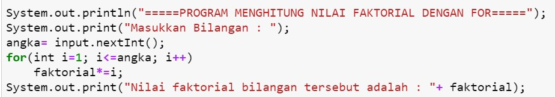

## JOBSHEET 7

## PERULANGAN 1

### Tujuan

Mahasiswa mampu menyelesaikan permasalahan/studi kasus menggunakan sintaks perulangan 1 dan mengimplemantasikannya dalam bahasa pemrogaman java.

### Alat dan Bahan
+ PC/laptop
+ Browser(chrome, firefox, safari)
+ Koneksi internet

### Praktikum

#### Percobaan 1 : Penggunaan for, while dan do-while

#### Waktu percobaan : 40 menit

1. Perhatikan flowchart perulangan for dibawah ini!

    <p align="left">
    
    </p>
    

> Flowchart diatas digunakan untuk menghitung nilai faktorial, selanjutnya kita akan membuat programnya berdasarkan
> flowchart di atas!

2. Tambahkan library Scanner, deklarasi Scanner, dan buat variabel angka untuk menampung data yang diinput melalui keyboard


```Java
// Ketik kode program di bawah sini
import java.util.Scanner


```


```Java
3. Buatlah deklarasi dan inisialisasi variabel faktorial sesuai dengan flowchart diatas
```


```Java
// Ketik kode program di bawah sini
Scanner input = new Scanner(System.in);
int angka, faktorial = 1;
```

4. Tambahkan struktur perulangan untuk menghitung hasil faktorial sebuah nilai yang diinputkan menggunakan for
    
    <p align="left">
    
    </p>


```Java
// Ketik kode program di atas di bawah sini
System.out.println("-----PROGRAM MENGHITUNG NILAI FAKTORIAL DENGAN FOR-----");
System.out.print("Masukan Bilangan : ");
angka = input.nextInt();
for(int i=1; i<=angka; i++){
    faktorial= faktorial * i;
    System.out.printf("Nilai faktorial dari %d adalah %d\n" ,i,faktorial);
}
System.out.print("Nilai faktorial bilangan tersebut adalah : "+ faktorial);
```

    -----PROGRAM MENGHITUNG NILAI FAKTORIAL DENGAN FOR-----
    Masukan Bilangan : 8
    Nilai faktorial dari 1 adalah 1
    Nilai faktorial dari 2 adalah 2
    Nilai faktorial dari 3 adalah 6
    Nilai faktorial dari 4 adalah 24
    Nilai faktorial dari 5 adalah 120
    Nilai faktorial dari 6 adalah 720
    Nilai faktorial dari 7 adalah 5040
    Nilai faktorial dari 8 adalah 40320
    Nilai faktorial bilangan tersebut adalah : 40320

penjelasan
saya menggunakan pengulangan for untuk integer i. dengan batasnya variabel angka. ketika kondisi terpenuhi melakukan operasi mengubah nilai operasi faktorial dengan mengalikan faktorial dengan i. lalu diberikan output. dan kemudian i di tambah nilainya dengan operasi 1++

5. Ubah nilai variabel faktorial seperti semula. Kemudian gunakan struktur perulangan while untuk menghitung hasil faktorial sebuah nilai yang diinputkan
    
    <p align="left">
    
    </p>


```Java
// Ketik kode program di atas di bawah sini
System.out.println("-----PROGRAM MENGHITUNG NILAI FAKTORIAL DENGAN While-----");
System.out.print("Masukan Bilangan : ");
angka = input.nextInt();
int i=1; 
while(i<=angka){
    faktorial*=i;
    i++;
}
System.out.print("Nilai faktorial bilangan tersebut adalah : "+ faktorial);
```

    -----PROGRAM MENGHITUNG NILAI FAKTORIAL DENGAN While-----
    Masukan Bilangan : 6
    Nilai faktorial bilangan tersebut adalah : 720

6. Kembalikan lagi nilai variabel faktorial seperti semula. Gunakan struktur perulangan do-while untuk menghitung hasil faktorial sebuah nilai yang diinputkan
    
    <p align="left">
    
    </p>


```Java
// Ketik kode program di atas di bawah sini
System.out.println("-----PROGRAM MENGHITUNG NILAI FAKTORIAL DENGAN Do-While-----");
System.out.print("Masukan Bilangan : ");
angka = input.nextInt();
int i=1; 
do{
    faktorial*=i;
    i++;
}
while(i<=angka);
System.out.print("Nilai faktorial bilangan tersebut adalah : "+ faktorial);
```

    -----PROGRAM MENGHITUNG NILAI FAKTORIAL DENGAN Do-While-----
    Masukan Bilangan : 7
    Nilai faktorial bilangan tersebut adalah : 5040

##### Pertanyaan
1. Pada program diatas, apakah kegunaan baris berikut?
<p align="left">
    
    </p>


```Java
// Ketik jawaban disini
untuk mengalikan variabel faktorial dengan variabel i
```

2. Modifikasi program diatas dibagian struktur pemilihannya sehingga hasilnya menjadi seperti di bawah ini:
<p align="left">
    
    </p>


```Java
// Ketik kode program di atas di bawah sini
faktorial = 1;
System.out.println("-----PROGRAM MENGHITUNG NILAI FAKTORIAL-----");
System.out.print("Masukan Bilangan : ");
angka = input.nextInt();
 
System.out.printf("%d faktorial = 1 " ,angka);
for(int i=1; i<=angka; i++){
    faktorial*=i;
    if(i==1) continue;
    System.out.printf("x %d " ,i);
}
System.out.printf(" = %d" ,faktorial);
```

    -----PROGRAM MENGHITUNG NILAI FAKTORIAL-----
    Masukan Bilangan : 7
    7 faktorial = 1 x 2 x 3 x 4 x 5 x 6 x 7  = 5040


    java.io.PrintStream@74191434


penjelasan
mendeklarasi scanner lalu memasukan variabel yang diperlukan. lalu meneluarkan output angka yang dimasukan. menggunakan perulangan while untuk melanjutkan output yang akan berulang selama nilai i kurang dari samadengan variabel angka. lalu membuat program untuk melengkapi output.

#### Percobaan 2 : Keluar dari perulangan menggunakan break

#### Waktu percobaan : 40 menit

1. Buatlah perulangan dengan menggunakan for yang memanfaatkan keyword break
<p align="left">
    
    </p>


```Java
// Ketik kode program di atas di bawah sini
Scanner input=new Scanner(System.in);
int angka,total;
System.out.println("-----PROGRAM FOR LOOP DENGAN BREAK-----");
for(total=0;true;){
    System.out.print("Masukan Bilangan : ");
    angka=input.nextInt();
    total+=angka;
    if(total>50) break;
}
```

    -----PROGRAM FOR LOOP DENGAN BREAK-----
    Masukan Bilangan : 20
    Masukan Bilangan : 20
    Masukan Bilangan : 20


penjelasan
perulangan for dengan nilai awal total=0 dengan batasan 'true'. didalam for memasukan input angka lalu menjumlahkan total dengan angka. terus diulang sampai nilai total lebih dari 50.

2. Buat perulangan yang sama dengan struktur perulangan while
<p align="left">
    
    </p>


```Java
// Ketik kode program di atas di bawah sini
int angka,total;
System.out.println("-----PROGRAM WHILE LOOP DENGAN BREAK-----");
total=0;
while(true){
    System.out.print("Masukan Bilangan : ");
    angka=input.nextInt();
    total+=angka;
    if(total>50) break;
}
System.out.println("Jumlah angka yang telah dimasukan : "+total);
```

    -----PROGRAM WHILE LOOP DENGAN BREAK-----
    Masukan Bilangan : 21
    Masukan Bilangan : 17
    Masukan Bilangan : 7
    Masukan Bilangan : 12
    Jumlah angka yang telah dimasukan : 57


penjelasan
perulangan while dengan nilai awal total=0 dengan batasan 'true'. didalam while memasukan input angka lalu menjumlahkan total dengan angka. terus diulang sampai nilai total lebih dari 50.

3. Tuliskan perulangan diatas dalam struktur do-while
    <p align="left">
    
    </p>


```Java
// Ketik kode program di atas di bawah sini
int angka,total;
System.out.println("-----PROGRAM DO-WHILE LOOP DENGAN BREAK-----");
total=0;
do{
    System.out.print("Masukan Bilangan : ");
    angka=input.nextInt();
    total+=angka;
    if(total>50) break;
}
while(true);
System.out.println("Jumlah angka yang telah dimasukan : "+total);
```

    -----PROGRAM DO-WHILE LOOP DENGAN BREAK-----
    Masukan Bilangan : 20
    Masukan Bilangan : 8
    Masukan Bilangan : 9
    Masukan Bilangan : 12
    Masukan Bilangan : 13
    Jumlah angka yang telah dimasukan : 62


##### Pertanyaan
1. Jelaskan fungsi kode program yang telah dibuat pada percobaan diatas!

// Ketik jawaban disini
fungsi dari kode program di atas adalah mengulangi terus perintah input hingga total input yang diberikan lebih dari 50. lalu output totalnya.

2. Jelaskan fungsi kode berikut!
    <p align="left">
    
    </p>


// Ketik jawaban disini
pengulangan dengan for. dengan nilai awal total=0. dan dengan batasan nilai true.

#### Percobaan 3 : Keluar dari step perulangan menggunakan continue

#### Waktu percobaan : 40 menit

1. Buat program looping menggunakan struktur perulangan for seperti di bawah ini: 
<p align="left">
    
    </p>


```Java
// Ketik kode program di atas di bawah sini
Scanner input=new Scanner(System.in);
int angka, total, count;
double avg;
count = 0;
System.out.println("-----PROGRAM FOR LOOP DENGAN CONTINUE-----");
for(int i=0;i<5;i++){
    System.out.print("Masukan Bilangan : ");
    angka = input.nextInt();
    if(angka>50) continue;
    total+=angka;
    count++;
}
System.out.println("Jumlah angka-angka yang kurang dari 50: "+total);
avg=(double)total/count;
System.out.println("Rata=rata angka yang kurang dari 50: "+avg);
```

    -----PROGRAM FOR LOOP DENGAN CONTINUE-----
    Masukan Bilangan : 7
    Masukan Bilangan : 56
    Masukan Bilangan : 21
    Masukan Bilangan : 14
    Masukan Bilangan : 28
    Jumlah angka-angka yang kurang dari 50: 70
    Rata=rata angka yang kurang dari 50: 17.5


penjelasan
program diatas mengulangi menggunakan for, dengan nilai awal i = 0, dan dengan batasan 1<5. pengulangan tersebut mengulangi input data pada angka hingga 5 kali. dan mengabaikan nilai jika yang dimasukan adalah lebih dari 50. kemudian outputnya adalah jumlah angka dan rata-rata dari nilai yang dimasukan kecuali yang tidak memenuhi syarat 


```Java
5. Jalankan program. Amati apa yang terjadi!
```

##### Pertanyaan
1. Jelaskan Perbedaan dari percobaan 2 dan percobaan 3

// Ketik jawaban disini
percobaan 2 menggunakan break sehingga akan berhenti jika syarat break terpenuhi, sedangkan percobaan 3 menggunakan continue sehingga hanya akan di abaikan jika syarat continue terpenuhi, program tidak terhenti karena continue.

2. Jelaskan apa fungsi perintah kode program dibawah ini?
<p align="left">
    
    </p>

// Ketik jawaban disini
jika angka leboh besar samadengan 50 abaikan tanpa lanjut ke program di bawahnya namun jika kondisi if tidak terpenuhi.

### Tugas

#### Waktu pengerjaan Tugas: 140 menit

1. Buatlah program yang meminta masukan user sebuah bilangan bulat N (N > 0). Program kemudian menampilkan penjumlahan N bilangan genap positif pertama (bilangan genap ≥ 0).
Contoh: 
    •	Jika user memasukkan N = 10, program akan menghitung banyaknya jumlah bilangan positive di dalam range bilangan 1-10   kemudian menampilkan penjumlahan bilangan positive bilangan bilangan diantara 1-10 yaitu : 
        0 + 2 + 4 + 6 + 10 = 30. 
        Setelah itu program akan menampilkan rata-rata dari bilangan positive yang telah dijumlahkan tadi.
    •	Contoh output program dan flowchart
<br/><br/>
  

<br/>


```Java
// Ketik kode program disini
Scanner input=new Scanner(System.in);
int bil, jmlBilGenap, totalGenap=1;
double avg;

System.out.print("Masukan Angka : ");
bil = input.nextInt();
jmlBilGenap = bil/2;
System.out.printf("Banyaknya bilangan genap dari 1 sampai %d adalah %d\n" ,bil,jmlBilGenap);
System.out.print("Angka genap dalam range tersebut adalah");

for(int i = 1; i<=bil; i++){
    if(i%2!=0) continue;
    System.out.printf(", %d" ,i);
    totalGenap+=i;
}
avg=totalGenap/jmlBilGenap;
System.out.printf("\nHasil penjumlahan bilangan genap dari 1 sampai %d adalah %d\n" ,bil,totalGenap);
System.out.printf("Rata-rata bilangan genap dari 1 sampai %d adalah "+avg,bil);
```

    Masukan Angka : 17
    Banyaknya bilangan genap dari 1 sampai 17 adalah 8
    Angka genap dalam range tersebut adalah, 2, 4, 6, 8, 10, 12, 14, 16
    Hasil penjumlahan bilangan genap dari 1 sampai 17 adalah 73
    Rata-rata bilangan genap dari 1 sampai 17 adalah 9.0


    java.io.PrintStream@37592852


penjelasan
pertama meminta input angka untuk range. lalu perulangan for dengan batasan nilai range tadi. jika bilangan ganjil continue. jika genap lanjut lalu mengeluarkan output yang sesuai.

2. Buatlah program untuk menampilkan angka 1 hingga angka masukan pengguna secara berurutan dan melompati angka kelipatan 5. Seperti tampilan di bawah ini
<p align="left">

</p>


```Java
// Ketik kode program disini
Scanner input=new Scanner(System.in);
int angka;

System.out.print("Masukan Angka : ");
angka = input.nextInt();

for(int i = 1; i<=angka; i++){
    if(i%5==0) continue;
    System.out.printf("%d\n" ,i);
   
}
```

    Masukan Angka : 21
    1
    2
    3
    4
    6
    7
    8
    9
    11
    12
    13
    14
    16
    17
    18
    19
    21


penjelasan
meminta input untuk range. lalu mengunakan  perulangan for dengan batasan input range tadi.
dan menggunakan continue jika modulus 5 samadengan 0.

3. Buatlah sebuah program yang menampilkan deret bilangan fibonacci sebagai berikut. Dimana bilangan yang terletak di sebelah kanan adalah hasil penjumlahan dari 2 bilangan sebelumnya
 <p align="left">
    
    </p>


```Java
// Ketik kode program disini
Scanner input=new Scanner(System.in);
int angka1, angka2, maks;
System.out.print("Masukan Angka Pertama: ");
angka1 = input.nextInt();
System.out.print("Masukan Angka Kedua: ");
angka2 = input.nextInt();
System.out.print("Masukan Angka Maksimum: ");
maks = input.nextInt();

System.out.printf(" %d, %d,",angka1, angka2);
int i=0;
while(i<=maks){ 
    i=angka1+angka2;
    angka1 = angka2;
    angka2 = i;
    System.out.printf(" %d,",angka2);
}
```

    Masukan Angka Pertama: 0
    Masukan Angka Kedua: 1
    Masukan Angka Maksimum: 80
     0, 1, 1, 2, 3, 5, 8, 13, 21, 34, 55, 89,

penjelasan
meminta masukan nilai awal pertama kedua dan batasan. lalu menggunakan perulangan while untuk melakukan operasi fibonacci. jadi pertama menjumlahkan angka1 dan angka2  ke dalam variabel i. lalu merubah nilai yang akan dijumlahkan selanjutnya untuk terus berputar.


```Java

```
