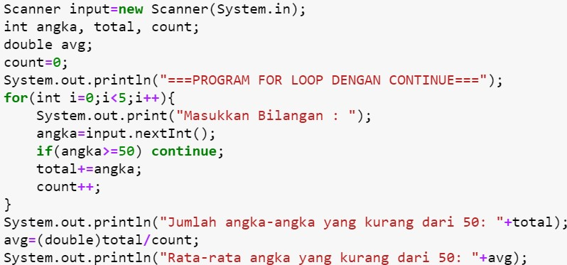

## JOBSHEET 7

## PERULANGAN 1

### Tujuan

Mahasiswa mampu menyelesaikan permasalahan/studi kasus menggunakan sintaks perulangan 1 dan mengimplemantasikannya dalam bahasa pemrogaman java.

### Alat dan Bahan
+ PC/laptop
+ Browser(chrome, firefox, safari)
+ Koneksi internet

### Praktikum

#### Percobaan 1 : Penggunaan for, while dan do-while

#### Waktu percobaan : 40 menit

1. Perhatikan flowchart perulangan for dibawah ini!

    <p align="left">
    
    </p>
    

> Flowchart diatas digunakan untuk menghitung nilai faktorial, selanjutnya kita akan membuat programnya berdasarkan
> flowchart di atas!

2. Tambahkan library Scanner, deklarasi Scanner, dan buat variabel angka untuk menampung data yang diinput melalui keyboard


```Java
import java.util.Scanner;
Scanner input = new Scanner(System.in)
```

3. Buatlah deklarasi dan inisialisasi variabel faktorial sesuai dengan flowchart diatas


```Java
int angka;
int faktorial = 1;
```

4. Tambahkan struktur perulangan untuk menghitung hasil faktorial sebuah nilai yang diinputkan menggunakan for
    
    <p align="left">
    
    </p>


```Java
System.out.println("====Program Menghitung Nilai Faktorial dengan For====");
System.out.print("Masukan Angka atau Bilangan : ");
    angka = input.nextInt();
        for (int i = 1; i <= angka; i++){
            faktorial *= i;
        }
            
System.out.print("Nilai faktorial bilangan tersebut adalah : "+faktorial);
```

    ====Program Menghitung Nilai Faktorial dengan For====
    Masukan Angka atau Bilangan : 4
    Nilai faktorial bilangan tersebut adalah : 24

5. Ubah nilai variabel faktorial seperti semula. Kemudian gunakan struktur perulangan while untuk menghitung hasil faktorial sebuah nilai yang diinputkan
    
    <p align="left">
    
    </p>


```Java
faktorial=1;
System.out.println("====Program Menghitung Nilai Faktorial dengan While====");
System.out.print("Masukan Angka atau Bilangan : ");
    angka = input.nextInt();
    int i=1;
        while(i<=angka){
            faktorial *=i;
            i++;
        }      
System.out.print("Nilai faktorial bilangan tersebut adalah : "+faktorial);
```

    ====Program Menghitung Nilai Faktorial dengan While====
    Masukan Angka atau Bilangan : 6
    Nilai faktorial bilangan tersebut adalah : 720

6. Kembalikan lagi nilai variabel faktorial seperti semula. Gunakan struktur perulangan do-while untuk menghitung hasil faktorial sebuah nilai yang diinputkan
    
    <p align="left">
    
    </p>


```Java
faktorial=1;
System.out.println("====Program Menghitung Nilai Faktorial dengan Do While====");
System.out.print("Masukan Angka atau Bilangan : ");
    angka = input.nextInt();
    int i=1;
        do{
         faktorial *= i;
            i++; 
        }    
    while(i<=angka); 
System.out.print("Nilai faktorial bilangan tersebut adalah : "+faktorial);
```

    ====Program Menghitung Nilai Faktorial dengan Do While====
    Masukan Angka atau Bilangan : 8
    Nilai faktorial bilangan tersebut adalah : 40320

##### Pertanyaan
1. Pada program diatas, apakah kegunaan baris berikut?
<p align="left">
    
    </p>

faktorial=i; berguna untuk memberikan nilai pada variabel "i" melalui shortcut " *= ". Maka variabel i akan dikalikan nilainya oleh shorcut tersebut agar mengeluarkan hasil faktorisasi antara i dengan faktorial.

2. Modifikasi program diatas dibagian struktur pemilihannya sehingga hasilnya menjadi seperti di bawah ini:
<p align="left">
    
    </p>


```Java
System.out.println("====Program Menghitung Nilai Faktorial====");
System.out.print("Masukan Angka atau Bilangan : ");
    angka = input.nextInt();
        for (int i = 1; i <= angka; i++){
            System.out.print(i);
    
        if(i != angka){
             System.out.print("x");
         }
         faktorial *= i;
}
System.out.println("Nilai faktorial bilangan tersebut adalah : "+faktorial);
```

    ====Program Menghitung Nilai Faktorial====
    Masukan Angka atau Bilangan : 3
    1x2x3Nilai faktorial bilangan tersebut adalah : 2903040


#### Percobaan 2 : Keluar dari perulangan menggunakan break

#### Waktu percobaan : 40 menit

1. Buatlah perulangan dengan menggunakan for yang memanfaatkan keyword break
<p align="left">
    
    </p>


```Java
Scanner input = new Scanner(System.in);
int angka, total;
System.out.println("===PROGRAM FOR LOOP DENGAN BREAK===");
for(total=0;true;){
    System.out.print("Masukan Bilangan : ");
    angka = input.nextInt();
    total+=angka;
    if(total>50) break;
}
System.out.println("Jumlah angka-angka yang telah dimasukkan : "+total);
```

    ===PROGRAM FOR LOOP DENGAN BREAK===
    Masukan Bilangan : 10
    Masukan Bilangan : 10
    Masukan Bilangan : 10
    Masukan Bilangan : 10
    Masukan Bilangan : 12
    Jumlah angka-angka yang telah dimasukkan : 52


2. Buat perulangan yang sama dengan struktur perulangan while
<p align="left">
    
    </p>


```Java
Scanner input = new Scanner(System.in);
int angka, total;
System.out.println("===PROGRAM FOR LOOP DENGAN BREAK===");
total=0;
while(true){
    System.out.print("Masukan Bilangan : ");
    angka = input.nextInt();
    total+=angka;
    if(total>50) break;
}
System.out.println("Jumlah angka-angka yang telah dimasukkan : "+total);
```

    ===PROGRAM FOR LOOP DENGAN BREAK===
    Masukan Bilangan : 12
    Masukan Bilangan : 12
    Masukan Bilangan : 12
    Masukan Bilangan : 13
    Masukan Bilangan : 11
    Jumlah angka-angka yang telah dimasukkan : 60


3. Tuliskan perulangan diatas dalam struktur do-while
    <p align="left">
    
    </p>


```Java
Scanner input = new Scanner(System.in);
int angka, total;
System.out.println("===PROGRAM FOR LOOP DENGAN BREAK===");
total=0;
do
{
    System.out.print("Masukan Bilangan : ");
    angka = input.nextInt();
    total+=angka;
    if(total>50) break;
}
while(true);
System.out.println("Jumlah angka-angka yang telah dimasukkan : "+total);
```

    ===PROGRAM FOR LOOP DENGAN BREAK===
    Masukan Bilangan : 10
    Masukan Bilangan : 10
    Masukan Bilangan : 12
    Masukan Bilangan : 13
    Masukan Bilangan : 15
    Jumlah angka-angka yang telah dimasukkan : 60


##### Pertanyaan
1. Jelaskan fungsi kode program yang telah dibuat pada percobaan diatas!

Dari fungsi kode pemrograman diatas adalah melakukan perulangan pada suatu pemrograman dengan perintah yang berbeda-beda seperti for, while. do while.


2. Jelaskan fungsi kode berikut!
    <p align="left">
    
    </p>


for(total=0;true;){ berfungsi untuk mengeluarkan variabel setelah looping yang sudah berjalan dan menghasilkan jawaban atau output "True".

#### Percobaan 3 : Keluar dari step perulangan menggunakan continue

#### Waktu percobaan : 40 menit

1. Buat program looping menggunakan struktur perulangan for seperti di bawah ini: 
<p align="left">
    
    </p>


```Java
Scanner input = new Scanner(System.in);
int angka, total, count;
double avg;
count=0;
System.out.println("===PROGRAM FOR LOOP DENGAN CONTINUE===");
for(int i=0;i<5;i++){
    System.out.print("Masukan Bilangan : ");
    angka = input.nextInt();
    total+=angka;
    if(total>50) break;
    count++;
}
System.out.println("Jumlah angka-angka yang kurang dari 50: "+total);
avg=(double)total/count;
System.out.println("Rata-rata angka yang kurang dari 50: "+avg);
```

    ===PROGRAM FOR LOOP DENGAN CONTINUE===
    Masukan Bilangan : 13
    Masukan Bilangan : 3
    Masukan Bilangan : 1
    Masukan Bilangan : 3
    Masukan Bilangan : 17
    Jumlah angka-angka yang kurang dari 50: 37
    Rata-rata angka yang kurang dari 50: 7.4


5. Jalankan program. Amati apa yang terjadi!

##### Pertanyaan
1. Jelaskan Perbedaan dari percobaan 2 dan percobaan 3

Dalam percobaan 2 dan percobaan 3 memiliki perbedaan. Perbedaan tersebut terletak pada statement yang mereka gunakan. Dalam Percobaan 2 menggunakan statement **"Break"** yang berfungsi untuk menghentikan paksa perulangan dan kode diluar perulangan yang akan dieksekusi.

Sedangkan pada Pecobaan 3 menggunakan statement **"Continue"** yang berfungsi untuk menghentikan perulangan yang sedang terjadi

2. Jelaskan apa fungsi perintah kode program dibawah ini?
<p align="left">
    
    </p>

Perintah diatas berfungsi sebagai pemberi instruksi pada perintah loop dan memberikan batasan pada perintah loop untuk variabel yang akan ditampilkan/dikeluarkan sesuai dari fungsi statement **"Continue"** yang digunakan.


### Tugas

#### Waktu pengerjaan Tugas: 140 menit

1. Buatlah program yang meminta masukan user sebuah bilangan bulat N (N > 0). Program kemudian menampilkan penjumlahan N bilangan genap positif pertama (bilangan genap ≥ 0).
Contoh: 
    •	Jika user memasukkan N = 10, program akan menghitung banyaknya jumlah bilangan positive di dalam range bilangan 1-10   kemudian menampilkan penjumlahan bilangan positive bilangan bilangan diantara 1-10 yaitu : 
        0 + 2 + 4 + 6 + 10 = 30. 
        Setelah itu program akan menampilkan rata-rata dari bilangan positive yang telah dijumlahkan tadi.
    •	Contoh output program dan flowchart
<br/><br/>
  

<br/>


```Java
import java.util.Scanner;
Scanner sc = new Scanner (System.in);
int angka, bilanganGenap, totalGenap;
double average;

System.out.print("Masukkan bilangan/angka : ");
angka = sc.nextInt();

bilanganGenap = angka/ 2;

System.out.printf("\nBanyaknya bilangan genap dari 1 sampai %d adalah %d\n",angka,bilanganGenap);
System.out.print("Angka genap dalam range tersebut adalah");

for(int i=1;i<=angka;i++){
    if(i%2!=0)continue;
    System.out.printf(" %d",i);
    totalGenap += i;
    average=totalGenap / bilanganGenap;
    }

System.out.printf("\nHasil penjumlahan bilangan genap dari 1 sampai %d adalah %d", angka, totalGenap-1);
System.out.printf("Rata-rata bilangan genap dari 1 sampai %d adalah %.1f", angka, average);
```

    Masukkan bilangan/angka : 12
    
    Banyaknya bilangan genap dari 1 sampai 12 adalah 6
    Angka genap dalam range tersebut adalah 2 4 6 8 10 12
    Hasil penjumlahan bilangan genap dari 1 sampai 12 adalah 41Rata-rata bilangan genap dari 1 sampai 12 adalah 7.0


    java.io.PrintStream@48e8f7c6


Dari hasil Pemograman diatas, menunjukkan perulangan diatas menggunakan For yang bertujuan untuk mencari sebuah jawaban dari banyaknya bilangan genap yang muncul dalam urutan angka/bilangan yang tertera diatas sana.

2. Buatlah program untuk menampilkan angka 1 hingga angka masukan pengguna secara berurutan dan melompati angka kelipatan 5. Seperti tampilan di bawah ini
<p align="left">

</p>


```Java
import java.util.Scanner;
Scanner input = new Scanner (System.in);
int y, bilangan;
System.out.print("Masukkan Angka : ");
bilangan = input.nextInt();
    
    for (y = 1; y <= bilangan; y++){
        if(y%5==0)continue;
        System.out.println(y);
    }
```

    Masukkan Angka : 19
    1
    2
    3
    4
    6
    7
    8
    9
    11
    12
    13
    14
    16
    17
    18
    19


Dari hasil Pemograman diatas, menunjukkan perulangan diatas menggunakan perulangan for. Perulangan dengan perintah for berfungsi untuk mengulangi pengulangan yang jumlahnya sudah diketahui melalui operator yang dimasukkan. 

Lalu operator yang digunakan diatas adalah Modulus (%) yang berfungsi untuk membagi variabel tanpa sisa. Maka kelipatan 5 akan dimodulus dan tidak tampil dalam pemrograman diatas.

3. Buatlah sebuah program yang menampilkan deret bilangan fibonacci sebagai berikut. Dimana bilangan yang terletak di sebelah kanan adalah hasil penjumlahan dari 2 bilangan sebelumnya
 <p align="left">
    
    </p>


```Java
import java.util.Scanner;
Scanner input = new Scanner (System.in);
System.out.println("=====Fibonacci Series=====");
int bilangan, y;
int y1=0, y2=1;
bilangan = input.nextInt();


for (y = 0; y < bilangan; y++){
    y = y1 + y2;
    y1 = y2;
    y2 = y;
        System.out.printf("\nSum Of : %d + %d = %d", y1,y2,y);
}
```

    =====Fibonacci Series=====
    10
    
    Sum Of : 1 + 1 = 1
    Sum Of : 1 + 2 = 2
    Sum Of : 2 + 3 = 3
    Sum Of : 3 + 5 = 5
    Sum Of : 5 + 8 = 8
    Sum Of : 8 + 13 = 13

Dari hasil Pemograman diatas, menunjukkan perulangan diatas menggunakan perulangan for. Perulangan dengan perintah for berfungsi untuk mengulangi pengulangan yang jumlahnya sudah diketahui melalui operator yang dimasukkan.
