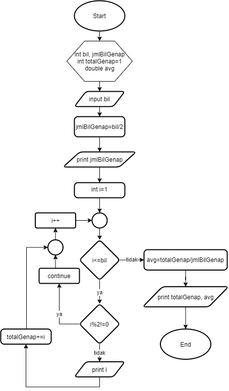
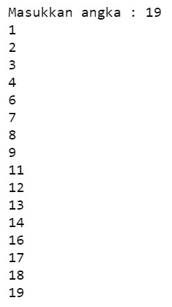

## JOBSHEET 7

## PERULANGAN 1

### Tujuan

Mahasiswa mampu menyelesaikan permasalahan/studi kasus menggunakan sintaks perulangan 1 dan mengimplemantasikannya dalam bahasa pemrogaman java.

### Alat dan Bahan
+ PC/laptop
+ Browser(chrome, firefox, safari)
+ Koneksi internet

### Praktikum

#### Percobaan 1 : Penggunaan for, while dan do-while

#### Waktu percobaan : 40 menit

1. Perhatikan flowchart perulangan for dibawah ini!

    <p align="left">
    
    </p>
    

> Flowchart diatas digunakan untuk menghitung nilai faktorial, selanjutnya kita akan membuat programnya berdasarkan
> flowchart di atas!

2. Tambahkan library Scanner, deklarasi Scanner, dan buat variabel angka untuk menampung data yang diinput melalui keyboard


```Java
import java.util.Scanner;
Scanner input = new Scanner(System.in);
```

3. Buatlah deklarasi dan inisialisasi variabel faktorial sesuai dengan flowchart diatas


```Java
int angka, faktorial=1;
```

4. Tambahkan struktur perulangan untuk menghitung hasil faktorial sebuah nilai yang diinputkan menggunakan for
    
    <p align="left">
    
    </p>


```Java
System.out.println("=====PROGRAM MENGHITUNG NILAI FAKTORIAL DENGAN FOR=====");
System.out.print("Masukkan Bilangan : ");
angka=input.nextInt();
for(int i=1; i<=angka; i++){
    faktorial*=i;
}
System.out.print("Nilai faktorial bilangan tersebut adalah : "+faktorial);
```

    =====PROGRAM MENGHITUNG NILAI FAKTORIAL DENGAN FOR=====
    Masukkan Bilangan : 7
    Nilai faktorial bilangan tersebut adalah : 5040

*Perulangan menggunakan for untuk menentukan nilai faktorial bilangan dengan inisialisasi (variabel i untuk jumlah perulangan), pengecekan kondisi (syarat perulangannya selama variabel i kurang dari sama dengan inputan angka), dan increment (untuk perubahan setiap perulangan) di  awal.*

5. Ubah nilai variabel faktorial seperti semula. Kemudian gunakan struktur perulangan while untuk menghitung hasil faktorial sebuah nilai yang diinputkan
    
    <p align="left">
    
    </p>


```Java
faktorial=1;
System.out.println("=====PROGRAM MENGHITUNG NILAI FAKTORIAL DENGAN WHILE=====");
System.out.print("Masukkan Bilangan : ");
angka=input.nextInt();
int i=1;
while(i<=angka){
    faktorial*=i;
    i++;
}
System.out.print("Nilai faktorial bilangan tersebut adalah : "+faktorial);
```

    =====PROGRAM MENGHITUNG NILAI FAKTORIAL DENGAN WHILE=====
    Masukkan Bilangan : 7
    Nilai faktorial bilangan tersebut adalah : 5040

*Perulangan menggunakan while untuk menentukan nilai faktorial bilangan dengan pengecekan kondisi syarat perulangannya, baru dilanjutkan oleh statement. Sebelum itu inisialisasinya di luar while.*

6. Kembalikan lagi nilai variabel faktorial seperti semula. Gunakan struktur perulangan do-while untuk menghitung hasil faktorial sebuah nilai yang diinputkan
    
    <p align="left">
    
    </p>


```Java
faktorial=1;
System.out.println("=====PROGRAM MENGHITUNG NILAI FAKTORIAL DENGAN DO-WHILE=====");
System.out.print("Masukkan Bilangan : ");
angka=input.nextInt();
int i=1;
do{
    faktorial*=i;
    i++;    
}
while(i<=angka);
System.out.print("Nilai faktorial bilangan tersebut adalah : "+faktorial);
```

    =====PROGRAM MENGHITUNG NILAI FAKTORIAL DENGAN DO-WHILE=====
    Masukkan Bilangan : 7
    Nilai faktorial bilangan tersebut adalah : 5040

*Perulangan menggunakan do-while untuk menentukan nilai faktorial bilangan ini dengan statement dulu awal baru pengecekan kondisi dan increment.*

##### Pertanyaan
1. Pada program diatas, apakah kegunaan baris berikut?
<p align="left">
    
    </p>

*Agar nilai faktorial disini dikalikan setiap perulangan. Jadi, nilainya terus bertambah sampai nanti menemukan hasil faktorial dari perulangan terakhir.*

2. Modifikasi program diatas dibagian struktur pemilihannya sehingga hasilnya menjadi seperti di bawah ini:
<p align="left">
    
    </p>


```Java
import java.util.Scanner;
Scanner input=new Scanner(System.in);

System.out.println("=====PROGRAM MENGHITUNG NILAI FAKTORIAL=====");
System.out.print("Masukkan Bilangan : ");
int angka=input.nextInt();
int faktorial=1;

System.out.print(angka+" Faktorial = ");

for(int i=1; i<=angka; i++){
    faktorial*=i;
    
    if(i<angka){
        System.out.print(i+" x ");
    } else 
        System.out.print(i);
}

System.out.print(" = "+faktorial);
```

    =====PROGRAM MENGHITUNG NILAI FAKTORIAL=====
    Masukkan Bilangan : 7
    7 Faktorial = 1 x 2 x 3 x 4 x 5 x 6 x 7 = 5040

*Disini dimodifikasi agar outputnya ikut menampilkan perkalian dari faktorialnya. Jadi, perulangan variabel i akan dicetak juga agar tampil sebagai output sesuai dari angka yang diinput.*

#### Percobaan 2 : Keluar dari perulangan menggunakan break

#### Waktu percobaan : 40 menit

1. Buatlah perulangan dengan menggunakan for yang memanfaatkan keyword break
<p align="left">
    
    </p>


```Java
Scanner input=new Scanner(System.in);
int angka,total;
System.out.println("===PROGRAM FOR LOOP DENGAN BREAK===");
for(total=0;true;){
    System.out.print("Masukkan Bilangan : ");
    angka=input.nextInt();
    total+=angka;
    if(total>50) break;
}
System.out.println("Jumlah angka-angka yang telah dimasukkan : "+total);
```

    ===PROGRAM FOR LOOP DENGAN BREAK===
    Masukkan Bilangan : 49
    Masukkan Bilangan : 1
    Masukkan Bilangan : 2
    Jumlah angka-angka yang telah dimasukkan : 52


*Perulangan menggunakan for dengan inisialisasi awal, penentuan kondisi benar, dan tidak ada increment. Untuk berhenti dari perulangan ini menggunakan kondisi jika total dari inputan angka sudah berjumlah lebih dari 50 maka akan berhenti paksa karena ada statement break.*

2. Buat perulangan yang sama dengan struktur perulangan while
<p align="left">
    
    </p>


```Java
int angka,total;
System.out.println("===PROGRAM WHILE LOOP DENGAN BREAK===");
total=0;
while(true){
    System.out.print("Masukkan Bilangan : ");
    angka=input.nextInt();
    total+=angka;
    if(total>50) break;
}
System.out.println("Jumlah angka-angka yang telah dimasukkan : "+total);
```

    ===PROGRAM WHILE LOOP DENGAN BREAK===
    Masukkan Bilangan : 49
    Masukkan Bilangan : 1
    Masukkan Bilangan : 2
    Jumlah angka-angka yang telah dimasukkan : 52


*Perulangan menggunakan while dengan penentuan kondisi benar. Untuk berhenti dari perulangan ini menggunakan kondisi jika total dari inputan angka sudah berjumlah lebih dari 50 maka akan berhenti paksa karena ada statement break.*

3. Tuliskan perulangan diatas dalam struktur do-while
    <p align="left">
    
    </p>


```Java
int angka,total;
System.out.println("===PROGRAM DO-WHILE LOOP DENGAN BREAK===");
total=0;
do
{
    System.out.print("Masukkan Bilangan : ");
    angka=input.nextInt();
    total+=angka;
    if(total>50) break;
}
while(true);
System.out.println("Jumlah angka-angka yang telah dimasukkan : "+total);
```

    ===PROGRAM DO-WHILE LOOP DENGAN BREAK===
    Masukkan Bilangan : 49
    Masukkan Bilangan : 1
    Masukkan Bilangan : 2
    Jumlah angka-angka yang telah dimasukkan : 52


*Perulangan menggunakan do-while dengan statement awal. Untuk berhenti dari perulangan ini menggunakan kondisi jika total dari inputan angka sudah berjumlah lebih dari 50 maka akan berhenti paksa karena ada statement break.*

##### Pertanyaan
1. Jelaskan fungsi kode program yang telah dibuat pada percobaan diatas!

*Jadi percobaan ini meminta inputan berupa angka (int) secara berulang lalu untuk berhentinya meminta inputan tersebut dibuat kondisi jika jumlah nilai totalnya dari nilai inputan tadi sudah 50 lebih maka akan berhenti dengan statement break.*

2. Jelaskan fungsi kode berikut!
    <p align="left">
    
    </p>


*Sintaks perulangan for dengan yang pertama inisialisasi awal variabel total bernilai 0 itu lalu kondisinya itu bernilai benar.*

#### Percobaan 3 : Keluar dari step perulangan menggunakan continue

#### Waktu percobaan : 40 menit

1. Buat program looping menggunakan struktur perulangan for seperti di bawah ini: 
<p align="left">
    
    </p>


```Java
Scanner input=new Scanner(System.in);
int angka, total, count;
double avg;
count=0;
System.out.println("===PROGRAM FOR LOOP DENGAN CONTINUE===");

for(int i=0;i<5;i++){
    System.out.print("Masukkan Bilangan : ");
    angka=input.nextInt();
    if(angka>=50) continue;
    total+=angka;
    count++;
}

System.out.println("Jumlah angka-angka yang kurang dari 50: "+total);
avg=(double)total/count;
System.out.println("Rata-rata angka yang kurang dari 50: "+avg);
```

    ===PROGRAM FOR LOOP DENGAN CONTINUE===
    Masukkan Bilangan : 44
    Masukkan Bilangan : 53
    Masukkan Bilangan : 75
    Masukkan Bilangan : 23
    Masukkan Bilangan : 13
    Jumlah angka-angka yang kurang dari 50: 80
    Rata-rata angka yang kurang dari 50: 26.666666666666668


5. Jalankan program. Amati apa yang terjadi!

*Jadi, program ini meminta inputan angka yang diatur sampai lima kali lalu dibuat kondisi jika angka yang diinputkan itu lebih dari sama dengan maka akan diabaikan dan tidak ditambahkan pada nilai total nanti karena adanya statement continue.*

##### Pertanyaan
1. Jelaskan Perbedaan dari percobaan 2 dan percobaan 3

*Perbedaan yang jelas adalah percobaan 2 menggunakan statement break sedangkan percobaan 3 menggunakan statement continue.
Jadi, fungsi statement break di percobaan 2 di atas, jika kondisi jumlah nilai totalnya dari nilai inputan tadi sudah 50 lebih maka perulangan akan berhenti. Lalu fungsi statement continue di percobaan 3 dibuat kondisi jika angka yang diinputkan itu lebih dari sama dengan maka akan diabaikan.*

2. Jelaskan apa fungsi perintah kode program dibawah ini?
<p align="left">
    
    </p>

*Jika nilai angka yang dimasukkan lebih dari sama dengan 50 maka akan diabaikan karena ada statement continue. Lalu nilai total akan ditambahi dengan nilai angka. Untuk count++ sendiri fungsinya adalah menghitung jumlah inputan dari user.*

### Tugas

#### Waktu pengerjaan Tugas: 140 menit

1. Buatlah program yang meminta masukan user sebuah bilangan bulat N (N > 0). Program kemudian menampilkan penjumlahan N bilangan genap positif pertama (bilangan genap ≥ 0).
Contoh: 
    •	Jika user memasukkan N = 10, program akan menghitung banyaknya jumlah bilangan positive di dalam range bilangan 1-10   kemudian menampilkan penjumlahan bilangan positive bilangan bilangan diantara 1-10 yaitu : 
        0 + 2 + 4 + 6 + 10 = 30. 
        Setelah itu program akan menampilkan rata-rata dari bilangan positive yang telah dijumlahkan tadi.
    •	Contoh output program dan flowchart
<br/><br/>
  

<br/>


```Java
import java.util.Scanner;
Scanner input=new Scanner(System.in);

int bil, jmlBilGenap, totalGenap;
double avg;

System.out.print("Masukkan angka : ");
bil=input.nextInt();

if(bil<=0){
    System.out.println("Angka yang kamu input bukan bilangan positif");
}
    else{
        
jmlBilGenap=bil/2;

System.out.println("Banyaknya bilangan genap dari 1 sampai "+bil+" adalah "+jmlBilGenap);
System.out.print("Angka genap dalam range tersebut adalah");

for(int i=1;i<=bil;i++) {
    if(i%2!=0) continue;
    System.out.print(", "+i);
    totalGenap+=i;
    avg=totalGenap/jmlBilGenap;
}
System.out.println("\nHasil penjumlahan bilangan genap dari 1 sampai "+bil+" adalah "+totalGenap);
System.out.println("Rata-rata bilangan genap dari 1 sampai "+bil+" adalah "+avg);
}
```

    Masukkan angka : 21
    Banyaknya bilangan genap dari 1 sampai 21 adalah 10
    Angka genap dalam range tersebut adalah, 2, 4, 6, 8, 10, 12, 14, 16, 18, 20
    Hasil penjumlahan bilangan genap dari 1 sampai 21 adalah 110
    Rata-rata bilangan genap dari 1 sampai 21 adalah 11.0


*Program ini meminta masukan angka, kemudian menampilkan banyaknya bilangan genap dalam range bilangan yang diinputkan dengan perhitungan angka inputan tadi dibagi dua. Lalu masuk ke perulangan untuk menampilkan angka genap berapa saja yang termasuk dalam range itu, dengan ditambahi kondisi yang modulus 2 dari angkanya bukan 0 (ganjil) maka tidak ditampilkan karena ada statement continue. Dan terakhir akan muncul output juga hasil jumlah dari bilangan genap serta rata-ratanya.*

2. Buatlah program untuk menampilkan angka 1 hingga angka masukan pengguna secara berurutan dan melompati angka kelipatan 5. Seperti tampilan di bawah ini
<p align="left">

</p>


```Java
import java.util.Scanner;
Scanner input=new Scanner(System.in);

System.out.print("Masukkan angka : ");
int a=input.nextInt();

for(int i=1;i<=a;i++) {
    if(i%5==0) continue;
    System.out.printf("%d\n",i);
}
```

    Masukkan angka : 21
    1
    2
    3
    4
    6
    7
    8
    9
    11
    12
    13
    14
    16
    17
    18
    19
    21


*Kode program di atas untuk menampilkan angka 1 hingga angka inputan berupa int secara berurutan tetapi melompati angka kelipatan 5 dengan if jika angka perulangan modulus 5 nya menghasilkan 0 maka angka tersebut diabaikan dan tidak ditampilkan karena ada statement continue.*

3. Buatlah sebuah program yang menampilkan deret bilangan fibonacci sebagai berikut. Dimana bilangan yang terletak di sebelah kanan adalah hasil penjumlahan dari 2 bilangan sebelumnya
 <p align="left">
    
    </p>


```Java
import java.util.Scanner;
Scanner input = new Scanner(System.in);
int f, x=0, y=1, z=1;

System.out.print("Masukkan jumlah deret bilangan Fibonacci : ");
f=input.nextInt();
    
for (int i=0;i<f;i++){
    System.out.println("Sum of: "+x+" + "+y+" = "+z);
     x=y;
     y=z;
     z=x+y;
}
```

    Masukkan jumlah deret bilangan Fibonacci : 6
    Sum of: 0 + 1 = 1
    Sum of: 1 + 1 = 2
    Sum of: 1 + 2 = 3
    Sum of: 2 + 3 = 5
    Sum of: 3 + 5 = 8
    Sum of: 5 + 8 = 13


*Program ini di meminta inputan berupa jumlah untuk fibonacci. Lalu dibuat perulangan sesuai inputan tersebut, dengan variabel x adalah angka pertama, variabel y untuk angka kedua, dan variabel z itu hasilnya. Karena fibonacci merupakan bilangan yang terletak di sebelah kanan itu hasil penjumlahan dari 2 bilangan sebelumnya, maka di dalam perulangan selanjutnya ditentukan lagi agar angka kedua menjadi angka pertama dan hasil dari sebelumnya menjadi angka kedua untuk dijumlahkan dalam perulangan seterusnya.*
