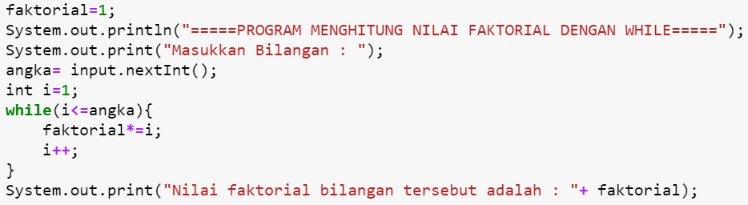

## JOBSHEET 7

## PERULANGAN 1

### Tujuan

Mahasiswa mampu menyelesaikan permasalahan/studi kasus menggunakan sintaks perulangan 1 dan mengimplemantasikannya dalam bahasa pemrogaman java.

### Alat dan Bahan
+ PC/laptop
+ Browser(chrome, firefox, safari)
+ Koneksi internet

### Praktikum

#### Percobaan 1 : Penggunaan for, while dan do-while

#### Waktu percobaan : 40 menit

1. Perhatikan flowchart perulangan for dibawah ini!

    <p align="left">
    
    </p>
    

> Flowchart diatas digunakan untuk menghitung nilai faktorial, selanjutnya kita akan membuat programnya berdasarkan
> flowchart di atas!

2. Tambahkan library Scanner, deklarasi Scanner, dan buat variabel angka untuk menampung data yang diinput melalui keyboard


```Java
// Ketik kode program di bawah sini
import java.util.Scanner;
Scanner input = new Scanner(System.in);
```


```Java
3. Buatlah deklarasi dan inisialisasi variabel faktorial sesuai dengan flowchart diatas
```


```Java
// Ketik kode program di bawah sini
int angka, faktorial = 1;
```

4. Tambahkan struktur perulangan untuk menghitung hasil faktorial sebuah nilai yang diinputkan menggunakan for
    
    <p align="left">
    
    </p>


```Java
// Ketik kode program di atas di bawah sini
System.out.println("=====PROGRAM MENGHITUNG NILAI FAKTORIAL DENGAN FOR=====");
System.out.print("Masukkan Bilangan: ");
angka = input.nextInt();
for(int i=1; i<=angka; i++)
    faktorial*=i;
System.out.print("Nilai Faktorial bilangan tersebut adalah: "+ faktorial);
```

program ini digunakan untuk menghitung faktorial dari bilangan yang diinputkan user. user memasukan bilangan yang akan tersimpan pada variabel angka lalu akan melewati proses looping disini yang digunakan adalah perulangan FOR.

5. Ubah nilai variabel faktorial seperti semula. Kemudian gunakan struktur perulangan while untuk menghitung hasil faktorial sebuah nilai yang diinputkan
    
    <p align="left">
    
    </p>


```Java
// Ketik kode program di atas di bawah sini
faktorial = 1;
System.out.println("=====PROGRAM MENGHITUNG NILAI FAKTORIAL DENGAN WHILE=====");
System.out.print("Masukkan Bilangan: ");
angka = input.nextInt();
int i = 1;
while(i<=angka){
    faktorial*=i;
    i++;
}
System.out.print("Nilai Faktorial bilangan tersebut adalah: "+ faktorial);
```

program ini hampir sama dengan yang sebelumnya hanya disini menggunakan looping while perbedaannya adalah jika perulangan while sifatnya tidak pasti atau tidak terbatas. kode akan dilakukan terus menerus jika suatu kondisi terpenuhi.

6. Kembalikan lagi nilai variabel faktorial seperti semula. Gunakan struktur perulangan do-while untuk menghitung hasil faktorial sebuah nilai yang diinputkan
    
    <p align="left">
    
    </p>


```Java
// Ketik kode program di atas di bawah sini
faktorial = 1;
System.out.println("=====PROGRAM MENGHITUNG NILAI FAKTORIAL DENGAN DO-WHILE=====");
System.out.print("Masukkan bilangan : ");
angka = input.nextInt();
int i = 1;
do{
    faktorial*=i;
    i++;
}
while(i<=angka);
System.out.print("Nilai faktorial bilangan tersebut adalah: "+ faktorial);
```

program ini menggunakan perulangan DO WHILE perbedaannya adalah pemeriksaan kondisi pada perulangan ini dilakukan pada akhir perulangan

##### Pertanyaan
1. Pada program diatas, apakah kegunaan baris berikut?
<p align="left">
    
    </p>


```Java
// Ketik jawaban disini
menyimpan hasil dari perkalian faktorial
```

2. Modifikasi program diatas dibagian struktur pemilihannya sehingga hasilnya menjadi seperti di bawah ini:
<p align="left">
    
    </p>


```Java
// Ketik kode program di atas di bawah sini
import java.util.Scanner;
Scanner input = new Scanner(System.in);
int angka, faktorial = 1;
System.out.println("=====PROGRAM MENGHITUNG NILAI FAKTORIAL DENGAN FOR=====");
System.out.print("Masukkan Bilangan: ");
angka = input.nextInt();
System.out.print(angka+" Faktorial = ");
for(int i=1; i<=angka; i++){
    faktorial*=i;
    System.out.print(i);
    if(i!=angka){
        System.out.print("x");
    }
}
System.out.println(" = " + faktorial);
```

    =====PROGRAM MENGHITUNG NILAI FAKTORIAL DENGAN FOR=====
    Masukkan Bilangan: 5
    5 Faktorial = 1x2x3x4x5 = 120


#### Percobaan 2 : Keluar dari perulangan menggunakan break

#### Waktu percobaan : 40 menit

1. Buatlah perulangan dengan menggunakan for yang memanfaatkan keyword break
<p align="left">
    
    </p>


```Java
// Ketik kode program di atas di bawah sini
Scanner input = new Scanner(System.in);
int angka, total;
System.out.println("===PROGRAM FOR LOOP DENGAN BREAK===");
for(total = 0; true;){
    System.out.print("Masukkan Bilangan: ");
    angka = input.nextInt();
    total+=angka;
    if(total>50) break;
}
System.out.println("Jumlah angka - angka yang telah dimasukan: "+total);
```

    ===PROGRAM FOR LOOP DENGAN BREAK===
    Masukkan Bilangan: 

perulangan diatas menggunakan for dan juga menggunakan perintah BREAK yang digunakan untuk memaksa berhenti. diprogram ini di ketikkan jika total sudah melebihi 50 maka perulangan akan berhenti

2. Buat perulangan yang sama dengan struktur perulangan while
<p align="left">
    
    </p>


```Java
// Ketik kode program di atas di bawah sini
Sacnner input = new Scanner(System.in);
int angka, total;
System.out.println("===PROGRAM WHILE LOOP DENGAN BREAK===");
total=0;
while(true){
    System.out.print("Masukkan Bilangan: ");
    angka = input.nextInt();
    total+=angka;
    if(total>50) break;
}
System.out.println("Jumlah angka - angka telah dimasukkan : "+total);
```


```Java

```

3. Tuliskan perulangan diatas dalam struktur do-while
    <p align="left">
    
    </p>


```Java
// Ketik kode program di atas di bawah sini
int angka, total;
System.out.println("===PROGRAM DO-WHILE LOOP DENGAN BREAK===");
total=0;
do{
    System.out.print("Masukkan Bilangan: ");
    angka = inut.nextInt();
    total+=angka;
    if(total>50) break;
}
while(true);
System.out.println("Jumlah angka-angka yang telah dimasukkan: "+total);
```

##### Pertanyaan
1. Jelaskan fungsi kode program yang telah dibuat pada percobaan diatas!

// Ketik jawaban disini
program diatas digunakan untuk menghitung total jika total belum mencapai target yaitu 50 maka program akan terus mengulangi sampai hasil akhir atau total mecapai 50 dan akan berhenti secara paksa karena ada perintah break.

2. Jelaskan fungsi kode berikut!
    <p align="left">
    
    </p>


```Java
// Ketik jawaban disini
digunakan untuk mendeklarasikan variabel total.
```

#### Percobaan 3 : Keluar dari step perulangan menggunakan continue

#### Waktu percobaan : 40 menit

1. Buat program looping menggunakan struktur perulangan for seperti di bawah ini: 
<p align="left">
    
    </p>


```Java
// Ketik kode program di atas di bawah sini
Scanner input = new Scanner(System.in);
int angka, total, count;
double avg;
count=0;
System.out.println("===PROGRAM FOR LOOP DENGAN CONTINUE===");
for(int i = 0; i<5; i++){
    System.out.print("Masukkan Bilangan: ");
    angka=input.nextInt();
    if(angka>=50) continue;
    total+=angka;
    count++;
}
System.out.println("Jumlah angka-angka yang kurang dari 50: "+ total);
avg=(double)total/count;
System.out.println("Rata-rata angka yang kurang dari 50: "+avg);
```

    ===PROGRAM FOR LOOP DENGAN CONTINUE===
    Masukkan Bilangan: 10
    Masukkan Bilangan: 20
    Masukkan Bilangan: 40
    Masukkan Bilangan: 10
    Masukkan Bilangan: 1
    Jumlah angka-angka yang kurang dari 50: 81
    Rata-rata angka yang kurang dari 50: 16.2


program ini digunakan untuk menghitung angka yang kurang dari 50 dan rata rata angka yang kurang dari 50 dari inputan user. inputan dari user akan disimpan pada variabel angka.


```Java
5. Jalankan program. Amati apa yang terjadi!
```

##### Pertanyaan
1. Jelaskan Perbedaan dari percobaan 2 dan percobaan 3

// Ketik jawaban disini
percobaan 2 menggunakan BREAK yang bertujuan untuk menghentikan paksa sebuah perulangan sebelum waktunya. jika pada percobaan 3 menggunakan pernyataan CONTINUE yang digunakan untuk mengakhiri proses iterasi yang sedang berjalan dan melewati sisa pernyataan yang masih ada didalam perulangan untuk melanjutkan proses iterasi ke tahap selanjutnya.

2. Jelaskan apa fungsi perintah kode program dibawah ini?
<p align="left">
    
    </p>

// Ketik jawaban disini
jika angka lebih dari sama dengan 50 maka akan dilewati. lalu jika kurang akan dieksekusi oleh program total+=angka dan untuk count digunakan untuk menyimpan hasil dari total+=angka.

### Tugas

#### Waktu pengerjaan Tugas: 140 menit

1. Buatlah program yang meminta masukan user sebuah bilangan bulat N (N > 0). Program kemudian menampilkan penjumlahan N bilangan genap positif pertama (bilangan genap ≥ 0).
Contoh: 
    •	Jika user memasukkan N = 10, program akan menghitung banyaknya jumlah bilangan positive di dalam range bilangan 1-10   kemudian menampilkan penjumlahan bilangan positive bilangan bilangan diantara 1-10 yaitu : 
        0 + 2 + 4 + 6 + 10 = 30. 
        Setelah itu program akan menampilkan rata-rata dari bilangan positive yang telah dijumlahkan tadi.
    •	Contoh output program dan flowchart
<br/><br/>
  

<br/>


```Java
// Ketik kode program disini
import java.util.Scanner;
Scanner input = new Scanner(System.in);
int bil, jmlBilGenap, totalGenap=0;
double avg;
System.out.print("Masukkan Bilangan: ");
bil = input.nextInt();
jmlBilGenap = bil/2;
System.out.println("Banyak Bilangan Genap: "+jmlBilGenap);
System.out.print("Bilangan Genap: ");


for(int i = 1; i<=bil;){
    if(i%2==0){
        System.out.print(i);
        if(i!=bil){
            System.out.print(",");
        }
        totalGenap+=i;
        i++;
    }else{
        i++;
        continue;
    }
}
avg = totalGenap/jmlBilGenap;
System.out.printf("\nTotal Genap %d dan rata - rata %f",totalGenap,avg);
```

    Masukkan Bilangan: 10
    Banyak Bilangan Genap: 5
    Bilangan Genap: 2,4,6,8,10
    Total Genap 30 dan rata - rata 6.000000


    java.io.PrintStream@30155e29


2. Buatlah program untuk menampilkan angka 1 hingga angka masukan pengguna secara berurutan dan melompati angka kelipatan 5. Seperti tampilan di bawah ini
<p align="left">

</p>


```Java
// Ketik kode program disini
import java.util.Scanner;
Scanner input = new Scanner(System.in);
int angka;
System.out.print("Masukkan angka: ");
angka = input.nextInt();

for(int i = 1; i<=angka; i++){
    if(i%5==0){
        continue;
    }
    System.out.println(i);
};
```

    Masukkan angka: 19
    1
    2
    3
    4
    6
    7
    8
    9
    11
    12
    13
    14
    16
    17
    18
    19


3. Buatlah sebuah program yang menampilkan deret bilangan fibonacci sebagai berikut. Dimana bilangan yang terletak di sebelah kanan adalah hasil penjumlahan dari 2 bilangan sebelumnya
 <p align="left">
    
    </p>


```Java
// Ketik kode program disini
import java.util.Scanner;
Scanner input = new Scanner(System.in);
int angka, bil1=0, bil2=1, sum=0;
System.out.print("Masukkan angka: ");
angka = input.nextInt();

for(int i = 0; i<angka; i++){
    sum = bil1+bil2;
    System.out.printf("Sum of: %d + %d = %d\n", bil1, bil2, sum);
    bil1 = bil2;
    bil2 = sum;
};
```

    Masukkan angka: 10
    Sum of: 0 + 1 = 1
    Sum of: 1 + 1 = 2
    Sum of: 1 + 2 = 3
    Sum of: 2 + 3 = 5
    Sum of: 3 + 5 = 8
    Sum of: 5 + 8 = 13
    Sum of: 8 + 13 = 21
    Sum of: 13 + 21 = 34
    Sum of: 21 + 34 = 55
    Sum of: 34 + 55 = 89


```Java

```
