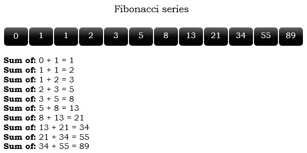

## JOBSHEET 7

## PERULANGAN 1

### Tujuan

Mahasiswa mampu menyelesaikan permasalahan/studi kasus menggunakan sintaks perulangan 1 dan mengimplemantasikannya dalam bahasa pemrogaman java.

### Alat dan Bahan
+ PC/laptop
+ Browser(chrome, firefox, safari)
+ Koneksi internet

### Praktikum

#### Percobaan 1 : Penggunaan for, while dan do-while

#### Waktu percobaan : 40 menit

1. Perhatikan flowchart perulangan for dibawah ini!

    <p align="left">
    
    </p>
    

> Flowchart diatas digunakan untuk menghitung nilai faktorial, selanjutnya kita akan membuat programnya berdasarkan
> flowchart di atas!

2. Tambahkan library Scanner, deklarasi Scanner, dan buat variabel angka untuk menampung data yang diinput melalui keyboard


```Java
// Ketik kode program di bawah sini
import java.util.Scanner;
Scanner input = new Scanner (System.in);

int angka, faktorial;
```


```Java
3. Buatlah deklarasi dan inisialisasi variabel faktorial sesuai dengan flowchart diatas
```


```Java
// Ketik kode program di bawah sini
int angka,faktorial = 1
```

4. Tambahkan struktur perulangan untuk menghitung hasil faktorial sebuah nilai yang diinputkan menggunakan for
    
    <p align="left">
    
    </p>


```Java
// Ketik kode program di atas di bawah sini
System.out.println("=====Program menghitung nilai faktorial dengan for=====");
System.out.print("Masukan bilangan : ");
angka= input.nextInt();
for (int i=1; i<=angka; i++)
    faktorial*=i;
System.out.print("Nilai faktorial bilangan tersebut adalah :"+ faktorial);
```

    =====Program menghitung nilai faktorial dengan for=====
    Masukan bilangan : 5
    Nilai faktorial bilangan tersebut adalah :120

5. Ubah nilai variabel faktorial seperti semula. Kemudian gunakan struktur perulangan while untuk menghitung hasil faktorial sebuah nilai yang diinputkan
    
    <p align="left">
    
    </p>


```Java
// Ketik kode program di atas di bawah sini
System.out.println("=====Program menghitung nilai faktorial dengan for=====");
System.out.print("Masukan bilangan : ");
angka= input.nextInt();
int i=1;
while (i<=angka){
    faktorial*=i;
     i++;
}
System.out.print("Nilai faktorial bilangan tersebut adalah :"+ faktorial);
```

    =====Program menghitung nilai faktorial dengan for=====
    Masukan bilangan : 5
    Nilai faktorial bilangan tersebut adalah :14400

6. Kembalikan lagi nilai variabel faktorial seperti semula. Gunakan struktur perulangan do-while untuk menghitung hasil faktorial sebuah nilai yang diinputkan
    
    <p align="left">
    
    </p>


```Java
// Ketik kode program di atas di bawah sini
System.out.println("=====Program menghitung nilai faktorial dengan for=====");
System.out.print("Masukan bilangan : ");
angka= input.nextInt();
int i=1;
do{
     faktorial*=i;
     i++;
}
while (i<=angka);
System.out.print("Nilai faktorial bilangan tersebut adalah :"+ faktorial);

```

    =====Program menghitung nilai faktorial dengan for=====
    Masukan bilangan : 5
    Nilai faktorial bilangan tersebut adalah :1728000

##### Pertanyaan
1. Pada program diatas, apakah kegunaan baris berikut?
<p align="left">
    
    </p>

// Ketik jawaban disini


mengkalikan faktorial dengan int i


2. Modifikasi program diatas dibagian struktur pemilihannya sehingga hasilnya menjadi seperti di bawah ini:
<p align="left">
    
    </p>


```Java
faktorial = 1;
System.out.println("=====PROGRAM MENGHITUNG NILAI FAKTORIAL DENGAN FOR=====");
System.out.print("Masukkan Bilangan : ");
angka = input.nextInt();
System.out.print(angka + "Faktorial = ");
for(int i = 1; i <= angka; i++) {
    System.out.print(i);
    
    if(i != angka){
        System.out.print("x");
    }
    
    faktorial *= i;
}
System.out.print("= " + faktorial);
```

    =====PROGRAM MENGHITUNG NILAI FAKTORIAL DENGAN FOR=====
    Masukkan Bilangan : 120
    120Faktorial = 1x2x3x4x5x6x7x8x9x10x11x12x13x14x15x16x17x18x19x20x21x22x23x24x25x26x27x28x29x30x31x32x33x34x35x36x37x38x39x40x41x42x43x44x45x46x47x48x49x50x51x52x53x54x55x56x57x58x59x60x61x62x63x64x65x66x67x68x69x70x71x72x73x74x75x76x77x78x79x80x81x82x83x84x85x86x87x88x89x90x91x92x93x94x95x96x97x98x99x100x101x102x103x104x105x106x107x108x109x110x111x112x113x114x115x116x117x118x119x120= 0

# Percobaan 2 : Keluar dari perulangan menggunakan break

#### Waktu percobaan : 40 menit

1. Buatlah perulangan dengan menggunakan for yang memanfaatkan keyword break
<p align="left">
    
    </p>


```Java
// Ketik kode program di atas di bawah sini
Scanner input=new Scanner (System.in);
int angka,total;
System.out.println("===PROGRAM FOR LOOP DENGAN BREAK===");
for(total=0;true;){
    System.out.print("Masukkan bilangan : ");
    angka=input.nextInt();
    total+=angka;
    if(total>50)break;
}
System.out.println("Jumblah angka-angka yang telah di masukan : "+total);
```

    ===PROGRAM FOR LOOP DENGAN BREAK===
    Masukkan bilangan : 5
    Masukkan bilangan : 10
    Masukkan bilangan : 0
    Masukkan bilangan : 1
    Masukkan bilangan : 0
    Masukkan bilangan : 50
    Jumblah angka-angka yang telah di masukan : 66


2. Buat perulangan yang sama dengan struktur perulangan while
<p align="left">
    
    </p>


```Java
// Ketik kode program di atas di bawah sini
Scanner input=new Scanner (System.in);
int angka,total;
System.out.println("===PROGRAM FOR LOOP DENGAN BREAK===");
total=0;
while(true){
    System.out.print("Masukkan bilangan : ");
    angka=input.nextInt();
    total+=angka;
    if(total>50)break;
}
System.out.println("Jumblah angka-angka yang telah di masukan : "+total);
```

    ===PROGRAM FOR LOOP DENGAN BREAK===
    Masukkan bilangan : 5
    Masukkan bilangan : 12
    Masukkan bilangan : 50
    Jumblah angka-angka yang telah di masukan : 67


3. Tuliskan perulangan diatas dalam struktur do-while
    <p align="left">
    
    </p>


```Java
// Ketik kode program di atas di bawah sini
Scanner input=new Scanner (System.in);
int angka,total;
System.out.println("===PROGRAM FOR LOOP DENGAN BREAK===");
total=0;
do
{
    System.out.print("Masukkan bilangan : ");
    angka=input.nextInt();
    total+=angka;
    if(total>50)break;
}
while (true);
System.out.println("Jumblah angka-angka yang telah di masukan : "+total);
```

    ===PROGRAM FOR LOOP DENGAN BREAK===
    Masukkan bilangan : 5
    Masukkan bilangan : 12
    Masukkan bilangan : 500
    Jumblah angka-angka yang telah di masukan : 517


##### Pertanyaan
1. Jelaskan fungsi kode program yang telah dibuat pada percobaan diatas!

Kode program diatas meminta user untuk input bilangan bulat secara terus menerus sampai total keseluruhan bilangan yang dimasukan berjumlah lebih dari 50

2. Jelaskan fungsi kode berikut!
    <p align="left">
    
    </p>


```Java
// Ketik jawaban disini
fungsi dari kode diatas yaitu membuat sebuah perulangan for dengan inisialisasi total sehingga untuk keluar dari looping ini harus dilakukan dengan perintah break
```


    |   fungsi dari kode diatas yaitu membuat sebuah perulangan for dengan inisialisasi total sehingga untuk keluar dari looping ini harus dilakukan dengan perintah break

    ';' expected

    


#### Percobaan 3 : Keluar dari step perulangan menggunakan continue

#### Waktu percobaan : 40 menit

1. Buat program looping menggunakan struktur perulangan for seperti di bawah ini: 
<p align="left">
    
    </p>


```Java
// Ketik kode program di atas di bawah sini
Scanner input=new Scanner (System.in);
int angka,total,count;
double avg;
count=0;
System.out.println("===PROGRAM FOR LOOP DENGAN CONTINUE===");
total=0;
for (int i=0;i<5;i++){
     System.out.print("Masukkan bilangan : ");
    angka=input.nextInt();
    if(angka>=50) continue;
    total+=angka;
    count++;
}
    System.out.println("Jumblah angka-angka yang kurang dari 50:" +total);
    avg=(double)total/count;
    System.out.println("Rata-rata angka yang kurang dari 50: " +avg);
```

    ===PROGRAM FOR LOOP DENGAN CONTINUE===
    Masukkan bilangan : 10
    Masukkan bilangan : 2
    Masukkan bilangan : 21
    Masukkan bilangan : 
    50
    Masukkan bilangan : 50
    Jumblah angka-angka yang kurang dari 50:33
    Rata-rata angka yang kurang dari 50: 11.0


# 5. Jalankan program. Amati apa yang terjadi!

##### Pertanyaan
1. Jelaskan Perbedaan dari percobaan 2 dan percobaan 3

// Ketik jawaban disini
Percobaan ke 2 membahas tentang break, percobaan ke 3 membahas tentang continue

2. Jelaskan apa fungsi perintah kode program dibawah ini?
<p align="left">
    
    </p>

// Ketik jawaban disini
Jika angka yang dimasukkan lebih sama dengan 50, maka dilanjutkan ke perulangan berikutnya dan abaikan kode di bawahanya

### Tugas

#### Waktu pengerjaan Tugas: 140 menit

1. Buatlah program yang meminta masukan user sebuah bilangan bulat N (N > 0). Program kemudian menampilkan penjumlahan N bilangan genap positif pertama (bilangan genap ≥ 0).
Contoh: 
    •	Jika user memasukkan N = 10, program akan menghitung banyaknya jumlah bilangan positive di dalam range bilangan 1-10   kemudian menampilkan penjumlahan bilangan positive bilangan bilangan diantara 1-10 yaitu : 
        0 + 2 + 4 + 6 + 10 = 30. 
        Setelah itu program akan menampilkan rata-rata dari bilangan positive yang telah dijumlahkan tadi.
    •	Contoh output program dan flowchart
<br/><br/>
  

<br/>


```Java
// Ketik kode program disini
import java.util.Scanner;
public class Perulangan1{
     public static void main(String[] args){
    Scanner input = new Scanner(System.in);
int bil, jmlBilGenap;
int totalGenap = 0;
double avg;
System.out.print("Masukkan angka : ");
bil = input.nextInt();
jmlBilGenap = bil / 2;
System.out.println("Banyaknya bilangan genap dari 1 sampai " + bil + " adalah " + jmlBilGenap);
System.out.print("Angka genap dalam range tersebut adalah ");
for(int i = 1; i <= bil; i++) {
    if(i % 2 != 0) {
        continue;
    }
    
    System.out.print(i);
    
    if(!(i == bil || i + 1 == bil)) {
        System.out.print(", ");
    }
    
    totalGenap += i;
}
avg = totalGenap / jmlBilGenap;
System.out.printf("\nHasil penjumlahan bilangan genap dari 1 sampai %d adalah %d\n", bil, totalGenap);
System.out.printf("Rata-rata bilangan genap dari 1 sampai %d adalah %.1f\n", bil, avg);
     }
}

```

2. Buatlah program untuk menampilkan angka 1 hingga angka masukan pengguna secara berurutan dan melompati angka kelipatan 5. Seperti tampilan di bawah ini
<p align="left">

</p>


```Java
// Ketik kode program disini
import java.util.Scanner;
public class Perulangan1{
    public static void main(String[] args){
    Scanner input = new Scanner(System.in);
    int x;
    System.out.print("Masukkan angka:");
    x=input.nextInt();
    for (x=1;x<=19;x++){
        if (x%5==0)continue;
        System.out.println(x);
    }
    }
}
```

3. Buatlah sebuah program yang menampilkan deret bilangan fibonacci sebagai berikut. Dimana bilangan yang terletak di sebelah kanan adalah hasil penjumlahan dari 2 bilangan sebelumnya
 <p align="left">
    
    </p>


```Java
// Ketik kode program disini
import java.util.Scanner;
public class Perulangan2{
    public static void main(String[] args){
    Scanner input = new Scanner(System.in);
    int bil,fibonacci=1, jum;

    System.out.print("Masukkan Bilangan:");
    bil=input.nextInt();
    int i = 0;
    while (i <= bil){
        jum = 0;
        jum = i + fibonacci;
        System.out.printf("Sum of : %d + %d = %d\n",i,fibonacci,jum);
        i = fibonacci;
        fibonacci = jum;
    }
    }
}
```


```Java

```
