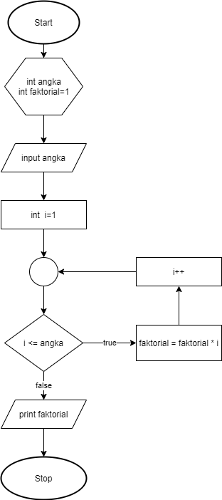

## JOBSHEET 7

## PERULANGAN 1

### Tujuan

Mahasiswa mampu menyelesaikan permasalahan/studi kasus menggunakan sintaks perulangan 1 dan mengimplemantasikannya dalam bahasa pemrogaman java.

### Alat dan Bahan
+ PC/laptop
+ Browser(chrome, firefox, safari)
+ Koneksi internet

### Praktikum

#### Percobaan 1 : Penggunaan for, while dan do-while

#### Waktu percobaan : 40 menit

1. Perhatikan flowchart perulangan for dibawah ini!

    <p align="left">
    
    </p>
    

> Flowchart diatas digunakan untuk menghitung nilai faktorial, selanjutnya kita akan membuat programnya berdasarkan
> flowchart di atas!

2. Tambahkan library Scanner, deklarasi Scanner, dan buat variabel angka untuk menampung data yang diinput melalui keyboard


```Java
// Ketik kode program di bawah sini
import java.util.Scanner;
Scanner input = new Scanner (System.in);
```


```Java
3. Buatlah deklarasi dan inisialisasi variabel faktorial sesuai dengan flowchart diatas
```


```Java
// Ketik kode program di bawah sini
int angka, faktorial = 1;
```

4. Tambahkan struktur perulangan untuk menghitung hasil faktorial sebuah nilai yang diinputkan menggunakan for
    
    <p align="left">
    
    </p>


```Java
// Ketik kode program di atas di bawah sini
System.out.println("=====PROGRAM MENGHITUNG NILAI FAKTORIAL DENGAN FOR=====");
System.out.print("Masukkan Bilangan : ");
angka = input.nextInt();
for(int i=1; i<=angka; i++)
    faktorial*=i;
System.out.print("Nilai faktorial bilangan tersebut adalah : "+ faktorial);
```

    =====PROGRAM MENGHITUNG NILAI FAKTORIAL DENGAN FOR=====
    Masukkan Bilangan : 5
    Nilai faktorial bilangan tersebut adalah : 120

5. Ubah nilai variabel faktorial seperti semula. Kemudian gunakan struktur perulangan while untuk menghitung hasil faktorial sebuah nilai yang diinputkan
    
    <p align="left">
    
    </p>


```Java
// Ketik kode program di atas di bawah sini
faktorial=1;
System.out.println("=====PROGRAM MENGHITUNG NILAI FAKTORIAL DENGAN WHILE=====");
System.out.print("Masukkan Bilangan : ");
angka= input.nextInt();
int i=1;
while(i<=angka){
    faktorial*=i;
    i++;
}
System.out.print("Nilai faktorial bilangan tersebut adalah : "+ faktorial);
```

    =====PROGRAM MENGHITUNG NILAI FAKTORIAL DENGAN WHILE=====
    Masukkan Bilangan : 5
    Nilai faktorial bilangan tersebut adalah : 120

6. Kembalikan lagi nilai variabel faktorial seperti semula. Gunakan struktur perulangan do-while untuk menghitung hasil faktorial sebuah nilai yang diinputkan
    
    <p align="left">
    
    </p>


```Java
// Ketik kode program di atas di bawah sini
faktorial=1;
System.out.println("=====PROGRAM MENGHITUNG NILAI FAKTORIAL DENGAN DO-WHILE=====");
System.out.print("Masukkan Bilangan : ");
angka= input.nextInt();
int i=1;
do{
    faktorial*=i;
    i++;
}
while(i<=angka);
System.out.print("Nilai faktorial bilangan tersebut adalah : "+ faktorial);
```

    =====PROGRAM MENGHITUNG NILAI FAKTORIAL DENGAN DO-WHILE=====
    Masukkan Bilangan : 5
    Nilai faktorial bilangan tersebut adalah : 120

##### Pertanyaan
1. Pada program diatas, apakah kegunaan baris berikut?
<p align="left">
    
    </p>

// Ketik jawaban disini
faktorial = faktorial * i 
nilai faktorial didapat dari faktorial pertama dikali i pertama dan setiap perulangan faktorial akan memakai hasil dari faktorial dan i yang bertambah setiap perulangan sebanyak angka yang dimasukkan.

2. Modifikasi program diatas dibagian struktur pemilihannya sehingga hasilnya menjadi seperti di bawah ini:
<p align="left">
    
    </p>


```Java
// Ketik kode program di atas di bawah sini
Scanner sama = new Scanner(System.in);

        int faktorial = 1, angka;
        System.out.println("=====PROGRAM MENGHITUNG NILAI FAKTORIAL=====");
        System.out.print("Masukkan Bilangan : ");
        angka = sama.nextInt();
        System.out.print(angka + " Faktorial = ");

        for (int i = 1; i <= angka; i++) {
            faktorial *= i;
            if (i < angka) {
                System.out.print(i + " x ");
            } else {
                System.out.print(i);
            }
        }
        System.out.println(" = " + faktorial);
```

    =====PROGRAM MENGHITUNG NILAI FAKTORIAL=====
    Masukkan Bilangan : 5
    5 Faktorial = 1 x 2 x 3 x 4 x 5 = 120


#### Percobaan 2 : Keluar dari perulangan menggunakan break

#### Waktu percobaan : 40 menit

1. Buatlah perulangan dengan menggunakan for yang memanfaatkan keyword break
<p align="left">
    
    </p>


```Java
// Ketik kode program di atas di bawah sini
Scanner input=new Scanner(System.in);
int angka,total;
System.out.println("===PROGRAM FOR LOOP DENGAN BREAK===");
for(total=0;true;){
    System.out.print("Masukkan Bilangan : ");
    angka=input.nextInt();
    total+=angka;
    if(total>50) break;
}
System.out.println("Jumlah angka-angka yang telah dimasukkan : "+total);
```

    ===PROGRAM FOR LOOP DENGAN BREAK===
    Masukkan Bilangan : 5
    Masukkan Bilangan : 4
    Masukkan Bilangan : 51
    Jumlah angka-angka yang telah dimasukkan : 60


2. Buat perulangan yang sama dengan struktur perulangan while
<p align="left">
    
    </p>


```Java
// Ketik kode program di atas di bawah sini
int angka,total;
System.out.println("===PROGRAM WHILE LOOP DENGAN BREAK===");
total=0;
while(true){
    System.out.print("Masukkan Bilangan : ");
    angka=input.nextInt();
    total+=angka;
    if(total>50) break;
}
System.out.println("Jumlah angka-angka yang telah dimasukkan : "+total);
```

    ===PROGRAM WHILE LOOP DENGAN BREAK===
    Masukkan Bilangan : 5
    Masukkan Bilangan : 6
    Masukkan Bilangan : 7
    Masukkan Bilangan : 8
    Masukkan Bilangan : 18
    Masukkan Bilangan : 12
    Jumlah angka-angka yang telah dimasukkan : 56


3. Tuliskan perulangan diatas dalam struktur do-while
    <p align="left">
    
    </p>


```Java
// Ketik kode program di atas di bawah sini
int angka,total;
System.out.println("PROGRAM DO-WHILE LOOP DENGAN BREAK===");
total=0;
do
{
    System.out.print("Masukkan Bilangan : ");
    angka=input.nextInt();
    total+=angka;
    if(total>50) break;
}
while(true);
System.out.println("Jumlah angka-angka yang telah dimasukkan : "+total);
```

    PROGRAM DO-WHILE LOOP DENGAN BREAK===
    Masukkan Bilangan : 5
    Masukkan Bilangan : 67
    Jumlah angka-angka yang telah dimasukkan : 72


##### Pertanyaan
1. Jelaskan fungsi kode program yang telah dibuat pada percobaan diatas!

// Ketik jawaban disini
kode di atas berfungsi untuk memasukkan beberapa angka yang akan terus melakukan inputan hingga total nilai yang diinput lebih dari 50 maka akan menampilkan total dari seluruh nilai inputan-inputan awal yang itu menandakan akhir dari program.

2. Jelaskan fungsi kode berikut!
    <p align="left">
    
    </p>


// Ketik jawaban disini
Codingan diatas memiliki tujuan menandai statement didalam kondisi for dengan beberapa ekspresi yaitu memberikan inisialisasi total awal 0 dan true disini berart menjalankan statement didalam for apabila hasilnya true.

#### Percobaan 3 : Keluar dari step perulangan menggunakan continue

#### Waktu percobaan : 40 menit

1. Buat program looping menggunakan struktur perulangan for seperti di bawah ini: 
<p align="left">
    
    </p>


```Java
// Ketik kode program di atas di bawah sini
Scanner input=new Scanner(System.in);
int angka, total, count;
double avg;
count=0;
System.out.println("===PROGRAM FOR LOOP DENGAN CONTINUE===");
for(int i=0;i<5;i++){
    System.out.print("Masukkan Bilangan : ");
    angka=input.nextInt();
    if(angka>=50) continue;
    total+=angka;
    count++;
}
System.out.println("Jumlah angka-angka yang kurang dari 50: "+total);
avg=(double)total/count;
System.out.println("Rata-rata angka yang kurang dari 50: "+avg);
```

    ===PROGRAM FOR LOOP DENGAN CONTINUE===
    Masukkan Bilangan : 5
    Masukkan Bilangan : 6
    Masukkan Bilangan : 7
    Masukkan Bilangan : 8
    Masukkan Bilangan : 5
    Jumlah angka-angka yang kurang dari 50: 31
    Rata-rata angka yang kurang dari 50: 6.2


```Java
5. Jalankan program. Amati apa yang terjadi!
```

##### Pertanyaan
1. Jelaskan Perbedaan dari percobaan 2 dan percobaan 3


```Java
// Ketik jawaban disini
Percobaan 2 : tidak akan berhenti hingga inputannya lebih dari atau sama dengan 50
Percobaan 3 : berhenti apabila sudah memasukkan input sebanyak 5 kali berapapun hasilnya
```

2. Jelaskan apa fungsi perintah kode program dibawah ini?
<p align="left">
    
    </p>

// Ketik jawaban disini
jika angka lebih dari 50, maka angka tersebut tidak akan dihitung, lalu dilanjutkan dengan menghitung angka angka lain dibawah 50 dan mentotalnyacount++ merupakan jumalah angka yang dimasukkan tetapi angkanya terhitung jika kurang dari 50

### Tugas

#### Waktu pengerjaan Tugas: 140 menit

1. Buatlah program yang meminta masukan user sebuah bilangan bulat N (N > 0). Program kemudian menampilkan penjumlahan N bilangan genap positif pertama (bilangan genap ≥ 0).
Contoh: 
    •	Jika user memasukkan N = 10, program akan menghitung banyaknya jumlah bilangan positive di dalam range bilangan 1-10   kemudian menampilkan penjumlahan bilangan positive bilangan bilangan diantara 1-10 yaitu : 
        0 + 2 + 4 + 6 + 10 = 30. 
        Setelah itu program akan menampilkan rata-rata dari bilangan positive yang telah dijumlahkan tadi.
    •	Contoh output program dan flowchart
<br/><br/>
  

<br/>


```Java
// Ketik kode program disini
import java.util.Scanner;
Scanner input=new Scanner(System.in);
int bil, jmlBilGenap;
int totalGenap=0;
double avg;
System.out.print("Masukkan Angka: ");
bil= input.nextInt();
jmlBilGenap=bil/2;
System.out.println("Jumlah Bilangan dari 1 sampai " + bil + " adalah " + jmlBilGenap);
System.out.print("Angka genap dalam range tersebut adalah ");
for(int i=2; i<=bil; i+=2){
    System.out.print(i);
    if(i!=bil){
        System.out.print(", ");
    }
    totalGenap+=1;
    System.out.println("\nhasil penjumlahan angka genap 1 sampai " + bil + " adalah " + totalGenap);
    System.out.println("Rata-rata angka genap dari 1 sampai " + bil + "adalah" + avg);
}


```

    Masukkan Angka: 5
    Jumlah Bilangan dari 1 sampai 5 adalah 2
    Angka genap dalam range tersebut adalah 2, 
    hasil penjumlahan angka genap 1 sampai 5 adalah 1
    Rata-rata angka genap dari 1 sampai 5adalah0.0
    4, 
    hasil penjumlahan angka genap 1 sampai 5 adalah 2
    Rata-rata angka genap dari 1 sampai 5adalah0.0


###### 2. Buatlah program untuk menampilkan angka 1 hingga angka masukan pengguna secara berurutan dan melompati angka kelipatan 5. Seperti tampilan di bawah ini
<p align="left">

</p>


```Java
// Ketik kode program disini
import java.util.Scanner;
Scanner input=new Scanner(System.in);
System.out.print("Masukkan angka: ");
int angka=input.nextInt();
for(int i=1; i<=angka; i++){
    if(i%5 == 0) continue;
    System.out.println(i);
}


```

    Masukkan angka: 19
    1
    2
    3
    4
    6
    7
    8
    9
    11
    12
    13
    14
    16
    17
    18
    19


3. Buatlah sebuah program yang menampilkan deret bilangan fibonacci sebagai berikut. Dimana bilangan yang terletak di sebelah kanan adalah hasil penjumlahan dari 2 bilangan sebelumnya
 <p align="left">
    
    </p>


```Java
// Ketik kode program disini
import java.util.Scanner;
Scanner input=new Scanner(System.in);
int jumlah;
int satu=0;
int dua=1;
System.out.print("Masukkan banyak bilangan fibonacci: ");
int bil=input.nextInt();
for(i=0; i<bil; ++i){
    System.out.print("Sum of" + satu + " + " + dua + " = " );
    jumlah= satu+dua;
    satu=dua;
    dua=jumlah;
    System.out.println(jumlah);
}
```

    Masukkan banyak bilangan fibonacci: 5
    Sum of0 + 1 = 1
    Sum of1 + 1 = 2
    Sum of1 + 2 = 3
    Sum of2 + 3 = 5
    Sum of3 + 5 = 8


```Java

```
