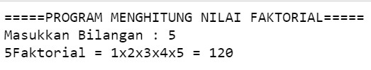

## JOBSHEET 7

## PERULANGAN 1

### Tujuan

Mahasiswa mampu menyelesaikan permasalahan/studi kasus menggunakan sintaks perulangan 1 dan mengimplemantasikannya dalam bahasa pemrogaman java.

### Alat dan Bahan
+ PC/laptop
+ Browser(chrome, firefox, safari)
+ Koneksi internet

### Praktikum

#### Percobaan 1 : Penggunaan for, while dan do-while

#### Waktu percobaan : 40 menit

1. Perhatikan flowchart perulangan for dibawah ini!

    <p align="left">
    
    </p>
    

> Flowchart diatas digunakan untuk menghitung nilai faktorial, selanjutnya kita akan membuat programnya berdasarkan
> flowchart di atas!

2. Tambahkan library Scanner, deklarasi Scanner, dan buat variabel angka untuk menampung data yang diinput melalui keyboard


```Java
// Ketik kode program di bawah sini
import java.util.Scanner;
Scanner scan = new Scanner(System.in);
```


```Java
3. Buatlah deklarasi dan inisialisasi variabel faktorial sesuai dengan flowchart diatas
```


```Java
// Ketik kode program di bawah sini
int angka, i, faktorial = 1;
```

4. Tambahkan struktur perulangan untuk menghitung hasil faktorial sebuah nilai yang diinputkan menggunakan for
    
    <p align="left">
    
    </p>


```Java
// Ketik kode program di atas di bawah sini
System.out.println("====PROGRAM MENGHITUNG NILAI FAKTORIAL DENGAN FOR====");
System.out.print("Masukkan Bilangan : ");
angka = scan.nextInt();
for(i = 1; i <= angka; i++){
    faktorial*=i;
    System.out.printf("Nilai faktorial bilangan %d adalah %d\n", angka, faktorial);
}
```

    ====PROGRAM MENGHITUNG NILAI FAKTORIAL DENGAN FOR====
    Masukkan Bilangan : 5
    Nilai faktorial bilangan 5 adalah 1
    Nilai faktorial bilangan 5 adalah 2
    Nilai faktorial bilangan 5 adalah 6
    Nilai faktorial bilangan 5 adalah 24
    Nilai faktorial bilangan 5 adalah 120
    

5. Ubah nilai variabel faktorial seperti semula. Kemudian gunakan struktur perulangan while untuk menghitung hasil faktorial sebuah nilai yang diinputkan
    
    <p align="left">
    
    </p>


```Java
faktorial = 1;
System.out.println("====PROGRAM MENGHITUNG NILAI FAKTORIAL DENGAN FOR====");
System.out.print("Masukkan Bilangan : ");
angka = scan.nextInt();
int i = 1;
while (i <= angka){
    faktorial*=i;
    i++;
    System.out.printf("Nilai faktorial bilangan %d adalah %d\n",angka, faktorial);
}
```

    ====PROGRAM MENGHITUNG NILAI FAKTORIAL DENGAN FOR====
    Masukkan Bilangan : 5
    Nilai faktorial bilangan 5 adalah 1
    Nilai faktorial bilangan 5 adalah 2
    Nilai faktorial bilangan 5 adalah 6
    Nilai faktorial bilangan 5 adalah 24
    Nilai faktorial bilangan 5 adalah 120
    

6. Kembalikan lagi nilai variabel faktorial seperti semula. Gunakan struktur perulangan do-while untuk menghitung hasil faktorial sebuah nilai yang diinputkan
    
    <p align="left">
    
    </p>


```Java
faktorial=1;
System.out.println("===PROGRAM MENGHITUNG NILAI FAKTORIAL DENGAN DO-WHILE===");
System.out.print("Masukkan Bilangan : ");
angka = scan.nextInt();
int i=1;
do{
    faktorial*=i;
    i++;
} while (i<=angka);

System.out.print("Nilai Faktorial bilangan tersebut adalah : "+ faktorial);
```

    ===PROGRAM MENGHITUNG NILAI FAKTORIAL DENGAN DO-WHILE===
    Masukkan Bilangan : 5
    Nilai Faktorial bilangan tersebut adalah : 120

##### Pertanyaan
1. Pada program diatas, apakah kegunaan baris berikut?
<p align="left">
    
    </p>

faktorial *= i sama saja artinya dengan faktorial = faktorial * i

2. Modifikasi program diatas dibagian struktur pemilihannya sehingga hasilnya menjadi seperti di bawah ini:
<p align="left">
    
    </p>


```Java
import java.util.Scanner;
Scanner scan = new Scanner(System.in);
int angka, hasil = 1;

System.out.print("Masukkan Bilangan : ");
angka = scan.nextInt();

System.out.printf("%dFaktorial = ", angka);
for(int i=1; i <= angka; i++){
    hasil *= i;
    if(i == 1){
        System.out.printf("1");
    } else {
        System.out.printf("x%d",i);
    }
}
System.out.printf(" = %d", hasil);
```

    Masukkan Bilangan : 5
    5Faktorial = 1x2x3x4x5 = 120


    java.io.PrintStream@7b097c96


#### Percobaan 2 : Keluar dari perulangan menggunakan break

#### Waktu percobaan : 40 menit

1. Buatlah perulangan dengan menggunakan for yang memanfaatkan keyword break
<p align="left">
    
    </p>


```Java
// Ketik kode program di atas di bawah sini
import java.util.Scanner;
Scanner scan = new Scanner(System.in);
int angka, total;
System.out.println("===PROGRAM FOR LOOP DENGAN BREAK===");
for(total=0;true;){
    System.out.print("Masukkan Bilangan :" );
    angka = scan.nextInt();
    total += angka;
    if(total>50) break;
}
System.out.println("Jumlah angka-angka yang telah dimasukkan : " + total);
```

    ===PROGRAM FOR LOOP DENGAN BREAK===
    Masukkan Bilangan :10
    Masukkan Bilangan :10
    Masukkan Bilangan :10
    Masukkan Bilangan :10
    Masukkan Bilangan :10
    Masukkan Bilangan :50
    Jumlah angka-angka yang telah dimasukkan : 100
    

2. Buat perulangan yang sama dengan struktur perulangan while
<p align="left">
    
    </p>


```Java
// Ketik kode program di atas di bawah sini
int angka, total;
System.out.println("===PROGRAM WHILE LOOP DENGAN BREAK===");
total = 0;
while(true){
    System.out.print("Masukkan Bilangan : ");
    angka = scan.nextInt();
    total += angka;
    if(total>50) break;
}
System.out.println("Jumlah angka-angka yang telah dimasukkan : "+total);
```

    ===PROGRAM WHILE LOOP DENGAN BREAK===
    Masukkan Bilangan : 40
    Masukkan Bilangan : 30
    Jumlah angka-angka yang telah dimasukkan : 70
    

3. Tuliskan perulangan diatas dalam struktur do-while
    <p align="left">
    
    </p>


```Java
// Ketik kode program di atas di bawah sini
int angka, total;
System.out.println("===PROGRAM DO-WHILE LOOP DENGAN BREAK===");
total = 0;
do{
    System.out.print("Masukkan Bilangan : ");
    angka = scan.nextInt();
    total+=angka;
    if(total>50) break;
}while(true);
System.out.println("Jumlah angka-angka yang telah dimasukkan : "+ total);
```

    ===PROGRAM DO-WHILE LOOP DENGAN BREAK===
    Masukkan Bilangan : 20
    Masukkan Bilangan : 20
    Masukkan Bilangan : 10
    Masukkan Bilangan : 10
    Jumlah angka-angka yang telah dimasukkan : 60
    

##### Pertanyaan
1. Jelaskan fungsi kode program yang telah dibuat pada percobaan diatas!

- Kode diatas digunakan untuk menjumlahkan angka yang telah diinput dan akan berhenti jika jumlahnya lebih dari 50

2. Jelaskan fungsi kode berikut!
    <p align="left">
    
    </p>


- Kode tersebut akan mengulang terus menerus selama variabel total mempunyai value 0 dan perintahnya true, dan akan berhenti jika terdapat break pada code

#### Percobaan 3 : Keluar dari step perulangan menggunakan continue

#### Waktu percobaan : 40 menit

1. Buat program looping menggunakan struktur perulangan for seperti di bawah ini: 
<p align="left">
    
    </p>


```Java
import java.util.Scanner;
Scanner scan = new Scanner(System.in);
int angka, total, count;
double avg;
count = 1;
System.out.println("===PROGRAM FOR LOOP DENGAN CONTINUE===");
for(int i=0; i<5; i++){
    System.out.print("Masukkan Bilangan : ");
    angka = scan.nextInt();
    if(angka>=50) continue;
    total+=angka;
    count++;
}
System.out.println("Jumlah angka-angka yang kurang dari 50 : "+total);
avg = (double)total/count;
System.out.println("Rata-rata angka yang kurang dari 50 : "+avg);
```

    ===PROGRAM FOR LOOP DENGAN CONTINUE===
    Masukkan Bilangan : 20
    Masukkan Bilangan : 70
    Masukkan Bilangan : 23
    Masukkan Bilangan : 50
    Masukkan Bilangan : 30
    Jumlah angka-angka yang kurang dari 50 : 73
    Rata-rata angka yang kurang dari 50 : 18.25
    

## 5. Jalankan program. Amati apa yang terjadi!

##### Pertanyaan
1. Jelaskan Perbedaan dari percobaan 2 dan percobaan 3

Percobaan 2 membahas tentang Break dan Percobaan 3 membahas tentang Continue.
- Break digunakan untuk mengakhiri perulangan
- Continue digunakan untuk melewati sebuah pernyataan

2. Jelaskan apa fungsi perintah kode program dibawah ini?
<p align="left">
    
    </p>

- Jika angka lebih dari sama dengan 50, maka kode yang ada dibawahnya akan dilewati dan akan mengulangi proses perulangan

### Tugas

#### Waktu pengerjaan Tugas: 140 menit

1. Buatlah program yang meminta masukan user sebuah bilangan bulat N (N > 0). Program kemudian menampilkan penjumlahan N bilangan genap positif pertama (bilangan genap ≥ 0).
Contoh: 
    •	Jika user memasukkan N = 10, program akan menghitung banyaknya jumlah bilangan positive di dalam range bilangan 1-10   kemudian menampilkan penjumlahan bilangan positive bilangan bilangan diantara 1-10 yaitu : 
        0 + 2 + 4 + 6 + 10 = 30. 
        Setelah itu program akan menampilkan rata-rata dari bilangan positive yang telah dijumlahkan tadi.
    •	Contoh output program dan flowchart
<br/><br/>
  

<br/>


```Java
import java.util.Scanner;
Scanner scan = new Scanner(System.in);
int bil, genap, totalGenap;
double rata2;

System.out.print("Masukkan Angka : ");
bil = scan.nextInt();

genap = bil/2;
System.out.printf("Banyaknya bilangan genap dari 1 sampai %d adalah %d\n", bil, genap);
System.out.print("Angka genap dalam range tersebut adalah ");
int i=1;
while(i <= bil){
    if(i%2!=0){
         i++;
    } else {
        totalGenap += i;
        if(i == 2){
            System.out.print(i);
        } else {
            System.out.printf(", %d", i);
        }
        i++;
    }
}

rata2 =(double)totalGenap/genap;
System.out.println("");
System.out.printf("Hasil penjumlahan bilangan genap dari 1 sampai %d adalah %d\n", bil, totalGenap);
System.out.printf("Rata-rata bilangan genap dari 1 sampai %d adalah %.1f\n", bil, rata2);
```

    Masukkan Angka : 20
    Banyaknya bilangan genap dari 1 sampai 20 adalah 10
    Angka genap dalam range tersebut adalah 2, 4, 6, 8, 10, 12, 14, 16, 18, 20
    Hasil penjumlahan bilangan genap dari 1 sampai 20 adalah 110
    Rata-rata bilangan genap dari 1 sampai 20 adalah 11.0
    


    java.io.PrintStream@7b097c96


2. Buatlah program untuk menampilkan angka 1 hingga angka masukan pengguna secara berurutan dan melompati angka kelipatan 5. Seperti tampilan di bawah ini
<p align="left">

</p>


```Java
import java.util.Scanner;
Scanner scan = new Scanner(System.in);
int angka;

System.out.print("Masukkan Angka : ");
angka = scan.nextInt();

for(int i=1; i<=angka; i++){
    if(i%5 == 0) continue;
    System.out.println(i);
}
```

    Masukkan Angka : 19
    1
    2
    3
    4
    6
    7
    8
    9
    11
    12
    13
    14
    16
    17
    18
    19
    

3. Buatlah sebuah program yang menampilkan deret bilangan fibonacci sebagai berikut. Dimana bilangan yang terletak di sebelah kanan adalah hasil penjumlahan dari 2 bilangan sebelumnya
 <p align="left">
    
    </p>


```Java
import java.util.Scanner;
int bil1=0; bil2=1; hasil;
System.out.print("0 1 ");

while(bil1 <= 34){
    hasil = bil1 + bil2;
    System.out.printf("%d ", hasil);
    
    bil1=bil2;
    bil2=hasil;
}
```

    0 1 1 2 3 5 8 13 21 34 55 89 
