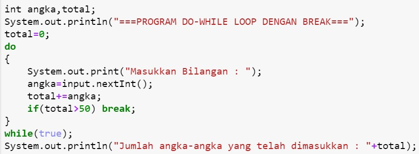

## JOBSHEET 7

## PERULANGAN 1

### Tujuan

Mahasiswa mampu menyelesaikan permasalahan/studi kasus menggunakan sintaks perulangan 1 dan mengimplemantasikannya dalam bahasa pemrogaman java.

### Alat dan Bahan
+ PC/laptop
+ Browser(chrome, firefox, safari)
+ Koneksi internet

### Praktikum

#### Percobaan 1 : Penggunaan for, while dan do-while

#### Waktu percobaan : 40 menit

1. Perhatikan flowchart perulangan for dibawah ini!

    <p align="left">
    
    </p>
    

> Flowchart diatas digunakan untuk menghitung nilai faktorial, selanjutnya kita akan membuat programnya berdasarkan
> flowchart di atas!

2. Tambahkan library Scanner, deklarasi Scanner, dan buat variabel angka untuk menampung data yang diinput melalui keyboard


```Java
// Ketik kode program di bawah sini
import java.util.Scanner;
Scanner sc = new Scanner(System.in);

```


```Java
3. Buatlah deklarasi dan inisialisasi variabel faktorial sesuai dengan flowchart diatas
```


```Java
// Ketik kode program di bawah sini
int angka;
int faktorial=1;

```

4. Tambahkan struktur perulangan untuk menghitung hasil faktorial sebuah nilai yang diinputkan menggunakan for
    
    <p align="left">
    
    </p>


```Java
// Ketik kode program di atas di bawah sini
System.out.println("=====PROGRAM MENGHITUNG NILAI FAKTORIAL DENGAN FOR=====");
System.out.print("Masukkan Bilangan : ");
angka= sc.nextInt();
for(int i=1; i<=angka; i++)
    faktorial*=i;
System.out.print("Nilai faktorial bilangan tersebut adalah : " + faktorial);

```

    =====PROGRAM MENGHITUNG NILAI FAKTORIAL DENGAN FOR=====
    Masukkan Bilangan : 5
    Nilai faktorial bilangan tersebut adalah : 120

5. Ubah nilai variabel faktorial seperti semula. Kemudian gunakan struktur perulangan while untuk menghitung hasil faktorial sebuah nilai yang diinputkan
    
    <p align="left">
    
    </p>


```Java
// Ketik kode program di atas di bawah sini
faktorial=1;
System.out.println("=== PROGRAM MENGHITUNG NILAI FAKTORIAL WHILE ===");
System.out.print("Masukan Bil : ");
angka = sc.nextInt();
int i=1;
while(i<=angka){
    faktorial*=i;
    i++;
}
System.out.print("Niali faktorial bil tersebut : "+ faktorial);

```

    === PROGRAM MENGHITUNG NILAI FAKTORIAL WHILE ===
    Masukan Bil : 5
    Niali faktorial bil tersebut : 120

6. Kembalikan lagi nilai variabel faktorial seperti semula. Gunakan struktur perulangan do-while untuk menghitung hasil faktorial sebuah nilai yang diinputkan
    
    <p align="left">
    
    </p>


```Java
faktorial=1;
System.out.println("===PROGRAM MENGHITUNG NILAI FAKTORIAL DENGAN DO-WHILE===");
System.out.print("Masukkan Bilangan : ");
angka = sc.nextInt();
int i=1;
do{
    faktorial*=i;
    i++;
} while (i<=angka);

System.out.print("Nilai Faktorial bilangan tersebut adalah : "+ faktorial);

```

    ===PROGRAM MENGHITUNG NILAI FAKTORIAL DENGAN DO-WHILE===
    Masukkan Bilangan : 5
    Nilai Faktorial bilangan tersebut adalah : 120

##### Pertanyaan
1. Pada program diatas, apakah kegunaan baris berikut?
<p align="left">
    
    </p>


```Java
// Ketik jawaban disini
kegunaan nya untuk mengalikan seluruh bilangan lalu bisa disimpan 

```

2. Modifikasi program diatas dibagian struktur pemilihannya sehingga hasilnya menjadi seperti di bawah ini:
<p align="left">
    
    </p>


```Java
// Ketik kode program di atas di bawah sini
import java.util.Scanner;
Scanner sc = new Scanner(System.in);
int angka;
int faktorial=1;
System.out.println("=====PROGRAM MENGHITUNG NILAI FAKTORIAL DENGAN FOR=====");
System.out.print("Masukkan Bilangan : ");
angka= sc.nextInt();
System.out.print(angka + " Faktorial = ");
for(int i=1; i<=angka; i++){
    faktorial*=i;
    System.out.print(i);
    
    if(i!=angka){
        System.out.print("x");
    }
}
System.out.print(" = " + faktorial);

```

    =====PROGRAM MENGHITUNG NILAI FAKTORIAL DENGAN FOR=====
    Masukkan Bilangan : 5
    5 Faktorial = 1x2x3x4x5 = 120

penjelasan,
kode diatas ini adalah untuk mengalikan faktorial atau menghasilkan perulangan sejumlah yg di inputkan

#### Percobaan 2 : Keluar dari perulangan menggunakan break

#### Waktu percobaan : 40 menit

1. Buatlah perulangan dengan menggunakan for yang memanfaatkan keyword break
<p align="left">
    
    </p>


```Java
// Ketik kode program di atas di bawah sini
Scanner input=new Scanner(System.in);
int angka, total;
System.out.println("===PROGRAM FOR LOOP DENGAN BREAK===");
for(total=0;true;){
    System.out.print("Masukan bil : ");
    angka=input.nextInt();
    total+=angka;
    if(total>50) break;
}
System.out.println("Jumlah angka-angka yang telah dimasukan : "+total);

```

    ===PROGRAM FOR LOOP DENGAN BREAK===
    Masukan bil : 26
    Masukan bil : 4
    Masukan bil : 26
    Jumlah angka-angka yang telah dimasukan : 56
    

pnjelasan,
kode nya membuat sebuah perulangan for loop dan statement break untuk keluar atau berhenti dari perulangan (loop)
kode ini untuk menjumlah angka yang di input, tapi akan berhenti saat jumlah angka yang dimasukkan melebihi 50 (total>50), jadi jika sudah terhitung lebih 50 akan break, selesai lalu mengoutputkan hasil 

2. Buat perulangan yang sama dengan struktur perulangan while
<p align="left">
    
    </p>


```Java
// Ketik kode program di atas di bawah sini
int angka, total;
System.out.println("===PROGRAM WHILE LOOP DENGAN BREAK===");
total-0;
while(true){
    System.out.print("Masukkan Bil: ");
    angka=input.nextInt();
    total+=angka;
    if(total>50) break;
}
System.out.println("Jumlah angka-angka yg telah dimasukkan : "+total);
```

    ===PROGRAM WHILE LOOP DENGAN BREAK===
    Masukkan Bil: 46
    Masukkan Bil: 36
    Jumlah angka-angka yg telah dimasukkan : 82
    

penjelasan,
kode ini membuat sebuah perulangan while memanfaatkan statement break untuk keluar atau berhenti dari perulangan
kode ini untuk menginputkan bilangan terus menerus sampai hasilnya harus melebihi 50 , baru break 

3. Tuliskan perulangan diatas dalam struktur do-while
    <p align="left">
    
    </p>


```Java
// Ketik kode program di atas di bawah sini
int angka,total;
System.out.println("===PROGRAM DO WHILE LOOP DG BREAK===");
total=0;
do
{
    System.out.print("Masukkan Bil : ");
    angka=input.nextInt();
    total+=angka;
    if(total>50) break;
}
while(true);
System.out.println("Jumlah angka yg telah dimaukan : "+total);
```

    ===PROGRAM DO WHILE LOOP DG BREAK===
    Masukkan Bil : 43
    Masukkan Bil : 20
    Jumlah angka yg telah dimaukan : 63
    

penjelasan,
kode ini juga menginputkan beberapa bilangan terus menerus sampai harus memenuhi 50 (total>50)

##### Pertanyaan
1. Jelaskan fungsi kode program yang telah dibuat pada percobaan diatas!


```Java
// Ketik jawaban disini

Kode diatas ini meminta input bilangan bulat secara terus menerus sampai total keseluruhan bilangan harus berjumlah lebih dari 50


```

2. Jelaskan fungsi kode berikut!
    <p align="left">
    
    </p>


```Java
// Ketik jawaban disini
fungsi kode ini adalah perulangan yg dimulai dengan total bilangan 0, lalu perulangan akan dilakukan sampai inputnya benar true

```

#### Percobaan 3 : Keluar dari step perulangan menggunakan continue

#### Waktu percobaan : 40 menit

1. Buat program looping menggunakan struktur perulangan for seperti di bawah ini: 
<p align="left">
    
    </p>


```Java
// Ketik kode program di atas di bawah sini
Scanner input=new Scanner(System.in);
int angka, total, count;
double avg;
count=0;
System.out.println("===PROGRAM FOR LOOP DG CONTINUE===");
for(int i=0;i<=5;i++){
    System.out.print("Masukan Bil : ");
    angka=input.nextInt();
    if(angka>=50) continue;
    total+=angka;
    count++;
}
System.out.println("Jumlah angka yg kurang dari 50 : "+total);
avg=(double)total/count;
System.out.println("Rata-rata angka yg kurang dari 50: "+avg);

```

    ===PROGRAM FOR LOOP DG CONTINUE===
    Masukan Bil : 4
    Masukan Bil : 6
    Masukan Bil : 26
    Masukan Bil : 36
    Masukan Bil : 56
    Masukan Bil : 78
    Jumlah angka yg kurang dari 50 : 72
    Rata-rata angka yg kurang dari 50: 18.0
    


```Java
5. Jalankan program. Amati apa yang terjadi!
    
    penjelasan,
 Kode ini untuk menampilkan jumlah total angka yang dimasukan kurang dari 50  juga menampilkan rata-ratanya
```

##### Pertanyaan
1. Jelaskan Perbedaan dari percobaan 2 dan percobaan 3


```Java
// Ketik jawaban disini
pada pecobaan 2 , ada penggunaan break yang dimana untuk membuat perulangan berhenti
pada pecobaan 3 , ada penggunaan continue untuk melanjutkan ke perulangan selanjutnya

```

2. Jelaskan apa fungsi perintah kode program dibawah ini?
<p align="left">
    
    </p>


```Java
// Ketik jawaban disini
jika inputan lebih dari 50 atau sama dengan 50 maka nantinya kan lanjut ke perulangan
```

### Tugas

#### Waktu pengerjaan Tugas: 140 menit

1. Buatlah program yang meminta masukan user sebuah bilangan bulat N (N > 0). Program kemudian menampilkan penjumlahan N bilangan genap positif pertama (bilangan genap ≥ 0).
Contoh: 
    •	Jika user memasukkan N = 10, program akan menghitung banyaknya jumlah bilangan positive di dalam range bilangan 1-10   kemudian menampilkan penjumlahan bilangan positive bilangan bilangan diantara 1-10 yaitu : 
        0 + 2 + 4 + 6 + 10 = 30. 
        Setelah itu program akan menampilkan rata-rata dari bilangan positive yang telah dijumlahkan tadi.
    •	Contoh output program dan flowchart
<br/><br/>
  

<br/>


```Java
// Ketik kode program disini
import java.util.Scanner;
Scanner sc = new Scanner(System.in);
int bil, jmlGenap;
int totalGenap=0;
double avg;
System.out.print("Masukkan angka: ");
bil = sc.nextInt();
jmlGenap = bil/2;
System.out.println("Banyaknya bil genap dari 1 sampai " + bil + " adalah " + jmlGenap);

System.out.print("Angka genap dalam range tersebut adalah ");
for(int i = 2; i <= bil; i+=2) {
  
    
    System.out.print(i);
    
    if(i != bil) {
        System.out.print(", ");
       
    }
    totalGenap+=i; 

}

avg=totalGenap/jmlGenap;


System.out.println("\nHasil penjumlahan angka genap dari 1 sampai " + bil + " adalah " + totalGenap);    
System.out.println("Rata-rata angka genap dari 1 sampai " + bil + " adalah " + avg);

```

    Masukkan angka: 10
    Banyaknya bil genap dari 1 sampai 10 adalah 5
    Angka genap dalam range tersebut adalah 2, 4, 6, 8, 10
    Hasil penjumlahan angka genap dari 1 sampai 10 adalah 30
    Rata-rata angka genap dari 1 sampai 10 adalah 6.0
    

kodenya untuk menghitung jumlah bilangan, bnyak bil genap dan juga rata rata bilangan genap, dan juga di range tertentu. awalnya menginputkan bilangan, lalu sistem akan otomatis menyeleksi bilangan genap yang ada di range 1 sampai angka yang diinputkan tadi, lalu auto menyeleksi banyaknya bilangan, rata rata bialngan, jumlah bilangan, serta output dari bilangan genap tersebut.

## 2. Buatlah program untuk menampilkan angka 1 hingga angka masukan pengguna secara berurutan dan melompati angka kelipatan 5. Seperti tampilan di bawah ini
<p align="left">

</p>


```Java
// Ketik kode program disini

import java.util.Scanner;
 Scanner input = new Scanner(System.in);
   System.out.print("Masukkan angka: ");
int angka=input.nextInt();
    for(int i=1; i <= angka;i++){
        if(i%5 == 0) continue;
        System.out.println(i);
    }

```

    Masukkan angka: 19
    1
    2
    3
    4
    6
    7
    8
    9
    11
    12
    13
    14
    16
    17
    18
    19
    

Kode diatas berfungsi untuk mengurutkan bilangan tapi meloncati angka kelipatan 5. Cara kerjanya yaitu akan terus mengeluarkan output angka urut, lalu jika ada kelipatan 5 maka tidak akan diprint oleh sistem, lalu melanjutkan lagi dengan angka yang bukan kelipatan 5, begitu seterusnya sampai angka maksimalnya yaitu angka yang kita inputkan pada sistem.

## 3. Buatlah sebuah program yang menampilkan deret bilangan fibonacci sebagai berikut. Dimana bilangan yang terletak di sebelah kanan adalah hasil penjumlahan dari 2 bilangan sebelumnya
 <p align="left">
    
    </p>


```Java
// Ketik kode program disini
Scanner input = new Scanner(System.in);
int total;
int noa = 0;
int nob = 1;
System.out.print("Masukkan Banyak Bilangan Fibonacci Yang Diinginkan: ");
int fib = input.nextInt();
for(i=0; i<fib; ++i){
    System.out.print("Sum of:" + noa + " + " + nob + " = ");
    total = noa + nob;
    noa = nob;
    nob = total;
    System.out.println(total);
}
```

    Masukkan Banyak Bilangan Fibonacci Yang Diinginkan: 5
    Sum of:0 + 1 = 1
    Sum of:1 + 1 = 2
    Sum of:1 + 2 = 3
    Sum of:2 + 3 = 5
    Sum of:3 + 5 = 8
    


```Java
Kodenya berfungsi untuk menampilkan deret fibonacci sejumlah angka yang dimasukan.
Deret Fibonacci ini sebuah deret dimana angka berikutnya, adalah penjumlahan dari 2 angka sebelumnya.
```
