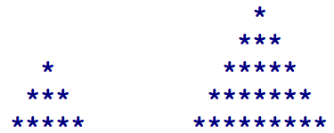

<dl>
  <dt>NIM :</dt>
  <dd>2141720100</dd>

  <dt>Nama :</dt>
  <dd>Adinda Kurnia Rifanti</dd>
    
  <dt>Kelas :</dt>
  <dd>D-IV TI 1A</dd>
</dl>


___


# JOBSHEET 09 - Perulangan 2

## Tujuan
+ Mahasiswa memahami konsep perulangan bersarang (_nested loop_)
+ Mahasiswa dapat menjelaskan format penulisan perulangan bersarang (_nested loop_)
+ Mahasiswa dapat mengimplementasikan _flowchart_ perulangan bersarang menggunakan bahasa pemrograman Java

## Alat dan Bahan
+ PC/laptop
+ Browser(chrome, firefox, safari)
+ Koneksi internet
+ Anaconda3 + Java kernel (opsional)

## Praktikum
### Percobaan 1: Bintang Persegi
1. Perhatikan Flowchart di bawah ini

> flowchart di atas digunakan untuk menggambar sebuah persegi dengan simbol * (bintang)
2. Pada percobaan ke-1 akan dilakukan percobaan tentang _nested loop_. Kasus yang akan diselesaikan adalah untuk membuat tampilan persegi * , dengan panjang sisi sebanyak N. Misalkan N dimasukan **5**, maka hasilnya adalah

3. Karena program membutuhkan input dari keyboard, maka perlu import class Scanner
4. Ketikan kode program di bawah ini


```Java
import java.util.Scanner;
int N;
Scanner sc = new Scanner(System.in);
System.out.print("Masukkan nilai N : ");
N = sc.nextInt();

for(int i = 1; i <= N; i++) {
    System.out.print("*");
}
```

    Masukkan nilai N : 8
    ********

Menggunakan scanner untuk membuat tampilan persegi * , dengan panjang sisi sebanyak N. 
Kode for(int i = 1; i <= N; i++) { : maksudnya adalah melakukan perulangan sebanyak N yang diinputkan. Pada contoh diinputkan angka 8. maka akan terjadi perulangan sebanyak 8 kali memunculkan * ke arah samping. 

5.	Perhatikan sintaks perulangan yang digunakan untuk mencetak * sebanyak N kali ke arah samping. Di tahap 4 di atas kode _looping **for**_ kita jadikan sebagai _**inner loop**_. 
6.	Kita looping lagi _inner loop_ sebanyak N kali untuk menghasilkan _output_ seperti tahap 2. Maka perlu ditambahkan perulangan luar (_outer loop_).


```Java
import java.util.Scanner;
int N;
Scanner sc = new Scanner(System.in);
System.out.print("Masukkan nilai N : ");
N = sc.nextInt();

for(int i = 1; i <= N; i++) {
    System.out.print("*");
}
for(int outer = 1; outer <= N; outer++){
    //inner loop
}
```

    Masukkan nilai N : 8
    ********

#### Pertanyaan 
1. Apakah dengan menggabungkan _inner loop_ dan _outer loop_ seperti langkah 5 di atas sudah menghasilkan _output_ seperti gambar pada langkah 1?
2. Jika belum, silahkan modifikasi kode program sehingga menghasilkan output yang sesuai dengan gambar pada langkah 2?

#### Jawaban
1. ...
2. ...


```Java
import java.util.Scanner;
int N;
Scanner sc = new Scanner(System.in);
System.out.print("Masukkan nilai N : ");
N = sc.nextInt();

for(int i = 0; i <= N; i++){
 for (int j = 0; j< N; j++){
 System.out.print("*");
 }
 System.out.println();
}
```

    Masukkan nilai N : 8
    ********
    ********
    ********
    ********
    ********
    ********
    ********
    ********
    ********


Jawaban Pertanyaan

1. Apakah dengan menggabungkan inner loop dan outer loop seperti langkah 5 di atas sudah menghasilkan output seperti gambar pada langkah 1?
tidak 

***
### Percobaan 2: Bintang Segitiga
1.	Pada percobaan ke-2 akan dilakukan percobaan segitiga * sama siku dengan tinggi sebesar N. Misalkan N dimasukan **5**, maka hasilnya seperti gambar berikut

2. Karena program membutuhkan input dari keyboard, maka perlu import class Scanner
3. Ketikan kode program di bawah ini


```Java
Scanner sc = new Scanner(System.in);
System.out.print("Masukkan nilai N = ");

int N = sc.nextInt();
int i = 0;
while(i<=N){
    int j = 0;
    while(j < i){
        System.out.print("*");
        j++;
    }
    i++;
}
```

    Masukkan nilai N = 5
    ***************

Amati kode program yang telah kalian tulis di atas.

#### Pertanyaan
1. Perhatikan, apakah output yang dihasilkan dengan nilai N = 5 sesuai dengan  tampilan seperti pada tahap 1 (Percobaan 2)?
2. Jika tidak sesuai, bagian mana saja yang harus diperbaiki/ditambahkan? Jelaskan setiap bagian yang perlu diperbaiki/ditambahkan. 

#### Jawaban
1. ...
2. ...


```Java
// Tulis Kode program Percobaan 2 yang benar menurut kalian
import java.util.Scanner;
Scanner sc = new Scanner(System.in);
System.out.print("Masukkan nilai N = ");
int N = sc.nextInt();
int i = 0;

while(i <= N) {
 int j = 0;
 while(j < i){
 System.out.print("*");
 j++;
 }
 System.out.println();
 i++;
}
```

    Masukkan nilai N = 5
    
    *
    **
    ***
    ****
    *****


Jawaban Pertanyaan

1. Perhatikan, apakah output yang dihasilkan dengan nilai N = 5 sesuai dengan tampilan seperti pada tahap 1 (Percobaan 2)? 
tidak 

2. Jika tidak sesuai, bagian mana saja yang harus diperbaiki/ditambahkan? Jelaskan setiap bagian yang perlu diperbaiki/ditambahkan.
perlu ditambahkan println (print spasi) pada bagian outer atau setelah increment j++

***
### Percobaan 3: Segitiga Angka
1.	Pada percobaan ke-3 akan dilakukan percobaan segitiga angka sama siku dengan tinggi sebesar N. Misalkan N dimasukan **5**, maka hasilnya seperti berikut

2. Karena program membutuhkan input dari keyboard, maka perlu import class Scanner
3. Ketikan kode program di bawah ini


```Java
// Tulis Kode program Percobaan 3 Langkah 3 di atas, disini
import java.util.Scanner;
Scanner input = new Scanner(System.in);
System.out.print("Masukkan nilai N : ");
int N = input.nextInt();

for(int i = 1; i <= N; i++){
for(int j = 1; j <= i; j++){
        System.out.print(j);
    }
    System.out.println();
}
```

    Masukkan nilai N : 7
    1
    12
    123
    1234
    12345
    123456
    1234567


#### Pertanyaan 
1. Apakah kode program di atas menghasilkan _output_ yang diharapkan?
2. Jika belum, kode program mana yang harus modifikasi? Jelaskan

#### Jawaban
1. ...
2. ...


```Java
// Tulis Kode program Percobaan 3 yang benar menurut kalian
import java.util.Scanner;
Scanner sc = new Scanner(System.in);
System.out.print("Masukkan nilai N = ");
int N = sc.nextInt();

for (int i = 1; i <= N; i++){
 for(int j = 1; j <= i; j++){
 System.out.print(i);
 }
 System.out.println();
}
```

    Masukkan nilai N = 7
    1
    22
    333
    4444
    55555
    666666
    7777777


Jawaban Pertanyaan

1. Apakah kode program di atas menghasilkan output yang diharapkan?
Belum

2. Jika belum, kode program mana yang harus modifikasi? Jelaskan
Yang perlu dimodifikasi yaitu pada bagian system.out.print(j) menjadi system.out.print(i). Agar output yang dihasilkan sama dengan output yang diharapkan

***
### Percobaan 4: Tebak Angka
1. Pada Percobaan 4 ini, kita akan belajar membuat kode untuk menebak angka menggunakan _nested loop_.
2. Pada percobaan ini kita menggunakan library Scanner untuk menangkap input dari keyboard dan Random untuk meng-generate angka secara acak
3. Ketik dan pahami kode program di bawah ini


```Java
// Tulis Kode program Percobaan 4 Langkah 3 di atas, disini
import java.util.Scanner;
import java.util.Random;

Random random = new Random();
Scanner input = new Scanner(System.in);
char menu = 'y';

do{
 int number = random.nextInt(10) + 1;
 boolean success = false;

 do{
 System.out.print("Tebak angka (1-10): ");
 int answer = input.nextInt();
 input.nextLine();

 if(answer == number){
 System.out.println("Yay...tebakan Anda benar...Selamat!!!");
 success = true;
 }
 } while (!success);
    
 System.out.print("Apakah Anda ingin mengulang permainan (Y/y)?");
 menu = input.nextLine().charAt(0);
} while(menu == 'y' || menu == 'Y')
```

    Tebak angka (1-10): 2
    Tebak angka (1-10): 5
    Tebak angka (1-10): 7
    Tebak angka (1-10): 3
    Tebak angka (1-10): 1
    Yay...tebakan Anda benar...Selamat!!!
    Apakah Anda ingin mengulang permainan (Y/y)?0


Menggunakan library Scanner untuk menangkap input dari keyboard dan Random untuk meng-generate angka secara acak. 

#### Pertanyaan
1. Jelaskan alur program di atas!
2. Apa yang harus dilakukan untuk tidak melanjutkan (tidak mengulangi) permainan tersebut? 
3. Modifikasi program di atas, sehingga bisa menampilkan informasi mengenai : 
    1. input nilai tebakan yang dimasukan oleh user apakah lebih kecil atau lebih besar dari nilai random!
    2. hentikan _nested loop_ jika pengguna gagal menebak angka sampai 10x tebakan, dan beri pesan "Maaf Anda gagal menebak angka sebanyak 10x"

#### Jawaban
1. ...
2. ...


```Java
/* Jawaban untuk Percobaan 4 Pertnyaan 3.A disini */
import java.util.Scanner;
import java.util.Random;

Random random = new Random();
Scanner input = new Scanner(System.in);
char menu = 'y';

do{
 int number = random.nextInt(10) + 1;
 boolean success = false;
    
do{
 System.out.print("Tebak angka (1-10): ");
 int answer = input.nextInt();
 input.nextLine();
 if (answer == number){
 System.out.println("Yay...tebakan anda benar...selamat!!!");
 success =true;
 }else if(answer < number){
 System.out.println("angka yang anda masukkan kurang besar!!!");
 success =false;
 }else{
 System.out.println("angka yang anda masukkan kurang kecil!!!");
 success =false;
 }
} while(!success);
 System.out.print("Apakah Anda ingin mengulang permainan (Y/y)?");
menu = input.nextLine().charAt(0);
} while(menu == 'y' || menu == 'Y');
```

    Tebak angka (1-10): 5
    angka yang anda masukkan kurang besar!!!
    Tebak angka (1-10): 7
    Yay...tebakan anda benar...selamat!!!
    Apakah Anda ingin mengulang permainan (Y/y)?0


```Java
 /* Jawaban untuk Percobaan 4 Pertnyaan 3.B disini */
import java.util.Scanner;
import java.util.Random;

Random random = new Random();
Scanner input = new Scanner(System.in);
char menu = 'y';
int jawab = 0;

do {
    int number = random.nextInt(10) + 1;
    boolean success = false;
    
    do{
        System.out.print("Tebak angka (1-10) : ");
        int answer = input.nextInt();
        input.nextLine();
        jawab++;
        
        if(answer == number){
            System.out.println("Yay... tebakan anda benar... Selamat!!!");
            success = true;
        } else if(answer > number){
            System.out.println("Tebakan anda lebih besar");
        }else{
             System.out.println("Tebakan anda lebih kecil");
        } if(jawab == 10){
            System.out.println("Maaf Anda gagal menebak angka sebanyak 10x");
            success = true;
        }
    } while(!success);
    
    System.out.print("Apakah Anda Ingin Mengulang Permainan (Y/y)? ");
    menu = input.nextLine() .charAt(0);
} while(menu == 'y' || menu == 'Y');
```

    Tebak angka (1-10) : 3
    Tebakan anda lebih kecil
    Tebak angka (1-10) : 2
    Tebakan anda lebih kecil
    Tebak angka (1-10) : 1
    Tebakan anda lebih kecil
    Tebak angka (1-10) : 4
    Tebakan anda lebih kecil
    Tebak angka (1-10) : 5
    Tebakan anda lebih kecil
    Tebak angka (1-10) : 7
    Tebakan anda lebih kecil
    Tebak angka (1-10) : 3
    Tebakan anda lebih kecil
    Tebak angka (1-10) : 8
    Yay... tebakan anda benar... Selamat!!!
    Apakah Anda Ingin Mengulang Permainan (Y/y)? Y
    Tebak angka (1-10) : 2
    Tebakan anda lebih kecil
    Tebak angka (1-10) : 3
    Tebakan anda lebih kecil
    Maaf Anda gagal menebak angka sebanyak 10x
    Apakah Anda Ingin Mengulang Permainan (Y/y)? 0


Jawaban Pertanyaan

1. Jelaskan alur program di atas!
Program dibuat untuk menebak angka, angka yang diinputkan adalah angka random (1-10). Angka- angka yang diinputkan akan menjadi sebuah tebakan yang tepat / berhasil ditebak. Ketika berhasil ditebak, maka akan muncul "Yay...tebakan Anda benar...Selamat!!!" 
2. Apa yang harus dilakukan untuk tidak melanjutkan (tidak mengulangi) permainan tersebut?
Yang harus dilakukan mungkin dengan menginputkan selain "Y/y" karena ketika kita menginputkan salah satu dari keduanya maka program akan tetap terus melanjutkan. Contoh pada program diatas saya memasukkan "0" maka program akan tidak melanjutkan (tidak mengulangi) permainan tersebut. 

***
## Tugas
### Soal 1
Buatlah program yang **sesuai** dengan alur _flowchart_ di bawah ini


Apabila kode program sesuai _flowchart_, maka untuk nilai N = 5 akan menghasilkan output seperti gambar berikut


```Java
/* Jawaban Soal 1 disini */
import java.util.Scanner;
Scanner sc = new Scanner(System.in);
int N ;
System.out.print("Masukkan nilai N : ");
N = sc.nextInt();

for(int i = 1; i <= N; i++) {
 for(int j = N; j >= i; j--) {
 System.out.print(' ');
 }
 for(int k = 1; k <= i; k++) {
 System.out.print("*");
 }
 System.out.println();
}
```

    Masukkan nilai N : 5
         *
        **
       ***
      ****
     *****


***
### Soal 2
Buatlah program untuk mencetak tampilan persegi angka seperti di bawah ini berdasarkan input dari _keyboard_ N (nilai N minimal 3). Contoh N = 3, dan N = 5


```Java
/* Jawaban Soal 2 disini */
import java.util.Scanner;
 Scanner input = new Scanner (System.in);
 System.out.print ("Nilai yang ingin dicetak : ");
 int N = input.nextInt();

 for (int i=0;i<N;i++) {
 for (int j=0;j<N;j++){
 if (i==0 || i==N-1 || j==0 || j==N-1)
 System.out.print(N);
 else
 System.out.print(' ');
 }
 System.out.println();
 }
```

    Nilai yang ingin dicetak : 5
    55555
    5   5
    5   5
    5   5
    55555


***
### Soal 3
Buatlah program untuk mencetak tampilan piramida * seperti gambar di bawah ini, tinggi piramida berdasarkan input dari _keyboard_ N (nilai N minimal 3). Contoh N = 3, dan N = 5



```Java
/* Jawaban Soal 3 disini */
import java.util.Scanner;
Scanner sc = new Scanner(System.in);
System.out.print("Masukkan nilai N : ");
int N = sc.nextInt();

for (int i = 1; i <= N; i++) {
 for (int j = i; j <= N; j++) {
 System.out.print(" ");
 }
 for (int k = 0; k <= (i * 2) - 2; k++) {
 System.out.print("*");
 }
System.out.println(" ");
}
```

    Masukkan nilai N : 3
       * 
      *** 
     ***** 

