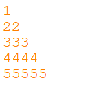
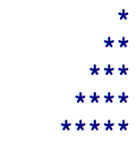

<dl>
  <dt>NIM :</dt>
  <dd>2141720103</dd>

  <dt>Nama :</dt>
  <dd>Afifah Nofa Kurnia Rahmadani</dd>
    
  <dt>kelas :</dt>
  <dd>1A</dd>
</dl>


___


# JOBSHEET 09 - Perulangan 2

## Tujuan
+ Mahasiswa memahami konsep perulangan bersarang (_nested loop_)
+ Mahasiswa dapat menjelaskan format penulisan perulangan bersarang (_nested loop_)
+ Mahasiswa dapat mengimplementasikan _flowchart_ perulangan bersarang menggunakan bahasa pemrograman Java

## Alat dan Bahan
+ PC/laptop
+ Browser(chrome, firefox, safari)
+ Koneksi internet
+ Anaconda3 + Java kernel (opsional)

## Praktikum
### Percobaan 1: Bintang Persegi
1. Perhatikan Flowchart di bawah ini

> flowchart di atas digunakan untuk menggambar sebuah persegi dengan simbol * (bintang)
2. Pada percobaan ke-1 akan dilakukan percobaan tentang _nested loop_. Kasus yang akan diselesaikan adalah untuk membuat tampilan persegi * , dengan panjang sisi sebanyak N. Misalkan N dimasukan **5**, maka hasilnya adalah

3. Karena program membutuhkan input dari keyboard, maka perlu import class Scanner
4. Ketikan kode program di bawah ini


```Java
// Tulis Kode program Percobaan 1 Langkah 4 di atas
import java.util.Scanner;

int N;
Scanner sc = new Scanner(System.in);
System.out.print("Masukkan nilai N : ");
N = sc.nextInt();

for(int i = 0; i <= N; i++){
    System.out.print("*");
}
```

    Masukkan nilai N : 5
    ******

5.	Perhatikan sintaks perulangan yang digunakan untuk mencetak * sebanyak N kali ke arah samping. Di tahap 4 di atas kode _looping **for**_ kita jadikan sebagai _**inner loop**_. 
6.	Kita looping lagi _inner loop_ sebanyak N kali untuk menghasilkan _output_ seperti tahap 2. Maka perlu ditambahkan perulangan luar (_outer loop_).


```Java
// Tulis Kode program Percobaan 1 Langkah 6 (gabungkan dengan inner loop pada langkah 4)
import java.util.Scanner;

int N;
Scanner sc = new Scanner(System.in);
System.out.print("Masukkan nilai N : ");
N = sc.nextInt();

for(int i = 0; i <= N; i++){
    for(int outer = 1; outer <= N; outer++){
    System.out.print("*");
}
}
```

    Masukkan nilai N : 5
    ******************************

#### Pertanyaan 
1. Apakah dengan menggabungkan _inner loop_ dan _outer loop_ seperti langkah 5 di atas sudah menghasilkan _output_ seperti gambar pada langkah 1?
2. Jika belum, silahkan modifikasi kode program sehingga menghasilkan output yang sesuai dengan gambar pada langkah 2?

#### Jawaban
1. output yang dihasilkan belum seperti gambar pada langkah 1. karena pada kode program diatas tidak ada fungsi System.out.println() untuk membuat baris baru
2. ...


```Java
// Tulis Kode program Percobaan 1 yang benar menurut kalian
import java.util.Scanner;

int N;
Scanner sc = new Scanner(System.in);
System.out.print("Masukkan nilai N : ");
N = sc.nextInt();

for(int i = 1; i <= N; i++){
    for(int outer = 1; outer <= N; outer++){
    System.out.print("*");
}
    System.out.println("");
}


```

    Masukkan nilai N : 5
    *****
    *****
    *****
    *****
    *****


***
### Percobaan 2: Bintang Segitiga
1.	Pada percobaan ke-2 akan dilakukan percobaan segitiga * sama siku dengan tinggi sebesar N. Misalkan N dimasukan **5**, maka hasilnya seperti gambar berikut

2. Karena program membutuhkan input dari keyboard, maka perlu import class Scanner
3. Ketikan kode program di bawah ini


```Java
// Tulis Kode program Percobaan 2 Langkah 3 di atas
Scanner sc = new Scanner(System.in);
System.out.print("Masukkan nilai N : ");
N = sc.nextInt();
int i = 0;

while (i <= N) {
    int j = 0;
    while(j < i) {
         System.out.print("*");
        j++;
    }
    i++;
}
```

    Masukkan nilai N : 5
    ***************

Amati kode program yang telah kalian tulis di atas.

#### Pertanyaan
1. Perhatikan, apakah output yang dihasilkan dengan nilai N = 5 sesuai dengan  tampilan seperti pada tahap 1 (Percobaan 2)?
2. Jika tidak sesuai, bagian mana saja yang harus diperbaiki/ditambahkan? Jelaskan setiap bagian yang perlu diperbaiki/ditambahkan. 

#### Jawaban
1. output yang dihasilkan belum seperti gambar pada tahap 1. karena pada kode program diatas tidak ada fungsi System.out.println() untuk membuat baris baru setelah menjalankan inner loop. sehingga output tidak berganti baris.
2. ...


```Java
// Tulis Kode program Percobaan 2 yang benar menurut kalian
Scanner sc = new Scanner(System.in);
System.out.print("Masukkan nilai N : ");
N = sc.nextInt();
int i = 0;

while (i <= N) {
    int j = 0;
    while(j < i) {
         System.out.print("*");
        j++;
    }
       System.out.println();
    i++;
}
```

    Masukkan nilai N : 5
    
    *
    **
    ***
    ****
    *****


***
### Percobaan 3: Segitiga Angka
1.	Pada percobaan ke-3 akan dilakukan percobaan segitiga angka sama siku dengan tinggi sebesar N. Misalkan N dimasukan **5**, maka hasilnya seperti berikut

2. Karena program membutuhkan input dari keyboard, maka perlu import class Scanner
3. Ketikan kode program di bawah ini


```Java
// Tulis Kode program Percobaan 3 Langkah 3 di atas, disini
import java.util.Scanner;

Scanner sc = new Scanner(System.in);
System.out.print("Masukkan nilai N : ");
int N = sc.nextInt();

for(int i = 1; i <= N; i++){
    for(int j = 1; j <= i; j++){

    System.out.print(j);
}
    System.out.println();
}
```

    Masukkan nilai N : 5
    1
    12
    123
    1234
    12345


#### Pertanyaan 
1. Apakah kode program di atas menghasilkan _output_ yang diharapkan?
2. Jika belum, kode program mana yang harus modifikasi? Jelaskan

#### Jawaban
1. output yang dihasilkan belum seperti yang diharapkan. karena pada kode program diatas statement yang dicetak adalah j yang menunjukan nilai kolom sebelum berganti baris.
2. ...


```Java
// Tulis Kode program Percobaan 3 yang benar menurut kalian
import java.util.Scanner;

Scanner sc = new Scanner(System.in);
System.out.print("Masukkan nilai N : ");
int N = sc.nextInt();

for(int i = 1; i <= N; i++){
    for(int j = 1; j <= i; j++){

    System.out.print(i);
}
    System.out.println();
}
```

    Masukkan nilai N : 5
    1
    22
    333
    4444
    55555


***
### Percobaan 4: Tebak Angka
1. Pada Percobaan 4 ini, kita akan belajar membuat kode untuk menebak angka menggunakan _nested loop_.
2. Pada percobaan ini kita menggunakan library Scanner untuk menangkap input dari keyboard dan Random untuk meng-generate angka secara acak
3. Ketik dan pahami kode program di bawah ini


```Java
// Tulis Kode program Percobaan 4 Langkah 3 di atas, disini
import java.util.Random;
Random random = new Random();
Scanner input = new Scanner(System.in);
char menu = 'y';

do{
    int number = random.nextInt(10) + 1 ;
    boolean sucess = false;
    do{
        System.out.print("Tebak angka (1-10) : ");
        int answer = input.nextInt();
        
        if(answer== number){
            System.out.println("yay... tebakan Anda benar....Selamat!!!");
            sucess = true;
        
        }
    } while(!sucess);

    System.out.print("Apakah anda ingin mengulang permainan (Y/y) : ");
    menu = input.nextLine().charAt(0);
}while(menu == 'y' || menu == 'Y');
```

    Tebak angka (1-10) : 2
    Tebak angka (1-10) : 3
    Tebak angka (1-10) : 1
    Tebak angka (1-10) : 5
    yay... tebakan Anda benar....Selamat!!!
    Apakah anda ingin mengulang permainan (Y/y) : 


    ---------------------------------------------------------------------------

    java.lang.StringIndexOutOfBoundsException: Index 0 out of bounds for length 0

    	at java.base/jdk.internal.util.Preconditions$1.apply(Preconditions.java:55)

    	at java.base/jdk.internal.util.Preconditions$1.apply(Preconditions.java:52)

    	at java.base/jdk.internal.util.Preconditions$4.apply(Preconditions.java:213)

    	at java.base/jdk.internal.util.Preconditions$4.apply(Preconditions.java:210)

    	at java.base/jdk.internal.util.Preconditions.outOfBounds(Preconditions.java:98)

    	at java.base/jdk.internal.util.Preconditions.outOfBoundsCheckIndex(Preconditions.java:106)

    	at java.base/jdk.internal.util.Preconditions.checkIndex(Preconditions.java:302)

    	at java.base/java.lang.String.checkIndex(String.java:4554)

    	at java.base/java.lang.StringLatin1.charAt(StringLatin1.java:46)

    	at java.base/java.lang.String.charAt(String.java:1513)

    	at .(#16:1)


#### Pertanyaan
1. Jelaskan alur program di atas!
2. Apa yang harus dilakukan untuk tidak melanjutkan (tidak mengulangi) permainan tersebut? 
3. Modifikasi program di atas, sehingga bisa menampilkan informasi mengenai : 
    1. input nilai tebakan yang dimasukan oleh user apakah lebih kecil atau lebih besar dari nilai random!
    2. hentikan _nested loop_ jika pengguna gagal menebak angka sampai 10x tebakan, dan beri pesan "Maaf Anda gagal menebak angka sebanyak 10x"

#### Jawaban
1. kode program tebak angka diatas menggunakan perulangan do while.jadi pertama kita membuat import class random pada baris awal program. lalu membuat deklarasi objek dari class random dan scanner. class random digunakan untuk mengacak angka. kemudian pada baris selanjutnya kita mencetak variabel dan membuat kode perulangan do while. ketika dijalankan kita akan diminta untuk memasukkan angka selama kondisi perulangan bernilai benar.jika angka yang kita tebak bernilai benar atau sesuai dengan angka yang terpilih pada saat pengacakan angka oleh class random maka akan muncul outpoy "yay.. tebakan anda benar.. selamat!!!"
2. maka kita harus menebak angka dengan benar. atau pada pernyataan "Apakah anda ingin melanjutkan permainan" kita memilih untuk tidak melanjutkanya.


```Java
/* Jawaban untuk Percobaan 4 Pertnyaan 3.A disini */
import java.util.Random;
Random random = new Random();
Scanner input = new Scanner(System.in);
char menu = 'y';

do{
    int number = random.nextInt(10)+1 ;
    boolean sucess = false;
    do{
        System.out.print("Tebak angka (1-10) : ");
        int answer = input.nextInt();
        
        if(answer== number){
            System.out.println("yay... tebakan Anda benar....Selamat!!!");
            sucess = true;
        
        }else if (answer<= number){
            System.out.println("Jawaban anda masukka lebih kecil dari nilai random!!!");
        }else{
            System.out.println("Jawaban anda masukka lebih besar dari nilai random!!!");
        }
         
    } while( !sucess);
    System.out.print("Apakah anda ingin mengulang permainan (Y/y) : ");
    menu = input.nextLine().charAt(0);
}while(menu == 'y' || menu == 'Y');

```

    Tebak angka (1-10) : 3
    Jawaban anda masukka lebih kecil dari nilai random!!!
    Tebak angka (1-10) : 5
    Jawaban anda masukka lebih kecil dari nilai random!!!
    Tebak angka (1-10) : 8
    Jawaban anda masukka lebih kecil dari nilai random!!!
    Tebak angka (1-10) : 9
    Jawaban anda masukka lebih kecil dari nilai random!!!
    Tebak angka (1-10) : 10
    yay... tebakan Anda benar....Selamat!!!
    Apakah anda ingin mengulang permainan (Y/y) : 


    ---------------------------------------------------------------------------

    java.lang.StringIndexOutOfBoundsException: Index 0 out of bounds for length 0

    	at java.base/jdk.internal.util.Preconditions$1.apply(Preconditions.java:55)

    	at java.base/jdk.internal.util.Preconditions$1.apply(Preconditions.java:52)

    	at java.base/jdk.internal.util.Preconditions$4.apply(Preconditions.java:213)

    	at java.base/jdk.internal.util.Preconditions$4.apply(Preconditions.java:210)

    	at java.base/jdk.internal.util.Preconditions.outOfBounds(Preconditions.java:98)

    	at java.base/jdk.internal.util.Preconditions.outOfBoundsCheckIndex(Preconditions.java:106)

    	at java.base/jdk.internal.util.Preconditions.checkIndex(Preconditions.java:302)

    	at java.base/java.lang.String.checkIndex(String.java:4554)

    	at java.base/java.lang.StringLatin1.charAt(StringLatin1.java:46)

    	at java.base/java.lang.String.charAt(String.java:1513)

    	at .(#16:1)


```Java
/* Jawaban untuk Percobaan 4 Pertnyaan 3.B disini */
import java.util.Random;
Random random = new Random();
Scanner input = new Scanner(System.in);
char menu = 'y';
int maxTebakan = 0;
do{
    int number = random.nextInt(10)+1 ;
    boolean sucess = false;
    do{
        System.out.print("Tebak angka (1-10) : ");
        int answer = input.nextInt();
        
        if(answer== number){
            System.out.println("yay... tebakan Anda benar....Selamat!!!");
            sucess = true;
        
        }else if (answer<= number){
            System.out.println("Jawaban anda masukka lebih kecil dari nilai random!!!");
        }else{
            System.out.println("Jawaban anda masukka lebih besar dari nilai random!!!");
        }
         maxTebakan++;
         if(maxTebakan==10){
             System.out.println("Maaf anda gagal menebak sebanyak 10 kali : ");
            sucess = true;
         }
    } while( !sucess);
    System.out.print("Apakah anda ingin mengulang permainan (Y/y) : ");
    menu = input.nextLine().charAt(0);
}while(menu == 'y' || menu == 'Y');
```

    Tebak angka (1-10) : 3
    Jawaban anda masukka lebih kecil dari nilai random!!!
    Tebak angka (1-10) : 1
    Jawaban anda masukka lebih kecil dari nilai random!!!
    Tebak angka (1-10) : 4
    Jawaban anda masukka lebih kecil dari nilai random!!!
    Tebak angka (1-10) : 2
    Jawaban anda masukka lebih kecil dari nilai random!!!
    Tebak angka (1-10) : 1
    Jawaban anda masukka lebih kecil dari nilai random!!!
    Tebak angka (1-10) : 9
    Jawaban anda masukka lebih besar dari nilai random!!!
    Tebak angka (1-10) : 5
    Jawaban anda masukka lebih kecil dari nilai random!!!
    Tebak angka (1-10) : 1
    Jawaban anda masukka lebih kecil dari nilai random!!!
    Tebak angka (1-10) : 2
    Jawaban anda masukka lebih kecil dari nilai random!!!
    Tebak angka (1-10) : 1
    Jawaban anda masukka lebih kecil dari nilai random!!!
    Maaf anda gagal menebak sebanyak 10 kali : 
    Apakah anda ingin mengulang permainan (Y/y) : 


    ---------------------------------------------------------------------------

    java.lang.StringIndexOutOfBoundsException: Index 0 out of bounds for length 0

    	at java.base/jdk.internal.util.Preconditions$1.apply(Preconditions.java:55)

    	at java.base/jdk.internal.util.Preconditions$1.apply(Preconditions.java:52)

    	at java.base/jdk.internal.util.Preconditions$4.apply(Preconditions.java:213)

    	at java.base/jdk.internal.util.Preconditions$4.apply(Preconditions.java:210)

    	at java.base/jdk.internal.util.Preconditions.outOfBounds(Preconditions.java:98)

    	at java.base/jdk.internal.util.Preconditions.outOfBoundsCheckIndex(Preconditions.java:106)

    	at java.base/jdk.internal.util.Preconditions.checkIndex(Preconditions.java:302)

    	at java.base/java.lang.String.checkIndex(String.java:4554)

    	at java.base/java.lang.StringLatin1.charAt(StringLatin1.java:46)

    	at java.base/java.lang.String.charAt(String.java:1513)

    	at .(#18:1)


### ***
## Tugas
### Soal 1
Buatlah program yang **sesuai** dengan alur _flowchart_ di bawah ini


Apabila kode program sesuai _flowchart_, maka untuk nilai N = 5 akan menghasilkan output seperti gambar berikut



```Java
/* Jawaban Soal 1 disini */
import java.util.Scanner;

int N;
Scanner sc = new Scanner(System.in);
System.out.print("Masukkan nilai N : ");
N = sc.nextInt();

for(int i = 1; i <= N; i++){
    for(int j = N; j >= i; j--){

    System.out.print(" ");
}
    for (int k=1; k<=i; k++){
    System.out.print("*");
}
     System.out.println();
}
```

    Masukkan nilai N : 5
         *
        **
       ***
      ****
     *****


kode program pada soal 1 untuk menampilkan output yang sesuai dengan flowchart dan memasukkan nilai N=5 seperti pada gambar diatas menggunakan perulangan bersarang for. menggunakan 3 variabel yaitu i,j,k. menggunakan 1 outer loop dan 2 inner loop.
pada outer loop (int i = 1; i <= N; i++), menggunakan variabel i lalu memberikannya nilai 1 sebagai awalan perulangan dimana kondisinya jika i kurang dari sama dengan N, maka akan dilakukan iterasi atau increment.
lalu pada inner loop 1. pada kode (int j = N; j >= i; j--)menggunakan variabel j lalu memberikannya nilai =N, dimana kondisinya jika j lebih dari sama dengan i, maka akan dilakukan decrement.
pada inner loop 2. pada kode (int k=1; k<=i; k++) menggunakan variabel k lalu memberikannya nilai 1, yang dimana kondisinya jika k kurang dari sama dengan i. maka akan dilakukan decrement.


***
### Soal 2
Buatlah program untuk mencetak tampilan persegi angka seperti di bawah ini berdasarkan input dari _keyboard_ N (nilai N minimal 3). Contoh N = 3, dan N = 5


```Java
/* Jawaban Soal 2 disini */

import java.util.Scanner;

Scanner sc = new Scanner(System.in);
System.out.print("Masukkan nilai N : ");
int N = sc.nextInt();

for(int i=0; i<N; i++){
    System.out.print(N);
    }
    System.out.println();
    for(int i=0; i<N-2; i++){
    System.out.print(N);
    for(int j=0; j<N-2; j++){
            System.out.print(" ");
        }
            System.out.println(N);
        }
        for(int i=0; i<N; i++){
    System.out.print(N);
    }
    System.out.println();
    }

```

    Masukkan nilai N : 3
    333
    3 3
    333


    |       }

    illegal start of statement

    


kode program diatas untuk mencetak tampilan persegi angka seperti di bawah ini berdasarkan input dari keyboard N. menggunakan perulangan bersarang for. sehingga output yang keluar angka hanya pada baris pertama dan terakhir dan kolom pertama dan terakhir

***
### Soal 3
Buatlah program untuk mencetak tampilan piramida * seperti gambar di bawah ini, tinggi piramida berdasarkan input dari _keyboard_ N (nilai N minimal 3). Contoh N = 3, dan N = 5


```Java
/* Jawaban Soal 3 disini */
import java.util.Scanner;
Scanner sc = new Scanner(System.in);
System.out.print("Masukkan tinggi n: ");
int tinggi = sc.nextInt();

for(int i = 1; i <= tinggi; i++){
         
    for(int j = i; j <= tinggi; j++){
        System.out.print(" ");
    }
    for(int k = 0; k <=(i*2)-2; k++){
        System.out.print("*");
    }
    System.out.println();
}

```

    Masukkan tinggi n: 5
         *
        ***
       *****
      *******
     *********


kode program di atas membentuk segitiga sama kaki atau piramida menggunakan input dari user untuk nenentukan nilai Tinggi dari piramida tersebut, untuk membuat bentuk segitiga, menggunakan 3 buah perulangan for, didalam perulangan for tersebut terdapat 3 buah variable yaitu i(tinggi),j(spasi) dan k(bintang).looping dimulai dari i, lalu didalamnya bersarang 2 buah perulangan for, yaitu untuk menghitung spasi dan jumlah bintang, pada baris pertama, program akan menghitung jumlah spasi terlebih dahulu, nilai pada variable s mengikuti nilai dari variable t, agar susunan bintangnya terlihat rapih serta berada ditengah.
Setelah selesai menghitung jumlah spasi pada baris pertama, selanjutnya program akan menghitung jumlah bintang pada perulangan for kedua, didalam perulangan for terdapat k<=(i*2)-2, untuk menyesuikan jumlah bintang perbarisnya, didalam perulangan tersebut akan mencetak 1 buah bintang.Terakhir setelah itu program akan menjalankan fungsi System.out.println() untuk membuat baris baru dan looping pertama selesai, selanjutnya looping kedua dan seterusnya sampai jumlah input (tinggi) yang telah ditentukan.


```Java

```
