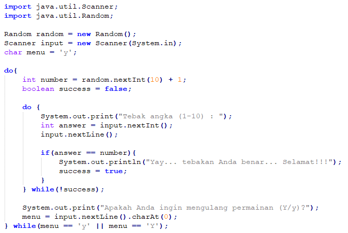

<dl>
  <dt>NIM :</dt> 2141720187
  <dd>...</dd>

  <dt>Nama :</dt> Alfino Febry Krissaputra
  <dd>...</dd>
    
  <dt>Kelas :</dt> TI-1A
  <dd>...</dd>
</dl>


___


# JOBSHEET 09 - Perulangan 2

## Tujuan
+ Mahasiswa memahami konsep perulangan bersarang (_nested loop_)
+ Mahasiswa dapat menjelaskan format penulisan perulangan bersarang (_nested loop_)
+ Mahasiswa dapat mengimplementasikan _flowchart_ perulangan bersarang menggunakan bahasa pemrograman Java

## Alat dan Bahan
+ PC/laptop
+ Browser(chrome, firefox, safari)
+ Koneksi internet
+ Anaconda3 + Java kernel (opsional)

## Praktikum
### Percobaan 1: Bintang Persegi
1. Perhatikan Flowchart di bawah ini

> flowchart di atas digunakan untuk menggambar sebuah persegi dengan simbol * (bintang)
2. Pada percobaan ke-1 akan dilakukan percobaan tentang _nested loop_. Kasus yang akan diselesaikan adalah untuk membuat tampilan persegi * , dengan panjang sisi sebanyak N. Misalkan N dimasukan **5**, maka hasilnya adalah

3. Karena program membutuhkan input dari keyboard, maka perlu import class Scanner
4. Ketikan kode program di bawah ini


```Java
// Tulis Kode program Percobaan 1 Langkah 4 di atas
import java.util.Scanner;

int N;
Scanner sc = new Scanner(System.in);
System.out.print("Masukan nilai N : ");
N = sc.nextInt();

for(int i = 0; i <= N; i++){
    System.out.print("*");
}

```

    Masukan nilai N : 4
    *****

5.	Perhatikan sintaks perulangan yang digunakan untuk mencetak * sebanyak N kali ke arah samping. Di tahap 4 di atas kode _looping **for**_ kita jadikan sebagai _**inner loop**_. 
6.	Kita looping lagi _inner loop_ sebanyak N kali untuk menghasilkan _output_ seperti tahap 2. Maka perlu ditambahkan perulangan luar (_outer loop_).


```Java
// Tulis Kode program Percobaan 1 Langkah 6 (gabungkan dengan inner loop pada langkah 4)
import java.util.Scanner;

int N;
Scanner sc = new Scanner(System.in);
System.out.print("Masukan nilai N : ");
N = sc.nextInt();

for(int outer = 1; outer <= N; outer++){
    for(int i = 0; i <= N; i++){
    System.out.print("*");
    }
}

```

    Masukan nilai N : 4
    ********************

#### Pertanyaan 
1. Apakah dengan menggabungkan _inner loop_ dan _outer loop_ seperti langkah 5 di atas sudah menghasilkan _output_ seperti gambar pada langkah 1?
2. Jika belum, silahkan modifikasi kode program sehingga menghasilkan output yang sesuai dengan gambar pada langkah 2?

#### Jawaban
1. belum, output yang diberikan belum sesuai
2. untuk bisa mendapatkan hasil seperti gambar perlu ditambahkan println setelah inner loop supaya berganti baris


```Java
// Tulis Kode program Percobaan 1 yang benar menurut kalian
import java.util.Scanner;

int N;
Scanner sc = new Scanner(System.in);
System.out.print("Masukan nilai N : ");
N = sc.nextInt();

for(int outer = 1; outer <= N; outer++){
    for(int i = 0; i <= N; i++){
    System.out.print("*");
    }
    System.out.println();
}

```

    Masukan nilai N : 4
    *****
    *****
    *****
    *****


***
### Percobaan 2: Bintang Segitiga
1.	Pada percobaan ke-2 akan dilakukan percobaan segitiga * sama siku dengan tinggi sebesar N. Misalkan N dimasukan **5**, maka hasilnya seperti gambar berikut

2. Karena program membutuhkan input dari keyboard, maka perlu import class Scanner
3. Ketikan kode program di bawah ini


```Java
// Tulis Kode program Percobaan 2 Langkah 3 di atas
Scanner sc = new Scanner(System.in);
System.out.print("Masukan nilai N : ");
int N = sc.nextInt();
int i = 0;
while(i <= N){
    int j = 0;
    while(j < i) {
        System.out.print("*");
        j++;
    }
    i++;
}

```

    Masukan nilai N : 4
    **********

Amati kode program yang telah kalian tulis di atas.

#### Pertanyaan
1. Perhatikan, apakah output yang dihasilkan dengan nilai N = 5 sesuai dengan  tampilan seperti pada tahap 1 (Percobaan 2)?
2. Jika tidak sesuai, bagian mana saja yang harus diperbaiki/ditambahkan? Jelaskan setiap bagian yang perlu diperbaiki/ditambahkan. 

#### Jawaban
1. tidak, output yang dihasilkan masih belum sesuai
2. perlu adar setelah selesai melakukan inner loop berganti baris, bisa dilakukan dengan meletakan println di dalam outer loop setelah inner loop


```Java
// Tulis Kode program Percobaan 2 yang benar menurut kalian
Scanner sc = new Scanner(System.in);
System.out.print("Masukan nilai N : ");
int N = sc.nextInt();
int i = 0;
while(i <= N){
    int j = 0;
    while(j < i) {
        System.out.print("*");
        j++;
    }
    System.out.println();
    i++;
}


```

    Masukan nilai N : 8
    
    *
    **
    ***
    ****
    *****
    ******
    *******
    ********


***
### Percobaan 3: Segitiga Angka
1.	Pada percobaan ke-3 akan dilakukan percobaan segitiga angka sama siku dengan tinggi sebesar N. Misalkan N dimasukan **5**, maka hasilnya seperti berikut

2. Karena program membutuhkan input dari keyboard, maka perlu import class Scanner
3. Ketikan kode program di bawah ini


```Java
// Tulis Kode program Percobaan 3 Langkah 3 di atas, disini
import java.util.Scanner;
Scanner input = new Scanner(System.in);
System.out.print("Masukan nilai N : ");
int N = input.nextInt();

for(int i = 1; i <= N; i++){
    for(int j = 1; j<= i; j++){
    System.out.print(j);
    }
    System.out.println();
}

```

    Masukan nilai N : 6
    1
    12
    123
    1234
    12345
    123456


#### Pertanyaan 
1. Apakah kode program di atas menghasilkan _output_ yang diharapkan?
2. Jika belum, kode program mana yang harus modifikasi? Jelaskan

#### Jawaban
1. belum
2. yang perlu dirubah adalah perintah output. bukan j tapi i yang di keluarkan


```Java
// Tulis Kode program Percobaan 3 yang benar menurut kalian
import java.util.Scanner;
Scanner input = new Scanner(System.in);
System.out.print("Masukan nilai N : ");
int N = input.nextInt();

for(int i = 1; i <= N; i++){
    for(int j = 1; j<= i; j++){
    System.out.print(i);
    }
    System.out.println();
}

```

    Masukan nilai N : 6
    1
    22
    333
    4444
    55555
    666666


***
### Percobaan 4: Tebak Angka
1. Pada Percobaan 4 ini, kita akan belajar membuat kode untuk menebak angka menggunakan _nested loop_.
2. Pada percobaan ini kita menggunakan library Scanner untuk menangkap input dari keyboard dan Random untuk meng-generate angka secara acak
3. Ketik dan pahami kode program di bawah ini



```Java
// Tulis Kode program Percobaan 4 Langkah 3 di atas, disini
import java.util.Scanner;
import java.util.Random;

Random random = new Random();
Scanner input = new Scanner(System.in);
char menu = 'y';

do{
    int number = random.nextInt(10) + 1;
    boolean success = false;
    
    do{
        System.out.print("Tebak angka (1-10) : ");
        int answer = input.nextInt();
        input.nextLine();
        
        if(answer == number){
            System.out.println("yeay...tebakan anda benar...Selamat!!!");
            success = true;
        }
    } while (!success);
    System.out.print("Apakah anda ingin melanjutkan permainan (Y/y) : ");
    menu = input.nextLine().charAt(0);
} while(menu == 'y' || menu == 'Y');

```

    Tebak angka (1-10) : 7
    Tebak angka (1-10) : 4
    Tebak angka (1-10) : 2
    yeay...tebakan anda benar...Selamat!!!
    Apakah anda ingin melanjutkan permainan (Y/y) : n


#### Pertanyaan
1. Jelaskan alur program di atas!
2. Apa yang harus dilakukan untuk tidak melanjutkan (tidak mengulangi) permainan tersebut? 
3. Modifikasi program di atas, sehingga bisa menampilkan informasi mengenai : 
    1. input nilai tebakan yang dimasukan oleh user apakah lebih kecil atau lebih besar dari nilai random!
    2. hentikan _nested loop_ jika pengguna gagal menebak angka sampai 10x tebakan, dan beri pesan "Maaf Anda gagal menebak angka sebanyak 10x"

#### Jawaban
1. pertama seperti biasa meng import tools yang diperlukan, dalam khasus ini Scanner dan Random, kemudian dideklarasikan.
    kemudian dalam outer loop akan dilakukan pengambilan nilai acak 1 angka dari 1-10. kemudiaan masuk ke inner loop. disini diminta input jika input yang dimasukan sama dengan nilai acak yang terpilih di outer loop, inner loop akan berhenti, namun jika tidak anak terus berulang hingga masukan benar. jika benar dan keluar dari inner loop, akan diminta input juka input yang diberikan Y atau y maka outer loop juga akan dihentikan. namun jika input yang diberikan adlah selain dari itu outer loop akan diulang. 
2. dalam program diatas syarat berhenti dari outer loop adalah memberkan input y/Y pada variabel menu. jadi jika tidak ingin mengulang caranya dengan memberikan input y/Y setelah berhasil keluar dari inner loop. namun untuk keluar dari inner loop dalam program diatas masih belum ada.


```Java
/* Jawaban untuk Percobaan 4 Pertnyaan 3.A disini */
import java.util.Scanner;
import java.util.Random;

Random random = new Random();
Scanner input = new Scanner(System.in);
char menu = 'y';

do{
    int number = random.nextInt(10) + 1;
    boolean success = false;
    
    do{
        System.out.print("Tebak angka (1-10) : ");
        int answer = input.nextInt();
        input.nextLine();
        
        if(answer == number){
            System.out.println("yeay...tebakan anda benar...Selamat!!!");
            success = true;
        }else if(answer <= number){
            System.out.println("Tebakan anda terlalu kecil!");
        }else {
            System.out.println("Tebakan anda terlalu besar!");
        }
    } while (!success);
    System.out.print("Apakah anda ingin melanjutkan permainan (Y/y) : ");
    menu = input.nextLine().charAt(0);
} while(menu == 'y' || menu == 'Y');

```

    Tebak angka (1-10) : 3
    Tebakan anda terlalu kecil!
    Tebak angka (1-10) : 4
    Tebakan anda terlalu kecil!
    Tebak angka (1-10) : 7
    Tebakan anda terlalu besar!
    Tebak angka (1-10) : 6
    yeay...tebakan anda benar...Selamat!!!
    Apakah anda ingin melanjutkan permainan (Y/y) : y
    Tebak angka (1-10) : 1
    Tebakan anda terlalu kecil!
    Tebak angka (1-10) : 7
    Tebakan anda terlalu besar!
    Tebak angka (1-10) : 4
    yeay...tebakan anda benar...Selamat!!!
    Apakah anda ingin melanjutkan permainan (Y/y) : n


```Java
/* Jawaban untuk Percobaan 4 Pertnyaan 3.B disini */
import java.util.Scanner;
import java.util.Random;

Random random = new Random();
Scanner input = new Scanner(System.in);
char menu = 'y';

do{
    int number = random.nextInt(10) + 1;
    boolean success = false;
    int ulang = 0;
    do{
        System.out.print("Tebak angka (1-10) : ");
        int answer = input.nextInt();
        input.nextLine();
        
        if(answer == number){
            System.out.println("yeay...tebakan anda benar...Selamat!!!");
            success = true;
        }else if(answer <= number){
            System.out.println("Tebakan anda terlalu kecil!");
        }else {
            System.out.println("Tebakan anda terlalu besar!");
        }
        ulang++;
    } while (!success && ulang <= 10);
    if(ulang >= 10){
        System.out.println("Maaf anda gagal menebak sebanyak 10x");
    }
    System.out.print("Apakah anda ingin melanjutkan permainan (Y/y) : ");
    menu = input.nextLine().charAt(0);
} while(menu == 'y' || menu == 'Y');

```

    Tebak angka (1-10) : 1
    Tebakan anda terlalu kecil!
    Tebak angka (1-10) : 1
    Tebakan anda terlalu kecil!
    Tebak angka (1-10) : 1
    Tebakan anda terlalu kecil!
    Tebak angka (1-10) : 1
    Tebakan anda terlalu kecil!
    Tebak angka (1-10) : 1
    Tebakan anda terlalu kecil!
    Tebak angka (1-10) : 1
    Tebakan anda terlalu kecil!
    Tebak angka (1-10) : 1
    Tebakan anda terlalu kecil!
    Tebak angka (1-10) : 1
    Tebakan anda terlalu kecil!
    Tebak angka (1-10) : 1
    Tebakan anda terlalu kecil!
    Tebak angka (1-10) : 1
    Tebakan anda terlalu kecil!
    Tebak angka (1-10) : 1
    Tebakan anda terlalu kecil!
    Maaf anda gagal menebak sebanyak 10x
    Apakah anda ingin melanjutkan permainan (Y/y) : n


# ***
## Tugas
### Soal 1
Buatlah program yang **sesuai** dengan alur _flowchart_ di bawah ini


Apabila kode program sesuai _flowchart_, maka untuk nilai N = 5 akan menghasilkan output seperti gambar berikut


```Java
/* Jawaban Soal 1 disini */
import java.util.Scanner;
Scanner input = new Scanner(System.in);
System.out.print("Masukan nilai N : ");
int N = input.nextInt();

int i = 1;
do{
    int j = N;
    do{
        if(i < j){
        System.out.print(" ");
        } else {
        System.out.print("*");
        }
    j--;
    }while (j >= 1);
    System.out.println();
    i++;
    
}while( i<= N);

```

    Masukan nilai N : 8
           *
          **
         ***
        ****
       *****
      ******
     *******
    ********


alur dari program diatas adalah. pertama setelah input. masuk ke loop pertama dan langsung diarahkam ke loop kedua. di loop kedua nilai n dimasukan ke variabel j karena saya tidak ingin merubah nilai n. loop yang dilakukan adalah jika nilai i (baris) kurang dari j print spasi jika tidak print *, lalu setiap loop nilai j dikurangi. perulangan ini dilakukan sampai nilai j 0. lalu kembali ke outer loop disini println agar ganti baris lalu tambahkan nilai i
outer loop ini terus berlangsung selama nilai i kurang dari samadengan n.

***
### Soal 2
Buatlah program untuk mencetak tampilan persegi angka seperti di bawah ini berdasarkan input dari _keyboard_ N (nilai N minimal 3). Contoh N = 3, dan N = 5


```Java
/* Jawaban Soal 2 disini */
import java.util.Scanner;
Scanner input = new Scanner(System.in);
System.out.print("Masukan nilai N (minimal 3) : ");
int n = input.nextInt();

int j = 1;
while(j <= n && n >= 3){
    int i = 1;
    if(j == 1 || j == n){
        while(i <= n){
            System.out.print(" " +n+ " ");
            i++;
        }
        
    }else{
        do{
        if(i == 1 || i == n){
            System.out.print(" " +n+ " ");
        }else{
            System.out.print("   ");
        }
        i++;
        } while(i <= n);
    }
    
    System.out.println();
    j++;
}

```

    Masukan nilai N (minimal 3) : 8
     8  8  8  8  8  8  8  8 
     8                    8 
     8                    8 
     8                    8 
     8                    8 
     8                    8 
     8                    8 
     8  8  8  8  8  8  8  8 


alur dari program diatas adalah, setelah memasukan nilai n, pada outer loop terdapat kondisi yang harus dipenuhi untuk terjadi loop. setelah itu didalam outer loop terdapat 2 kondisi dengan loop yang berbeda
jika pada baris pertama dan baris terakhir akan dilakukan loop print nilai n sebanyak n ke kanan
sedangkan kondisi kedua selain pada baris pertama dan terakhir print n hanya dilakukan di awal dan akhir baris dit engahnya adalah spasi.

***
### Soal 3
Buatlah program untuk mencetak tampilan piramida * seperti gambar di bawah ini, tinggi piramida berdasarkan input dari _keyboard_ N (nilai N minimal 3). Contoh N = 3, dan N = 5


```Java
/* Jawaban Soal 3 disini */
import java.util.Scanner;
Scanner input = new Scanner(System.in);
System.out.print("Masukan nilai N (minimal 3) : ");
int n = input.nextInt();

int i = 1, k = 1;
do{
    int j = n - k;
    while(j > 0){
        System.out.print(" ");
        j--;
    }
    int l = i;
    while(l > 0){
        System.out.print("*");
        l--;
    }
    i+=2;
    k++;
    System.out.println();
}while (k <= n);
```

    Masukan nilai N (minimal 3) : 6
         *
        ***
       *****
      *******
     *********
    ***********


penjelasan
setelah import dan deklarasi seperti biasa saya membuat variabel i yang mewakili jumlah bintang dari setiap baris, akan ditambah 2 setiap pengulangan terluar.
dan variabel k yang mewakili baris yang nantinya akan ditambah 1 disetiap perulangan outer loop. 
pada outer loop terdapat int j = n - k;
variabel ini saya buat mewakili jumlah spasi di setiap baris jadi artinya variabel j adalah nilai n dikurangi nomor baris k, yang nantinya menjadi jumlah spasi baris k tersebut.
pada inner loop pertama terdapat pengeluaran spasi, setiap pengulangan jumlah spasi pada baris itu (j) dikurangi hingga nilainya 0.
pada pengulangan inner kedua adalah pengeluaran simbol *. disini saya memasukan nilai i ke dalam variabel l karena saya tidak ingin merubah nilai variabel i namun untuk membuat loop yang saya inginkan diperlukan nilai i, baik setelah dirubah dan sebelum dirubah. jadi di sini mengeluarkan output hingga nilai l 0'
kemudian setelah keluar inner loop ada penambahan nilai i(jumlah bintang per baris) sebanyak 2 dan nilai k (baris) sebanyak 1. kemudian ada println kosong untuk mengganti baris.
outer loop dilakukan sampai nilai k (baris) sama dengan nilai yang dimasukan.
