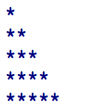

<dl>
  <dt>NIM :</dt>
  <dd>2141720054</dd>

  <dt>Nama :</dt>
  <dd>Diah Putri Nofianti</dd>
    
  <dt>Kelas :</dt>
  <dd>1A-TI</dd>
</dl>


___


# JOBSHEET 09 - Perulangan 2

## Tujuan
+ Mahasiswa memahami konsep perulangan bersarang (_nested loop_)
+ Mahasiswa dapat menjelaskan format penulisan perulangan bersarang (_nested loop_)
+ Mahasiswa dapat mengimplementasikan _flowchart_ perulangan bersarang menggunakan bahasa pemrograman Java

## Alat dan Bahan
+ PC/laptop
+ Browser(chrome, firefox, safari)
+ Koneksi internet
+ Anaconda3 + Java kernel (opsional)

## Praktikum
### Percobaan 1: Bintang Persegi
1. Perhatikan Flowchart di bawah ini

> flowchart di atas digunakan untuk menggambar sebuah persegi dengan simbol * (bintang)
2. Pada percobaan ke-1 akan dilakukan percobaan tentang _nested loop_. Kasus yang akan diselesaikan adalah untuk membuat tampilan persegi * , dengan panjang sisi sebanyak N. Misalkan N dimasukan **5**, maka hasilnya adalah

3. Karena program membutuhkan input dari keyboard, maka perlu import class Scanner
4. Ketikan kode program di bawah ini


```Java
import java.util.Scanner;
Scanner input=new Scanner(System.in);

System.out.print("Masukkan nilai N : ");
int n=input.nextInt();

for(int i=0; i<=n; i++){
    System.out.print("*");
}
```

    Masukkan nilai N : 1
    **

5.	Perhatikan sintaks perulangan yang digunakan untuk mencetak * sebanyak N kali ke arah samping. Di tahap 4 di atas kode _looping **for**_ kita jadikan sebagai _**inner loop**_. 
6.	Kita looping lagi _inner loop_ sebanyak N kali untuk menghasilkan _output_ seperti tahap 2. Maka perlu ditambahkan perulangan luar (_outer loop_).


```Java
for(int outer=1; outer<=n; outer++){
}
```


```Java
System.out.print("Masukkan nilai N : ");
n=input.nextInt();

for(int outer=1; outer<=n; outer++){
    for(int i=0; i<=n; i++){
        System.out.print("*");
    }
}
```

    Masukkan nilai N : 2
    ******

#### Pertanyaan 
1. Apakah dengan menggabungkan _inner loop_ dan _outer loop_ seperti langkah 5 di atas sudah menghasilkan _output_ seperti gambar pada langkah 1?
2. Jika belum, silahkan modifikasi kode program sehingga menghasilkan output yang sesuai dengan gambar pada langkah 2!

#### Jawaban
*1. Outputnya belum tepat, karena masih kelebihan. Misal, disaat inputnya 2 seharusnya output 4 bintang, tetapi disitu kelebihan 2 bintang.*

*2. Bisa dengan mengganti nilai i=1 atau bisa juga kondisi i<n, bisa dipilih salah satu. Lalu untuk enter agar tampilan sesuai dengan contoh, maka dapat ditambahi perintah print next line.*


```Java
System.out.print("Masukkan nilai N : ");
n=input.nextInt();

for(int outer=1; outer<=n; outer++){
    for(int i=1; i<=n; i++){
        System.out.print("*");
    }
        System.out.println();
}
```

    Masukkan nilai N : 6
    ******
    ******
    ******
    ******
    ******
    ******


***
### Percobaan 2: Bintang Segitiga
1.	Pada percobaan ke-2 akan dilakukan percobaan segitiga * sama siku dengan tinggi sebesar N. Misalkan N dimasukan **5**, maka hasilnya seperti gambar berikut

2. Karena program membutuhkan input dari keyboard, maka perlu import class Scanner
3. Ketikan kode program di bawah ini


```Java
System.out.print("Masukkan nilai N = ");
int n=input.nextInt();

int i=0;
while(i<=n){
    int j=0;   
    while(j<i){
        System.out.print("*");
        j++;
    }
    i++;
}
```

    Masukkan nilai N = 4
    **********

Amati kode program yang telah kalian tulis di atas.

#### Pertanyaan
1. Perhatikan, apakah output yang dihasilkan dengan nilai N = 5 sesuai dengan  tampilan seperti pada tahap 1 (Percobaan 2)?
2. Jika tidak sesuai, bagian mana saja yang harus diperbaiki/ditambahkan? Jelaskan setiap bagian yang perlu diperbaiki/ditambahkan. 

#### Jawaban
*1. Untuk ouput jumlah bintang sudah sesuai, tapi karena hanya tampil dalam satu baris, maka perlu memasukkan perintah ganti baris agar persis seperti contoh.*

*2. Menambah perintah print next line.*


```Java
Scanner input = new Scanner(System.in);
System.out.print("Masukkan nilai N = ");
int n = input.nextInt();

int i=0;
while(i<=n){
    int j=0;
    while(j<i){
        System.out.print("*");
        j++;
    }
    System.out.println();
    i++;
}
```

    Masukkan nilai N = 8
    
    *
    **
    ***
    ****
    *****
    ******
    *******
    ********


***
### Percobaan 3: Segitiga Angka
1.	Pada percobaan ke-3 akan dilakukan percobaan segitiga angka sama siku dengan tinggi sebesar N. Misalkan N dimasukan **5**, maka hasilnya seperti berikut

2. Karena program membutuhkan input dari keyboard, maka perlu import class Scanner
3. Ketikan kode program di bawah ini


```Java
System.out.print("Masukkan nilai N : ");
int n=input.nextInt();

for(int i=1; i<=n; i++){
    for(int j=1; j<=i; j++){
        System.out.print(j);
    }
    System.out.println();
}
```

    Masukkan nilai N : 6
    1
    12
    123
    1234
    12345
    123456


#### Pertanyaan 
1. Apakah kode program di atas menghasilkan _output_ yang diharapkan?
2. Jika belum, kode program mana yang harus modifikasi? Jelaskan

#### Jawaban
*1. Belum, karena jelas disitu output pada setiap baris menghasilkan angka yang berurutan, bukan angka yang sama jadi tidak sesuai seperti contoh.*

*2. Untuk itu harus mengganti output, yang awalnya perintah print out varibel j diubah ke perintah print out untuk variabel i.*


```Java
System.out.print("Masukkan nilai N : ");
int n=input.nextInt();

for(int i=1; i<=n; i++){
    for(int j=1; j<=i; j++){
        System.out.print(i);
    }
    System.out.println();
}
```

    Masukkan nilai N : 8
    1
    22
    333
    4444
    55555
    666666
    7777777
    88888888


***
### Percobaan 4: Tebak Angka
1. Pada Percobaan 4 ini, kita akan belajar membuat kode untuk menebak angka menggunakan _nested loop_.
2. Pada percobaan ini kita menggunakan library Scanner untuk menangkap input dari keyboard dan Random untuk meng-generate angka secara acak
3. Ketik dan pahami kode program di bawah ini


```Java
import java.util.Scanner;
import java.util.Random;

Random random=new Random();
Scanner input=new Scanner(System.in);

char menu='y';

do{
    int number=random.nextInt(10)+1;
    boolean success=false;
    
    do{
        System.out.print("Tebak angka (1-10) : ");
        int answer=input.nextInt();
        input.nextLine();
        
        if(answer==number){
            System.out.println("Yay... Tebakan Anda benar... Selamat!!!");
            success=true;
        }
        
    } while(!success);
        
    System.out.print("Apakah Anda ingin mengulang permainan? (Y/y) : ");
    menu=input.nextLine().charAt(0);
    
} while(menu=='y'||menu=='Y');
```

    Tebak angka (1-10) : 1
    Tebak angka (1-10) : 5
    Tebak angka (1-10) : 3
    Yay... Tebakan Anda benar... Selamat!!!
    Apakah Anda ingin mengulang permainan? (Y/y) : y
    Tebak angka (1-10) : 5
    Tebak angka (1-10) : 1
    Tebak angka (1-10) : 8
    Yay... Tebakan Anda benar... Selamat!!!
    Apakah Anda ingin mengulang permainan? (Y/y) : n


#### Pertanyaan
1. Jelaskan alur program di atas!
2. Apa yang harus dilakukan untuk tidak melanjutkan (tidak mengulangi) permainan tersebut? 
3. Modifikasi program di atas, sehingga bisa menampilkan informasi mengenai : 
    1. input nilai tebakan yang dimasukan oleh user apakah lebih kecil atau lebih besar dari nilai random!
    2. hentikan _nested loop_ jika pengguna gagal menebak angka sampai 10x tebakan, dan beri pesan "Maaf Anda gagal menebak angka sebanyak 10x"

#### Jawaban
*1. Jadi ada import random untuk menentukan angka secara acak (1-10) untuk ditebak, dengan cara meminta user menginputkan angka secara terus menerus (di dalam inner loop dengan do-while) sampai input tersebut tepat sesuai dengan angka yang ditentukan random tadi. Setelah berhasil menebak dengan benar, maka akan muncul output yay... tebakan benar, diikuti dengan pertanyaan untuk memilih kondisi yaitu memilih untuk lanjut bermain atau berhenti. Untuk melanjutkan, user dapat menginputkan huruf Y/y dan jika user memilih untuk berhenti, user dapat menginputkan karakter selain Y tadi.*

*2. Permainan pertama kali harus bisa menebak sampai benar, lalu setelah itu akan ada pilihan untuk mengulang permainan atau tidak, dengan menginputkan karakter lain selain Y/y maka program akan berhenti.*


```Java
do{
    int number=random.nextInt(10)+1;
    boolean success=false;
    
    do{
        System.out.print("\nTebak angka (1-10) : ");
        int answer = input.nextInt();
        input.nextLine();
        
        if(answer==number){
            System.out.println("Yay... Tebakan Anda benar... Selamat!!!");
            success = true;
        } else if(answer<number){
            System.out.println("Angka yang Anda masukkan lebih kecil daripada jawaban");
        } else  
            System.out.println("Angka yang Anda masukkan lebih besar daripada jawaban");
        
    } while(!success);
        
    System.out.print("\nApakah Anda ingin mengulang permainan? (Y/y) : ");
    menu=input.nextLine().charAt(0);
    
} while(menu=='y'||menu=='Y');
```

    
    Tebak angka (1-10) : 1
    Angka yang Anda masukkan lebih kecil daripada jawaban
    
    Tebak angka (1-10) : 4
    Angka yang Anda masukkan lebih kecil daripada jawaban
    
    Tebak angka (1-10) : 3
    Angka yang Anda masukkan lebih kecil daripada jawaban
    
    Tebak angka (1-10) : 7
    Angka yang Anda masukkan lebih besar daripada jawaban
    
    Tebak angka (1-10) : 5
    Angka yang Anda masukkan lebih kecil daripada jawaban
    
    Tebak angka (1-10) : 6
    Yay... Tebakan Anda benar... Selamat!!!
    
    Apakah Anda ingin mengulang permainan? (Y/y) : n


```Java
do{
    int number=random.nextInt(10)+1;
    boolean success=false;
    int n=0;
    
    do{
        System.out.print("\nTebak angka (1-10) : ");
        int answer = input.nextInt();
        input.nextLine();
 
        if(answer==number){
            System.out.println("Yay... Tebakan Anda benar... Selamat!!!");
            success = true;
        } else if(answer<number){
            System.out.println("Angka yang Anda masukkan lebih kecil daripada jawaban");
        } else  
            System.out.println("Angka yang Anda masukkan lebih besar daripada jawaban");
               
        n++;
        if(n==10){
         System.out.println("\nMaaf, Anda gagal menebak sebanyak 10x");
         break;
        } 
        
    } while(!success); 
        
    System.out.print("\nApakah Anda ingin mengulang permainan? (Y/y) : ");
    menu=input.nextLine().charAt(0);
    
} while(menu=='y'||menu=='Y');
```

    
    Tebak angka (1-10) : 1
    Angka yang Anda masukkan lebih kecil daripada jawaban
    
    Tebak angka (1-10) : 2
    Angka yang Anda masukkan lebih kecil daripada jawaban
    
    Tebak angka (1-10) : 1
    Angka yang Anda masukkan lebih kecil daripada jawaban
    
    Tebak angka (1-10) : 0
    Angka yang Anda masukkan lebih kecil daripada jawaban
    
    Tebak angka (1-10) : 2
    Angka yang Anda masukkan lebih kecil daripada jawaban
    
    Tebak angka (1-10) : 1
    Angka yang Anda masukkan lebih kecil daripada jawaban
    
    Tebak angka (1-10) : 7
    Angka yang Anda masukkan lebih besar daripada jawaban
    
    Tebak angka (1-10) : 4
    Angka yang Anda masukkan lebih besar daripada jawaban
    
    Tebak angka (1-10) : 3
    Yay... Tebakan Anda benar... Selamat!!!
    
    Apakah Anda ingin mengulang permainan? (Y/y) : y
    
    Tebak angka (1-10) : 1
    Angka yang Anda masukkan lebih kecil daripada jawaban
    
    Tebak angka (1-10) : 2
    Angka yang Anda masukkan lebih kecil daripada jawaban
    
    Tebak angka (1-10) : 1
    Angka yang Anda masukkan lebih kecil daripada jawaban
    
    Tebak angka (1-10) : 2
    Angka yang Anda masukkan lebih kecil daripada jawaban
    
    Tebak angka (1-10) : 0
    Angka yang Anda masukkan lebih kecil daripada jawaban
    
    Tebak angka (1-10) : 11
    Angka yang Anda masukkan lebih besar daripada jawaban
    
    Tebak angka (1-10) : 10
    Angka yang Anda masukkan lebih besar daripada jawaban
    
    Tebak angka (1-10) : 12
    Angka yang Anda masukkan lebih besar daripada jawaban
    
    Tebak angka (1-10) : 1
    Angka yang Anda masukkan lebih kecil daripada jawaban
    
    Tebak angka (1-10) : 0
    Angka yang Anda masukkan lebih kecil daripada jawaban
    
    Maaf, Anda gagal menebak sebanyak 10x
    
    Apakah Anda ingin mengulang permainan? (Y/y) : n


***
## Tugas
### Soal 1
Buatlah program yang **sesuai** dengan alur _flowchart_ di bawah ini


Apabila kode program sesuai _flowchart_, maka untuk nilai N = 5 akan menghasilkan output seperti gambar berikut


```Java
import java.util.Scanner;
Scanner input=new Scanner(System.in);

System.out.print("Masukkan nilai N : ");
int n=input.nextInt();

for(int i=1; i<=n; i++){
    for(int j=n; j>=1; j--){ 
        System.out.print(i<j?" ":"*");
    }
    System.out.println();
}
```

    Masukkan nilai N : 10
             *
            **
           ***
          ****
         *****
        ******
       *******
      ********
     *********
    **********


*Pada outer loop terdapat inisialisasi variabel i untuk berapa jumlah baris yang harus ditampilkan sesuai dengan nilai inputan. Lalu di inner loop variabel j disitu untuk tiap jumlah tiap bintang yang akan ditampilkan tiap barisnya. Menggunakan ternary operator untuk kondisi jika nilai i kurang dari j maka akan menampilkan spasi, jika lebih akan menampilkan bintang. Setelah itu masih ditambah print next line di outer loop agar dapat berganti baris. Karena itu, bintang yang menjadi output dapat membentuk segitiga siku-siku yang seperti pada contoh.*

***
### Soal 2
Buatlah program untuk mencetak tampilan persegi angka seperti di bawah ini berdasarkan input dari _keyboard_ N (nilai N minimal 3). Contoh N = 3, dan N = 5


```Java
import java.util.Scanner;
Scanner input=new Scanner(System.in);

System.out.print("Masukkan nilai (minimal 3) : ");
int n=input.nextInt();

for(int x=1; x<=n; x++){
    for(int y=1; y<=n; y++){
   if(x==1||x==n)
        System.out.print(" "+n);
    else if(y==1||y==n)
        System.out.print(" "+n);
    else
        System.out.print("  ");
    }
    System.out.println();
}
```

    Masukkan nilai (minimal 3) : 7
     7 7 7 7 7 7 7
     7           7
     7           7
     7           7
     7           7
     7           7
     7 7 7 7 7 7 7


*Jadi, outer loop adalah jumlah barisnya sesuai dengan inputan. Lalu, di dalam inner loop menggunakan kondisi if-else if yakni pertama, jika nilai sama dengan ada di baris pertama dan baris yang sesuai dengan inputan maka akan ditampilkan nilai inputan tersebut. Untuk kedua, jika nilai sama dengan ada di kolom pertama dan kolom yang nilainya sesuai inputan maka juga akan ditampilkan inputan tadi. Dan jika tidak memenuhi maka akan diisi dengan spasi yang mengakibatkan bentuk tampilan di output seperti persegi dari angka inputan yang tengahnya kosong.*

***
### Soal 3
Buatlah program untuk mencetak tampilan piramida * seperti gambar di bawah ini, tinggi piramida berdasarkan input dari _keyboard_ N (nilai N minimal 3). Contoh N = 3, dan N = 5


```Java
import java.util.Scanner;
Scanner input=new Scanner(System.in);

System.out.print("Masukkan nilai N : ");
int n=input.nextInt();

for(int i=1; i<=n; i++){
    for(int j=n; j>=1; j--){ 
        System.out.print(i<j?" ":"*");
    }
    for(int l=1; l<=i-1; l++){
            System.out.print("*");
}
    System.out.println();
    }
```

    Masukkan nilai N : 8
           *
          ***
         *****
        *******
       *********
      ***********
     *************
    ***************


*Dari kode program tugas nomor satu tadi tinggal ditambahkan dengan inner loop lagi yang dengan variabel l dengan memulai outputnya di baris kedua karena kondisinya disitu variabel baris i dikurangi satu, untuk dapat menampilkan segitiga sama kaki yang terdiri dari simbol bintang seperti pada contoh.*
