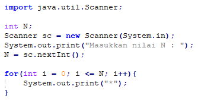

<dl>
  <dt>NIM :</dt>
  <dd>2141720175</dd>

  <dt>Nama :</dt>
  <dd>Fikril Hadad Ramadhani</dd>
    
  <dt>Kelas :</dt>
  <dd>1A</dd>
</dl>


___


# JOBSHEET 09 - Perulangan 2

## Tujuan
+ Mahasiswa memahami konsep perulangan bersarang (_nested loop_)
+ Mahasiswa dapat menjelaskan format penulisan perulangan bersarang (_nested loop_)
+ Mahasiswa dapat mengimplementasikan _flowchart_ perulangan bersarang menggunakan bahasa pemrograman Java

## Alat dan Bahan
+ PC/laptop
+ Browser(chrome, firefox, safari)
+ Koneksi internet
+ Anaconda3 + Java kernel (opsional)

## Praktikum
### Percobaan 1: Bintang Persegi
1. Perhatikan Flowchart di bawah ini

> flowchart di atas digunakan untuk menggambar sebuah persegi dengan simbol * (bintang)
2. Pada percobaan ke-1 akan dilakukan percobaan tentang _nested loop_. Kasus yang akan diselesaikan adalah untuk membuat tampilan persegi * , dengan panjang sisi sebanyak N. Misalkan N dimasukan **5**, maka hasilnya adalah

3. Karena program membutuhkan input dari keyboard, maka perlu import class Scanner
4. Ketikan kode program di bawah ini



```Java
// Tulis Kode program Percobaan 1 Langkah 4 di atas
import java.util.Scanner;
Scanner scan = new Scanner(System.in);
int n;
System.out.print("Masukkan Nilai N : ");
n = scan.nextInt();

  for (int j = 0; j <= n; j++) {
    System.out.print("*");
  }

```

    Masukkan Nilai N : 5
    ******

Saya melakukan deklarasi Scanner dan int n. Kemudian meminta input dari user berupa bilangan bulat yang akan disimpan di variabel n. Para perulangan, kita inisialisasi int j dengan nilai 0, kemudian kita menentukan nilai boolean pada ekspresi kedua, yaitu nilai j kurang dari sama dengan n. Terakhir, kita lakukan operasi increment pada variabel j setiap kali perulangan selesai dilakukan. perulangan ini sendiri dilakukan dengan harapkan untuk mencetak * sebanyak bilangan bulat yang user masukkan. namun karena terjadi kesalahan saat inisialisasi nilai j, maka output yang ditampilkan tidak sesuai dengan yang diharapkan.

5.	Perhatikan sintaks perulangan yang digunakan untuk mencetak * sebanyak N kali ke arah samping. Di tahap 4 di atas kode _looping **for**_ kita jadikan sebagai _**inner loop**_. 
6.	Kita looping lagi _inner loop_ sebanyak N kali untuk menghasilkan _output_ seperti tahap 2. Maka perlu ditambahkan perulangan luar (_outer loop_).


```Java
// Tulis Kode program Percobaan 1 Langkah 6 (gabungkan dengan inner loop pada langkah 4)
import java.util.Scanner;
Scanner scan = new Scanner(System.in);
int n;
System.out.print("Masukkan Nilai N : ");
n = scan.nextInt();

int i = 1;
while ( i <= n ) {
  for (int j = 0; j <= n; j++) {
    System.out.print("*");
  }
  System.out.println();
  i++;
}
```

    Masukkan Nilai N : 5
    ******
    ******
    ******
    ******
    ******


kita menambahkan perulangan pada bagian luar dengan harapan kita bisa menambahkan output ke arah vertikal. jadi untuk perulangan pada bagian luar akan fokus ke arah vertikal(bawah), sedangkan perulangan dalam akan fokus ke arah horizontal(kanan).

#### Pertanyaan 
1. Apakah dengan menggabungkan _inner loop_ dan _outer loop_ seperti langkah 5 di atas sudah menghasilkan _output_ seperti gambar pada langkah 1?
2. Jika belum, silahkan modifikasi kode program sehingga menghasilkan output yang sesuai dengan gambar pada langkah 2?

#### Jawaban
1. Belum, karena pada output baris, program mencetak * lebih dari yang diinputkan oleh user.
2. 


```Java
// Tulis Kode program Percobaan 1 yang benar menurut kalian
int n;
System.out.print("Masukkan Nilai N : ");
n = scan.nextInt();

int i = 1;
while ( i <= n ) {
  for (int j = 1; j <= n; j++) {
    System.out.print("*");
  }
  System.out.println();
  i++;
}
```

    Masukkan Nilai N : 5
    *****
    *****
    *****
    *****
    *****


Saya melakukan perbaikan pada deklarasi nilai i dan j. Dengan memasukkan nilai i dan j bernilai 1, maka jumlah output akan sama dengan jumlah input yang dimasukkan oleh user. Sebenarnya ada cara lain untuk mendapatkan hasil yang sama dengan nilai i dan j sama dengan 0. yaitu dengan mengubah ekpresi boolean pada perulangan, yaitu menjadi i < n dan j < n. 

***
### Percobaan 2: Bintang Segitiga
1.	Pada percobaan ke-2 akan dilakukan percobaan segitiga * sama siku dengan tinggi sebesar N. Misalkan N dimasukan **5**, maka hasilnya seperti gambar berikut

2. Karena program membutuhkan input dari keyboard, maka perlu import class Scanner
3. Ketikan kode program di bawah ini


```Java
// Tulis Kode program Percobaan 2 Langkah 3 di atas
import java.util.Scanner;
Scanner sc = new Scanner(System.in);
System.out.print("Masukkan nilai N = ");
int n = sc.nextInt();
int i = 0;
while (i <= n) {
    int j = 0;
    while (j < i) {
        System.out.print("*");
        j++;
    }
    i++;
}
```

    Masukkan nilai N = 5
    ***************

Hampir sama dengan kasus sebelumnya, tapi terdapat sedikit perbedaan dengan kasus satu ini. Dimana tidak ada yang bertanggung jawab atas perulangan yang mengarah ke bawah (vertikal).

Amati kode program yang telah kalian tulis di atas.

#### Pertanyaan
1. Perhatikan, apakah output yang dihasilkan dengan nilai N = 5 sesuai dengan  tampilan seperti pada tahap 1 (Percobaan 2)?
2. Jika tidak sesuai, bagian mana saja yang harus diperbaiki/ditambahkan? Jelaskan setiap bagian yang perlu diperbaiki/ditambahkan. 

#### Jawaban
1. Belum.
2. Menurut saya, bagian yang perlu diperbaiki adalah pada perulangan luar dan dalamnya. pada perulangan luar terutama pada nilai int i yang seharusnya adalah 1. kemudian kita juga perlu menambakan print new line pada perulangan luar. kita akan menempatkan print new line ini tepat dibawah perulangan dalam. Pada perulangan dalam, yang perlu kita ubah adalah nilai boolean menjadi j <= i. Dengan begini, perulangan dalam akan mencetak * sebanyak baris yang ada.


```Java
// Tulis Kode program Percobaan 2 yang benar menurut kalian
int n;
System.out.print("Masukkan nilai N : ");
n = sc.nextInt();
int i = 1;
while (i <= n) {
    int j = 1;
    while (j <= i) {
        System.out.print("*");
        j++;
    }
    System.out.println();
    i++;
}
```

    Masukkan nilai N : 5
    *
    **
    ***
    ****
    *****


Seperti yang telah saya jelaskan pada nomer 2, jika pada program ini, saya hanya melakukan sedikit perubahan dengan kodenya. Pertama adalah kondisi boolean pada perulangan dalam, menjadi j <= i. Dengan mengubah ini, output vertikal dan horizontal akan memiliki jumlah yang sama. kedua, yaitu pada perulangan luar, saya tambahkan System.out.println(); yang gunanya untuk memberikan enter(output ke arah vertikal).

***
### Percobaan 3: Segitiga Angka
1.	Pada percobaan ke-3 akan dilakukan percobaan segitiga angka sama siku dengan tinggi sebesar N. Misalkan N dimasukan **5**, maka hasilnya seperti berikut

2. Karena program membutuhkan input dari keyboard, maka perlu import class Scanner
3. Ketikan kode program di bawah ini


```Java
// Tulis Kode program Percobaan 3 Langkah 3 di atas, disini
import java.util.Scanner;

Scanner input = new Scanner(System.in);

System.out.print("Masukkan nilai N : ");
int n = input.nextInt();

for (int i = 1; i <= n; i++) {
    for (int j = 1; j <= i; j++) {
        System.out.print(j);
    }
    System.out.println();
}
```

    Masukkan nilai N : 5
    1
    12
    123
    1234
    12345


kita ingin mencetak 1 pada baris 1 dengan jumlah 1 kali output, mencetak 2 pada baris ke-2 dengan jumlah 2 kali output, dan seterusnya. Tapi ada perintah yang error disini, yaitu pada perulangan dalam, tepatnya pada perintah Sout. Kesalahannya akan saya bahas pada kode program selanjutnya.

#### Pertanyaan 
1. Apakah kode program di atas menghasilkan _output_ yang diharapkan?
2. Jika belum, kode program mana yang harus modifikasi? Jelaskan

#### Jawaban
1. Belum.
2. Tentu saja, hal ini terjadi pada perulangan bagian dalam. Kita seharusnya mencetak nilai dari i, yang pada perulangan bagian dalam ini, nilainya akan tetap. Bukan mencetak nilai dari j yang nilainya akan di increment pada setiap perulangan.


```Java
// Tulis Kode program Percobaan 3 yang benar menurut kalian
import java.util.Scanner;
Scanner kucing = new Scanner(System.in);

int n;
System.out.print("Masukkan nilai N : ");
n = kucing.nextInt();

int i = 1;
while ( i <= n ) {
    int j = 1;
    while ( j <= i ) {
        System.out.print(i);
        j++;
    }
    System.out.println();
    i++;
}
```

    Masukkan nilai N : 5
    1
    22
    333
    4444
    55555


Nah, kesalahan yang saya maksud pada program sebelumnya adalah pada Sout. seharusnya kita mencetak nilai dari i, bukan nilai dari j. karena pada perulangan dalam, nilai j akan mengalami increment setiap kali loop. tidak dengan nilai i yang akan di increment pada perulangan luar, tepatnya setelah mencetak enter.

 ***
### Percobaan 4: Tebak Angka
1. Pada Percobaan 4 ini, kita akan belajar membuat kode untuk menebak angka menggunakan _nested loop_.
2. Pada percobaan ini kita menggunakan library Scanner untuk menangkap input dari keyboard dan Random untuk meng-generate angka secara acak
3. Ketik dan pahami kode program di bawah ini


```Java
// Tulis Kode program Percobaan 4 Langkah 3 di atas, disini
import java.util.Scanner;
import java.util.Random;

Random acak = new Random();
Scanner masuk = new Scanner(System.in);
char menu = 'y';

do {
    int number = acak.nextInt(10) + 1;
    boolean berhasil = false;
    
    do {
        System.out.print("Tebak angka (1-10) : ");
        int answer = masuk.nextInt();
        masuk.nextLine();
        
        if (answer == number ) {
            System.out.println("Yayy!!! tebakan Anda benar... Selamat !!!");
            berhasil = true;
        }
        }while (!berhasil);
        
        System.out.print("Apakah Anda ingin mengulang permainan (Y/y)?  ");
        menu = masuk.nextLine().charAt(0);
    } while (menu == 'y' || menu == 'Y');
```

    Tebak angka (1-10) : 7
    Tebak angka (1-10) : 8
    Tebak angka (1-10) : 2
    Tebak angka (1-10) : 9
    Yayy!!! tebakan Anda benar... Selamat !!!
    Apakah Anda ingin mengulang permainan (Y/y)?  y
    Tebak angka (1-10) : 3
    Tebak angka (1-10) : 6
    Tebak angka (1-10) : 2
    Tebak angka (1-10) : 8
    Tebak angka (1-10) : 9
    Tebak angka (1-10) : 10
    Yayy!!! tebakan Anda benar... Selamat !!!
    Apakah Anda ingin mengulang permainan (Y/y)?  n


#### Pertanyaan
1. Jelaskan alur program di atas!
2. Apa yang harus dilakukan untuk tidak melanjutkan (tidak mengulangi) permainan tersebut? 
3. Modifikasi program di atas, sehingga bisa menampilkan informasi mengenai : 
    1. input nilai tebakan yang dimasukan oleh user apakah lebih kecil atau lebih besar dari nilai random!
    2. hentikan _nested loop_ jika pengguna gagal menebak angka sampai 10x tebakan, dan beri pesan "Maaf Anda gagal menebak angka sebanyak 10x"

#### Jawaban
1. awalnya kita mendeklarasikan library Random. Kemudian pada perulangan luar, kita menyiapkan variabel sementara untuk menampung nilai dari library Random. Library random kita inisialisasi dengan cara acak.nextInt(10);. maksut dari perintah tersebut adalah library Random akan mengambil 1 nilai dari 10 index awal. Karena index dimulai dari 0, maka library Random akan mengambil nilai 0-9. Padahal kita ingin membuat game yang hanya mengandung nilai 1-10 saja, maka dari itu, kita perlu menambahkan nilai 1 pada setiap indexnya, dengan cara acak.nextInt(10) + 1;. tentu saja perintah ini berbeda dengan increment. pada increment, kita memodifikasi nilai dari suatu variabel dengan nilai lain yang kita pilih. pada perintah ini, kita ingin menentukan nilai awal yang baru. kembali lagi ke program. kita mendeklarasikan nilai boolean false agar nanti bila kita menjawab benar, boolean ini dapat digantu menjadi true. jadi selama boolean ini bernilai false, maka program ini akan terus dijalankan. pada perulangan bagian dalam, kita meminta input dari user yang kemudian akan kita bandingkan dengan nilai yang diambil acak oleh random. jika benar, akan mendapat pertanyaan apakah kita ingin mengulang permainan atau tidak. jika kita menjawab dengan y atau Y, kita akan mengulang game lagi.
2. Saat ditanya apakah ingin melanjutkan game atau tidak, kita hanya perlu menuliskan input selain y atau Y.


```Java
/* Jawaban untuk Percobaan 4 Pertnyaan 3.A disini */
import java.util.Scanner;
import java.util.Random;

Random acak = new Random();
Scanner masuk = new Scanner(System.in);
char menu = 'y';

do {
    int number = acak.nextInt(10) + 1;
    boolean berhasil = false;
    

    do {
        System.out.print("Tebak angka (1-10) : ");
        int answer = masuk.nextInt();
        masuk.nextLine();
        
        if (answer == number ) {
            System.out.println("Yayy!!! tebakan Anda benar... Selamat !!!");
            berhasil = true;
        } else if ( answer > number ) {
            System.out.println("Nilai inputmu terlalu besar! Ayo Coba Lagi ! !");
        } else if ( answer < number ) {
            System.out.println("Nilai inputmu terlalu kecil! Ayo Coba Lagi ! !");
        }
        }while (!berhasil);
        
        System.out.print("Apakah Anda ingin mengulang permainan (Y/y)?  ");
        menu = masuk.nextLine().charAt(0);
    } while(menu == 'y' || menu == 'Y');
```

    Tebak angka (1-10) : 4
    Nilai inputmu terlalu kecil! Ayo Coba Lagi ! !
    Tebak angka (1-10) : 7
    Nilai inputmu terlalu kecil! Ayo Coba Lagi ! !
    Tebak angka (1-10) : 9
    Yayy!!! tebakan Anda benar... Selamat !!!
    Apakah Anda ingin mengulang permainan (Y/y)?  n


Perubahan yang saya buat adalah hanya pada algoritma pemilihannya, saya tambahkan 2 cabang. pertama, jika nilai input lebih besar, maka akan tercetak Nilai inputmu terlalu besar. kedua, jika nilai input lebih kecil maka akan tercetak Nilai inputmu terlalu kecil.


```Java
/* Jawaban untuk Percobaan 4 Pertnyaan 3.B disini */
import java.util.Scanner;
import java.util.Random;

Random acak = new Random();
Scanner masuk = new Scanner(System.in);
char menu = 'y';

do {
    int number = acak.nextInt(10) + 1;
    boolean berhasil = true;
    
    int counter = 1;
    do {
        System.out.print("Tebak angka (1-10) : ");
        int answer = masuk.nextInt();
        masuk.nextLine();
        
        if (answer == number ) {
            System.out.println("Yayy!!! tebakan Anda benar... Selamat !!!");
            break;
        } else if ( answer > number ) {
        System.out.println("Nilai inputmu terlalu besar! Ayo Coba Lagi ! !");
        } else if ( answer < number ) {
        System.out.println("Nilai inputmu terlalu kecil! Ayo Coba Lagi ! !");
        }
        
        if (counter == 10) {
             System.out.println("Maaf Anda gagal menebak angka sebanyak 10x !");
            break;
        }
        counter++;
        }while (berhasil);
        
        System.out.print("Apakah Anda ingin mengulang permainan (Y/y)?  ");
        menu = masuk.nextLine().charAt(0);
    } while(menu == 'y' || menu == 'Y');
```

    Tebak angka (1-10) : 1
    Nilai inputmu terlalu kecil! Ayo Coba Lagi ! !
    Tebak angka (1-10) : 2
    Nilai inputmu terlalu kecil! Ayo Coba Lagi ! !
    Tebak angka (1-10) : 3
    Nilai inputmu terlalu kecil! Ayo Coba Lagi ! !
    Tebak angka (1-10) : 4
    Nilai inputmu terlalu kecil! Ayo Coba Lagi ! !
    Tebak angka (1-10) : 9
    Nilai inputmu terlalu besar! Ayo Coba Lagi ! !
    Tebak angka (1-10) : 8
    Nilai inputmu terlalu besar! Ayo Coba Lagi ! !
    Tebak angka (1-10) : 5
    Yayy!!! tebakan Anda benar... Selamat !!!
    Apakah Anda ingin mengulang permainan (Y/y)?  n


Ada beberapa perubahan yang saya lakukan disini. pertama adalah perubahan nilai dari boolean berhasil. saya ubah menjadi true dan saya jadikan itu sebagai nilai boolean untuk perulangan dalam. Kedua, saya inisialisasi variabel int dengan nilai 1 untuk penghitung pada perulangan luar karena nantinya akan digunakan pada perulangan dalam. Jadi saat akan dilakukan game kedua, nilai dari counter akan kembali ke 1. Ketiga, saya tambahkan juga pemilihan jika counter telah mencapai angka 10, maka program akan mencetak maaf anda telah menebak 10x dan akan keluar dari blok perulangan. begitu juga kalau kita berhasil menebak jawaban dengan benar sebelum counter bernilai 10, kita akan keluar dari blok perulangan.

***
## Tugas
### Soal 1
Buatlah program yang **sesuai** dengan alur _flowchart_ di bawah ini


Apabila kode program sesuai _flowchart_, maka untuk nilai N = 5 akan menghasilkan output seperti gambar berikut


```Java
/* Jawaban Soal 1 disini */
        import java.util.Scanner;
        Scanner cons = new Scanner(System.in);

        int n;
        System.out.print("Masukkan nilai N : ");
        n = cons.nextInt();

        for (int i = 1; i <= n; i++) {
            int j = n;
            while (j >= 1) {
                if (i < j) {
                    System.out.print(" ");
                } else {
                    System.out.print("*");
                }
                j--;
            }
            System.out.println();
        }
```
> Pada perulangan luar, saya fokuskan pada pembentukan baris. kemudian pada perulangan kedua, dimana j bernilai sama dengan input dari user. jika j kurang lebih dari sama dengan 1, maka perulangan dalam ini akan dijalankan. Jika i kurang dari j, maka akan mencetak spasi, selain itu, program akan mencetak bintang.

***
### Soal 2
Buatlah program untuk mencetak tampilan persegi angka seperti di bawah ini berdasarkan input dari _keyboard_ N (nilai N minimal 3). Contoh N = 3, dan N = 5


```Java
/* Jawaban Soal 2 disini */
        import java.util.Scanner;
        Scanner musik = new Scanner(System.in);

        System.out.print("Masukkan nilai dimensi Persegi : ");
        int d = musik.nextInt();

        if (d >= 3) {
            int i = 1;
            do {
                int l = 1;
                while (l <= d) {
                    if (i == 1 || i == d) {
                        System.out.print(d);
                    } else {
                        if (l == 1 || l == d) {
                            System.out.print(d);
                        } else {
                            System.out.print(" ");
                        }
                    }
                    l++;
                }
                System.out.println();
                i++;
            } while (i <= d);
        } else {
            System.out.println("ERROR ! ! !");
        }

```
> pada perulangan luar, saya fokuskan untuk membentuk baris. kemudian pada perulangan dalam, terdapat sedikit pemilihan disini. Jika i(jumlah baris) sama dengan 1 atau i sama dengan d(jumlah dimensi), maka nilai dari d akan dicetak. selain itu, akan ada pemilihan lagi. Jika l(jumlah kolom) sama dengan 1 atau l sama dengan d, maka d akan dicetak, selain itu, spasi akan dicetak.

***
### Soal 3
Buatlah program untuk mencetak tampilan piramida * seperti gambar di bawah ini, tinggi piramida berdasarkan input dari _keyboard_ N (nilai N minimal 3). Contoh N = 3, dan N = 5


```Java
/* Jawaban Soal 3 disini */
        import java.util.Scanner;
        Scanner dragon = new Scanner(System.in);

        System.out.print("Masukkan tinggi Piramida : ");
        int tinggi = dragon.nextInt();

        if (tinggi >= 3) {
            int iterasi = 1;
            while (iterasi <= tinggi) {
                int bintang = 0;

                for (int spasi = 1; spasi <= tinggi - iterasi; spasi++) {
                    System.out.print(" ");
                }

                while (bintang != 2 * iterasi - 1) {
                    System.out.print("*");
                    bintang++;
                }

                System.out.println();
                iterasi++;
            }
        } else {
            System.out.println("ERROR ! ! !");
        }
```

> Pada perulangan luar, saya fokuskan pada inisialisasi int bintang, print baris baru, dan increment nilai variabel iterasi. pada perulangan dalam pertama, saya gunakan untuk mencetak spasi sebanyak tinggi piramida yang diinput user dikurangi dengan baris ke-berapa. Jadi semakin banyak baris, semakin sedikit spasi yang akan dicetak. pada perulangan kedua, saya gunakan untuk mencetak bintang dimana jika nilai 2 dikali baris ke-berapa dikurangi 1 tidak sama dengan nilai bintang,, maka * akan dicetak terus. hingga pada baris paling bawah, program akan mencetak bintang paling banyak
