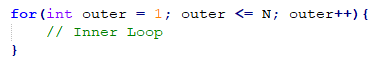

<dl>
  <dt>NIM :</dt>
  <dd>2141720085</dd>

  <dt>Nama :</dt>
  <dd>Maulana Arif Wijaya</dd>
    
  <dt>Kelas :</dt>
  <dd>1A</dd>
</dl>


___


# JOBSHEET 09 - Perulangan 2

## Tujuan
+ Mahasiswa memahami konsep perulangan bersarang (_nested loop_)
+ Mahasiswa dapat menjelaskan format penulisan perulangan bersarang (_nested loop_)
+ Mahasiswa dapat mengimplementasikan _flowchart_ perulangan bersarang menggunakan bahasa pemrograman Java

## Alat dan Bahan
+ PC/laptop
+ Browser(chrome, firefox, safari)
+ Koneksi internet
+ Anaconda3 + Java kernel (opsional)

## Praktikum
### Percobaan 1: Bintang Persegi
1. Perhatikan Flowchart di bawah ini

> flowchart di atas digunakan untuk menggambar sebuah persegi dengan simbol * (bintang)
2. Pada percobaan ke-1 akan dilakukan percobaan tentang _nested loop_. Kasus yang akan diselesaikan adalah untuk membuat tampilan persegi * , dengan panjang sisi sebanyak N. Misalkan N dimasukan **5**, maka hasilnya adalah

3. Karena program membutuhkan input dari keyboard, maka perlu import class Scanner
4. Ketikan kode program di bawah ini


```Java
// Tulis Kode program Percobaan 1 Langkah 4 di atas
import java.util.Scanner;
int N;
Scanner in = new Scanner(System.in);
System.out.print("masukkan nilai N : ");
N = in.nextInt();

for(int i = 0; i <= N ; i++){
    System.out.print("*");
}

```
```
masukkan nilai N : 5
******
```

5.	Perhatikan sintaks perulangan yang digunakan untuk mencetak * sebanyak N kali ke arah samping. Di tahap 4 di atas kode _looping **for**_ kita jadikan sebagai _**inner loop**_. 
6.	Kita looping lagi _inner loop_ sebanyak N kali untuk menghasilkan _output_ seperti tahap 2. Maka perlu ditambahkan perulangan luar (_outer loop_).



```Java
// Tulis Kode program Percobaan 1 Langkah 6 (gabungkan dengan inner loop pada langkah 4)
import java.util.Scanner;
int N;
Scanner in = new Scanner(System.in);
System.out.print("masukkan nilai N : ");
N = in.nextInt();
for(int outer = 1; outer <= N; outer++){
        for(int i = 0; i <= N ; i++){
        System.out.print("*");
    }
}
```
```
masukkan nilai N : 5
******************************
```

#### Pertanyaan 
1. Apakah dengan menggabungkan _inner loop_ dan _outer loop_ seperti langkah 5 di atas sudah menghasilkan _output_ seperti gambar pada langkah 1?
2. Jika belum, silahkan modifikasi kode program sehingga menghasilkan output yang sesuai dengan gambar pada langkah 2?

#### Jawaban
1. ...
```
Belum menghasilkan
```
2. ...


```Java
// Tulis Kode program Percobaan 1 yang benar menurut kalian
int N;
Scanner in = new Scanner(System.in);
System.out.print("masukkan nilai N : ");
N = in.nextInt();
for(int outer = 1; outer <= N; outer++){
    for(int i = 0; i <= N ; i++){
        System.out.print("*");
    }
    System.out.println("");
}

```
```
masukkan nilai N : 5
******
******
******
******
******
```

***
### Percobaan 2: Bintang Segitiga
1.	Pada percobaan ke-2 akan dilakukan percobaan segitiga * sama siku dengan tinggi sebesar N. Misalkan N dimasukan **5**, maka hasilnya seperti gambar berikut

2. Karena program membutuhkan input dari keyboard, maka perlu import class Scanner
3. Ketikan kode program di bawah ini


```Java
// Tulis Kode program Percobaan 2 Langkah 3 di atas
Scanner in = new Scanner (System.in);
System.out.print("Masukkan nilai N = ");
int n = in.nextInt();
int i = 0;
while(i <= N){
    int j = 0;
    while(j<i){
        System.out.print("*");
        j++;
    }
    i++;
}

```
```
Masukkan nilai N = 5
***************
```

Amati kode program yang telah kalian tulis di atas.

#### Pertanyaan
1. Perhatikan, apakah output yang dihasilkan dengan nilai N = 5 sesuai dengan  tampilan seperti pada tahap 1 (Percobaan 2)?
2. Jika tidak sesuai, bagian mana saja yang harus diperbaiki/ditambahkan? Jelaskan setiap bagian yang perlu diperbaiki/ditambahkan. 

#### Jawaban
1. ...
```
Belum sesuai
```
2. ...


```Java
// Tulis Kode program Percobaan 2 yang benar menurut kalian
Scanner in = new Scanner (System.in);
System.out.print("Masukkan nilai N = ");
int n = in.nextInt();
int i = 0;
while(i <= n){
    int j = 0;
    while(j<i){
        System.out.print("*");
        j++;
    }
    System.out.println("");
    i++;
}
```
```
Masukkan nilai N = 5

*
**
***
****
*****
```

Hanya perlu menambah kode ("System.out.println("")) pada outer loop. Hal ini bertujuan, agar terdapat jarak ketika selesai melakukan satu perulangan dalam. 

***
### Percobaan 3: Segitiga Angka
1.	Pada percobaan ke-3 akan dilakukan percobaan segitiga angka sama siku dengan tinggi sebesar N. Misalkan N dimasukan **5**, maka hasilnya seperti berikut

2. Karena program membutuhkan input dari keyboard, maka perlu import class Scanner
3. Ketikan kode program di bawah ini


```Java
// Tulis Kode program Percobaan 3 Langkah 3 di atas, disini
import java.util.Scanner;
Scanner in = new Scanner(System.in);
System.out.print("Masukkan nilai N : ");
int n = in.nextInt();

for(int i = 1 ; i <= n; i++){
    for(int j = 1; j <= i; j++){
        System.out.print(j);
    }
    System.out.println();
}
```
```
Masukkan nilai N : 5
1
12
123
1234
12345
```

#### Pertanyaan 
1. Apakah kode program di atas menghasilkan _output_ yang diharapkan?
2. Jika belum, kode program mana yang harus modifikasi? Jelaskan

#### Jawaban
1. ...
```
Belum sesuai
```
2. ...


```Java
// Tulis Kode program Percobaan 3 yang benar menurut kalian
Scanner in = new Scanner(System.in);
System.out.print("Masukkan nilai N : ");
int n = in.nextInt();

for(int i = 1 ; i <= n; i++){
    for(int j = 1; j <= i; j++){
        System.out.print(i);
    }
    System.out.println();
}
```
```
Masukkan nilai N : 5
1
22
333
4444
55555
```

yang harus dimodifikasi adalah pada print(j) menjadi print(i). Karena setiap baris haruslah memiliki angka yang sama, jika kita menginputkan j, maka angka akan dimulai dari 1, sementara pada variabel i, setiap ganti baris angka akan bertambah 1 dan tidak berubah pada baris itu. 

***
### Percobaan 4: Tebak Angka
1. Pada Percobaan 4 ini, kita akan belajar membuat kode untuk menebak angka menggunakan _nested loop_.
2. Pada percobaan ini kita menggunakan library Scanner untuk menangkap input dari keyboard dan Random untuk meng-generate angka secara acak
3. Ketik dan pahami kode program di bawah ini


```Java
// Tulis Kode program Percobaan 4 Langkah 3 di atas, disini
import java.util.Random;
import java.util.Scanner;
Random random = new Random();
Scanner in = new Scanner (System.in);
char menu = 'y';

    do{
    int number = random.nextInt(10) + 1;
    boolean success = false;
    do{
        System.out.print("Tebak angka (1 - 10) : ");
        int answer = in.nextInt();
        in.nextLine();

        if(answer == number){
            System.out.println("Yay...tebakan Anda benar...Selamat!!");
            success = true;
        }
    }while(!success);
    System.out.print("Apakah Anda ingin mengulang permainan (Y/y)>");
    menu = in.nextLine().charAt(0);
}while(menu == 'y' || menu == 'Y');
```

#### Pertanyaan
1. Jelaskan alur program di atas!
2. Apa yang harus dilakukan untuk tidak melanjutkan (tidak mengulangi) permainan tersebut? 
3. Modifikasi program di atas, sehingga bisa menampilkan informasi mengenai : 
    1. input nilai tebakan yang dimasukan oleh user apakah lebih kecil atau lebih besar dari nilai random!
    2. hentikan _nested loop_ jika pengguna gagal menebak angka sampai 10x tebakan, dan beri pesan "Maaf Anda gagal menebak angka sebanyak 10x"

#### Jawaban
1. program diawali dengan pendeklrasian variabel serta object scanner dan random serta penginisialisasian char . Kemudian membuat outer loop yang mencetak sebuah nomor Random, nomor tersebut akan disimpan pada variabel number dan menginisialisasikan boolean success dengan value false. Kemudian setelah kita memiliki nomor random, maka kita akan menjalankan innerloop yang berisikan variabel untuk menginput angka yang akan diinputkan user. Setelah itu angka user akan dicheck apakah sama dengan nomor random tadi. Jika iya maka inner loop akan berakhir lalu keluar loop, jika tidak maka akan mengulangi terus hingga user menginputkan angka yang tepat. Ketika sudah keluar dari inner loop maka kita akan memasuki outerloop lagi dan menanyakan user apakah ingin mengulang permainan . Jika iya(menginputkan y) maka loop tidak akan berakhir melainkan mulai dari awal dan memasuki inner loop lagi hingga user mengakhiri loop atau permainan dengan menginputkan karakter selain y. 

2. untuk melakukannya, ketika sudah keluar dari innerloop, kita sebagai user harus menginputkan karakter selain Y.


```Java
/* Jawaban untuk Percobaan 4 Pertnyaan 3.A disini */
import java.util.Random;
import java.util.Scanner;
Random random = new Random();
Scanner in = new Scanner (System.in);
char menu = 'y';

do{
    int number = random.nextInt(10) + 1;
    boolean success = false;
    do{
        System.out.print("Tebak angka (1 - 10) : ");
        int answer = in.nextInt();
        in.nextLine();

        if(answer == number){
            System.out.println("Yay...tebakan Anda benar...Selamat!!");
                    success = true;
        }else if(answer < number){
            System.out.println("angka tebakan anda lebih kecil ");
        }else if(answer > number){
            System.out.println("angka tebakan anda lebih besar ");
        }
    }while(!success);
    System.out.print("Apakah Anda ingin mengulang permainan (Y/y)>");
    menu = in.nextLine().charAt(0);
}while(menu == 'y' || menu == 'Y');
```
```
Tebak angka (1 - 10) : 1
angka tebakan anda lebih kecil 
Tebak angka (1 - 10) : 2
angka tebakan anda lebih kecil 
Tebak angka (1 - 10) : 3
angka tebakan anda lebih kecil 
Tebak angka (1 - 10) : 4
Yay...tebakan Anda benar...Selamat!!
Apakah Anda ingin mengulang permainan (Y/y)>n

Process finished with exit code 0

```


```Java
/* Jawaban untuk Percobaan 4 Pertnyaan 3.B disini */
import java.util.Random;
import java.util.Scanner;
Random random = new Random();
Scanner in = new Scanner (System.in);
char menu = 'y';
int kesempatan = 0;

do{
    int number = random.nextInt(10) + 1;
    boolean success = false;
    do{
        System.out.print("Tebak angka (1 - 10) : ");
        int answer = in.nextInt();
        in.nextLine();

        if(answer == number){
            System.out.println("Yay...tebakan Anda benar...Selamat!!");
            success = true;
        }else if(answer < number){
            System.out.println("angka tebakan anda lebih kecil ");
        }else if(answer > number){
            System.out.println("angka tebakan anda lebih besar ");
        }else if(success == true){
            continue;
        }
        kesempatan++;
        if(kesempatan == 10){
            System.out.println("Maaf Anda gagal menebak angka sebanyak 10x");
            success = true;
        }
    }while(!success);
    System.out.print("Apakah Anda ingin mengulang permainan (Y/y)>");
    menu = in.nextLine().charAt(0);
}while(menu == 'y' || menu == 'Y');
```
```
Tebak angka (1 - 10) : 1
angka tebakan anda lebih kecil
Tebak angka (1 - 10) : 1
angka tebakan anda lebih kecil 
Tebak angka (1 - 10) : 1
angka tebakan anda lebih kecil 
Tebak angka (1 - 10) : 1
angka tebakan anda lebih kecil 
Tebak angka (1 - 10) : 1
angka tebakan anda lebih kecil 
Tebak angka (1 - 10) : 1
angka tebakan anda lebih kecil 
Tebak angka (1 - 10) : 1
angka tebakan anda lebih kecil 
Tebak angka (1 - 10) : 1
angka tebakan anda lebih kecil 
Tebak angka (1 - 10) : 12
angka tebakan anda lebih besar 
Tebak angka (1 - 10) : 1
angka tebakan anda lebih kecil 
Maaf Anda gagal menebak angka sebanyak 10x
Apakah Anda ingin mengulang permainan (Y/y)>n

Process finished with exit code 0

```

***
## Tugas
### Soal 1
Buatlah program yang **sesuai** dengan alur _flowchart_ di bawah ini


Apabila kode program sesuai _flowchart_, maka untuk nilai N = 5 akan menghasilkan output seperti gambar berikut


```Java
/* Jawaban Soal 1 disini */
import java.util.*;
Scanner in = new Scanner(System.in);
System.out.print("Masukkan nilai N : ");
int n = in.nextInt();
int j;
for (int i = 1; i<= n; i++){

    for (j = n;j>=1;j--){
        if(i<j){
            System.out.print(" ");
        }else {
            System.out.print("*");
        }
    }
    System.out.println("");
}
```
```
Masukkan nilai N : 5
    *
   **
  ***
 ****
*****
```
```
Program tersebut dibuat dengan menggunakan konsep nested loop. Logika dari program ini adalah, mencetak "*" hingga membentuk persegi panjang, namun untuk sisi sebelah kiri dicetak " " agar seolah - olah kita membuat segitiga siku - siku menghadap ke kiri. Sebenarnya terdapat 2 segitiga siku - siku yaitu segitiga siku siku terbalik berisi " " menghadap kanan dan segitiga siku - siku menghadap kiri berisi "*". Cara membuatnya kita cukup membuat outer loop dengan isian println(), agar setiap kali melakukan loopnya maka melakukan pergantian baris ke bawah. Untuk inner loop kita mencetak sebanyak n secara horizontal sesuai dengan kondisi. Jika kita terletak di baris awal, maka akan mencetak " " sebanyak n-i kali dan diakhiri dengan mencetak "*" sebanyak i. Akan terus berulang hingga outerloop telah keluar dari kondisi.
```
***
### Soal 2
Buatlah program untuk mencetak tampilan persegi angka seperti di bawah ini berdasarkan input dari _keyboard_ N (nilai N minimal 3). Contoh N = 3, dan N = 5


```Java
/* Jawaban Soal 2 disini */
import java.util.Scanner;
Scanner in = new Scanner(System.in);
System.out.println("Masukkan angka (minimal 3) !!!!");
System.out.print("N = ");
int n = in.nextInt();
for (int i = 0; i<n; i++){
    if (n <3){
        n = 1;
        System.out.println("Angka yang anda masukkan kurang dari 3");
        continue;
    }
    System.out.println("");
    for (int j = 0; j<n; j++){;
        if (i>0 && i<n-1){
            if(j>0 && j<n-1){
                System.out.print("  ");
                continue;
            }
        }
        System.out.print(n+" ");
    }
}

```
```
Masukkan angka (minimal 3) !!!!
N = 9

9 9 9 9 9 9 9 9 9 
9               9 
9               9 
9               9 
9               9 
9               9 
9               9 
9               9 
9 9 9 9 9 9 9 9 9 
```
```
dasar dari membuat program tersebut adalah dengan membuat persegi panjang biasa, namun perbedaannya adalah, selain baris awal dan baris akhir dari loop, maka innerloop hanya mencetak value dari n pada urutan pertama dan terakhir, selain itu mencetak " " sehingga seolah olah tengah dari persegi panjang itu kosong.
```
***
### Soal 3
Buatlah program untuk mencetak tampilan piramida * seperti gambar di bawah ini, tinggi piramida berdasarkan input dari _keyboard_ N (nilai N minimal 3). Contoh N = 3, dan N = 5


```Java
import java.util.Scanner;
Scanner in = new Scanner(System.in);
System.out.print("masukkan nilai N : ");
int n = in.nextInt();
for(int i = 0 ;i<=n;i++){
    for (int k = n-i;k>1;k-=2){
        System.out.print(" ");
    }
    for(int j = 0 ;j<i;j++){
        System.out.print("* ");
    }
    System.out.println("");
}
```
```
masukkan nilai N : 9
    *
   ***
  *****
 *******
*********
```
```
Program ini mirip dengan pembuatan segitiga siku - siku, bedanya adalah kita hanya mencetak pada saat baris tersebut merupakan urutan ganjil pada outerloop. Dalam hal ini saya menggunakan continue ketika urutan adalah genap. Jadi yang tampil hanyalah "*" berjumlah ganjil. Tidak hanya itu, cara untuk membuat seolah olah segitiga sama kaki adalah, kita perlu mencetak " " sebelum mencetak "*" sebanyak n - i dengan pengurangan 2 setiap kali mencetak " ". Maka akan membuat suatu segitiga siku - siku berisi " " terbalik menghadap kanan yang membuat segitiga siku - siku berisi "*" pada awalnya, menjadi segitiga sama kaki.
```


