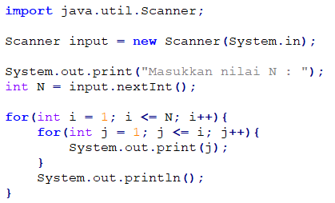
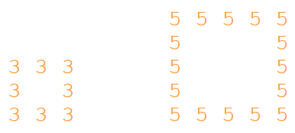

<dl>
  <dt>NIM :</dt>
  <dd>2141720003</dd>

  <dt>Nama :</dt>
  <dd>Tio Misbaqul Irawan</dd>
    
  <dt>Kelas :</dt>
  <dd>1A-TI/29</dd>
</dl>


___


# JOBSHEET 09 - Perulangan 2

## Tujuan
+ Mahasiswa memahami konsep perulangan bersarang (_nested loop_)
+ Mahasiswa dapat menjelaskan format penulisan perulangan bersarang (_nested loop_)
+ Mahasiswa dapat mengimplementasikan _flowchart_ perulangan bersarang menggunakan bahasa pemrograman Java

## Alat dan Bahan
+ PC/laptop
+ Browser(chrome, firefox, safari)
+ Koneksi internet
+ Anaconda3 + Java kernel (opsional)

## Praktikum
### Percobaan 1: Bintang Persegi
1. Perhatikan Flowchart di bawah ini

> flowchart di atas digunakan untuk menggambar sebuah persegi dengan simbol * (bintang)
2. Pada percobaan ke-1 akan dilakukan percobaan tentang _nested loop_. Kasus yang akan diselesaikan adalah untuk membuat tampilan persegi * , dengan panjang sisi sebanyak N. Misalkan N dimasukan **5**, maka hasilnya adalah

3. Karena program membutuhkan input dari keyboard, maka perlu import class Scanner
4. Ketikan kode program di bawah ini


```Java
import java.util.Scanner;

Scanner input = new Scanner(System.in);

int n;

System.out.print("Masukkan nilai n: ");
n = input.nextInt();
```

    Masukkan nilai n: 5
    

5.	Perhatikan sintaks perulangan yang digunakan untuk mencetak * sebanyak N kali ke arah samping. Di tahap 4 di atas kode _looping **for**_ kita jadikan sebagai _**inner loop**_. 
6.	Kita looping lagi _inner loop_ sebanyak N kali untuk menghasilkan _output_ seperti tahap 2. Maka perlu ditambahkan perulangan luar (_outer loop_).


```Java
for(int outer = 1; outer <= n; outer++) {
  for(int i = 1; i <= n; i++) {
    System.out.print("*");
  }
}
```

    *************************

#### Pertanyaan 
1. Apakah dengan menggabungkan _inner loop_ dan _outer loop_ seperti langkah 5 di atas sudah menghasilkan _output_ seperti gambar pada langkah 1?
2. Jika belum, silahkan modifikasi kode program sehingga menghasilkan output yang sesuai dengan gambar pada langkah 2?

#### Jawaban
1. Belum, karena masih butuh sebuah perintah untuk pindah ke baris baru setelah semua bintang pada 1 baris terselesaikan, solusinya adalah dengan menambahkan perintah ```System.out.println()``` setelah inner loop
2. ...


```Java
for(int outer = 1; outer <= n; outer++) {
    for(int i = 1; i <= n; i++) {
        System.out.print("*");
    }
    
    System.out.println();
}
```

    *****
    *****
    *****
    *****
    *****
    

***
### Percobaan 2: Bintang Segitiga
1.	Pada percobaan ke-2 akan dilakukan percobaan segitiga * sama siku dengan tinggi sebesar N. Misalkan N dimasukan **5**, maka hasilnya seperti gambar berikut

2. Karena program membutuhkan input dari keyboard, maka perlu import class Scanner
3. Ketikan kode program di bawah ini


```Java
import java.util.Scanner;

Scanner input = new Scanner(System.in);

System.out.print("Masukkan nilai N = ");
int n = input.nextInt();

int i = 0;

while(i <= n) {
  int j = 0;
  while(j < i) {
    System.out.print("*");
    j++;
  }
  i++;
}
```

    Masukkan nilai N = 5
    ***************

Amati kode program yang telah kalian tulis di atas.

#### Pertanyaan
1. Perhatikan, apakah output yang dihasilkan dengan nilai N = 5 sesuai dengan  tampilan seperti pada tahap 1 (Percobaan 2)?
2. Jika tidak sesuai, bagian mana saja yang harus diperbaiki/ditambahkan? Jelaskan setiap bagian yang perlu diperbaiki/ditambahkan. 

#### Jawaban
1. Tidak sesuai, sama dengan permasalah sebelumnya, solusinya adalah menambahkan baris baru setiap selesai menampilkan suatu baris
2. ...


```Java
import java.util.Scanner;

Scanner input = new Scanner(System.in);

System.out.print("Masukkan nilai N = ");
int n = input.nextInt();

int i = 0;

while(i <= n) {
  int j = 0;
  while(j < i) {
    System.out.print("*");
    j++;
  }
  System.out.println();
  i++;
}
```

    Masukkan nilai N = 5
    
    *
    **
    ***
    ****
    *****
    

***
### Percobaan 3: Segitiga Angka
1.	Pada percobaan ke-3 akan dilakukan percobaan segitiga angka sama siku dengan tinggi sebesar N. Misalkan N dimasukan **5**, maka hasilnya seperti berikut

2. Karena program membutuhkan input dari keyboard, maka perlu import class Scanner
3. Ketikan kode program di bawah ini



```Java
import java.util.Scanner;

Scanner input = new Scanner(System.in);

System.out.print("Masukkan nilai n: ");
int n = input.nextInt();

for (int i = 1; i <= n; i++) {
  for (int j = 1; j <= i; j++) {
    System.out.print(j);
  }
  System.out.println();
}
```

    Masukkan nilai n: 5
    1
    12
    123
    1234
    12345
    

#### Pertanyaan 
1. Apakah kode program di atas menghasilkan _output_ yang diharapkan?
2. Jika belum, kode program mana yang harus modifikasi? Jelaskan

#### Jawaban
1. Belum, pada contoh, yang ditampilkan adalah angka sesuai baris saat ini (i), sedangkan pada contoh kode program menampilkan nilai dari kolom (j). Solusinya adalah merubah variable yang ditampilkan dari j menjadi i.
2. ...


```Java
import java.util.Scanner;

Scanner input = new Scanner(System.in);

System.out.print("Masukkan nilai n: ");
int n = input.nextInt();

for (int i = 1; i <= n; i++) {
  for (int j = 1; j <= i; j++) {
    System.out.print(i);
  }
  System.out.println();
}
```

    Masukkan nilai n: 5
    1
    22
    333
    4444
    55555
    

***
### Percobaan 4: Tebak Angka
1. Pada Percobaan 4 ini, kita akan belajar membuat kode untuk menebak angka menggunakan _nested loop_.
2. Pada percobaan ini kita menggunakan library Scanner untuk menangkap input dari keyboard dan Random untuk meng-generate angka secara acak
3. Ketik dan pahami kode program di bawah ini


```Java
import java.util.Scanner;
import java.util.Random;

Scanner input = new Scanner(System.in);
Random random = new Random();

char menu = 'y';

do {
  int number = random.nextInt(10) + 1;
  boolean success = false;

  do {
    System.out.print("Tebak angka (1-10)");

    int answer = input.nextInt();
    input.nextLine();

    if(answer == number) {
      System.out.println("Yay tebakan anda benar, selamat!");
      success = true;
    }
  } while (!success);

  System.out.print("Tebak lagi? (y/n)");
  menu = input.nextLine().charAt(0);
} while (menu == 'y' || menu == 'Y');
```

    Tebak angka (1-10)8
    Tebak angka (1-10)9
    Tebak angka (1-10)8
    Tebak angka (1-10)7
    Tebak angka (1-10)6
    Tebak angka (1-10)5
    Tebak angka (1-10)4
    Tebak angka (1-10)3
    Yay tebakan anda benar, selamat!
    Tebak lagi? (y/n)n
    

#### Pertanyaan
1. Jelaskan alur program di atas!
2. Apa yang harus dilakukan untuk tidak melanjutkan (tidak mengulangi) permainan tersebut? 
3. Modifikasi program di atas, sehingga bisa menampilkan informasi mengenai : 
    1. input nilai tebakan yang dimasukan oleh user apakah lebih kecil atau lebih besar dari nilai random!
    2. hentikan _nested loop_ jika pengguna gagal menebak angka sampai 10x tebakan, dan beri pesan "Maaf Anda gagal menebak angka sebanyak 10x"

#### Jawaban
1. Penjelasan program
    1. Mengimport Scanner dan Random untuk melakukan input dan mengenerate nilai acak
    2. Membuat objek Scanner dan Random yang akan digunakan nanti
    3. Mendefinisikan variable menu untuk menyimpan input dari user tentang lanjut bermain atau tidak
    4. terdapat 2 loop di sini, outer loop bertindak sebagai cara agar user dapat memulai ulang permainan setelah berhasil menebak angka. inner loop bertindak sebaga cara agar user dapat memasukan tebakan lagi jika tebakan sebelumnya salah
    5. pada outer loop membuat variable number dengan nilai acak 0-9 kemudian ditambah 1 sehingga menghasilkan angka 1-10
    6. membuat variable success untuk melacak status dari tebakan pengguna
    7. inner loop akan terus berjalan selama variable success bernilai false
    8. `int answer = ...` digunakan untuk menerima input dari user
    9. `input.nextLine()` digunakan untuk mengambil karakter `\n` saat user menekan tombol enter setelah input integer
    10. terdapat kondisi yang digunakan untuk melakukan pengecekan input dari user dengan variable answer yang telah degenerate sebelumnya
    11. jika benar, maka variable success akan bernilai true yang akan menyebabkan berhentinya inner loop
    12. `menu = ...` digunakan untuk menerima input dari user, jika input adalah y atau Y, maka outer loop akan dijalankan ulang dan akan memulai game baru. jika user memasukan karakter selain y dan Y maka outer loop akan berhenti dan program akan berhenti
    
2. Agar program berhenti, user harus menebak angka dengan benar, setelah itu pada saat terdapat input main lagi, user harus memasukan karakter selain y dan Y


```Java
import java.util.Scanner;
import java.util.Random;

Scanner input = new Scanner(System.in);
Random random = new Random();

char menu = 'y';

do {
  int number = random.nextInt(10) + 1;
  boolean success = false;

  do {
    System.out.print("Tebak angka (1-10)");

    int answer = input.nextInt();
    input.nextLine();

    if(answer == number) {
      System.out.println("Yay tebakan anda benar, selamat!");
      success = true;
    } else {
      System.out.println("Nilai yang anda masukan lebih " + (answer > number ? "besar" : "kecil") + " dari nilai yang benar");
    }
  } while (!success);

  System.out.print("Tebak lagi? (y/n)");
  menu = input.nextLine().charAt(0);
} while (menu == 'y' || menu == 'Y');
```

    Tebak angka (1-10)1
    Nilai yang anda masukan lebih kecil dari nilai yang benar
    Tebak angka (1-10)4
    Nilai yang anda masukan lebih kecil dari nilai yang benar
    Tebak angka (1-10)6
    Yay tebakan anda benar, selamat!
    Tebak lagi? (y/n)


```Java
import java.util.Scanner;
import java.util.Random;

Scanner input = new Scanner(System.in);
Random random = new Random();

char menu = 'y';

do {
  int number = random.nextInt(10) + 1;
  boolean success = false;
  int tries = 0;

  do {
    System.out.print("(Tebakan ke " + (tries + 1) + ") Tebak angka (1-10): ");

    int answer = input.nextInt();
    input.nextLine();

    if(answer == number) {
      System.out.println("Yay tebakan anda benar, selamat!");
      success = true;
    } else {
      System.out.println("Nilai yang anda masukan lebih " + (answer > number ? "besar" : "kecil") + " dari nilai yang benar");
        
      tries++;

      if (tries == 10) {
        System.out.println("Kesempatan menebak anda habis, nilai yang benar adalah " + number);
        break;
      }
    }
  } while (!success);

  System.out.print("Tebak lagi? (y/n)");
  menu = input.nextLine().charAt(0);
} while (menu == 'y' || menu == 'Y');
```

    (Tebakan ke 1) Tebak angka (1-10): 1
    Nilai yang anda masukan lebih kecil dari nilai yang benar
    (Tebakan ke 2) Tebak angka (1-10): 1
    Nilai yang anda masukan lebih kecil dari nilai yang benar
    (Tebakan ke 3) Tebak angka (1-10): 1
    Nilai yang anda masukan lebih kecil dari nilai yang benar
    (Tebakan ke 4) Tebak angka (1-10): 1
    Nilai yang anda masukan lebih kecil dari nilai yang benar
    (Tebakan ke 5) Tebak angka (1-10): 1
    Nilai yang anda masukan lebih kecil dari nilai yang benar
    (Tebakan ke 6) Tebak angka (1-10): 1
    Nilai yang anda masukan lebih kecil dari nilai yang benar
    (Tebakan ke 7) Tebak angka (1-10): 1
    Nilai yang anda masukan lebih kecil dari nilai yang benar
    (Tebakan ke 8) Tebak angka (1-10): 1
    Nilai yang anda masukan lebih kecil dari nilai yang benar
    (Tebakan ke 9) Tebak angka (1-10): 1
    Nilai yang anda masukan lebih kecil dari nilai yang benar
    (Tebakan ke 10) Tebak angka (1-10): 1
    Nilai yang anda masukan lebih kecil dari nilai yang benar
    Kesempatan menebak anda habis, nilai yang benar adalah 2
    Tebak lagi? (y/n)n
    

***
## Tugas
### Soal 1
Buatlah program yang **sesuai** dengan alur _flowchart_ di bawah ini


Apabila kode program sesuai _flowchart_, maka untuk nilai N = 5 akan menghasilkan output seperti gambar berikut


```Java
import java.util.Scanner;

Scanner input = new Scanner(System.in);

System.out.print("Masukkan nilai N: ");
int n = input.nextInt();

int i = 1;

while (i <= n) {
  int j = n;

  while (j >= 1) {
    if (i < j) {
      System.out.print(" ");
    } else {
      System.out.print("*");
    }

    j--;
  }

  System.out.println();
  i++;
}
```

    Masukkan nilai N: 5
        *
       **
      ***
     ****
    *****
    

Penjelasan:
1. Outer loop berfungsi untuk menampilkan tiap baris dari segitiga
2. Inner loop berfungsi untuk menampilkan bintang/spasi pada tiap kolomnya
3. Jika nilai dari baris saat ini misal 1, kurang dari j atau nilai dari n = jumlah kolom, maka tampilkan spasi, jika tidak tampilkan bintang, setelah itu kurangi nilai dari j sehingga nanti nilai i bisa lebih atau dari sama dengan j

***
### Soal 2
Buatlah program untuk mencetak tampilan persegi angka seperti di bawah ini berdasarkan input dari _keyboard_ N (nilai N minimal 3). Contoh N = 3, dan N = 5



```Java
import java.util.Scanner;

Scanner input = new Scanner(System.in);

System.out.println("Masukkan nilai N: ");
int n = input.nextInt();

if (n < 3) {
  System.out.println("Nilai N minimal 3");
  System.exit(0);
}

for (int i = 0; i < n; i++) {
  for (int j = 0; j < n; j++) {
    if (i == 0 || i == n - 1) {
      System.out.print(n + " ");
    } else if (j == 0 || j == n - 1) {
      System.out.print((j == n - 1 ? " " : "") + n);
    } else {
      System.out.print("  ");
    }
  }
  System.out.println();
}
```

    Masukkan nilai N: 
    5
    5 5 5 5 5 
    5       5
    5       5
    5       5
    5 5 5 5 5 
    

Penjelasan

1. jika user memasukan nilai < 3, maka hentikan program
2. buat perulangan untuk tiap baris
3. jika baris saat ini adalah baris pertama atau baris terakhir, maka tampilkan n pada tiap kolomnya, jika tidak maka tampilkan n hanya pada kolom pertama dan terakhir, sisanya spasi

***
### Soal 3
Buatlah program untuk mencetak tampilan piramida * seperti gambar di bawah ini, tinggi piramida berdasarkan input dari _keyboard_ N (nilai N minimal 3). Contoh N = 3, dan N = 5


```Java
import java.util.Scanner;

Scanner input = new Scanner(System.in);
System.out.print("Masukkan nilai N: ");

int n = input.nextInt();

for (int i = 1; i <= n; i++) {
  for (int j = 1; j <= n - i; j++) {
    System.out.print(" ");
  }
  for (int k = 1; k <= i * 2 - 1; k++) {
    System.out.print("*");
  }
  System.out.println();
}
```

    Masukkan nilai N: 5
        *
       ***
      *****
     *******
    *********
    

Penjelasan

1. Outer loop bergungsi untuk menampilkan tiap baris
2. Inner loop yang pertama digunakan untuk menampilkan spasi sebanyak n - i
3. Inner loop yang kedua digunakan untuk menampilkan bintang sebanyak i * 2 - 1
