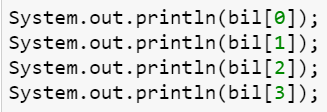

# JOBSHEET 10 - Array 1

## Tujuan
+ Mahasiswa mampu memahami pembuatan Array 1 dimensi dan pengaksesan elemenya di Java. 
+ Mahasiswa mampu membuat program dengan menggunakan konsep array satu dimensi.


## Alat dan Bahan
+ PC/laptop
+ Browser(chrome, firefox, safari)
+ Koneksi internet
+ Anaconda3 + Java kernel (opsional)

## Praktikum
### Percobaan 1: Mengisi Elemen Array
1. Pada percobaan ke-1 akan dilakukan percobaan untuk mengisi elemen array. Buat array bertipe integer dengan nama bil dengan kapasitas 4 elemen.


```Java
// Tulis Kode program Percobaan 1 Langkah 2 di atas
int[] bil = new int [4];
```

2. Isi masing-masing elemen array bil tadi dengan angka 5, 12, 7, 20.


```Java
// Tulis Kode program Percobaan 1 Langkah 3 di atas
bil[0] = 5;
bil[1] = 12;
bil[2] = 7;
bil[3] = 20;
```


    20


3. Tampilkan ke layar semua isi elemennya:



```Java
// Tulis Kode program Percobaan 1 Langkah 4
System.out.println(bil[0]);
System.out.println(bil[1]);
System.out.println(bil[2]);
System.out.println(bil[3]);
```

    5
    12
    7
    20


#### Pertanyaan 
1. Dari percobaan 1 berapakah indeks array terbesar dan terkecil?


```Java
// Tulis Jawaban no 1 disini
 indeks array terbesar adalah indeks ke [3] = 20 dan yang terkeil adalah [0] = 5
```

2. Jika Isi masing-masing elemen array bil diubah dengan angka 5.0, 12867, 7.5, 2000000. Apa yang terjadi? Mengapa bisa demikian?


```Java
// Tulis Jawaban no 2 yang disini
int[] bil = new int [4];
bil[0] = 5.0;
bil[1] = 12867;
bil[2] = 7.5;
bil[3] = 2000000;
System.out.println(bil[0]);
System.out.println(bil[1]);
System.out.println(bil[2]);
System.out.println(bil[3]);
```


    |   bil[0] = 5.0;

    incompatible types: possible lossy conversion from double to int

    


3. Ubah statement pada langkah No 3 menjadi seperti berikut

Apa keluaran dari program? Mengapa bisa demikian?


```Java
// Tulis Jawaban no 3 yang disini
int[] bil = new int [4];
bil[0] = 5;
bil[1] = 12;
bil[2] = 7;
bil[3] = 20;
for(int i=0; i<4; i++) {
 System.out.println(bil[i]);
}
```

    5
    12
    7
    20


Output yang didapat dari langkah 3 dan diubah menjadi for (perulangan) sama saja. Karena pada perulangan, akan menampilkan atau print bilangan i. Dimana i dimulai dari 0, maka akan diprint bilangan 5, dan adanya increment untuk mengeprint bilangan selanjutnya, yaitu bilangan 0 ditambah 1, kemudian print bil 1 yaitu 12, dan seterusnya. 

### Percobaan 2: Meminta Inputan Pengguna untuk Mengisi Elemen Array
1. Pada percobaan ke-2 akan dilakukan percobaan yang meminta inputan pengguna untuk mengisi elemen array seperti pada flowchart berikut


2. Import dan deklarasikan Scanner untuk keperluan input. 


```Java
// Tulis Kode program Percobaan 2 Langkah 1 di atas
import java.util.Scanner;
Scanner sc = new Scanner(System.in);
```

3. Buat array bertipe integer dengan nama nilaiUAS, dengan kapasitas 6 elemen.


```Java
// Tulis Kode program Percobaan 2 Langkah 3 di atas
int nilaiUAS[] = new int[6];
```

4. Menggunakan perulangan, buat input untuk mengisi elemen dari array nilaiUAS.


```Java
// Tulis Kode program Percobaan 2 Langkah 4 di atas
import java.util.Scanner;
Scanner sc = new Scanner(System.in);
int nilaiUAS[] = new int[6];
for(int i = 0; i < 6; i++) {
 System.out.print("Masukkan Nilai UAS ke-" + i + ": ");
 nilaiUAS[i] = sc.nextInt();
}
```

    Masukkan Nilai UAS ke-0: 86
    Masukkan Nilai UAS ke-1: 89
    Masukkan Nilai UAS ke-2: 90
    Masukkan Nilai UAS ke-3: 69
    Masukkan Nilai UAS ke-4: 87
    Masukkan Nilai UAS ke-5: 92


5. Menggunakan perulangan, tampilkan semua isi elemen dari array nilaiUAS.


```Java
// Tulis Kode program Percobaan 2 Langkah 5 di atas
for(int i = 0; i < 6; i++) {
 System.out.println("Nilai UAS ke-" + i + " adalah: " + nilaiUAS[i]);
}
```

    Nilai UAS ke-0 adalah: 86
    Nilai UAS ke-1 adalah: 89
    Nilai UAS ke-2 adalah: 90
    Nilai UAS ke-3 adalah: 69
    Nilai UAS ke-4 adalah: 87
    Nilai UAS ke-5 adalah: 92


#### Pertanyaan
1. Ubah statement pada langkah No 4 menjadi seperti berikut ini :

Jalankan program, apakah terjadi perubahan? Mengapa demikian?


```Java
// Tulis Jawaban nomor 1 disini
import java.util.Scanner;
Scanner sc = new Scanner(System.in);
int nilaiUAS[] = new int[6];
for(int i = 0; i < nilaiUAS.length; i++) {
 System.out.print("Masukkan Nilai UAS ke-" + i + ": ");
 nilaiUAS[i] = sc.nextInt();
}
```

    Masukkan Nilai UAS ke-0: 86
    Masukkan Nilai UAS ke-1: 89
    Masukkan Nilai UAS ke-2: 90
    Masukkan Nilai UAS ke-3: 69
    Masukkan Nilai UAS ke-4: 87
    Masukkan Nilai UAS ke-5: 92


2. Apa kegunaan dari `nilaiUAS.length`? 

// Tulis Jawaban nomor 2 disini
Digunakan untuk mengetahui panjang array. Oleh karena itu, output yang didapatkan dari (i < 6) atau (nilaiUAS.length) sama saja karena fungsinya sama yaitu mengetahui panjang array. 

3. Ubah statement pada langkah No 5 menjadi seperti berikut ini sehingga program hanya menampilkan status mahasiswa yang lulus saja:

Jalankan program dan Jelaskan alur program!


```Java
// Tulis Jawaban nomor 3 disini
for(int i = 0; i < nilaiUAS.length; i++) {
 if(nilaiUAS[i] > 70){
 System.out.println("Masukkan Nilai UAS ke-" + i + " Lulus ");
 }
}
```

    Masukkan Nilai UAS ke-0 Lulus 
    Masukkan Nilai UAS ke-1 Lulus 
    Masukkan Nilai UAS ke-2 Lulus 
    Masukkan Nilai UAS ke-4 Lulus 
    Masukkan Nilai UAS ke-5 Lulus 


Program menampilkan output dari nilai yang diinputkan. Jika nilai UAS lebih dari 70, maka nilai yang diinputkan dicek kembali untuk ditampilkan status lulus pada program. Pada nilai UAS ke-3, saya menginputkan nilai 69, maka pada output kode program diatas, tidak ditampilkan karena nilai tsb kurang dari 70 / tidak lulus. 

### Percobaan 3: Melakukan Operasi Aritmatika terhadap Elemen Array
Pada praktikum ini, akan dilakukan percobaan untuk menjumlahkan Array. Program akan menerima input sebanyak 10 nilai mahasiswa. Kemudian program akan menampilkan nilai rata-rata nilai dari 10 Mahasiswa. Seperti flowchart berikut


1.Import dan deklarasikan Scanner untuk keperluan input. 


```Java
// Tulis Kode program Percobaan 3 Langkah 1 di atas, disini
import java.util.Scanner;
Scanner sc = new Scanner(System.in);
```

2. Buat array nilaiMHS bertipe integer dengan kapasitas 10. Kemudian deklarasikan variable total dan rata seperti gambar berikut ini


```Java
// Tulis Kode program Percobaan 3 Langkah 2 di atas, disini
int nilaiMHS[] = new int[10];
double total;
double rata;
```

3. Menggunakan perulangan, buat input untuk mengisi array nilaiMHS


```Java
// Tulis Kode program Percobaan 3 Langkah 3 di atas, disini
for(int i = 0; i<nilaiMHS.length; i++) {
 System.out.print("Masukkan nilai mahasiswa ke-"+(i+1)+":");
 nilaiMHS[i] = sc.nextInt();
}
```

    Masukkan nilai mahasiswa ke-1:86
    Masukkan nilai mahasiswa ke-2:94
    Masukkan nilai mahasiswa ke-3:67
    Masukkan nilai mahasiswa ke-4:79
    Masukkan nilai mahasiswa ke-5:90
    Masukkan nilai mahasiswa ke-6:83
    Masukkan nilai mahasiswa ke-7:77
    Masukkan nilai mahasiswa ke-8:76
    Masukkan nilai mahasiswa ke-9:53
    Masukkan nilai mahasiswa ke-10:92


4. Menggunakan perulangan untuk menghitung jumlah keseluruhan nilai.


```Java
// Tulis Kode program Percobaan 3 Langkah 4 di atas, disini
for(int i = 0; i<nilaiMHS.length; i++){
 total+=nilaiMHS[i];
}
```

5. Kemudian hitung nilai rata-rata dengan cara nilai total dibagi jumlah elemen dari array nilaiMHS\


```Java
// Tulis Kode program Percobaan 3 Langkah 3 di atas, disini
rata = total/nilaiMHS.length;
System.out.println("Rata-rata nilai mahasiswa adalah " + rata);
```

    Rata-rata nilai mahasiswa adalah 79.7


#### Pertanyaan 
1. Pada Percobaan 3 langkah ke-5. Mengapa perhitungan rata berada diluar perulangan?

// Tulis jawaban no 1 disini
agar pada program dilakukan perulangan terlebih dahulu, kemudian dilakukan rata rata. Jadi nilai diinputkan terlebih dahulu kemudian setelah selesai, dilakukan rata-rata. 

2. Modifikasi program pada percobaan 3 sehingga bisa mengeluarkan output  seperti gambar berikut ini!
syarat lulus nilai >70


```Java
// Tulis jawaban no 2 disini
import java.util.Scanner;
Scanner sc = new Scanner(System.in);
int nilaiMHS[] = new int[10];
double total1, total2;
double rata1, rata2;
int jmlh1, jmlh2;
for(int i=0; i<nilaiMHS.length; i++){
 System.out.print("Masukkan nilai Mahasiswa ke-" +(i+1)+" : ");
 nilaiMHS[i] = sc.nextInt();
}

for(int i=0; i<nilaiMHS.length; i++){
 if(nilaiMHS[i] > 70) {
 total1+=nilaiMHS[i] ;
 jmlh1++;
 } else {
 total2+=nilaiMHS[i];
 jmlh2++;
 }
}

rata1=total1/jmlh1;
rata2=total2/jmlh2;

System.out.println("Rata-rata nilai mahasiswa yang lulus adalah " +rata1);
System.out.println("Rata-rata nilai mahasiswa yang tidak lulus adalah " +rata2);
```

    Masukkan nilai Mahasiswa ke-1 : 80
    Masukkan nilai Mahasiswa ke-2 : 75
    Masukkan nilai Mahasiswa ke-3 : 65
    Masukkan nilai Mahasiswa ke-4 : 90
    Masukkan nilai Mahasiswa ke-5 : 100
    Masukkan nilai Mahasiswa ke-6 : 83
    Masukkan nilai Mahasiswa ke-7 : 57
    Masukkan nilai Mahasiswa ke-8 : 65
    Masukkan nilai Mahasiswa ke-9 : 88
    Masukkan nilai Mahasiswa ke-10 : 93
    Rata-rata nilai mahasiswa yang lulus adalah 87.0
    Rata-rata nilai mahasiswa yang tidak lulus adalah 62.333333333333336


### Percobaan 4: Pencarian menggunakan Array
Pada praktikum ini, akan dilakukan percobaan untuk mencari lokasi/indeks sebuah angka dalam array. Sesuai dengan flowchart di bawah ini:
 

1. Buat array arr[] bertipe integer dengan kapasitas 6 dan isi dengan nilai 6, 4, 1, 9, 7, 3, 2 dan 8. Kemudian deklarasikan variabel integer `key` untuk kata kunci pencarian dan variabel `hasil` untuk hasil indeks pencarian. Deklarasi dan inisialisasi seperti gambar berikut ini


```Java
// Tulis Kode program Percobaan 4 Langkah 1 di atas, disini
int[] arr = {6,4,1,9,7,3,2,8};
int key = 3;
int hasil = -1;
```

2. Menggunakan perulangan, lakukan pencarian untuk mendapatkan nilai array yang sesuai dengan key. Bila ada yang sesuai, simpan indeksnya sebagai hasil pencarian


```Java
// Tulis Kode program Percobaan 4 Langkah 2 di atas, disini
for(int i=0; i<arr.length; i++) {
 if(key==arr[i]){
 hasil=i;
 break;
 }
}
```

3. Tampilkan hasil pencarian dengan kode berikut.


```Java
// Tulis Kode program Percobaan 4 Langkah 3 di atas, disini
System.out.println("Key ada di array ke- "+ hasil);
```

    Key ada di array ke- 5


#### Pertanyaan 
1. Pada Percobaan 4 langkah ke-2. Apa kegunaan dari statement `break`?


```Java
// Tulis jawaban no 1 disini
Break untuk menghentikan perulangan. 
```

2. Modifikasi program pada percobaan 4 sehingga key yang dicari adalah angka 5. Kemudian jalankan program, amati hasilnya! Jelaskan penyebab dari hasil tersebut! 


```Java
// Tulis jawaban no 2 disini
int[] arr = {6,4,1,9,7,3,2,8};
int key = 5;
int hasil = -1;

for(int i=0; i<arr.length; i++) {
 if(key==arr[i]){
 hasil=i;
 break;
 }
}

System.out.println("Key ada di array ke-" +hasil); 
```

    Key ada di array ke--1


Pada kode program diatas, program print "array ke -1" Key yang dicari yaitu angka 5 tidak ada di dalam array sehingga, otomatis program akan memunculka output "key ada di array ke-1"

### Percobaan 5: Pengurutan bilangan menggunakan Array
Pada praktikum ini, akan dilakukan percobaan untuk mengurutkan angka dalam array. Sesuai dengan flowchart di bawah ini:

1.Buat array arr[] bertipe integer dengan kapasitas 8 dan isi dengan nilai 16, 4, 10, 90, 27, 3, 12 dan 28. Kemudian deklarasikan variabel integer `temp` untuk media penukaran nilai pada variabel. Deklarasi dan inisialisasi seperti gambar berikut ini


```Java
// Tulis Kode program Percobaan 5 Langkah 1 disini
int[] arr = {16, 4, 10, 90, 27, 3, 12, 28};
int temp=0;
```


```Java
// Tulis Kode program Percobaan 5 Langkah 2 di atas, disini
for(int i = 0; i < arr.length; i++){
    for(int j = 1; j < (arr.length-i); j++){
        if(arr[j-1] > arr[j]){
            temp = arr[j-1];
            arr[j-1] = arr[j];
            arr[j] = temp;
        }
    }
}
```

2. Menggunakan perulangan, lakukan pengurutan bilangan dengan menukar posisi indeks tersebut dengan indeks berikutnya. Perulangan dilakukan untuk menukar posisi berulang kali. 


3. Tampilkan hasil pengurutan dengan menggunakan perulangan


```Java
// Tulis Kode program Percobaan 5 Langkah 3 di atas, disini
System.out.println("Hasil pengurutan : ");
for(int i = 0; i < arr.length; i++)
    System.out.println(arr[i]);
```

    Hasil pengurutan : 
    3
    4
    10
    12
    16
    27
    28
    90


## Tugas
### Soal 1
Buatlah program yang **sesuai** dengan alur _flowchart_ di bawah ini


Flowchart diatas menggambarkan alur program yang membaca 10 masukan pengguna berupa integer dan menyimpannya. Kemudian angka ganjil dan genap disimpan kembali ke dalam variabel lain yang terpisah


```Java
/* Jawaban Soal 1 disini */
import java.util.Scanner;
Scanner sc = new Scanner(System.in);
int checkNum[] = new int[10];
int evenNum[] = new int[10];
int oddNum[] = new int[10];
int cEven, cOdd=0;

for(int a=0; a<checkNum.length; a++){
    System.out.println("Masukkan Angka : ");
    checkNum[a] = sc.nextInt();
}
for(int b=0; b<checkNum.length; b++){
    if(checkNum[b] %2==0){
        evenNum[cEven] = checkNum[b];
        cEven++;
    } else {
        oddNum[cOdd] = checkNum[b];
        cOdd++;
    }
}
for(int i = 0; i < cEven; i++){
    System.out.print("Bilangan Genap :");
    System.out.printf("%d\n",evenNum[i]);
}

for(int i = 0; i < cOdd; i++){
    System.out.print("Bilangan Ganjil :");
    System.out.printf("%d\n",oddNum[i]);
}
```

    Masukkan Angka : 
    4
    Masukkan Angka : 
    13
    Masukkan Angka : 
    7
    Masukkan Angka : 
    6
    Masukkan Angka : 
    23
    Masukkan Angka : 
    67
    Masukkan Angka : 
    5
    Masukkan Angka : 
    178
    Masukkan Angka : 
    200
    Masukkan Angka : 
    14
    Bilangan Genap :4
    Bilangan Genap :6
    Bilangan Genap :178
    Bilangan Genap :200
    Bilangan Genap :14
    Bilangan Ganjil :13
    Bilangan Ganjil :7
    Bilangan Ganjil :23
    Bilangan Ganjil :67
    Bilangan Ganjil :5


##### Soal 2
Buatlah program yang terdapat array dengan jumlah elemen 5, buatlah input untuk mengisi elemen array tersebut, kemudian tampilkan isi array tersebut dengan urutan terbalik. Seperti ilustrasi gambar dibawah ini.


```Java
/* Jawaban Soal 2 disini */
import java.util.Scanner;
Scanner sc = new Scanner(System.in);
 int array[];
 array = new int[5];
 for (int i = 0; i < array.length; i++) {
 System.out.print("Masukkan angka : ");
 array[i]=sc.nextInt();
 }
 System.out.print("Hasil terbalik adalah : ");
 for(int i = array.length-1; i>=0; i--){
 System.out.print(array[i]);
 }
```

    Masukkan angka : 5
    Masukkan angka : 2
    Masukkan angka : 7
    Masukkan angka : 9
    Masukkan angka : 6
    Hasil terbalik adalah : 69725

### Soal 3
Buatlah program yang menerima input jumlah elemen array, inputkan isi arraynya, kemudian tampilkan bilangan terbesar dari isi elemen arraynya. Contoh hasil program:


```Java
/* Jawaban Soal 3 disini */
import java.util.Scanner;
Scanner sc = new Scanner(System.in);
System.out.print("Masukkan isi array: ");
int n = sc.nextInt();
int angka[] = new int[n];
int min,max;
for(int i = 0; i<n; i++){
 System.out.print("Masukkan elemen array: "+i+":");
 angka[i] = sc.nextInt();
}
min=angka[0];
max=angka[0];
for(int i=0; i<n; i++){
 if(angka[i]<max)
 min=angka[i];
 if(angka[i]>min)
 max=angka[i];
}
System.out.println("Bilangan terbesar adalah: " +max);
```

    Masukkan isi array: 3
    Masukkan elemen array: 0:22
    Masukkan elemen array: 1:18
    Masukkan elemen array: 2:9
    Bilangan terbesar adalah: 22


```Java

```
