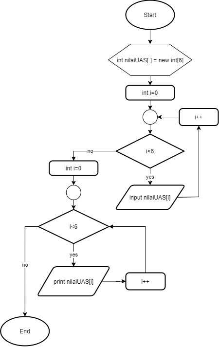

# JOBSHEET 10 - Array 1

## Tujuan
+ Mahasiswa mampu memahami pembuatan Array 1 dimensi dan pengaksesan elemenya di Java. 
+ Mahasiswa mampu membuat program dengan menggunakan konsep array satu dimensi.


## Alat dan Bahan
+ PC/laptop
+ Browser(chrome, firefox, safari)
+ Koneksi internet
+ Anaconda3 + Java kernel (opsional)

## Praktikum
### Percobaan 1: Mengisi Elemen Array
1. Pada percobaan ke-1 akan dilakukan percobaan untuk mengisi elemen array. Buat array bertipe integer dengan nama bil dengan kapasitas 4 elemen.


```Java
// Tulis Kode program Percobaan 1 Langkah 2 di atas
int[] bil=new int[4]
```

2. Isi masing-masing elemen array bil tadi dengan angka 5, 12, 7, 20.


```Java
// Tulis Kode program Percobaan 1 Langkah 3 di atas
bil[0]=5;
bil[1]=12;
bil[2]=7;
bil[3]=20;
```


    20


3. Tampilkan ke layar semua isi elemennya:


```Java
// Tulis Kode program Percobaan 1 Langkah 4
System.out.println(bil[0]);
System.out.println(bil[1]);
System.out.println(bil[2]);
System.out.println(bil[3]);
```

    5
    12
    7
    20


#### Pertanyaan 
1. Dari percobaan 1 berapakah indeks array terbesar dan terkecil?


```Java
// Tulis Jawaban no 1 disini
indeks array terbesarnya yaitu 3
indeks array terkecil yaitu 0

```

2. Jika Isi masing-masing elemen array bil diubah dengan angka 5.0, 12867, 7.5, 2000000. Apa yang terjadi? Mengapa bisa demikian?

Jawab : yang terjadi yaitu kode program tersebut akan error karena masing masing angka yang diisikan pada elemen array memiliki tipe data yang berbeda padahal salah satu sifat array yaitu homogen yang berarti seluruh elemen di dalam struktur array mempunyai tipe data yang sama. karena kode program menggunakan tipe data integer maka nilai yang dimasukkan seharusnya merupakan bilangan bulat dan angka 5.0 dan 7.5 bukan bilangan bulat. untuk angka desimal seperti 5.0 dan 7.5 seharusnya menggunakan tipe data double agar program bisa dijalankan. 


```Java
// Tulis Jawaban no 2 yang disini
int[] bil=new int[4];
bil[0]=5.0;
bil[1]=12867;
bil[2]=7.5;
bil[3]=2000000;
System.out.println(bil[0]);
System.out.println(bil[1]);
System.out.println(bil[2]);
System.out.println(bil[3]);
```


    |   bil[0]=5.0;

    incompatible types: possible lossy conversion from double to int

    


3. Ubah statement pada langkah No 3 menjadi seperti berikut

Apa keluaran dari program? Mengapa bisa demikian?

Jawab : keluaran dari program tersebut adalah angka 5 sebanyak 4. karena pada kode program tersebut menggunakan perulangan for yang akan melakukan perulangan nilai yang terletak pada variabel bil indeks ke 0 sebanyak 4 kali yang akan menampilkan elemen array pada indeks ke 0 yaitu angka 5. dan akan berganti baris saat melakukam perulangan selanjutnya.


```Java
// Tulis Jawaban no 3 yang disini
int[] bil=new int[4];
bil[0] = 5;
bil[1] = 12;
bil[2] = 7;
bil[3] = 20;
for(int i=0; i<4; i++){
System.out.println(bil[0]);
}
```

    5
    5
    5
    5


### Percobaan 2: Meminta Inputan Pengguna untuk Mengisi Elemen Array
1. Pada percobaan ke-2 akan dilakukan percobaan yang meminta inputan pengguna untuk mengisi elemen array seperti pada flowchart berikut



```Java
// Tulis Kode program Percobaan 2 Langkah 1 di atas

```

2. Import dan deklarasikan Scanner untuk keperluan input. 


```Java
// Tulis Kode program Percobaan 2 Langkah 1 di atas
import java.util.Scanner;
Scanner sc = new Scanner(System.in);
```

3. Buat array bertipe integer dengan nama nilaiUAS, dengan kapasitas 6 elemen.


```Java
// Tulis Kode program Percobaan 2 Langkah 3 di atas
int[] nilaiUAS = new int[6]

```

4. Menggunakan perulangan, buat input untuk mengisi elemen dari array nilaiUAS.


```Java
// Tulis Kode program Percobaan 2 Langkah 4 di atas
for(int i=0; i<6; i++){
    System.out.print("Masukkan nilai UAS ke-" + i + ": ");
    nilaiUAS[i] = sc.nextInt();
}
```

    Masukkan nilai UAS ke-0: 90
    Masukkan nilai UAS ke-1: 80
    Masukkan nilai UAS ke-2: 70
    Masukkan nilai UAS ke-3: 60
    Masukkan nilai UAS ke-4: 50
    Masukkan nilai UAS ke-5: 40


5. Menggunakan perulangan, tampilkan semua isi elemen dari array nilaiUAS.


```Java
// Tulis Kode program Percobaan 2 Langkah 5 di atas
for(int i=0; i<6; i++){
    System.out.println("Nilai UAS ke-" + i + "adalah: " + nilaiUAS[i]);
}
```

    Nilai UAS ke-0adalah: 90
    Nilai UAS ke-1adalah: 80
    Nilai UAS ke-2adalah: 70
    Nilai UAS ke-3adalah: 60
    Nilai UAS ke-4adalah: 50
    Nilai UAS ke-5adalah: 40


#### Pertanyaan
1. Ubah statement pada langkah No 4 menjadi seperti berikut ini :

Jalankan program, apakah terjadi perubahan? Mengapa demikian?


Jawab : tidak, output yang dihasilkan pun sama karena statement i<6; dan i<nilaiUAS.length mempunyai fungsi yang sama yaitu untuk mendapatkan panjang array


```Java
// Tulis Jawaban nomor 1 disini
import java.util.Scanner;
Scanner sc = new Scanner(System.in);
int[] nilaiUAS = new int[6];
for(int i=0; i<nilaiUAS.length; i++){
    System.out.print("Masukkan nilai UAS ke-" + i + ": ");
    nilaiUAS[i] = sc.nextInt();
}
```

    Masukkan nilai UAS ke-0: 90
    Masukkan nilai UAS ke-1: 80
    Masukkan nilai UAS ke-2: 70
    Masukkan nilai UAS ke-3: 60
    Masukkan nilai UAS ke-4: 50
    Masukkan nilai UAS ke-5: 40


2. Apa kegunaan dari `nilaiUAS.length`? 

// Tulis Jawaban nomor 2 disini
Jawab : kegunaan dari nilaiUAS.length adalah untuk mendapatkan panjang array

3. Ubah statement pada langkah No 5 menjadi seperti berikut ini sehingga program hanya menampilkan status mahasiswa yang lulus saja:

Jalankan program dan Jelaskan alur program!


```Java
// Tulis Jawaban nomor 3 disini
import java.util.Scanner;
Scanner sc = new Scanner(System.in);
int[] nilaiUAS = new int[6];
for(int i=0; i<nilaiUAS.length; i++){
    System.out.print("Masukkan nilai UAS ke-" + i + ": ");
    nilaiUAS[i] = sc.nextInt();
}
for(int i = 0; i < nilaiUAS.length; i++){
    if(nilaiUAS[i]>70){
        System.out.println("Mahasiswa ke-" + i +" lulus");
    }
}
```

    Masukkan nilai UAS ke-0: 90
    Masukkan nilai UAS ke-1: 80
    Masukkan nilai UAS ke-2: 70
    Masukkan nilai UAS ke-3: 60
    Masukkan nilai UAS ke-4: 50
    Masukkan nilai UAS ke-5: 40
    Mahasiswa ke-0 lulus
    Mahasiswa ke-1 lulus


Jawab : kode program diatas untuk menampilkan status mahasiswa yang lulus saja. dengan membuat deklarasi array dan instansiasi objek array yang digabung dalam satu instruksi int[] nilaiUAS = new int[6]; pada kode tersebut terdapat 6 elemen. selanjutnya membuat perulangan for untuk memasukkan nilai uas sebanyak jumlah elemen yaitu 6 kali. dilanjutkan dengan membuat perulangan for lagi untuk menampilkan nilai mahasiswa yang lulus dengan syarat nilai uas[i]>70

### Percobaan 3: Melakukan Operasi Aritmatika terhadap Elemen Array
Pada praktikum ini, akan dilakukan percobaan untuk menjumlahkan Array. Program akan menerima input sebanyak 10 nilai mahasiswa. Kemudian program akan menampilkan nilai rata-rata nilai dari 10 Mahasiswa. Seperti flowchart berikut


1.Import dan deklarasikan Scanner untuk keperluan input. 


```Java
// Tulis Kode program Percobaan 3 Langkah 1 di atas, disini
import java.util.Scanner;
Scanner sc = new Scanner(System.in);
```

2. Buat array nilaiMHS bertipe integer dengan kapasitas 10. Kemudian deklarasikan variable total dan rata seperti gambar berikut ini


```Java
// Tulis Kode program Percobaan 3 Langkah 2 di atas, disini
int nilaiMHS[] = new int[10];
double total;
double rata;
```

3. Menggunakan perulangan, buat input untuk mengisi array nilaiMHS


```Java
// Tulis Kode program Percobaan 3 Langkah 3 di atas, disini
for(int i=0; i<nilaiMHS.length; i++){
    System.out.print("Masukkan nilai Mahasiswa ke-" + (i+1) + ": ");
    nilaiMHS[i] = sc.nextInt();
}
```

    Masukkan nilai Mahasiswa ke-1: 90
    Masukkan nilai Mahasiswa ke-2: 80
    Masukkan nilai Mahasiswa ke-3: 70
    Masukkan nilai Mahasiswa ke-4: 90
    Masukkan nilai Mahasiswa ke-5: 80
    Masukkan nilai Mahasiswa ke-6: 70
    Masukkan nilai Mahasiswa ke-7: 90
    Masukkan nilai Mahasiswa ke-8: 80
    Masukkan nilai Mahasiswa ke-9: 70
    Masukkan nilai Mahasiswa ke-10: 90


4. Menggunakan perulangan untuk menghitung jumlah keseluruhan nilai.


```Java
// Tulis Kode program Percobaan 3 Langkah 4 di atas, disini
for(int i=0; i<nilaiMHS.length; i++){
    total+=nilaiMHS[i];
}
```

5. Kemudian hitung nilai rata-rata dengan cara nilai total dibagi jumlah elemen dari array nilaiMHS\


```Java
// Tulis Kode program Percobaan 3 Langkah 3 di atas, disini
rata= total/nilaiMHS.length;
System.out.println("Rata-rata nilai mahasiswa adalah "+rata);
```

    Rata-rata nilai mahasiswa adalah 81.0


#### Pertanyaan 
1. Pada Percobaan 3 langkah ke-5. Mengapa perhitungan rata berada diluar perulangan?

// Tulis jawaban no 1 disini

Jawab : karena rata rata dihitung setelah semua perulangan selesai dan kemudian semua nilai akan dijumlah dan dibagi dengan jumlah elemen yang ada

2. Modifikasi program pada percobaan 3 sehingga bisa mengeluarkan output  seperti gambar berikut ini!
syarat lulus nilai >70


```Java
// Tulis jawaban no 2 disini
import java.util.Scanner;
Scanner sc = new Scanner(System.in);
int nilaiMHS[] = new int[10];
double totalLulus, totalGagal;
double rataLulus, rataGagal;
int a=0;
int b=0;
for(int i=0; i<nilaiMHS.length; i++){
    System.out.print("Masukkan nilai Mahasiswa ke-" + (i+1) + ": ");
    nilaiMHS[i] = sc.nextInt();
}
for(int i=0; i<nilaiMHS.length; i++){
    if(nilaiMHS[i]>70){
        totalLulus+=nilaiMHS[i];
        a++;
    }else{
        totalGagal+=nilaiMHS[i];
        b++;
    }
}
rataLulus = totalLulus/a;
rataGagal = totalGagal/b;
System.out.println("Rata-rata nilai mahasiswa yang lulus adalah "+rataLulus);
System.out.println("Rata-rata nilai mahasiswa yang tidak lulus adalah "+rataGagal);
```

    Masukkan nilai Mahasiswa ke-1: 90
    Masukkan nilai Mahasiswa ke-2: 80
    Masukkan nilai Mahasiswa ke-3: 70
    Masukkan nilai Mahasiswa ke-4: 90
    Masukkan nilai Mahasiswa ke-5: 80
    Masukkan nilai Mahasiswa ke-6: 70
    Masukkan nilai Mahasiswa ke-7: 60
    Masukkan nilai Mahasiswa ke-8: 50
    Masukkan nilai Mahasiswa ke-9: 40
    Masukkan nilai Mahasiswa ke-10: 30
    Rata-rata nilai mahasiswa yang lulus adalah 85.0
    Rata-rata nilai mahasiswa yang tidak lulus adalah 53.333333333333336


### Percobaan 4: Pencarian menggunakan Array
Pada praktikum ini, akan dilakukan percobaan untuk mencari lokasi/indeks sebuah angka dalam array. Sesuai dengan flowchart di bawah ini:
 

1. Buat array arr[] bertipe integer dengan kapasitas 6 dan isi dengan nilai 6, 4, 1, 9, 7, 3, 2 dan 8. Kemudian deklarasikan variabel integer `key` untuk kata kunci pencarian dan variabel `hasil` untuk hasil indeks pencarian. Deklarasi dan inisialisasi seperti gambar berikut ini


```Java
// Tulis Kode program Percobaan 4 Langkah 1 di atas, disini
int[] arr = {6,4,1,9,7,3,2,8};
int key = 3;
int hasil = -1;
```

2. Menggunakan perulangan, lakukan pencarian untuk mendapatkan nilai array yang sesuai dengan key. Bila ada yang sesuai, simpan indeksnya sebagai hasil pencarian


```Java
// Tulis Kode program Percobaan 4 Langkah 2 di atas, disini
for(int i=0; i<arr.length;i++){
    if(key==arr[i]){
        hasil=i;
        break;
    }
}
```

3. Tampilkan hasil pencarian dengan kode berikut.


```Java
// Tulis Kode program Percobaan 4 Langkah 3 di atas, disini
System.out.println("key ada di array ke-"+hasil);
```

    key ada di array ke-5


#### Pertanyaan 
1. Pada Percobaan 4 langkah ke-2. Apa kegunaan dari statement `break`?

// Tulis jawaban no 1 disini
Jawab : untuk menghentikan perulangan saat key yang dicari sudah ketemu

2. Modifikasi program pada percobaan 4 sehingga key yang dicari adalah angka 5. Kemudian jalankan program, amati hasilnya! Jelaskan penyebab dari hasil tersebut! 


```Java
// Tulis jawaban no 2 disini

int[] arr = {6,4,1,9,7,3,2,8};
int key = 5;
int hasil = -1;
for(int i=0; i<arr.length;i++){
    if(key==arr[i]){
        hasil=i;
        break;
    }
}
System.out.println("key ada di array ke-"+hasil);

```

    key ada di array ke--1


Jawab : karena angka 5 tidak terdapat pada elemen yang ada pada elemen arr maka outputnya yaitu -1

### Percobaan 5: Pengurutan bilangan menggunakan Array
Pada praktikum ini, akan dilakukan percobaan untuk mengurutkan angka dalam array. Sesuai dengan flowchart di bawah ini:

1.Buat array arr[] bertipe integer dengan kapasitas 8 dan isi dengan nilai 16, 4, 10, 90, 27, 3, 12 dan 28. Kemudian deklarasikan variabel integer `temp` untuk media penukaran nilai pada variabel. Deklarasi dan inisialisasi seperti gambar berikut ini


```Java
// Tulis Kode program Percobaan 5 Langkah 1 disini
int[] arr = {16, 4, 10, 90, 27, 3, 12, 28};
int temp = 0;
```


```Java
// Tulis Kode program Percobaan 5 Langkah 2 di atas, disini
for(int i = 0; i < arr.length; i++){
    for(int j = 1; j < (arr.length-i); j++){
        if(arr[j-1] > arr [j]){
            temp = arr[j-1];
            arr[j-1] = arr [j];
            arr[j] = temp;
        }
    }
}
```

2. Menggunakan perulangan, lakukan pengurutan bilangan dengan menukar posisi indeks tersebut dengan indeks berikutnya. Perulangan dilakukan untuk menukar posisi berulang kali. 


3. Tampilkan hasil pengurutan dengan menggunakan perulangan


```Java
// Tulis Kode program Percobaan 5 Langkah 3 di atas, disini
System.out.println("Hasil pengurutan: ");
for(int i = 0; i < arr.length; i++)
    System.out.println(arr[i]);
```

    Hasil pengurutan: 
    3
    4
    10
    12
    16
    27
    28
    90


## Tugas
### Soal 1
Buatlah program yang **sesuai** dengan alur _flowchart_ di bawah ini


Flowchart diatas menggambarkan alur program yang membaca 10 masukan pengguna berupa integer dan menyimpannya. Kemudian angka ganjil dan genap disimpan kembali ke dalam variabel lain yang terpisah


```Java
/* Jawaban Soal 1 disini */
import java.util.Scanner;
Scanner sc = new Scanner(System.in);

int checkNum[]=new int[10];
int evenNum[]=new int[10];
int oddNum[]=new int[10];
int cEven, cOdd = 0;

for(int i=0; i<checkNum.length;i++){
    System.out.println("Masukkan Bilangan/Angka: ");
    checkNum[i]= sc.nextInt();
}
for(int j=0; j<checkNum.length;j++){
    if(checkNum[j]%2==0){
        evenNum[cEven]=checkNum[j];
        cEven++;
    }else{
        oddNum[cOdd]=checkNum[j];
        cOdd++;
    }
}
for(int k=0; k<cEven;k++){
    System.out.println("Genap");
    System.out.printf("%d\n", evenNum[k]);
}
for(int k=0; k<cOdd;k++){
    System.out.println("Ganjil");
    System.out.printf("%d\n", oddNum[k]);
}   
```

    Masukkan Bilangan/Angka: 
    1
    Masukkan Bilangan/Angka: 
    2
    Masukkan Bilangan/Angka: 
    3
    Masukkan Bilangan/Angka: 
    4
    Masukkan Bilangan/Angka: 
    5
    Masukkan Bilangan/Angka: 
    6
    Masukkan Bilangan/Angka: 
    7
    Masukkan Bilangan/Angka: 
    8
    Masukkan Bilangan/Angka: 
    9
    Masukkan Bilangan/Angka: 
    10
    Genap
    2
    Genap
    4
    Genap
    6
    Genap
    8
    Genap
    10
    Ganjil
    1
    Ganjil
    3
    Ganjil
    5
    Ganjil
    7
    Ganjil
    9


Penjelasan : kode program diatas yaitu program yang membaca 10 masukan pengguna berupa integer dan menyimpannya. Kemudian angka ganjil dan genap disimpan kembali ke dalam variabel lain yang terpisah.

### Soal 2
Buatlah program yang terdapat array dengan jumlah elemen 5, buatlah input untuk mengisi elemen array tersebut, kemudian tampilkan isi array tersebut dengan urutan terbalik. Seperti ilustrasi gambar dibawah ini.


```Java
/* Jawaban Soal 2 disini */
import java.util.Scanner;
Scanner sc = new Scanner(System.in);
int array[] = {5,2,7,9,6};
for (int i : array){
    System.out.print(i + " ");
}
for(int i=4 ; i>= 0; i-- ){
    System.out.print(array[i]+" ");
}


```

    5 2 7 9 6 6 9 7 2 5 

Penjelasan : Untuk menampilkan isi array dengan urutan terbalik kita melakukan deklarasi scanner dan deklarasi dan inisialisasi menggunakan array. lalu menggunakan perulangan for each for (int i : array){  untuk mengakses semua elemen array. lalu membuat perulangan for yang nantinya akan menampilkan isi array dengan urutan terbalik yaitu for(int i=4 ; i>= 0; i-- ){


### Soal 3
Buatlah program yang menerima input jumlah elemen array, inputkan isi arraynya, kemudian tampilkan bilangan terbesar dari isi elemen arraynya. Contoh hasil program:


```Java
 /* Jawaban Soal 3 disini */
import java.util.Scanner;
Scanner scan = new Scanner(System.in);
int maksimum, jumlah, i, lokasi = 1, array[];
    System.out.print("Masukkan isi array: ");
    jumlah = scan.nextInt();
    array = new int[jumlah];
    
    for(i = 0; i < jumlah; i++) {
      System.out.print("Masukkan elemen array ke-"+ (i) +": " );
      array[i] = scan.nextInt();
    }
    maksimum = array[0];
    for(i = 0; i < jumlah; i++) {
      if (array[i] > maksimum){
        maksimum = array[i];
      }
    }
    System.out.println("Bilangan terbesar adalah "+maksimum);

```

    Masukkan isi array: 5
    Masukkan elemen array ke-0: 25
    Masukkan elemen array ke-1: 78
    Masukkan elemen array ke-2: 12
    Masukkan elemen array ke-3: 63
    Masukkan elemen array ke-4: 99
    Bilangan terbesar adalah 99


Penjelasan : kode program diatas untuk menerima input jumlah elemen array, inputkan isi arraynya, kemudian tampilkan bilangan terbesar dari isi elemen arraynya. pertama kita membuat deklarasi scanner dan membuat nama variabel variabel yang akan digunakan dengan tipe data integer. lalu menampilkan jumlah elemen array dari inputan. perulangan yang pertaama digunakan untuk input masukkan elemen array pada elemen. lalu perulangan kedua untuk menampilkan bilangan terbesar pada array yaitu 99. perulangan dilakukan sebanyak jumlah elemen array yang diinputkan.


