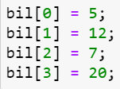

# JOBSHEET 10 - Array 1

## Tujuan
+ Mahasiswa mampu memahami pembuatan Array 1 dimensi dan pengaksesan elemenya di Java. 
+ Mahasiswa mampu membuat program dengan menggunakan konsep array satu dimensi.


## Alat dan Bahan
+ PC/laptop
+ Browser(chrome, firefox, safari)
+ Koneksi internet
+ Anaconda3 + Java kernel (opsional)

## Praktikum
### Percobaan 1: Mengisi Elemen Array
1. Pada percobaan ke-1 akan dilakukan percobaan untuk mengisi elemen array. Buat array bertipe integer dengan nama bil dengan kapasitas 4 elemen.


```Java
// Tulis Kode program Percobaan 1 Langkah 2 di atas
int[] bil = new int[4];
```

> Mendefinikan variabel `bil` bertipe data array int dengan jumlah elemen 4
___

2. Isi masing-masing elemen array bil tadi dengan angka 5, 12, 7, 20.



```Java
// Tulis Kode program Percobaan 1 Langkah 3 di atas
bil[0] = 5;
bil[1] = 12;
bil[2] = 7;
bil[3] = 20;
```


    20


> Memberikan nilai dimasing-masing elemen array pada variabel `bil`.
___

3. Tampilkan ke layar semua isi elemennya:


```Java
// Tulis Kode program Percobaan 1 Langkah 4
System.out.println(bil[0]);
System.out.println(bil[1]);
System.out.println(bil[2]);
System.out.println(bil[3]);
```

    5
    12
    7
    20
    

> Menampilkan kedalam layar value dari masing-masing elemen array variabel `bil`.
___

#### Pertanyaan 
1. Dari percobaan 1 berapakah indeks array terbesar dan terkecil?


```Java
// Tulis Jawaban no 1 disini
Indeks terbesar : 3
Indeks terkecil : 0
    
Indeks nilai terbesar : 3
Indeks nilai terkecil : 0
```

2. Jika Isi masing-masing elemen array bil diubah dengan angka 5.0, 12867, 7.5, 2000000. Apa yang terjadi? Mengapa bisa demikian?


```Java
// Tulis Jawaban no 2 yang disini
maka akan menampilkan error : incompatible types: possible lossy conversion from double to int.
karena tipe data dari array adalah integer sedangkan yang dimasukkan adalah nilai double.
```

3. Ubah statement pada langkah No 3 menjadi seperti berikut

Apa keluaran dari program? Mengapa bisa demikian?


```Java
// Tulis Jawaban no 3 yang disini
for (int i=0; i<4; i++){
    System.out.println(bil[i]);
}
```

    5
    12
    7
    20
    

> Hasilnya sama, karena hanya beda sintak yang awal menggunakan print satu bersatu dan yang ini menggunakan looping for.
___

### Percobaan 2: Meminta Inputan Pengguna untuk Mengisi Elemen Array
1. Pada percobaan ke-2 akan dilakukan percobaan yang meminta inputan pengguna untuk mengisi elemen array seperti pada flowchart berikut


```Java
// Tulis Kode program Percobaan 2 Langkah 1 di atas
import java.util.Scanner;

int nilaiUAS[] = new int[6];
Scanner input = new Scanner(System.in);

for (int i=0; i<6; i++){
    System.out.printf("Masukkan nilai UAS ke-%d : ", i);
    nilaiUAS[i] = input.nextInt();
}

for (int i=0; i<6; i++){
    System.out.printf("Nilai UAS ke-%d : %d\n", i, nilaiUAS[i]);
}
```

    Masukkan nilai UAS ke-0 : 62
    Masukkan nilai UAS ke-1 : 78
    Masukkan nilai UAS ke-2 : 84
    Masukkan nilai UAS ke-3 : 73
    Masukkan nilai UAS ke-4 : 86
    Masukkan nilai UAS ke-5 : 90
    Nilai UAS ke-0 : 62
    Nilai UAS ke-1 : 78
    Nilai UAS ke-2 : 84
    Nilai UAS ke-3 : 73
    Nilai UAS ke-4 : 86
    Nilai UAS ke-5 : 90
    

> 1. User mengimputkan nilai kedalam masing-masing elemen dengan tipe data integer.
> 2. Program akan mencetak inputan semua inputan secara berurutan.
___

2. Import dan deklarasikan Scanner untuk keperluan input. 


```Java
// Tulis Kode program Percobaan 2 Langkah 1 di atas
import java.util.Scanner;
Scanner sc = new Scanner(System.in);
```

> mengimport library `Scanner` dan mendefinisikan variabel `sc` dengan tipe data Scanner untuk digunakan sebagai inputan.
___

3. Buat array bertipe integer dengan nama nilaiUAS, dengan kapasitas 6 elemen.


```Java
// Tulis Kode program Percobaan 2 Langkah 3 di atas
int[] nilaiUAS = new int[6];
```

> Mendefinisikan variabel `nilaiUAS` bertipe data array integer dengan 6 elemen.
___

4. Menggunakan perulangan, buat input untuk mengisi elemen dari array nilaiUAS.


```Java
// Tulis Kode program Percobaan 2 Langkah 4 di atas
for (int i=0; i<6; i++){
    System.out.print("Masukkan nilai UAS ke-" + i + ": ");
    nilaiUAS[i] = sc.nextInt();
}
```

    Masukkan nilai UAS ke-0: 84
    Masukkan nilai UAS ke-1: 86
    Masukkan nilai UAS ke-2: 87
    Masukkan nilai UAS ke-3: 84
    Masukkan nilai UAS ke-4: 92
    Masukkan nilai UAS ke-5: 94
    

> Melakukan pengulangan `for` dengan sebanyak 6 kali, untuk membuat imputan user sebanyak itu, untuk mengisi dari masing-masing elemen array.
___

5. Menggunakan perulangan, tampilkan semua isi elemen dari array nilaiUAS.


```Java
// Tulis Kode program Percobaan 2 Langkah 5 di atas
for(int i=0; i<6; i++){
    System.out.printf("Nilai UAS ke-%d : %d\n", i, nilaiUAS[i]);
}
```

    Nilai UAS ke-0 : 84
    Nilai UAS ke-1 : 86
    Nilai UAS ke-2 : 87
    Nilai UAS ke-3 : 84
    Nilai UAS ke-4 : 92
    Nilai UAS ke-5 : 94
    

> Menampilkan semua isi dari elemen array `nilaiUAS` secara berurutan menggunakan looping.
___

#### Pertanyaan
1. Ubah statement pada langkah No 4 menjadi seperti berikut ini :

Jalankan program, apakah terjadi perubahan? Mengapa demikian?


```Java
// Tulis Jawaban nomor 1 disini
import java.util.Scanner;
Scanner sc = new Scanner(System.in);
int[] nilaiUAS = new int[6];

for (int i=0; i<nilaiUAS.length; i++){
    System.out.print("Masukkan nilai UAS ke-" + i + ": ");
    nilaiUAS[i] = sc.nextInt();
}
for(int i=0; i<6; i++){
    System.out.printf("Nilai UAS ke-%d : %d\n", i, nilaiUAS[i]);
}
```

    Masukkan nilai UAS ke-0: 73
    Masukkan nilai UAS ke-1: 78
    Masukkan nilai UAS ke-2: 87
    Masukkan nilai UAS ke-3: 94
    Masukkan nilai UAS ke-4: 84
    Masukkan nilai UAS ke-5: 80
    Nilai UAS ke-0 : 73
    Nilai UAS ke-1 : 78
    Nilai UAS ke-2 : 87
    Nilai UAS ke-3 : 94
    Nilai UAS ke-4 : 84
    Nilai UAS ke-5 : 80
    

> tidak terjadi perubahan, karena kebetulan jumlah dari elemen array `nilaiUAS` adalah 6.
___

2. Apa kegunaan dari `nilaiUAS.length`? 

// Tulis Jawaban nomor 2 disini
> `nilaiUAS.length` digunakan untuk mengetahui jumlah elemen array dari variabel `nilaiUAS`.
___

3. Ubah statement pada langkah No 5 menjadi seperti berikut ini sehingga program hanya menampilkan status mahasiswa yang lulus saja:

Jalankan program dan Jelaskan alur program!


```Java
// Tulis Jawaban nomor 3 disini
import java.util.Scanner;
Scanner sc = new Scanner(System.in);
int[] nilaiUAS = new int[6];
for (int i=0; i<nilaiUAS.length; i++){
    System.out.print("Masukkan nilai UAS ke-" + i + ": ");
    nilaiUAS[i] = sc.nextInt();
}
for (int i=0; i<nilaiUAS.length; i++){
    if(nilaiUAS[i] > 70){
        System.out.println("Mahasiswa ke-" + i + " lulus ");
    }
}
```

    Masukkan nilai UAS ke-0: 87
    Masukkan nilai UAS ke-1: 76
    Masukkan nilai UAS ke-2: 92
    Masukkan nilai UAS ke-3: 95
    Masukkan nilai UAS ke-4: 85
    Masukkan nilai UAS ke-5: 69
    Mahasiswa ke-0 lulus 
    Mahasiswa ke-1 lulus 
    Mahasiswa ke-2 lulus 
    Mahasiswa ke-3 lulus 
    Mahasiswa ke-4 lulus 
    

> 1. User mengimputkan nilai UAS sebanyak elemen array yaitu 6 kali.
> 2. dalam pengulangan kedua terdapat kondisi untuk mengecek apakah nilai dari elemen array tersebut lebih dari 70, jika iya maka akan menampilkan hasil lulus, jika tidak maka akan diabaikan.
___

### Percobaan 3: Melakukan Operasi Aritmatika terhadap Elemen Array
Pada praktikum ini, akan dilakukan percobaan untuk menjumlahkan Array. Program akan menerima input sebanyak 10 nilai mahasiswa. Kemudian program akan menampilkan nilai rata-rata nilai dari 10 Mahasiswa. Seperti flowchart berikut


1.Import dan deklarasikan Scanner untuk keperluan input. 


```Java
// Tulis Kode program Percobaan 3 Langkah 1 di atas, disini
import java.util.Scanner;
Scanner sc = new Scanner(System.in);
```

> mengimport library `Scanner` dan mendefinisikan variabel `sc` dengan tipe data Scanner untuk digunakan sebagai inputan.
___

2. Buat array nilaiMHS bertipe integer dengan kapasitas 10. Kemudian deklarasikan variable total dan rata seperti gambar berikut ini


```Java
// Tulis Kode program Percobaan 3 Langkah 2 di atas, disini
int nilaiMHS[] = new int[10];
double total;
double rata;
```

> Mendefinisikan variabel yang akan digunakan, yaitu nilaiMHS bertipe array interger, total dan rata dengan tipe data double.
___

3. Menggunakan perulangan, buat input untuk mengisi array nilaiMHS


```Java
// Tulis Kode program Percobaan 3 Langkah 3 di atas, disini
for(int i=0; i<nilaiMHS.length; i++){
    System.out.print("Masukkan nilai Mahasiswa ke-"+(i+1)+": ");
    nilaiMHS[i] = sc.nextInt();
}
```

    Masukkan nilai Mahasiswa ke-1: 86
    Masukkan nilai Mahasiswa ke-2: 95
    Masukkan nilai Mahasiswa ke-3: 94
    Masukkan nilai Mahasiswa ke-4: 93
    Masukkan nilai Mahasiswa ke-5: 94
    Masukkan nilai Mahasiswa ke-6: 93
    Masukkan nilai Mahasiswa ke-7: 86
    Masukkan nilai Mahasiswa ke-8: 79
    Masukkan nilai Mahasiswa ke-9: 85
    Masukkan nilai Mahasiswa ke-10: 94
    

> Membuat imputan user untuk mengisi elemen array, dengan menggunkan pengulangan for.
___

4. Menggunakan perulangan untuk menghitung jumlah keseluruhan nilai.


```Java
// Tulis Kode program Percobaan 3 Langkah 4 di atas, disini
for(int i=0; i<nilaiMHS.length; i++){
    total+=nilaiMHS[i];
}
```

> Menghitung total dari masing-masing nilai elemen array untuk mendapatkan totalnya.
___

5. Kemudian hitung nilai rata-rata dengan cara nilai total dibagi jumlah elemen dari array nilaiMHS\


```Java
// Tulis Kode program Percobaan 3 Langkah 3 di atas, disini
rata = total/nilaiMHS.length;
System.out.println("Rata-rata nilai mahasiswa adalah "+rata);
```

    Rata-rata nilai mahasiswa adalah 89.9


> Mencari nilai rata-rata dari total inputan user, dan mencetak hasilnya kelayar.
___

#### Pertanyaan 
1. Pada Percobaan 3 langkah ke-5. Mengapa perhitungan rata berada diluar perulangan?

// Tulis jawaban no 1 disini
> Karena semua nilai sudah dijumlahkan menjadi satu, tinggal membaginya dengan jumlah elemen array agar menghasilkan nilai rata-rata.
___

2. Modifikasi program pada percobaan 3 sehingga bisa mengeluarkan output  seperti gambar berikut ini!
syarat lulus nilai >70


```Java
// Tulis jawaban no 2 disini
import java.util.Scanner;

Scanner sc = new Scanner(System.in);
int nilaiMHS[] = new int[10];
int jmbLulus = 0, jmbTLulus = 0;
double totalLulus, totalTLulus;
double rata;

for(int i=0; i<nilaiMHS.length; i++){
    System.out.print("Masukkan nilai Mahasiswa ke-"+(i+1)+": ");
    nilaiMHS[i] = sc.nextInt();
}

for(int i=0; i<nilaiMHS.length; i++){
    if(nilaiMHS[i]>70){
        totalLulus+=nilaiMHS[i];
        jmbLulus++;
    }else{
        totalTLulus+=nilaiMHS[i];
        jmbTLulus++;
    }
}
rata = totalLulus/jmbLulus;
System.out.println("Rata-rata nilai mahasiswa yang lulus adalah "+rata);
rata = totalTLulus/jmbTLulus;
System.out.println("Rata-rata nilai mahasiswa yang tidak lulus adalah "+rata);
```

    Masukkan nilai Mahasiswa ke-1: 78
    Masukkan nilai Mahasiswa ke-2: 87
    Masukkan nilai Mahasiswa ke-3: 60
    Masukkan nilai Mahasiswa ke-4: 68
    Masukkan nilai Mahasiswa ke-5: 95
    Masukkan nilai Mahasiswa ke-6: 85
    Masukkan nilai Mahasiswa ke-7: 64
    Masukkan nilai Mahasiswa ke-8: 95
    Masukkan nilai Mahasiswa ke-9: 80
    Masukkan nilai Mahasiswa ke-10: 50
    Rata-rata nilai mahasiswa yang lulus adalah 86.66666666666667
    Rata-rata nilai mahasiswa yang tidak lulus adalah 60.5
    

> 1. User memasukkan inputan sebanyak 10 kali, dengan looping
> 2. pada looping kedua, terdapat kondisi jika elemen lebih besar dari 70 maka `totalLulus` ditambahkan dengan nilai elemen tersebut  dan variabel `jmbLulus` bertambah 1. jika tidak maka `totalTLulus` ditambahkan dengan nilai elemen tersebut  dan variabel `jmbTLulus` bertambah 1.
> 3. mencari rata-rata dari mahasiswa yang lulus dengan membagi antara `totalLulus` dengan `jmbLulus` dan hasilnya akan ditampilkan kelayar.
> 4. mencari rata-rata dari mahasiswa yang tidak lulus dengan membagi antara `totalTLulus` dengan `jmbTLulus` dan hasilnya akan ditampilkan kelayar.
___

### Percobaan 4: Pencarian menggunakan Array
Pada praktikum ini, akan dilakukan percobaan untuk mencari lokasi/indeks sebuah angka dalam array. Sesuai dengan flowchart di bawah ini:
 

1. Buat array arr[] bertipe integer dengan kapasitas 6 dan isi dengan nilai 6, 4, 1, 9, 7, 3, 2 dan 8. Kemudian deklarasikan variabel integer `key` untuk kata kunci pencarian dan variabel `hasil` untuk hasil indeks pencarian. Deklarasi dan inisialisasi seperti gambar berikut ini


```Java
// Tulis Kode program Percobaan 4 Langkah 1 di atas, disini
int[] arr = {6,4,1,9,7,3,2,8};
int key = 3;
int hasil = -1;
```

> Mendefinisikan variabel yang akan digunakan nanti.
___

2. Menggunakan perulangan, lakukan pencarian untuk mendapatkan nilai array yang sesuai dengan key. Bila ada yang sesuai, simpan indeksnya sebagai hasil pencarian


```Java
// Tulis Kode program Percobaan 4 Langkah 2 di atas, disini
for(int i=0; i<arr.length; i++){
    if(key==arr[i]){
        hasil=i;
        break;
    }
}
```

> Melakukan pengulangan untuk mencari elemen array yang nilainya sama dengan `key`, jika ketemu index dari elemen disimpan kedalam variabel `hasil`.
___

3. Tampilkan hasil pencarian dengan kode berikut.


```Java
// Tulis Kode program Percobaan 4 Langkah 3 di atas, disini
System.out.println("Key ada di array ke-"+hasil);
```

    Key ada di array ke-5


> Menampilkan hasil pencarian

#### Pertanyaan 
1. Pada Percobaan 4 langkah ke-2. Apa kegunaan dari statement `break`?


```Java
// Tulis jawaban no 1 disini
Untuk menggakhiri pengulangan for
```

2. Modifikasi program pada percobaan 4 sehingga key yang dicari adalah angka 5. Kemudian jalankan program, amati hasilnya! Jelaskan penyebab dari hasil tersebut! 


```Java
// Tulis jawaban no 2 disini

int[] arr = {16, 4, 10, 90, 27, 3, 12, 28};
int temp = 0;

for(int i = 0; i < arr.length; i++){
    for(int j = 1; j < (arr.length-i); j++){
        if(arr[j-1] > arr[j]){
            temp = arr[j-1];
            arr[j-1] = arr[j];
            arr[j] = temp;
        }
    }
}

System.out.println("Hasil pengurutan: ");
for(int i = 0; i < arr.length; i++)
    System.out.println(arr[i]);

// Tulis jawaban no 2 disini

int[] arr = {6,4,1,9,7,3,2,8};
int key = 5;
int hasil = -1;

for(int i=0; i<arr.length; i++){
    if(key==arr[i]){
        hasil=i;
        break;
    }
}

System.out.println("Key ada di array ke-"+hasil);

```

    Key ada di array ke--1


> hasilnya -1, karena didalam elemen array `arr` tidak terdapat angka 5, jadi akan menampilkan nilai default yang telah kita definisikan dipaling atas.
___

### Percobaan 5: Pengurutan bilangan menggunakan Array
Pada praktikum ini, akan dilakukan percobaan untuk mengurutkan angka dalam array. Sesuai dengan flowchart di bawah ini:

1.Buat array arr[] bertipe integer dengan kapasitas 8 dan isi dengan nilai 16, 4, 10, 90, 27, 3, 12 dan 28. Kemudian deklarasikan variabel integer `temp` untuk media penukaran nilai pada variabel. Deklarasi dan inisialisasi seperti gambar berikut ini


```Java
// Tulis Kode program Percobaan 5 Langkah 1 disini
int[] arr = {16, 4, 10, 90, 27, 3, 12, 28};
int temp = 0;
```

> mendefinisikan variabel yang akan kita gunakan nanti.
___

2. Menggunakan perulangan, lakukan pengurutan bilangan dengan menukar posisi indeks tersebut dengan indeks berikutnya. Perulangan dilakukan untuk menukar posisi berulang kali. 


```Java
// Tulis Kode program Percobaan 5 Langkah 2 di atas, disini
for(int i = 0; i < arr.length; i++){
    for(int j = 1; j < (arr.length-i); j++){
        if(arr[j-1] > arr[j]){
            temp = arr[j-1];
            arr[j-1] = arr[j];
            arr[j] = temp;
        }
    }
}
```

> Menurutkan nilai dari elemen array `arr`, dengan menukar posisi index, jika nilai elemen pada index sebelumnya lebih besar dari nilai elemen pada index saat ini.
___

3. Tampilkan hasil pengurutan dengan menggunakan perulangan


```Java
// Tulis Kode program Percobaan 5 Langkah 3 di atas, disini
System.out.println("Hasil pengurutan: ");
for(int i = 0; i < arr.length; i++)
    System.out.println(arr[i]);
```

    Hasil pengurutan: 
    3
    4
    10
    12
    16
    27
    28
    90
    

> Menampilkan hasil dari pengurutan dari kecil ke terbesar.
___

## Tugas
### Soal 1
Buatlah program yang **sesuai** dengan alur _flowchart_ di bawah ini


Flowchart diatas menggambarkan alur program yang membaca 10 masukan pengguna berupa integer dan menyimpannya. Kemudian angka ganjil dan genap disimpan kembali ke dalam variabel lain yang terpisah


```Java
/* Jawaban Soal 1 disini */
import java.util.Scanner;

Scanner sc = new Scanner(System.in);
int chechkNum[] = new int[10];
int evenNum[] = new int[10];
int oddNum[] = new int[10];
int cEven, cOdd = 0;

for (int i=0; i<chechkNum.length; i++){
    System.out.print("Masukkan angka ke-" + i + " : ");
    chechkNum[i] = sc.nextInt();
}

for (int j=0; j<chechkNum.length; j++){
    if (chechkNum[j] % 2 == 0){
        evenNum[cEven] = chechkNum[j];
        cEven++;
    } else {
        oddNum[cOdd] = chechkNum[j];
        cOdd++;
    }
}

System.out.print("\nNilai genap : ");
for(int i = 0; i < evenNum.length; i++) {
  if(evenNum[i] != 0) {
    System.out.printf("%d ", evenNum[i]);
  }
}

System.out.print("\nNilai ganjil : ");
for(int j = 0; j < oddNum.length; j++) {
  if(oddNum[j] != 0) {
    System.out.printf("%d ", oddNum[j]);
  }
}
```

    Masukkan angka ke-0 : 5
    Masukkan angka ke-1 : 7
    Masukkan angka ke-2 : 4
    Masukkan angka ke-3 : 8
    Masukkan angka ke-4 : 9
    Masukkan angka ke-5 : 10
    Masukkan angka ke-6 : 4
    Masukkan angka ke-7 : 6
    Masukkan angka ke-8 : 8
    Masukkan angka ke-9 : 9
    
    Nilai genap : 4 8 10 4 6 8 
    Nilai ganjil : 5 7 9 9 

#### Penjelasan :
> 1. melakukan looping untuk membuat inputan sebanyak jumlah elemen array guna mengisi nilai dari elemen pada variabel `chechkNum`.
> 2. Membuat looping kedua untuk mencari ganjil, genap dari masing-masing elemen, jika nilai elemen array hasil bagi 2 menghasilkan 0, maka akan ditampung kedalam variabel `evenNum` untuk menjadi genap dan increment variabel cEven untuk digunakan untuk jumlah looping nanti. 
> 3. jika tidak maka akan ditampung kedalam variabel `oddNum` untuk menjadi ganjil dan increment variabel cOdd untuk digunakan untuk jumlah looping nanti.
> 4. Menampilkan hasil angka dari pencarian ganjil, genap sesuai jenisnya.
___

>
___

### Soal 2
Buatlah program yang terdapat array dengan jumlah elemen 5, buatlah input untuk mengisi elemen array tersebut, kemudian tampilkan isi array tersebut dengan urutan terbalik. Seperti ilustrasi gambar dibawah ini.


```Java
/* Jawaban Soal 2 disini */
import java.util.Scanner;

Scanner sc = new Scanner(System.in);
int inputNum[] = new int[5];

for (int i=0; i<inputNum.length; i++){
    System.out.print("Masukkan angka ke-" + i + " : ");
    inputNum[i] = sc.nextInt();
}
System.out.println("\n====Output Tebalik=====");
for (int j=inputNum.length-1; j>=0; j--){
    System.out.println(" Nilai Elemen "+(inputNum.length-j-1)+": "+inputNum[j]);
}

```

    Masukkan angka ke-0 : 5
    Masukkan angka ke-1 : 2
    Masukkan angka ke-2 : 7
    Masukkan angka ke-3 : 9
    Masukkan angka ke-4 : 6
    
    ====Output Tebalik=====
     Nilai Elemen 0: 6
     Nilai Elemen 1: 9
     Nilai Elemen 2: 7
     Nilai Elemen 3: 2
     Nilai Elemen 4: 5
    

#### Penjelasan :
> 1. melakukan looping untuk membuat inputan sebanyak jumlah elemen array guna mengisi nilai dari elemen pada variabel `inputNum`.
> 2. Melakukan looping deincrement untuk membalikkan nilai dari elemen array, dan menampilkan kelayar.
___

> 
___

### Soal 3
Buatlah program yang menerima input jumlah elemen array, inputkan isi arraynya, kemudian tampilkan bilangan terbesar dari isi elemen arraynya. Contoh hasil program:


```Java
/* Jawaban Soal 3 disini */
import java.util.Scanner;

Scanner sc = new Scanner(System.in);
int inputNum[] = {};
int temp = 0, tot;

System.out.print("Masukkan isi array: ");
tot = sc.nextInt();
inputNum = new int[tot];

for (int i=0; i<inputNum.length; i++){
    System.out.print("Masukkan elemen array ke-" + i + ": ");
    inputNum[i] = sc.nextInt();
}
for (int j=0; j<inputNum.length; j++){
    if (inputNum[j] > temp){
        temp = inputNum[j];
    }
}
System.out.println("Bilangan terbesar adalah : "+temp);
```

    Masukkan isi array: 6
    Masukkan angka ke-0: 45
    Masukkan angka ke-1: 63
    Masukkan angka ke-2: 73
    Masukkan angka ke-3: 63
    Masukkan angka ke-4: 53
    Masukkan angka ke-5: 42
    Bilangan terbesar adalah : 73
    

#### Penjelasan :
> 1. user melakukan inputan untuk menentukan jumlah imputan berikutnya.
> 2. melakukan looping untuk membuat inputan sebanyak jumlah elemen array yang telah ditentukan sebelumnya guna mengisi nilai dari elemen pada variabel `inputNum`.
> 3. melakukan looping untuk mencari apakah nilai dari `temp` lebih besar dari isi elemen array pada index sekarang. jika bener maka variabel `temp` akan ditimpa dengan nilai elemen tersebut.
> 4. menampilkan hasil bilanga terbesar, yang ada pada variabel `temp` kelayar.
___
