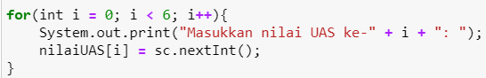

# JOBSHEET 10 - Array 1

## Tujuan
+ Mahasiswa mampu memahami pembuatan Array 1 dimensi dan pengaksesan elemenya di Java. 
+ Mahasiswa mampu membuat program dengan menggunakan konsep array satu dimensi.


## Alat dan Bahan
+ PC/laptop
+ Browser(chrome, firefox, safari)
+ Koneksi internet
+ Anaconda3 + Java kernel (opsional)

## Praktikum
### Percobaan 1: Mengisi Elemen Array
1. Pada percobaan ke-1 akan dilakukan percobaan untuk mengisi elemen array. Buat array bertipe integer dengan nama bil dengan kapasitas 4 elemen.


```Java
// Tulis Kode program Percobaan 1 Langkah 2 di atas
int[] bil=new int[4]
```

2. Isi masing-masing elemen array bil tadi dengan angka 5, 12, 7, 20.


```Java
// Tulis Kode program Percobaan 1 Langkah 3 di atas
int[] bil=new int[4];
bil [0] = 5;
bil [1] = 12;
bil [2] = 7;
bil [3] = 20;
```


    20


3. Tampilkan ke layar semua isi elemennya:


```Java
// Tulis Kode program Percobaan 1 Langkah 4
int[] bil=new int[4];
bil [0] = 5;
bil [1] = 12;
bil [2] = 7;
bil [3] = 20;
System.out.println(bil[0]);
System.out.println(bil[1]);
System.out.println(bil[2]);
System.out.println(bil[3]);
```

    5
    12
    7
    20


#### Pertanyaan 
1. Dari percobaan 1 berapakah indeks array terbesar dan terkecil?

**Tulis Jawaban no 1 disini**

**Jawaban :** Dari indeks array pada percobaan 1, indeks array **terbesar** adalah **bil[3] = 20** dan indeks array **terkecil** adalah **bil[0] = 5.**

2. Jika Isi masing-masing elemen array bil diubah dengan angka 5.0, 12867, 7.5, 2000000. Apa yang terjadi? Mengapa bisa demikian?


```Java
int[] bil=new int[4];
bil [0] = 5.0;
bil [1] = 12867;
bil [2] = 7.5;
bil [3] = 2000000;
System.out.println(bil[0]);
System.out.println(bil[1]);
System.out.println(bil[2]);
System.out.println(bil[3]);
```


    |   bil [0] = 5.0;

    incompatible types: possible lossy conversion from double to int

    


**Tulis Jawaban no 2 disini**

**Jawaban :** Apabila masing-masing elemen array bilangan dirubah sesuai dengan contoh diatas akan mengalami **error.**

Alasannya karena tipe data yang digunakan adalah tipe data **"Interger"** yang merupakan tipe data dengan output nilai bilangan bulat. Sedangkan pada elemen array bilangan diatas pada nilainya menggunakan tipe data yang memiliki nilai output bilangan rill seperti **"Float"** dan **"Double"**.

3. Ubah statement pada langkah No 3 menjadi seperti berikut

Apa keluaran dari program? Mengapa bisa demikian?


```Java
// Tulis Jawaban no 3 yang disini
int[] bil=new int[4];
bil [0] = 5;
bil [1] = 12;
bil [2] = 7;
bil [3] = 20;
for (int i=0; i<4; i++){
    System.out.println(bil[i]);
}
```

    5
    12
    7
    20


**Tulis Jawaban no 3 disini**

**Jawaban :** Keluaran dari pemrograman diatas sama dengan keluaran pemrograman yang terjadi pada percobaan 1 bagian langkah 3.

Namun pada pemrograman diatas, fungsi pencetak nilai keluaran dirubah. Pada percobaan 1 langkah ke 3 menggunakan banyak fungsi **"System.out.println"** yang diganti menggunakan statement perulangan yaitu **"For"** dipadu dengan satu perintah/fungsi **"System.out.println"**.

### Percobaan 2: Meminta Inputan Pengguna untuk Mengisi Elemen Array
1. Pada percobaan ke-2 akan dilakukan percobaan yang meminta inputan pengguna untuk mengisi elemen array seperti pada flowchart berikut


```Java
// Tulis Kode program Percobaan 2 Langkah 1 di atas
import java.util.Scanner;
Scanner sc = new Scanner(System.in);

int[] nilaiUAS=new int[6];
for(int i=0; i<6; i++){
    System.out.println(nilaiUAS[i]);
    nilaiUAS[i] = sc.nextInt();
}
for(int i = 0; i<6; i++){
    System.out.println("Nilai UAS ke-" + i + " adalah :" +nilaiUAS[i]);
}
```

    0
    100
    0
    98
    0
    78
    0
    88
    0
    68
    0
    58
    Nilai UAS ke-0 adalah :100
    Nilai UAS ke-1 adalah :98
    Nilai UAS ke-2 adalah :78
    Nilai UAS ke-3 adalah :88
    Nilai UAS ke-4 adalah :68
    Nilai UAS ke-5 adalah :58


2. Import dan deklarasikan Scanner untuk keperluan input. 


```Java
// Tulis Kode program Percobaan 2 Langkah 1 di atas
import java.util.Scanner;
Scanner sc = new Scanner(System.in);
```

3. Buat array bertipe integer dengan nama nilaiUAS, dengan kapasitas 6 elemen.


```Java
// Tulis Kode program Percobaan 2 Langkah 3 di atas
int[] nilaiUAS=new int[6];
```

4. Menggunakan perulangan, buat input untuk mengisi elemen dari array nilaiUAS.



```Java
// Tulis Kode program Percobaan 2 Langkah 4 di atas
import java.util.Scanner;
Scanner sc = new Scanner(System.in);

int[] nilaiUAS=new int[6];
for(int i=0; i<6; i++){
    System.out.print("Masukkan nilai UAS ke-" + i + ": ");
    nilaiUAS[i] = sc.nextInt();
}
```

    Masukkan nilai UAS ke-0: 100
    Masukkan nilai UAS ke-1: 68
    Masukkan nilai UAS ke-2: 88
    Masukkan nilai UAS ke-3: 77
    Masukkan nilai UAS ke-4: 45
    Masukkan nilai UAS ke-5: 56


5. Menggunakan perulangan, tampilkan semua isi elemen dari array nilaiUAS.


```Java
// Tulis Kode program Percobaan 2 Langkah 5 di atas
import java.util.Scanner;
Scanner sc = new Scanner(System.in);

int[] nilaiUAS=new int[6];
for(int i = 0; i<6; i++){
    System.out.print("Masukkan nilai UAS ke-" + i + "adalah: " + nilaiUAS[i]);
    nilaiUAS[i] = sc.nextInt();
}
```

    Masukkan nilai UAS ke-0adalah: 0100
    Masukkan nilai UAS ke-1adalah: 098
    Masukkan nilai UAS ke-2adalah: 088
    Masukkan nilai UAS ke-3adalah: 076
    Masukkan nilai UAS ke-4adalah: 054
    Masukkan nilai UAS ke-5adalah: 012


#### Pertanyaan
1. Ubah statement pada langkah No 4 menjadi seperti berikut ini :

Jalankan program, apakah terjadi perubahan? Mengapa demikian?


```Java
// Tulis Jawaban nomor 1 disini
import java.util.Scanner;
Scanner sc = new Scanner(System.in);

int[] nilaiUAS=new int[6];
for(int i=0; i < nilaiUAS.length; i++){
    System.out.print("Masukkan nilai UAS ke-" + i + ": ");
    nilaiUAS[i] = sc.nextInt();
}
```

    Masukkan nilai UAS ke-0: 100
    Masukkan nilai UAS ke-1: 89
    Masukkan nilai UAS ke-2: 78
    Masukkan nilai UAS ke-3: 66
    Masukkan nilai UAS ke-4: 77
    Masukkan nilai UAS ke-5: 56


**Tulis Jawaban no 1 disini**

**Jawaban :** Terjadi perubahan pada bagian statement, yang awalnya menggunakan **"i < 6"** diganti dengan **"nilaiUAS.length"**. 

Namun nilai keluaran (output) yang dihasilkan tidak berubah maupun berbeda dengan menggunakan statement sebelumnya yaitu **"i < 6"**.

2. Apa kegunaan dari `nilaiUAS.length`? 

**Tulis Jawaban nomor 2 disini**

**Jawaban :** Kegunaan atau fungsi dari **"nilaiUAS.length"** sendiri adalah untuk memeriksa panjang dari variabel dengan tipe data string atau tipe data lainnya.


3. Ubah statement pada langkah No 5 menjadi seperti berikut ini sehingga program hanya menampilkan status mahasiswa yang lulus saja:

Jalankan program dan Jelaskan alur program!


```Java
for(int i = 0; i < nilaiUAS.length; i++) {
    if(nilaiUAS[i] > 70) {
        System.out.println("Mahasiswa ke-"+ i +" lulus");   
    }
}
```

    Mahasiswa ke-0 lulus
    Mahasiswa ke-1 lulus
    Mahasiswa ke-2 lulus
    Mahasiswa ke-4 lulus


**Tulis Jawaban nomor 3 disini**

**Jawaban :** Pemrograman diatas menampilkan nilai atau hasil keluaran yang berupa kalimat bagi mahasiswa yang berhasil lulus dengan nilai > 70.

Lalu diatas menggunakan pernyataan if sebagai pengecek dari seluruh nilai UAS Mahasiswa yang telah diinputkan/dimasukkan apakah nilai mereka diatas 70 atau dibawah 70.

### Percobaan 3: Melakukan Operasi Aritmatika terhadap Elemen Array
Pada praktikum ini, akan dilakukan percobaan untuk menjumlahkan Array. Program akan menerima input sebanyak 10 nilai mahasiswa. Kemudian program akan menampilkan nilai rata-rata nilai dari 10 Mahasiswa. Seperti flowchart berikut


1.Import dan deklarasikan Scanner untuk keperluan input. 


```Java
// Tulis Kode program Percobaan 3 Langkah 1 di atas, disini
import java.util.Scanner;
Scanner sc = new Scanner(System.in);
```

2. Buat array nilaiMHS bertipe integer dengan kapasitas 10. Kemudian deklarasikan variable total dan rata seperti gambar berikut ini


```Java
// Tulis Kode program Percobaan 3 Langkah 2 di atas, disini
int[] nilaiMHS=new int[10];
double total;
double rata;
```

3. Menggunakan perulangan, buat input untuk mengisi array nilaiMHS


```Java
// Tulis Kode program Percobaan 3 Langkah 3 di atas, disini
for(int i = 0; i < nilaiMHS.length; i++) {
    System.out.print("Masukkan nilai Mahasiswa ke-" + (i + 1) + ":");
    nilaiMHS[i] = sc.nextInt();
}
```

    Masukkan nilai Mahasiswa ke-1:100
    Masukkan nilai Mahasiswa ke-2:90
    Masukkan nilai Mahasiswa ke-3:78
    Masukkan nilai Mahasiswa ke-4:98
    Masukkan nilai Mahasiswa ke-5:77
    Masukkan nilai Mahasiswa ke-6:67
    Masukkan nilai Mahasiswa ke-7:66
    Masukkan nilai Mahasiswa ke-8:87
    Masukkan nilai Mahasiswa ke-9:88
    Masukkan nilai Mahasiswa ke-10:76


4. Menggunakan perulangan untuk menghitung jumlah keseluruhan nilai.


```Java
// Tulis Kode program Percobaan 3 Langkah 4 di atas, disini
import java.util.Scanner;
Scanner sc = new Scanner(System.in);

int[] nilaiMHS=new int[10];
double total;
double rata;

for(int i = 0; i < nilaiMHS.length; i++) {
    System.out.print("Masukkan nilai Mahasiswa ke-" + (i + 1) + ":");
    nilaiMHS[i] = sc.nextInt();
}
for(int i = 0; i < nilaiMHS.length; i++) {
    total += nilaiMHS[i];
}
```

    Masukkan nilai Mahasiswa ke-1:100
    Masukkan nilai Mahasiswa ke-2:78
    Masukkan nilai Mahasiswa ke-3:99
    Masukkan nilai Mahasiswa ke-4:76
    Masukkan nilai Mahasiswa ke-5:87
    Masukkan nilai Mahasiswa ke-6:88
    Masukkan nilai Mahasiswa ke-7:67
    Masukkan nilai Mahasiswa ke-8:76
    Masukkan nilai Mahasiswa ke-9:88
    Masukkan nilai Mahasiswa ke-10:93


5. Kemudian hitung nilai rata-rata dengan cara nilai total dibagi jumlah elemen dari array nilaiMHS\


```Java
// Tulis Kode program Percobaan 3 Langkah 3 di atas, disini
import java.util.Scanner;
Scanner sc = new Scanner(System.in);

int[] nilaiMHS=new int[10];
double total;
double rata;

for(int i = 0; i < nilaiMHS.length; i++) {
    System.out.print("Masukkan nilai Mahasiswa ke-" + (i + 1) + ":");
        nilaiMHS[i] = sc.nextInt();
}
    for(int i = 0; i < nilaiMHS.length; i++) {
        total += nilaiMHS[i];
}
    rata = total/nilaiMHS.length;
        System.out.println("Rata-rata nilai mahasiswa adalah " + rata);
```

    Masukkan nilai Mahasiswa ke-1:100
    Masukkan nilai Mahasiswa ke-2:90
    Masukkan nilai Mahasiswa ke-3:88
    Masukkan nilai Mahasiswa ke-4:76
    Masukkan nilai Mahasiswa ke-5:73
    Masukkan nilai Mahasiswa ke-6:54
    Masukkan nilai Mahasiswa ke-7:65
    Masukkan nilai Mahasiswa ke-8:88
    Masukkan nilai Mahasiswa ke-9:80
    Masukkan nilai Mahasiswa ke-10:79
    Rata-rata nilai mahasiswa adalah 79.3


#### Pertanyaan 
1. Pada Percobaan 3 langkah ke-5. Mengapa perhitungan rata berada diluar perulangan?

**Tulis jawaban no 1 disini**

Perhitungan rata berada diluar perulangan dikarenakan perintah perhitungan nilai rata-rata dari seluruh nilai UAS berada pada luar perulangan dan baru ditambahkan setelah perulangan selesai.

2. Modifikasi program pada percobaan 3 sehingga bisa mengeluarkan output  seperti gambar berikut ini!
syarat lulus nilai >70


```Java
// Tulis jawaban no 2 disini
import java.util.Scanner;
Scanner sc = new Scanner(System.in);

int[] nilaiMHS=new int[10];
int l = 0;
int t = 0;
double total;
double lulus, tidakLulus;
double rataLulus, rataTidaklulus;
for(int i = 0; i < nilaiMHS.length; i++) {
    System.out.print("Masukkan nilai Mahasiswa ke-" + (i + 1) + ":");
        nilaiMHS[i] = sc.nextInt();
}
    for(int i = 0; i < nilaiMHS.length; i++) {
        if (nilaiMHS[i]>70){
            lulus += nilaiMHS[i];
            l++;
        }else{
            tidakLulus += nilaiMHS[i];
            t++;
        }
}
    rataLulus = lulus/(nilaiMHS.length - l);
        System.out.println("Rata-rata nilai mahasiswa yang lulus adalah " + rataLulus);
    rataTidaklulus = tidakLulus/ (nilaiMHS.length - t);
        System.out.println("Rata-rata nilai mahasiswa yang tidak lulus adalah " + rataTidaklulus);
```

    Masukkan nilai Mahasiswa ke-1:100
    Masukkan nilai Mahasiswa ke-2:90
    Masukkan nilai Mahasiswa ke-3:89
    Masukkan nilai Mahasiswa ke-4:87
    Masukkan nilai Mahasiswa ke-5:66
    Masukkan nilai Mahasiswa ke-6:76
    Masukkan nilai Mahasiswa ke-7:56
    Masukkan nilai Mahasiswa ke-8:54
    Masukkan nilai Mahasiswa ke-9:43
    Masukkan nilai Mahasiswa ke-10:23
    Rata-rata nilai mahasiswa yang lulus adalah 88.4
    Rata-rata nilai mahasiswa yang tidak lulus adalah 48.4


### Percobaan 4: Pencarian menggunakan Array
Pada praktikum ini, akan dilakukan percobaan untuk mencari lokasi/indeks sebuah angka dalam array. Sesuai dengan flowchart di bawah ini:
 

1. Buat array arr[] bertipe integer dengan kapasitas 6 dan isi dengan nilai 6, 4, 1, 9, 7, 3, 2 dan 8. Kemudian deklarasikan variabel integer `key` untuk kata kunci pencarian dan variabel `hasil` untuk hasil indeks pencarian. Deklarasi dan inisialisasi seperti gambar berikut ini


```Java
// Tulis Kode program Percobaan 4 Langkah 1 di atas, disini
int[] arr = {6,4,1,9,7,3,2,8};
int key = 3;
int hasil = -1;
```

2. Menggunakan perulangan, lakukan pencarian untuk mendapatkan nilai array yang sesuai dengan key. Bila ada yang sesuai, simpan indeksnya sebagai hasil pencarian


```Java
// Tulis Kode program Percobaan 4 Langkah 2 di atas, disini
for(int i=0; i<arr.length; i++) {
    if(key==arr[i]) {
        hasil=i;
        break;
    }
}
```

3. Tampilkan hasil pencarian dengan kode berikut.


```Java
// Tulis Kode program Percobaan 4 Langkah 3 di atas, disini
System.out.println("Key ada di array ke-" + hasil);
```

    Key ada di array ke-5


#### Pertanyaan 
1. Pada Percobaan 4 langkah ke-2. Apa kegunaan dari statement `break`?

**Tulis jawaban no 1 disini**

**Jawaban :** Fungsi dari statement **"Break"** adalah untuk menghentikan suatu perulangan apabila output yang benar sudah ditemukan atau terjawab dengan baik.

2. Modifikasi program pada percobaan 4 sehingga key yang dicari adalah angka 5. Kemudian jalankan program, amati hasilnya! Jelaskan penyebab dari hasil tersebut! 


```Java
// Tulis jawaban no 2 disini
int[] arr = {6,4,1,9,7,3,2,8};
int hasil = -1;
int key = 5;

for(int i = 0; i < arr.length; i++){
        if(key==arr[i]){
            hasil = i;
            break;
    }
}
System.out.println("Key ada di array ke- " + ":" + hasil);
```

    Key ada di array ke- :-1


**Tulis jawaban no 2 disini**

**Jawaban :** Mengapa hasil dari statement array diatas adalah -1 ? Karena pada tipe data interger[] arr = disana terdapat nilai masukan untuk statement array yang akan dijalankan. 

Pada nilai masukkan tersebut tidak ada nilai bilangan 5, maka karena key yang dicari adalah angka 5 dirubah dengan hasil keluaran yang berupa -1 yang menandakan bahwa angka 5 tidak ada pada  deretan array tersebut.

### Percobaan 5: Pengurutan bilangan menggunakan Array
Pada praktikum ini, akan dilakukan percobaan untuk mengurutkan angka dalam array. Sesuai dengan flowchart di bawah ini:

1.Buat array arr[] bertipe integer dengan kapasitas 8 dan isi dengan nilai 16, 4, 10, 90, 27, 3, 12 dan 28. Kemudian deklarasikan variabel integer `temp` untuk media penukaran nilai pada variabel. Deklarasi dan inisialisasi seperti gambar berikut ini


```Java
// Tulis Kode program Percobaan 5 Langkah 1 disini
int[] arr = {16, 4, 10, 90, 27, 3, 12, 28};
int temp = 0;
```

2. Menggunakan perulangan, lakukan pengurutan bilangan dengan menukar posisi indeks tersebut dengan indeks berikutnya. Perulangan dilakukan untuk menukar posisi berulang kali. 


```Java
// Tulis Kode program Percobaan 5 Langkah 2 di atas, disini
for(int i = 0; i < arr.length; i++){
    for(int j = 1; j < (arr.length-i); j++){
        if(arr[j-1] > arr[j]){
            temp = arr[j-1];
            arr[j-1] = arr[j];
            arr[j] = temp;
        }
    }
}
```

3. Tampilkan hasil pengurutan dengan menggunakan perulangan


```Java
// Tulis Kode program Percobaan 5 Langkah 3 di atas, disini
System.out.println("Hasil pengurutan: ");
for(int i = 0; i < arr.length; i++)
    System.out.println(arr[i]);
```

    Hasil pengurutan: 
    3
    4
    10
    12
    16
    27
    28
    90


## Tugas
### Soal 1
Buatlah program yang **sesuai** dengan alur _flowchart_ di bawah ini


Flowchart diatas menggambarkan alur program yang membaca 10 masukan pengguna berupa integer dan menyimpannya. Kemudian angka ganjil dan genap disimpan kembali ke dalam variabel lain yang terpisah


```Java
/* Jawaban Soal 1 disini */
import java.util.Scanner;
Scanner sc = new Scanner(System.in);

int checkNum[] = new int[10];
int evenNum [] = new int[10];
int oddNum [] = new int[10];
int cEven, cOdd = 0;

for(int x=0; x<checkNum.length; x++){
    System.out.println("Masukkan Bilangan/Angka : ");
    checkNum[x] = sc.nextInt();
}
for(int y=0; y<checkNum.length; y++){
    if(checkNum[y] %2==0){
        evenNum[cEven] = checkNum[y];
        cEven++;
    } else {
        oddNum[cOdd] = checkNum[y];
        cOdd++;
    }
}

for(int i = 0; i < cEven; i++){
    System.out.println("Genap :");
    System.out.printf("%d\n",evenNum[i]);
}


for(int i = 0; i < cOdd; i++){
    System.out.println("Ganjil :");
    System.out.printf("%d\n",oddNum[i]);
}
```

    Masukkan Bilangan/Angka : 
    1
    Masukkan Bilangan/Angka : 
    2
    Masukkan Bilangan/Angka : 
    3
    Masukkan Bilangan/Angka : 
    4
    Masukkan Bilangan/Angka : 
    5
    Masukkan Bilangan/Angka : 
    6
    Masukkan Bilangan/Angka : 
    7
    Masukkan Bilangan/Angka : 
    8
    Masukkan Bilangan/Angka : 
    9
    Masukkan Bilangan/Angka : 
    10
    Genap :
    2
    Genap :
    4
    Genap :
    6
    Genap :
    8
    Genap :
    10
    Ganjil :
    1
    Ganjil :
    3
    Ganjil :
    5
    Ganjil :
    7
    Ganjil :
    9


### Soal 2
Buatlah program yang terdapat array dengan jumlah elemen 5, buatlah input untuk mengisi elemen array tersebut, kemudian tampilkan isi array tersebut dengan urutan terbalik. Seperti ilustrasi gambar dibawah ini.


```Java
/* Jawaban Soal 2 disini */
import java.util.Scanner;
Scanner input = new Scanner(System.in);

int arr[];
arr = new int[5];
    for (int i = 0; i < 5; i++){
        System.out.print("Masukkan urutan : ");
            arr[i] = input.nextInt();
    }
System.out.print("Hasil terbalik adalah : ");
for (int i = 5-1; i>=0; i--){
    System.out.print(arr[i]+",");
}
```

    Masukkan urutan : 5
    Masukkan urutan : 2
    Masukkan urutan : 7
    Masukkan urutan : 9
    Masukkan urutan : 6
    Hasil terbalik adalah : 6,9,7,2,5,

**Tulis Jawaban nomor 2 disini**

**Jawaban :** 

1. Pemrograman diatas menggunakan perintah Scanner untuk memasukkan nilai dari variabel.

2. Lalu pemrograman diatas melakukan perintah looping untuk mendapatakan nilai yang diinput lalu melakukan tahap operasi decrement untuk membalik nilai array yang awalannya merupakan angka 5 menjadi angka 6 dan seterusnya.

### Soal 3
Buatlah program yang menerima input jumlah elemen array, inputkan isi arraynya, kemudian tampilkan bilangan terbesar dari isi elemen arraynya. Contoh hasil program:


```Java
/* Jawaban Soal 3 disini */
import java.util.Scanner;
Scanner sc = new Scanner(System.in);

System.out.println("Masukkan isi array :");
int[] array=new int[sc.nextInt()];
int besar = 0;

for(int i = 0; i < array.length; i++) {
    System.out.println("Masukkan elemen array ke- " + i + ":");
        array[i] = sc.nextInt();{
        }if (array[i] > besar){
            besar = array[i];
        }
    }
        System.out.println("Bilangan Terbesar adalah : " + besar);
```

    Masukkan isi array :
    5
    Masukkan elemen array ke- 0:
    12
    Masukkan elemen array ke- 1:
    3
    Masukkan elemen array ke- 2:
    4
    Masukkan elemen array ke- 3:
    5
    Masukkan elemen array ke- 4:
    6
    Bilangan Terbesar adalah : 12


**Tulis Jawaban nomor 3 disini**

**Jawaban :** 

1. Pemrograman diatas menggunakan perintah scanner untuk memasukan nilai atau input nilai yang diinginkan.

2. Terjadinya perulangan pada variabel lalu mencari nilai yang terbesar sesuai dengan nilai yang dimasukkan.

3. Apabila sudah ditemukan nilai terbesar maka akan muncul kalimat yang bertuliskan **"Bilangan Terbesar adalah :"** beserta nilai atau bilangan terbesar yang sudah diinputkan tadi.
