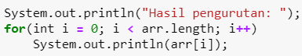

# JOBSHEET 10 - Array 1

## Tujuan
+ Mahasiswa mampu memahami pembuatan Array 1 dimensi dan pengaksesan elemenya di Java. 
+ Mahasiswa mampu membuat program dengan menggunakan konsep array satu dimensi.


## Alat dan Bahan
+ PC/laptop
+ Browser(chrome, firefox, safari)
+ Koneksi internet
+ Anaconda3 + Java kernel (opsional)

## Praktikum
### Percobaan 1: Mengisi Elemen Array
1. Pada percobaan ke-1 akan dilakukan percobaan untuk mengisi elemen array. Buat array bertipe integer dengan nama bil dengan kapasitas 4 elemen.


```Java
// Tulis Kode program Percobaan 1 Langkah 2 di atas
int[] bil=new int[4];
```

2. Isi masing-masing elemen array bil tadi dengan angka 5, 12, 7, 20.


```Java
// Tulis Kode program Percobaan 1 Langkah 3 di atas
int[] bil={5, 12, 7, 20};
```

3. Tampilkan ke layar semua isi elemennya:


```Java
// Tulis Kode program Percobaan 1 Langkah 4
System.out.println(bil[0]);
System.out.println(bil[1]);
System.out.println(bil[2]);
System.out.println(bil[3]);

```

    5
    12
    7
    20


#### Pertanyaan 
1. Dari percobaan 1 berapakah indeks array terbesar dan terkecil?


```Java
// Tulis Jawaban no 1 disini
yang terkecil adalah 0 dan yang terbesar adalah 3
```

2. Jika Isi masing-masing elemen array bil diubah dengan angka 5.0, 12867, 7.5, 2000000. Apa yang terjadi? Mengapa bisa demikian?


```Java
// Tulis Jawaban no 2 yang disini
int[] bil={5.0, 12867, 7.5, 2000000};
System.out.println(bil[0]);
System.out.println(bil[1]);
System.out.println(bil[2]);
System.out.println(bil[3]);

```


    |   int[] bil={5.0, 12867, 7.5, 2000000};

    incompatible types: possible lossy conversion from double to int

    

    |   int[] bil={5.0, 12867, 7.5, 2000000};

    incompatible types: possible lossy conversion from double to int

    


3. Ubah statement pada langkah No 3 menjadi seperti berikut

Apa keluaran dari program? Mengapa bisa demikian?


```Java
// Tulis Jawaban no 3 yang disini
for(int i=0; i<4; i++){
    System.out.println(bil[i]);
}
```

    5
    12
    7
    20
sebenarnya ini sudah ada di langkah ke 4 namun dilangkah ke 4 kita menuliskan satu persatu dan disini kita mengguakan perulangan for

### Percobaan 2: Meminta Inputan Pengguna untuk Mengisi Elemen Array
1. Pada percobaan ke-2 akan dilakukan percobaan yang meminta inputan pengguna untuk mengisi elemen array seperti pada flowchart berikut


```Java
// Tulis Kode program Percobaan 2 Langkah 1 di atas
```

2. Import dan deklarasikan Scanner untuk keperluan input. 


```Java
// Tulis Kode program Percobaan 2 Langkah 1 di atas
import java.util.Scanner;
Scanner sc= new Scanner(System.in);
```

3. Buat array bertipe integer dengan nama nilaiUAS, dengan kapasitas 6 elemen.


```Java
// Tulis Kode program Percobaan 2 Langkah 3 di atas
int nilaiUas[] = new int [6];
```
disini kode berfungsi untuk mendeklarasikan dan menginstansiasi array

4. Menggunakan perulangan, buat input untuk mengisi elemen dari array nilaiUAS.


```Java
// Tulis Kode program Percobaan 2 Langkah 4 di atas
for(int i=0; i<6; i++){
    System.out.print("Masukkan nilai UAS ke- " + i + ": ");
    nilaiUas[i]= sc.nextInt();
}
```

    Masukkan nilai UAS ke- 0: 6
    Masukkan nilai UAS ke- 1: 2
    Masukkan nilai UAS ke- 2: 3
    Masukkan nilai UAS ke- 3: 7
    Masukkan nilai UAS ke- 4: 9
    Masukkan nilai UAS ke- 5: 10


##### 5. Menggunakan perulangan, tampilkan semua isi elemen dari array nilaiUAS.


```Java
// Tulis Kode program Percobaan 2 Langkah 5 di atas
for(int i=0; i<6; i++){
    System.out.println("Nilai UAS ke- " + i + " adalah: " + nilaiUas[i]);
}
```

    Nilai UAS ke- 0 adalah: 6
    Nilai UAS ke- 1 adalah: 2
    Nilai UAS ke- 2 adalah: 3
    Nilai UAS ke- 3 adalah: 7
    Nilai UAS ke- 4 adalah: 9
    Nilai UAS ke- 5 adalah: 10

    kita menggunakan nilai i untuk memberitahu user index ke berapa yang ingin diberi nilai.


#### Pertanyaan
1. Ubah statement pada langkah No 4 menjadi seperti berikut ini :

Jalankan program, apakah terjadi perubahan? Mengapa demikian?

sama saja karna nilaiUAS.length disini digunakan untuk mengetahui panjang index dari sebuah array

```Java
// Tulis Jawaban nomor 1 disini
for(int i=0; i<nilaiUas.length; i++){
    System.out.print("Masukkan nilai UAS ke- " + i + ": ");
    nilaiUas[i]= sc.nextInt();
}
```

    Masukkan nilai UAS ke- 0: 50
    Masukkan nilai UAS ke- 1: 60
    Masukkan nilai UAS ke- 2: 70
    Masukkan nilai UAS ke- 3: 80
    Masukkan nilai UAS ke- 4: 90
    Masukkan nilai UAS ke- 5: 100


2. Apa kegunaan dari `nilaiUAS.length`? 


```Java
// Tulis Jawaban nomor 2 disini
mengetahui panjang index dari sebuah array
```

3. Ubah statement pada langkah No 5 menjadi seperti berikut ini sehingga program hanya menampilkan status mahasiswa yang lulus saja:

Jalankan program dan Jelaskan alur program!


```Java
// Tulis Jawaban nomor 3 disini
for(int i=0; i<nilaiUas.length; i++){
    if(nilaiUas[i]> 70){
        System.out.println("Mahasiswa ke-" + i + "  Lulus");
    }
}
```

    Mahasiswa ke-3  Lulus
    Mahasiswa ke-4  Lulus
    Mahasiswa ke-5  Lulus
kode program diatas digunakan untuk menentukan nilai yang sudah kita inputkan lulus dengan cara menambahkan kondisi jika nilai lebih dari 70 maka lulus 

### Percobaan 3: Melakukan Operasi Aritmatika terhadap Elemen Array
Pada praktikum ini, akan dilakukan percobaan untuk menjumlahkan Array. Program akan menerima input sebanyak 10 nilai mahasiswa. Kemudian program akan menampilkan nilai rata-rata nilai dari 10 Mahasiswa. Seperti flowchart berikut


1.Import dan deklarasikan Scanner untuk keperluan input. 


```Java
// Tulis Kode program Percobaan 3 Langkah 1 di atas, disini
import java.util.Scanner;
Scanner sc= new Scanner(System.in);
```

2. Buat array nilaiMHS bertipe integer dengan kapasitas 10. Kemudian deklarasikan variable total dan rata seperti gambar berikut ini


```Java
// Tulis Kode program Percobaan 3 Langkah 2 di atas, disini
int nilaiMHS[] = new int[10];
double total;
double rata;
```

3. Menggunakan perulangan, buat input untuk mengisi array nilaiMHS


```Java
// Tulis Kode program Percobaan 3 Langkah 3 di atas, disini
for(int i=0; i<nilaiMHS.length; i++){
    System.out.print("Masukkan nilai Mahasiswa ke-" +(i+1)+ ":");
    nilaiMHS[i]= sc.nextInt();
}
```

    Masukkan nilai Mahasiswa ke-1:50
    Masukkan nilai Mahasiswa ke-2:60
    Masukkan nilai Mahasiswa ke-3:70
    Masukkan nilai Mahasiswa ke-4:80
    Masukkan nilai Mahasiswa ke-5:90
    Masukkan nilai Mahasiswa ke-6:100
    Masukkan nilai Mahasiswa ke-7:10
    Masukkan nilai Mahasiswa ke-8:20
    Masukkan nilai Mahasiswa ke-9:30
    Masukkan nilai Mahasiswa ke-10:40


4. Menggunakan perulangan untuk menghitung jumlah keseluruhan nilai.


```Java
// Tulis Kode program Percobaan 3 Langkah 4 di atas, disini
for(int i=0; i<nilaiMHS.length; i++){
    total+=nilaiMHS[i];
}
```

5. Kemudian hitung nilai rata-rata dengan cara nilai total dibagi jumlah elemen dari array nilaiMHS\


```Java
// Tulis Kode program Percobaan 3 Langkah 3 di atas, disini
rata= total/nilaiMHS.length;
System.out.println("Rata-rata nilai mahasiswa adalah "+rata);

```

    Rata-rata nilai mahasiswa adalah 55.0
di percobaan ini kita akan menginputkan nilai mahasiswa sebanyak 10 kali karena panjang indexnya adalah 10. sebelum mencari rata rata kita harus menambahkan nilai yang sudah di inputkan pada index dengan menjumlahkan nilaiMHS dan ditampung di total setelah itu kita bisa mencari rata ratanya dengan total dibagi dengan nilaiMHS

#### Pertanyaan 
1. Pada Percobaan 3 langkah ke-5. Mengapa perhitungan rata berada diluar perulangan?


```Java
// Tulis jawaban no 1 disini
karna nilai di perulangan tersebut harus dijumlahkan terlebih dahulu agar dapat di hitung rata ratanya
```

2. Modifikasi program pada percobaan 3 sehingga bisa mengeluarkan output  seperti gambar berikut ini!
syarat lulus nilai >70


```Java
import java.util.Scanner;
// Tulis jawaban no 2 disini
import java.util.Scanner;
Scanner sc= new Scanner(System.in);
int nilaiMHS[] = new int[10];
double totalLulus=0;
double totalTlulus=0;
int jumlahLulus=0;
int jumlahTlulus=0;
int i;
double rataLulus=0;
double rataTlulus=0;
for(int i=0; i<nilaiMHS.length; i++){
    System.out.print("Masukkan nilai Mahasiswa ke-" +(i+1)+ ":");
    nilaiMHS[i]= sc.nextInt();
}
for(int i=0; i<nilaiMHS.length; i++){
    if(nilaiMHS[i] > 70){
     totalLulus+=nilaiMHS[i];
         jumlahLulus++;  
    }else{
         totalTlulus+=nilaiMHS[i];
        jumlahTlulus++;        
    } 
}

rataLulus = totalLulus/jumlahLulus;
rataTlulus = totalTlulus/jumlahTlulus;


System.out.println("Rata-rata nilai mahasiswa yang lulus adalah "+rataLulus);

System.out.println("Rata-rata nilai mahasiswa yang tidak lulus adalah "+rataTlulus);
```

   
kode program diatas hampir sama dengan langkah langkah sebelumnya namun disini dimodifikasi agar kita bisa mendapatkan nilai rata rata dari mahasiswa lulus dan tidak lulus dengan menggunakan pemilihan yang ada di dalam perulangan seperti jika nilai lebih dari 70 maka akan ditambah dan kita harus mengetahui berapa nilai yang lulus dengan menggunakan jumlah lulus++  dan jika tidak maka nilai yang di bawah 70 akan dijumlah dan kita juga harus tau ada berapa nilai yang tidak lulus dan ditampung di jumlahTlulus++ baru kita bisa mencari rata ratanya

##### Percobaan 4: Pencarian menggunakan Array
Pada praktikum ini, akan dilakukan percobaan untuk mencari lokasi/indeks sebuah angka dalam array. Sesuai dengan flowchart di bawah ini:
 

1. Buat array arr[] bertipe integer dengan kapasitas 6 dan isi dengan nilai 6, 4, 1, 9, 7, 3, 2 dan 8. Kemudian deklarasikan variabel integer `key` untuk kata kunci pencarian dan variabel `hasil` untuk hasil indeks pencarian. Deklarasi dan inisialisasi seperti gambar berikut ini


```Java
// Tulis Kode program Percobaan 4 Langkah 1 di atas, disini
int[] arr = {6,4,1,9,7,3,2,8};
int key = 3;
int hasil = -1;
```

2. Menggunakan perulangan, lakukan pencarian untuk mendapatkan nilai array yang sesuai dengan key. Bila ada yang sesuai, simpan indeksnya sebagai hasil pencarian


```Java
// Tulis Kode program Percobaan 4 Langkah 2 di atas, disini
for(int i=0; i<arr.length; i++){
    if(key==arr[i]){
        hasil=i;
        break;
    }
}
```

3. Tampilkan hasil pencarian dengan kode berikut.


```Java
// Tulis Kode program Percobaan 4 Langkah 3 di atas, disini
System.out.println("Key ada di array ke-"+hasil);
```

    Key ada di array ke-5

kita akan mencari key dan menentukan key tersebut berada di index ke berapa yaitu dengan cara jika key sama dengan elemen yang ada di index maka maka akan menampilkan key berada di index ke berapa dan jika key tidak ada di salah satu elemen tersebut maka hasilnya adalah -1 jika sudah terpenuhi maka akan akan diberhentikan menggunakan break
#### Pertanyaan 
1. Pada Percobaan 4 langkah ke-2. Apa kegunaan dari statement `break`?


```Java
// Tulis jawaban no 1 disini
digunakan jika keynya sudah terpenuhi maka akan berhenti
```

2. Modifikasi program pada percobaan 4 sehingga key yang dicari adalah angka 5. Kemudian jalankan program, amati hasilnya! Jelaskan penyebab dari hasil tersebut! 
 

```Java
// Tulis jawaban no 2 disini


int[] arr = {16, 4, 10, 90, 27, 3, 12, 28};
int temp = 0;
int key = 5;
int hasil = - 1;

for(int i = 0; i < arr.length; i++){
    for(int j = 1; j < (arr.length-i); j++){
        if(arr[j-1] > arr[j]){
            temp = arr[j-1];
            arr[j-1] = arr[j];
            arr[j] = temp;
        }
    }
}
for(int i = 0; i < arr.length; i++){
    if(key==arr[i]){
        hasil=i;
        break;
    }
}

System.out.println("Hasil pengurutan: ");
for(int i = 0; i < arr.length; i++)
    System.out.println(arr[i]);

System.out.println("Key ada di array ke : "+hasil);
```
key nya akan menghasilkan -1 karena angka 5 tidak ada di antara nila nilai yang ada di dalam array

### Percobaan 5: Pengurutan bilangan menggunakan Array
Pada praktikum ini, akan dilakukan percobaan untuk mengurutkan angka dalam array. Sesuai dengan flowchart di bawah ini:

1.Buat array arr[] bertipe integer dengan kapasitas 8 dan isi dengan nilai 16, 4, 10, 90, 27, 3, 12 dan 28. Kemudian deklarasikan variabel integer `temp` untuk media penukaran nilai pada variabel. Deklarasi dan inisialisasi seperti gambar berikut ini


```Java
// Tulis Kode program Percobaan 5 Langkah 1 disini
int[] arr = {16, 4, 10, 90, 27, 3, 12, 28};
int temp = 0;
```


```Java
// Tulis Kode program Percobaan 5 Langkah 2 di atas, disini

for(int i = 0; i < arr.length; i++){
    for(int j = 1; j < (arr.length-i); j++){
        if(arr[j-1] > arr[j]){
            temp = arr[j-1];
            arr[j-1] = arr[j];
            arr[j] = temp;
        }
    }
}
```

2. Menggunakan perulangan, lakukan pengurutan bilangan dengan menukar posisi indeks tersebut dengan indeks berikutnya. Perulangan dilakukan untuk menukar posisi berulang kali. 


3. Tampilkan hasil pengurutan dengan menggunakan perulangan



```Java
// Tulis Kode program Percobaan 5 Langkah 3 di atas, disini

System.out.println("Hasil pengurutan: ");
for(int i = 0; i < arr.length; i++)
    System.out.println(arr[i]);
```
Hasil pengurutan: 
3
4
10
12
16
27
28
90

## Tugas
### Soal 1
Buatlah program yang **sesuai** dengan alur _flowchart_ di bawah ini


Flowchart diatas menggambarkan alur program yang membaca 10 masukan pengguna berupa integer dan menyimpannya. Kemudian angka ganjil dan genap disimpan kembali ke dalam variabel lain yang terpisah


```Java
/* Jawaban Soal 1 disini */
import java.util.Scanner;
Scanner sc= new Scanner(System.in);
 
int checkNum[] = new int[10];
int evenNum[] = new int[10];
int oddNum[] = new int[10];
int cEven = 0, cOdd = 0;
for(int i =0;i < checkNum.length;i++){
    System.out.printf("Masukkan Nilai :",i);
    checkNum[i]= sc.nextInt();
}
for(int j=0; j<checkNum.length; j++){
    if(checkNum[j]%2==0){
        evenNum[cEven]=checkNum[j];
        cEven++;
    }else{
        oddNum[cOdd]=checkNum[j];
        cOdd++;
    }
}

System.out.println("Nilai Genap : ");
for(int b=0; b<evenNum.length; b++){
    if (evenNum[b] !=0){
        System.out.print(evenNum[b]+" ");
    }
}

System.out.println("\nNilai Ganjil : ");
for(int c=0; c<oddNum.length; c++){
    if (oddNum[c] !=0){
        System.out.print(oddNum[c]+" ");
    }
}
```
kita memasukkan nilai dan akan menuntukan ganjil dan genap dari nilai yang sudah dimasukkan dan cara menentukan genap dengan cara memberi %2==0. dan jika ingin menampilkan bilangan ganjil dan genapnya kita harus menambahkan jika ganjil bukan sama dengan 0 atau !=0 untuk menghilangkan 0 di output. ada nol karna indexnya ada 10 jadi angka yang bukan termasuk ganjil akan tercetak 0.
### Soal 2
Buatlah program yang terdapat array dengan jumlah elemen 5, buatlah input untuk mengisi elemen array tersebut, kemudian tampilkan isi array tersebut dengan urutan terbalik. Seperti ilustrasi gambar dibawah ini.


```Java
 
import java.util.Scanner;
Scanner sc = new Scanner(System.in);
int[] array = new int[5];
for (int a = 0; a < array.length; a++) {
    System.out.print("Masukkan nilai array ke-"+ (a+1) + " : ");
    array[a] = sc.nextInt();
}
System.out.println("Array awal : ");
for (int b = 0; b < array.length; b++) {
    System.out.print(array[b] + " ");
}


System.out.println("\nNilai terbalik : ");
for(int i = array.length - 1; i >= 0; i--) {
  System.out.printf("%d ", array[i]);
}

```

    Masukkan nilai array ke-1 : 2
    Masukkan nilai array ke-2 : 3
    Masukkan nilai array ke-3 : 5
    Masukkan nilai array ke-4 : 6
    Masukkan nilai array ke-5 : 9
    Array awal : 
    2 3 5 6 9 
    Nilai terbalik : 
    9 6 5 3 2 
di awal kita akan menambahkan elemen ke array dan kita akan menampilkan urutan array dengan terbalik dengan memberi nilai inisialisasi i = arr.length - 1, dan melakukan operasi decrement untuk menampilkan nilai dari array secara terbalik.

### Soal 3
Buatlah program yang menerima input jumlah elemen array, inputkan isi arraynya, kemudian tampilkan bilangan terbesar dari isi elemen arraynya. Contoh hasil program:


```Java
/* Jawaban Soal 3 disini */
/* Jawaban Soal 3 disini */
Scanner in = new Scanner(System.in);
System.out.print("Masukkan isi array: ");
int isi = in.nextInt();
int [] arr = new int[isi];
for(int i = 0; i< arr.length; i++){
    System.out.print("Masukkan elemen array ke-" + i + ": ");
    arr[i] = in.nextInt();
    for(int j = 1; j<(arr.length-i);j++){
        if(arr[j-1] > arr[j]){
            temp = arr[j-1];
            arr[j-1] = arr[j];
            arr[j] = temp;
        }
    }
    
}
System.out.print("Bilangan terbesar adalah " +arr[arr.length-1]);

```
 Masukkan isi array: 5

Masukkan elemen array ke-0: 25

Masukkan elemen array ke-1: 78

Masukkan elemen array ke-2: 99

Masukkan elemen array ke-3: 12

Masukkan elemen array ke-4: 63

Bilangan terbesar adalah 99

kita dapat menggukan kode di percobaan 5 dan kita hanya perlu mencetak value dari array di index terakhir yaitu panjaang array - 1.


