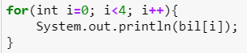
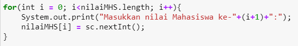
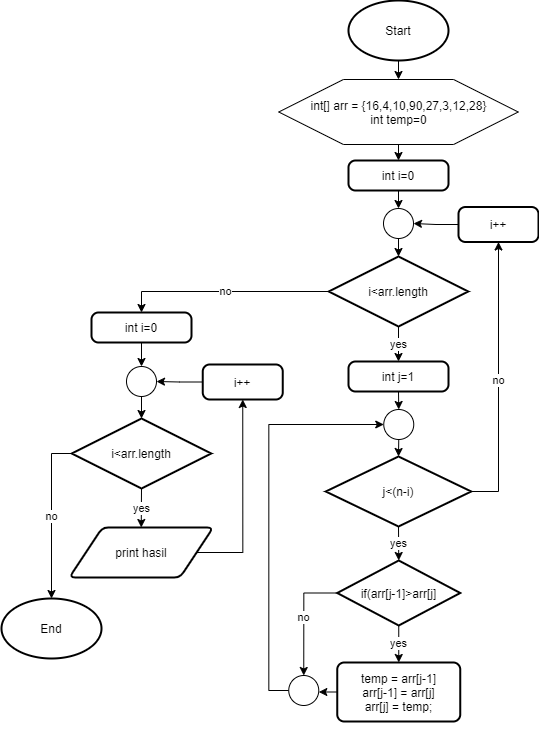

# JOBSHEET 10 - Array 1

## Tujuan
+ Mahasiswa mampu memahami pembuatan Array 1 dimensi dan pengaksesan elemenya di Java. 
+ Mahasiswa mampu membuat program dengan menggunakan konsep array satu dimensi.


## Alat dan Bahan
+ PC/laptop
+ Browser(chrome, firefox, safari)
+ Koneksi internet
+ Anaconda3 + Java kernel (opsional)

## Praktikum
### Percobaan 1: Mengisi Elemen Array
1. Pada percobaan ke-1 akan dilakukan percobaan untuk mengisi elemen array. Buat array bertipe integer dengan nama bil dengan kapasitas 4 elemen.


```Java
// Tulis Kode program Percobaan 1 Langkah 2 di atas
int[] bil = new int[4];

```

2. Isi masing-masing elemen array bil tadi dengan angka 5, 12, 7, 20.


```Java
// Tulis Kode program Percobaan 1 Langkah 3 di atas
bil[0] = 5;
bil[1] = 12;
bil[2] = 7;
bil[3] = 20;

```

3. Tampilkan ke layar semua isi elemennya:


```Java
// Tulis Kode program Percobaan 1 Langkah 4
System.out.println(bil[0]);
System.out.println(bil[1]);
System.out.println(bil[2]);
System.out.println(bil[3]);

```
```
5
12
7
20
```

#### Pertanyaan 
1. Dari percobaan 1 berapakah indeks array terbesar dan terkecil?


```
// Tulis Jawaban no 1 disini
indeks array terbesar adalah 3
indeks array terkecil adalah 0

```

2. Jika Isi masing-masing elemen array bil diubah dengan angka 5.0, 12867, 7.5, 2000000. Apa yang terjadi? Mengapa bisa demikian?


// Tulis Jawaban no 2 yang disini

`Type mismatch: cannot convert from double to int`

```
yang terjadi adalah error karena pada array mempunyai tipe data integer sedangkan pada nilai dari indeks ke 0 dan 3 bertipe data double
```

3. Ubah statement pada langkah No 3 menjadi seperti berikut

Apa keluaran dari program? Mengapa bisa demikian?


```Java
// Tulis Jawaban no 3 yang disini
for (int i = 0; i<4 ;i++){
 System.out.println(bil[i]);   
}

```
```
5
12
7
20
```

Keluaran dari program sama dengan keluaran pada langkah 3, karena pada langkah 3 inisialisasi dari indeks di masukkan satu persatu sedangkan yang telah dimodifikasi menggunakan perulangan jika i kurang dari 4 maka yang akan ditampilkan adalah nilai pada indeks array


### Percobaan 2: Meminta Inputan Pengguna untuk Mengisi Elemen Array
1. Pada percobaan ke-2 akan dilakukan percobaan yang meminta inputan pengguna untuk mengisi elemen array seperti pada flowchart berikut


```Java
// Tulis Kode program Percobaan 2 Langkah 1 di atas

```

2. Import dan deklarasikan Scanner untuk keperluan input. 


```Java
// Tulis Kode program Percobaan 2 Langkah 1 di atas
import java.util.Scanner;
Scanner sc = new Scanner(System.in);


```

3. Buat array bertipe integer dengan nama nilaiUAS, dengan kapasitas 6 elemen.


```Java
// Tulis Kode program Percobaan 2 Langkah 3 di atas
int[] nilaiUAS = new int [6];


```

4. Menggunakan perulangan, buat input untuk mengisi elemen dari array nilaiUAS.


```Java
// Tulis Kode program Percobaan 2 Langkah 4 di atas
for (int i = 0;i<6;i++){
    System.out.println("Masukkan nilai UAS ke-" + i + ": ");
    nilaiUAS[i]= sc.nextInt();
}

```
```
Masukkan nilai UAS ke-0: 
60
Masukkan nilai UAS ke-1: 
90
Masukkan nilai UAS ke-2: 
100
Masukkan nilai UAS ke-3: 
50
Masukkan nilai UAS ke-4: 
85
Masukkan nilai UAS ke-5: 
52
```

5. Menggunakan perulangan, tampilkan semua isi elemen dari array nilaiUAS.


```Java
// Tulis Kode program Percobaan 2 Langkah 5 di atas
for(int i =0; i<6; i++){
     System.out.println("Masukkan nilai UAS ke-" + i + "adalah: " + nilaiUAS[i]);
}

```
```
Masukkan nilai UAS ke-0adalah: 90
Masukkan nilai UAS ke-1adalah: 90
Masukkan nilai UAS ke-2adalah: 80
Masukkan nilai UAS ke-3adalah: 50
Masukkan nilai UAS ke-4adalah: 40
Masukkan nilai UAS ke-5adalah: 60
```

#### Pertanyaan
1. Ubah statement pada langkah No 4 menjadi seperti berikut ini :

Jalankan program, apakah terjadi perubahan? Mengapa demikian?


```Java
// Tulis Jawaban nomor 1 disini
for(int i =0; i<nilaiUAS.length; i++) {
        System.out.println("Masukkan nilai UAS ke-" + i + ": ");
        nilaiUAS[i]=sc.nextInt();
}
```
```
Masukkan nilai UAS ke-0: 
90
Masukkan nilai UAS ke-1: 
80
Masukkan nilai UAS ke-2: 
60
Masukkan nilai UAS ke-3: 
0
Masukkan nilai UAS ke-4: 
50
Masukkan nilai UAS ke-5: 
40
```

hasilnya akan tetap sama karena pada langkah 4 batasan nilai kurang dari 6 itu akan sama halnya dengan panjang array, jadi output akan sama saja saat ditampilkan


2. Apa kegunaan dari `nilaiUAS.length`? 


fungsinya adalah untuk menampilkan panjang array berapa jumlahnya


3. Ubah statement pada langkah No 5 menjadi seperti berikut ini sehingga program hanya menampilkan status mahasiswa yang lulus saja:

Jalankan program dan Jelaskan alur program!


```Java
// Tulis Jawaban nomor 3 disini
for(int i = 0;i<nilaiUAS.length;i++){
    if(nilaiUAS[i]>70){
    System.out.println("Mahasiswa ke-" + i + " lulus ");    
    }
}

```
```
Mahasiswa ke-0 lulus 
Mahasiswa ke-1 lulus
```

Program yang telah dibuat untuk mengecek apabila mahasiswa nilainya lebih dari 70 maka dia dinyatakan lulus. Program ini mempunyai elemen dengan panjang 6,kemudian dibuat perulangan for untuk mengecek dan mengelompokkan yang mempunya nilai >70 maka akan lulus.


### Percobaan 3: Melakukan Operasi Aritmatika terhadap Elemen Array
Pada praktikum ini, akan dilakukan percobaan untuk menjumlahkan Array. Program akan menerima input sebanyak 10 nilai mahasiswa. Kemudian program akan menampilkan nilai rata-rata nilai dari 10 Mahasiswa. Seperti flowchart berikut


1.Import dan deklarasikan Scanner untuk keperluan input. 


```Java
// Tulis Kode program Percobaan 3 Langkah 1 di atas, disini
import java.util.Scanner;
Scanner sc = new Scanner(System.in);

```

2. Buat array nilaiMHS bertipe integer dengan kapasitas 10. Kemudian deklarasikan variable total dan rata seperti gambar berikut ini


```Java
// Tulis Kode program Percobaan 3 Langkah 2 di atas, disini
int nilaiMHS[] = new int[10];
double total;
double rata;

```

3. Menggunakan perulangan, buat input untuk mengisi array nilaiMHS



```Java
// Tulis Kode program Percobaan 3 Langkah 3 di atas, disini
for (int i =0;i<nilaiMHS.length;i++){
  System.out.println("Masukkan nilai Mahasiswa ke-" + (i+1) + ":");  
    nilaiMHS[i] = sc.nextInt();
}


```
```
Masukkan nilai Mahasiswa ke-1:
80
Masukkan nilai Mahasiswa ke-2:
50
Masukkan nilai Mahasiswa ke-3:
50
Masukkan nilai Mahasiswa ke-4:
40
Masukkan nilai Mahasiswa ke-5:
90
Masukkan nilai Mahasiswa ke-6:
95
Masukkan nilai Mahasiswa ke-7:
85
Masukkan nilai Mahasiswa ke-8:
85
Masukkan nilai Mahasiswa ke-9:
40
Masukkan nilai Mahasiswa ke-10:
90
```

4. Menggunakan perulangan untuk menghitung jumlah keseluruhan nilai.


```Java
// Tulis Kode program Percobaan 3 Langkah 4 di atas, disini
 for(int i=0;i<nilaiMHS.length;i++) {
          total+=nilaiMHS[i];
      }

```

5. Kemudian hitung nilai rata-rata dengan cara nilai total dibagi jumlah elemen dari array nilaiMHS\


```Java
// Tulis Kode program Percobaan 3 Langkah 3 di atas, disini
 rata= total /nilaiMHS.length;
      System.out.println("Rata-rata nilai mahasiswa adalah"+rata);

```
```
Rata-rata nilai mahasiswa adalah70.5
```

#### Pertanyaan 
1. Pada Percobaan 3 langkah ke-5. Mengapa perhitungan rata berada diluar perulangan?

karena perhitungan harus semuanya terkumpul terlebih dahulu dan hanya bisa dilakukan perhitungan sebanyak sekali untuk menghitung hasil pembagian total nilai dari siswa dengan jumlahnya


2. Modifikasi program pada percobaan 3 sehingga bisa mengeluarkan output  seperti gambar berikut ini!
syarat lulus nilai >70


```Java
// Tulis jawaban no 2 disini
    import java.util.Scanner;
    Scanner sc = new Scanner(System.in);
    
    int nilaiMHS[] = new int[10];
    int jmhLulus =0;
    double totLulus =0;
    int jmhTidaklulus =0;
    double totTidaklulus =0;
    
    double rataLulus;
    double rataTidaklulus;
    
    for (int i =0;i<nilaiMHS.length;i++){ 
        System.out.println("Masukkan nilai mahasiswa ke-" + (i+1) + ": "); 
        nilaiMHS[i] = sc.nextInt();
          if(nilaiMHS[i]>70){
              totLulus+=nilaiMHS[i];
              jmhLulus++;
          }else{
              totTidaklulus+=nilaiMHS[i];
              jmhTidaklulus++;
          }
    }
    rataLulus=totLulus/jmhLulus;
    rataTidaklulus=totTidaklulus/jmhTidaklulus;

    System.out.printf("%s %.2f %n","Rata-rata nilai mahasiswa yang lulus adalah ",rataLulus);
    System.out.printf("%s %.2f %n","Rata-rata nilai mahasiswa yang tidak lulus adalah ",rataTidaklulus);
    
    
    

```
```
Masukkan nilai mahasiswa ke-1: 
90
Masukkan nilai mahasiswa ke-2: 
100
Masukkan nilai mahasiswa ke-3: 
50
Masukkan nilai mahasiswa ke-4: 
45
Masukkan nilai mahasiswa ke-5: 
65
Masukkan nilai mahasiswa ke-6: 
50
Masukkan nilai mahasiswa ke-7: 
80
Masukkan nilai mahasiswa ke-8: 
80
Masukkan nilai mahasiswa ke-9: 
85
Masukkan nilai mahasiswa ke-10: 
84
Rata-rata nilai mahasiswa yang lulus adalah  86.50 
Rata-rata nilai mahasiswa yang tidak lulus adalah  52.50
```


```Java
### Percobaan 4: Pencarian menggunakan Array
Pada praktikum ini, akan dilakukan percobaan untuk mencari lokasi/indeks sebuah angka dalam array. Sesuai dengan flowchart di bawah ini:
 
```

1. Buat array arr[] bertipe integer dengan kapasitas 6 dan isi dengan nilai 6, 4, 1, 9, 7, 3, 2 dan 8. Kemudian deklarasikan variabel integer `key` untuk kata kunci pencarian dan variabel `hasil` untuk hasil indeks pencarian. Deklarasi dan inisialisasi seperti gambar berikut ini


```Java
// Tulis Kode program Percobaan 4 Langkah 1 di atas, disini
int[] arr = {6,4,1,9,7,3,2,8};
int key = 3;
int hasil = -1;

```

2. Menggunakan perulangan, lakukan pencarian untuk mendapatkan nilai array yang sesuai dengan key. Bila ada yang sesuai, simpan indeksnya sebagai hasil pencarian


```Java
// Tulis Kode program Percobaan 4 Langkah 2 di atas, disini
for(int i=0; i<arr.length; i++) {
    if(key==arr[i]) {
        hasil=i;
        break;
    }
}

```

3. Tampilkan hasil pencarian dengan kode berikut.


```Java
// Tulis Kode program Percobaan 4 Langkah 3 di atas, disini
System.out.println("Key ada di array ke-" + hasil);

```
```
Key ada di array ke-5
```

#### Pertanyaan 
1. Pada Percobaan 4 langkah ke-2. Apa kegunaan dari statement `break`?


kegunaan statement break adalah untuk menghentikan sebuah looping saat nilainya sudah sesuai dengan aturan yang telah di buat

2. Modifikasi program pada percobaan 4 sehingga key yang dicari adalah angka 5. Kemudian jalankan program, amati hasilnya! Jelaskan penyebab dari hasil tersebut! 


```Java
// Tulis jawaban no 2 disini

int[] arr = {6,4,1,9,7,3,2,8};
int key = 5;
int hasil = -1;

for(int i=0; i<arr.length; i++) {
    if(key==arr[i]) {
        hasil=i;
        break;
    }
}

System.out.println("Key ada di array ke-" + hasil);
```
```
Key ada di array ke--1
```
kenapa hasilnya keluar key pada array 1, karena dalam array tersebut tidal terdapat angka 5 sehingga tidak akan pernah dijalankan dan variabel dari hasil akan terus -1

### Percobaan 5: Pengurutan bilangan menggunakan Array
Pada praktikum ini, akan dilakukan percobaan untuk mengurutkan angka dalam array. Sesuai dengan flowchart di bawah ini:

1.Buat array arr[] bertipe integer dengan kapasitas 8 dan isi dengan nilai 16, 4, 10, 90, 27, 3, 12 dan 28. Kemudian deklarasikan variabel integer `temp` untuk media penukaran nilai pada variabel. Deklarasi dan inisialisasi seperti gambar berikut ini


```Java
// Tulis Kode program Percobaan 5 Langkah 1 disini
int[] arr = {16, 4, 10, 90, 27, 3, 12, 28};
int temp = 0;

```


```Java
// Tulis Kode program Percobaan 5 Langkah 2 di atas, disini
for(int i = 0; i < arr.length; i++){
    for(int j = 1; j < (arr.length-i); j++){
        if(arr[j-1] > arr[j]){
            temp = arr[j-1];
            arr[j-1] = arr[j];
            arr[j] = temp;
        }
    }
}

```

2. Menggunakan perulangan, lakukan pengurutan bilangan dengan menukar posisi indeks tersebut dengan indeks berikutnya. Perulangan dilakukan untuk menukar posisi berulang kali. 


3. Tampilkan hasil pengurutan dengan menggunakan perulangan


```Java
// Tulis Kode program Percobaan 5 Langkah 3 di atas, disini
System.out.println("Hasil pengurutan: ");
for(int i = 0; i < arr.length; i++)
    System.out.println(arr[i]);

```
```
3
4
10
12
16
27
28
90
```

## Tugas
### Soal 1
Buatlah program yang **sesuai** dengan alur _flowchart_ di bawah ini


Flowchart diatas menggambarkan alur program yang membaca 10 masukan pengguna berupa integer dan menyimpannya. Kemudian angka ganjil dan genap disimpan kembali ke dalam variabel lain yang terpisah


```Java
/* Jawaban Soal 1 disini */
import java.util.Scanner;
Scanner sc = new Scanner(System.in);

int checkNum[] = new int[10];
int evenNum[] = new int[10];
int oddNum[] = new int[10];
int cEven=0, cOdd =0;

for(int i=0;i<checkNum.length;i++){
    System.out.println("Masukkan nilai ke- "+ (i+1));
    checkNum[i] = sc.nextInt();
}
for(int j=0;j<checkNum.length;j++){
    if(checkNum[j] %2==0){
        evenNum[cEven] = checkNum[j];
        cEven++;
    }else{
        oddNum[cOdd] = checkNum[j];
        cOdd++;
    }
}
        System.out.print("angka genap : ");
        for(int i=0; i<cEven; i++){
        System.out.print(evenNum[i]+", ");    
     }
        System.out.print("\nangka ganjil: ");
        for(int i=0; i<cOdd; i++){
            System.out.print(oddNum[i]+", "); 
            
        }

```
```
Masukkan nilai ke- 1
1
Masukkan nilai ke- 2
2
Masukkan nilai ke- 3
3
Masukkan nilai ke- 4
4
Masukkan nilai ke- 5
5
Masukkan nilai ke- 6
6
Masukkan nilai ke- 7
7
Masukkan nilai ke- 8
8
Masukkan nilai ke- 9
9
Masukkan nilai ke- 10
10
angka genap : 2, 4, 6, 8, 10, 
angka ganjil: 1, 3, 5, 7, 9,
```
Penjelasan alur program :

1. Menggunakan perulangan agar user dapat memasukkan nilai pada array
2. Mencari dan mengelompokkan bilangan ganjil dan genap seusai rumus, kemudian dilakukan increment pada ganjil dan genap
3. Menampilkan hasil

### Soal 2
Buatlah program yang terdapat array dengan jumlah elemen 5, buatlah input untuk mengisi elemen array tersebut, kemudian tampilkan isi array tersebut dengan urutan terbalik. Seperti ilustrasi gambar dibawah ini.


```Java
/* Jawaban Soal 2 disini */
import java.util.Scanner;
Scanner sc = new Scanner(System.in);

int nilai[] = new int[5];
for(int i=0; i<nilai.length; i++){
    System.out.println("Masukkan nilai ke- "+(i+1));
    nilai[i] = sc.nextInt();
    }
    System.out.println("output terbalik");
    for(int i=nilai.length-1; i>=0; i--){
        System.out.print(nilai[i]+", ");
    }


```
```
Masukkan nilai ke- 1
1
Masukkan nilai ke- 2
2
Masukkan nilai ke- 3
3
Masukkan nilai ke- 4
4
Masukkan nilai ke- 5
5
output terbalik
5, 4, 3, 2, 1,
```
Penjelasan alur program :
1. Menggunakan array yang mempunyai panjang 5
2. Kemudian dilakukan perulangan untuk memasukkan nilai yang ingin di input username
3. Jika ingin output terbalik maka dilakukan perulangan kembali, tetapi hasilnya di decrement

### Soal 3
Buatlah program yang menerima input jumlah elemen array, inputkan isi arraynya, kemudian tampilkan bilangan terbesar dari isi elemen arraynya. Contoh hasil program:


```Java
/* Jawaban Soal 3 disini */
int max=0;
System.out.println("Masukkan isi array: ");
int angka[] = new int[sc.nextInt()];

    for(int i = 0; i < angka.length; i++){
        System.out.println("Masukkan elemen array ke - "+i);
        angka[i] = sc.nextInt();
    }
    for(int i = 0; i < angka.length; i++){
        if(angka[i]>max){
            max = angka[i];
        }
    
    }
    System.out.println("Bilangan terbesar adalah "+ max);

```
```
Masukkan isi array: 
4
Masukkan elemen array ke - 0
50
Masukkan elemen array ke - 1
45
Masukkan elemen array ke - 2
80
Masukkan elemen array ke - 3
5
Bilangan terbesar adalah 80
```
Penjelasan alur program :
1. melakukan sebuah perulangan dan mengecek untuk menyimpan sebuah variabel dengan nilai paling besar
2. pengecekan pertama adalah masukan pada elemen yang pertama, jika sesuai maka nilai dari variabel paling besar dengan nilai awal, jika tidak sesuai maka akan dilakukan pengecekan ulang dan jika sesuai maka akan dirubah nilainya ke variabel paling besar dengan input sekarang
