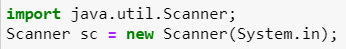

# JOBSHEET 10 - Array 1

## Tujuan
+ Mahasiswa mampu memahami pembuatan Array 1 dimensi dan pengaksesan elemenya di Java. 
+ Mahasiswa mampu membuat program dengan menggunakan konsep array satu dimensi.


## Alat dan Bahan
+ PC/laptop
+ Browser(chrome, firefox, safari)
+ Koneksi internet
+ Anaconda3 + Java kernel (opsional)

## Praktikum
### Percobaan 1: Mengisi Elemen Array
1. Pada percobaan ke-1 akan dilakukan percobaan untuk mengisi elemen array. Buat array bertipe integer dengan nama bil dengan kapasitas 4 elemen.


```Java
// Tulis Kode program Percobaan 1 Langkah 2 di atas
int[] bil=new int[4];
```

2. Isi masing-masing elemen array bil tadi dengan angka 5, 12, 7, 20.


```Java
// Tulis Kode program Percobaan 1 Langkah 3 di atas
bil[0] = 5;
bil[1] = 12;
bil[2] = 7;
bil[3] = 20;
```


    20


3. Tampilkan ke layar semua isi elemennya:


```Java
// Tulis Kode program Percobaan 1 Langkah 4
// System.out.println(bil[0]);
// System.out.println(bil[1]);
// System.out.println(bil[2]);
// System.out.println(bil[3]);
for(int i=0; i<4; i++){
    System.out.println(bil[i]);
}
```

    5
    12
    7
    20


#### Pertanyaan 
1. Dari percobaan 1 berapakah indeks array terbesar dan terkecil?


```Java
// Tulis Jawaban no 1 disini
index array yang terbesar adalah index 3 dan yang terkecil adalah index 0
```

2. Jika Isi masing-masing elemen array bil diubah dengan angka 5.0, 12867, 7.5, 2000000. Apa yang terjadi? Mengapa bisa demikian?


```Java
// Tulis Jawaban no 2 yang disini
Yang terjadi adalah error karena tipe data yang digunakan tidak sesuai.
```

3. Ubah statement pada langkah No 3 menjadi seperti berikut

Apa keluaran dari program? Mengapa bisa demikian?


```Java
// Tulis Jawaban no 3 yang disini
Yang terjadi adalah keluaran yang dihasilkan akan tetap benar, hanya saja keluaran menggunakan looping atau pengulangan.
```

### Percobaan 2: Meminta Inputan Pengguna untuk Mengisi Elemen Array
1. Pada percobaan ke-2 akan dilakukan percobaan yang meminta inputan pengguna untuk mengisi elemen array seperti pada flowchart berikut


```Java
// Tulis Kode program Percobaan 2 Langkah 1 di atas

```

2. Import dan deklarasikan Scanner untuk keperluan input. 



```Java
// Tulis Kode program Percobaan 2 Langkah 1 di atas
import java.util.Scanner;
Scanner sc = new Scanner(System.in);
```

3. Buat array bertipe integer dengan nama nilaiUAS, dengan kapasitas 6 elemen.


```Java
// Tulis Kode program Percobaan 2 Langkah 3 di atas
int[] nilaiUAS = new int[5];
```

4. Menggunakan perulangan, buat input untuk mengisi elemen dari array nilaiUAS.


```Java
// Tulis Kode program Percobaan 2 Langkah 4 di atas
// for(int i = 0; i < 6; i++){
//     System.out.print("Masukkan nilai UAS ke-" + i + ": ");
//     nilaiUAS[i] = sc.nextInt();
// }
for(int i = 0; i < nilaiUAS.length; i++){
    System.out.print("Masukkan nilai UAS ke-" + i + ": ");
    nilaiUAS[i] = sc.nextInt();
}
```

    Masukkan nilai UAS ke-0: 60
    Masukkan nilai UAS ke-1: 50
    Masukkan nilai UAS ke-2: 80
    Masukkan nilai UAS ke-3: 90
    Masukkan nilai UAS ke-4: 100


5. Menggunakan perulangan, tampilkan semua isi elemen dari array nilaiUAS.


```Java
// Tulis Kode program Percobaan 2 Langkah 5 di atas
// for(int i = 0; i < 6; i++){
//     System.out.println("Nilai UAS ke-" + i + " adalah: " + nilaiUAS[i]);
// }
for(int i = 0; i < nilaiUAS.length; i++){
    if(nilaiUAS[i] > 70){
        System.out.println("Mahasiswa ke-" + i + " lulus");
    }
}
```

    Mahasiswa ke-2 lulus
    Mahasiswa ke-3 lulus
    Mahasiswa ke-4 lulus


#### Pertanyaan
1. Ubah statement pada langkah No 4 menjadi seperti berikut ini :

Jalankan program, apakah terjadi perubahan? Mengapa demikian?


// Tulis Jawaban nomor 1 disini

Tidak ada perubahan karena jumlah elemen di instansiasi array diatasnya ada 6 namun jika instansiasinya diubah menjadi 5 maka inputan nilaiUAS akan menjadi 5 elemen

2. Apa kegunaan dari `nilaiUAS.length`? 


// Tulis Jawaban nomor 2 disini
kegunaan dari nilaiUAS.length adalah untuk mendapatkan jumlah elemen dalam array atau panjang dari array itu sendiri.


3. Ubah statement pada langkah No 5 menjadi seperti berikut ini sehingga program hanya menampilkan status mahasiswa yang lulus saja:

Jalankan program dan Jelaskan alur program!

// Tulis Jawaban nomor 3 disini
```Java
for(int i = 0; i < nilaiUAS.length; i++){
    if(nilaiUAS[i] > 70){
        System.out.println("Mahasiswa ke-" + i + " lulus");
    }
}
```

    Mahasiswa ke-2 lulus
    Mahasiswa ke-3 lulus
    Mahasiswa ke-4 lulus

Jadi alurnya adalah melakukan looping dengan inisialisasi variabel i dengan nilai 0, dengan kondisi i kurang dari panjang array dan dengan increment. kemudian didalam looping for menggnakan pernyataan pemilihan jika nilaiUAS lebih dari 70 maka mengeluarkan output "lulus".

### Percobaan 3: Melakukan Operasi Aritmatika terhadap Elemen Array
Pada praktikum ini, akan dilakukan percobaan untuk menjumlahkan Array. Program akan menerima input sebanyak 10 nilai mahasiswa. Kemudian program akan menampilkan nilai rata-rata nilai dari 10 Mahasiswa. Seperti flowchart berikut


1.Import dan deklarasikan Scanner untuk keperluan input. 


```Java
// Tulis Kode program Percobaan 3 Langkah 1 di atas, disini
import java.util.Scanner;
Scanner sc = new Scanner(System.in);
```

2. Buat array nilaiMHS bertipe integer dengan kapasitas 10. Kemudian deklarasikan variable total dan rata seperti gambar berikut ini


```Java
// Tulis Kode program Percobaan 3 Langkah 2 di atas, disini
int nilaiMHS[] = new int[10];
double total, rata;
```

3. Menggunakan perulangan, buat input untuk mengisi array nilaiMHS


```Java
// Tulis Kode program Percobaan 3 Langkah 3 di atas, disini
for(int i = 0; i < nilaiMHS.length; i++){
    System.out.print("Masukkan nilai Mahasiswa ke- " + (i+1) + ": ");
    nilaiMHS[i] = sc.nextInt();
}
```

    Masukkan nilai Mahasiswa ke- 1: 80
    Masukkan nilai Mahasiswa ke- 2: 45
    Masukkan nilai Mahasiswa ke- 3: 60
    Masukkan nilai Mahasiswa ke- 4: 90
    Masukkan nilai Mahasiswa ke- 5: 100
    Masukkan nilai Mahasiswa ke- 6: 80
    Masukkan nilai Mahasiswa ke- 7: 75
    Masukkan nilai Mahasiswa ke- 8: 60
    Masukkan nilai Mahasiswa ke- 9: 45
    Masukkan nilai Mahasiswa ke- 10: 70


4. Menggunakan perulangan untuk menghitung jumlah keseluruhan nilai.


```Java
// Tulis Kode program Percobaan 3 Langkah 4 di atas, disini
for(int i = 0; i < nilaiMHS.length; i++){
    total += nilaiMHS[i];
}
```

    Rata-rata nilai mahasiswa adalah 78.5
    Rata-rata nilai mahasiswa adalah 83.0
    Rata-rata nilai mahasiswa adalah 89.0
    Rata-rata nilai mahasiswa adalah 98.0
    Rata-rata nilai mahasiswa adalah 108.0
    Rata-rata nilai mahasiswa adalah 116.0
    Rata-rata nilai mahasiswa adalah 123.5
    Rata-rata nilai mahasiswa adalah 129.5
    Rata-rata nilai mahasiswa adalah 134.0
    Rata-rata nilai mahasiswa adalah 141.0


5. Kemudian hitung nilai rata-rata dengan cara nilai total dibagi jumlah elemen dari array nilaiMHS\


```Java
// Tulis Kode program Percobaan 3 Langkah 3 di atas, disini
rata = total/nilaiMHS.length;
System.out.println("Rata-rata nilai mahasiswa adalah " + rata);
```

    Rata-rata nilai mahasiswa adalah 70.5


#### Pertanyaan 
1. Pada Percobaan 3 langkah ke-5. Mengapa perhitungan rata berada diluar perulangan?

// Tulis jawaban no 1 disini

Perhitungan rata rata diluar perulangan karena harus menunggu dulu variabel total selesai dihitung, jika perhitungan rata rata ada didalam perulangan maka perhitungan ini akan ikut diulangi

2. Modifikasi program pada percobaan 3 sehingga bisa mengeluarkan output  seperti gambar berikut ini!
syarat lulus nilai >70


```Java
// Tulis jawaban no 2 disini
import java.util.Scanner;
Scanner sc = new Scanner(System.in);
int nilaiMHS[] = new int[10];
int lulus = 0, tLulus = 0;
double totalL = 0, totalTL = 0, rataL = 0, rataTL = 0;
for(int i = 0; i < nilaiMHS.length; i++){
    System.out.print("Masukkan nilai Mahasiswa ke- " + (i+1) + ": ");
    nilaiMHS[i] = sc.nextInt();
}
for(int i = 0; i < nilaiMHS.length; i++){
    if(nilaiMHS[i] <= 70){
        totalTL += nilaiMHS[i];
        tLulus++;
    } else {
        totalL += nilaiMHS[i];
        lulus++;
    }
}
rataL = totalL/lulus;
rataTL = totalTL/tLulus;
System.out.println("Rata-rata nilai mahasiswa lulus adalah " + rataL);
System.out.println("Rata-rata nilai mahasiswa tidak lulus adalah " + rataTL);
```

    Masukkan nilai Mahasiswa ke- 1: 100
    Masukkan nilai Mahasiswa ke- 2: 90
    Masukkan nilai Mahasiswa ke- 3: 100
    Masukkan nilai Mahasiswa ke- 4: 80
    Masukkan nilai Mahasiswa ke- 5: 70
    Masukkan nilai Mahasiswa ke- 6: 60
    Masukkan nilai Mahasiswa ke- 7: 80
    Masukkan nilai Mahasiswa ke- 8: 50
    Masukkan nilai Mahasiswa ke- 9: 80
    Masukkan nilai Mahasiswa ke- 10: 90
    Rata-rata nilai mahasiswa lulus adalah 88.57142857142857
    Rata-rata nilai mahasiswa tidak lulus adalah 60.0


```Java
### Percobaan 4: Pencarian menggunakan Array
Pada praktikum ini, akan dilakukan percobaan untuk mencari lokasi/indeks sebuah angka dalam array. Sesuai dengan flowchart di bawah ini:
 
```

1. Buat array arr[] bertipe integer dengan kapasitas 6 dan isi dengan nilai 6, 4, 1, 9, 7, 3, 2 dan 8. Kemudian deklarasikan variabel integer `key` untuk kata kunci pencarian dan variabel `hasil` untuk hasil indeks pencarian. Deklarasi dan inisialisasi seperti gambar berikut ini


```Java
// Tulis Kode program Percobaan 4 Langkah 1 di atas, disini
int[] arr = {6,4,1,9,7,3,2,8};
int key = 3;
int hasil = -1;
```

2. Menggunakan perulangan, lakukan pencarian untuk mendapatkan nilai array yang sesuai dengan key. Bila ada yang sesuai, simpan indeksnya sebagai hasil pencarian


```Java
// Tulis Kode program Percobaan 4 Langkah 2 di atas, disini
for(int i = 0; i < arr.length; i++){
    if(key == arr[i]){
        hasil = i;
        break;
    }
}
```

3. Tampilkan hasil pencarian dengan kode berikut.


```Java
// Tulis Kode program Percobaan 4 Langkah 3 di atas, disini
System.out.println("Key ada ada di array ke-" + hasil);
```

    Key ada ada di array ke-5


#### Pertanyaan 
1. Pada Percobaan 4 langkah ke-2. Apa kegunaan dari statement `break`?


```Java
// Tulis jawaban no 1 disini
Untuk menghentikan proses perulangan
```

2. Modifikasi program pada percobaan 4 sehingga key yang dicari adalah angka 5. Kemudian jalankan program, amati hasilnya! Jelaskan penyebab dari hasil tersebut! 


```Java
// Tulis jawaban no 2 disini
int[] arr = {6,4,1,9,7,3,2,8};
int key = 5;
int hasil = -1;
for(int i = 0; i < arr.length; i++){
    if(key == arr[i]){
        hasil = i;
        break;
    }
}
System.out.println("Key ada ada di array ke-" + hasil);
```

    Key ada ada di array ke--1


```Java
Hasilnya adalah -1 karena angka 5 tidak ada di array tersebut.
```

### Percobaan 5: Pengurutan bilangan menggunakan Array
Pada praktikum ini, akan dilakukan percobaan untuk mengurutkan angka dalam array. Sesuai dengan flowchart di bawah ini:

1.Buat array arr[] bertipe integer dengan kapasitas 8 dan isi dengan nilai 16, 4, 10, 90, 27, 3, 12 dan 28. Kemudian deklarasikan variabel integer `temp` untuk media penukaran nilai pada variabel. Deklarasi dan inisialisasi seperti gambar berikut ini


```Java
// Tulis Kode program Percobaan 5 Langkah 1 disini
int[] arr = {16,4,10,90,27,3,12,28};
int temp = 0
```


```Java
// Tulis Kode program Percobaan 5 Langkah 2 di atas, disini
for(int i = 0; i < arr.length; i++){
    for(int j = 1; j < (arr.length-i); j++){
        if(arr[j-1] > arr[j]){
            temp = arr[j-1];
            arr[j-1] = arr[j];
            arr[j] = temp;
        }
    }
}
```

2. Menggunakan perulangan, lakukan pengurutan bilangan dengan menukar posisi indeks tersebut dengan indeks berikutnya. Perulangan dilakukan untuk menukar posisi berulang kali. 


3. Tampilkan hasil pengurutan dengan menggunakan perulangan


```Java
// Tulis Kode program Percobaan 5 Langkah 3 di atas, disini
System.out.println("Hasil pengurutan: ");
for(int i = 0; i < arr.length; i++){
    System.out.println(arr[i]);
}
```

    Hasil pengurutan: 
    3
    4
    10
    12
    16
    27
    28
    90


## Tugas
### Soal 1
Buatlah program yang **sesuai** dengan alur _flowchart_ di bawah ini


Flowchart diatas menggambarkan alur program yang membaca 10 masukan pengguna berupa integer dan menyimpannya. Kemudian angka ganjil dan genap disimpan kembali ke dalam variabel lain yang terpisah


```Java
/* Jawaban Soal 1 disini */
import java.util.Scanner;
Scanner input =  new Scanner(System.in);
int checkNum[] = new int[10];
int evenNum[] = new int[10];
int oddNum[] = new int[10];
int cEven, cOdd = 0;
for(int i = 0; i < checkNum.length; i++){
    System.out.print("Masukkan angka : ");
    checkNum[i] = input.nextInt();
}
for(int j = 0; j < checkNum.length; j++){
    if(checkNum[j] %2 == 0){
        evenNum[cEven] = checkNum[j];
        cEven++;
    } else {
        oddNum[cOdd] = checkNum[j];
        cOdd++;
    }
}
System.out.print("Bilangan ganjil : ");
for(int k = 0; k < cOdd; k++){
    System.out.print(oddNum[k] + " ");
}
System.out.print("\nBilangan genap : ");
for(int l = 0; l < cEven; l++){
    System.out.print(evenNum[l] + " ");
}
```

    Masukkan angka : 1
    Masukkan angka : 2
    Masukkan angka : 3
    Masukkan angka : 4
    Masukkan angka : 5
    Masukkan angka : 6
    Masukkan angka : 7
    Masukkan angka : 8
    Masukkan angka : 9
    Masukkan angka : 10
    Bilangan ganjil : 1 3 5 7 9 
    Bilangan genap : 2 4 6 8 10 

Alurnya adalah import scanner dan dideklarasi, kemudian membuat array checkNum, evenNum, dan oddNum, dan juga membuat variabel cEven dan cOdd dengan tipe data integer. kemudian mulai perulangan dengan inisialisasi variabel i dan kondisi dimana i lebih kecil dari panjang array checkNum. Lanjut didalam perulangan pertama terdapat inputan angka. kemudiaan lanjut ke perulangan ke 2 dengan inisialisasi var j dan kondisi j lebih kecil dari panjang array checkNum.  Kemudian lanjut menentukan ganjil atau genapnya dengan menghitung modulus. Jika modulusnya = 0 maka bilangan tersebut adalah genap dan jika tidak maka ganjil. Kemudian yang terakhir tinggal memunculkan keluaran bilangan ganjil atau genapnya.

### Soal 2
Buatlah program yang terdapat array dengan jumlah elemen 5, buatlah input untuk mengisi elemen array tersebut, kemudian tampilkan isi array tersebut dengan urutan terbalik. Seperti ilustrasi gambar dibawah ini.


```Java
/* Jawaban Soal 2 disini */
int arr[] = {5,2,7,9,6};
System.out.print("Sebelum dibalik : ");
for(int i = 0; i < arr.length; i++){
    System.out.print(arr[i] + " ");
}
System.out.print("\nUrutan Terbalik : ");
for(int j = arr.length-1; j >= 0; j--){
    System.out.print(arr[j] + " ");
}

```

    Sebelum dibalik : 5 2 7 9 6 
    Urutan Terbalik : 6 9 7 2 5 

Alurnya yaitu dengan membuat array yang berisi angka angka diatas, kemudian memunculkan angka sebelum dibalik dengan menggunakan perulangan for. Dan memunculkan angka setelah dibalik dengan perulangan for juga dengan inisialisasi variabel j = panjang array - 1, dengan kondisi j lebih dari sama dengan 0, dan menggunakan decrement. Yang terakhir adalah mengeluarkan hasil urutan terbalik. 

### Soal 3
Buatlah program yang menerima input jumlah elemen array, inputkan isi arraynya, kemudian tampilkan bilangan terbesar dari isi elemen arraynya. Contoh hasil program:


```Java
/* Jawaban Soal 3 disini */
import java.util.Scanner;
Scanner sc = new Scanner(System.in);
System.out.print("Masukkan isi array : ");
int n = sc.nextInt();
int isi[] = new int[n];
int terbesar;
for(int i = 0; i < isi.length; i++){
    System.out.print("Masukkan elemen array ke-" + i + ": ");
    isi[i] = sc.nextInt();
}
terbesar = isi[0];
for(int j=0; j < isi.length; j++){
    if(isi[j] > terbesar){
        terbesar = isi[j];   
    }
}
System.out.print("Bilangan terbesarnya adalah: " + terbesar);
```

    Masukkan isi array : 5
    Masukkan elemen array ke-0: 12
    Masukkan elemen array ke-1: 65
    Masukkan elemen array ke-2: 3
    Masukkan elemen array ke-3: 90
    Masukkan elemen array ke-4: 21
    Bilangan terbesarnya adalah: 90

Alurnya adalah import scanner dan di deklarasi kemudian membuat inputan panjang array isi. kemudian deklarasi variabel terbesar. Mulai perulangan dengan inisialisasi variabel i dan kondisi i lebih kecil dari panjang array isi atau jumlah yang dimasukkan user. Didalam perulanngan pertama dibuat masukan elemen array. Kemudian lanjut ke perulangan 2 dengan inisialisasi var j dan kondisi j lebih kecil dari array isi. Kemudian menampilkan bilangan yang paling besar.

```Java

```
