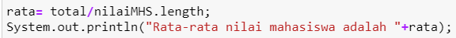
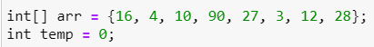
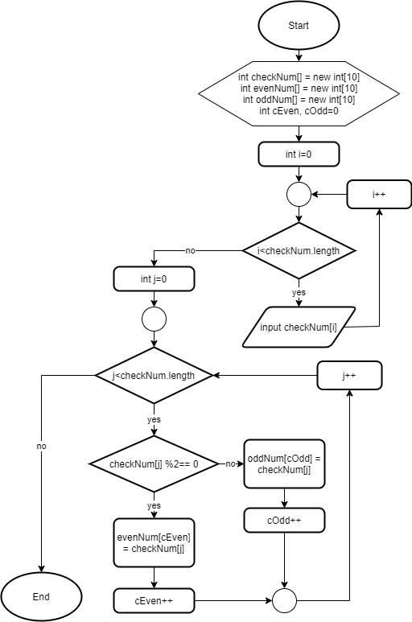

# JOBSHEET 10 - Array 1

## Tujuan
+ Mahasiswa mampu memahami pembuatan Array 1 dimensi dan pengaksesan elemenya di Java. 
+ Mahasiswa mampu membuat program dengan menggunakan konsep array satu dimensi.


## Alat dan Bahan
+ PC/laptop
+ Browser(chrome, firefox, safari)
+ Koneksi internet
+ Anaconda3 + Java kernel (opsional)

## Praktikum
### Percobaan 1: Mengisi Elemen Array
1. Pada percobaan ke-1 akan dilakukan percobaan untuk mengisi elemen array. Buat array bertipe integer dengan nama bil dengan kapasitas 4 elemen.


```Java
int[] bil = new int[4];
```

2. Isi masing-masing elemen array bil tadi dengan angka 5, 12, 7, 20.


```Java
bil[0] = 5;
bil[1] = 12;
bil[2] = 7;
bil[3] = 20;
```


    20


3. Tampilkan ke layar semua isi elemennya:


```Java
System.out.println(bil[0]);
System.out.println(bil[1]);
System.out.println(bil[2]);
System.out.println(bil[3]);
```

    5
    12
    7
    20
    

#### Pertanyaan 
1. Dari percobaan 1 berapakah indeks array terbesar dan terkecil?

*Indeks ke-3 merupakan yang terbesar karena bernilai 20 dan indeks ke-0 yang terkecil karena bernilai 5.*

2. Jika Isi masing-masing elemen array bil diubah dengan angka 5.0, 12867, 7.5, 2000000. Apa yang terjadi? Mengapa bisa demikian?


```Java
int bil[] = {5.0, 12867, 7.5, 2000000};

for(int i=0; i<4; i++){
    System.out.println(bil[i]);
}
```


    |   int bil[] = {5.0, 12867, 7.5, 2000000};

    incompatible types: possible lossy conversion from double to int

    

    |   int bil[] = {5.0, 12867, 7.5, 2000000};

    incompatible types: possible lossy conversion from double to int

    


*Error karena ada nilai yang bertipe pecahan (double) dan bukan int yang telah awal didekralasikan.*

3. Ubah statement pada langkah No 3 menjadi seperti berikut


Apa keluaran dari program? Mengapa bisa demikian?


```Java
for(int i=0; i<4; i++){
    System.out.println(bil[i]);
}
```

    5
    12
    7
    20
    

*Karena untuk menampilkan semua nilai indeks dapat menggunakan perulangan agar tidak manual satu-persatu seperti percobaan awal.*

### Percobaan 2: Meminta Inputan Pengguna untuk Mengisi Elemen Array
1. Pada percobaan ke-2 akan dilakukan percobaan yang meminta inputan pengguna untuk mengisi elemen array seperti pada flowchart berikut


2. Import dan deklarasikan Scanner untuk keperluan input. 


```Java
import java.util.Scanner;
Scanner input = new Scanner(System.in);
```

3. Buat array bertipe integer dengan nama nilaiUAS, dengan kapasitas 6 elemen.


```Java
int[] nilaiUAS = new int[6]
```

4. Menggunakan perulangan, buat input untuk mengisi elemen dari array nilaiUAS.


```Java
for(int i=0; i<6; i++){
    System.out.print("Masukkan nilai UAS ke-"+i+" : ");
    nilaiUAS[i] = input.nextInt();
}
```

    Masukkan nilai UAS ke-0 : 50
    Masukkan nilai UAS ke-1 : 80
    Masukkan nilai UAS ke-2 : 77
    Masukkan nilai UAS ke-3 : 93
    Masukkan nilai UAS ke-4 : 64
    Masukkan nilai UAS ke-5 : 89
    

5. Menggunakan perulangan, tampilkan semua isi elemen dari array nilaiUAS.


```Java
for(int i=0; i<6; i++){
    System.out.println("Masukkan nilai UAS ke-"+i+" adalah : "+nilaiUAS[i]);
}
```

    Masukkan nilai UAS ke-0 adalah : 50
    Masukkan nilai UAS ke-1 adalah : 80
    Masukkan nilai UAS ke-2 adalah : 77
    Masukkan nilai UAS ke-3 adalah : 93
    Masukkan nilai UAS ke-4 adalah : 64
    Masukkan nilai UAS ke-5 adalah : 89
    

#### Pertanyaan
1. Ubah statement pada langkah No 4 menjadi seperti berikut ini :


Jalankan program, apakah terjadi perubahan? Mengapa demikian?


```Java
for(int i=0; i<nilaiUAS.length; i++){
    System.out.print("Masukkan nilai UAS ke-"+i+" : ");
    nilaiUAS[i]=input.nextInt();
}
```

    Masukkan nilai UAS ke-0 : 50
    Masukkan nilai UAS ke-1 : 80
    Masukkan nilai UAS ke-2 : 77
    Masukkan nilai UAS ke-3 : 93
    Masukkan nilai UAS ke-4 : 64
    Masukkan nilai UAS ke-5 : 89
    

*Sama saja akan meminta inputan sebanyak 6 kali karena panjang dari array sudah diinstansiasi di awal berjumlah 6.*

2. Apa kegunaan dari `nilaiUAS.length`? 

*Atribut tersebut untuk mengetahui panjang sebuah variabel array yaitu nilaiUAS.*

3. Ubah statement pada langkah No 5 menjadi seperti berikut ini sehingga program hanya menampilkan status mahasiswa yang lulus saja:


Jalankan program dan Jelaskan alur program!


```Java
for(int i=0; i<nilaiUAS.length; i++){
    if(nilaiUAS[i]>70){
        System.out.println("Mahasiswa ke-"+i+" lulus");
    }
}
```

    Mahasiswa ke-1 lulus
    Mahasiswa ke-2 lulus
    Mahasiswa ke-3 lulus
    Mahasiswa ke-5 lulus
    

*Ditambahkan kondisi jika nilai UAS lebih dari 70 maka akan ditampilkan mahasiswa tersebut lulus.*

### Percobaan 3: Melakukan Operasi Aritmatika terhadap Elemen Array
Pada praktikum ini, akan dilakukan percobaan untuk menjumlahkan Array. Program akan menerima input sebanyak 10 nilai mahasiswa. Kemudian program akan menampilkan nilai rata-rata nilai dari 10 Mahasiswa. Seperti flowchart berikut


1.Import dan deklarasikan Scanner untuk keperluan input. 


```Java
import java.util.Scanner;
Scanner input = new Scanner(System.in);
```

2. Buat array nilaiMHS bertipe integer dengan kapasitas 10. Kemudian deklarasikan variable total dan rata seperti gambar berikut ini


```Java
int nilaiMHS[] = new int [10];
double total, rata;
```

3. Menggunakan perulangan, buat input untuk mengisi array nilaiMHS


```Java
for(int i=0; i<nilaiMHS.length; i++){
    System.out.print("Masukkan nilai Mahasiswa ke-"+(i+1)+" : ");
    nilaiMHS[i] = input.nextInt();
}
```

    Masukkan nilai Mahasiswa ke-1 : 55
    Masukkan nilai Mahasiswa ke-2 : 75
    Masukkan nilai Mahasiswa ke-3 : 90
    Masukkan nilai Mahasiswa ke-4 : 80
    Masukkan nilai Mahasiswa ke-5 : 35
    Masukkan nilai Mahasiswa ke-6 : 40
    Masukkan nilai Mahasiswa ke-7 : 85
    Masukkan nilai Mahasiswa ke-8 : 35
    Masukkan nilai Mahasiswa ke-9 : 90
    Masukkan nilai Mahasiswa ke-10 : 100
    

4. Menggunakan perulangan untuk menghitung jumlah keseluruhan nilai.


```Java
for(int i=0; i<nilaiMHS.length; i++){
    total+=nilaiMHS[i];
}
```

5. Kemudian hitung nilai rata-rata dengan cara nilai total dibagi jumlah elemen dari array nilaiMHS\



```Java
rata=total/nilaiMHS.length;
System.out.println("Rata-rata nilai mahasiswa adalah "+rata);
```

    Rata-rata nilai mahasiswa adalah 68.5


#### Pertanyaan 
1. Pada Percobaan 3 langkah ke-5. Mengapa perhitungan rata berada diluar perulangan?


```Java
for(int i=0; i<nilaiMHS.length; i++){
    total+=nilaiMHS[i];
    rata=total/nilaiMHS.length;
        System.out.println("Rata-rata nilai mahasiswa adalah "+rata);
}
```

    Rata-rata nilai mahasiswa adalah 74.0
    Rata-rata nilai mahasiswa adalah 81.5
    Rata-rata nilai mahasiswa adalah 90.5
    Rata-rata nilai mahasiswa adalah 98.5
    Rata-rata nilai mahasiswa adalah 102.0
    Rata-rata nilai mahasiswa adalah 106.0
    Rata-rata nilai mahasiswa adalah 114.5
    Rata-rata nilai mahasiswa adalah 118.0
    Rata-rata nilai mahasiswa adalah 127.0
    Rata-rata nilai mahasiswa adalah 137.0
    

*Kalau rata-rata berada di dalam perulangan nanti ditampilkan berulang kali setiap pertambahannya, jadi hasilnya bukan rata-rata dari total yang dibutuhkan.*

2. Modifikasi program pada percobaan 3 sehingga bisa mengeluarkan output  seperti gambar berikut ini!
syarat lulus nilai >70


```Java
import java.util.Scanner;
Scanner input = new Scanner(System.in);

int nilaiMHS[] = new int [6];
double totaL, totalT, rataL, rataT, lulus, takLulus;

for(int i=1; i<nilaiMHS.length; i++){
    System.out.print("Masukkan nilai Mahasiswa ke-"+i+" : ");
    nilaiMHS[i] = input.nextInt();
    
    if(nilaiMHS[i]>70) {
    totaL=+nilaiMHS[i];
    lulus++;
        
    } else {
    totalT=+nilaiMHS[i];
    takLulus++;
    }
}

rataL=totaL/lulus;
System.out.println("\nRata-rata nilai mahasiswa yang lulus adalah : "+rataL);

rataT=totalT/takLulus;
System.out.println("Rata-rata nilai mahasiswa yang tidak lulus adalah : "+rataT);
```

    Masukkan nilai Mahasiswa ke-1 : 50
    Masukkan nilai Mahasiswa ke-2 : 75
    Masukkan nilai Mahasiswa ke-3 : 90
    Masukkan nilai Mahasiswa ke-4 : 30
    Masukkan nilai Mahasiswa ke-5 : 55
    
    Rata-rata nilai mahasiswa yang lulus adalah : 45.0
    Rata-rata nilai mahasiswa yang tidak lulus adalah : 18.333333333333332
    

*Dengan meminta inputan nilai 5 mahasiswa, lalu dari nilai tersebut ditentukan ada yang lulus dan tidak. Dengan kondisi jika nilai lebih dari 70 maka akan lulus lalu dicari rata-ratanya (ditotal dulu lalu dibagi dengan incrementnya), begitupun dengan mahasiswa yang tidak lulus akan ditampilkan juga rata-ratanya.*

### Percobaan 4: Pencarian menggunakan Array
Pada praktikum ini, akan dilakukan percobaan untuk mencari lokasi/indeks sebuah angka dalam array. Sesuai dengan flowchart di bawah ini:

 

1. Buat array arr[] bertipe integer dengan kapasitas 6 dan isi dengan nilai 6, 4, 1, 9, 7, 3, 2 dan 8. Kemudian deklarasikan variabel integer `key` untuk kata kunci pencarian dan variabel `hasil` untuk hasil indeks pencarian. Deklarasi dan inisialisasi seperti gambar berikut ini


```Java
int[] arr={6,4,1,9,7,3,2,8};
int key=3;
int hasil=-1;
```

2. Menggunakan perulangan, lakukan pencarian untuk mendapatkan nilai array yang sesuai dengan key. Bila ada yang sesuai, simpan indeksnya sebagai hasil pencarian


```Java
for(int i=0; i<arr.length; i++){
    if(key==arr[i]){
        hasil=i;
        break;
    }
}
```

3. Tampilkan hasil pencarian dengan kode berikut.


```Java
System.out.println("Key ada di array ke-"+hasil);
```

    Key ada di array ke-5
    

#### Pertanyaan 
1. Pada Percobaan 4 langkah ke-2. Apa kegunaan dari statement `break`?

*break untuk memberhentikan proses pencarian jika sudah menemukan nilai yang tepat.*

2. Modifikasi program pada percobaan 4 sehingga key yang dicari adalah angka 5. Kemudian jalankan program, amati hasilnya! Jelaskan penyebab dari hasil tersebut! 


```Java
int[] arr={6,4,1,9,7,3,2,8};
int key=5;
int hasil=-1;

for(int i=0; i<arr.length; i++){
    if(key==arr[i]){
        hasil=i;
        break;
    }
}

System.out.println("Key ada di array ke-"+hasil);
```

    Key ada di array ke--1
    

*Jadi akhirnya ditampilkan nilai dari variabel hasil yang awal karena tidak ada nilai dalam array yang berangka 5.*

### Percobaan 5: Pengurutan bilangan menggunakan Array
Pada praktikum ini, akan dilakukan percobaan untuk mengurutkan angka dalam array. Sesuai dengan flowchart di bawah ini:


1.Buat array arr[] bertipe integer dengan kapasitas 8 dan isi dengan nilai 16, 4, 10, 90, 27, 3, 12 dan 28. Kemudian deklarasikan variabel integer `temp` untuk media penukaran nilai pada variabel. Deklarasi dan inisialisasi seperti gambar berikut ini




```Java
int[] arr ={16,4,10,90,27,3,12,28};
int temp=0;
```

2. Menggunakan perulangan, lakukan pengurutan bilangan dengan menukar posisi indeks tersebut dengan indeks berikutnya. Perulangan dilakukan untuk menukar posisi berulang kali. 


```Java
for(int i =0; i<arr.length; i++){
    for(int j =1; j<(arr.length-i); j++){
        if(arr[j-1]>arr[j]){
            temp = arr[j-1];
            arr[j-1] = arr[j];
            arr[j]=temp;
        }
    }
}
```

3. Tampilkan hasil pengurutan dengan menggunakan perulangan


```Java
System.out.println("Hasil pengurutan : ");
for (int i=0; i<arr.length; i++)
    System.out.println(arr[i]);
```

    Hasil pengurutan : 
    3
    4
    10
    12
    16
    27
    28
    90
    

## Tugas
### Soal 1
Buatlah program yang **sesuai** dengan alur _flowchart_ di bawah ini


Flowchart diatas menggambarkan alur program yang membaca 10 masukan pengguna berupa integer dan menyimpannya. Kemudian angka ganjil dan genap disimpan kembali ke dalam variabel lain yang terpisah


```Java
import java.util.Scanner;
Scanner input = new Scanner(System.in);

int checkNum[] = new int[10];
int evenNumb[] = new int[10];
int oddNum[] = new int[10];
int cEven, cOdd=0;

for(int i=0; i<checkNum.length; i++){
    System.out.print("Masukkan nilai : ");
    checkNum[i]= input.nextInt();
}

for(int j=0; j<checkNum.length;j++){
    if(checkNum[j]%2==0){
        evenNumb[cEven]=checkNum[j];
        cEven++;
    } else {
        oddNum[cOdd]=checkNum[j];
        cOdd++;
    }
}

System.out.print("\nBilangan ganjil : ");
for(int o : oddNum){
    System.out.print(o+" ");
}

System.out.print("\nBilangan genap : ");
for(int e : evenNumb){
    System.out.print(e+" ");
}
```

    Masukkan nilai : 1
    Masukkan nilai : 2
    Masukkan nilai : 3
    Masukkan nilai : 4
    Masukkan nilai : 5
    Masukkan nilai : 6
    Masukkan nilai : 7
    Masukkan nilai : 8
    Masukkan nilai : 9
    Masukkan nilai : 10
    
    Bilangan ganjil : 1 3 5 7 9 0 0 0 0 0 
    Bilangan genap : 2 4 6 8 10 0 0 0 0 0 

*Jadi array **checkNum, evenNumb, dan oddNum** disini diinstansiasikan dulu berkapasitas **10 elemen.** Untuk variabel **cEven dan cOdd** adalah sebagai increment nantinya. Lalu user dimintai inputan sebanyak 10 kali, setelah itu akan dipecah kondisi jika nilai inputan dimodulus 2 menghasilkan 0 maka nilai tersebut akan masuk ke variabel **evenNumb yaitu genap.** Dan yang lainnya akan masuk ke **oddNum yang menampung bilangan ganjil.** Terakhir, dari penggolongan sebelumnya akan ditampilkan hasilnya, nilai inputan mana saja yang ganjil atau genap dengan menggunakan for-each.*

### Soal 2
Buatlah program yang terdapat array dengan jumlah elemen 5, buatlah input untuk mengisi elemen array tersebut, kemudian tampilkan isi array tersebut dengan urutan terbalik. Seperti ilustrasi gambar dibawah ini.


```Java
import java.util.Scanner;
Scanner input = new Scanner(System.in);
int elemen[]=new int[5];

for (int i=0; i<elemen.length; i++){
    System.out.print("Masukkan a["+i+"] : ");
    elemen[i]=input.nextInt();
}

System.out.println();
for(int j=elemen.length-1; j>-1; j--){
      System.out.println(elemen[j]);
}
```

    Masukkan a[0] : 5
    Masukkan a[1] : 2
    Masukkan a[2] : 8
    Masukkan a[3] : 3
    Masukkan a[4] : 9
    
    9
    3
    8
    2
    5
    

*User akan menginputkan nilai berjumlah 5 kali dengan perulangan sesuai panjang array elemen yang sudah diinstansiasi sebelumnya. Lalu dengan perulangan lagi diinisialisasi variabel j sama dengan panjang elemen namun dikurangi satu, lalu kondisinya variabel j lebih dari -1 dan decrement, menjadikan output menampilkan elemen berindeks variabel j jadi hasilnya terbalik dari urutan inputan.*

### Soal 3
Buatlah program yang menerima input jumlah elemen array, inputkan isi arraynya, kemudian tampilkan bilangan terbesar dari isi elemen arraynya. Contoh hasil program:


```Java
import java.util.Scanner;
Scanner input=new Scanner(System.in);

int[] jml;
int x;

System.out.print("Masukkan isi array : ");
jml=new int[input.nextInt()];
System.out.println();

for(int i=0; i<jml.length; i++){
    System.out.print("Masukkan elemen array ke- "+i+" : ");
        jml[i]=input.nextInt();{
    }
        if(jml[i]>x){
        x=jml[i];
    }
}

System.out.println("\nBilangan terbesar adalah : "+x);
```

    Masukkan isi array : 8
    
    Masukkan elemen array ke- 0 : 9
    Masukkan elemen array ke- 1 : 6
    Masukkan elemen array ke- 2 : 7
    Masukkan elemen array ke- 3 : 5
    Masukkan elemen array ke- 4 : 3
    Masukkan elemen array ke- 5 : 4
    Masukkan elemen array ke- 6 : 5
    Masukkan elemen array ke- 7 : 4
    
    Bilangan terbesar adalah : 9
    

*Deklarasikan dulu array jml yang untuk menampung inputan pertama yaitu permintaan jumlah dari isian array. Lalu dibuat perulangan untuk meminta inputan ke user sesuai jumlah angka dari inputan pertama tadi. Adapun variabel x disini untuk dibuat kondisi bisa diakhir menentukan bilangan terbesar dari nilai-nilai yang diinputkan sebelumnya.*
