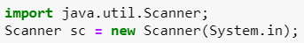
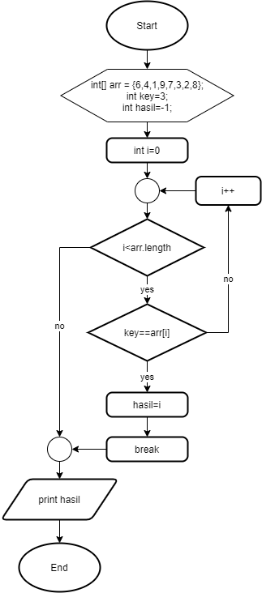

# JOBSHEET 10 - Array 1

## Tujuan
+ Mahasiswa mampu memahami pembuatan Array 1 dimensi dan pengaksesan elemenya di Java. 
+ Mahasiswa mampu membuat program dengan menggunakan konsep array satu dimensi.


## Alat dan Bahan
+ PC/laptop
+ Browser(chrome, firefox, safari)
+ Koneksi internet
+ Anaconda3 + Java kernel (opsional)

## Praktikum
### Percobaan 1: Mengisi Elemen Array
1. Pada percobaan ke-1 akan dilakukan percobaan untuk mengisi elemen array. Buat array bertipe integer dengan nama bil dengan kapasitas 4 elemen.


```Java
// Tulis Kode program Percobaan 1 Langkah 2 di atas
int [] bil = new int [4];
```

2. Isi masing-masing elemen array bil tadi dengan angka 5, 12, 7, 20.


```Java
// Tulis Kode program Percobaan 1 Langkah 3 di atas
bil[0] = 5;
bil[1] = 12;
bil[2] = 7;
bil[3] = 20;
```


    20


3. Tampilkan ke layar semua isi elemennya:


```Java
// Tulis Kode program Percobaan 1 Langkah 4
System.out.println(bil[0]);
System.out.println(bil[1]);
System.out.println(bil[2]);
System.out.println(bil[3]);
```

    5
    12
    7
    20


#### Pertanyaan 
1. Dari percobaan 1 berapakah indeks array terbesar dan terkecil?

// Tulis Jawaban no 1 disini
index array terbesar adalah 4 dan indeks array terkecil adalah 0.

2. Jika Isi masing-masing elemen array bil diubah dengan angka 5.0, 12867, 7.5, 2000000. Apa yang terjadi? Mengapa bisa demikian?

// Tulis Jawaban no 2 yang disini
maka yang di print adalah 5, 12867, 7, dan 2000000. karena tipe data dari array tersebut adalah int, dan hanya dapat menampung nilai bilangan bulat.

3. Ubah statement pada langkah No 3 menjadi seperti berikut

Apa keluaran dari program? Mengapa bisa demikian?


```Java
// Tulis Jawaban no 3 yang disini
int[] bil = new int[4];
bil[0] = 5;
bil[1] = 12;
bil[2] = 7;
bil[3] = 20;
for(int i = 0; i < 4; i++) {
    System.out.println(bil[i]);
}
```

    5
    12
    7
    20


karena sebenarnya, langkah no.3 adalah perulangan yang kita ketik satu persatu.

### Percobaan 2: Meminta Inputan Pengguna untuk Mengisi Elemen Array
1. Pada percobaan ke-2 akan dilakukan percobaan yang meminta inputan pengguna untuk mengisi elemen array seperti pada flowchart berikut


```Java
// Tulis Kode program Percobaan 2 Langkah 1 di atas
import java.util.Scanner;
Scanner input = new Scanner(System.in);
int nilaiUAS[] = new int[6];
int i = 0;
while(i < 6) {
    System.out.print("Masukkan Nilai : ");
    nilaiUAS[i] = input.nextInt();
    i++;
}
int i = 0;
do {
    System.out.println(nilaiUAS[i]);
    i++;
}while(i < 6);
```

    Masukkan Nilai : 45
    Masukkan Nilai : 67
    Masukkan Nilai : 85
    Masukkan Nilai : 49
    Masukkan Nilai : 90
    Masukkan Nilai : 83
    45
    67
    85
    49
    90
    83


penginputan nilai akan sesuai dengan indexnya karena i kita samakan dengan nilai indeks.

###### 2. Import dan deklarasikan Scanner untuk keperluan input. 


```Java
// Tulis Kode program Percobaan 2 Langkah 1 di atas
import java.util.Scanner;
Scanner sc = new Scanner(System.in);
```

3. Buat array bertipe integer dengan nama nilaiUAS, dengan kapasitas 6 elemen.


```Java
// Tulis Kode program Percobaan 2 Langkah 3 di atas
int[] nilaiUAS = new int[6];
```

4. Menggunakan perulangan, buat input untuk mengisi elemen dari array nilaiUAS.


```Java
// Tulis Kode program Percobaan 2 Langkah 4 di atas
for(int i = 0; i < 6; i++) {
    System.out.print("Masukkan nilai UAS ke-" + i + " : ");
    nilaiUAS[i] = sc.nextInt();
}
```

    Masukkan nilai UAS ke-0 : 45
    Masukkan nilai UAS ke-1 : 78
    Masukkan nilai UAS ke-2 : 82
    Masukkan nilai UAS ke-3 : 39
    Masukkan nilai UAS ke-4 : 41
    Masukkan nilai UAS ke-5 : 94


kita memanfaatkan nilai i yang sesuai dengan indeks untuk memberitahu user nilai keberapa sekarang yang harus dimasukkan.

5. Menggunakan perulangan, tampilkan semua isi elemen dari array nilaiUAS.


```Java
for (int i = 0; i < 6; i++) {
System.out.println("Nilai UAS ke-" + i + " adalah : " + nilaiUAS[i]);
}
```

#### Pertanyaan
1. Ubah statement pada langkah No 4 menjadi seperti berikut ini :

Jalankan program, apakah terjadi perubahan? Mengapa demikian?


```Java
// Tulis Jawaban nomor 1 disini
import java.util.Scanner;
Scanner sc = new Scanner(System.in);
int[] nilaiUAS = new int[6];
for(int i = 0; i < nilaiUAS.length; i++) {
    System.out.print("Masukkan nilai UAS ke-" + i + " : ");
    nilaiUAS[i] = sc.nextInt();
}
for(int i = 0; i < 6; i++) {
    System.out.println("Nilai UAS ke-" + i + " adalah " + nilaiUAS[i]);
}
```

    Masukkan nilai UAS ke-0 : 45
    Masukkan nilai UAS ke-1 : 67
    Masukkan nilai UAS ke-2 : 98
    Masukkan nilai UAS ke-3 : 82
    Masukkan nilai UAS ke-4 : 64
    Masukkan nilai UAS ke-5 : 
    57
    Nilai UAS ke-0 adalah 45
    Nilai UAS ke-1 adalah 67
    Nilai UAS ke-2 adalah 98
    Nilai UAS ke-3 adalah 82
    Nilai UAS ke-4 adalah 64
    Nilai UAS ke-5 adalah 57


hasilnya sama dengan sebelumnya karena sebelummnya kita memakai nilai 6. nilai 6 adalah nilai length dari array nilaiUAS.

##### 2. Apa kegunaan dari `nilaiUAS.length`? 

// Tulis Jawaban nomor 2 disini
untuk mengetahui panjang indeks dari sebuah array.

3. Ubah statement pada langkah No 5 menjadi seperti berikut ini sehingga program hanya menampilkan status mahasiswa yang lulus saja:

Jalankan program dan Jelaskan alur program!


```Java
// Tulis Jawaban nomor 3 disini
import java.util.Scanner;
Scanner sc = new Scanner(System.in);
int[] nilaiUAS = new int[6];
for(int i = 0; i < nilaiUAS.length; i++) {
    System.out.print("Masukkan nilai UAS ke-" + i + " : ");
    nilaiUAS[i] = sc.nextInt();
}
for(int i = 0; i <nilaiUAS.length; i++) {
    if (nilaiUAS[i] > 70) {
        System.out.println("Mahasiswa ke-" + i + " lulus");
    }
}
```

    Masukkan nilai UAS ke-0 : 72
    Masukkan nilai UAS ke-1 : 87
    Masukkan nilai UAS ke-2 : 93
    Masukkan nilai UAS ke-3 : 62
    Masukkan nilai UAS ke-4 : 67
    Masukkan nilai UAS ke-5 : 42
    Mahasiswa ke-0 lulus
    Mahasiswa ke-1 lulus
    Mahasiswa ke-2 lulus


memasukkan nilai uas 6 kali, jika nilai UAS lebih dari 70, maka akan dicetak mahasiswa dengan nomor urut keberapa yang dinyatakan lulus.

### Percobaan 3: Melakukan Operasi Aritmatika terhadap Elemen Array
Pada praktikum ini, akan dilakukan percobaan untuk menjumlahkan Array. Program akan menerima input sebanyak 10 nilai mahasiswa. Kemudian program akan menampilkan nilai rata-rata nilai dari 10 Mahasiswa. Seperti flowchart berikut


1.Import dan deklarasikan Scanner untuk keperluan input. 



```Java
// Tulis Kode program Percobaan 3 Langkah 1 di atas, disini
import java.util.Scanner;
Scanner sc = new Scanner(System.in)
```

2. Buat array nilaiMHS bertipe integer dengan kapasitas 10. Kemudian deklarasikan variable total dan rata seperti gambar berikut ini


```Java
// Tulis Kode program Percobaan 3 Langkah 2 di atas, disini
int nilaiMHS[] = new int[10];
double total, rata;
```

3. Menggunakan perulangan, buat input untuk mengisi array nilaiMHS


```Java
// Tulis Kode program Percobaan 3 Langkah 3 di atas, disini
for(int i = 0; i < nilaiMHS.length; i++) {
    System.out.print("Masukkan niali Mahasiswa ke-" + (i+1) + " : ");
    nilaiMHS[i] = sc.nextInt();
}
```

    Masukkan niali Mahasiswa ke-1 : 45
    Masukkan niali Mahasiswa ke-2 : 87
    Masukkan niali Mahasiswa ke-3 : 93
    Masukkan niali Mahasiswa ke-4 : 57
    Masukkan niali Mahasiswa ke-5 : 82
    Masukkan niali Mahasiswa ke-6 : 67
    Masukkan niali Mahasiswa ke-7 : 59
    Masukkan niali Mahasiswa ke-8 : 45
    Masukkan niali Mahasiswa ke-9 : 61
    Masukkan niali Mahasiswa ke-10 : 82


nilai dari i dapat kita naikkan base nya dengan menambahkan 1 base pada base indeks.

4. Menggunakan perulangan untuk menghitung jumlah keseluruhan nilai.


```Java
// Tulis Kode program Percobaan 3 Langkah 4 di atas, disini
for(int i = 0; i < nilaiMHS.length; i++) {
    total += nilaiMHS[i];
}
```

kode ini dibuat untuk menjumlahkan semua nilai yang ada di array.

5. Kemudian hitung nilai rata-rata dengan cara nilai total dibagi jumlah elemen dari array nilaiMHS\


```Java
// Tulis Kode program Percobaan 3 Langkah 3 di atas, disini
rata = total / nilaiMHS.length;
System.out.println("Rata-rata nilai mahasiswa adalah " + rata);
```

    Rata-rata nilai mahasiswa adalah 67.8


#### Pertanyaan 
1. Pada Percobaan 3 langkah ke-5. Mengapa perhitungan rata berada diluar perulangan?

// Tulis jawaban no 1 disini
karena kita memerlukan nilai dari hasil perulangan yaitu nilaiMHS yang sudah ditotal.

2. Modifikasi program pada percobaan 3 sehingga bisa mengeluarkan output  seperti gambar berikut ini!
syarat lulus nilai >70


```Java
// Tulis jawaban no 2 disini
import java.util.Scanner;
Scanner sc = new Scanner(System.in);
int nilaiMHS[] = new int[10];
int nilaiLulus = 0, nilaiTidakLulus = 0;
double rataLulus = 0, rataTidakLulus = 0;
for(int i = 0; i < nilaiMHS.length; i++) {
    System.out.print("Masukkan niali Mahasiswa ke-" + (i+1) + " : ");
    nilaiMHS[i] = sc.nextInt();
}
int counterPass = 0, counterNotPass = 0;
for(int i = 0; i < nilaiMHS.length; i++) {
     if(nilaiMHS[i] > 70) {
         nilaiLulus += nilaiMHS[i];
         counterPass++;
     } else {
         nilaiTidakLulus += nilaiMHS[i];
         counterNotPass++;
     }
}
rataLulus = nilaiLulus / counterPass;
rataTidakLulus = nilaiTidakLulus / counterNotPass;
System.out.println("Rata-rata nilai mahasiswa yang lulus adalah " + rataLulus);
System.out.println("Rata-rata nilai mahasiswa yang tidak lulus adalah " + rataTidakLulus);
```

    Masukkan niali Mahasiswa ke-1 : 90
    Masukkan niali Mahasiswa ke-2 : 80
    Masukkan niali Mahasiswa ke-3 : 100
    Masukkan niali Mahasiswa ke-4 : 70
    Masukkan niali Mahasiswa ke-5 : 60
    Masukkan niali Mahasiswa ke-6 : 40
    Masukkan niali Mahasiswa ke-7 : 50
    Masukkan niali Mahasiswa ke-8 : 20
    Masukkan niali Mahasiswa ke-9 : 10
    Masukkan niali Mahasiswa ke-10 : 30
    Rata-rata nilai mahasiswa yang lulus adalah 90.0
    Rata-rata nilai mahasiswa yang tidak lulus adalah 40.0


pertama kita meminta inputan nilai dari 10 mahasiswa. kemudian, dengan fungsi perulangan dan pemilihan, kita memisahkan nilai mahasiswa yang lulus dan mahasiswa yang tidak lulus dan memasukkannya pada variabel dan menjumlahkan semuanya. Kemudian, kita tentukan rata-rata dari nilai mahasiswa yang lulus dan mahasiswa yang tidak lulus.

### Percobaan 4: Pencarian menggunakan Array
Pada praktikum ini, akan dilakukan percobaan untuk mencari lokasi/indeks sebuah angka dalam array. Sesuai dengan flowchart di bawah ini:
 

1. Buat array arr[] bertipe integer dengan kapasitas 6 dan isi dengan nilai 6, 4, 1, 9, 7, 3, 2 dan 8. Kemudian deklarasikan variabel integer `key` untuk kata kunci pencarian dan variabel `hasil` untuk hasil indeks pencarian. Deklarasi dan inisialisasi seperti gambar berikut ini


```Java
// Tulis Kode program Percobaan 4 Langkah 1 di atas, disini
int[] arr = {6, 4, 1, 9, 7, 3, 2, 8};
int key = 3;
int hasil = -1;
```

2. Menggunakan perulangan, lakukan pencarian untuk mendapatkan nilai array yang sesuai dengan key. Bila ada yang sesuai, simpan indeksnya sebagai hasil pencarian


```Java
// Tulis Kode program Percobaan 4 Langkah 2 di atas, disini
for(int i = 0; i < arr.length; i++) {
    if(key == arr[i]) {
        hasil = i;
        break;
    }
}
```

perulangan ini dibuat untuk mencari nilai key yang sudah kita tentukan sebelumnya. jika nilai key ditemukan, nilai di hasil akan di overwrite.

3. Tampilkan hasil pencarian dengan kode berikut.


```Java
// Tulis Kode program Percobaan 4 Langkah 3 di atas, disini
System.out.println("Key ada di array ke-" + hasil);
```

    Key ada di array ke-5


disini kita mencetak nilai dari hasil yang merupakan posisi indeks yang menyimpan nilai yang sama dengan variabel key.

#### Pertanyaan 
1. Pada Percobaan 4 langkah ke-2. Apa kegunaan dari statement `break`?

// Tulis jawaban no 1 disini
untuk agar loop berhenti setelah menemukan nilai yang ada pada variabel key(3).

2. Modifikasi program pada percobaan 4 sehingga key yang dicari adalah angka 5. Kemudian jalankan program, amati hasilnya! Jelaskan penyebab dari hasil tersebut! 


```Java
// Tulis jawaban no 2 disini

int[] arr = {16, 4, 10, 90, 27, 3, 12, 28};
int temp = 0;
int key = 5;
int hasil = -1;

for(int i = 0; i < arr.length; i++){
    for(int j = 1; j < (arr.length-i); j++){
        if(arr[j-1] > arr[j]){
            temp = arr[j-1];
            arr[j-1] = arr[j];
            arr[j] = temp;
        }
    }
}
for(int i = 0; i < arr.length; i++) {
    if(key == arr[i]) {
        hasil = i;
        break;
    }
}
System.out.println("Hasil pengurutan: ");
for(int i = 0; i < arr.length; i++)
    System.out.println(arr[i]);
System.out.println("Key ada di array ke-" + hasil);
```

    Hasil pengurutan: 
    3
    4
    10
    12
    16
    27
    28
    90
    Key ada di array ke--1


disini, indeks yang dicetak adalah -1. yang secara logika memang tidak mungkin karena indeks array akan selalu positif >=0. Hal ini terjadi karena nilai key(5) tidak dapat ditemukan pada kumpulan nilai yang ada di dalam array.

### Percobaan 5: Pengurutan bilangan menggunakan Array
Pada praktikum ini, akan dilakukan percobaan untuk mengurutkan angka dalam array. Sesuai dengan flowchart di bawah ini:

1.Buat array arr[] bertipe integer dengan kapasitas 8 dan isi dengan nilai 16, 4, 10, 90, 27, 3, 12 dan 28. Kemudian deklarasikan variabel integer `temp` untuk media penukaran nilai pada variabel. Deklarasi dan inisialisasi seperti gambar berikut ini


```Java
// Tulis Kode program Percobaan 5 Langkah 1 disini
int[] arr = {16, 4, 10, 90, 27, 3, 12, 28};
int temp = 0;
```

2. Menggunakan perulangan, lakukan pengurutan bilangan dengan menukar posisi indeks tersebut dengan indeks berikutnya. Perulangan dilakukan untuk menukar posisi berulang kali. 


```Java
for(int i = 0; i < arr.length; i++) {
    for (int j = 1; j < (arr.length - i); j++) {
        if (arr[j - 1] > arr[j]) {
            temp = arr[j - 1];
            arr[j - 1] = arr [j];
            arr[j] = temp;
        }
    }
}
```

kita membandingkan 2 nilai dari 2 indeks berdekatan, nilai yang lebih besar akan di pindah ke arah belakang. dengan begini, pada perulangan pertama, nilai terbesar akan dipindahkan ke indeks paling besar. kemudian perulangan ini akan terus dilakukan sampai semua telah terurut.

3. Tampilkan hasil pengurutan dengan menggunakan perulangan


```Java
// Tulis Kode program Percobaan 5 Langkah 3 di atas, disini
System.out.println("Hasil pengurutan : ");
for (int i = 0; i < arr.length; i++) {
    System.out.println(arr[i]);
}
```

    Hasil pengurutan : 
    3
    4
    10
    12
    16
    27
    28
    90


## Tugas
### Soal 1
Buatlah program yang **sesuai** dengan alur _flowchart_ di bawah ini


Flowchart diatas menggambarkan alur program yang membaca 10 masukan pengguna berupa integer dan menyimpannya. Kemudian angka ganjil dan genap disimpan kembali ke dalam variabel lain yang terpisah


```Java
/* Jawaban Soal 1 disini */
import java.util.Scanner;
Scanner input = new Scanner(System.in);
int checkNum[] = new int[10];
int evenNum[] = new int[10];
int oddNum[] = new int[10];
int i = 0;
do {
    System.out.print("Masukkan nilai ke-" + (i+1) + " : ");
    checkNum[i] = input.nextInt();
    i++;
}while(i < checkNum.length);
byte cEven = 0, cOdd = 0;
for( int j = 0; j < checkNum.length; j++) {
    if (checkNum[j] % 2 == 0) {
        evenNum[cEven] = checkNum[j];
        cEven++;    
    } else {
        oddNum[cOdd] = checkNum[j];
        cOdd++;
    }
}
System.out.println("Hasil pemisahan : ");
System.out.print("Bilanga genap adalah ");
for (int a = 0; a < evenNum.length; a++) {
        if (evenNum[a] != 0) {
        System.out.print(evenNum[a] + " ");
        }
}
System.out.print("\nBilanga ganjil adalah ");
for (int b = 0; b < oddNum.length; b++) {
    if (oddNum[b] != 0) {
        System.out.print(oddNum[b] + " ");
    }
}
```

    Masukkan nilai ke-1 : 1
    Masukkan nilai ke-2 : 2
    Masukkan nilai ke-3 : 3
    Masukkan nilai ke-4 : 4
    Masukkan nilai ke-5 : 5
    Masukkan nilai ke-6 : 6
    Masukkan nilai ke-7 : 7
    Masukkan nilai ke-8 : 8
    Masukkan nilai ke-9 : 9
    Masukkan nilai ke-10 : 10
    Hasil pemisahan : 
    Bilanga genap adalah 2 4 6 8 10 
    Bilanga ganjil adalah 1 3 5 7 9 

>pertama, kita memasukkan nilai yang akan kita pisah. kemudian, kita pisah dengan menggunakan %2. jika menghasilkan 0, mka termasuk angka genap dan akan kita masukkan dalam array tersendiri. Begitu juga dengan angka ganjil, kita memasukkannya ke dalalm array tersendiri. Setelah itu, kita dapat mencetak isi dari array bilangan genap dan array bilangan ganjil. Jangan lupa untuk memberi perintah if. jika nilai dari array bernilai 0, maka tidak akan di print. dengan begini, nilai 0 untuk mengisi array tidak akan di print.

### Soal 2
Buatlah program yang terdapat array dengan jumlah elemen 5, buatlah input untuk mengisi elemen array tersebut, kemudian tampilkan isi array tersebut dengan urutan terbalik. Seperti ilustrasi gambar dibawah ini.


```Java
/* Jawaban Soal 2 disini */
import java.util.Scanner;
Scanner boo = new Scanner(System.in);
int[] kolom = new int[5];
for (int l = 0; l < kolom.length; l++) {
    System.out.print("Masukkan nilai array ke-" + (l+1) + " : ");
    kolom[l] = boo.nextInt();
}
System.out.println("Array awal : ");
for (int a = 0; a < kolom.length; a++) {
    System.out.print(kolom[a] + " ");
}
System.out.println("\nArray setelah dibalik : ");
int reverse = kolom.length - 1;
while( reverse >= 0) {
    System.out.print(kolom[reverse] + " ");
    reverse--;
}
```

    Masukkan nilai array ke-1 : 5
    Masukkan nilai array ke-2 : 2
    Masukkan nilai array ke-3 : 7
    Masukkan nilai array ke-4 : 9
    Masukkan nilai array ke-5 : 6
    Array awal : 
    5 2 7 9 6 
    Array setelah dibalik : 
    6 9 7 2 5 

>pertama, kita memasukkan nilai ke dalam array. kemudian, kita akan membandingkan 2 nilai dari array satu persatu. dengan aturan, nilai yang lebih besar akan ditaruh di indeks yang lebih besar. Dengan begini, pada perulangan pertama dapat dipastikan bahwa nilai terbesar akan dipindah pada indeks terbesar. kemudian perulangan ini akan diulang sampai nilai boolean pada perulangan tidak dapat di penuhi lagi.

### Soal 3
Buatlah program yang menerima input jumlah elemen array, inputkan isi arraynya, kemudian tampilkan bilangan terbesar dari isi elemen arraynya. Contoh hasil program:


```Java
/* Jawaban Soal 3 disini */
import java.util.Scanner;
Scanner ingpo = new Scanner(System.in);
System.out.print("Masukkan isi array : ");
int isiArray = ingpo.nextInt();
int[] elemen = new int[isiArray];
int i = 0;
int tempest = 0;
do {
    System.out.print("Masukkan elemen array ke-" + i + " : ");
    elemen[i] = ingpo.nextInt();
    if (elemen[i] > tempest) {
        tempest = elemen[i];
    }
    i++;
} while (i < isiArray);
System.out.println("Bilangan terbesar adalah " + tempest);
```

    Masukkan isi array : 5
    Masukkan elemen array ke-0 : 25
    Masukkan elemen array ke-1 : 78
    Masukkan elemen array ke-2 : 12
    Masukkan elemen array ke-3 : 63
    Masukkan elemen array ke-4 : 99
    Bilangan terbesar adalah 99

>Pertama, kita menginputkan jumlah elemen pada array. kemudian, kita meminta masukan dari user. kemudian, kita beri pemilihan, jika nilai yang dimasukkan lebih besar daripada nilai pada variabel tempest. maka nilai tersebut akan menggantikan nilai tempest. seperti itu terus sampai nanti menemukan nilai yang terbesar.
