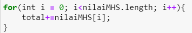
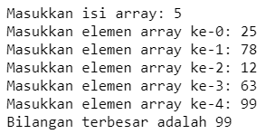

# JOBSHEET 10 - Array 1

## Tujuan
+ Mahasiswa mampu memahami pembuatan Array 1 dimensi dan pengaksesan elemenya di Java. 
+ Mahasiswa mampu membuat program dengan menggunakan konsep array satu dimensi.


## Alat dan Bahan
+ PC/laptop
+ Browser(chrome, firefox, safari)
+ Koneksi internet
+ Anaconda3 + Java kernel (opsional)

## Praktikum
### Percobaan 1: Mengisi Elemen Array
1. Pada percobaan ke-1 akan dilakukan percobaan untuk mengisi elemen array. Buat array bertipe integer dengan nama bil dengan kapasitas 4 elemen.


```Java
int[] bil = new int[4];
```

2. Isi masing-masing elemen array bil tadi dengan angka 5, 12, 7, 20.


```Java
bil[0] = 5;
bil[1] = 12;
bil[2] = 7;
bil[3] = 20;
```


    20


3. Tampilkan ke layar semua isi elemennya:


```Java
System.out.println(bil[0]);
System.out.println(bil[1]);
System.out.println(bil[2]);
System.out.println(bil[3]);
```

    5
    12
    7
    20


> Penjelasan Percobaan 1 : Kode program di atas diawali dengan deklarasi dan instansiasi array satu dimensi yang memiliki jumlah elemen 4. Lalu, memberi nilai pada masing-masing elemen. Kemudian, menge-print nilai masing-masing elemen.

#### Pertanyaan 
1. Dari percobaan 1 berapakah indeks array terbesar dan terkecil?

> Indeks terbesar adalah 3 dan indeks terkecilnya adalah 0.

2. Jika Isi masing-masing elemen array bil diubah dengan angka 5.0, 12867, 7.5, 2000000. Apa yang terjadi? Mengapa bisa demikian?


```Java
int[] bil = new int[4];
bil[0] = 5.0;
bil[1] = 12867;
bil[2] = 7.5;
bil[3] = 2000000;
```


    |   bil[0] = 5.0;

    incompatible types: possible lossy conversion from double to int

    


> Akan error ketika di-run. Hal ini karena tipe data dari variabel bil tersebut adalah int, yang nilainya harus bilangan bulat. Sedangkan pada pertanyaan di atas, nilai masing-masing elemen array beberapa diubah dalam bentuk desimal. Apabila memaksa menggunakan bilangan desimal, maka tipe datanya harus diubah menjadi double.

3. Ubah statement pada langkah No 3 menjadi seperti berikut

Apa keluaran dari program? Mengapa bisa demikian?


```Java
for(int i=0; i<4; i++){
    System.out.println(bil[i]);
}
```

    5
    12
    7
    20


> Keluaran atau output yang dihasilkan sama seperti langkah 3 di atas. Hal ini karena kode program menggunakan fungsi perulangan yang dimulai dari 0 (i=0) dan akan berhenti jika i kurang dari 4 atau i=3. Kemudian, variabel i akan di-print seiring pertambahan dari i tersebut. Jadi, ketika i=0 akan menge-print bil[0] yang nilainya adalah 5. Ketika i=1 akan menge-print bil[1] yang nilainya adalah 12. Begitu pun seterusnya sampai i kurang dari 4 (sesuai dengan panjang dari array tersebut).

### Percobaan 2: Meminta Inputan Pengguna untuk Mengisi Elemen Array
1. Pada percobaan ke-2 akan dilakukan percobaan yang meminta inputan pengguna untuk mengisi elemen array seperti pada flowchart berikut


2. Import dan deklarasikan Scanner untuk keperluan input. 


```Java
import java.util.Scanner;
Scanner sc = new Scanner(System.in);
```

3. Buat array bertipe integer dengan nama nilaiUAS, dengan kapasitas 6 elemen.


```Java
int[] nilaiUAS = new int[6];
```

4. Menggunakan perulangan, buat input untuk mengisi elemen dari array nilaiUAS.


```Java
for(int i = 0; i < 6; i++){
    System.out.print("Masukkan nilai UAS ke-" + i + ": ");
    nilaiUAS[i] = sc.nextInt();
}
```

    Masukkan nilai UAS ke-0: 50
    Masukkan nilai UAS ke-1: 60
    Masukkan nilai UAS ke-2: 70
    Masukkan nilai UAS ke-3: 80
    Masukkan nilai UAS ke-4: 90
    Masukkan nilai UAS ke-5: 100


5. Menggunakan perulangan, tampilkan semua isi elemen dari array nilaiUAS.


```Java
for(int i = 0; i < 6; i++){
    System.out.println("Nilai UAS ke-" + i + " adalah: " + nilaiUAS[i]);
}
```

    Nilai UAS ke-0 adalah: 50
    Nilai UAS ke-1 adalah: 60
    Nilai UAS ke-2 adalah: 70
    Nilai UAS ke-3 adalah: 80
    Nilai UAS ke-4 adalah: 90
    Nilai UAS ke-5 adalah: 100


> Penjelasan Percobaan 2 : Kode program di atas diawali dengan meng-import scanner karena akan diminta inputan dari user. Lalu, deklarasi dan instansiasi array yang memiliki panjang elemen 6. Kemudian, digunakan fungsi perulangan for untuk menginputkan 6 nilai UAS. Dan terakhir, program akan menge-print 6 nilai UAS yang diinputkan pada langkah sebelumnya.

#### Pertanyaan
1. Ubah statement pada langkah No 4 menjadi seperti berikut ini :

Jalankan program, apakah terjadi perubahan? Mengapa demikian?


```Java
for(int i = 0; i < nilaiUAS.length; i++){
    System.out.print("Masukkan nilai UAS ke-" + i + ": ");
    nilaiUAS[i] = sc.nextInt();
}
```

    Masukkan nilai UAS ke-0: 50
    Masukkan nilai UAS ke-1: 60
    Masukkan nilai UAS ke-2: 70
    Masukkan nilai UAS ke-3: 80
    Masukkan nilai UAS ke-4: 90
    Masukkan nilai UAS ke-5: 100


> Tidak terjadi perubahan. Karena bedanya hanya pada ekspresi 2 atau batas perulangan, tetapi intinya sama. Pada kode program sebelumnya adalah i < 6, sedangkan setelah diubah i < nilaiUAS.length dan nilai dari nilaiUAS.length adalah 6 (panjang dari array nilaiUAS).

2. Apa kegunaan dari `nilaiUAS.length`? 

> Kegunaan nilaiUAS.length adalah mengetahui panjang dari array nilaiUAS.

3. Ubah statement pada langkah No 5 menjadi seperti berikut ini sehingga program hanya menampilkan status mahasiswa yang lulus saja:

Jalankan program dan Jelaskan alur program!


```Java
for(int i = 0; i < nilaiUAS.length; i++){
    if(nilaiUAS[i] > 70){
        System.out.println("Mahasiswa ke-" + i + " lulus");
    }
}
```

    Mahasiswa ke-3 lulus
    Mahasiswa ke-4 lulus
    Mahasiswa ke-5 lulus


> Kode program di atas menggunakan perulangan for. Perulangan dimulai dari i=0 dan akan berhenti jika nilai i kurang dari panjang array. Lalu dalam perulangan tersebut, terdapat sintaks if dan akan diseleksi ketika nilai dari variabel nilaiUAS lebih dari 70. Ketika nilainya lebih dari 70, akan di-print apakah siswa tersebut lulus atau tidak.

### Percobaan 3: Melakukan Operasi Aritmatika terhadap Elemen Array
Pada praktikum ini, akan dilakukan percobaan untuk menjumlahkan Array. Program akan menerima input sebanyak 10 nilai mahasiswa. Kemudian program akan menampilkan nilai rata-rata nilai dari 10 Mahasiswa. Seperti flowchart berikut


1.Import dan deklarasikan Scanner untuk keperluan input. 


```Java
import java.util.Scanner;
Scanner sc = new Scanner(System.in);
```

2. Buat array nilaiMHS bertipe integer dengan kapasitas 10. Kemudian deklarasikan variable total dan rata seperti gambar berikut ini


```Java
int nilaiMHS[] = new int[10];
double total;
double rata;
```

3. Menggunakan perulangan, buat input untuk mengisi array nilaiMHS


```Java
for(int i = 0; i < nilaiMHS.length; i++){
    System.out.print("Masukkan nilai Mahasiswa ke-" + (i+1) + ":");
    nilaiMHS[i] = sc.nextInt();
}
```

    Masukkan nilai Mahasiswa ke-1:10
    Masukkan nilai Mahasiswa ke-2:20
    Masukkan nilai Mahasiswa ke-3:30
    Masukkan nilai Mahasiswa ke-4:40
    Masukkan nilai Mahasiswa ke-5:50
    Masukkan nilai Mahasiswa ke-6:60
    Masukkan nilai Mahasiswa ke-7:70
    Masukkan nilai Mahasiswa ke-8:80
    Masukkan nilai Mahasiswa ke-9:90
    Masukkan nilai Mahasiswa ke-10:100


4. Menggunakan perulangan untuk menghitung jumlah keseluruhan nilai.



```Java
for(int i = 0; i < nilaiMHS.length; i++){
    total += nilaiMHS[i];
}
```

5. Kemudian hitung nilai rata-rata dengan cara nilai total dibagi jumlah elemen dari array nilaiMHS\


```Java
rata = total/nilaiMHS.length;
System.out.println("Rata-rata nilai mahasiswa adalah " + total);
```

    Rata-rata nilai mahasiswa adalah 550.0


> Penjelasan Percobaan 3 : Kode program diawali dengan import Scanner karena akan diminta inputan dari user. Lalu, dilakukan deklarasi dan instansiasi array nilaiMHS yang memiliki panjang elemen 10. Kemudian, akan diminta inputan nilai mahasiswa dari user menggunakan perulangan for sampai panjang dari array itu sendiri. Lalu, nilai mahasiswa tadi ditampung dalam variabel nilaiMHS dan akan dijumlahkan semua. Dan terakhir, akan dihitung rata-rata dari nilai mahasiswa yang diinputkan dengan cara membagi total nilai dengan panjang array nilaiMHS, kemudian di-print.

#### Pertanyaan 
1. Pada Percobaan 3 langkah ke-5. Mengapa perhitungan rata berada diluar perulangan?

> Karena perhitungan rata tidak memerlukan perulangan untuk menghitungnya.

2. Modifikasi program pada percobaan 3 sehingga bisa mengeluarkan output  seperti gambar berikut ini!
syarat lulus nilai >70


```Java
import java.util.Scanner;
Scanner sc = new Scanner(System.in);
int nilaiMHS[] = new int[10];

int totalLulus, totalTdkLulus, jumlahLulus, jumlahTdkLulus;
double rataLulus, rataTdkLulus;

for(int i = 0; i < nilaiMHS.length; i++){
    System.out.print("Masukkan nilai Mahasiswa ke-" + (i + 1) + ":");
    nilaiMHS[i] = sc.nextInt();
    if(nilaiMHS[i] > 70){
        totalLulus += nilaiMHS[i];
        jumlahLulus++;
    } else{
        totalTdkLulus += nilaiMHS[i];
        jumlahTdkLulus++;
    }
}
rataLulus = totalLulus/jumlahLulus;
rataTdkLulus = totalTdkLulus/jumlahTdkLulus;

System.out.println("Rata-rata nilai mahasiswa yang lulus adalah " + rataLulus);
System.out.println("Rata-rata nilai mahasiswa yang tidak lulus adalah " + rataTdkLulus);
```

    Masukkan nilai Mahasiswa ke-1:90
    Masukkan nilai Mahasiswa ke-2:80
    Masukkan nilai Mahasiswa ke-3:100
    Masukkan nilai Mahasiswa ke-4:70
    Masukkan nilai Mahasiswa ke-5:60
    Masukkan nilai Mahasiswa ke-6:40
    Masukkan nilai Mahasiswa ke-7:50
    Masukkan nilai Mahasiswa ke-8:20
    Masukkan nilai Mahasiswa ke-9:10
    Masukkan nilai Mahasiswa ke-10:30
    Rata-rata nilai mahasiswa yang lulus adalah 90.0
    Rata-rata nilai mahasiswa yang tidak lulus adalah 40.0


> Penjelasan : Kode program di atas mirip dengan kode program pada percobaan 3. Hanya saja diberi sintaks if di dalam fungsi perulangan for, karena output yang diminta harus menseleksi nilai mahasiswa yang lulus (> 70) dan nilai mahasiswa yang tidak lulus (< 70). Nilai mahasiswa yang lulus akan dijumlah lalu ditampung dalam variabel totalLulus dan banyaknya mahasiswa yang lulus akan ditampung dalam variabel jumlahLulus. Sedangkan, untuk nilai mahasiswa yang tidak lulus akan dijumlah juga lalu ditampung dalam variabel tidak totalTdkLulus dan banyaknya mahasiswa yang tidak lulus akan ditampung dalam variabel jumlahTdkLulus. Selanjutnya, akan dihitung masing-masing rata-rata mahasiswa yang lulus dan tidak lulus dengan cara membagi total nilainya dengan jumlah mahasiswanya. Dan terakhir, akan di-print masing-masing rata-rata yang lulus maupun tidak lulus.

### Percobaan 4: Pencarian menggunakan Array
Pada praktikum ini, akan dilakukan percobaan untuk mencari lokasi/indeks sebuah angka dalam array. Sesuai dengan flowchart di bawah ini:
 

1. Buat array arr[] bertipe integer dengan kapasitas 6 dan isi dengan nilai 6, 4, 1, 9, 7, 3, 2 dan 8. Kemudian deklarasikan variabel integer `key` untuk kata kunci pencarian dan variabel `hasil` untuk hasil indeks pencarian. Deklarasi dan inisialisasi seperti gambar berikut ini


```Java
int[] arr = {6,4,1,9,7,3,2,8};
int key = 3;
int hasil = -1;
```

2. Menggunakan perulangan, lakukan pencarian untuk mendapatkan nilai array yang sesuai dengan key. Bila ada yang sesuai, simpan indeksnya sebagai hasil pencarian


```Java
for(int i=0; i<arr.length; i++){
    if(key==arr[i]){
        hasil=i;
        break;
    }
}
```

3. Tampilkan hasil pencarian dengan kode berikut.


```Java
System.out.println("Key ada di array ke-" + hasil);
```

    Key ada di array ke-5


> Penjelasan Percobaan 4 : Kode program diawali dengan deklarasi dan instansiasi array berkapasitas 8 (6,4,1,9,7,3,2,8). Kemudian, deklarasi variabel key dan hasil. Pada variabel hasil, nilainya -1 karena indeks atau elemen dimulai dari 0. Lalu, fungsi perulangan digunakan untuk mencari indeks yang nilainya sama dengan key dan di-break apabila indeksnya sudah ditemukan. Terakhir, akan di-print hasil pencarian array tadi ada di indeks ke berapa.

#### Pertanyaan 
1. Pada Percobaan 4 langkah ke-2. Apa kegunaan dari statement `break`?

> Statement break digunakan untuk menghentikan perulangan apabila ditemukan indeks yang nilainya sama dengan key.

2. Modifikasi program pada percobaan 4 sehingga key yang dicari adalah angka 5. Kemudian jalankan program, amati hasilnya! Jelaskan penyebab dari hasil tersebut! 


```Java
int[] arr = {6,4,1,9,7,3,2,8};
int key = 5;
int hasil = -1;

for(int i=0; i<arr.length; i++){
    if(key==arr[i]){
        hasil=i;
        break;
    }
}
System.out.println("Key ada di array ke-" + hasil);
```

    Key ada di array ke--1


> Penjelasan : Output yang dihasilkan adalah key ada di array ke-(-1). Hal ini karena angka 5 tidak ada dalam indeks pada array. Sehingga perulangannya akan terus terjadi sampai panjang dari array tersebut tetapi tidak ditemukan array ke berapa. Jadi, variabel hasil yang di-print akan mengikuti deklarasi variabel hasil sebelum fungsi perulangan, yaitu -1.

### Percobaan 5: Pengurutan bilangan menggunakan Array
Pada praktikum ini, akan dilakukan percobaan untuk mengurutkan angka dalam array. Sesuai dengan flowchart di bawah ini:

1.Buat array arr[] bertipe integer dengan kapasitas 8 dan isi dengan nilai 16, 4, 10, 90, 27, 3, 12 dan 28. Kemudian deklarasikan variabel integer `temp` untuk media penukaran nilai pada variabel. Deklarasi dan inisialisasi seperti gambar berikut ini


```Java
int[] arr = {16, 4, 10, 90, 27, 3, 12, 28};
int temp = 0;
```

2. Menggunakan perulangan, lakukan pengurutan bilangan dengan menukar posisi indeks tersebut dengan indeks berikutnya. Perulangan dilakukan untuk menukar posisi berulang kali. 


```Java
for(int i = 0; i < arr.length; i++){
    for(int j = 1; j < (arr.length-i); j++){
        if(arr[j-1] > arr[j]){
            temp = arr[j-1];
            arr[j-1] = arr[j];
            arr[j] = temp;
        }
    }
}
```

3. Tampilkan hasil pengurutan dengan menggunakan perulangan


```Java
System.out.println("Hasil pengurutan: ");
for(int i = 0; i < arr.length; i++)
    System.out.println(arr[i]);
```

    Hasil pengurutan: 
    3
    4
    10
    12
    16
    27
    28
    90


> Penjelasan Percobaan 5 : Kode program diawali dengan deklarasi dan instansiasi array arr. Dideklarasikan juga variabel temp yang nantinya sebagai tempat pertukaran nilai pada variabel. Kemudian, dilakukan perulangan untuk mengecek nilai dari masing-masing elemen, dan jika ada nilai yang lebih besar daripada nilai setelahnya, maka posisi nilai dari elemen tersebut akan ditukar. Perulangan ini dilakukan terus-menerus sampai nilai dari elemen tersebut urut dari terkecil hingga terbesar. Terakhir, program akan menge-print hasil dari pengurutan yang telah dilakukan.

## Tugas
### Soal 1
Buatlah program yang **sesuai** dengan alur _flowchart_ di bawah ini


Flowchart diatas menggambarkan alur program yang membaca 10 masukan pengguna berupa integer dan menyimpannya. Kemudian angka ganjil dan genap disimpan kembali ke dalam variabel lain yang terpisah


```Java
import java.util.Scanner;
Scanner sc = new Scanner(System.in);

int checkNum[] = new int[10];
int evenNum[] = new int[10];
int oddNum[] = new int[10];
int cEven, cOdd = 0;

for(int i = 0; i < checkNum.length; i++){
    System.out.print("Masukkan angka : ");
    checkNum[i] = sc.nextInt();
}
for(int j = 0; j < checkNum.length; j++){
    if(checkNum[j]%2==0){
        evenNum[cEven] = checkNum[j];
        cEven++;
    } else{
        oddNum[cOdd] = checkNum[j];
        cOdd++;
    }
}
System.out.print("Angka genap yang Anda inputkan ada " + cEven + ", yaitu ");
for(int i = 0; i < cEven; i++){
    System.out.print(evenNum[i] + " ");
}
System.out.println("");
System.out.print("Angka ganjil yang Anda inputkan ada " + cOdd + ", yaitu ");
for(int i = 0; i < cOdd; i++){
    System.out.print(oddNum[i] + " ");
}
```

    Masukkan angka : 1
    Masukkan angka : 2
    Masukkan angka : 3
    Masukkan angka : 4
    Masukkan angka : 5
    Masukkan angka : 6
    Masukkan angka : 7
    Masukkan angka : 8
    Masukkan angka : 9
    Masukkan angka : 10
    Angka genap yang Anda inputkan ada 5, yaitu 2 4 6 8 10 
    Angka ganjil yang Anda inputkan ada 5, yaitu 1 3 5 7 9 

> Penjelasan Soal 1 : Kode program diawali dengan deklarasi dan instansiasi array. Karena inputan yang diminta ada 10 angka, maka panjang arraynya adalah 10. Lalu, program akan meminta user menginputkan 10 angka. Kemudian, dari 10 inputan tadi dicek satu-satu, dan apabila nilai inputannya dapat dibagi 2 (genap) maka nilai-nilai tadi dikelompokkan dalam satu variabel bernama evenNum. Sedangkan variabel cEven digunakan untuk menampung banyaknya inputan yang dapat dibagi 2 (angka genap). Apabila nilai inputannya tidak dapat dibagi 2 (ganjil) maka nilai-nilainya akan dikelompokkan dalam satu variabel bernama oddNum. Sedangkan variabel cOdd digunakan untuk menampung banyaknya inputan yang tidak dapat dibagi 2 (angka ganjil). Terakhir, program akan menge-print angka genap dan ganjil, begitu juga dengan banyaknya angka genap dan ganjil tersebut.

### Soal 2
Buatlah program yang terdapat array dengan jumlah elemen 5, buatlah input untuk mengisi elemen array tersebut, kemudian tampilkan isi array tersebut dengan urutan terbalik. Seperti ilustrasi gambar dibawah ini.


```Java
import java.util.Scanner;
Scanner sc = new Scanner(System.in);

int a[] = new int[5];

for(int i = 0; i < a.length; i++){
    System.out.print("Masukkan angka : ");
    a[i] = sc.nextInt();
}
System.out.println("");
System.out.print("Urutan terbaliknya adalah ");
for(int i = a.length-1; i >= 0; i--){
    System.out.print(a[i] + " ");
}
```

    Masukkan angka : 6
    Masukkan angka : 7
    Masukkan angka : 2
    Masukkan angka : 1
    Masukkan angka : 3
    
    Urutan terbaliknya adalah 3 1 2 7 6 

> Penjelasan Soal 2 : Kode program diawali dengan deklarasi dan instansiasi array a berkapasitas 5. Lalu, menggunakan perulangan for untuk menginputkan 5 angka dari user. Kemudian, digunakan perulangan for lagi untuk membalikkan urutan angka yang tadi diinputkan user. Ekspresi 1 bernilai a.length-1, karena perulangan dimulai dari belakang (panjang array - 1). Ekspresi 2 adalah i >= 0 karena perulangan akan berhenti ketika i=0 (indeks ke-0) atau dengan kata lain angka pertama yang diinputkan user. Dan ekspresi 3 berupa decrement karena perulangan dari belakang (inputan terakhir) sampai depan (inputan pertama).

### Soal 3
Buatlah program yang menerima input jumlah elemen array, inputkan isi arraynya, kemudian tampilkan bilangan terbesar dari isi elemen arraynya. Contoh hasil program:



```Java
import java.util.Scanner;
Scanner sc = new Scanner(System.in);
int isiArr, temp;

System.out.print("Masukkan isi array : ");
isiArr = sc.nextInt();

int eleArr[] = new int[isiArr];
for(int i = 0; i < isiArr; i++){
    System.out.print("Masukkan elemen array ke-" + i + ": ");
    eleArr[i] = sc.nextInt();
}
for(int a = 0; a < eleArr.length; a++){
    for(int b = 1; b < (eleArr.length-a); b++){
        if(eleArr[b-1] > eleArr[b]){
            temp = eleArr[b-1];
            eleArr[b-1] = eleArr[b];
            eleArr[b] = temp;
        }
    }
}
System.out.print("Bilangan terbesar adalah " + eleArr[isiArr-1]);
```

    Masukkan isi array : 5
    Masukkan elemen array ke-0: 21
    Masukkan elemen array ke-1: 36
    Masukkan elemen array ke-2: 77
    Masukkan elemen array ke-3: 41
    Masukkan elemen array ke-4: 56
    Bilangan terbesar adalah 77

> Penjelasan Soal 3 : Kode program diawali dengan deklarasi variabel yang akan menampung panjang array. Lalu, user akan diminta memasukkan panjang arraynya. Kemudian dilakukan dekalarasi dan instansiasi array berkapasitas sesuai inputan user. Lalu, digunakan perulangan for untuk meminta user menginputkan nilai dari elemen array. Selanjutnya, menggunakan perulangan for lagi untuk mengecek satu-satu nilai masing-masing elemen array dan diurutkan dari yang terbesar sampai terkecil dengan cara menukar posisi apabila terdapat nilai elemen yang lebih besar daripada nilai elemen setelahnya (seperti kode program pada percobaan 5). Terakhir, program akan menge-print bilangan terbesar dari inputan user dengan cara mengambil nilai elemen terakhir dari pengurutan yang telah dilakukan.
