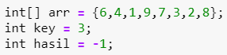

# JOBSHEET 10 - Array 1

## Tujuan
+ Mahasiswa mampu memahami pembuatan Array 1 dimensi dan pengaksesan elemenya di Java. 
+ Mahasiswa mampu membuat program dengan menggunakan konsep array satu dimensi.


## Alat dan Bahan
+ PC/laptop
+ Browser(chrome, firefox, safari)
+ Koneksi internet
+ Anaconda3 + Java kernel (opsional)

## Praktikum
### Percobaan 1: Mengisi Elemen Array
1. Pada percobaan ke-1 akan dilakukan percobaan untuk mengisi elemen array. Buat array bertipe integer dengan nama bil dengan kapasitas 4 elemen.


```Java
// Tulis Kode program Percobaan 1 Langkah 2 di atas
int[] bil=new int[4];
```

Kode program di atas berfungsi sebagai deklarasi array yang bernama bil, bertipe integer, jumlah elemen 4.

2. Isi masing-masing elemen array bil tadi dengan angka 5, 12, 7, 20.


```Java
// Tulis Kode program Percobaan 1 Langkah 3 di atas
bil[0] = 5;
bil[1] = 12;
bil[2] = 7;
bil[3] = 20;
```


    20


Kode program di atas merupakan pengisian array dengan beberapa nilai.

3. Tampilkan ke layar semua isi elemennya:


```Java
// Tulis Kode program Percobaan 1 Langkah 4
System.out.println(bil[0]);
System.out.println(bil[1]);
System.out.println(bil[2]);
System.out.println(bil[3]);
```

    5
    12
    7
    20


Kode program di atas berfungsi untuk menampilkan isi array elemen ken 0, 1, 2, dan 3.

#### Pertanyaan 
1. Dari percobaan 1 berapakah indeks array terbesar dan terkecil?

// Tulis Jawaban no 1 disini

Indeks array terbesar adalah [3] = 20 dan indeks terkecil adalah [0] = 5

2. Jika Isi masing-masing elemen array bil diubah dengan angka 5.0, 12867, 7.5, 2000000. Apa yang terjadi? Mengapa bisa demikian?


```Java
// Tulis Jawaban no 2 yang disini
bil[0] = 5.0;
bil[1] = 12867;
bil[2] = 7.5;
bil[3] = 2000000;
System.out.println(bil[0]);
System.out.println(bil[1]);
System.out.println(bil[2]);
System.out.println(bil[3]);
```


    |   bil[0] = 5.0;

    incompatible types: possible lossy conversion from double to int

    


Nilai 5.0 dan 7.5 tidak kompatibel dengan tipe data int, karena keduanya seharusnya termasuk ke dalam tipe data float atau double.

3. Ubah statement pada langkah No 3 menjadi seperti berikut

Apa keluaran dari program? Mengapa bisa demikian?


```Java
// Tulis Jawaban no 3 yang disini
for(int i=0; i<4; i++){
    System.out.println(bil[i]);
}
```

    5
    12
    7
    20


Akan menghasilkan output yang sama dengan kode program awal, hal ini dikarenakan

for(int i=0; i<4; i++){
    System.out.println(bil[i]);
}

Akan melakukan perulangan untuk menampilkan output bil[i] yang mana nilai i dideklarasikan oleh perulangan tersebut sebagai angka 0 sampai 3 (<4).

### Percobaan 2: Meminta Inputan Pengguna untuk Mengisi Elemen Array
1. Pada percobaan ke-2 akan dilakukan percobaan yang meminta inputan pengguna untuk mengisi elemen array seperti pada flowchart berikut


2. Import dan deklarasikan Scanner untuk keperluan input. 


```Java
// Tulis Kode program Percobaan 2 Langkah 1 di atas
import java.util.Scanner;
Scanner sc = new Scanner(System.in);
```

Untuk mendeklarasikan scanner. Ini digunakan untuk memberikan inputan kepada program.

3. Buat array bertipe integer dengan nama nilaiUAS, dengan kapasitas 6 elemen.


```Java
// Tulis Kode program Percobaan 2 Langkah 3 di atas
int[] nilaiUAS = new int[6];
```

Kode program di atas bertipe data integer dengan nama nilaiUAS dengan kapasitas 6 elemen.

4. Menggunakan perulangan, buat input untuk mengisi elemen dari array nilaiUAS.


```Java
// Tulis Kode program Percobaan 2 Langkah 4 di atas
for(int i = 0; i < 6; i++){
    System.out.print("Masukkan nilai uas ke-" + i + ": ");
    nilaiUAS[i] = sc.nextInt();
}
```

    Masukkan nilai uas ke-0: 90
    Masukkan nilai uas ke-1: 70
    Masukkan nilai uas ke-2: 80
    Masukkan nilai uas ke-3: 60
    Masukkan nilai uas ke-4: 100
    Masukkan nilai uas ke-5: 75


Pada kode program di atas menggunakan perulangan for. int i = 0; sebagai inisialisasi, i < 6; sebagai kondisi, dan i++ sebagai increment. Kemudian user memasukkan input untuk mengisi elemen dari array nilaiUAS.

5. Menggunakan perulangan, tampilkan semua isi elemen dari array nilaiUAS.


```Java
// Tulis Kode program Percobaan 2 Langkah 5 di atas
for(int i = 0; i < 6; i++){
    System.out.println("Nilai UAS ke-" + i + " adalah: " + nilaiUAS[i]);
}
```

    Nilai UAS ke-0 adalah: 90
    Nilai UAS ke-1 adalah: 70
    Nilai UAS ke-2 adalah: 80
    Nilai UAS ke-3 adalah: 60
    Nilai UAS ke-4 adalah: 100
    Nilai UAS ke-5 adalah: 75


Pada kode program di atas menggunakan perulangan for. int i = 0; sebagai inisialisasi, i < 6; sebagai kondisi, dan i++ sebagai increment. Kemudian user memasukkan input untuk mengisi elemen dari array nilaiUAS dan akan menampilkan semua isi elemen dari array nilaiUAS.

#### Pertanyaan
1. Ubah statement pada langkah No 4 menjadi seperti berikut ini :

Jalankan program, apakah terjadi perubahan? Mengapa demikian?


```Java
// Tulis Jawaban nomor 1 disini
for(int i = 0; i < nilaiUAS.length; i++){
    System.out.print("Masukkan nilai uas ke-" + i + ": ");
    nilaiUAS[i] = sc.nextInt();
}
```

    Masukkan nilai uas ke-0: 90
    Masukkan nilai uas ke-1: 70
    Masukkan nilai uas ke-2: 80
    Masukkan nilai uas ke-3: 60
    Masukkan nilai uas ke-4: 100
    Masukkan nilai uas ke-5: 75


Tidak terjadi perubahan, hal ini karena kode program di atas sama dengan langkah nomor 4 yaitu menginputkan nilai sebanyak 6 kali dan  looping akan berhenti ketika panjang array telah terisi semua.

2. Apa kegunaan dari `nilaiUAS.length`? 

// Tulis Jawaban nomor 2 disini

nilaiUAS.length berguna untuk memberikan nilai jumlah elemen array. Sehingga program akan berhenti ketika semua elemen array telah terpenuhi.

3. Ubah statement pada langkah No 5 menjadi seperti berikut ini sehingga program hanya menampilkan status mahasiswa yang lulus saja:

Jalankan program dan Jelaskan alur program!


```Java
// Tulis Jawaban nomor 3 disini
for(int i = 0; i < nilaiUAS.length; i++){
    if(nilaiUAS[i] > 70){
    System.out.println("Mahasiswa ke-" + i +" lulus");
    }
}   
```

    Mahasiswa ke-0 lulus
    Mahasiswa ke-2 lulus
    Mahasiswa ke-4 lulus
    Mahasiswa ke-5 lulus


Program akan meminta input nilai mahasiswa dengan melakukan looping sehingga membuat kode menjadi efisien. Setelah user memasukkan nilai, program akan menyimpan dalam array. Setelah elemen array terpenuhi maka program akan melakukan perulangan kedua yaitu menampilkan output. Pada saat menampilkan output program akan melakukan pengecekan apakah nilai yang dimasukkan dalam perulangan lebih dari 70 atau tidak. Jika nilai yang dimasukkan lebih dari 70 atau tidak. Jika nilai yang dimasukkan lebih dari 70 maka akan mengeluarkan output lulus. Jika nilai yang dimasukkan kurang dari 70 maka program tidak akan mengeluarkan output apa-apa.

### Percobaan 3: Melakukan Operasi Aritmatika terhadap Elemen Array
Pada praktikum ini, akan dilakukan percobaan untuk menjumlahkan Array. Program akan menerima input sebanyak 10 nilai mahasiswa. Kemudian program akan menampilkan nilai rata-rata nilai dari 10 Mahasiswa. Seperti flowchart berikut


1.Import dan deklarasikan Scanner untuk keperluan input. 


```Java
// Tulis Kode program Percobaan 3 Langkah 1 di atas, disini
import java.util.Scanner;
Scanner sc = new Scanner(System.in);
```

Untuk mendeklarasikan scanner. Ini digunakan untuk memberikan inputan kepada program.

2. Buat array nilaiMHS bertipe integer dengan kapasitas 10. Kemudian deklarasikan variable total dan rata seperti gambar berikut ini


```Java
// Tulis Kode program Percobaan 3 Langkah 2 di atas, disini
int nilaiMHS[] = new int[10];
double total;
double rata;
```

Kode program di atas bertipe data integer dengan nama nilaiMHS dengan kapasitas 10 elemen. Serta bertipe data double untuk variabel total dan rata.

3. Menggunakan perulangan, buat input untuk mengisi array nilaiMHS


```Java
// Tulis Kode program Percobaan 3 Langkah 3 di atas, disini
for(int i = 0; i<nilaiMHS.length; i++){
    System.out.print("Masukkan nilai Mahasiswa ke-"+(i+1)+":");
    nilaiMHS[i] = sc.nextInt();
}
```

    Masukkan nilai Mahasiswa ke-1:82
    Masukkan nilai Mahasiswa ke-2:89
    Masukkan nilai Mahasiswa ke-3:67
    Masukkan nilai Mahasiswa ke-4:90
    Masukkan nilai Mahasiswa ke-5:94
    Masukkan nilai Mahasiswa ke-6:29
    Masukkan nilai Mahasiswa ke-7:62
    Masukkan nilai Mahasiswa ke-8:58
    Masukkan nilai Mahasiswa ke-9:47
    Masukkan nilai Mahasiswa ke-10:97


Kode program di atas menggunakan perulangan for dengan int i = 0; sebagai inisialisasi, i<nilaiMHS.length; sebagai kondisi, dan i++ sebagai increment. Kemudian user akan diminta untuk memasukkan nilai mahasiswa sebanyak 10 kali.

4. Menggunakan perulangan untuk menghitung jumlah keseluruhan nilai.


```Java
// Tulis Kode program Percobaan 3 Langkah 4 di atas, disini
for(int i = 0; i<nilaiMHS.length; i++){
    total+=nilaiMHS[i];
}
```

Kode program di atas menggunakan perulangan for dengan int i = 0; sebagai inisialisasi, i<nilaiMHS.length; sebagai kondisi, dan  i++ sebagai increment. Pada program ini akan dilakukan perulangan untuk menghitung jumlah keseluruhan nilai.

5. Kemudian hitung nilai rata-rata dengan cara nilai total dibagi jumlah elemen dari array nilaiMHS\


```Java
// Tulis Kode program Percobaan 3 Langkah 3 di atas, disini
rata= total/nilaiMHS.length;
System.out.println("Rata-rata nilai mahasiswa adalah "+rata);
```

    Rata-rata nilai mahasiswa adalah 71.5


Pada kode program di atas digunakan untuk menghitung nilai rata-rata dengan cara nilai total dibagi jumlah elemen dari array nilaiMHS. Kemudian rata-rata akan ditampilkan.

#### Pertanyaan 
1. Pada Percobaan 3 langkah ke-5. Mengapa perhitungan rata berada diluar perulangan?

// Tulis jawaban no 1 disini

Karena rata-rata akan menghitung nilai keseluruhan total dibagi panjang array. Sehingga rata-rata akan terlebih dahulu menerima jumlah total nilai mahasiswa. Jumlah total nilai mahasiswa dilakukan perhitungan secara looping untuk mengefisiensi). Selain itu, pada perhitungan rata-rata tidak memerlukan perulangan.

2. Modifikasi program pada percobaan 3 sehingga bisa mengeluarkan output  seperti gambar berikut ini!
syarat lulus nilai >70


```Java
// Tulis jawaban no 2 disini
import java.util.Scanner;
Scanner sc = new Scanner(System.in);

int nilaiMHS[] = new int[10];
double totalLulus, totalTdkLulus;
double rataLulus, rataTdkLulus;
int x=0;
int y=0;

    for(int i=0; i<nilaiMHS.length; i++){
        System.out.print("Masukkan nilai Mahasiswa ke-"+(i+1)+":");
        nilaiMHS[i] = sc.nextInt();
    }
    for(int i=0; i<nilaiMHS.length; i++){
        if(nilaiMHS[i]>70){
        totalLulus+=nilaiMHS[i];
            x++;
    }else{
        totalTdkLulus+=nilaiMHS[i];
            y++;
    }
}
    rataLulus = totalLulus/x;
        System.out.println("Rata-rata nilai mahasiswa yang lulus adalah "+rataLulus);
    rataTdkLulus = totalTdkLulus/y;
        System.out.println("Rata-rata nilai mahasiswa yang tidak lulus adalah "+rataTdkLulus);
```

    Masukkan nilai Mahasiswa ke-1:90
    Masukkan nilai Mahasiswa ke-2:80
    Masukkan nilai Mahasiswa ke-3:100
    Masukkan nilai Mahasiswa ke-4:70
    Masukkan nilai Mahasiswa ke-5:60
    Masukkan nilai Mahasiswa ke-6:40
    Masukkan nilai Mahasiswa ke-7:50
    Masukkan nilai Mahasiswa ke-8:20
    Masukkan nilai Mahasiswa ke-9:10
    Masukkan nilai Mahasiswa ke-10:30
    Rata-rata nilai mahasiswa yang lulus adalah 90.0
    Rata-rata nilai mahasiswa yang tidak lulus adalah 40.0


Kode program int nilaiMHS[] = new int[10]; bertipe data integer dengan nama nilaiMHS dengan kapasitas 10 elemen. Menggunakan tipe data double untuk variabel totalLulus, totalTdkLulus, rataLulus, dan rataTdkLulus. Kemudian menggunakan tipe data integer untuk variabel x=0 dan y=0. Kemudian user memasukkan inputan nilai mahasiswa. Kode program di atas menggunakan perulangan for sebanyak 2 kali serta pemilihan if else. Jika nilai mahasiswa >70 maka ia lulus. Jika kurang dari 70 maka tidak lulus. Kemudian seluruh rata-rata lulus dihitung dengan cara totalLulus/x sehingga menampilkan berapa rata-rata mahasiswa yang lulus. Selanjutnya seluruh rata-rata tidak lulus dihitung dengan cara totalTdkLulus/y sehingga menampilkan berapa rata-rata mahasiswa yang tidak lulus.

### Percobaan 4: Pencarian menggunakan Array
Pada praktikum ini, akan dilakukan percobaan untuk mencari lokasi/indeks sebuah angka dalam array. Sesuai dengan flowchart di bawah ini:
 

1. Buat array arr[] bertipe integer dengan kapasitas 6 dan isi dengan nilai 6, 4, 1, 9, 7, 3, 2 dan 8. Kemudian deklarasikan variabel integer `key` untuk kata kunci pencarian dan variabel `hasil` untuk hasil indeks pencarian. Deklarasi dan inisialisasi seperti gambar berikut ini



```Java
// Tulis Kode program Percobaan 4 Langkah 1 di atas, disini
int[] arr = {6,4,1,9,7,3,2,8};
int key = 3;
int hasil = -1;
```

Kode program int[] arr = {6,4,1,9,7,3,2,8}; bertipe data integer dengan nama arr dengan kapasitas 8 elemen. Variabel key = 3 dan hasil = -1 bertipe data integer.

2. Menggunakan perulangan, lakukan pencarian untuk mendapatkan nilai array yang sesuai dengan key. Bila ada yang sesuai, simpan indeksnya sebagai hasil pencarian


```Java
// Tulis Kode program Percobaan 4 Langkah 2 di atas, disini
for(int i=0; i<arr.length; i++){
    if(key==arr[i]){
        hasil=i;
        break;
    }
}
```

Kode program di atas menggunakan perulangan for dengan int i=0; sebagai inisialisasi, i<arr.length; sebagai kondisi, dan i++ sebagai increment. Pada program ini untuk melakukan pencarian untuk mendapatkan nilai array yang sesuai dengan key menggunakan perulangan. Jika ada yang sesuai simpan indeksnya sebagai hasil pencarian.

3. Tampilkan hasil pencarian dengan kode berikut.


```Java
// Tulis Kode program Percobaan 4 Langkah 3 di atas, disini
System.out.println("Key ada di array ke-"+hasil);
```

    Key ada di array ke-5


Kemudian akan ditampilkan output dari hasil pencarian.

#### Pertanyaan 
1. Pada Percobaan 4 langkah ke-2. Apa kegunaan dari statement `break`?

// Tulis jawaban no 1 disini

Statement break berfungsi untuk menghentikan perulangan jika key sudah ditemukan.

2. Modifikasi program pada percobaan 4 sehingga key yang dicari adalah angka 5. Kemudian jalankan program, amati hasilnya! Jelaskan penyebab dari hasil tersebut! 


```Java
// Tulis jawaban no 2 disini
int[] arr = {6,4,1,9,7,3,2,8};
int key = 5;
int hasil = -1;

for(int i=0; i<arr.length; i++){
    if(key==arr[i]){
        hasil=i;
        break;
    }
}
System.out.println("Key ada di array ke-"+hasil);
```

    Key ada di array ke--1


Penyebab output Key ada di array ke--1 karena angka 5 tidak terdapat pada elemen arr. Oleh karena itu, hasil output akan ditampilkan -1.

### Percobaan 5: Pengurutan bilangan menggunakan Array
Pada praktikum ini, akan dilakukan percobaan untuk mengurutkan angka dalam array. Sesuai dengan flowchart di bawah ini:

1.Buat array arr[] bertipe integer dengan kapasitas 8 dan isi dengan nilai 16, 4, 10, 90, 27, 3, 12 dan 28. Kemudian deklarasikan variabel integer `temp` untuk media penukaran nilai pada variabel. Deklarasi dan inisialisasi seperti gambar berikut ini


```Java
// Tulis Kode program Percobaan 5 Langkah 2 di atas, disini
int[] arr = {16, 4, 10, 90, 27, 3, 12, 28};
int temp = 0;
```

Kode program int[] arr = {16, 4, 10, 90, 27, 3, 12, 28}; bertipe data integer dengan nama arr dengan kapasitas 8 elemen. Kemudian mendeklarasikan variabel tempt = 0 yang bertipe data integer untuk media penukaran nilai pada variabel.

2. Menggunakan perulangan, lakukan pengurutan bilangan dengan menukar posisi indeks tersebut dengan indeks berikutnya. Perulangan dilakukan untuk menukar posisi berulang kali. 


```Java
for(int i = 0; i < arr.length; i++){
    for(int j = 1; j < (arr.length-i); j++){
        if(arr[j-1] > arr[j]){
            temp = arr[j-1];
            arr[j-1] = arr[j];
            arr[j] = temp;
        }
    }
}
```

Pada kode program di atas menggunakan perulangan for sebanyak 2 perulangan. Dengan menggunakan perulangan, maka program akan melakukan pengurutan bilangan dengan menukar posisi indeks tersebut dengan indeks berikutnya.

3. Tampilkan hasil pengurutan dengan menggunakan perulangan


```Java
// Tulis Kode program Percobaan 5 Langkah 3 di atas, disini
System.out.println("Hasil pengurutan: ");
for(int i = 0; i < arr.length; i++)
    System.out.println(arr[i]);
```

    Hasil pengurutan: 
    3
    4
    10
    12
    16
    27
    28
    90


Kemudian apabila sudah dilakukan pengurutan maka akan menampilkan output hasil pengurutan.

## Tugas
### Soal 1
Buatlah program yang **sesuai** dengan alur _flowchart_ di bawah ini


Flowchart diatas menggambarkan alur program yang membaca 10 masukan pengguna berupa integer dan menyimpannya. Kemudian angka ganjil dan genap disimpan kembali ke dalam variabel lain yang terpisah


```Java
/* Jawaban Soal 1 disini */
import java.util.Scanner;
Scanner sc = new Scanner(System.in);
int checkNum[] = new int[10];
int evenNum[] = new int[10];
int oddNum[] = new int[10];
int cEven, cOdd = 0;

    for(int i=0; i<checkNum.length; i++){
        System.out.printf("Masukkan angka ke-%d: ",i);
        checkNum[i] = sc.nextInt();
    }
    for(int j=0; j<checkNum.length; j++){
        if(checkNum[j] %2==0){
            evenNum[cEven] = checkNum[j];
            cEven++;
        }else{
            oddNum[cOdd] = checkNum[j];
            cOdd++;
        }
    }
        System.out.printf("\nJumlah genap ada %d dan jumlah ganjil ada %d",cEven,cOdd);
        System.out.print("\nBilangan genap adalah:\n");
        for(int i=0; i<cEven; i++){
            System.out.printf("%d\n",evenNum[i]);
        }
        System.out.print("\nBilangan ganjil adalah:\n");
        for(int i=0; i<cOdd; i++){
            System.out.printf("%d\n",oddNum[i]);
        }
```

    Masukkan angka ke-0: 76
    Masukkan angka ke-1: 100
    Masukkan angka ke-2: 23
    Masukkan angka ke-3: 40
    Masukkan angka ke-4: 98
    Masukkan angka ke-5: 77
    Masukkan angka ke-6: 67
    Masukkan angka ke-7: 53
    Masukkan angka ke-8: 87
    Masukkan angka ke-9: 56
    
    Jumlah genap ada 5 dan jumlah ganjil ada 5
    Bilangan genap adalah:
    76
    100
    40
    98
    56
    
    Bilangan ganjil adalah:
    23
    77
    67
    53
    87


1. import java.util.Scanner; dan Scanner sc = new Scanner(System.in); 

Untuk mendeklarasikan scanner. Ini digunakan untuk memberikan inputan kepada program.

2. int checkNum[] = new int[10];
int evenNum[] = new int[10];
int oddNum[] = new int[10];
int cEven, cOdd = 0;

Untuk menginstansiasi variabel array.

3.     for(int i=0; i<checkNum.length; i++){
        System.out.printf("Masukkan angka ke-%d: ",i);
        checkNum[i] = sc.nextInt();
    }
    
int i=0; sebagai inisialisasi, i<checkNum.length; sebagai kondisi, dan i++ sebagai increment. Pada kode program ini dilakukan perulangan for dengan memasukkan inputan hingga batas instansiasi.

4.     for(int j=0; j<checkNum.length; j++){
        if(checkNum[j] %2==0){
            evenNum[cEven] = checkNum[j];
            cEven++;
            }else{
            oddNum[cOdd] = checkNum[j];
            cOdd++;
        }
    }
    
int j=0; sebagai inisialisasi, j<checkNum.length; sebagai kondisi, dan j++ sebagai increment. Pada kode program ini berfungsi untuk perulangan, jika bilangan yang dimasukkan user merupakan bilangan yang habis dibagi 2, maka akan menampilkan output bilangan genap, selain itu maka bilangan yang ditampilkan adalah bilangan ganjil.


5.         System.out.printf("\nJumlah genap ada %d dan jumlah ganjil ada %d",cEven,cOdd);

Selanjutnya akan menampilkan output jumlah bilangan genap dan bilangan ganjil yang sudah diinput user.
      
6.         System.out.print("\nBilangan genap adalah:\n");
        for(int i=0; i<cEven; i++){
            System.out.printf("%d\n",evenNum[i]);
        }
        
Kemudian untuk menampilkan output bilangan genap, dilakukan looping for terhadap bilangan genap (bilangan yang habis dibagi 2). 

7.         System.out.print("\nBilangan ganjil adalah:\n");
        for(int i=0; i<cOdd; i++){
            System.out.printf("%d\n",oddNum[i]);
        }
        
Selanjutnya untuk menampilkan output bilangan ganjil, dilakukan looping for terhadap bilangan ganjil (bilangan yang tidak habis dibagi 2).

### Soal 2
Buatlah program yang terdapat array dengan jumlah elemen 5, buatlah input untuk mengisi elemen array tersebut, kemudian tampilkan isi array tersebut dengan urutan terbalik. Seperti ilustrasi gambar dibawah ini.


```Java
/* Jawaban Soal 2 disini */
import java.util.Scanner;
Scanner sc = new Scanner(System.in);
int arr[]=new int[5];

    for(int i=0; i<arr.length; i++){
        System.out.print("Masukkan nilai array indeks ke-" + i + " : ");
        arr[i]=sc.nextInt();
    }
    System.out.print("Hasil terbalik adalah: ");
    for(int i=4; i>=0; i--){
        if(i == 0){
        System.out.print(arr[i]);
        }else{
        System.out.print(arr[i]+", ");
        }
    }
```

    Masukkan nilai array indeks ke-0 : 5
    Masukkan nilai array indeks ke-1 : 2
    Masukkan nilai array indeks ke-2 : 7
    Masukkan nilai array indeks ke-3 : 9
    Masukkan nilai array indeks ke-4 : 6
    Hasil terbalik adalah: 6, 9, 7, 2, 5

1. import java.util.Scanner; dan Scanner sc = new Scanner(System.in); 

Untuk mendeklarasikan scanner. Ini digunakan untuk memberikan inputan kepada program.
2. int arr[]=new int[5]; 

Selanjutnya membuat array dengan nama arr yang memiliki panjang 5. Array ini akan digunakan untuk menyimpan inputan user.

3. for(int i=0; i<arr.length; i++){
        System.out.print("Masukkan nilai array indeks ke-" + i + " : ");
        arr[i]=sc.nextInt();
     }
     
Kemudian akan melakukan looping pertama untuk memasukkan nilai pada masing-masing elemen array.

4.     System.out.print("Hasil terbalik adalah: ");
    for(int i=4; i>=0; i--){
        System.out.print(arr[i]+", ");
    }
    
int i=4; sebagai inisialisasi, i>=0; sebagai kondisi, dan i-- sebagai decrement. Kemudian akan melakukan looping kedua untuk menampilkan isi array dimulai dari indeks terbesar (dari belakang).

### Soal 3
Buatlah program yang menerima input jumlah elemen array, inputkan isi arraynya, kemudian tampilkan bilangan terbesar dari isi elemen arraynya. Contoh hasil program:


```Java
/* Jawaban Soal 3 disini */
import java.util.Scanner;
Scanner sc = new Scanner(System.in);
    int terbesar = 0;
    System.out.print("Masukkan isi array: ");
    int n = sc.nextInt();
    int[] nilai = new int[n];

    for(int i=0; i<nilai.length; i++){
        System.out.print("Masukkan elemen array ke-"+i+": ");
        nilai[i] = sc.nextInt();
    }
    for(int i=0; i<nilai.length; i++){
        if(nilai[i]>terbesar){
            terbesar=nilai[i];
        }
    }
System.out.println("Bilangan terbesar adalah " + terbesar);
```

    Masukkan isi array: 5
    Masukkan elemen array ke-0: 25
    Masukkan elemen array ke-1: 78
    Masukkan elemen array ke-2: 12
    Masukkan elemen array ke-3: 63
    Masukkan elemen array ke-4: 99
    Bilangan terbesar adalah 99


1. import java.util.Scanner; dan Scanner sc = new Scanner(System.in); 

Untuk mendeklarasikan scanner. Ini digunakan untuk memberikan inputan kepada program.

2.     int terbesar = 0;
    System.out.print("Masukkan isi array: ");
    int n = sc.nextInt();
    int[] nilai = new int[n];

Terdapat variabel terbesar dengan tipe data int. int n berfungsi untuk menerima inputan dari user. Yang mana isi inputan akan digunakan untuk menentukan panjang array yang akan dibuat.

3.     int[] nilai = new int[n];

Kode program ini sebagai instansiasi array nilai mahasiswa.

4.     for(int i=0; i<nilai.length; i++){
        System.out.print("Masukkan elemen array ke-"+i+": ");
        nilai[i] = sc.nextInt();
    }

int i=0; sebagai inisialisasi, i<nilaiMHS.length; sebagai kondisi, dan i++ sebagai increment. Kemudian akan dilakukan perulangan dengan memasukkan nilai mahasiswa sesuai dengan array yang telah ditentukan.

5.     for(int i=0; i<nilai.length; i++){
        if(nilaiMHS[i]>terbesar){
            terbesar=nilaiMHS[i];
        }
    }
    
int i=0; sebagai inisialisasi, i<nilaiMHS.length; sebagai kondisi, dan i++ sebagai increment. Kemudian akan dilakukan perulangan jika kondisi i atau nilai merupakan bilangan yang terbesar.

6. System.out.println("Bilangan terbesar adalah " + terbesar);

Setelah berhasil dilakukan perulangan untuk menemukan bilangan terbesar. Program akan menampilkan bilangan yang paling besar.
