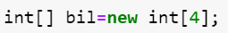
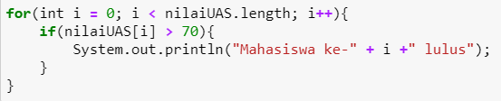
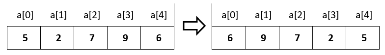

# JOBSHEET 10 - Array 1

## Tujuan
+ Mahasiswa mampu memahami pembuatan Array 1 dimensi dan pengaksesan elemenya di Java. 
+ Mahasiswa mampu membuat program dengan menggunakan konsep array satu dimensi.


## Alat dan Bahan
+ PC/laptop
+ Browser(chrome, firefox, safari)
+ Koneksi internet
+ Anaconda3 + Java kernel (opsional)

## Praktikum
### Percobaan 1: Mengisi Elemen Array
1. Pada percobaan ke-1 akan dilakukan percobaan untuk mengisi elemen array. Buat array bertipe integer dengan nama bil dengan kapasitas 4 elemen.



```Java
// Tulis Kode program Percobaan 1 Langkah 2 di atas
int [] bil = new int[4];
```

2. Isi masing-masing elemen array bil tadi dengan angka 5, 12, 7, 20.


```Java
// Tulis Kode program Percobaan 1 Langkah 3 di atas
bil[0] = 5;
bil[1] = 12;
bil[2] = 7;
bil[3] = 20;

```

3. Tampilkan ke layar semua isi elemennya:


```Java
// Tulis Kode program Percobaan 1 Langkah 4
for(int i = 0; i < 4; i++){
    System.out.println(bil[i]);
}

```

#### Pertanyaan 
1. Dari percobaan 1 berapakah indeks array terbesar dan terkecil?


```
indeks array terbesar adalah 3 indeks array terkecil adalah 0

```

2. Jika Isi masing-masing elemen array bil diubah dengan angka 5.0, 12867, 7.5, 2000000. Apa yang terjadi? Mengapa bisa demikian?


```
Akan terjadi error, karena tipe data pada array tersebut adalah Integer, sedangkan kita disuruh untuk menginputkan bilangan desimal dalam variabel bertipe data Integer yang mana integer hanya akan menerima bilangan bulat.

```

3. Ubah statement pada langkah No 3 menjadi seperti berikut

Apa keluaran dari program? Mengapa bisa demikian?


```
outputnya tetap sama, karena menggunakan for loop untuk mencetak value dari array di setiap indeks yang mana hal ini sama saja dengan menulis System.out.println sebanyak panjangnya array untuk mencetak value dari array tersebut di setiap indeks

```

### Percobaan 2: Meminta Inputan Pengguna untuk Mengisi Elemen Array
1. Pada percobaan ke-2 akan dilakukan percobaan yang meminta inputan pengguna untuk mengisi elemen array seperti pada flowchart berikut


```Java
// Tulis Kode program Percobaan 2 Langkah 1 di atas

```

2. Import dan deklarasikan Scanner untuk keperluan input. 


```Java
import java.util.Scanner;
Scanner in = new Scanner(System.in);
```

3. Buat array bertipe integer dengan nama nilaiUAS, dengan kapasitas 6 elemen.


```Java
int nilaiUas [] = new int [6];

```

4. Menggunakan perulangan, buat input untuk mengisi elemen dari array nilaiUAS.


```Java
// Tulis Kode program Percobaan 2 Langkah 4 di atas
for(int i = 0; i <nilaiUas.length; i++){
    System.out.print("Masukkan nilai UAS ke-" + i +": ");
    nilaiUas [i] = in.nextInt();
}

```
```
Masukkan nilai UAS ke-0: 60
Masukkan nilai UAS ke-1: 60
Masukkan nilai UAS ke-2: 60
Masukkan nilai UAS ke-3: 60
Masukkan nilai UAS ke-4: 90
Masukkan nilai UAS ke-5: 60
```

5. Menggunakan perulangan, tampilkan semua isi elemen dari array nilaiUAS.


```Java
// Tulis Kode program Percobaan 2 Langkah 5 di atas
for(int i = 0; i < nilaiUas.length;i++){
    if(nilaiUas[i] > 70){
        System.out.println("Mahasiswa ke-" + i + " lulus");
    }
}
```
```
Mahasiswa ke-4 lulus
```

#### Pertanyaan
1. Ubah statement pada langkah No 4 menjadi seperti berikut ini :

Jalankan program, apakah terjadi perubahan? Mengapa demikian?


```
tidak terjadi perubahan pada output. Karena pada dasarnya metode length itu digunakan untuk mengetahui panjang dari array yang dalam hal ini panjangnya adalah 6. Sebelum kita rubah kondisinya yaitu "i<6" itu memiliki nilai yang sama dengan "i<nilaiUas.length" Oleh karena itu menghasilkan output yang sama.
```

2. Apa kegunaan dari `nilaiUAS.length`? 


```
Untuk mengetahui panjang dari array nilaiUas

```

3. Ubah statement pada langkah No 5 menjadi seperti berikut ini sehingga program hanya menampilkan status mahasiswa yang lulus saja:

Jalankan program dan Jelaskan alur program!


```
ketika user telah menginputkan value ke setiap indeks array. setiap dari value itu akan di periksa satu persatu dengan cara menggunakan for loop terlebih dahulu agar bisa menyeleksi setiap value di setiap indeksnya. Penyeleksian itu dilakukan ketika program berjalan sampai di kondisi if. Jika terdapat value yang nilanya lebih dari 70, maka mencetak "mahasiswa ke-i(indeks yang lolos seleksi) lulus". Jika tidak maka tidak mengeluarkan output apapun. Peristiwa ini diulang sebanyak panjangnya array yaitu 6;.
```

### Percobaan 3: Melakukan Operasi Aritmatika terhadap Elemen Array
Pada praktikum ini, akan dilakukan percobaan untuk menjumlahkan Array. Program akan menerima input sebanyak 10 nilai mahasiswa. Kemudian program akan menampilkan nilai rata-rata nilai dari 10 Mahasiswa. Seperti flowchart berikut


1.Import dan deklarasikan Scanner untuk keperluan input. 


```Java
// Tulis Kode program Percobaan 3 Langkah 1 di atas, disini
import java.util.Scanner;
Scanner in = new Scanner(System.in);
```

2. Buat array nilaiMHS bertipe integer dengan kapasitas 10. Kemudian deklarasikan variable total dan rata seperti gambar berikut ini


```Java
// Tulis Kode program Percobaan 3 Langkah 2 di atas, disini
int nilaiMhs[] = new int[10];
double total;
double rata;
```

3. Menggunakan perulangan, buat input untuk mengisi array nilaiMHS


```Java
// Tulis Kode program Percobaan 3 Langkah 3 di atas, disini
for(int i = 0; i<nilaiMhs.length; i++){
    System.out.print("Masukkan nilai Mahasiswa ke-"+ (i+1) + ":");
    nilaiMhs[i] = in.nextInt();
}
```

    Masukkan nilai Mahasiswa ke-1:60
    Masukkan nilai Mahasiswa ke-2:70
    Masukkan nilai Mahasiswa ke-3:80
    Masukkan nilai Mahasiswa ke-4:90
    Masukkan nilai Mahasiswa ke-5:60
    Masukkan nilai Mahasiswa ke-6:70
    Masukkan nilai Mahasiswa ke-7:50
    Masukkan nilai Mahasiswa ke-8:90
    Masukkan nilai Mahasiswa ke-9:80
    Masukkan nilai Mahasiswa ke-10:100


4. Menggunakan perulangan untuk menghitung jumlah keseluruhan nilai.


```Java
// Tulis Kode program Percobaan 3 Langkah 4 di atas, disini
for(int i = 0; i<nilaiMhs.length; i++){
    total += nilaiMhs[i];
}
```

5. Kemudian hitung nilai rata-rata dengan cara nilai total dibagi jumlah elemen dari array nilaiMHS\


```Java
// Tulis Kode program Percobaan 3 Langkah 3 di atas, disini
rata=total/nilaiMhs.length;
System.out.println("Rata - rata nilai mahasiswa adalah " + rata);
```

    Rata - rata nilai mahasiswa adalah 75.0


#### Pertanyaan 
1. Pada Percobaan 3 langkah ke-5. Mengapa perhitungan rata berada diluar perulangan?


```
dilakukan di luar perulangan karena kebutuhan untuk menghitung rata - rata hanyalah satu kali dan hanya membutuh kan value final dari variabel total yaitu valuenya pada perulangan terakhir.
```

2. Modifikasi program pada percobaan 3 sehingga bisa mengeluarkan output  seperti gambar berikut ini!
syarat lulus nilai >70


```Java
Scanner in = new Scanner(System.in);
int nilaiMhs[] = new int[10];
double total=0;
int countTL=0;
double rata;
double totalLulus = 0;
double rataLulus;
int countLulus = 0;
for(int i = 0; i<nilaiMhs.length; i++){
    System.out.print("Masukkan nilai Mahasiswa ke-"+ (i+1) + ":");
    nilaiMhs[i] = in.nextInt();
    if(nilaiMhs[i]>70){
            totalLulus += nilaiMhs[i];
            countLulus++;
        }
    else{
        total += nilaiMhs[i];
        countTL++;
    }
}
rataLulus = totalLulus/countLulus;
System.out.println("Rata-rata nilai mahasiswa yang lulus adalah " + rataLulus);
rata = total/countTL;
System.out.println("Rata-rata nilai mahasiswa yang tidak lulus adalah " +rata);
```

```
### Percobaan 4: Pencarian menggunakan Array
Pada praktikum ini, akan dilakukan percobaan untuk mencari lokasi/indeks sebuah angka dalam array. Sesuai dengan flowchart di bawah ini:
 
```

1. Buat array arr[] bertipe integer dengan kapasitas 6 dan isi dengan nilai 6, 4, 1, 9, 7, 3, 2 dan 8. Kemudian deklarasikan variabel integer `key` untuk kata kunci pencarian dan variabel `hasil` untuk hasil indeks pencarian. Deklarasi dan inisialisasi seperti gambar berikut ini


```Java
// Tulis Kode program Percobaan 4 Langkah 1 di atas, disini
int [] arr = {6,4,1,9,7,3,2,8};
int key = 5;
int hasil = -1;
```

2. Menggunakan perulangan, lakukan pencarian untuk mendapatkan nilai array yang sesuai dengan key. Bila ada yang sesuai, simpan indeksnya sebagai hasil pencarian


```Java
// Tulis Kode program Percobaan 4 Langkah 2 di atas, disini
for(int i = 0; i<arr.length; i++){
    if(key == arr[i]){
        hasil = i;
        break;
    }
}
```

3. Tampilkan hasil pencarian dengan kode berikut.


```Java
// Tulis Kode program Percobaan 4 Langkah 3 di atas, disini
System.out.println("Key ada di array ke-" + hasil);
```

    Key ada di array ke--1


#### Pertanyaan 
1. Pada Percobaan 4 langkah ke-2. Apa kegunaan dari statement `break`?


```
break digunakan untuk menghentikan perulangan atau keluar dari perulangan ketika program sudah mencapai kondisi tertentu, pada kasus ini kondisi tertentu itu adalah ketika value dari key itu sama dengan value arr[] pada indeks tertentu.
```

2. Modifikasi program pada percobaan 4 sehingga key yang dicari adalah angka 5. Kemudian jalankan program, amati hasilnya! Jelaskan penyebab dari hasil tersebut! 


```
outputnya adalah "Key ada di array ke--1" hal ini terjadi karena variabel hasil sudah diinisialisasi terlebih dahulu dengan value -1. Ketika program tidak memenuhi kondisi sekalipun pada code if(key == arr[i]) maka value dari variabel hasil tidak akan mengalami perubahan yang berarti valuenya tetap -1. Oleh karena itu inputnya menjadi "Key ada di array ke--1".
```

### Percobaan 5: Pengurutan bilangan menggunakan Array
Pada praktikum ini, akan dilakukan percobaan untuk mengurutkan angka dalam array. Sesuai dengan flowchart di bawah ini:

1.Buat array arr[] bertipe integer dengan kapasitas 8 dan isi dengan nilai 16, 4, 10, 90, 27, 3, 12 dan 28. Kemudian deklarasikan variabel integer `temp` untuk media penukaran nilai pada variabel. Deklarasi dan inisialisasi seperti gambar berikut ini


```Java
// Tulis Kode program Percobaan 5 Langkah 1 disini
int[] arr = {16, 4, 10, 90, 27, 3, 12, 28};
int temp = 0;
```


2. Menggunakan perulangan, lakukan pengurutan bilangan dengan menukar posisi indeks tersebut dengan indeks berikutnya. Perulangan dilakukan untuk menukar posisi berulang kali. 


```Java
// Tulis Kode program Percobaan 5 Langkah 2 di atas, disini
for(int i = 0; i < arr.length; i++){
    for(int j = 1; j < (arr.length-i); j++){
        if(arr[j-1] > arr[j]){
            temp = arr[j-1];
            arr[j-1] = arr[j];
            arr[j] = temp;
        }
    }
}

```

3. Tampilkan hasil pengurutan dengan menggunakan perulangan


```Java
// Tulis Kode program Percobaan 5 Langkah 3 di atas, disini
System.out.println("Hasil pengurutan: ");
for(int i = 0; i < arr.length; i++){
    System.out.println(arr[i]);
}
```
    Hasil pengurutan: 
    3
    4
    10
    12
    16
    27
    28
    90

## Tugas
### Soal 1
Buatlah program yang **sesuai** dengan alur _flowchart_ di bawah ini


Flowchart diatas menggambarkan alur program yang membaca 10 masukan pengguna berupa integer dan menyimpannya. Kemudian angka ganjil dan genap disimpan kembali ke dalam variabel lain yang terpisah


```Java
/* Jawaban Soal 1 disini */
import java.util.Scanner;
Scanner in = new Scanner(System.in);
int checkNum[] = new int[10];
int evenNum[] = new int[10];
int oddNum[] = new int [10];
int cEven =0,cOdd = 0;
for(int i = 0;i<checkNum.length;i++){
    checkNum[i] = in.nextInt();
}
for(int j = 0;j<checkNum.length;j++){
    if(checkNum[j] %2 == 0){
        evenNum[cEven] = checkNum[j];
        cEven++;
    }
    else{
        oddNum[cOdd] = checkNum[j];
        cOdd++;
    }
    
}
System.out.println("anda menginputkan angka genap sebanyak " + cEven +" kali, yaitu : ");
for (int i = 0;i<cEven;i++){
    System.out.print(evenNum[i]+" ");
}
System.out.println("\nanda menginputkan angka ganjil sebanyak " + cOdd +" kali,yaitu : ");
for (int i = 0;i<cOdd;i++){
    System.out.print(oddNum[i]+" ");
}

```
    Masukkan angka : 1
    Masukkan angka : 2
    Masukkan angka : 3
    Masukkan angka : 4
    Masukkan angka : 5
    Masukkan angka : 6
    Masukkan angka : 7
    Masukkan angka : 8
    Masukkan angka : 9
    Masukkan angka : 99
    anda menginputkan angka genap sebanyak 4 kali, yaitu : 
    2 4 6 8 
    anda menginputkan angka ganjil sebanyak 6 kali,yaitu : 
    1 3 5 7 9 99 

Penjelasan:

membuat kode untuk menginisialisasi banyaknya kolom di setiap array. Lalu membuat kode loop berisi kode tempat user menginputkan value ke array di setiap indeksnya, setelah itu membuat loop lagi diluar loop sebelumnya yang berguna untuk menyelleksi setiap value, apakah value itu genap atau ganjil, jika genap maka ditampung di array evenNum[], jika ganjil maka ditampung di array oddNum[]. Terakhir untuk mencetaknya, membuat loop lagi dengan perulangan sebanyak berapa kali user menginputkan bilangan genap atau ganjil. Hal ini bisa diketahui karena kita juga membuat kode cEven++ dan cOdd++ di kondisi yang menyeleksi bilangan genap atau ganjil. Lalu print value dari variabel evenNum[] sebanyak cEven kali dan print value dari variabel oddNum[] sebanyak cOdd kali.


### Soal 2
Buatlah program yang terdapat array dengan jumlah elemen 5, buatlah input untuk mengisi elemen array tersebut, kemudian tampilkan isi array tersebut dengan urutan terbalik. Seperti ilustrasi gambar dibawah ini.



```Java
/* Jawaban Soal 2 disini */
int [] arr = new int[5];
arr[0] = 5;
arr[1] = 2;
arr[2] = 7;
arr[3] = 6;
arr[4] = 9;
System.out.println("array sebelum revers");
for(int i = 0; i<arr.length;i++){
    System.out.print(arr[i]+" ");
}
for(int i = 0; i <arr.length/2;i++){
    int temp = arr[i];
    arr[i]=arr[arr.length-i-1];
    arr[arr.length-i-1] = temp;
}
System.out.println("\narray setelah revers");
for(int i = 0; i<arr.length;i++){
    System.out.print(arr[i]+" ");
}
```
    array sebelum revers
    5 2 7 6 9
    array setelah revers
    9 6 7 2 5

Untuk membalikkan array, kita hanya perlu menukar angka pertama dengan terakhir lalu kedua dengan kedua terakhir dan seterusnya. Caranya adalah dengan amembuat perulangan sebanyak panjang suatu array dibagi dua, karena kita hanya menukar angka indeks pertama sampai indeks tengah yang mana itu adalah panjangnya array dibagi 2. Lalu membuat suatu variabel (bukan array) yang dapat menampung nilai dari suatu array, value dari array itu disimpan sementara  
agar value yang telah ditukar tidak ditukar kembali. Jadilah program seperti di atas.

### Soal 3
Buatlah program yang menerima input jumlah elemen array, inputkan isi arraynya, kemudian tampilkan bilangan terbesar dari isi elemen arraynya. Contoh hasil program:


```Java
/* Jawaban Soal 3 disini */
Scanner in = new Scanner(System.in);
System.out.print("Masukkan isi array: ");
int isi = in.nextInt();
int [] arr = new int[isi];
for(int i = 0; i< arr.length; i++){
    System.out.print("Masukkan elemen array ke-" + i + ": ");
    arr[i] = in.nextInt();
    for(int j = 1; j<(arr.length-i);j++){
        if(arr[j-1] > arr[j]){
            temp = arr[j-1];
            arr[j-1] = arr[j];
            arr[j] = temp;
        }
    }
    
}
System.out.print("Bilangan terbesar adalah " +arr[arr.length-1]);
```
    Masukkan isi array: 5
    Masukkan elemen array ke-0: 25
    Masukkan elemen array ke-1: 78
    Masukkan elemen array ke-2: 99
    Masukkan elemen array ke-3: 12
    Masukkan elemen array ke-4: 63
    Bilangan terbesar adalah 99

Untuk mencari bilangan yang terbesar dalam sebuah array, kita harus membuat program yang dapat mengurutkan value dari yang terkecil hingga terbesar, caranya adalah dengan menggunakan metode bubble sorting, yaitu memeriksa satu persatu value dari sebuah array, jika suatu value lebih besar nilainya daripada value di indeks berikutnya, maka value tersebut harus bertukar, hal ini dilakukan terus - menerus hingga semua value di setiap indeks urut dari yang terkecil di indeks awal hingga value terbesar di indeks akhir. Cara melakukannya dengan membuat nested loop , loop luar melakukan perulangan sebanyak panjangnya array lalu membuat loop dalam melakukan perulangan sebanyak panjangnya array dikurangi indeks i yang terus berjalan + 1 agar semua indeks dapat diperiksa. Kemudian  membuat program untuk mengetahui apakah suatu indeks lebih besar dari depannya, jika iya maka tukar. Hal ini dilakukan dengan membuat variabel baru untuk menampung nilai yang akan ditukar, agar setelah ditukar tidak ditukar kembali. Setelah berhasil mengurutkan nilai dari yang terkecil ke yang besar, maka kita hanya perlu mencetak value dari array di indeks terakhir yaitu panjang array - 1.