# JOBSHEET 10 - Array 1

## Tujuan
+ Mahasiswa mampu memahami pembuatan Array 1 dimensi dan pengaksesan elemenya di Java. 
+ Mahasiswa mampu membuat program dengan menggunakan konsep array satu dimensi.


## Alat dan Bahan
+ PC/laptop
+ Browser(chrome, firefox, safari)
+ Koneksi internet
+ Anaconda3 + Java kernel (opsional)

## Praktikum
### Percobaan 1: Mengisi Elemen Array
1. Pada percobaan ke-1 akan dilakukan percobaan untuk mengisi elemen array. Buat array bertipe integer dengan nama bil dengan kapasitas 4 elemen.
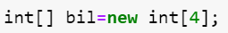


```Java
int[] bil = new int[4];

```

Membuat array dengan panjang 4

2. Isi masing-masing elemen array bil tadi dengan angka 5, 12, 7, 20.
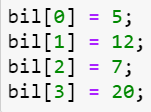


```Java
bil[0] = 5;
bil[1] = 12;
bil[2] = 7;
bil[3] = 20;
```


    20


Mengatur nilai dari tiap elemen

3. Tampilkan ke layar semua isi elemennya:
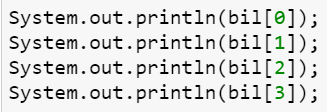


```Java
System.out.println(bil[0]);
System.out.println(bil[1]);
System.out.println(bil[2]);
System.out.println(bil[3]);

```

    5
    12
    7
    20
    

Menampilkan nilai dari tiap elemen

#### Pertanyaan 
1. Dari percobaan 1 berapakah indeks array terbesar dan terkecil?


```Java
Indeks terbesar : 3
Indeks terkecil : 0
    
Indeks nilai terbesar : 3
Indeks nilai terkecil : 0

```

2. Jika Isi masing-masing elemen array bil diubah dengan angka 5.0, 12867, 7.5, 2000000. Apa yang terjadi? Mengapa bisa demikian?

Akan muncul error

*incompatible types: possible lossy conversion from double to int*

Karena array ini bertipe data int, sedangkan nilai yang dimasukan ada yang bertipe data double


3. Ubah statement pada langkah No 3 menjadi seperti berikut

Apa keluaran dari program? Mengapa bisa demikian?


```Java
for(int i = 0; i < 4; i++) {
    System.out.println(bil[i]);
}
```

    5
    12
    7
    20
    

Outputnya sama seperti percobaan sebelumnya karena pada dasarnya sama yaitu menampilkan nilai variable bil berdasarkan indeksnya, dalam hal ini untuk mendapatkan indeks menggunakan perulangan for dari 0 sampai 3

### Percobaan 2: Meminta Inputan Pengguna untuk Mengisi Elemen Array
1. Pada percobaan ke-2 akan dilakukan percobaan yang meminta inputan pengguna untuk mengisi elemen array seperti pada flowchart berikut
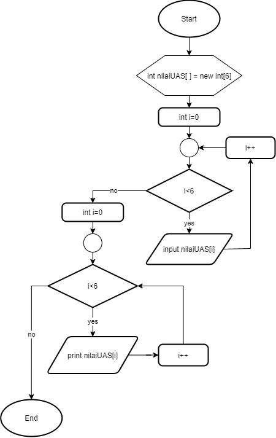


```Java
// Tulis Kode program Percobaan 2 Langkah 1 di atas

```

2. Import dan deklarasikan Scanner untuk keperluan input. 


```Java
import java.util.Scanner;

Scanner sc = new Scanner(System.in);
```

3. Buat array bertipe integer dengan nama nilaiUAS, dengan kapasitas 6 elemen.


```Java
int[] nilaiUAS = new int[6];
```

4. Menggunakan perulangan, buat input untuk mengisi elemen dari array nilaiUAS.


```Java
for(int i = 0; i < 6; i++) {
    System.out.print("Masukkan nilai UAS ke-"+ i +": ");
    nilaiUAS[i] = sc.nextInt();
}
```

    Masukkan nilai UAS ke-0: 1
    Masukkan nilai UAS ke-1: 4
    Masukkan nilai UAS ke-2: 12
    Masukkan nilai UAS ke-3: 0
    Masukkan nilai UAS ke-4: 41
    Masukkan nilai UAS ke-5: 32
    

5. Menggunakan perulangan, tampilkan semua isi elemen dari array nilaiUAS.


```Java
for(int i = 0; i < 6; i++) {
    System.out.println("Nilai UAS ke-" + i + " adalah: " + nilaiUAS[i]);
}
```

    Nilai UAS ke-0 adalah: 1
    Nilai UAS ke-1 adalah: 4
    Nilai UAS ke-2 adalah: 12
    Nilai UAS ke-3 adalah: 0
    Nilai UAS ke-4 adalah: 41
    Nilai UAS ke-5 adalah: 32
    

#### Pertanyaan
1. Ubah statement pada langkah No 4 menjadi seperti berikut ini :
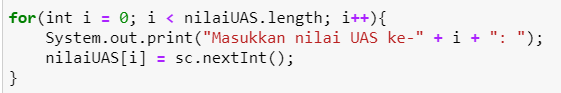
Jalankan program, apakah terjadi perubahan? Mengapa demikian?


```Java
for(int i = 0; i < nilaiUAS.length; i++) {
    System.out.print("Masukkan nilai UAS ke-"+ i +": ");
    nilaiUAS[i] = sc.nextInt();
}
```

    Masukkan nilai UAS ke-0: 90
    Masukkan nilai UAS ke-1: 55
    Masukkan nilai UAS ke-2: 88
    Masukkan nilai UAS ke-3: 68
    Masukkan nilai UAS ke-4: 65
    Masukkan nilai UAS ke-5: 95
    

Hasilnya akan tetap sama seperti langkah 4 karena nilai dari `nilaiUAS.length` adalah panjang dari array `nilaiUAS`. Oleh karena itu, jika menggunakan cara ini, saat kita mengubah panjang dari array pada deklarasinya, kita tidak perlu mengubah nilai yang ada pada kondisi perulangan `for`, karena nilai dari `.length` akan bersifat **dinamis** sesuai dengan panjang yang telah ditentukan sebelumnya.

2. Apa kegunaan dari `nilaiUAS.length`? 

`nilaiUAS.length` berfungsi untuk mendapatkan panjang dari array `nilaiUAS`

3. Ubah statement pada langkah No 5 menjadi seperti berikut ini sehingga program hanya menampilkan status mahasiswa yang lulus saja:

Jalankan program dan Jelaskan alur program!


```Java
for(int i = 0; i < nilaiUAS.length; i++) {
    if(nilaiUAS[i] > 70) {
        System.out.println("Mahasiswa ke-"+ i +" lulus");   
    }
}
```

    Mahasiswa ke-0 lulus
    Mahasiswa ke-2 lulus
    Mahasiswa ke-5 lulus
    

Program di atas akan menampilkan pesan Mahasiswa ke-n lulus jika nilai pada indeks n lebih dari 70.

For loop digunakan untuk melakukan iterasi sebanyak panjang array nilaiUAS. Dalam hal ini variable i digunakan untuk menentukan nilai n pada tiap iterasi.
Dalam loop tersebut, terdapat sebuah pernyataan if yang digunakan untuk mengecek nilai dari indeks ke i, jikai lebih dari 70, maka tampilkan pesan lulus

### Percobaan 3: Melakukan Operasi Aritmatika terhadap Elemen Array
Pada praktikum ini, akan dilakukan percobaan untuk menjumlahkan Array. Program akan menerima input sebanyak 10 nilai mahasiswa. Kemudian program akan menampilkan nilai rata-rata nilai dari 10 Mahasiswa. Seperti flowchart berikut


1.Import dan deklarasikan Scanner untuk keperluan input. 
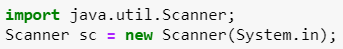


```Java
import java.util.Scanner;
Scanner sc = new Scanner(System.in);
```

2. Buat array nilaiMHS bertipe integer dengan kapasitas 10. Kemudian deklarasikan variable total dan rata seperti gambar berikut ini


```Java
int nilaiMHS[] = new int[10];
double total;
double rata;
```

3. Menggunakan perulangan, buat input untuk mengisi array nilaiMHS


```Java
for(int i = 0; i < nilaiMHS.length; i++) {
    System.out.print("Masukkan nilai Mahasiswa ke-" + (i + 1) + ": ");
    nilaiMHS[i] = sc.nextInt();
}
```

    Masukkan nilai Mahasiswa ke-1: 90
    Masukkan nilai Mahasiswa ke-2: 88
    Masukkan nilai Mahasiswa ke-3: 65
    Masukkan nilai Mahasiswa ke-4: 100
    Masukkan nilai Mahasiswa ke-5: 31
    Masukkan nilai Mahasiswa ke-6: 89
    Masukkan nilai Mahasiswa ke-7: 47
    Masukkan nilai Mahasiswa ke-8: 78
    Masukkan nilai Mahasiswa ke-9: 89
    Masukkan nilai Mahasiswa ke-10: 99
    

4. Menggunakan perulangan untuk menghitung jumlah keseluruhan nilai.


```Java
for(int i = 0; i < nilaiMHS.length; i++) {
    total += nilaiMHS[i];
}
```

5. Kemudian hitung nilai rata-rata dengan cara nilai total dibagi jumlah elemen dari array nilaiMHS\


```Java
rata = total/nilaiMHS.length;
System.out.println("Rata-rata nilai mahasiswa adalah " + rata);
```

    Rata-rata nilai mahasiswa adalah 77.6


#### Pertanyaan 
1. Pada Percobaan 3 langkah ke-5. Mengapa perhitungan rata berada diluar perulangan?

Perhitungan rata berada diluar perulangan karena perhitungan rata-rata harus menunggu semua nilai terkumpul, dan perhitungan ini hanya dilakukan sekali untuk menghitung hasil pembagial total nilai siswa dengan jumlah siswa


2. Modifikasi program pada percobaan 3 sehingga bisa mengeluarkan output  seperti gambar berikut ini!
syarat lulus nilai >70
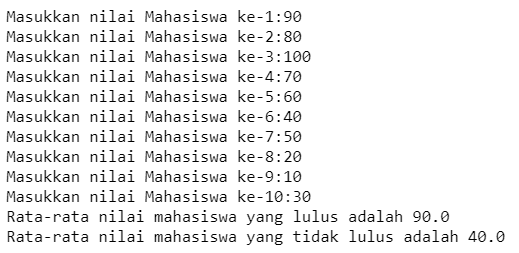


```Java
double totalLulus = 0;
int jumlahLulus = 0;
double totalTidakLulus = 0;
int jumlahTidakLulus = 0;

for(int i = 0; i < nilaiMHS.length; i++) {
    if(nilaiMHS[i] > 70) {
        totalLulus += nilaiMHS[i];
        jumlahLulus++;
    } else {
        totalTidakLulus += nilaiMHS[i];
        jumlahTidakLulus++;
    }
}

double rataLulus = totalLulus / jumlahLulus;
double rataTidakLulus = totalTidakLulus / jumlahTidakLulus;

System.out.println("Rata-rata nilai mahasiswa yang lulus adalah " + rataLulus);
System.out.println("Rata-rata nilai mahasiswa yang tidak lulus adalah " + rataTidakLulus);
```

    Rata-rata nilai mahasiswa yang lulus adalah 90.42857142857143
    Rata-rata nilai mahasiswa yang tidak lulus adalah 47.666666666666664
    

Penjelasan
1. membuat 4 variable baru untuk menyimpan total dari yang lulu dan tidak lulus, serta untuk menyimpan total dari mahasiswa yang lulus dan tidak lulus
2. melakukan perulangan untuk setiap nilai dan melakukan pengecekan, jikai nilai diatas 70, maka tambahkan totalLulus dengan nilai tersebut, dan lakukan operasi increment pada jumlahLulus, pada bagian else, lakukan operasi pada variable totalTidakLulus dan jumlahTidakLulus
3. jike semua sudah terhitung, lakukan perhitungan rata rata dengan membagi total nilai dengan jumlah nilai yang ada.
4. Tampilkan hasil dari perhitungan

### Percobaan 4: Pencarian menggunakan Array
Pada praktikum ini, akan dilakukan percobaan untuk mencari lokasi/indeks sebuah angka dalam array. Sesuai dengan flowchart di bawah ini:
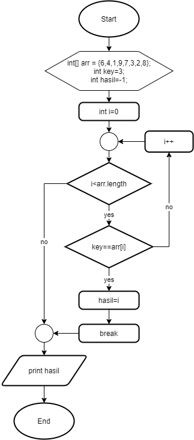 

1. Buat array arr[] bertipe integer dengan kapasitas 6 dan isi dengan nilai 6, 4, 1, 9, 7, 3, 2 dan 8. Kemudian deklarasikan variabel integer `key` untuk kata kunci pencarian dan variabel `hasil` untuk hasil indeks pencarian. Deklarasi dan inisialisasi seperti gambar berikut ini
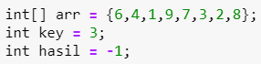


```Java
int[] arr = {6,4,1,9,7,3,2,8};
int key = 3;
int hasil = -1;
```

2. Menggunakan perulangan, lakukan pencarian untuk mendapatkan nilai array yang sesuai dengan key. Bila ada yang sesuai, simpan indeksnya sebagai hasil pencarian


```Java
for(int i = 0; i < arr.length; i++) {
    if(key == arr[i]) {
        hasil = i;
        break;
    }
}

```

3. Tampilkan hasil pencarian dengan kode berikut.
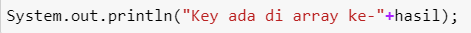


```Java
System.out.println("Key ada di array ke-" + hasil);
```

    Key ada di array ke-5


#### Pertanyaan 
1. Pada Percobaan 4 langkah ke-2. Apa kegunaan dari statement `break`?

Pernyataan break digunakan untuk menghentikan perulangan saat nilai yang dicari sudah ditemukan, sehingga tidak akan mengecek nilai lainya


2. Modifikasi program pada percobaan 4 sehingga key yang dicari adalah angka 5. Kemudian jalankan program, amati hasilnya! Jelaskan penyebab dari hasil tersebut! 


```Java
int[] arr = {6,4,1,9,7,3,2,8};
int key = 5;
int hasil = -1;

for(int i = 0; i < arr.length; i++) {
    if(key == arr[i]) {
        hasil = i;
        break;
    }
}

System.out.println("Key ada di array ke-" + hasil);
```

    Key ada di array ke--1


Hasilnya adalah -1 karena dalam array tersebut tidak ada nilai 5 sehingga kondisi `if(key == arr[i])` tidak pernah dijalankan dan variable `hasil` nilainya tidak pernah berubah, yaitu -1

### Percobaan 5: Pengurutan bilangan menggunakan Array
Pada praktikum ini, akan dilakukan percobaan untuk mengurutkan angka dalam array. Sesuai dengan flowchart di bawah ini:

1.Buat array arr[] bertipe integer dengan kapasitas 8 dan isi dengan nilai 16, 4, 10, 90, 27, 3, 12 dan 28. Kemudian deklarasikan variabel integer `temp` untuk media penukaran nilai pada variabel. Deklarasi dan inisialisasi seperti gambar berikut ini
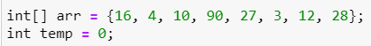


```Java
int[] arr = {16, 4, 10, 90, 27, 3, 12, 28};
int temp = 0;
```

2. Menggunakan perulangan, lakukan pengurutan bilangan dengan menukar posisi indeks tersebut dengan indeks berikutnya. Perulangan dilakukan untuk menukar posisi berulang kali. 
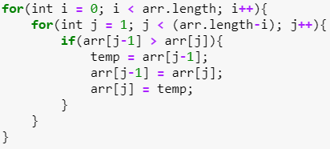


```Java
for(int i = 0; i < arr.length; i++){
    for(int j = 1; j < (arr.length-i); j++){
        if(arr[j-1] > arr[j]){
            temp = arr[j-1];
            arr[j-1] = arr[j];
            arr[j] = temp;
        }
    }
}

```

Penjelasan:
1. Lakukan perulangan awal sebanyak jumlah panjang array
2. Pada perulangan tersebut, lakukan lagi perulangan sebanyak jumlah array
3. lakukan pengecekan terhadap nilai pada elemen ke n dan n-1, jika variable n lebih kecil dari n-1, maka tukar posisinya


3. Tampilkan hasil pengurutan dengan menggunakan perulangan
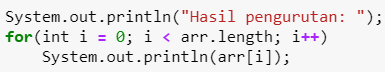


```Java
System.out.println("Hasil pengurutan: ");
for(int i = 0; i < arr.length; i++)
    System.out.println(arr[i]);
```

    Hasil pengurutan: 
    3
    4
    10
    12
    16
    27
    28
    90
    

## Tugas
### Soal 1
Buatlah program yang **sesuai** dengan alur _flowchart_ di bawah ini
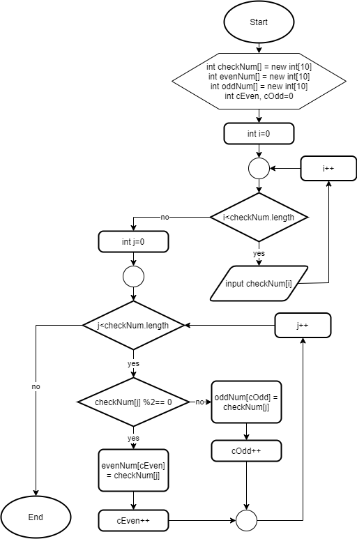

Flowchart diatas menggambarkan alur program yang membaca 10 masukan pengguna berupa integer dan menyimpannya. Kemudian angka ganjil dan genap disimpan kembali ke dalam variabel lain yang terpisah


```Java
import java.util.Scanner;

Scanner input = new Scanner(System.in);
    
int checkNum[] = new int[10];
int evenNum[] = new int[10];
int oddNum[] = new int[10];
int cEven = 0, cOdd = 0;

for(int i = 0; i < checkNum.length; i++) {
  System.out.printf("Masukkan nilai %d : ", i);
  checkNum[i] = input.nextInt();
}

for(int j = 0; j < checkNum.length; j++) {
  if(checkNum[j] % 2 == 0) {
    evenNum[cEven] = checkNum[j];
    cEven++;
  } else {
    oddNum[cOdd] = checkNum[j];
    cOdd++;
  }
}

System.out.println("\nNilai genap : ");
for(int k = 0; k < evenNum.length; k++) {
  if(evenNum[k] != 0) {
    System.out.printf("%d ", evenNum[k]);
  }
}

System.out.println("\nNilai ganjil : ");
for(int l = 0; l < oddNum.length; l++) {
  if(oddNum[l] != 0) {
    System.out.printf("%d ", oddNum[l]);
  }
}
```

    Masukkan nilai 0 : 8
    Masukkan nilai 1 : 38
    Masukkan nilai 2 : 13
    Masukkan nilai 3 : 99
    Masukkan nilai 4 : 945
    Masukkan nilai 5 : 193
    Masukkan nilai 6 : 1
    Masukkan nilai 7 : 29
    Masukkan nilai 8 : 34
    Masukkan nilai 9 : 45
    
    Nilai genap : 
    8 38 34 
    Nilai ganjil : 
    13 99 945 193 1 29 45 

Penjelasan:

1. Menggunakan looping untuk mendapatkan user input untuk mengisi setiap elemen pada array
2. melakukan looping untuk mencari bilangan yang ganjil dan genap, jika ganjil maka tambahkan nilai tersebut ke arrray oddNum dan laukan increment pada cOdd, begitu juga dengan yang even atau ganjil
3. Tampilkan setiap nilai dari array ganjil dan genap

### Soal 2
Buatlah program yang terdapat array dengan jumlah elemen 5, buatlah input untuk mengisi elemen array tersebut, kemudian tampilkan isi array tersebut dengan urutan terbalik. Seperti ilustrasi gambar dibawah ini.


```Java
import java.util.Scanner;

Scanner input = new Scanner(System.in);
    
int[] arr = new int[5];

for(int i = 0; i < arr.length; i++) {
  System.out.printf("Masukan nilai ke %d: ", i);
  arr[i] = input.nextInt();
}

System.out.println("\nNilai terbalik : ");
for(int i = arr.length - 1; i >= 0; i--) {
  System.out.printf("%d ", arr[i]);
}
```

    Masukan nilai ke 0: 1
    Masukan nilai ke 1: 2
    Masukan nilai ke 2: 3
    Masukan nilai ke 3: 4
    Masukan nilai ke 4: 5
    
    Nilai terbalik : 
    5 4 3 2 1 

Penjelasan:
1. Melakukan looping untuk mendapatkan user input
2. Melakukan looping secara terbalik dengan cara memberi nilai inisialisasi i = arr.length - 1, dan melakukan operasi decrement tiap iterasinya untuk menampilkan nilai dari array dari belakang

### Soal 3
Buatlah program yang menerima input jumlah elemen array, inputkan isi arraynya, kemudian tampilkan bilangan terbesar dari isi elemen arraynya. Contoh hasil program:


```Java
import java.util.Scanner;

Scanner input = new Scanner(System.in);

System.out.print("Masukan isi array: ");
int[] arr = new int[input.nextInt()];

int terbesar = 0;

for(int i = 0; i < arr.length; i++) {
  System.out.printf("Masukan elemen array ke-%d: ", i);
  arr[i] = input.nextInt();

  if(i == 0) {
    terbesar = arr[i];
  } else if(arr[i] > terbesar) {
      terbesar = arr[i];
  }
}

System.out.println("\nBilangan terbesar adalah " + terbesar);
```

    Masukan isi array: 5
    Masukan elemen array ke-0: 25
    Masukan elemen array ke-1: 78
    Masukan elemen array ke-2: 12
    Masukan elemen array ke-3: 63
    Masukan elemen array ke-4: 99
    
    Bilangan terbesar adalah 99
    

Penjelasan:

1. menggunakan scanner untuk mengambil user input yang akan digunakan untuk membuat array dengan panjang sesuai dengan yang diinput oleh user
2. melakukan perulangan dan melakukan pengecekan untuk menyimpan variable dengan nilai terbesar
3. pengecekan yang pertama dilakukan adalah apakah input adalah elemen pertama, jika iya maka atur nilai dari variable terbesar dengan nilai itu, jika tidak, dicek lagi, apakah input sekarang lebih besar dari variable terbesar, jika iya, maka ubah nilai dari variable terbesar dengan nilai input saat ini
