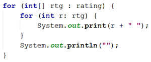

# JOBSHEET 11. ARRAY 2

## Tujuan
* Mahasiswa mampu memahami pembuatan array dua dimensi
* Mahasiswa mampu menyelesaikan studi kasus dengan memanfaatkan array dua dimensi

## Alat dan Bahan
* PC/Laptop
* Browser
* Koneksi internet
* Anaconda3 + Java kernel (opsional)

## Praktikum

### Percobaan 1: Deklarasi, Inisialisasi, dan Menampilkan Array 2 Dimensi
Pada Percobaan 1, kode program yang dibuat digunakan untuk menyimpan nilai praktikum dari 2 orang mahasiswa pada 3 mata kuliah yang berbeda.
1.	Buat array bertipe **integer** dengan nama **nilai** dengan kapasitas baris 2 elemen (menyatakan jumlah mahasiswa) dan kolom 3 elemen (menyatakan jumlah mata kuliah)


```Java
// Tuliskan kode program Percobaan 1 Langkah 1
int [][] nilai = new int [2][3];
```

2. Isi masing-masing elemen array **nilai** sebagai berikut:


```Java
// Tuliskan kode program Percobaan 1 Langkah 2
nilai [0][0] = 75;
nilai [0][1] = 90;
nilai [0][2] = 88;
nilai [1][0] = 79;
nilai [1][1] = 82;
nilai [1][2] = 67;
```


    67


3. Tampilkan semua isi elemen array **nilai**


```Java
// Tuliskan kode program Percobaan 1 Langkah 2
System.out.println(nilai[0][0] + " " + nilai [0][1] + " " + nilai [0][2]);
System.out.println(nilai[1][0] + " " + nilai [1][1] + " " + nilai [1][2]);
```

    75 90 88
    79 82 67


#### Pertanyaan
1. Apakah pengisian elemen array harus dilakukan secara berurutan mulai dari indeks 0? Jelaskan!


tidak, karena elemen dari array bisa dikosongi atau tidak diberi value


2. Lakukan modifikasi pada Percobaan 1 Langkah 3 untuk menampilkan semua isi elemen array **nilai** menggunakan perulangan *for*


```Java
for(int i = 0; i< nilai.length; i++){
    for (int j = 0; j <nilai[0].length;j++){
        System.out.print(nilai[i][j]+ " ");
    }
    System.out.println("");
}
```
    75 90 88 
    79 82 67 

### Percobaan 2: Mengisi Elemen Array 2 Dimensi Menggunakan Input Keyboard
Pada Percobaan 2, kode program yang dibuat digunakan untuk menyimpan nilai rating restoran yang terdaftar pada aplikasi pemesanan makanan online. Rating diberikan oleh 4 orang pengguna kepada 2 restoran yang terdaftar.
1. Import dan deklarasikan Scanner dengan nama **sc**


```Java
// Tuliskan kode program Percobaan 2 Langkah 1
import java.util.Scanner;
Scanner in = new Scanner (System.in);
```

2.	Buat array bertipe **integer** dengan nama **rating** dengan kapasitas baris 4 elemen (menyatakan jumlah pengguna) dan kolom 2 elemen (menyatakan jumlah restoran)


```Java
int [][] rating = new int [4][2];
```

3. Dengan menggunakan perulangan *for*, buat input untuk mengisi elemen array **rating**


```Java
// Tuliskan kode program Percobaan 2 Langkah 3
for (int i = 0 ; i< rating.length; i++){
    for(int j = 0; j < rating[0].length; j++){
        System.out.print("Masukkan rating pengguna " + i + "untuk restoran " + j + " : ");
        rating [i][j] = in.nextInt();
    }
    System.out.println(" ");
}
```

    Masukkan rating pengguna 0untuk restoran 0 : 3
    Masukkan rating pengguna 0untuk restoran 1 : 1
 
    Masukkan rating pengguna 1untuk restoran 0 : 2
    Masukkan rating pengguna 1untuk restoran 1 : 5
 
    Masukkan rating pengguna 2untuk restoran 0 : 3
    Masukkan rating pengguna 2untuk restoran 1 : 4
 
    Masukkan rating pengguna 3untuk restoran 0 : 5
    Masukkan rating pengguna 3untuk restoran 1 : 5
     


4. Dengan menggunakan perulangan *for-each*, tampilkan semua isi elemen dari array **rating**



```Java
// Tuliskan kode program Percobaan 2 Langkah 4
for (int [] rtg : rating){
    for(int r : rtg){
        System.out.print(r + " ");
    }
    System.out.println("");
}
```

    3 1 
    2 5 
    3 4 
    5 5 
    


#### Pertanyaan
1. Pada Percobaan 2 Langkah 3, dapatkah posisi i ditukar dengan posisi j? Jelaskan alasannya!


tidak bisa, kareana penempatan variabel tersebut mempengaruhi baris dan kolom, jika dijalankan maka akan terjadi error. Namun hal ini menjadi bisa jika pada array tersebut memiliki jumlah baris dan kolom yang sama 
```Java
// Tuliskan jawaban nomor 1
for (int i = 0 ; i< rating.length; i++){
    for(int j = 0; j < rating[0].length; j++){
        System.out.print("Masukkan rating pengguna " + j + "untuk restoran " + i + " : ");
        rating [j][i] = in.nextInt();
    }
    System.out.println(" ");
}
```
    Masukkan rating pengguna 0untuk restoran 0 : 2
    Masukkan rating pengguna 1untuk restoran 0 : 3
    Masukkan rating pengguna 2untuk restoran 0 : Exception in thread "main" java.lang.ArrayIndexOutOfBoundsException: Index 2 out of bounds for length 2


2. Tambahkan kode program untuk menentukan banyaknya baris dan kolom elemen array secara dinamis (baris dan kolom ditentukan saat program berjalan melalui input keyboard)!

```java
System.out.println("Masukkan baris array");
int baris = in.nextInt();
System.out.println("Masukkan kolom array");
int kolom = in.nextInt();
int [][] rating = new int [baris][kolom];
```
    Masukkan baris array
    2
    Masukkan kolom array
    5


### Percobaan 3: Melakukan Operasi Aritmatika pada Elemen Array 2 Dimensi
Pada Percobaan 3, kode program yang dibuat digunakan untuk menghitung nilai rata-rata harga setiap bahan pokok selama 1 semester. Terdapat 3 bahan pokok yang dicatat harganya setiap akhir bulan. Program dibuat berdasarkan flowchart berikut.

1. Import dan deklarasikan Scanner dengan nama **sc**


```Java
// Tuliskan kode program Percobaan 3 Langkah 1
import java.util.Scanner;
Scanner in = new Scanner (System.in);
```

2.	Buat array bertipe **integer** dengan nama **harga** dengan kapasitas baris 3 elemen (menyatakan jumlah bahan pokok) dan kolom 6 elemen (menyatakan jumlah bulan). Deklarasikan juga variabel **total** dan **rata** bertipe **double**


```Java
// Tuliskan kode program Percobaan 3 Langkah 2
int [][] harga = new int [3][6];
double total, rata;
```

3. Dengan menggunakan perulangan *for*, buat input untuk mengisi elemen array **harga**. Kemudian, perhitungan total harga dilakukan untuk setiap bulan (kolom) pada setiap bahan pokok (baris). Setelah itu, nilai rata-rata dihitung untuk setiap bahan pokok (tiap satu baris) dan ditampilkan


```Java
// Tuliskan kode program Percobaan 3 Langkah 3
for(int i = 0; i < harga.length;i++){
    total = 0;
    rata = 0;
    for(int j = 0; j < harga[0].length; j++){
        System.out.printf("Masukkan harga [%d]{%d}: ",i,j);
        harga [i][j] = in.nextInt();
        total += harga [i][j];
    }
    rata = total / harga[0].length;
    System.out.printf("Rata - rata harga bahan ke -%d adalah %.2f\n",i,rata);
}
```

    Masukkan harga [0]{0}: 5000
    Masukkan harga [0]{1}: 6000
    Masukkan harga [0]{2}: 3000
    Masukkan harga [0]{3}: 40000
    Masukkan harga [0]{4}: 8000
    Masukkan harga [0]{5}: 9000
    Rata - rata harga bahan ke -0 adalah 11833.33
    Masukkan harga [1]{0}: 1000
    Masukkan harga [1]{1}: 2000
    Masukkan harga [1]{2}: 3000
    Masukkan harga [1]{3}: 4000
    Masukkan harga [1]{4}: 5000
    Masukkan harga [1]{5}: 6000
    Rata - rata harga bahan ke -1 adalah 3500.00
    Masukkan harga [2]{0}: 1000
    Masukkan harga [2]{1}: 2000
    Masukkan harga [2]{2}: 4000
    Masukkan harga [2]{3}: 5000
    Masukkan harga [2]{4}: 7000
    Masukkan harga [2]{5}: 8000
    Rata - rata harga bahan ke -2 adalah 4500.00


#### Pertanyaan
1. Jelaskan fungsi dari **rata = total / harga[0].length**!

fungsi dari kode tersebut adalah untuk menghitung rata - rata yang didapatkan dari penghitungan setiap value array pada baris tertentu, value yang telah dijumlah akan ditampung pada variabel total, lalu dibagi dengan banyak kolom pada baris tersebut dengan menggunakan kode harga[0].length.

2. Mengapa insialisasi variabel **total = 0** dan **rata = 0** berada di dalam perulangan *for* yang pertama? Menurut Anda, apa yang terjadi jika inisialisasi kedua variabel tersebut diletakkan di luar perulangan *for* (setelah deklarasi array)?

karena setelah kita mendapatkan total dan rata - rata dari value - value pada suatu baris, kita harus mengosongi value dari variabel total dan rata agar jumlah setiap value di baris berikutnya bisa terhitung dimulai dari 0. Begitu juga dengan value di variabel rata, harus diisi dengan value 0 agar rata - rata dapat terhitung dari 0.

Jika inisialisasi dilakukan di luar perulangan, maka hanya baris pertamalah yang akan mendapatkan value rata dan total yang benar. Karena pada baris selanjutnya penghitungan value total akan dimulai dari value total yang didapatkan dari baris sebelumnya, begitu juga dengan avg.

## Tugas

1. Perhatikan flowchart berikut.

Buat kode program sesuai dengan flowchart tersebut untuk mencari suhu tertinggi yang dicatat dari 5 kota di Jepang selama 7 hari berturut-turut!


```Java
// Tuliskan jawaban nomor 1
Scanner in = new Scanner(System.in);
double suhu [][] = new double [5][7];
double max = 0;
int kota = 0;
for(int x = 0; x<suhu.length;x++){
    for(int y = 0;y<suhu[0].length;y++){
        System.out.print("suhu di kota " + (x+1) + " pada hari ke " + (y+1) + " adalah ");
        suhu[x][y] = in.nextInt();
        if(suhu[x][y] > max){
            max = suhu[x][y];
        }
    }
}
System.out.println("suhu tertinggi dari 5 kota di Jepang selama 7 hari adalah " + max + " derajat celcius");
```
    suhu di kota 1 pada hari ke 1 adalah 20
    suhu di kota 1 pada hari ke 2 adalah 21
    suhu di kota 1 pada hari ke 3 adalah 23
    suhu di kota 1 pada hari ke 4 adalah 24
    suhu di kota 1 pada hari ke 5 adalah 25
    suhu di kota 1 pada hari ke 6 adalah 26
    suhu di kota 1 pada hari ke 7 adalah 28
    suhu di kota 2 pada hari ke 1 adalah 29
    suhu di kota 2 pada hari ke 2 adalah 34
    suhu di kota 2 pada hari ke 3 adalah 36
    suhu di kota 2 pada hari ke 4 adalah 17
    suhu di kota 2 pada hari ke 5 adalah 16
    suhu di kota 2 pada hari ke 6 adalah 18
    suhu di kota 2 pada hari ke 7 adalah 19
    suhu di kota 3 pada hari ke 1 adalah 42
    suhu di kota 3 pada hari ke 2 adalah 23
    suhu di kota 3 pada hari ke 3 adalah 25
    suhu di kota 3 pada hari ke 4 adalah 26
    suhu di kota 3 pada hari ke 5 adalah 27
    suhu di kota 3 pada hari ke 6 adalah 28
    suhu di kota 3 pada hari ke 7 adalah 29
    suhu di kota 4 pada hari ke 1 adalah 16
    suhu di kota 4 pada hari ke 2 adalah 13
    suhu di kota 4 pada hari ke 3 adalah 18
    suhu di kota 4 pada hari ke 4 adalah 5
    suhu di kota 4 pada hari ke 5 adalah 11
    suhu di kota 4 pada hari ke 6 adalah 13
    suhu di kota 4 pada hari ke 7 adalah 12
    suhu di kota 5 pada hari ke 1 adalah 42
    suhu di kota 5 pada hari ke 2 adalah 43
    suhu di kota 5 pada hari ke 3 adalah 44
    suhu di kota 5 pada hari ke 4 adalah 45
    suhu di kota 5 pada hari ke 5 adalah 44
    suhu di kota 5 pada hari ke 6 adalah 43
    suhu di kota 5 pada hari ke 7 adalah 42
    suhu tertinggi dari 5 kota di Jepang selama 7 hari adalah 45.0 derajat celcius

Penjelasan

pada flowchart tersebut, kita diperintah untuk membuat program yang dapat menghitung nilai terbesar dari array 2 dimensi. Cara membuatnya adalah dengan membuat array 2 dimensi yang valuenya akan diinputkan user ketika program berjalan. Hal yang perlu ditambahkan untuk menentukan value dengan nilai yang terbesar adalah kita harus membuat suatu variabel bertipe data int, tujuannya adalah untuk menampung nilai yang terbesar. variabel tersebut harus diinisialisasi dengan nilai 0 terlebih dahulu di luar loop. Setelah itu kita membuat kondisi didalam innerloop. Jika terdapat value array yang bernilai lebih besar dari 0 ( yaitu value dari variabel max), maka value dari variabel tersebut akan diganti oleh value pada array tersebut. Karena valuenya sudah terganti dan terus berulang sampai tidak ada value lagi dalam array tersebut yang nilainya lebih besar dari value pada variabel max. Maka kita sudah mendapatkan value dengan nilai terbesar pada array tersebut. Value tersebut ditampung di variabel max lalu dicetak. 

2. Terdapat hasil pencatatan data lima mahasiswa yang berisi informasi mengenai umur, berat badan (kg), dan tinggi badan (cm). Data tersebut disimpan ke dalam array dua dimensi.

*Keterangan: penyimpanan nilai dapat dilakukan melalui inisialisasi menggunakan operator assignment*
 * Tampilkan *berat badan terendah* di antara kelima mahasiswa tersebut
 * Tampilkan *rata-rata tinggi badan* dari kelima mahasiswa tersebut
 * Tampilkan nama mahasiswa dengan *umur tertua* di antara kelima mahasiswa tersebut


```Java
// Tuliskan jawaban nomor 2
int [][] mahasiswa = {{19,51,155},{18,55,163},{18,45,153},{20,46,158},{19,58,160}};
String [] studName = {"Desi","Rofan","Lala","Beky","Ega"};
String oldestMurid = "";
int smallestBB = 1000;
int oldestStud = 0;
int totalTB = 0;
double avg = 0;
for(int i = 0 ; i <mahasiswa.length;i++){
    for(int j = 1 ; j<mahasiswa[0].length-1; j++){
        if(mahasiswa[i][j] < smallestBB){
            smallestBB = mahasiswa[i][j];
        }
    }
    for (int l = 2; l<mahasiswa[0].length;l++){
        totalTB += mahasiswa[i][l];
    }
    for (int k = 0;k<mahasiswa[0].length-2;k++){
        if (mahasiswa[i][k]> oldestStud){
            oldestStud = mahasiswa[i][k];
            oldestMurid = studName[i];
        }
    }
}
avg = totalBB/mahasiswa.length;
System.out.println("berat badan terendah pada kelima mahasiswa tersebut adalah " + smallestBB + "kg");
System.out.println("rata - rata berat badan mahasiswa tersebut adalah " + avg);
System.out.println("Mahasiswa tertua dari kelima mahasiswa tersebut adalah " + oldestMurid + " yaitu berumur " + oldestStud);
```
    berat badan terendah pada kelima mahasiswa tersebut adalah 45kg
    rata - rata berat badan mahasiswa tersebut adalah 157.0
    Mahasiswa tertua dari kelima mahasiswa tersebut adalah Beky yaitu berumur 20


Penjelasan

1. Untuk mengetahui berat badan pada mahasiswa tersebut, dibutuhkan membuat array 2 dimensi terlebih dahulu untuk menampung seluruh value kedalam tabel dan membuat variabel untuk menampung berat badan terendah yang diinisialisasi dengan angka 1000(karena berat badan manusia mustahil mencapai 1000kg). Kemudian kita harus mencari tahu, di kolom berapakah value berat badan tersebut berada dalam tabel, ternyata berat badan berada di kolom ke 1(karena penghitungan dimulai dari 0).Lalu membuat program perulangan yang dapat memeriksa semua baris yaitu for(int i = 0 ; i <mahasiswa.length ; i++). Kemudian membuat perulangan di dalam perulangan tersebut yang dimulai dari 1 dengan kondisi j<mahasiswa[0].length - 1, karena kita hanya ingin memeriksa kolom berat badan di setiap baris yaitu kolom 1. Setelah itu setiap kolom kemudian diperiksa, apakah value pada kolom tersebut kurang dari seribu(value dari variabel penampung bb terkecil(smallestBB)), jika iya maka value pada variabel smallestBB akan diganti oleh value pada array tersebut. Ketika sudah tidak ada value yang lebih kecil dari value smallestBB, maka variabel smallestBB sudah menampung value terkecil dari array tersebut.
2. Untuk menghitung rata - rata, berarti kita hanya perlu menjumlahkan semua kolom yang menampung value tinggi badan. Dalam hal ini kita tahu bahwa value tersebut terletak pada kolom terakhir di setiap baris. Untuk membuat programnya, kita harus menginisialisasi variabel totalTB untuk menampung seluruh jumlah tinggi badan mahasiswa dan variabel avg untuk menghitung rata ratanya. setelah itu kita membuat inner loop untuk mengulangi pemeriksaan pada kolom terakhir saja yaitu for (int l = 2; l<mahasiswa[0].length;l++). dengan begitu kita bisa hanya mendapatkan value pada kolom terakhir saja lalu menampungnya di dalam variabel total, penampungan ini dilakukan dengan cara menambah setiap value pada kolom tersebut pada setiap baris. Jika sudah mendapatkan total tinggi badan semua mahasiswa, maka rata -rata bisa dicari dengan cara membagi value totalTB dengan banyaknya baris(setiap satu baris melambangkan 1 mahasiswa). Rata -rata tersebut ditampung di variabel avg.
3. Untuk mengetahui siapakah murid tertua, kita harus membuat satu array 1 dimensi yang berisi nama dari setiap mahasiswa tersebut, pengisiannya harus urut dengan data yang telah dibuat diawal. Contoh baris 1 adalah data rudi, maka nama rudi harus diisi terlebih dahulu pada array 1 dimensi tersebut begitu juga seterusnya. Jika sudah, maka kita membuat variabel string untuk menampung nama murid tertua, dan variabel int untuk menampung umur murid tertua. Jika sudah, kita membuat inner loop yang hanya memeriksa kolom berisi data umur. Dalam hal ini kolom ke 0 maka bentuk loopnya seperti ini for (int k = 0;k<mahasiswa[0].length-2;k++). Setelah itu, kita membuat kondisi di dalam loop itu, jika value dari kolom tersebut lebih besar dari value variabel oldestStud(variabel penampung umur tertua). Maka value dari variabel tersebut akan diganti dengan value dari array tersebut. Jika sudah tidak ada value yang lebih besar di array tersebut, maka variabel oldestStud sudah menampung nilai terbesar atau umur tertua. Untuk mengetahui siapakah mahasiswa tertuanya adalah dengan menambahkan kode oldestMurid = studName[i]; di dalam kondisi if. Karena variabel i menampung letak baris pada array 2 dimensi tersebut, maka variabel i juga menampung letak baris pada array 1 dimensi yang berisi nama - nama mahsiswa tersebut. Sedangkan sebelum itu sudah diseleksi posisi data yang memiliki value umur terbesar, maka posisi nama mahasiswa tertua pada array 1 dimensi tersebut dapat diketahui, lalu nama tersebut ditampung oleh variabel oldestMurid. 