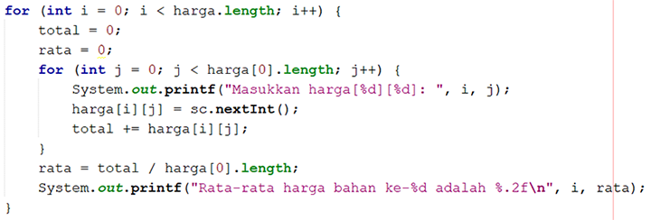

# JOBSHEET 11. ARRAY 2

## Tujuan
* Mahasiswa mampu memahami pembuatan array dua dimensi
* Mahasiswa mampu menyelesaikan studi kasus dengan memanfaatkan array dua dimensi

## Alat dan Bahan
* PC/Laptop
* Browser
* Koneksi internet
* Anaconda3 + Java kernel (opsional)

## Praktikum

### Percobaan 1: Deklarasi, Inisialisasi, dan Menampilkan Array 2 Dimensi
Pada Percobaan 1, kode program yang dibuat digunakan untuk menyimpan nilai praktikum dari 2 orang mahasiswa pada 3 mata kuliah yang berbeda.
1.	Buat array bertipe **integer** dengan nama **nilai** dengan kapasitas baris 2 elemen (menyatakan jumlah mahasiswa) dan kolom 3 elemen (menyatakan jumlah mata kuliah)


```Java
// Tuliskan kode program Percobaan 1 Langkah 1
int [] [] nilai = new int[2] [3];

```

2. Isi masing-masing elemen array **nilai** sebagai berikut:


```Java
// Tuliskan kode program Percobaan 1 Langkah 2
nilai [0] [0] = 75;
nilai [0] [1] = 90;
nilai [0] [2] = 88;
nilai [1] [0] = 79;
nilai [1] [1] = 82;
nilai [1] [2] = 67;

```


    67


3. Tampilkan semua isi elemen array **nilai**


```Java
// Tuliskan kode program Percobaan 1 Langkah 2
System.out.println (nilai[0] [0] + " " + nilai[0] [1] + " " + nilai[0] [2]);
System.out.println (nilai[1] [0] + " " + nilai[1] [1] + " " + nilai[1] [2]);

```

    75 90 88
    79 82 67


#### Pertanyaan
1. Apakah pengisian elemen array harus dilakukan secara berurutan mulai dari indeks 0? Jelaskan!

// Tuliskan jawaban nomor 1
Tidak juga dikarenakan yang penting itu adalah penginputannaya benar

2. Lakukan modifikasi pada Percobaan 1 Langkah 3 untuk menampilkan semua isi elemen array **nilai** menggunakan perulangan *for*


```Java
// Tuliskan jawaban nomor 2
for(int i = 0; i < nilai.length; i++) {
    for(int j = 0; j < nilai[0].length; j++) {
        System.out.printf("nilai[%d][%d] = %d\n", i, j, nilai[i][j]);
    }   
```

### Percobaan 2: Mengisi Elemen Array 2 Dimensi Menggunakan Input Keyboard
Pada Percobaan 2, kode program yang dibuat digunakan untuk menyimpan nilai rating restoran yang terdaftar pada aplikasi pemesanan makanan online. Rating diberikan oleh 4 orang pengguna kepada 2 restoran yang terdaftar.
1. Import dan deklarasikan Scanner dengan nama **sc**


```Java
// Tuliskan kode program Percobaan 2 Langkah 1
import java.util.Scanner;
Scanner sc = new Scanner(System.in);

```

2.	Buat array bertipe **integer** dengan nama **rating** dengan kapasitas baris 4 elemen (menyatakan jumlah pengguna) dan kolom 2 elemen (menyatakan jumlah restoran)


```Java
// Tuliskan kode program Percobaan 2 Langkah 2
int[] [] rating = new int[4] [2];

```

3. Dengan menggunakan perulangan *for*, buat input untuk mengisi elemen array **rating**


```Java
// Tuliskan kode program Percobaan 2 Langkah 3
for (int i = 0; i < rating.length; i++) {
    for (int j = 0; j < rating[0].length; j++) {
        System.out.print("Masukkan rating pengguna " + i + " untuk restoran " + j + " : ");
    }
    System.out.println("");
}
```

    Masukkan rating pengguna 0 untuk restoran 0 : Masukkan rating pengguna 0 untuk restoran 1 : 
    Masukkan rating pengguna 1 untuk restoran 0 : Masukkan rating pengguna 1 untuk restoran 1 : 
    Masukkan rating pengguna 2 untuk restoran 0 : Masukkan rating pengguna 2 untuk restoran 1 : 
    Masukkan rating pengguna 3 untuk restoran 0 : Masukkan rating pengguna 3 untuk restoran 1 : 


4. Dengan menggunakan perulangan *for-each*, tampilkan semua isi elemen dari array **rating**


```Java
// Tuliskan kode program Percobaan 2 Langkah 4
for (int[] rtg : rating){
    for (int r : rtg) {
        System.out.print(r + " ");
    }
    System.out.println("");
}

```

    0 0 
    0 0 
    0 0 
    0 0 


#### Pertanyaan
1. Pada Percobaan 2 Langkah 3, dapatkah posisi i ditukar dengan posisi j? Jelaskan alasannya!

// Tuliskan jawaban nomor 1
Tidak bisa karena kedua posisi atau kolom tersebut akan tertukar bisa mengakibatkan error program 

2. Tambahkan kode program untuk menentukan banyaknya baris dan kolom elemen array secara dinamis (baris dan kolom ditentukan saat program berjalan melalui input keyboard)!


```Java
// Tuliskan jawaban nomor 2
import java.util.Scanner;

Scanner sc = new Scanner(System.in);

System.out.print("Masukkan jumlah pengguna: ");
int jPenggunaan= sc.nextInt();
System.out.print("Masukkan jumlah restoran: ");
int jRestoran= sc.nextInt();

int[][] rating = new int[jPenggunaan][jRestoran];

for(int i = 0; i < rating.length; i++) {
    for(int j = 0; j < rating[0].length; j++) {
        System.out.print("Masukkan rating pengguna " + i + " untuk restoran " + j + " : ");
        rating[i][j] = sc.nextInt();
    }
    
    System.out.println("");
}
```

### Percobaan 3: Melakukan Operasi Aritmatika pada Elemen Array 2 Dimensi
Pada Percobaan 3, kode program yang dibuat digunakan untuk menghitung nilai rata-rata harga setiap bahan pokok selama 1 semester. Terdapat 3 bahan pokok yang dicatat harganya setiap akhir bulan. Program dibuat berdasarkan flowchart berikut.

1. Import dan deklarasikan Scanner dengan nama **sc**


```Java
// Tuliskan kode program Percobaan 3 Langkah 1
import java.util.Scanner;
Scanner sc = new Scanner (System.in)
```

2.	Buat array bertipe **integer** dengan nama **harga** dengan kapasitas baris 3 elemen (menyatakan jumlah bahan pokok) dan kolom 6 elemen (menyatakan jumlah bulan). Deklarasikan juga variabel **total** dan **rata** bertipe **double**


```Java
// Tuliskan kode program Percobaan 3 Langkah 2
int[] [] harga = new int[3] [6];
double total, rata;
```

3. Dengan menggunakan perulangan *for*, buat input untuk mengisi elemen array **harga**. Kemudian, perhitungan total harga dilakukan untuk setiap bulan (kolom) pada setiap bahan pokok (baris). Setelah itu, nilai rata-rata dihitung untuk setiap bahan pokok (tiap satu baris) dan ditampilkan



```Java
// Tuliskan kode program Percobaan 3 Langkah 3
for (int i = 0; i < harga.length; i++) {
    total = 0;
    rata = 0;
    for (int j = 0; j < harga[0].length; j++) {
        System.out.printf("Masukkan harga[%d] [%d]: ", i, j);
        harga[i] [j] = sc.nextInt();
        total += harga[i] [j];
    }
    rata = total / harga[0].length;
    System.out.printf("Rata-rata harga bahan ke-%d adalah %.2f\n", i, rata);
}

```

    Masukkan harga[0] [0]: 10000
    Masukkan harga[0] [1]: 20000
    Masukkan harga[0] [2]: 30000
    Masukkan harga[0] [3]: 40000
    Masukkan harga[0] [4]: 50000
    Masukkan harga[0] [5]: 60000
    Rata-rata harga bahan ke-0 adalah 35000.00
    Masukkan harga[1] [0]: 

#### Pertanyaan
1. Jelaskan fungsi dari **rata = total / harga[0].length**!

// Tuliskan jawaban nomor 1
Mencari rata rata dari pembagian panjangnya dari kolom harga

2. Mengapa insialisasi variabel **total = 0** dan **rata = 0** berada di dalam perulangan *for* yang pertama? Menurut Anda, apa yang terjadi jika inisialisasi kedua variabel tersebut diletakkan di luar perulangan *for* (setelah deklarasi array)?


```Java
// Tuliskan jawaban nomor 2
Adanya variabel yg belum dideklarasikan karena diletakkan diluar perulangan 
```

## Tugas

1. Perhatikan flowchart berikut.

Buat kode program sesuai dengan flowchart tersebut untuk mencari suhu tertinggi yang dicatat dari 5 kota di Jepang selama 7 hari berturut-turut!


```Java
// Tuliskan jawaban nomor 1
mport java.util.Scanner;

public class suhu {
    public static void main(String[] args) {
        Scanner sc = new Scanner(System.in);

        double suhu[][] = new double[5][7];
        double maximal = 0;

        for(int x=0;x<suhu.length;x++) {
            for(int y=0;y<suhu[0].length;y++){
                System.out.print("Masukkan suhu kota ke-"+ x +" hari ke- "+y+": ");
                suhu[x][y]= sc.nextDouble();
                if(suhu[x][y]>maximal){
                    maximal=suhu[x][y];
                }

            }
            System.out.println(" ");
        }

        System.out.println("Suhu tertinggi adalah "+maximal+ " derajat");
    }
}
```

2. Terdapat hasil pencatatan data lima mahasiswa yang berisi informasi mengenai umur, berat badan (kg), dan tinggi badan (cm). Data tersebut disimpan ke dalam array dua dimensi.

*Keterangan: penyimpanan nilai dapat dilakukan melalui inisialisasi menggunakan operator assignment*
 * Tampilkan *berat badan terendah* di antara kelima mahasiswa tersebut
 * Tampilkan *rata-rata tinggi badan* dari kelima mahasiswa tersebut
 * Tampilkan nama mahasiswa dengan *umur tertua* di antara kelima mahasiswa tersebut


```Java
// Tuliskan jawaban nomor 2
public class array2 {
    public static void main(String[] args) {
        int sebuahdata[][] = {{19, 51, 155},
                       {18, 55, 163},
                       {18, 45, 153},
                       {20, 46, 158},
                       {19, 58, 160}};
        int umur = 0, beratbadan = 0, tinggibadan = 0;

        for(int i = 0; i < sebuahdata.length; i++){
            int temp = 0;
            for(int j = 1; j < (sebuahdata.length-i); j++){
                if(sebuahdata[j-1][1] > sebuahdata[j][1]){
                    temp = sebuahdata[j-1][1];
                    sebuahdata[j-1][1] = sebuahdata[j][1];
                    sebuahdata[j][1] = temp;
                }
            }
        }
        System.out.println("Berat badan terendah dari kelima mahasiswa tersebut ialah " + sebuahdata[0][1]);
        int totalTinggi = 0;
        double rata = 0;
        for(int i = 0; i < sebuahdata.length; i++){
            totalTinggi += sebuahdata[i][2];
        }
        rata = (double)totalTinggi / sebuahdata.length;
        System.out.println("Rata-rata tinggi badan kelima mahasiswa tersebut adalah " + rata);

        String nama[] = {"Desi", "Rofan", "Lala", "Beky", "Ega"};
        int max = 0;
        int temperatur = 0;
        for(int i = 0; i < sebuahdata.length; i++){
            if(sebuahdata[i][0] > max){
                max = sebuahdata[i][0];
                temperatur = i;
            }
        }
        System.out.println("Mahasiswa dengan umur tertua adalah " + nama[temperatur]);
    }
}

```


```Java

```
