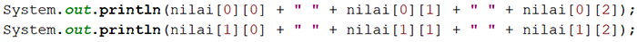

# JOBSHEET 11. ARRAY 2

## Tujuan
* Mahasiswa mampu memahami pembuatan array dua dimensi
* Mahasiswa mampu menyelesaikan studi kasus dengan memanfaatkan array dua dimensi

## Alat dan Bahan
* PC/Laptop
* Browser
* Koneksi internet
* Anaconda3 + Java kernel (opsional)

## Praktikum

### Percobaan 1: Deklarasi, Inisialisasi, dan Menampilkan Array 2 Dimensi
Pada Percobaan 1, kode program yang dibuat digunakan untuk menyimpan nilai praktikum dari 2 orang mahasiswa pada 3 mata kuliah yang berbeda.
1.	Buat array bertipe **integer** dengan nama **nilai** dengan kapasitas baris 2 elemen (menyatakan jumlah mahasiswa) dan kolom 3 elemen (menyatakan jumlah mata kuliah)


```Java
int nilai [][] = new int[2][3];
```

2. Isi masing-masing elemen array **nilai** sebagai berikut:


```Java
nilai[0][0] = 75;
nilai[0][1] = 90;
nilai[0][2] = 88;
nilai[1][0] = 79;
nilai[1][1] = 82;
nilai[1][2] = 67;
```


    67


3. Tampilkan semua isi elemen array **nilai**



```Java
System.out.println(nilai[0][0] + " " + nilai[0][1] + " " + nilai[0][2]);
System.out.println(nilai[1][0] + " " + nilai[1][1] + " " + nilai[1][2]);
```

    75 90 88
    79 82 67


#### Pertanyaan
1. Apakah pengisian elemen array harus dilakukan secara berurutan mulai dari indeks 0? Jelaskan!

Jawab :

Iya harus, karena jika indeks tidak dari 0 maka program akan eror.

2. Lakukan modifikasi pada Percobaan 1 Langkah 3 untuk menampilkan semua isi elemen array **nilai** menggunakan perulangan *for*


```Java
for (int nli [] : nilai){
    for (int n : nli){
        System.out.print(n + " ");
    }
    System.out.println("");
}
```

    75 90 88 
    79 82 67 


### Percobaan 2: Mengisi Elemen Array 2 Dimensi Menggunakan Input Keyboard
Pada Percobaan 2, kode program yang dibuat digunakan untuk menyimpan nilai rating restoran yang terdaftar pada aplikasi pemesanan makanan online. Rating diberikan oleh 4 orang pengguna kepada 2 restoran yang terdaftar.
1. Import dan deklarasikan Scanner dengan nama **sc**


```Java
import java.util.Scanner;
Scanner sc = new Scanner(System.in);
```

2.	Buat array bertipe **integer** dengan nama **rating** dengan kapasitas baris 4 elemen (menyatakan jumlah pengguna) dan kolom 2 elemen (menyatakan jumlah restoran)


```Java
int rating [][] = new int[4][2];
```

3. Dengan menggunakan perulangan *for*, buat input untuk mengisi elemen array **rating**


```Java
for (int i = 0; i < rating.length; i++){
    for (int j = 0; j < rating[0].length; j++){
        System.out.print("Masukkan rating pengguna "+ i +" untuk restoran "+ i +" : ");
        rating[i][j] = sc.nextInt();
    }
    System.out.println("");
}
```

    Masukkan rating pengguna 0 untuk restoran 0 : 10
    Masukkan rating pengguna 0 untuk restoran 0 : 10
    Masukkan rating pengguna 0 untuk restoran 0 : 10
    Masukkan rating pengguna 0 untuk restoran 0 : 10
    
    Masukkan rating pengguna 1 untuk restoran 1 : 1
    Masukkan rating pengguna 1 untuk restoran 1 : 10
    Masukkan rating pengguna 1 untuk restoran 1 : 1
    Masukkan rating pengguna 1 untuk restoran 1 : 10
    


# 4. Dengan menggunakan perulangan *for-each*, tampilkan semua isi elemen dari array **rating**


```Java
for (int rtg [] : rating){
    for (int r : rtg){
        System.out.print(r + " ");
    }
    System.out.println("");
}
```

    10 10 10 10 
    1 10 1 10 


#### Pertanyaan
1. Pada Percobaan 2 Langkah 3, dapatkah posisi i ditukar dengan posisi j? Jelaskan alasannya!

Jawab :

Sebenarnya boleh boleh saja jika diubah apabila beberapa program diganti, namun jika beberapa program tidak diubah maka akan terjadi eror pad program.

2. Tambahkan kode program untuk menentukan banyaknya baris dan kolom elemen array secara dinamis (baris dan kolom ditentukan saat program berjalan melalui input keyboard)!


```Java
import java.util.Scanner;
Scanner haikal = new Scanner(System.in);

int klm, brs;
System.out.print("Masukkan banyak pengguna: ");
brs = haikal.nextInt();
System.out.print("Masukkan banyak restoran: ");
klm = haikal.nextInt();
System.out.println("");

int rating[][] = new int[brs][klm];

for (int i = 0; i < rating.length; i++){
    for (int j = 0; j < rating[0].length; j++){
        System.out.print("Masukkan rating dari pengguna " + (i+1) + " untuk penilaian restoran " + (j+1) + " : ");
        rating[i][j] = haikal.nextInt();
    }
    System.out.println("");
}
```

    Masukkan banyak pengguna: 2
    Masukkan banyak restoran: 2
    
    Masukkan rating dari pengguna 1 untuk penilaian restoran 1 : 8
    Masukkan rating dari pengguna 1 untuk penilaian restoran 2 : 8
    
    Masukkan rating dari pengguna 2 untuk penilaian restoran 1 : 8
    Masukkan rating dari pengguna 2 untuk penilaian restoran 2 : 8
    


## Percobaan 3: Melakukan Operasi Aritmatika pada Elemen Array 2 Dimensi
Pada Percobaan 3, kode program yang dibuat digunakan untuk menghitung nilai rata-rata harga setiap bahan pokok selama 1 semester. Terdapat 3 bahan pokok yang dicatat harganya setiap akhir bulan. Program dibuat berdasarkan flowchart berikut.

1. Import dan deklarasikan Scanner dengan nama **sc**


```Java
import java.util.Scanner;
Scanner sc = new Scanner(System.in);
```

2.	Buat array bertipe **integer** dengan nama **harga** dengan kapasitas baris 3 elemen (menyatakan jumlah bahan pokok) dan kolom 6 elemen (menyatakan jumlah bulan). Deklarasikan juga variabel **total** dan **rata** bertipe **double**


```Java
int harga [][] = new int [3][6];
double total, rata;
```

3. Dengan menggunakan perulangan *for*, buat input untuk mengisi elemen array **harga**. Kemudian, perhitungan total harga dilakukan untuk setiap bulan (kolom) pada setiap bahan pokok (baris). Setelah itu, nilai rata-rata dihitung untuk setiap bahan pokok (tiap satu baris) dan ditampilkan


```Java
for (int i = 0; i < harga.length; i++){
    total = 0;
    
    for (int j = 0; j < harga[0].length; j++){
        System.out.printf("Masukkan harga[%d][%d]: ", i, j);
        harga[i][j] = sc.nextInt();
        total += harga [i][j];
    }
    rata = 0;
    rata = total / harga[0].length;
    System.out.printf("Rata-rata harga bahan ke-%d adalah %.2f\n", i, rata);
}
```

    Masukkan harga[0][0]: 10
    Masukkan harga[0][1]: 20
    Masukkan harga[0][2]: 20
    Masukkan harga[0][3]: 20
    Masukkan harga[0][4]: 20
    Masukkan harga[0][5]: 20
    Rata-rata harga bahan ke-0 adalah 18.33
    Masukkan harga[1][0]: 10
    Masukkan harga[1][1]: 10
    Masukkan harga[1][2]: 10
    Masukkan harga[1][3]: 10
    Masukkan harga[1][4]: 10
    Masukkan harga[1][5]: 10
    Rata-rata harga bahan ke-1 adalah 10.00
    Masukkan harga[2][0]: 10
    Masukkan harga[2][1]: 10
    Masukkan harga[2][2]: 10
    Masukkan harga[2][3]: 10
    Masukkan harga[2][4]: 10
    Masukkan harga[2][5]: 10
    Rata-rata harga bahan ke-2 adalah 10.00


#### Pertanyaan
1. Jelaskan fungsi dari **rata = total / harga[0].length**!

Jawab :

Fungsinya yaitu untuk menghitung rumus rata dengan membagi variable total dengan jumlah indeks kolom dari array harga

2. Mengapa insialisasi variabel **total = 0** dan **rata = 0** berada di dalam perulangan *for* yang pertama? Menurut Anda, apa yang terjadi jika inisialisasi kedua variabel tersebut diletakkan di luar perulangan *for* (setelah deklarasi array)?

Jawab : 

Karena dalam perulangan tersebut terdapat operasi yang melibatkan variable total namu tidak dengan variable rata, menurut saya jika kedua variabel tersebut diletakkan setelah perulangan for maka akan terjadi eror pada perulangan nya karena dalam perulangan dibutuhkan inisialisasi variabel total = 0 namun jika hanya rata = 0 saja yang keluar maka tidak masalah 

## Tugas

1. Perhatikan flowchart berikut.

Buat kode program sesuai dengan flowchart tersebut untuk mencari suhu tertinggi yang dicatat dari 5 kota di Jepang selama 7 hari berturut-turut!


```Java
import java.util.Scanner;
Scanner haikal = new Scanner(System.in);
double suhu [][] = new double [5][7];
int x, y;
double max = 0 ;

for (int x = 0; x < suhu.length; x++){
    for (int y = 0; y < suhu[0].length; y++){
        System.out.printf("Masukkan suhu hari ke-[%d] di kota [%d]: ", (y+1), (x+1));
        suhu[x][y] = haikal.nextInt();
        if (suhu[x][y] > max){
            max = suhu[x][y];
        } else {}
    }
    System.out.printf("Suhu maksimum kota ke-%d adalah %.2f\n", (x+1), max);
}
```

    Masukkan suhu hari ke-[1] di kota [1]: 12
    Masukkan suhu hari ke-[2] di kota [1]: 12
    Masukkan suhu hari ke-[3] di kota [1]: 13
    Masukkan suhu hari ke-[4] di kota [1]: 12
    Masukkan suhu hari ke-[5] di kota [1]: 12
    Masukkan suhu hari ke-[6] di kota [1]: 12
    Masukkan suhu hari ke-[7] di kota [1]: 12
    Suhu maksimum kota ke-1 adalah 13.00
    Masukkan suhu hari ke-[1] di kota [2]: 12
    Masukkan suhu hari ke-[2] di kota [2]: 123
    Masukkan suhu hari ke-[3] di kota [2]: 12
    Masukkan suhu hari ke-[4] di kota [2]: 12
    Masukkan suhu hari ke-[5] di kota [2]: 12
    Masukkan suhu hari ke-[6] di kota [2]: 12
    Masukkan suhu hari ke-[7] di kota [2]: 12
    Suhu maksimum kota ke-2 adalah 123.00
    Masukkan suhu hari ke-[1] di kota [3]: 12
    Masukkan suhu hari ke-[2] di kota [3]: 12
    Masukkan suhu hari ke-[3] di kota [3]: 
    12
    Masukkan suhu hari ke-[4] di kota [3]: 14
    Masukkan suhu hari ke-[5] di kota [3]: 13
    Masukkan suhu hari ke-[6] di kota [3]: 13
    Masukkan suhu hari ke-[7] di kota [3]: 13
    Suhu maksimum kota ke-3 adalah 123.00
    Masukkan suhu hari ke-[1] di kota [4]: 11
    Masukkan suhu hari ke-[2] di kota [4]: 11
    Masukkan suhu hari ke-[3] di kota [4]: 11
    Masukkan suhu hari ke-[4] di kota [4]: 11
    Masukkan suhu hari ke-[5] di kota [4]: 12
    Masukkan suhu hari ke-[6] di kota [4]: 11
    Masukkan suhu hari ke-[7] di kota [4]: 12
    Suhu maksimum kota ke-4 adalah 123.00
    Masukkan suhu hari ke-[1] di kota [5]: 11
    Masukkan suhu hari ke-[2] di kota [5]: 11
    Masukkan suhu hari ke-[3] di kota [5]: 15
    Masukkan suhu hari ke-[4] di kota [5]: 12
    Masukkan suhu hari ke-[5] di kota [5]: 13
    Masukkan suhu hari ke-[6] di kota [5]: 14
    Masukkan suhu hari ke-[7] di kota [5]: 12
    Suhu maksimum kota ke-5 adalah 123.00


#### 2. Terdapat hasil pencatatan data lima mahasiswa yang berisi informasi mengenai umur, berat badan (kg), dan tinggi badan (cm). Data tersebut disimpan ke dalam array dua dimensi.

*Keterangan: penyimpanan nilai dapat dilakukan melalui inisialisasi menggunakan operator assignment*
 * Tampilkan *berat badan terendah* di antara kelima mahasiswa tersebut
 * Tampilkan *rata-rata tinggi badan* dari kelima mahasiswa tersebut
 * Tampilkan nama mahasiswa dengan *umur tertua* di antara kelima mahasiswa tersebut


```Java
int data[][] = {
    {19, 51, 155},
    {18, 55, 163},
    {18, 45, 153},
    {20, 46, 158},
    {19, 58, 160}
};
String ms[] = {"Desi", "Rofan", "Lala", "Beky", "Ega"};
String nama_tua = "";
int tua = 0;
int ringan = data[0][1];
double tb = 0;
double ratatb;

for(int x = 0; x < data.length; x++){
    if(data[x][1] < ringan){
        ringan = data[x][1];
    }
    if(data[x][0] > tua){
        tua = data[x][0];
        nama_tua = ms[x];
    }
    tb += data[x][2];
}

ratatb = tb/data.length;
System.out.println("Mahasiswa dengan berat badan ringan diantara 5 mahasiswa adalah : "+ ringan);

System.out.println("Tinggi rata rata yang dimiliki 5 mahasiswa adalah \t\t: "+ ratatb);

System.out.println("Dari 5 mahasiswa, nama mahasiswa dengan umur tertua yaitu\t: "+ nama_tua);
```

    Mahasiswa dengan berat badan ringan diantara 5 mahasiswa adalah : 45
    Tinggi rata rata yang dimiliki 5 mahasiswa adalah 		: 157.8
    Dari 5 mahasiswa, nama mahasiswa dengan umur tertua yaitu	: Beky


```Java

```
