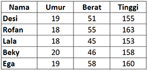

# JOBSHEET 11. ARRAY 2

## Tujuan
* Mahasiswa mampu memahami pembuatan array dua dimensi
* Mahasiswa mampu menyelesaikan studi kasus dengan memanfaatkan array dua dimensi

## Alat dan Bahan
* PC/Laptop
* Browser
* Koneksi internet
* Anaconda3 + Java kernel (opsional)

## Praktikum

### Percobaan 1: Deklarasi, Inisialisasi, dan Menampilkan Array 2 Dimensi
Pada Percobaan 1, kode program yang dibuat digunakan untuk menyimpan nilai praktikum dari 2 orang mahasiswa pada 3 mata kuliah yang berbeda.
1.	Buat array bertipe **integer** dengan nama **nilai** dengan kapasitas baris 2 elemen (menyatakan jumlah mahasiswa) dan kolom 3 elemen (menyatakan jumlah mata kuliah)


```Java
// Tuliskan kode program Percobaan 1 Langkah 1
int[][] nilai = new int[2][3];
```

2. Isi masing-masing elemen array **nilai** sebagai berikut:


```Java
// Tuliskan kode program Percobaan 1 Langkah 2
nilai[0][0] = 75;
nilai[0][1] = 90;
nilai[0][2] = 88;
nilai[1][0] = 79;
nilai[1][1] = 82;
nilai[1][2] = 67;
```


    67


3. Tampilkan semua isi elemen array **nilai**


```Java
// Tuliskan kode program Percobaan 1 Langkah 2
System.out.println(nilai[0][0] + " " + nilai[0][1] + " " + nilai[0][2]);
System.out.println(nilai[1][0] + " " + nilai[0][1] + " " + nilai[0][2]);
```

    75 90 88
    79 90 88
    

#### Pertanyaan
1. Apakah pengisian elemen array harus dilakukan secara berurutan mulai dari indeks 0? Jelaskan!

- Karena array dimulai dari indeks 0 bukan 1

2. Lakukan modifikasi pada Percobaan 1 Langkah 3 untuk menampilkan semua isi elemen array **nilai** menggunakan perulangan *for*


```Java
// Tuliskan jawaban nomor 2
for(int i=0; i<nilai.length; i++){
    for(int j=0; j<nilai[0].length; j++){
        System.out.print(nilai[i][j] + " ");
    }
    System.out.println("");
}
```

    75 90 88 
    79 82 67 
    

### Percobaan 2: Mengisi Elemen Array 2 Dimensi Menggunakan Input Keyboard
Pada Percobaan 2, kode program yang dibuat digunakan untuk menyimpan nilai rating restoran yang terdaftar pada aplikasi pemesanan makanan online. Rating diberikan oleh 4 orang pengguna kepada 2 restoran yang terdaftar.
1. Import dan deklarasikan Scanner dengan nama **sc**


```Java
// Tuliskan kode program Percobaan 2 Langkah 1
import java.util.Scanner;
Scanner scan = new Scanner(System.in);
```

2.	Buat array bertipe **integer** dengan nama **rating** dengan kapasitas baris 4 elemen (menyatakan jumlah pengguna) dan kolom 2 elemen (menyatakan jumlah restoran)


```Java
// Tuliskan kode program Percobaan 2 Langkah 2
int[][] rating = new int[4][2];
```

3. Dengan menggunakan perulangan *for*, buat input untuk mengisi elemen array **rating**


```Java
// Tuliskan kode program Percobaan 2 Langkah 3
for(int i=0; i<rating.length; i++){
    for(int j=0; j<rating[0].length; j++){
        System.out.print("Masukkan rating pengguna " + i + " untuk restoran " + j + " : ");
        rating[i][j] = scan.nextInt();
    }
    System.out.println("");
}
```

    Masukkan rating pengguna 0 untuk restoran 0 : 50
    Masukkan rating pengguna 0 untuk restoran 1 : 70
    
    Masukkan rating pengguna 1 untuk restoran 0 : 40
    Masukkan rating pengguna 1 untuk restoran 1 : 70
    
    Masukkan rating pengguna 2 untuk restoran 0 : 40
    Masukkan rating pengguna 2 untuk restoran 1 : 50
    
    Masukkan rating pengguna 3 untuk restoran 0 : 90
    Masukkan rating pengguna 3 untuk restoran 1 : 80
    
    

4. Dengan menggunakan perulangan *for-each*, tampilkan semua isi elemen dari array **rating**


```Java
// Tuliskan kode program Percobaan 2 Langkah 4
for(int[] rtg : rating){
    for(int r : rtg){
        System.out.print(r + " ");
    }
    System.out.println("");
}
```

    50 70 
    40 70 
    40 50 
    90 80 
    

#### Pertanyaan
1. Pada Percobaan 2 Langkah 3, dapatkah posisi i ditukar dengan posisi j? Jelaskan alasannya!

- Bisa saja ditukar, namun urutannya akan dimulai dengan mengisi sesuai urutan baris terlebih dahulu bukan kolom dahulu

2. Tambahkan kode program untuk menentukan banyaknya baris dan kolom elemen array secara dinamis (baris dan kolom ditentukan saat program berjalan melalui input keyboard)!


```Java
// Tuliskan jawaban nomor 2
import java.util.Scanner;

Scanner scan = new Scanner(System.in);
int baris, kolom;
System.out.print("Masukkan baris yang anda inginkan : ");
baris = scan.nextInt();
System.out.print("Masukkan kolom yang anda inginkan : ");
kolom = scan.nextInt();

int[][] rating = new int[baris][kolom];

for(int i=0; i<rating.length; i++){
    for(int j=0; j<rating[0].length; j++){
        System.out.print("Masukkan rating pengguna " + i + " untuk restoran " + j + " : ");
        rating[i][j] = scan.nextInt();
    }
    System.out.println("");
}

for(int[] rtg : rating){
    for(int r : rtg){
        System.out.print(r + " ");
    }
    System.out.println("");
}

```

    Masukkan baris yang anda inginkan : 3
    Masukkan kolom yang anda inginkan : 4
    Masukkan rating pengguna 0 untuk restoran 0 : 1
    Masukkan rating pengguna 0 untuk restoran 1 : 2
    Masukkan rating pengguna 0 untuk restoran 2 : 3
    Masukkan rating pengguna 0 untuk restoran 3 : 4
    
    Masukkan rating pengguna 1 untuk restoran 0 : 1
    Masukkan rating pengguna 1 untuk restoran 1 : 2
    Masukkan rating pengguna 1 untuk restoran 2 : 3
    Masukkan rating pengguna 1 untuk restoran 3 : 4
    
    Masukkan rating pengguna 2 untuk restoran 0 : 1
    Masukkan rating pengguna 2 untuk restoran 1 : 2
    Masukkan rating pengguna 2 untuk restoran 2 : 3
    Masukkan rating pengguna 2 untuk restoran 3 : 4
    
    1 2 3 4 
    1 2 3 4 
    1 2 3 4 
    

### Percobaan 3: Melakukan Operasi Aritmatika pada Elemen Array 2 Dimensi
Pada Percobaan 3, kode program yang dibuat digunakan untuk menghitung nilai rata-rata harga setiap bahan pokok selama 1 semester. Terdapat 3 bahan pokok yang dicatat harganya setiap akhir bulan. Program dibuat berdasarkan flowchart berikut.

1. Import dan deklarasikan Scanner dengan nama **sc**


```Java
// Tuliskan kode program Percobaan 3 Langkah 1
import java.util.Scanner;
Scanner scan = new Scanner(System.in);
```

2.	Buat array bertipe **integer** dengan nama **harga** dengan kapasitas baris 3 elemen (menyatakan jumlah bahan pokok) dan kolom 6 elemen (menyatakan jumlah bulan). Deklarasikan juga variabel **total** dan **rata** bertipe **double**


```Java
// Tuliskan kode program Percobaan 3 Langkah 2
int[][] harga = new int[3][6];
double total, rata;
```

3. Dengan menggunakan perulangan *for*, buat input untuk mengisi elemen array **harga**. Kemudian, perhitungan total harga dilakukan untuk setiap bulan (kolom) pada setiap bahan pokok (baris). Setelah itu, nilai rata-rata dihitung untuk setiap bahan pokok (tiap satu baris) dan ditampilkan


```Java
// Tuliskan kode program Percobaan 3 Langkah 3
for (int i=0; i<harga.length; i++){
    total = 0;
    rata = 0;
    for(int j=0; j<harga[0].length; j++){
        System.out.printf("Masukkan harga[%d][%d] : ", i, j);
        harga[i][j] = scan.nextInt();
        total += harga[i][j];
    }
    rata = total / harga[0].length;
    System.out.printf("Rata-rata harga bahan ke-%d adalah %.2f\n", i, rata);
}
```

    Masukkan harga[0][0] : 80
    Masukkan harga[0][1] : 80
    Masukkan harga[0][2] : 80
    Masukkan harga[0][3] : 80
    Masukkan harga[0][4] : 80
    Masukkan harga[0][5] : 80
    Rata-rata harga bahan ke-0 adalah 80.00
    Masukkan harga[1][0] : 50
    Masukkan harga[1][1] : 50
    Masukkan harga[1][2] : 50
    Masukkan harga[1][3] : 50
    Masukkan harga[1][4] : 50
    Masukkan harga[1][5] : 50
    Rata-rata harga bahan ke-1 adalah 50.00
    Masukkan harga[2][0] : 40
    Masukkan harga[2][1] : 40
    Masukkan harga[2][2] : 40
    Masukkan harga[2][3] : 40
    Masukkan harga[2][4] : 40
    Masukkan harga[2][5] : 40
    Rata-rata harga bahan ke-2 adalah 40.00
    

#### Pertanyaan
1. Jelaskan fungsi dari **rata = total / harga[0].length**!

- Untuk menghitung rata-rata dari hasil pembagian total dan panjang kolom dari array harga

2. Mengapa insialisasi variabel **total = 0** dan **rata = 0** berada di dalam perulangan *for* yang pertama? Menurut Anda, apa yang terjadi jika inisialisasi kedua variabel tersebut diletakkan di luar perulangan *for* (setelah deklarasi array)?

- Karena jika ditaruh di luar perulangan maka untuk total dan rata-rata dari baris sebelumnya akan ikut terhitung dan tidak dimulai dari 0 lagi

## Tugas

1. Perhatikan flowchart berikut.

Buat kode program sesuai dengan flowchart tersebut untuk mencari suhu tertinggi yang dicatat dari 5 kota di Jepang selama 7 hari berturut-turut!


```Java
import java.util.Scanner;
Scanner scan = new Scanner(System.in);

double[][] suhu = new double[5][7];
double max = 0;

for(int x=0; x<suhu.length; x++){
    for(int y=0; y<suhu[0].length; y++){
        System.out.printf("Masukkan Suhu pada Kota ke-%d : ",(x+1));
        suhu[x][y] = scan.nextInt();
        if(suhu[x][y] > max){
            max = suhu[x][y];
        }
    }
    System.out.printf("Suhu maksimal kota ke-%d adalah :%.2f \n", (x+1), max);
}
```

    Masukkan Suhu pada Kota ke-1 : 80
    Masukkan Suhu pada Kota ke-1 : 80
    Masukkan Suhu pada Kota ke-1 : 80
    Masukkan Suhu pada Kota ke-1 : 90
    Masukkan Suhu pada Kota ke-1 : 90
    Masukkan Suhu pada Kota ke-1 : 90
    Masukkan Suhu pada Kota ke-1 : 100
    Suhu maksimal kota ke-1 adalah :100.00 
    Masukkan Suhu pada Kota ke-2 : 100
    Masukkan Suhu pada Kota ke-2 : 110
    Masukkan Suhu pada Kota ke-2 : 110
    Masukkan Suhu pada Kota ke-2 : 110
    Masukkan Suhu pada Kota ke-2 : 110
    Masukkan Suhu pada Kota ke-2 : 120
    Masukkan Suhu pada Kota ke-2 : 130
    Suhu maksimal kota ke-2 adalah :130.00 
    Masukkan Suhu pada Kota ke-3 : 130
    Masukkan Suhu pada Kota ke-3 : 130
    Masukkan Suhu pada Kota ke-3 : 140
    Masukkan Suhu pada Kota ke-3 : 140
    Masukkan Suhu pada Kota ke-3 : 140
    Masukkan Suhu pada Kota ke-3 : 150
    Masukkan Suhu pada Kota ke-3 : 170
    Suhu maksimal kota ke-3 adalah :170.00 
    Masukkan Suhu pada Kota ke-4 : 190
    Masukkan Suhu pada Kota ke-4 : 190
    Masukkan Suhu pada Kota ke-4 : 190
    Masukkan Suhu pada Kota ke-4 : 200
    Masukkan Suhu pada Kota ke-4 : 200
    Masukkan Suhu pada Kota ke-4 : 210
    Masukkan Suhu pada Kota ke-4 : 210
    Suhu maksimal kota ke-4 adalah :210.00 
    Masukkan Suhu pada Kota ke-5 : 230
    Masukkan Suhu pada Kota ke-5 : 230
    Masukkan Suhu pada Kota ke-5 : 240
    Masukkan Suhu pada Kota ke-5 : 250
    Masukkan Suhu pada Kota ke-5 : 260
    Masukkan Suhu pada Kota ke-5 : 260
    Masukkan Suhu pada Kota ke-5 : 270
    Suhu maksimal kota ke-5 adalah :270.00 
    

- Kode diatas digunakan untuk mencari suhu tertinggi dari setiap baris pada array suhu dengan menggunakan kondisi dimana jika suhu yang diinput melebihi dari variabel max maka value dari array tersebut akan menjadi max yang baru

2. Terdapat hasil pencatatan data lima mahasiswa yang berisi informasi mengenai umur, berat badan (kg), dan tinggi badan (cm). Data tersebut disimpan ke dalam array dua dimensi.

*Keterangan: penyimpanan nilai dapat dilakukan melalui inisialisasi menggunakan operator assignment*
 * Tampilkan *berat badan terendah* di antara kelima mahasiswa tersebut
 * Tampilkan *rata-rata tinggi badan* dari kelima mahasiswa tersebut
 * Tampilkan nama mahasiswa dengan *umur tertua* di antara kelima mahasiswa tersebut


```Java
// Tuliskan jawaban nomor 2
int mahasiswa[][] = {
    {19, 51, 155},
    {18, 55, 163},
    {18, 45, 153},
    {20, 46, 158},
    {19, 58, 160},
};

String nama[] = {"Desi", "Rofan", "Lala", "Beky", "Ega"};

String namaMax, namaMin;
int max = 0; min = 163;
double rata = 0; total = 0;

for(int i=0; i<mahasiswa.length; i++){
    for(int j=0; j<mahasiswa[0].length; j++){
        if(j==1){
            if(mahasiswa[i][j] < min){
                min = mahasiswa[i][j];
            }
        }
        if(j==2){
            total += mahasiswa[i][j];
        }
        if(j==0){
            if(mahasiswa[i][j] > max){
                max = mahasiswa[i][j];
                namaMax = nama[i];
            }
        }
    }
}

rata = total / mahasiswa.length;
System.out.println("Mahasiswa Berat badan terendah adalah\t : " + min);
System.out.println("Rata-rata tinggi badan mahasiswa adalah\t : " + rata);
System.out.println("Rata-rata Umur Tertua adalah\t\t : " + namaMax);

```

    Mahasiswa Berat badan terendah adalah	 : 45
    Rata-rata tinggi badan mahasiswa adalah	 : 157.0
    Rata-rata Umur Tertua adalah		 : Beky
    

- Kode diatas digunakan untuk mencari berat badan terendah, rata2 tinggi badan, dan umur tertua. Untuk mencari tinggi badan terendah dengan membandingkan berat badan terbesar pada kolom index ke-1, untuk mencari rata-rata tinggi badan dengan cara menambahkan semua angka pada kolom index ke 2 lalu dibagi dengan panjang baris, dan untuk mencari umur tertua adalah dengan cara membandingkan dengan umur terkecil.
