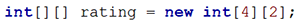

# JOBSHEET 11. ARRAY 2

## Tujuan
* Mahasiswa mampu memahami pembuatan array dua dimensi
* Mahasiswa mampu menyelesaikan studi kasus dengan memanfaatkan array dua dimensi

## Alat dan Bahan
* PC/Laptop
* Browser
* Koneksi internet
* Anaconda3 + Java kernel (opsional)

## Praktikum

### Percobaan 1: Deklarasi, Inisialisasi, dan Menampilkan Array 2 Dimensi
Pada Percobaan 1, kode program yang dibuat digunakan untuk menyimpan nilai praktikum dari 2 orang mahasiswa pada 3 mata kuliah yang berbeda.
1.	Buat array bertipe **integer** dengan nama **nilai** dengan kapasitas baris 2 elemen (menyatakan jumlah mahasiswa) dan kolom 3 elemen (menyatakan jumlah mata kuliah)


```Java
// Tuliskan kode program Percobaan 1 Langkah 1
int nilai[][] = new int[2][3];
```

2. Isi masing-masing elemen array **nilai** sebagai berikut:


```Java
// Tuliskan kode program Percobaan 1 Langkah 2
nilai[0][0] = 75;
nilai[0][1] = 90;
nilai[0][2] = 88;
nilai[1][0] = 79;
nilai[1][1] = 82;
nilai[1][2] = 67;
```


    67


3. Tampilkan semua isi elemen array **nilai**


```Java
// Tuliskan kode program Percobaan 1 Langkah 2
System.out.println(nilai[0][0] + " " + nilai[0][1] + " " + nilai[0][2]);
System.out.println(nilai[1][0] + " " + nilai[1][1] + " " + nilai[1][2]);
```

    75 90 88
    79 82 67


#### Pertanyaan
1. Apakah pengisian elemen array harus dilakukan secara berurutan mulai dari indeks 0? Jelaskan!


```Java
// Tuliskan jawaban nomor 1
tidak harus, kita bisa memasukkan mulai indeks 1 misalnya. Namun index 0 bernilai 0.
```

2. Lakukan modifikasi pada Percobaan 1 Langkah 3 untuk menampilkan semua isi elemen array **nilai** menggunakan perulangan *for*


```Java
// Tuliskan jawaban nomor 2
int nilai[][] = new int[2][3];
nilai[0][0] = 75;
nilai[0][1] = 90;
nilai[0][2] = 88;
nilai[1][0] = 79;
nilai[1][1] = 82;
nilai[1][2] = 67;
for (int x = 0; x < nilai.length; x++) {
    for(int y = 0; y < nilai[0].length; y++) {
        System.out.print(nilai[x][y] + " ");
    }
    System.out.println();
}
```

    75 90 88 
    79 82 67 


Alurnya adalah menginisialisasi array nilai kemudian melakukan perulangan untuk menampilkan isi array nilai.

### Percobaan 2: Mengisi Elemen Array 2 Dimensi Menggunakan Input Keyboard
Pada Percobaan 2, kode program yang dibuat digunakan untuk menyimpan nilai rating restoran yang terdaftar pada aplikasi pemesanan makanan online. Rating diberikan oleh 4 orang pengguna kepada 2 restoran yang terdaftar.
1. Import dan deklarasikan Scanner dengan nama **sc**


```Java
// Tuliskan kode program Percobaan 2 Langkah 1
import java.util.Scanner;
Scanner sc = new Scanner(System.in);
```

2.	Buat array bertipe **integer** dengan nama **rating** dengan kapasitas baris 4 elemen (menyatakan jumlah pengguna) dan kolom 2 elemen (menyatakan jumlah restoran)



```Java
// Tuliskan kode program Percobaan 2 Langkah 2
int rating[][] = new int[4][2];
```

3. Dengan menggunakan perulangan *for*, buat input untuk mengisi elemen array **rating**


```Java
//Tuliskan kode program Percobaan 2 Langkah 3
for (int i = 0; i < rating.length; i++){
    for (int j = 0; j < rating[0].length; j++){
        System.out.print("Masukkan rating pengguna " + i + " untuk restoran " + j + " : ");
        rating[i][j] = sc.nextInt();
    }
    System.out.println("");
}
```

    Masukkan rating pengguna 0 untuk restoran 0 : 6
    Masukkan rating pengguna 0 untuk restoran 1 : 7
    
    Masukkan rating pengguna 1 untuk restoran 0 : 8
    Masukkan rating pengguna 1 untuk restoran 1 : 5
    
    Masukkan rating pengguna 2 untuk restoran 0 : 6
    Masukkan rating pengguna 2 untuk restoran 1 : 9
    
    Masukkan rating pengguna 3 untuk restoran 0 : 9
    Masukkan rating pengguna 3 untuk restoran 1 : 9
    


4. Dengan menggunakan perulangan *for-each*, tampilkan semua isi elemen dari array **rating**


```Java
// Tuliskan kode program Percobaan 2 Langkah 4
for (int[] rtg : rating){
    for (int r : rtg){
        System.out.print(r + " ");
    }
    System.out.println("");
}
```

    6 7 
    8 5 
    6 9 
    9 9 


#### Pertanyaan
1. Pada Percobaan 2 Langkah 3, dapatkah posisi i ditukar dengan posisi j? Jelaskan alasannya!

// Tuliskan jawaban nomor 1

jika seluruhnya ditukar maka akan berhasil namun jika yang ditukar hanyalah pada bagian perulangan for saja maka akan muncul error karena jika sebelumnya i adalah baris dan j adalah kolom setelah ditukar maka menjadi j baris i kolom yang menyebabkan panjang index tidak sesuai.

2. Tambahkan kode program untuk menentukan banyaknya baris dan kolom elemen array secara dinamis (baris dan kolom ditentukan saat program berjalan melalui input keyboard)!


```Java
// Tuliskan jawaban nomor 2
// Tuliskan kode program Percobaan 2 Langkah 3
import java.util.Scanner;
Scanner sc = new Scanner(System.in);
int x, y;
System.out.print("Masukkan ada berapa pengguna : ");
x = sc.nextInt();
System.out.print("Masukkan ada berapa restoran : ");
y = sc.nextInt();
int rating[][] = new int[x][y];
for (int i = 0; i < rating.length; i++){
    for (int j = 0; j < rating[0].length; j++){
        System.out.print("Masukkan rating pengguna " + i + " untuk restoran " + j + " : ");
        rating[i][j] = sc.nextInt();
    }
    System.out.println("");
}
for (int[] rtg : rating){
    for (int r : rtg){
        System.out.print(r + " ");
    }
    System.out.println("");
}
```

    Masukkan ada berapa pengguna : 2
    Masukkan ada berapa restoran : 3
    Masukkan rating pengguna 0 untuk restoran 0 : 6
    Masukkan rating pengguna 0 untuk restoran 1 : 7
    Masukkan rating pengguna 0 untuk restoran 2 : 8
    
    Masukkan rating pengguna 1 untuk restoran 0 : 9
    Masukkan rating pengguna 1 untuk restoran 1 : 6
    Masukkan rating pengguna 1 untuk restoran 2 : 7
    
    6 7 8 
    9 6 7 


Alurnya adalah mengimport dan mendeklarasi scanner kemudian membuat variabel x dan y sebagai inputan baris dan kolom. Selanjutnya membuat array dengan baris x dan kolom y. Kemudian melakukaan perulangan untuk memasukkan rating pengguna sebanyak index array. Terakhir menggunakan perulangan untuk menampilkan isi array.

### Percobaan 3: Melakukan Operasi Aritmatika pada Elemen Array 2 Dimensi
Pada Percobaan 3, kode program yang dibuat digunakan untuk menghitung nilai rata-rata harga setiap bahan pokok selama 1 semester. Terdapat 3 bahan pokok yang dicatat harganya setiap akhir bulan. Program dibuat berdasarkan flowchart berikut.

1. Import dan deklarasikan Scanner dengan nama **sc**


```Java
// Tuliskan kode program Percobaan 3 Langkah 1
import java.util.Scanner;
Scanner sc = new Scanner(System.in);
```

2.	Buat array bertipe **integer** dengan nama **harga** dengan kapasitas baris 3 elemen (menyatakan jumlah bahan pokok) dan kolom 6 elemen (menyatakan jumlah bulan). Deklarasikan juga variabel **total** dan **rata** bertipe **double**


```Java
// Tuliskan kode program Percobaan 3 Langkah 2
int harga[][] = new int[3][6];
double total, rata;
total = 0;
rata = 0;
```

3. Dengan menggunakan perulangan *for*, buat input untuk mengisi elemen array **harga**. Kemudian, perhitungan total harga dilakukan untuk setiap bulan (kolom) pada setiap bahan pokok (baris). Setelah itu, nilai rata-rata dihitung untuk setiap bahan pokok (tiap satu baris) dan ditampilkan


```Java
// Tuliskan kode program Percobaan 3 Langkah 3
for (int i = 0; i < harga.length; i++){
    total = 0;
    rata = 0;
    for (int j = 0; j < harga[0].length; j++){
        System.out.printf("Masukkan harga[%d][%d]: ",i , j);
        harga[i][j] = sc.nextInt();
        total += harga[i][j];
    }
    rata = total / harga[0].length;
    System.out.printf("Rata-rata harga bahan ke%d adalah %.2f\n", i, rata);
}
```

    Masukkan harga[0][0]: 10000
    Masukkan harga[0][1]: 15000
    Masukkan harga[0][2]: 23000
    Masukkan harga[0][3]: 50000
    Masukkan harga[0][4]: 29000
    Masukkan harga[0][5]: 22000
    Rata-rata harga bahan ke0 adalah 24833.33
    Masukkan harga[1][0]: 20000
    Masukkan harga[1][1]: 23000
    Masukkan harga[1][2]: 20000
    Masukkan harga[1][3]: 20000
    Masukkan harga[1][4]: 19000
    Masukkan harga[1][5]: 20000
    Rata-rata harga bahan ke1 adalah 20333.33
    Masukkan harga[2][0]: 29000
    Masukkan harga[2][1]: 12200
    Masukkan harga[2][2]: 34200
    Masukkan harga[2][3]: 22300
    Masukkan harga[2][4]: 32300
    Masukkan harga[2][5]: 11000
    Rata-rata harga bahan ke2 adalah 23500.00


Alurnya adalah mengimport dan mendeklarasi scanner kemudian membuat array harga dengan 3 baris dan 6 kolom, membuat variabel total dan rata dan diinisialisasi. kemudian melakukan perulangan for untuk baris dan kemudian kolom yang didalamnya terdapat tempat input harga. Kemudian dilakukan perhitungan rata rata dan ditampilkan.

#### Pertanyaan
1. Jelaskan fungsi dari **rata = total / harga[0].length**!


```Java
// Tuliskan jawaban nomor 1
fungsinya untuk menghitung rata rata dengan total dari harga dibagi jumlah baris harga.
```

2. Mengapa insialisasi variabel **total = 0** dan **rata = 0** berada di dalam perulangan *for* yang pertama? Menurut Anda, apa yang terjadi jika inisialisasi kedua variabel tersebut diletakkan di luar perulangan *for* (setelah deklarasi array)?

// Tuliskan jawaban nomor 2

Jika diletakkan setelah deklarasi array maka hasilnya akan error karena kedua variabel tersebut belum dideklarasi. Namun jika diletakkan setelah deklarasi variabel maka bisa berhasil.

## Tugas

1. Perhatikan flowchart berikut.

Buat kode program sesuai dengan flowchart tersebut untuk mencari suhu tertinggi yang dicatat dari 5 kota di Jepang selama 7 hari berturut-turut!


```Java
// Tuliskan jawaban nomor 1
import java.util.Scanner;
Scanner in = new Scanner(System.in);
double suhu[][] = new double[5][7];
int x, y;
double max = 0;
for (x = 0; x < suhu.length; x++){
    for (y = 0; y < suhu[0].length; y++){
        System.out.printf("Masukkan suhu kota [%d] hari ke [%d]: ",x+1 , y+1);
        suhu[x][y] = in.nextInt();
        if(suhu[x][y] > max){
            max = suhu[x][y];
        }
    }
    System.out.printf("Suhu tertinggi adalah %.2f\n", max);
    max = 0;
}
```

    Masukkan suhu kota [1] hari ke [1]: 14
    Masukkan suhu kota [1] hari ke [2]: 21
    Masukkan suhu kota [1] hari ke [3]: 32
    Masukkan suhu kota [1] hari ke [4]: 12
    Masukkan suhu kota [1] hari ke [5]: 34
    Masukkan suhu kota [1] hari ke [6]: 11
    Masukkan suhu kota [1] hari ke [7]: 10
    Suhu tertinggi adalah 34.00
    Masukkan suhu kota [2] hari ke [1]: 18
    Masukkan suhu kota [2] hari ke [2]: 19
    Masukkan suhu kota [2] hari ke [3]: 20
    Masukkan suhu kota [2] hari ke [4]: 22
    Masukkan suhu kota [2] hari ke [5]: 43
    Masukkan suhu kota [2] hari ke [6]: 21
    Masukkan suhu kota [2] hari ke [7]: 11
    Suhu tertinggi adalah 43.00
    Masukkan suhu kota [3] hari ke [1]: 33
    Masukkan suhu kota [3] hari ke [2]: 32
    Masukkan suhu kota [3] hari ke [3]: 14
    Masukkan suhu kota [3] hari ke [4]: 51
    Masukkan suhu kota [3] hari ke [5]: 41
    Masukkan suhu kota [3] hari ke [6]: 31
    Masukkan suhu kota [3] hari ke [7]: 22
    Suhu tertinggi adalah 51.00
    Masukkan suhu kota [4] hari ke [1]: 12
    Masukkan suhu kota [4] hari ke [2]: 34
    Masukkan suhu kota [4] hari ke [3]: 54
    Masukkan suhu kota [4] hari ke [4]: 13
    Masukkan suhu kota [4] hari ke [5]: 23
    Masukkan suhu kota [4] hari ke [6]: 11
    Masukkan suhu kota [4] hari ke [7]: 25
    Suhu tertinggi adalah 54.00
    Masukkan suhu kota [5] hari ke [1]: 12
    Masukkan suhu kota [5] hari ke [2]: 43
    Masukkan suhu kota [5] hari ke [3]: 53
    Masukkan suhu kota [5] hari ke [4]: 12
    Masukkan suhu kota [5] hari ke [5]: 54
    Masukkan suhu kota [5] hari ke [6]: 43
    Masukkan suhu kota [5] hari ke [7]: 11
    Suhu tertinggi adalah 54.00


Alurnya adalah mengimport dan mendeklarasi scanner kemudian membuat array suhu dengan tipe data double dengan 5 baris dan 7 kolom. kemudian membuat variabel x dan y dgn tipe data integer dan max dengan tipe data double. selanjutnya melakukan perulangan yang kemudian membuat input suhu. kemudian membuat pemilihan untuk mencari suhu max. yang terakhir membuat keluaran suhu tertinggi. Agar setiap 7 hari dapat mengeluarkan suhu tertinggi ditambahkan max = 0 agar variabel max ter reset.

2. Terdapat hasil pencatatan data lima mahasiswa yang berisi informasi mengenai umur, berat badan (kg), dan tinggi badan (cm). Data tersebut disimpan ke dalam array dua dimensi.

*Keterangan: penyimpanan nilai dapat dilakukan melalui inisialisasi menggunakan operator assignment*
 * Tampilkan *berat badan terendah* di antara kelima mahasiswa tersebut
 * Tampilkan *rata-rata tinggi badan* dari kelima mahasiswa tersebut
 * Tampilkan nama mahasiswa dengan *umur tertua* di antara kelima mahasiswa tersebut


```Java
// Tuliskan jawaban nomor 2
import java.util.Scanner;
Scanner in = new Scanner(System.in);
String nama[] = {"Desi", "Rofan", "Lala", "Beky", "Ega"};
int data[][] = {
    {19, 51, 155},
    {18, 55, 163},
    {18, 45, 153},
    {20, 46, 158},
    {19, 58, 160}
};
int min = 100, tertua = 0;
String nTua;
double rata, total;
for (int a = 0; a < data.length; a++){
    for (int b = 1; b < data[0].length-1; b++){
        if(data[a][b] < min){
            min = data[a][b];
        }
        if(data[a][0] > tertua){
            tertua = data[a][0];
            nTua = nama[a];
        }
    }
    total += data[a][2];
}
System.out.printf("Berat badan terendah adalah %d kg\n", min);
rata = total / data[0].length;
System.out.printf("Rata-rata tinggi badan adalah %.2f\n", rata);
System.out.print("Mahasiswa tertua ialah : " + nTua);
```

    Berat badan terendah adalah 45 kg
    Rata-rata tinggi badan adalah 263.00
    Mahasiswa tertua ialah : Beky

Alurnya adalah mengimport dan mendeklarasi scanner kemudian membuat array nama dan data dan diisi. selanjutnya membuat variabel min dengan inisialisasi var 100 dan tertua mennggunakan tipe data integer. Kemudian variabel nama tertua (nTua) menggunakan tipe data string dan rata, total menggunakan tipe data double. Memulai perulangan untuk mencari berat badan terendah, kemudian mahasiswa tertua. Menghitung total dengan menambahkan semua tinggi. yang terakhir adalah membuat keluaran berat badan terendah, rata rata dengan rumus total dibagi banyak data, dan nama mahasiswa tertua
